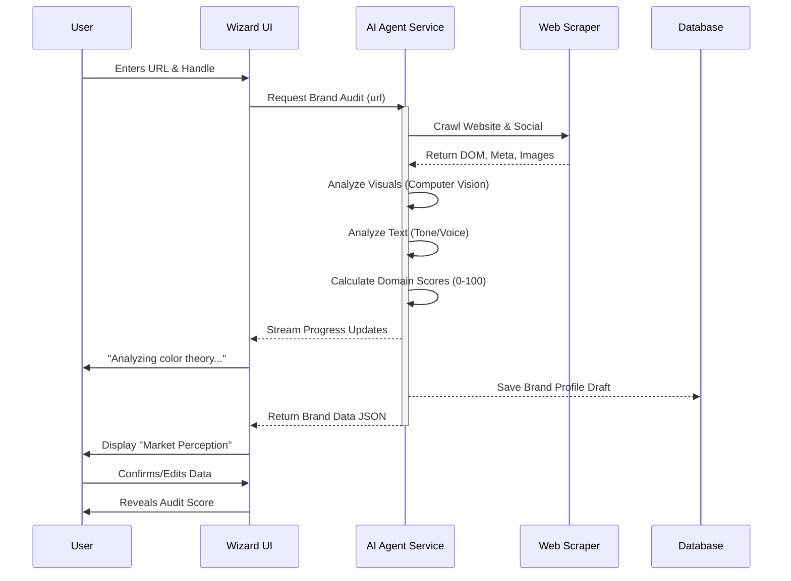
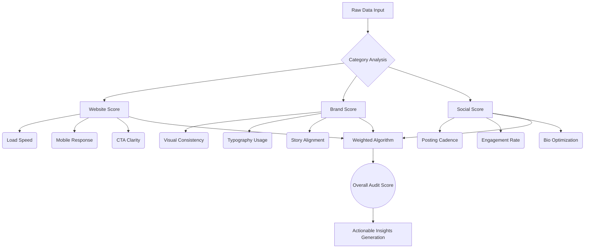

# 016 - Brand Designer Wizard & Audit System

**Project:** FashionOS  
**Module:** Brand Onboarding & AI Audit  
**Status:** Implemented  
**Date:** December 14, 2025  

## 1. Overview
The **Brand Designer Wizard** is the primary entry point for new fashion brands joining FashionOS. It replaces traditional long-form data entry with an "AI-First" approach: users provide minimal signals (links), and the system generates a comprehensive brand profile and health audit.

**Core Philosophy:** "Luxury Utility" — High function disguised as minimal, high-fashion editorial design.

---

## 2. User Flow & Screen Architecture

### Step 1: Create Your Brand Profile (Input)
*The entry point. Minimalist, focused, low friction.*

*   **Layout:** Centered single card on neutral canvas.
*   **Tagline:** "Paste your links. We'll do the work."
*   **Micro-copy:** "Free AI brand audit included."
*   **Input Fields:**
    *   **Brand Name:** (Text)
    *   **Website URL:** (Validation: Must be active URL)
    *   **Instagram Handle:** (Text: @handle)
*   **Primary Action:** "Analyze My Brand" (Black Pill Button).
*   **Motion:** Smooth fade-in up (`y: 20 -> 0`).

### Step 2: Analyzing Your Brand DNA (Scanning)
*The "Magic" moment. Visualizes the AI working to build trust and mask latency.*

*   **Layout:** Central status card with progress visualization.
*   **Visuals:**
    *   Rotating radar/scan icon.
    *   Progress bar (0-100%).
    *   Dynamic text updates.
*   **Text Sequence (Looping):**
    1.  "Scanning website architecture..."
    2.  "Analyzing brand visuals & color theory..."
    3.  "Comparing market positioning..."
    4.  "Finalizing audit scores..."
*   **Animation:** Pulse effects, smooth ease-out progress filling.

### Step 3: How the Market Sees Your Brand (Analysis/Review)
*The verification step. Users confirm the AI's interpretation of their brand.*

*   **Layout:** Split view (2/3 Data, 1/3 Action).
*   **Header:** "How the Market Sees Your Brand."
*   **Subtitle:** "We analyzed your website, collections, and public market signals..."
*   **Editable AI Data Points:**
    *   **Market Category:** (e.g., "Contemporary Womenswear")
    *   **Aesthetic DNA:** (Tag cloud: "Minimalist", "Sustainable", "Structural")
    *   **Price Positioning:** ($$ - $$$)
    *   **Brand Palette:** (Extracted Hex codes)
    *   **Visual Evidence:** Accordion showing "12 market signals" found.
*   **Imagery:** Collections grid fetched from the website.

### Step 4: Brand Audit Overview (The Reveal)
*The value delivery. High-fidelity scoring and actionable insights.*

*   **Layout:** Dashboard Grid (Bento box style).
*   **Core Component:** **The Overall Score Ring**.
    *   SVG animated stroke.
    *   Large serif number (0-100).
    *   Status Label (e.g., "Good - Improving").
*   **Domain Score Cards (2x2 Grid):**
    1.  **Website Score:** UX, Speed, Conversion.
    2.  **Social Score:** Engagement, Consistency.
    3.  **Brand Score:** Story, Visuals, Positioning.
    4.  **E-commerce:** Checkout, Product Presentation.
*   **Interactions:** Hover cards to reveal specific bullet-point insights (Positive/Neutral/Negative).

### Step 5: Brand Health Timeline
*Contextualizing the score in time.*

*   **Layout:** Vertical timeline list.
*   **Components:**
    *   **Current Milestone:** Active update (e.g., "Visual Merchandising Update").
    *   **Before/After Visuals:** Side-by-side comparison thumbnails showing improvement.
    *   **Past Milestones:** Faded history entries.
*   **Goal:** Show that the score is dynamic and improves with platform usage.

### Step 6: Brand Profile Dashboard
*The persistent state after the wizard is complete.*

*   **Layout:** Full "Command Center."
*   **Widgets:**
    *   Live Score Monitor.
    *   Priority Action List (High/Medium/Low).
    *   Quick Edit Profile.
    *   Competitor Tracking.

---

## 3. Style Guide & Visual System

### Color Palette
| Token | Hex | Usage |
| :--- | :--- | :--- |
| **Canvas** | `#F9F9F7` | Main app background (Warm Grey/Bone) |
| **Surface** | `#FFFFFF` | Cards, modals, inputs |
| **Ink** | `#1A1A1A` | Primary text, Primary buttons |
| **Subtle** | `#737373` | Secondary text, borders |
| **Success** | `#10B981` | High scores (>80), Positive insights |
| **Warning** | `#F59E0B` | Medium scores (60-79), Neutral insights |
| **Critical** | `#E11D48` | Low scores (<60), Negative insights |
| **Accent** | `#D4AF37` | Luxury touches (Gold), Selected states |

### Typography
*   **Headings:** `Playfair Display` (Serif). Used for "Brand Audit Overview", Scores, and large titles.
*   **Body/UI:** `Inter` (Sans-serif). Used for data, labels, buttons, and detailed text.

### Imagery Strategy
*   **Editorial:** Use high-fashion, high-contrast photography.
*   **Data Visualization:** Minimalist charts, thin stroke rings.
*   **Icons:** `Lucide React` (Thin stroke width: 1.5px).

---

## 4. Workflows & Technical Diagrams

### Sequence Diagram: AI Analysis Flow

### Flowchart: Scoring Logic

## 5. Content Strategy & Copywriting

**Voice:** Professional, Insightful, Direct, "Fashion-Tech."

**Key Taglines:**
*   *Input:* "Paste your links. We'll do the work."
*   *Loading:* "Decoding your digital footprint."
*   *Analysis:* "How the market sees your brand."
*   *Audit:* "AI-evaluated readiness across key growth areas."

**Insight Pattern:**
*   **Bad:** "Your images are slow."
*   **Good (FashionOS):** "Heavy image assets are impacting mobile load times by 1.2s."
