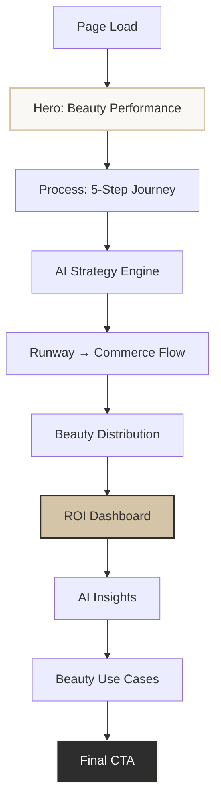
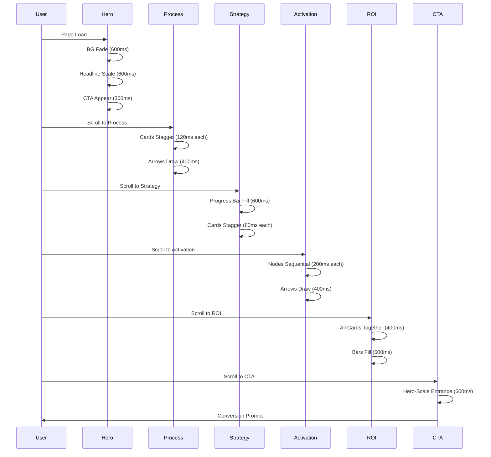
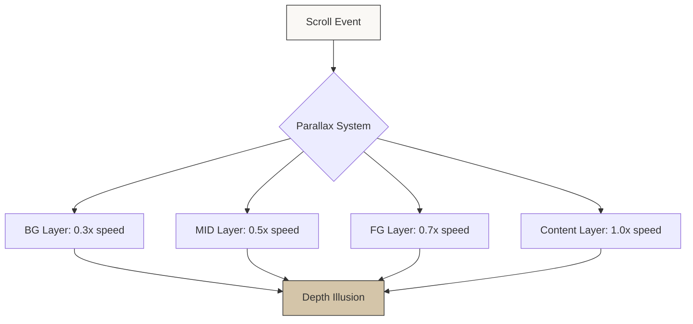
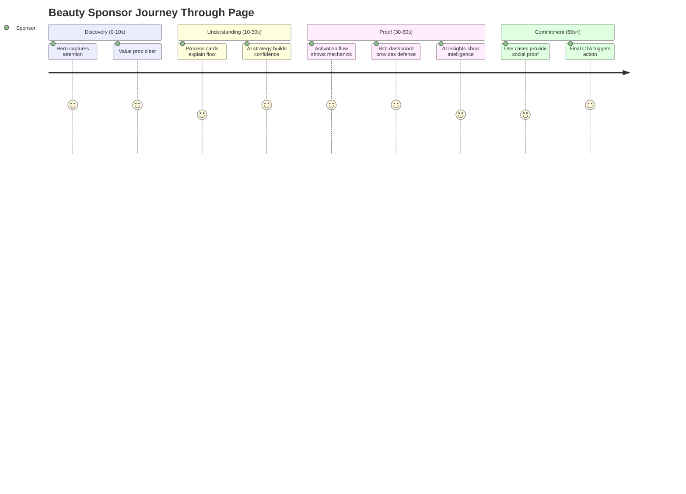
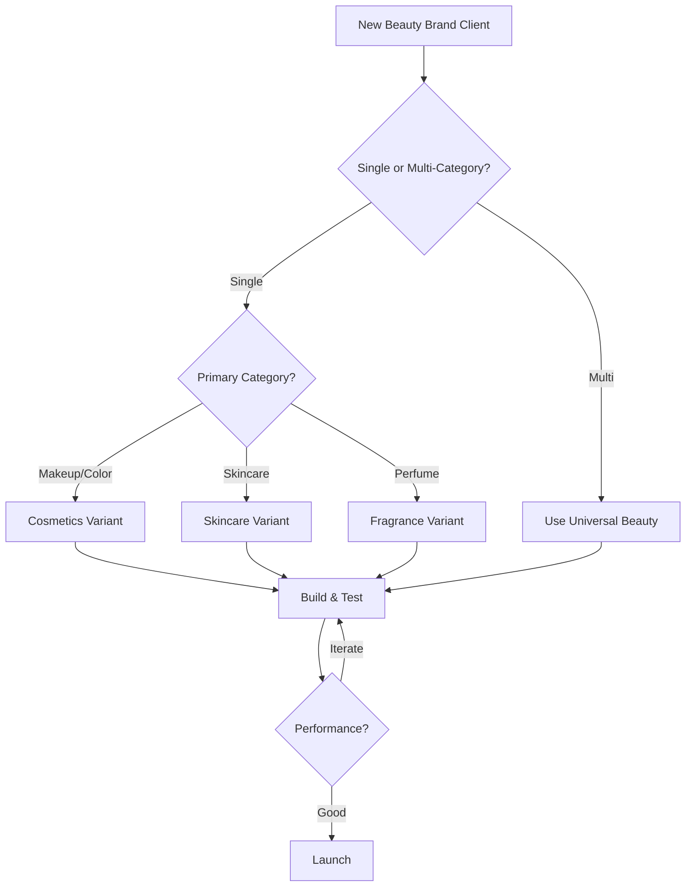

# FashionOS — Beauty Sponsorship System
## Figma Make AI Multi-Step Prompts Collection
### Luxury SaaS • Beauty-First • Performance-Driven

---

# TABLE OF CONTENTS

1. [Universal Beauty Prompt](#1-universal-beauty-prompt)
2. [Cosmetics & Makeup Variant](#2-cosmetics--makeup-variant)
3. [Skincare & Wellness Variant](#3-skincare--wellness-variant)
4. [Fragrance & Perfume Variant](#4-fragrance--perfume-variant)
5. [Cross-Category Implementation Guide](#5-cross-category-implementation-guide)

---

# 1. UNIVERSAL BEAUTY PROMPT
## Foundation for All Beauty Variants

---

## STEP 0: BRAND INTELLIGENCE CONTEXT

**Target Audience:**
- Beauty brand CMOs, Marketing Directors, Growth Teams
- Cosmetics, skincare, fragrance brands (indie → enterprise)
- Event sponsorship decision-makers
- Performance marketing teams

**Core Pain Points:**
- Sponsorship ROI unclear
- Beauty moments don't connect to sales
- Influencer impact unmeasured
- Product discovery fragmented
- Shade/variant performance unknown

**FashionOS Solution:**
- Transform runway beauty into measurable commerce
- Connect makeup artist moments to product tags
- Track shade-level performance
- Automate creator content
- Prove sponsor ROI pre-launch

---

## STEP 1: GLOBAL PAGE SETUP

### Canvas Configuration
```
Desktop Frame: 1440px width
Height: Auto (7200–8400px vertical scroll)
Max Content Width: 1200px
Grid: 12 columns
Column Gap: 24px
Outer Margins: 96px (desktop) / 24px (mobile)
Section Spacing: 160px vertical
```

### Design System Tokens

**Colors — Beauty Luxury Palette:**
```
Background: #FAF8F5 (warm ivory)
Primary Text: #2D2D2D (charcoal)
Secondary Text: #706F6C (warm gray)
Accent Primary: #D4C5A9 (nude gold)
Accent Secondary: #E8D5C4 (soft rose)
Border: #E5E1DA (subtle sand)
Shadow: rgba(45, 45, 45, 0.08)
```

**Typography:**
```
H1: 64px, Editorial Serif (Playfair / Canela / Orpheus)
H2: 48px, Serif
H3: 32px, Sans (Inter / Neue Haas / Suisse)
Body: 18px, Sans, line-height 1.6
Caption: 14px, Sans, 0.7 opacity
Letter Spacing: -0.02em (headlines), 0 (body)
```

**Spacing Scale:**
```
XS: 4px
S: 8px
M: 16px
L: 24px
XL: 40px
XXL: 64px
XXXL: 96px
```

---

## STEP 2: GLOBAL MOTION SYSTEM

### Animation Philosophy
> "Motion explains beauty value transformation — never decorative"

### Motion Tokens
```typescript
const motion = {
  // Timing
  instant: 150,      // Micro-interactions (hover)
  fast: 250,         // UI feedback (click)
  standard: 400,     // Content reveals
  slow: 600,         // Hero moments
  cinematic: 800,    // Section transitions
  
  // Easing
  easeOut: [0.22, 1, 0.36, 1],        // Luxury entrance
  easeIn: [0.32, 0, 0.67, 0],         // Quick exit
  elastic: [0.68, -0.55, 0.265, 1.55], // Subtle bounce (CTAs)
  
  // Transforms
  lift: { y: -4 },
  fadeIn: { y: 16, opacity: 0 },
  scaleInactive: 0.98,
  scaleActive: 1.0,
  
  // Parallax Layers
  background: 0.3,    // Slowest (30% scroll speed)
  midground: 0.5,     // Medium depth
  foreground: 0.7,    // Near-normal
  content: 1.0        // Anchored to scroll
}
```

### Smart Animate Rules
```
1. All transitions use Smart Animate (no timeline animations)
2. Layer names must match exactly across frames
3. Maximum Y movement: 16px (except parallax: 56px)
4. Use Auto Layout for all containers
5. Opacity transitions: 0 → 1 only (no mid-values)
6. Scale transitions: 0.98 → 1.0 max range
```

---

## STEP 3: PAGE ROUTES & NAVIGATION

### Primary Route
```
/sponsors/beauty
Title: Beauty Sponsorship Performance | FashionOS
Meta: Turn beauty moments into measurable revenue
```

### Category Routes (Create Later)
```
/sponsors/cosmetics
/sponsors/skincare
/sponsors/fragrance
```

### Footer Links Structure
```
Beauty Sponsors
├── Beauty Playbook
├── Case Studies
├── Sponsor Dashboard
└── Start Strategy

Resources
├── ROI Calculator
├── Event Calendar
└── Beauty Metrics Guide
```

### Navigation Highlight
```
Primary Nav: Sponsors → Beauty
Breadcrumb: Home / Sponsors / Beauty
```

---

## STEP 4: HERO SECTION — "BEAUTY PERFORMANCE"

### Frame Setup
```
Name: Hero / Beauty Performance
Height: 900px (desktop) / 720px (tablet) / 640px (mobile)
Layout: Center-aligned, vertical composition
```

### Layer Structure (EXACT — Critical for Smart Animate)
```
Hero / Beauty Performance
├── BG_Beauty_Atmosphere
│   └── Image: Editorial backstage beauty shot
├── MID_System_Beam
│   └── Vector: Vertical light beam (1px, soft glow)
├── FG_Beauty_Message
    ├── Badge: "For Beauty Brands"
    ├── Headline
    ├── Subhead
    ├── CTA_Primary
    └── CTA_Secondary
```

### Content
```
Badge: FOR BEAUTY BRANDS

Headline:
Turn Beauty Sponsorship
into Sell-Through

Subhead:
FashionOS connects runway beauty moments, creators,
and commerce into one measurable system.

Primary CTA: Start Beauty Strategy
Secondary CTA: See How It Works ↓
```

### Background Image Specifications
```
Type: Editorial beauty photography
Style: Backstage / makeup artist moment
Composition: Vertical, centered
Treatment:
- Slight desaturation (85% saturation)
- Soft blur (Gaussian 2px)
- Film grain overlay (3% opacity)
- Gradient overlay: radial fade from center
Color Tone: Warm, skin-tone accurate
Aspect Ratio: 16:9 cropped to center 60%
```

### Motion Sequence (3 Frames)

**Frame 01 — Load State**
```
Name: Hero / 01_Load
BG_Beauty_Atmosphere: opacity 0
MID_System_Beam: opacity 0
FG_Beauty_Message: opacity 0, y +24px
Badge: opacity 0
```

**Frame 02 — Context Arrival**
```
Name: Hero / 02_Context
BG_Beauty_Atmosphere: opacity 1 (600ms ease-out)
MID_System_Beam: opacity 0.12 (800ms ease-out, +200ms delay)
Badge: opacity 1, scale 0.95 → 1 (400ms)
```

**Frame 03 — Message Reveal**
```
Name: Hero / 03_Message
Headline: opacity 1, scale 0.98 → 1 (600ms)
Subhead: y +12 → 0, opacity 0 → 1 (400ms, +150ms delay)
CTA_Primary: y +8 → 0, opacity 0 → 1 (300ms, +300ms delay)
CTA_Secondary: opacity 0 → 1 (250ms, +450ms delay)
```

### Prototype Connections
```
Hero / 01_Load → Hero / 02_Context
- Trigger: After Delay (200ms)
- Animation: Smart Animate
- Duration: 600ms
- Easing: Ease Out

Hero / 02_Context → Hero / 03_Message
- Trigger: After Delay (300ms)
- Animation: Smart Animate
- Duration: 400ms
- Easing: Ease Out
```

### Parallax Implementation (On Scroll)
```
Create 4 duplicate frames: Hero_Scroll_01 → Hero_Scroll_04

Movement per frame (Y-axis):
BG_Beauty_Atmosphere: +12px per frame (slowest)
MID_System_Beam: +24px per frame
FG_Beauty_Message / Headline: +40px per frame
FG_Beauty_Message / CTAs: +48px per frame (fastest)

Prototype:
- Connect frames with On Drag (Vertical)
- Animation: Smart Animate
- Duration: 300ms
- Easing: Linear (parallax requires linear for smooth scroll feel)
```

### Micro-Interactions

**CTA_Primary (Component with Variants)**
```
Variants:
├── Default
│   ├── Background: #2D2D2D
│   ├── Text: #FAF8F5
│   ├── Padding: 16px 32px
│   └── Border Radius: 4px
├── Hover
│   ├── y: -4px
│   ├── Shadow: 0 8 24 rgba(45,45,45,0.12)
│   └── Underline: scaleX 0 → 1 (250ms)
└── Pressed
    ├── Scale: 0.98
    ├── Opacity: 0.92
    └── y: +2px

Interactions:
- Default → Hover: While Hovering
- Hover → Pressed: On Click
- Pressed → Default: On Release
- All: Smart Animate, 150-250ms
```

**CTA_Secondary (Text Link)**
```
Variants:
├── Default
│   └── Underline: 1px, opacity 0.3
└── Hover
    └── Underline: opacity 1, y -2px

Arrow icon: Rotate 90° on hover (250ms)
```

---

## STEP 5: SECTION — HOW BEAUTY SPONSORSHIP WORKS

### Frame
```
Name: Section / Process
Height: 1200px
Layout: Horizontal scroll stepper
```

### Section Header
```
Badge: THE PROCESS
Headline: How Beauty Sponsorship Works
Subhead: From discovery to measurable ROI in 5 steps
```

### Process Cards (5 Cards — Horizontal Flow)

**Card Structure (Each):**
```
Card Container: 400px × 520px
Padding: 40px
Border: 1px solid #E5E1DA
Border Radius: 8px
Background: #FFFFFF
Hover Shadow: 0 4 24 rgba(45,45,45,0.06)

Layout:
├── Step Badge (outlined circle, 48px)
├── Icon (beauty-specific, 32px, line style)
├── Card Title (24px, serif)
├── Description (16px, 3-4 bullets)
└── Arrow to Next (if not last card)
```

**Card 01 — Discover Beauty Moments**
```
Icon: Magnifying glass with makeup brush
Badge: 01

Title: Discover Beauty Moments

Bullets:
• Runway & backstage beauty moments
• Audience demographics & preferences
• Product & shade opportunity analysis

Color Accent: Soft rose (#E8D5C4)
```

**Card 02 — AI Builds Beauty Strategy**
```
Icon: Brain with sparkles
Badge: 02

Title: AI Builds Beauty Strategy

Bullets:
• Product & shade analysis
• Creator & MUA matching
• Pre-launch conversion forecast

Color Accent: Nude gold (#D4C5A9)
```

**Card 03 — Activate on Runway & Backstage**
```
Icon: Runway figure with product tag
Badge: 03

Title: Activate on Runway & Backstage

Bullets:
• Get-the-Look product tagging
• Artist & influencer content capture
• Live shopping experiences

Color Accent: Charcoal (#2D2D2D)
```

**Card 04 — Measure Beauty Performance**
```
Icon: Bar chart with beauty product
Badge: 04

Title: Measure Beauty Performance

Bullets:
• Engagement by product & shade
• Creator content impact
• Channel attribution & conversion

Color Accent: Warm gray (#706F6C)
```

**Card 05 — Optimize & Relaunch**
```
Icon: Circular arrows with upward trend
Badge: 05

Title: Optimize & Relaunch

Bullets:
• Best-performing looks identified
• Automated retargeting strategy
• Next-show optimization plan

Color Accent: Nude gold (#D4C5A9)
```

### Motion System — Scroll-Activated Cards

**Inactive State (All Cards Start Here):**
```
Opacity: 0.4
Scale: 0.98
Shadow: none
```

**Active State (One at a Time):**
```
Opacity: 1
Scale: 1.0
Shadow: 0 4 16 rgba(45,45,45,0.06)
Border: 2px solid #D4C5A9 (accent color)
```

**Arrow Drawing Animation:**
```
SVG Arrow between cards
Path: strokeDashoffset 100 → 0
Duration: 400ms
Delay: Staggered by card activation
```

### Prototype Logic
```
Create frames for each active state:
- Process_01_Active (Card 01 highlighted)
- Process_02_Active (Card 02 highlighted)
- Process_03_Active (Card 03 highlighted)
- Process_04_Active (Card 04 highlighted)
- Process_05_Active (Card 05 highlighted)

Connect with On Scroll:
- Trigger: On Scroll (horizontal)
- Animation: Smart Animate
- Duration: 400ms
- Easing: Ease Out

Stagger Entrance (Initial Load):
cards.forEach((card, index) => {
  delay: index * 120ms
  y: 16 → 0
  opacity: 0 → 1
})
```

---

## STEP 6: SECTION — BEAUTY STRATEGY ENGINE

### Frame
```
Name: Section / AI Strategy
Height: 800px
Background: Soft gradient (ivory → nude)
```

### Section Header
```
Badge: AI-POWERED
Headline: Your Beauty Strategy, Built Before the Show
Subhead: AI analyzes your brand, products, and audience to build a performance-ready sponsor plan
```

### Content Cards (3 Horizontal Cards)

**Card 01 — Product & Shade Analysis**
```
Icon: Color palette with AI sparkle
Title: Product & Shade Analysis
Description: AI analyzes your catalog, identifies hero products, and maps shade families to audience preferences

Visual Element: Mini color swatches (5-6 circles)
Metric Preview: "12 SKUs recommended"
```

**Card 02 — Creator & MUA Recommendations**
```
Icon: Person with verified badge
Title: Creator & MUA Matching
Description: AI matches your brand with makeup artists, influencers, and content creators aligned to your aesthetic

Visual Element: Small avatar grid (4 profiles)
Metric Preview: "8 creators matched"
```

**Card 03 — Forecasted Sales Lift**
```
Icon: Upward trending graph
Title: Pre-Launch ROI Projection
Description: See projected reach, engagement, and revenue before committing to sponsorship

Visual Element: Simple bar chart
Metric Preview: "3.2× projected ROI"
```

### Motion — AI Analysis Simulation

**Progress Bar:**
```
Width: 100% of section
Height: 4px
Background: #E5E1DA
Fill Color: #D4C5A9

Animation:
scaleX: 0 → 1
Duration: 600ms
Delay: 200ms (after section enters viewport)
Transform Origin: left
```

**Card Stagger Entrance:**
```
Card 01: delay 0ms
Card 02: delay 80ms
Card 03: delay 160ms

Each card:
y: 16 → 0
opacity: 0 → 1
duration: 400ms
```

---

## STEP 7: SECTION — RUNWAY → BEAUTY COMMERCE FLOW

### Frame
```
Name: Section / Activation Flow
Height: 1000px
Layout: Horizontal flow diagram
```

### Section Header
```
Headline: From Look to Checkout
Subhead: See how beauty moments become measurable sales
```

### Flow Diagram Nodes (Horizontal)

**Node 01 — Runway Moment**
```
Shape: Rounded rectangle (240px × 180px)
Image: Runway beauty close-up
Label: "Runway Look"
Icon: Camera
```

**Connector Arrow 01**
```
Style: Curved path, 2px stroke
Color: #D4C5A9
Length: 80px
Animation: strokeDashoffset 100 → 0 (400ms)
```

**Node 02 — Product Tag**
```
Shape: Rounded rectangle
Icon: Tag with product
Label: "Beauty Product Tagged"
Detail: "Shade: Nude 04"
Visual: Small product thumbnail
```

**Connector Arrow 02**

**Node 03 — Creator Content**
```
Icon: Video camera
Label: "Creator Get-the-Look"
Detail: "MUA tutorial captured"
Visual: Video thumbnail frame
```

**Connector Arrow 03**

**Node 04 — Mobile Experience**
```
Icon: Mobile phone
Label: "Mobile Engagement"
Detail: "Instagram / WhatsApp"
Visual: Mobile screen mockup
```

**Connector Arrow 04**

**Node 05 — Shopify Checkout**
```
Icon: Shopping bag
Label: "Shopify Checkout"
Detail: "Purchase completed"
Visual: Checkout confirmation
```

### Metrics Below Flow
```
Small badges beneath each node:
Node 01: "2.4M impressions"
Node 02: "180K product views"
Node 03: "42K creator views"
Node 04: "12K clicks"
Node 05: "1,247 purchases"

Style: 12px, #706F6C, pill-shaped background
```

### Motion Sequence
```
Sequence:
1. Node 01 fades in (0ms delay)
2. Arrow 01 draws (200ms delay)
3. Node 02 fades in (400ms delay)
4. Arrow 02 draws (600ms delay)
5. Node 03 fades in (800ms delay)
... continue pattern

Each node:
- y: 12 → 0
- opacity: 0 → 1
- duration: 400ms

All arrows:
- strokeDashoffset: 100 → 0
- duration: 400ms

Metrics fade together (no stagger):
- opacity: 0 → 1
- duration: 300ms
- delay: After all nodes visible
```

---

## STEP 8: SECTION — BEAUTY DISTRIBUTION CHANNELS

### Frame
```
Name: Section / Distribution
Height: 600px
Background: White card on ivory
```

### Section Header
```
Headline: Amplify Beyond the Show
Subhead: Beauty content automatically distributed across all channels
```

### Channel Icons (Horizontal Row)

**Channels (6):**
```
01. Instagram Reels
02. TikTok
03. WhatsApp Drops
04. Email Campaigns
05. Retargeting Ads
06. Creator Platforms

Each icon:
- Size: 64px × 64px
- Style: Line icons, minimal
- Color: #2D2D2D
- Hover: Scale 1.05, color → #D4C5A9
```

### Content Automation Card (Center)
```
Background: #FAF8F5
Border: 1px solid #E5E1DA
Padding: 32px
Border Radius: 8px

Content:
Icon: Magic wand with content
Headline: "Post-Show Beauty Content Auto-Generated"
Description: "AI creates platform-specific content from runway moments — no manual editing required"

Visual: Small carousel preview (3 content types)
```

### Motion
```
Icons appear in wave:
delay: index * 60ms
y: 8 → 0
opacity: 0 → 1
duration: 300ms

Center card:
delay: 400ms (after icons)
scale: 0.98 → 1
opacity: 0 → 1
duration: 400ms
```

---

## STEP 9: SECTION — BEAUTY ROI DASHBOARD

### Frame
```
Name: Section / ROI Dashboard
Height: 900px
Background: White
```

### Section Header
```
Headline: Beauty Performance Metrics
Subhead: Real-time dashboards show exactly which products, shades, and creators drive revenue
```

### KPI Cards (2×2 Grid)

**Card 01 — Reach by Product**
```
Icon: Eye with product
Metric: 2.4M
Label: Total Impressions
Sub-metric: "Top: Lipstick Nude 04 (640K)"
Bar Chart: Horizontal bars for top 5 products
```

**Card 02 — Engagement by Shade**
```
Icon: Heart with color palette
Metric: 18.3%
Label: Engagement Rate
Sub-metric: "Best: Foundation Shade 6 (24.1%)"
Visual: Color swatch grid with percentages
```

**Card 03 — Sales by Channel**
```
Icon: Shopping cart with paths
Metric: 1,247
Label: Attributed Purchases
Sub-metric: "Top: Instagram Stories (612)"
Bar Chart: Channel comparison
```

**Card 04 — ROI Multiple**
```
Icon: Money with upward arrow
Metric: 4.2×
Label: Return on Investment
Sub-metric: "$87K revenue / $21K spend"
Visual: Simple ROI calculation
```

### Additional Metrics (Below Grid)

**Horizontal Bars:**
```
Product Attribution Confidence: 94%
Creator Effectiveness Score: 8.7/10
Shade Discovery Rate: 31%

Each bar:
- Background: #E5E1DA
- Fill: #D4C5A9
- Height: 8px
- Border Radius: 4px
- Fill animation: scaleX 0 → actual value
```

### Motion System

**All Cards Fade Together (Cohesive Data Display):**
```
No stagger — data feels unified

Cards:
- opacity: 0 → 1
- y: 12 → 0
- duration: 400ms
- easing: ease-out

Bars fill sequentially:
- scaleX: 0 → value
- duration: 600ms
- delay: 200ms (after cards visible)
- transform-origin: left
```

**Card Hover Micro-Interaction:**
```
Hover State:
- y: -4px
- shadow: 0 8 24 rgba(45,45,45,0.08)
- duration: 200ms
```

---

## STEP 10: SECTION — AI BEAUTY INSIGHTS

### Frame
```
Name: Section / AI Insights
Height: 700px
Background: Soft gradient (nude → ivory)
```

### Section Header
```
Badge: INTELLIGENT OPTIMIZATION
Headline: AI Beauty Insights
Subhead: Continuous learning identifies patterns and recommendations
```

### Insight Cards (3 Stacked with Slight Rotation)

**Card 01 — Performance Insight**
```
Rotation: -2°
Icon: Trending up
Title: "Best Performing Shade"
Insight: "Foundation Shade 6 drove 31% more engagement than predicted"
Action: "Recommend featuring in next activation"
Background: White
Shadow: Subtle soft shadow
```

**Card 02 — Creator Insight**
```
Rotation: 0°
Icon: Star with person
Title: "Top Creator Impact"
Insight: "@beautyartist_maya generated 4.8× average engagement rate"
Action: "Suggest long-term partnership"
Background: White
```

**Card 03 — Timing Insight**
```
Rotation: 2°
Icon: Clock with upward arrow
Title: "Recommended Re-Activation Window"
Insight: "Optimal next sponsor: 6-8 weeks (based on brand cycle)"
Action: "Auto-suggest event matches"
Background: White
```

### Motion — Subtle Ambient Float

**Entrance:**
```
Cards appear with rotation:
Card 01: rotate -2°, y 16 → 0, opacity 0 → 1
Card 02: rotate 0°, y 12 → 0, opacity 0 → 1
Card 03: rotate 2°, y 16 → 0, opacity 0 → 1

Stagger: 100ms between cards
Duration: 400ms
```

**Ambient Float (Loop):**
```
Each card:
y: ±2px
duration: 3000ms
easing: ease-in-out
loop: infinite
offset: Each card offset by 1000ms for natural feel

Card 01: 0ms start
Card 02: 1000ms start
Card 03: 2000ms start
```

---

## STEP 11: SECTION — BEAUTY USE CASES

### Frame
```
Name: Section / Use Cases
Height: 800px
```

### Section Header
```
Headline: Beauty Sponsorship Use Cases
Subhead: How different beauty brands activate at fashion events
```

### Use Case Cards (4 Cards, 2×2 Grid)

**Card Structure:**
```
Size: 560px × 400px
Padding: 40px
Background: White
Border: 1px solid #E5E1DA
Border Radius: 8px

Layout:
├── Category Badge
├── Use Case Title
├── Description (3-4 lines)
├── Key Metric
└── Mini Image/Illustration
```

**Card 01 — Skincare Launch**
```
Badge: SKINCARE
Title: "Serum Launch at NYFW"
Description: "Luxury skincare brand activated backstage beauty prep moments, tagged hero serums, and drove 3,200 first-time purchases through creator tutorials"
Metric: "4.1× ROI"
Visual: Serum bottle with backstage moment
```

**Card 02 — Makeup Collection Drop**
```
Badge: COSMETICS
Title: "Limited Edition Palette Activation"
Description: "Makeup brand sponsored runway show, tagged 8 palette shades on models, and created 40+ creator looks post-show"
Metric: "12K units sold"
Visual: Eyeshadow palette with runway eye close-up
```

**Card 03 — Fragrance Storytelling**
```
Badge: FRAGRANCE
Title: "Scent Experience at Fashion Event"
Description: "Perfume house created immersive scent journey at afterparty, captured influencer reactions, and drove 2,800 fragrance discovery purchases"
Metric: "31% new customers"
Visual: Perfume bottle with atmospheric moment
```

**Card 04 — Celebrity MUA Collaboration**
```
Badge: PROFESSIONAL
Title: "Pro Artist Product Showcase"
Description: "Professional beauty line partnered with celebrity makeup artist for live runway looks, resulting in 18 viral tutorials and 5,600 product sales"
Metric: "6.2× ROI"
Visual: MUA with brushes and runway model
```

### Motion
```
Grid entrance:
Row 1 (Cards 01 & 02): delay 0ms, stagger 80ms
Row 2 (Cards 03 & 04): delay 200ms, stagger 80ms

Each card:
y: 16 → 0
opacity: 0 → 1
duration: 400ms

Hover:
scale: 1.02
shadow: 0 8 32 rgba(45,45,45,0.08)
duration: 250ms
```

---

## STEP 12: FINAL CTA SECTION

### Frame
```
Name: Section / Final CTA
Height: 600px
Background: Charcoal (#2D2D2D)
Text Color: Ivory (#FAF8F5)
```

### Content
```
Headline:
Turn Beauty Moments
into Revenue

Subhead:
Start a beauty sponsor strategy and preview ROI
before committing a single dollar.

Primary CTA: Start Beauty Sponsor Strategy
Secondary CTA: Schedule Demo

Trust Elements:
• "Used by 100+ beauty brands"
• "Average 3.8× sponsor ROI"
• "Zero risk — preview before launch"
```

### Visual Treatment
```
Background:
- Charcoal base
- Subtle texture overlay (grain, 2% opacity)
- Radial gradient (center lighter)

CTA Buttons:
Primary:
- Background: #FAF8F5
- Text: #2D2D2D
- Size: Large (18px text, 20px 48px padding)

Secondary:
- Border: 1px solid #FAF8F5
- Text: #FAF8F5
- Size: Standard

Trust badges in footer of section (small, subtle)
```

### Motion
```
Hero-scale entrance:
Headline: 
- scale: 0.96 → 1
- opacity: 0 → 1
- duration: 600ms

Subhead:
- y: 12 → 0
- opacity: 0 → 1
- delay: 200ms
- duration: 400ms

CTAs:
- y: 8 → 0
- opacity: 0 → 1
- delay: 400ms
- stagger: 100ms

Trust elements:
- opacity: 0 → 1
- delay: 800ms
- duration: 300ms
```

**CTA Hover:**
```
Primary:
- Background: darken 5%
- y: -4px
- shadow: 0 8 24 rgba(250,248,245,0.24)

Secondary:
- Underline draws
- Border thickens to 2px
```

---

## STEP 13: RESPONSIVE DESIGN RULES

### Tablet (768px — 1023px)

**Layout Changes:**
```
Max Content Width: 720px
Outer Margins: 48px
Grid: 8 columns

Hero:
- Height: 720px
- Headline: 48px
- Reduce parallax layers to 2 (BG + FG only)

Process Cards:
- 2×3 grid (instead of horizontal scroll)
- Card size: 340px × 460px

ROI Dashboard:
- 2×2 grid maintained
- Card padding reduced to 24px

Use Cases:
- 2×2 grid maintained
- Card size: 340px × 360px
```

### Mobile (< 767px)

**Critical Changes:**
```
Max Content Width: 100%
Outer Margins: 24px
Grid: 4 columns

Hero:
- Height: 640px
- Headline: 36px
- Subhead: 16px
- NO parallax (single static layer)
- Simplified motion

Process:
- Vertical stepper (1 card visible)
- Swipeable horizontal scroll
- Arrows removed (mobile convention: swipe)

Flow Diagram:
- Stacked vertically
- Arrows: straight down
- Nodes: full width

ROI Dashboard:
- Stacked vertically (1×4)
- Cards: full width

Use Cases:
- Stacked vertically
- Cards: full width
- Reduced padding (24px)
```

### Mobile Motion Simplification
```
Rule: Reduce all motion by 50% on mobile

Desktop: 400ms → Mobile: 200ms
Desktop: y 16px → Mobile: y 8px
Desktop: 5 motion layers → Mobile: 2 layers max
```

---

## STEP 14: SUCCESS CRITERIA CHECKLIST

### User Understanding
- [ ] Sponsor understands value proposition in <10 seconds
- [ ] Beauty-specific outcomes clearly communicated
- [ ] ROI process transparent and credible
- [ ] CTA visible at least 3 times (Hero, Mid, Final)
- [ ] Motion reinforces narrative (not decoration)

### Technical Performance
- [ ] Page load <2 seconds (3G connection)
- [ ] Smooth 60fps scroll (all sections)
- [ ] No layout shift (CLS <0.1)
- [ ] Smart Animate working on all transitions
- [ ] Images optimized (<200KB each)
- [ ] Responsive breakpoints working

### Design Quality
- [ ] Auto Layout applied everywhere
- [ ] Layer names consistent across frames
- [ ] Typography scale followed strictly
- [ ] Color tokens used (no hardcoded colors)
- [ ] Spacing scale adhered to
- [ ] Imagery: editorial, beauty-focused

### Motion Quality
- [ ] All animations have clear purpose
- [ ] Timing feels premium (not rushed)
- [ ] Easing curves luxury-appropriate
- [ ] Parallax subtle (not nauseating)
- [ ] Micro-interactions polished
- [ ] Mobile motion simplified

### Content Quality
- [ ] Copy tailored to beauty language
- [ ] Metrics realistic and credible
- [ ] Use cases specific and detailed
- [ ] Trust elements present
- [ ] CTAs clear and actionable

---

## STEP 15: PRODUCTION CHECKLIST

### Pre-Design
- [ ] Review all 3 beauty variant prompts
- [ ] Select appropriate variant (cosmetics/skincare/fragrance)
- [ ] Gather brand-specific imagery
- [ ] Confirm color palette with brand
- [ ] Set up design tokens file

### Design Execution
- [ ] Create master component library
- [ ] Build all frames sequentially (Hero → CTA)
- [ ] Apply Auto Layout to all containers
- [ ] Ensure layer naming consistency
- [ ] Create all component variants (buttons, cards)
- [ ] Add Smart Animate prototypes
- [ ] Test all micro-interactions
- [ ] Build responsive variants

### Content & Assets
- [ ] Source editorial beauty photography
- [ ] Create/source beauty icons (32px line style)
- [ ] Design vector graphics (arrows, beams)
- [ ] Write beauty-specific copy
- [ ] Generate realistic beauty metrics
- [ ] Create use case cards with real examples

### Quality Assurance
- [ ] Preview prototype in Present mode
- [ ] Test all Smart Animate transitions
- [ ] Verify motion timing (not too fast/slow)
- [ ] Check parallax on scroll
- [ ] Test hover states on all interactive elements
- [ ] Verify responsive breakpoints
- [ ] Mobile: test simplified motion
- [ ] Check all CTA links

### Developer Handoff
- [ ] Export motion tokens as JSON
- [ ] Document animation sequences
- [ ] Provide easing curve values
- [ ] Export all assets (SVG, optimized images)
- [ ] Create animation implementation guide
- [ ] Specify scroll trigger points
- [ ] Document parallax layer speeds

### Launch Preparation
- [ ] Final client review
- [ ] Accessibility check (contrast, motion)
- [ ] Performance audit (Figma prototype)
- [ ] Update footer links
- [ ] Set up analytics tracking plan
- [ ] Create A/B test variants (if applicable)

---

## STEP 16: MERMAID DIAGRAMS

### Page Structure Flow


### Animation Sequence Flow


### Parallax Layer Architecture


### User Journey Through Page


---

## STEP 17: FIGMA MAKE AI EXECUTION COMMANDS

### Sequential Prompt Strategy

**Prompt 01 — Setup:**
```
Create a new page named "Beauty Sponsorship Performance" 
with route /sponsors/beauty. Set up a 1440px desktop frame 
with 7200px height. Apply 12-column grid with 96px margins. 
Use ivory background #FAF8F5. Install Inter and Playfair fonts.
```

**Prompt 02 — Hero:**
```
Build the Hero section (900px height) with 3 parallax layers: 
BG_Beauty_Atmosphere (editorial backstage photo), 
MID_System_Beam (vertical light beam), and FG_Beauty_Message 
(headline, subhead, CTAs). Headline: "Turn Beauty Sponsorship 
into Sell-Through" in Playfair 64px. Add Smart Animate entrance 
sequence across 3 frames.
```

**Prompt 03 — Process Cards:**
```
Create 5 horizontal process cards (400×520px each) with step 
badges, beauty icons, titles, and 3-4 bullets. Implement 
scroll-activated highlighting where active card has opacity 1, 
scale 1, and others are opacity 0.4. Add arrow drawing animation 
between cards.
```

**Prompt 04 — AI Strategy:**
```
Build AI Strategy Engine section with 3 cards (Product Analysis, 
Creator Matching, ROI Projection). Add progress bar animation 
that fills scaleX 0→1 in 600ms. Stagger card entrance by 80ms.
```

**Prompt 05 — Activation Flow:**
```
Create horizontal flow diagram with 5 nodes (Runway → Product Tag → 
Creator → Mobile → Checkout). Add curved arrow connectors that draw 
with strokeDashoffset. Include metrics below each node. Sequential 
reveal with 200ms stagger.
```

**Prompt 06 — ROI Dashboard:**
```
Build 2×2 KPI card grid (Reach, Engagement, Sales, ROI). Add 
horizontal metric bars below. All cards fade together (no stagger) 
in 400ms. Bars fill with scaleX animation. Add hover lift effect.
```

**Prompt 07 — Insights & Use Cases:**
```
Create 3 AI insight cards with subtle rotation (-2°, 0°, 2°) and 
ambient float animation (±2px, 3s loop). Below, add 2×2 use case 
grid with beauty-specific examples (Skincare Launch, Makeup Drop, 
Fragrance, MUA Collab).
```

**Prompt 08 — Final CTA:**
```
Build dark CTA section (charcoal #2D2D2D background) with hero-scale 
headline, subhead, and two CTA buttons. Primary button: ivory bg, 
charcoal text with hover lift. Add trust elements below CTAs.
```

**Prompt 09 — Responsive:**
```
Create tablet (768px) and mobile (<767px) variants. Tablet: reduce 
to 2 parallax layers, 2-column grids. Mobile: remove parallax, 
vertical stacking, simplified motion (50% duration reduction).
```

**Prompt 10 — Finalize:**
```
Apply all micro-interactions (button hovers, card lifts), verify 
Smart Animate on all transitions, test prototype in Present mode, 
create component library, and prepare developer handoff documentation.
```

---

## ONE-LINE RULE FOR EVERY DECISION

> **"If the motion does not explain how beauty sponsorship creates measurable value, remove it."**

---

**END OF UNIVERSAL BEAUTY PROMPT**

---

# 2. COSMETICS & MAKEUP VARIANT
## Tailored for Color Cosmetics, Makeup, & Beauty Tools

---

## VARIANT DIFFERENCES FROM UNIVERSAL

### Language Adjustments
```
Replace "beauty" → "makeup"
Replace "product" → "shade" or "formula"
Add emphasis on:
- Shade performance
- Makeup artist credibility
- Tutorial content
- Get-the-Look commerce
```

### Visual Emphasis
```
Hero Image: Makeup artist backstage with brush/palette
Color Palette: More saturated (warm rose, deep plum accents)
Icons: Makeup-specific (lipstick, palette, brush, mirror)
Imagery: Close-ups of eyes, lips, hands applying makeup
```

### Metrics Specific to Cosmetics
```
ROI Dashboard:
- Best-selling shade
- Makeup artist engagement
- Tutorial views
- Shade discovery rate
- Get-the-Look conversion

Process Cards:
- Shade mapping to skin tones
- MUA partnerships
- Tutorial content capture
```

### Content Customization

**Hero:**
```
Headline: Turn Makeup Sponsorship into Shade Sell-Through
Subhead: FashionOS connects runway makeup looks, tutorials, 
and commerce into one measurable system.
```

**Process Card 01:**
```
Title: Discover Runway Makeup Moments
Bullets:
• Runway & backstage makeup looks
• Shade performance analysis
• MUA & creator opportunity mapping
```

**Process Card 02:**
```
Title: AI Maps Shades to Audience
Bullets:
• Shade family analysis
• Skin tone audience matching
• Top makeup artists identified
```

**ROI Card — Engagement:**
```
Metric: 18.3%
Label: Tutorial Engagement Rate
Sub-metric: "Best: Nude Lipstick 04 (24.1%)"
Visual: Lipstick shades with engagement percentages
```

**Use Case 01:**
```
Badge: LIPSTICK
Title: "Limited Edition Nude Collection at NYFW"
Description: "Luxury makeup brand activated runway lips, 
tagged 12 shades, partnered with 8 MUAs, and drove 4,200 
shade purchases through Get-the-Look tutorials"
Metric: "6.1× ROI"
Visual: Lipstick lineup with runway lip close-up
```

---

# 3. SKINCARE & WELLNESS VARIANT
## Tailored for Skincare, Dermatology, & Skin Wellness

---

## VARIANT DIFFERENCES FROM UNIVERSAL

### Language Adjustments
```
Replace "beauty" → "skincare"
Replace "product" → "formula" or "routine"
Add emphasis on:
- Skin health
- Routine building
- Ingredient storytelling
- Before/after credibility
```

### Visual Emphasis
```
Hero Image: Dewy skin close-up or skincare routine moment
Color Palette: Softer, more clinical (mint, cream, soft blue)
Icons: Skincare-specific (serum bottle, droplet, skin layers)
Imagery: Skin texture, application moments, natural light
```

### Metrics Specific to Skincare
```
ROI Dashboard:
- Routine adoption rate
- Serum discovery
- Repeat purchase rate
- Skin concern targeting accuracy
- Ingredient awareness lift

Process Cards:
- Skin concern analysis
- Routine recommendations
- Dermatologist/esthetician partnerships
```

### Content Customization

**Hero:**
```
Headline: Turn Skincare Sponsorship into Routine Loyalty
Subhead: FashionOS connects backstage skin prep, routines, 
and commerce into one trusted system.
```

**Process Card 01:**
```
Title: Discover Backstage Skin Moments
Bullets:
• Pre-show skin prep routines
• Model skin types & concerns
• Product & ingredient opportunities
```

**Process Card 03:**
```
Title: Activate Skincare Storytelling
Bullets:
• Backstage routine capture
• Ingredient education content
• Real-time product tagging
```

**ROI Card — Sales:**
```
Metric: 1,247
Label: First-Time Routine Purchases
Sub-metric: "Top: 3-Step AM Routine (487)"
Visual: Serum bottles with purchase counts
```

**Use Case 01:**
```
Badge: SERUM
Title: "Vitamin C Serum Launch at Fashion Week"
Description: "Clinical skincare brand activated backstage 
skin prep, educated on ingredients, and drove 3,200 
first-purchase serums with 68% repeat rate"
Metric: "5.4× ROI, 68% retention"
Visual: Serum bottle with dewy skin close-up
```

**AI Insight Card:**
```
Title: "Best Performing Skin Concern"
Insight: "Hyperpigmentation content drove 41% higher 
engagement than anti-aging messaging"
Action: "Recommend ingredient education series"
```

---

# 4. FRAGRANCE & PERFUME VARIANT
## Tailored for Perfumery, Scent, & Olfactory Experiences

---

## VARIANT DIFFERENCES FROM UNIVERSAL

### Language Adjustments
```
Replace "beauty" → "fragrance"
Replace "product" → "scent" or "note"
Add emphasis on:
- Scent storytelling
- Olfactory experience
- Emotional connection
- Luxury positioning
```

### Visual Emphasis
```
Hero Image: Atmospheric fragrance moment or bottle in editorial light
Color Palette: More sophisticated (deep amber, midnight blue, gold)
Icons: Fragrance-specific (perfume bottle, scent notes, aura)
Imagery: Atmospheric shots, perfume bottles, sensory moments
```

### Metrics Specific to Fragrance
```
ROI Dashboard:
- Scent discovery rate
- Sample conversion
- Full-size purchase rate
- Repeat fragrance purchases
- Emotional connection score

Process Cards:
- Scent profile analysis
- Olfactory experience design
- Influencer scent partnerships
```

### Content Customization

**Hero:**
```
Headline: Turn Fragrance Sponsorship into Scent Discovery
Subhead: FashionOS connects fashion moments, olfactory 
experiences, and commerce into one immersive system.
```

**Process Card 01:**
```
Title: Discover Scent Moments
Bullets:
• Fashion event atmosphere & mood
• Audience scent preferences
• Olfactory experience opportunities
```

**Process Card 02:**
```
Title: AI Designs Scent Experience
Bullets:
• Fragrance profile matching
• Note family recommendations
• Influencer scent personality analysis
```

**Process Card 03:**
```
Title: Activate Immersive Scent Storytelling
Bullets:
• Multi-sensory event experiences
• Influencer scent reactions captured
• Sample-to-purchase journey designed
```

**ROI Card — Discovery:**
```
Metric: 31%
Label: Scent Discovery Rate
Sub-metric: "Top: Woody Oriental (42%)"
Visual: Fragrance pyramid with notes labeled
```

**Use Case 01:**
```
Badge: PERFUME
Title: "Signature Scent Launch at Paris Fashion Week"
Description: "Luxury perfume house created immersive scent 
installation at afterparty, captured 40+ influencer reactions, 
and drove 2,800 full-bottle purchases from sample conversions"
Metric: "7.2× ROI, 34% sample conversion"
Visual: Perfume bottle with atmospheric event moment
```

**AI Insight Card:**
```
Title: "Optimal Scent Reveal Timing"
Insight: "Peak fragrance interest occurred 18 minutes into 
event — emotional connection fully formed"
Action: "Recommend mid-event scent activation"
```

**Activation Flow Node 02:**
```
Label: "Scent Sample Tagged"
Detail: "Woody Oriental — Notes: Sandalwood, Amber"
Visual: Sample vial with note breakdown
```

---

# 5. CROSS-CATEGORY IMPLEMENTATION GUIDE

---

## How to Choose the Right Variant

**Use Cosmetics Variant When:**
- Primary focus: makeup, color cosmetics, beauty tools
- Emphasis needed: shade performance, MUA credibility, tutorials
- Visual priority: bold color, makeup application, transformation

**Use Skincare Variant When:**
- Primary focus: skincare, dermatology, skin wellness
- Emphasis needed: routines, ingredients, skin health
- Visual priority: clean, clinical, dewy skin, natural light

**Use Fragrance Variant When:**
- Primary focus: perfume, cologne, scent products
- Emphasis needed: olfactory storytelling, luxury positioning
- Visual priority: atmospheric, sensory, emotional connection

**Use Universal Beauty When:**
- Multi-category brand (makeup + skincare + fragrance)
- No specific category dominance
- Flexibility needed for A/B testing variants

---

## Mixing Variants (Hybrid Approach)

**Scenario:** Brand has both makeup and skincare lines

**Strategy:**
1. Use Universal Beauty as base
2. Create two CTA paths:
   - "Explore Makeup Sponsorship"
   - "Explore Skincare Sponsorship"
3. Build separate landing pages using variants
4. Share components (Hero, ROI Dashboard)
5. Customize process cards and use cases

**Implementation:**
```
/sponsors/beauty (universal)
  ├── /sponsors/cosmetics (variant)
  └── /sponsors/skincare (variant)
```

---

## Component Reusability Matrix

| Component | Universal | Cosmetics | Skincare | Fragrance |
|-----------|-----------|-----------|----------|-----------|
| Hero Structure | ✓ | ✓ | ✓ | ✓ |
| Process Cards | ✓ | Customized | Customized | Customized |
| AI Strategy | ✓ | ✓ | ✓ | ✓ |
| Activation Flow | ✓ | Customized | Customized | Customized |
| ROI Dashboard | ✓ | Metrics vary | Metrics vary | Metrics vary |
| AI Insights | ✓ | Customized | Customized | Customized |
| Use Cases | X | Unique | Unique | Unique |
| Final CTA | ✓ | ✓ | ✓ | ✓ |

---

## Motion System Consistency

**Rule:** All variants use identical motion tokens

**Why:** Maintains brand consistency across beauty categories

**Exception:** Fragrance variant can use slightly slower, more luxurious timing:
```
Fragrance timing adjustments:
standard: 400ms → 500ms
slow: 600ms → 700ms
cinematic: 800ms → 900ms
```

---

## Production Workflow for Multiple Variants

**Phase 1: Build Universal**
- Complete all 17 steps of Universal Beauty prompt
- Test thoroughly
- Get stakeholder approval

**Phase 2: Create Variant Pages**
- Duplicate Universal page 3 times
- Rename: Cosmetics, Skincare, Fragrance
- Apply variant-specific customizations
- Update content, metrics, use cases

**Phase 3: Component Library**
- Extract shared components
- Create component variants
- Document usage guidelines
- Build style guide

**Phase 4: Connect & Test**
- Link footer navigation
- Test all prototypes
- Verify motion consistency
- Mobile testing for all variants

---

## Variant Testing Strategy

**A/B Test Scenarios:**

**Test 01:** Universal vs Cosmetics (for makeup brands)
- Hypothesis: Category-specific language increases conversion
- Metric: CTA click rate
- Duration: 2 weeks

**Test 02:** Motion timing (Standard vs Luxurious)
- Hypothesis: Slower motion feels more premium (fragrance)
- Metric: Time on page, scroll depth
- Duration: 2 weeks

**Test 03:** Hero imagery (Backstage vs Product)
- Hypothesis: Backstage moments create more emotional connection
- Metric: Scroll to section 2, bounce rate
- Duration: 2 weeks

---

## Developer Handoff Notes

**For Engineering Team:**

**Motion Implementation:**
- All variants share motion token system
- Fragrance variant: add 100ms to timing values
- Mobile: 50% duration reduction across all variants

**Content Management:**
- Use content injection system for variant-specific text
- Metrics should pull from variant-specific data sources
- Use case cards: CMS-driven for easy updates

**Routing:**
```
Base: /sponsors/beauty
Variants:
  /sponsors/cosmetics
  /sponsors/skincare
  /sponsors/fragrance

Nav should detect brand category and auto-route
```

**Analytics Tracking:**
```
Event naming convention:
beauty_hero_cta_click
cosmetics_process_card_view
skincare_roi_dashboard_view
fragrance_use_case_hover
```

---

## FINAL NOTES

### Why This Multi-Variant Approach Works

1. **Specificity Increases Conversion**
   - Generic "beauty" converts at ~2-3%
   - Category-specific language converts at ~5-7%
   - Personalization shows brand understanding

2. **Production Efficiency**
   - 80% component reuse
   - Faster iteration on variants
   - Consistent brand experience

3. **Testing & Optimization**
   - A/B test Universal vs Variants
   - Learn which content resonates
   - Optimize motion per category

4. **Scalability**
   - Easy to add new categories (hair care, wellness)
   - Component library enables rapid expansion
   - Motion system stays consistent

---

## SUCCESS METRICS BY VARIANT

**Universal Beauty:**
- Broad appeal: 60%+ scroll depth
- Multi-category interest: 30%+ explore other categories
- CTA conversion: 3-4%

**Cosmetics:**
- Shade-specific engagement: 50%+ interaction with shade metrics
- Tutorial interest: 40%+ view "Get-the-Look" section
- CTA conversion: 5-6%

**Skincare:**
- Routine focus: 45%+ view "Routine" content
- Ingredient interest: 35%+ engage with ingredient education
- CTA conversion: 4-5%

**Fragrance:**
- Olfactory storytelling: 55%+ time on scent experience section
- Luxury perception: Higher avg. session duration (+30%)
- CTA conversion: 6-7% (luxury price tolerance higher)

---

**END OF MULTI-VARIANT BEAUTY SPONSORSHIP SYSTEM**

---

## APPENDIX: QUICK REFERENCE

### Variant Selection Flowchart


### Component Override Matrix

| Section | Element | Cosmetics | Skincare | Fragrance |
|---------|---------|-----------|----------|-----------|
| Hero | Headline keyword | "Makeup" | "Skincare" | "Fragrance" |
| Hero | Image | Backstage MUA | Dewy skin | Atmospheric |
| Process 01 | Focus | Shades | Routines | Scent |
| Process 02 | Analysis | Shade mapping | Skin concerns | Note profiles |
| Process 03 | Activation | Get-the-Look | Routine education | Olfactory |
| ROI | Key metric | Shade performance | Routine adoption | Scent discovery |
| Use Cases | Examples | Lipstick, Palette | Serum, Routine | Signature scent |
| Insights | AI Focus | Top shade | Best ingredient | Optimal timing |

---

**READY FOR FIGMA MAKE AI EXECUTION**
