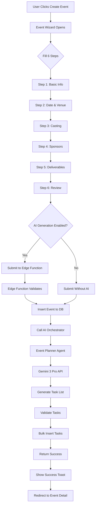
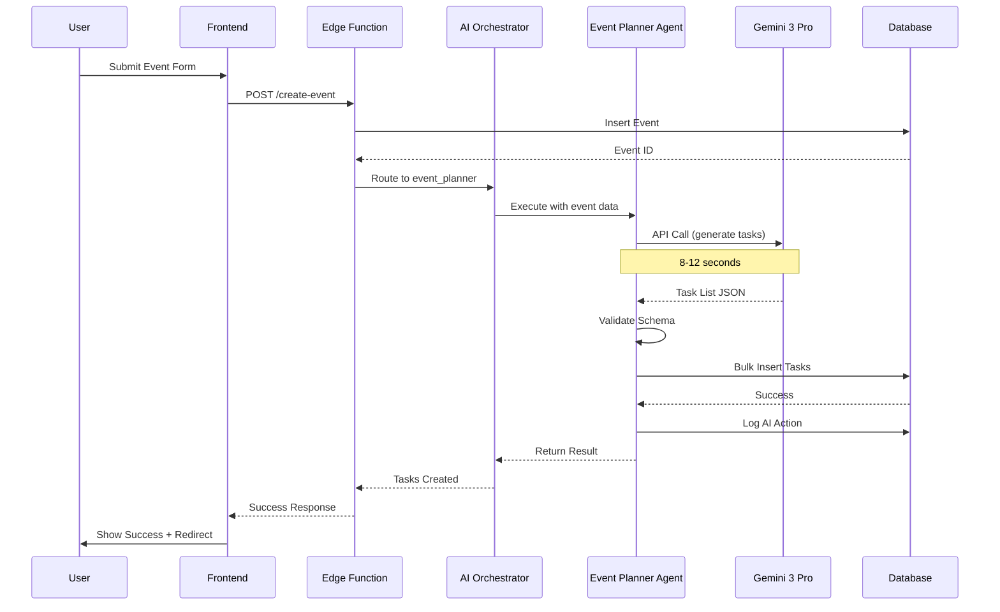
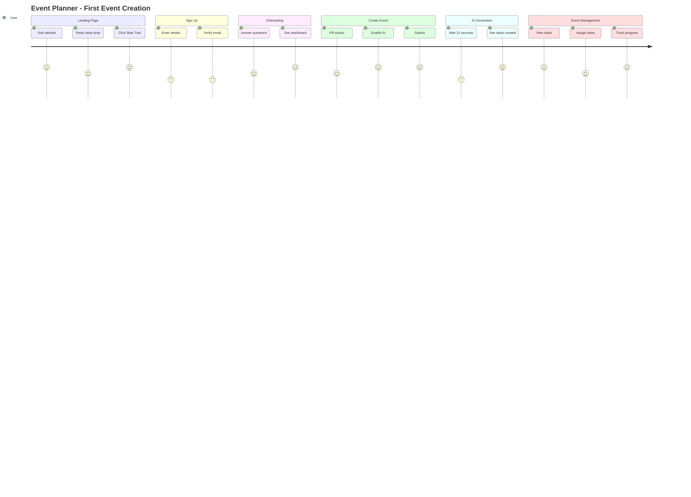
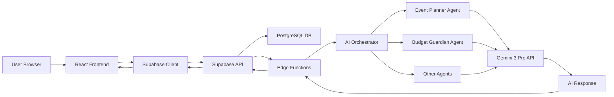

# FashionOS — Product Requirements Document (PRD)
**Version:** 1.0  
**Date:** December 21, 2024  
**Status:** In Development (45% Complete)

---

## TABLE OF CONTENTS

1. [Executive Summary](#1-executive-summary)
2. [Problem Statement](#2-problem-statement)
3. [Target Users](#3-target-users)
4. [Core Features](#4-core-features)
5. [Advanced Features / AI Features](#5-advanced-features--ai-features)
6. [Use Cases + Real World Examples](#6-use-cases--real-world-examples)
7. [User Stories](#7-user-stories)
8. [User Journey (Step by Step)](#8-user-journey-step-by-step)
9. [Workflows (System + User)](#9-workflows-system--user)
10. [Mermaid Diagrams](#10-mermaid-diagrams)
11. [Website Pages](#11-website-pages)
12. [Dashboard Pages](#12-dashboard-pages)
13. [Wizards & Multi-Step Forms](#13-wizards--multi-step-forms)
14. [Data Model](#14-data-model)
15. [AI Functions & Agents](#15-ai-functions--agents)
16. [Success Criteria](#16-success-criteria)
17. [Risks + Constraints](#17-risks--constraints)
18. [Suggested Improvements](#18-suggested-improvements)
19. [Implementation Notes](#19-implementation-notes)
20. [Roadmap & Phases](#20-roadmap--phases)

---

## 1. EXECUTIVE SUMMARY

**Product Name:** FashionOS  
**Category:** Event Management SaaS for Luxury Fashion Industry  
**Core Value:** Automate fashion event planning with AI-powered task generation

**Problem Solved:** Fashion event planners spend 60-80 hours manually creating task lists, coordinating teams, and managing budgets. FashionOS reduces this to 10 minutes using AI.

**Key Differentiator:** Industry-specific AI agents that understand fashion event workflows (runway shows, trunk shows, brand activations) and generate intelligent, phase-based task breakdowns.

**Target Market:** Event production companies, fashion brands, casting agencies  
**Business Model:** SaaS subscription ($299-$999/month based on team size)

---

## 2. PROBLEM STATEMENT

### Current Pain Points

**Manual Task Planning (60-80 hours/event)**
- Event planners manually create 100-200 tasks per event
- Tasks often duplicated or missing critical steps
- No standardized process across events

**Budget Overruns (30% average)**
- No real-time budget tracking
- Hidden costs discovered late
- Poor vendor cost forecasting

**Team Coordination Chaos**
- Email/spreadsheet communication breaks down
- Task dependencies unclear
- No visibility into who's doing what

**AI Hallucination Risk**
- Generic AI tools don't understand fashion industry
- Tasks miss critical fashion-specific requirements
- Output requires heavy manual editing

### Why This Matters

Fashion events are high-stakes, high-cost operations ($50K-$500K budgets) with zero tolerance for errors. A single missed task (e.g., model work permits) can derail entire productions.

---

## 3. TARGET USERS

### Primary Users

**Event Planners / Producers** (70% of users)
- Create and manage fashion events
- Coordinate teams and vendors
- Need: Fast event setup, AI task generation, real-time tracking

**Casting Directors** (20% of users)
- Manage model selection and bookings
- Track model availability and contracts
- Need: Model database, contract management, timeline integration

**Brand Managers** (10% of users)
- Oversee brand activations and sponsorships
- Review budgets and deliverables
- Need: High-level dashboards, budget alerts, ROI tracking

### User Personas

**Sarah - Senior Event Producer**
- Age: 32, 8 years experience
- Manages 15-20 events/year
- Pain: Spends entire weekends creating task lists
- Goal: Create event in 10 minutes, AI handles the rest

**Marcus - Casting Director**
- Age: 28, 5 years experience
- Books 200+ models/year
- Pain: Tracking model availability across multiple events
- Goal: See all model bookings in one calendar

**Elena - Brand Manager**
- Age: 35, 10 years experience
- Oversees $2M/year event budget
- Pain: Budget overruns discovered too late
- Goal: Real-time budget alerts and forecasting

---

## 4. CORE FEATURES

### 4.1 Event Creation Wizard (6-step)

**Purpose:** Guide users through event setup in 5-10 minutes

**Steps:**
1. Basic Info (name, type, description)
2. Date & Venue (date, location, attendance, budget)
3. Casting (number of models, types)
4. Sponsors (optional sponsor selection)
5. Deliverables (photo, video, live streaming, social)
6. Review & Submit (AI task generation option)

**AI Integration:** Optional AI task generation at end (8-12 seconds, ~120-150 tasks)

**Tech:** React, react-hook-form, Zod validation, Supabase Edge Functions

---

### 4.2 Events Dashboard

**Purpose:** Central hub for viewing all events

**Features:**
- Event cards with key info (date, budget, status, progress)
- Filters: date range, event type, status
- Search: by name or venue
- Sort: by date, budget, status
- Quick actions: Edit, duplicate, archive, delete
- Real-time updates via Supabase subscriptions

**Empty State:** "No events yet. Create your first event!" + CTA button

---

### 4.3 Tasks System (Kanban + List)

**Purpose:** Manage event tasks with visual workflow

**Views:**
- Kanban board (columns: To Do, In Progress, Blocked, Done)
- List view (sortable by status, priority, deadline)
- Calendar view (tasks by due date)

**Task Properties:**
- Title, description, status, priority (critical/high/medium/low)
- Deadline, estimated hours, assigned to
- Phase (1 of 14 event phases)
- Dependencies (blocking/blocked by)
- Attachments, comments, activity log

**Actions:**
- Create, edit, delete, bulk move
- Assign to team member
- Add dependency
- Set reminder

---

### 4.4 Budget Tracking

**Purpose:** Real-time budget monitoring with alerts

**Features:**
- Budget breakdown by category (venue, models, production, marketing)
- Actual vs. planned spending
- Forecasted total cost
- Budget alerts (>10% variance)
- Expense tracking with receipts
- Vendor cost comparison

**AI Feature:** Budget Guardian agent monitors spending and suggests cost optimizations

---

### 4.5 Team Management

**Purpose:** Invite team, assign roles, manage permissions

**Roles:**
- Admin: Full access
- Planner: Create events, manage tasks
- Viewer: Read-only access
- Vendor: Limited task access

**Features:**
- Invite by email
- Role assignment
- Permission matrix
- Activity log (who did what)

---

### 4.6 Calendar View

**Purpose:** Timeline view of events and task deadlines

**Features:**
- Month/week/day views
- Event milestones
- Task deadlines
- Model bookings
- Venue availability
- Color-coded by event

---

## 5. ADVANCED FEATURES / AI FEATURES

### 5.1 AI Event Planner Agent

**Purpose:** Generate comprehensive task list for any event type

**Input:**
- Event type, date, budget, venue, models, deliverables

**Process:**
1. Analyze event requirements
2. Select relevant phases (14 total phases)
3. Generate 100-200 tasks across phases
4. Set priorities and deadlines
5. Calculate estimated hours
6. Identify dependencies

**Output:**
- Structured task list with 14 phases
- Critical path identification
- Timeline visualization
- Estimated total hours

**Gemini 3 Pro Features Used:**
- Function calling (generate task schema)
- Structured outputs (JSON task list)
- Grounding with Google Search (industry standards)
- Code execution (timeline calculations)

**Example Output:**
```json
{
  "tasks": [
    {
      "title": "Book venue",
      "phase": "Venue & Production",
      "priority": "critical",
      "deadline_days_before": 90,
      "estimated_hours": 8,
      "dependencies": []
    }
  ],
  "total_tasks": 127,
  "total_hours": 520,
  "critical_path": ["Book venue", "Confirm models", "Setup production"]
}
```

---

### 5.2 Budget Guardian Agent

**Purpose:** Monitor spending and predict overruns

**Triggers:**
- New expense added
- Budget updated
- Weekly automatic check

**Actions:**
- Compare actual vs. planned
- Forecast final cost based on current spending rate
- Alert if >10% variance
- Suggest cost-cutting measures

**AI Logic:**
- Historical data analysis (past events)
- Vendor cost benchmarking
- Category-based forecasting

**Gemini Features Used:**
- Function calling (fetch budget data)
- Structured outputs (alert format)
- Deep research (vendor pricing)

---

### 5.3 Sponsor Intelligence Agent

**Purpose:** Match events with potential sponsors

**Input:**
- Event type, audience size, demographics, brand values

**Process:**
1. Analyze event profile
2. Search sponsor database
3. Match based on alignment
4. Generate pitch deck outline

**Output:**
- Top 5 sponsor matches
- Alignment score (0-100)
- Suggested sponsorship tiers
- Pitch talking points

**Gemini Features Used:**
- Grounding with Google Search (sponsor research)
- Structured outputs (match results)
- Text generation (pitch deck)

---

### 5.4 Brand Shoot Agent

**Purpose:** Create shot list and production schedule

**Input:**
- Brand guidelines, lookbook, shot types, location

**Process:**
1. Parse brand guidelines (PDF upload)
2. Generate shot list (hero, detail, lifestyle, BTS)
3. Calculate time per shot
4. Create production schedule
5. Assign crew roles

**Output:**
- Shot list (50-100 shots)
- Minute-by-minute schedule
- Crew call sheet
- Equipment checklist

**Gemini Features Used:**
- URL context tool (brand website analysis)
- Structured outputs (shot list)
- Code execution (schedule optimization)

---

### 5.5 Operations Risk Agent

**Purpose:** Identify potential issues before they happen

**Triggers:**
- Event created
- Task deadline approaching
- Budget variance detected

**Risk Categories:**
- Timeline risks (tight deadlines)
- Budget risks (overspending)
- Vendor risks (reliability issues)
- Legal risks (permits, contracts)
- Weather risks (outdoor events)

**Actions:**
- Risk score (0-100)
- Mitigation suggestions
- Contingency plans
- Alert stakeholders

**Gemini Features Used:**
- Gemini thinking (multi-step reasoning)
- Function calling (fetch risk data)
- Text generation (mitigation plans)

---

### 5.6 Contract Analyzer Agent

**Purpose:** Review vendor contracts for red flags

**Input:**
- Contract PDF upload

**Process:**
1. Extract key terms (payment, cancellation, liability)
2. Identify unusual clauses
3. Compare to industry standards
4. Flag potential issues

**Output:**
- Contract summary
- Red flags list
- Suggested revisions
- Risk level (low/medium/high)

**Gemini Features Used:**
- URL context tool (contract upload)
- Structured outputs (issue list)
- Grounding (legal standards)

---

### 5.7 Designer Matching Agent

**Purpose:** Match designers to event aesthetic

**Input:**
- Event theme, audience, budget, venue style

**Process:**
1. Analyze event aesthetic requirements
2. Search designer database
3. Match based on style, availability, budget
4. Generate lookbook mood board

**Output:**
- Top 10 designer matches
- Match score (0-100)
- Availability dates
- Estimated costs

**Gemini Features Used:**
- Grounding with Google Search (designer portfolios)
- Structured outputs (match results)
- Text generation (rationale)

---

### 5.8 Attendee Flow Agent

**Purpose:** Optimize venue layout and guest flow

**Input:**
- Venue dimensions, expected attendance, event type

**Process:**
1. Calculate space per person
2. Design traffic flow
3. Identify bottlenecks
4. Suggest layout improvements

**Output:**
- Venue layout diagram
- Traffic flow simulation
- Capacity recommendations
- Entry/exit optimization

**Gemini Features Used:**
- Code execution (flow calculations)
- Structured outputs (layout data)
- Gemini thinking (optimization)

---

## 6. USE CASES + REAL WORLD EXAMPLES

### Use Case 1: Runway Show Planning

**Scenario:** Sarah needs to plan NYFW runway show in 3 months with $250K budget

**Without FashionOS:**
- Spends 60 hours creating task list
- Uses Excel + email to coordinate
- Discovers venue double-booked 2 weeks before event
- Budget overruns by $40K (16%)

**With FashionOS:**
1. Creates event in wizard (10 minutes)
2. AI generates 127 tasks across 14 phases (12 seconds)
3. Assigns tasks to team (20 minutes)
4. Operations Risk Agent alerts about venue availability conflict (Day 3)
5. Budget Guardian sends alert at 85% budget (Week 6)
6. Event completes on time, $12K under budget

**Time Saved:** 58 hours  
**Cost Saved:** $52K (21% of budget)

---

### Use Case 2: Brand Activation Campaign

**Scenario:** Elena planning luxury brand pop-up store for 2 weeks

**Steps:**
1. Create event: "Luxury Brand Pop-Up NYC"
2. AI Event Planner generates tasks:
   - Venue design (15 tasks)
   - Staffing (12 tasks)
   - Inventory management (20 tasks)
   - Marketing (18 tasks)
3. Sponsor Intelligence Agent suggests 3 potential partners
4. Brand Shoot Agent creates content calendar
5. Attendee Flow Agent optimizes store layout

**Result:** Pop-up attracts 2,500 visitors, generates $180K revenue, secured 1 sponsor ($30K)

---

### Use Case 3: Multi-City Trunk Show Tour

**Scenario:** Marcus organizing 5-city trunk show tour

**Without FashionOS:**
- Creates separate spreadsheets for each city
- Models double-booked across cities
- Loses track of equipment shipments

**With FashionOS:**
1. Creates 5 events (one per city)
2. AI duplicates task structure with city-specific customization
3. Calendar view shows model availability across all events
4. Shared equipment tracked in tasks
5. Budget Guardian monitors total tour cost

**Result:** All 5 events execute successfully, models booked efficiently, tour completes 5% under budget

---

### Use Case 4: Crisis Recovery

**Scenario:** Venue cancels 3 weeks before runway show

**FashionOS Response:**
1. Operations Risk Agent detects cancellation (real-time)
2. Sends immediate alert to event planner
3. AI suggests 3 backup venues based on requirements
4. Automatically adjusts timeline (all deadlines shift)
5. Updates task dependencies
6. Notifies team of changes

**Result:** New venue secured in 48 hours, event proceeds with 2-week buffer

---

### Use Case 5: Budget Forecasting

**Scenario:** Event planner needs to forecast final cost at 50% completion

**Steps:**
1. Opens budget dashboard
2. Budget Guardian Agent analyzes:
   - Current spending rate: $8K/week
   - Planned budget: $150K
   - Weeks remaining: 6
3. AI forecast: $198K final cost (32% overrun)
4. Suggests cost reductions:
   - Negotiate venue discount (-$10K)
   - Reduce model count (-$8K)
   - Use in-house photography (-$15K)
5. Adjusted forecast: $165K (10% overrun)

**Result:** Proactive cost management prevents major overrun

---

## 7. USER STORIES

### Epic 1: Event Creation
- As an **event planner**, I want to **create an event in under 10 minutes**, so I can **start planning quickly**
- As an **event planner**, I want **AI to generate my task list**, so I **don't have to create 100+ tasks manually**
- As an **admin**, I want to **duplicate past events**, so I can **reuse proven workflows**

### Epic 2: Task Management
- As a **team member**, I want to **see my assigned tasks**, so I **know what to work on**
- As an **event planner**, I want to **track task progress**, so I **know if we're on schedule**
- As a **team lead**, I want to **set task dependencies**, so **tasks happen in correct order**

### Epic 3: Budget Control
- As a **brand manager**, I want **real-time budget tracking**, so I **catch overspending early**
- As an **event planner**, I want **budget alerts**, so I'm **notified before exceeding budget**
- As a **finance team**, I want to **export budget reports**, so I can **reconcile expenses**

### Epic 4: Team Collaboration
- As an **admin**, I want to **invite team members**, so they can **collaborate on events**
- As a **team member**, I want to **comment on tasks**, so I can **communicate with team**
- As a **vendor**, I want **limited access**, so I can **update my assigned tasks only**

### Epic 5: AI Assistance
- As an **event planner**, I want **AI to identify risks**, so I can **prevent issues proactively**
- As a **budget manager**, I want **AI spending forecasts**, so I can **plan for overruns**
- As a **casting director**, I want **AI to match models**, so I can **find perfect fits faster**

---

## 8. USER JOURNEY (STEP BY STEP)

### Journey 1: First-Time User (Event Planner)

**Goal:** Create first fashion event with AI assistance

```
1. LANDING PAGE
   User arrives → Sees hero: "Plan Fashion Events 10x Faster with AI"
   Action: Click "Start Free Trial"

2. SIGN UP
   Enter: Email, password, name, company
   Verify email → Redirected to onboarding

3. ONBOARDING (3 steps)
   Step 1: What do you do? → Select "Event Planner"
   Step 2: Event types? → Check "Runway Shows", "Brand Activations"
   Step 3: Team size? → Select "5-10 people"

4. DASHBOARD (empty state)
   Sees: "Create your first event" + large CTA button
   Tooltips: Point to key features
   Action: Click "Create Event"

5. EVENT WIZARD (6 steps)
   Step 1: Name: "Spring Fashion Week Runway", Type: "Runway Show", Description: "..."
   Step 2: Date: "March 15, 2025", Venue: "Skylight Modern", Attendance: 300, Budget: $150K
   Step 3: Models: 25, Types: Runway + Editorial
   Step 4: Sponsors: Skip for now
   Step 5: Deliverables: ✓ Photography, ✓ Videography, ✓ Social
   Step 6: Review → ✓ Generate tasks with AI → Accept terms → Submit

6. AI GENERATION (12 seconds)
   Loading screen shows: "AI analyzing your event..."
   Progress: "Identifying critical phases..." → "Generating tasks..." → "Calculating timeline..."

7. SUCCESS
   Toast: "Event created! AI generated 127 tasks"
   Redirected to: Event detail page

8. EVENT DETAIL PAGE
   User sees:
   - Event header (name, date, status, progress: 0%)
   - Stats: 127 tasks, 14 phases, 520 estimated hours
   - Tabs: Overview, Tasks, Team, Budget
   - Quick action: "Invite team members"

9. TASKS TAB
   Sees Kanban board with 127 tasks in "To Do" column
   Tasks grouped by phase (14 phases)
   Clicks first task: "Book venue" (Priority: Critical, Due: 90 days before)

10. ASSIGN TASK
    Opens task → Click "Assign to" → Select team member (or self)
    Sets deadline: Calculate from event date
    Adds note: "Check Skylight Modern availability"
    Saves → Task moves to "Assigned"

11. DASHBOARD VIEW
    Back to dashboard → Sees event card
    Card shows: Name, date, progress bar (1/127 tasks), budget status
    User feels: "Wow, that was fast. AI did the hard work."

COMPLETION TIME: 15 minutes (vs. 60 hours manual)
```

---

### Journey 2: Returning User (Weekly Check-In)

**Goal:** Review event progress and handle alerts

```
1. LOGIN
   Email + password → Dashboard

2. DASHBOARD OVERVIEW
   Sees 3 active events:
   - Event A: 67% complete (green)
   - Event B: 45% complete (yellow - 2 alerts)
   - Event C: 12% complete (red - 1 critical alert)

3. ALERTS PANEL
   Sees notifications:
   - "Budget Guardian: Event B is 12% over budget" (3 hours ago)
   - "Operations Risk: Event C venue permit pending" (1 day ago)
   - "5 tasks due this week"

4. INVESTIGATE EVENT B (Budget Alert)
   Clicks Event B → Budget tab
   Sees:
   - Planned: $180K, Actual: $201K, Variance: +$21K (12%)
   - Overspending in: Production ($15K over), Catering ($6K over)
   - Budget Guardian suggestion: "Negotiate production discount or reduce lighting setup"

5. TAKE ACTION
   Opens production expense → Contacts vendor
   Adjusts budget forecast
   Marks alert as "Resolved"

6. CHECK EVENT C (Risk Alert)
   Opens Event C → Overview
   Operations Risk panel shows: "Venue permit application pending for 14 days (high risk)"
   Suggested action: "Follow up with city permits office"
   User assigns follow-up task to team member

7. WEEKLY TASKS
   Opens "My Tasks" view
   Sees 8 tasks due this week across 3 events
   Completes 2 quick tasks
   Delegates 1 task
   Reschedules 1 task

8. LOGOUT
   User feels: "All events on track, risks identified early"

COMPLETION TIME: 20 minutes weekly check-in
```

---

### Journey 3: Team Member (Task Execution)

**Goal:** Complete assigned tasks efficiently

```
1. EMAIL NOTIFICATION
   Receives: "You've been assigned 3 new tasks for Spring Fashion Week"
   Clicks link → Redirected to login

2. MY TASKS VIEW
   Sees tasks assigned to self:
   - "Confirm model contracts" (Due: Tomorrow, Priority: High)
   - "Order event signage" (Due: Next week, Priority: Medium)
   - "Book makeup artist" (Due: 2 weeks, Priority: Medium)

3. TASK DETAIL
   Opens "Confirm model contracts"
   Sees:
   - Description: "Get signed contracts from 25 models"
   - Attachments: Model list, contract template
   - Comments: "Make sure to verify work permits" (from casting director)
   - Blocked by: "Finalize model selections" (completed yesterday)

4. EXECUTE TASK
   Downloads model list
   Sends contracts via email
   Updates task: Adds comment "Contracts sent to all 25 models"
   Changes status: "In Progress"

5. FOLLOW-UP (3 days later)
   20 contracts received
   Updates task: "20/25 contracts received"
   Adds comment: "Following up with 5 remaining models"

6. COMPLETE TASK
   All 25 contracts received
   Uploads signed contracts as attachments
   Moves task to "Done"
   Sees: Progress bar updates (68/127 tasks complete)

7. NEXT TASK
   Moves to "Order event signage"
   AI suggestion appears: "Based on past events, we recommend ordering 2 weeks before (not 1 week)"
   User adjusts deadline: Moves up by 1 week

RESULT: Tasks completed efficiently with clear context and AI guidance
```

---

## 9. WORKFLOWS (SYSTEM + USER)

### Workflow 1: Event Creation with AI

```
TRIGGER: User clicks "Create Event" button

USER ACTIONS:
1. Fill 6-step wizard (10 min)
2. Enable "Generate tasks with AI" checkbox
3. Accept terms
4. Click "Create Event"

SYSTEM ACTIONS:
1. Validate form data (Zod schema)
2. Generate idempotency key
3. POST to Edge Function: /create-event
4. Edge Function:
   a. Verify user authentication
   b. Check organization permissions
   c. Validate request schema
   d. Insert event to database
   e. If AI enabled:
      - Call AI Orchestrator
      - Route to Event Planner Agent
      - Agent calls Gemini 3 Pro API
      - Generate task list (8-12 seconds)
      - Validate task schema
      - Bulk insert tasks to database
   f. Log AI action (cost, latency, success)
   g. Return event_id + tasks_created

RESULT:
- Event created in database
- 120-150 tasks generated (if AI enabled)
- User redirected to event detail page
- Toast: "Event created with 127 AI-generated tasks!"

FAILURE PATHS:
- Validation error → Show inline errors
- AI timeout → Create event without tasks, offer retry
- Database error → Rollback, show error + retry button
- AI generation failed → Create event, log error, notify user
```

---

### Workflow 2: Budget Alert Triggering

```
TRIGGER: New expense added to event

SYSTEM ACTIONS:
1. Expense saved to database
2. Database trigger fires: calculate_budget_variance()
3. If variance > 10%:
   a. Insert alert to alerts table
   b. Call Budget Guardian Agent
   c. Agent analyzes:
      - Spending by category
      - Spending rate
      - Remaining timeline
      - Historical data
   d. Generate forecast
   e. Suggest cost reductions
   f. Format alert message
4. Send real-time notification (Supabase realtime)
5. Send email notification
6. Show alert in dashboard

USER ACTIONS:
1. Sees alert badge in nav
2. Clicks alert → Opens budget page
3. Reviews AI suggestions
4. Takes action:
   - Adjusts budget
   - Negotiates with vendor
   - Marks alert as resolved

RESULT:
- Budget overspending detected early
- Proactive cost management
- Event stays within budget
```

---

### Workflow 3: Task Dependency Chain

```
TRIGGER: User completes task with dependencies

EXAMPLE CHAIN:
Task A: "Finalize venue" (blocking)
  → Task B: "Design stage layout" (blocked by A)
    → Task C: "Order stage materials" (blocked by B)
      → Task D: "Build stage" (blocked by C)

USER ACTION:
User completes Task A (marks as "Done")

SYSTEM ACTIONS:
1. Update task A status = "completed"
2. Query blocked tasks: Find Task B
3. If all blocking tasks complete:
   a. Task B status = "ready" (auto-unlock)
   b. Send notification to Task B assignee
   c. Add to "Ready to Start" list
4. Update critical path calculation
5. Recalculate event completion %

NOTIFICATION:
"Task unlocked: 'Design stage layout' is ready to start"

DASHBOARD:
"Ready to Start" section shows newly unlocked tasks

RESULT:
- Task dependencies enforced automatically
- Team knows what to work on next
- Critical path visible
```

---

## 10. MERMAID DIAGRAMS

### Diagram 1: Event Creation Flow



---

### Diagram 2: AI Agent Interaction



---

### Diagram 3: User Journey Map



---

### Diagram 4: Data Flow Architecture



---

## 11. WEBSITE PAGES

### 11.1 Landing Page (`/`)

**Purpose:** Convert visitors to trial signups

**Sections:**
1. Hero
   - Headline: "Plan Fashion Events 10x Faster with AI"
   - Subheadline: "From runway shows to brand activations, AI generates your entire task list in seconds"
   - CTA: "Start Free Trial" + "Watch Demo"
   - Hero image: Event planner using dashboard

2. Social Proof
   - "Trusted by 200+ fashion brands and production companies"
   - Logos: (placeholder brands)

3. Problem/Solution
   - Problem: "Spending 60+ hours creating task lists?"
   - Solution: "AI generates 100-200 tasks in 12 seconds"
   - Video demo: Wizard → AI generation → Tasks appear

4. Features Grid
   - AI Task Generation (icon + 2-sentence description)
   - Budget Tracking (icon + description)
   - Team Collaboration (icon + description)
   - 8 AI Agents (icon + description)

5. Use Cases
   - Runway Shows
   - Brand Activations
   - Trunk Shows
   - Press Previews

6. Pricing (3 tiers)
   - Starter: $299/mo (5 users, 10 events/mo)
   - Professional: $599/mo (15 users, unlimited events)
   - Enterprise: $999/mo (unlimited users, custom AI)

7. Testimonials
   - 3 customer quotes with photos

8. FAQ
   - "How does AI task generation work?"
   - "Can I edit AI-generated tasks?"
   - "What if AI makes a mistake?"
   - "Is my data secure?"

9. Final CTA
   - "Start your 14-day free trial. No credit card required."

---

### 11.2 Pricing Page (`/pricing`)

**Purpose:** Compare plans and drive conversions

**Layout:**
- 3-column comparison table
- Feature list with checkmarks
- "Most Popular" badge on Professional plan
- Monthly/Annual toggle (save 20% annually)
- CTA buttons: "Start Trial" or "Contact Sales"

**Features by Plan:**

| Feature | Starter | Professional | Enterprise |
|---------|---------|--------------|------------|
| Users | 5 | 15 | Unlimited |
| Events/month | 10 | Unlimited | Unlimited |
| AI task generation | ✓ | ✓ | ✓ |
| Budget tracking | ✓ | ✓ | ✓ |
| AI agents | 3 | 8 | Custom |
| Priority support | - | ✓ | ✓ |
| Custom branding | - | - | ✓ |

---

### 11.3 About Page (`/about`)

**Purpose:** Build trust and tell brand story

**Sections:**
- Company mission
- Founder story (why we built FashionOS)
- Team photos
- Company values
- Contact information

---

### 11.4 Blog (`/blog`)

**Purpose:** SEO, thought leadership, customer education

**Content Types:**
- Event planning tips
- AI in fashion industry
- Customer success stories
- Product updates
- Industry trends

---

### 11.5 Demo Page (`/demo`)

**Purpose:** Show product without signup

**Features:**
- Interactive product tour
- Sample dashboard with fake data
- Click through key features
- CTA: "Try it for real - Start free trial"

---

## 12. DASHBOARD PAGES

### 12.1 Events Dashboard (`/dashboard/events`)

**Purpose:** Central hub for all events

**Layout:**
```
┌─────────────────────────────────────────┐
│ Header: "Events" + [Create Event] btn  │
├─────────────────────────────────────────┤
│ Filters: [Date] [Type] [Status]        │
│ Search: [Search by name or venue...]   │
├─────────────────────────────────────────┤
│ ┌──────┐ ┌──────┐ ┌──────┐ ┌──────┐   │
│ │Event │ │Event │ │Event │ │Event │   │
│ │Card  │ │Card  │ │Card  │ │Card  │   │
│ │      │ │      │ │      │ │      │   │
│ └──────┘ └──────┘ └──────┘ └──────┘   │
└─────────────────────────────────────────┘
```

**Event Card Shows:**
- Event name
- Date (with countdown: "in 45 days")
- Event type badge
- Progress bar (tasks completed %)
- Budget status (on track / over / under)
- Quick actions: View, Edit, Duplicate, Archive

**States:**
- Empty: "No events yet. Create your first event!"
- Loading: Skeleton cards
- Error: Error message + Retry button

**Interactions:**
- Click card → Event detail page
- Click Create → Event wizard modal
- Filter/search → Update card list
- Real-time: New event appears without refresh

---

### 12.2 Event Detail Page (`/dashboard/events/[id]`)

**Purpose:** Complete event overview and management

**Header:**
```
┌─────────────────────────────────────────┐
│ Spring Fashion Week Runway             │
│ March 15, 2025 • Runway Show           │
│ [Edit] [Duplicate] [Archive] [Delete]  │
└─────────────────────────────────────────┘
```

**Stats Cards (4 across):**
```
┌──────────┐ ┌──────────┐ ┌──────────┐ ┌──────────┐
│Tasks     │ │Timeline  │ │Budget    │ │Team      │
│127       │ │45 days   │ │$138K     │ │8 members │
│85% done  │ │on track  │ │$12K left │ │2 pending │
└──────────┘ └──────────┘ └──────────┘ └──────────┘
```

**Tabs:**
1. Overview
   - Event description
   - Key details (venue, attendance, models)
   - Deliverables checklist
   - Recent activity feed
   - AI-generated insights panel

2. Tasks
   - Kanban board or List view toggle
   - Filters: Phase, Status, Assignee, Priority
   - Bulk actions: Move, Assign, Delete
   - "Add Task" button
   - AI suggest: "Based on progress, these tasks are at risk..."

3. Team
   - Team member cards (photo, name, role, tasks assigned)
   - "Invite Member" button
   - Activity log (who did what, when)

4. Budget
   - Budget breakdown pie chart
   - Category spending table
   - Actual vs. planned comparison
   - Expense list (with receipts)
   - AI forecast: "Projected final cost: $165K"
   - Budget Guardian alerts

5. Calendar
   - Timeline view of all task deadlines
   - Milestones marked
   - Critical path highlighted

**Real-Time Updates:**
- Task completed → Progress bar updates
- Budget updated → Chart updates
- Team member added → Team count updates

---

### 12.3 Tasks Dashboard (`/dashboard/tasks`)

**Purpose:** View all tasks across all events

**Layout:**
- Kanban board (default view)
- List view option
- Calendar view option

**Filters:**
- My tasks / All tasks
- Event (dropdown)
- Phase (dropdown)
- Priority (Critical, High, Medium, Low)
- Assignee (dropdown)
- Date range

**Kanban Columns:**
- To Do (87 tasks)
- In Progress (34 tasks)
- Blocked (5 tasks)
- Done (201 tasks)

**Task Card Shows:**
- Title
- Event name (small badge)
- Priority color dot
- Assignee avatar
- Due date
- Quick action: Mark complete

**Interactions:**
- Drag task between columns
- Click task → Task detail modal
- Bulk select → Bulk actions
- Filter → Update visible tasks

---

### 12.4 Calendar View (`/dashboard/calendar`)

**Purpose:** Timeline view of events and tasks

**Layout:**
- Month view (default)
- Week view option
- Day view option

**Calendar Elements:**
- Events: Large blocks with event name
- Task deadlines: Small dots (color-coded by priority)
- Milestones: Star icons
- Today marker

**Interactions:**
- Click event → Event detail
- Click task dot → Task detail modal
- Hover → Tooltip with details
- Drag event → Reschedule (confirmation required)

---

### 12.5 Budget Dashboard (`/dashboard/budget`)

**Purpose:** Financial overview across all events

**Layout:**

**Summary Cards:**
```
┌───────────────┐ ┌───────────────┐ ┌───────────────┐
│Total Budget   │ │Total Spent    │ │Variance       │
│$1.2M          │ │$980K          │ │-$220K (18%)   │
│Across 12 evts │ │82% of budget  │ │Under budget ✓ │
└───────────────┘ └───────────────┘ └───────────────┘
```

**Charts:**
1. Spending by Event (bar chart)
2. Spending by Category (pie chart)
3. Monthly Spending Trend (line chart)
4. Budget Status Distribution (donut: on track, over, under)

**Alerts Section:**
- Budget Guardian warnings
- Overspending events highlighted
- AI forecast deviations

**Events Table:**
- Event name, Planned budget, Actual spent, Variance %, Status

---

### 12.6 Team Dashboard (`/dashboard/team`)

**Purpose:** Manage team members and permissions

**Layout:**

**Team List:**
```
┌────────────────────────────────────────┐
│ Photo | Name | Role | Tasks | Actions │
├────────────────────────────────────────┤
│ [img] | Sarah | Admin | 12 | [Edit]  │
│ [img] | Marcus| Planner| 8 | [Edit]  │
│ [img] | Elena | Viewer | 0 | [Edit]  │
└────────────────────────────────────────┘
```

**Actions:**
- Invite Member (button)
- Edit role/permissions
- Remove member
- Resend invitation

**Invitation Panel:**
- Email input
- Role dropdown
- "Send Invitation" button
- Pending invitations list

**Activity Feed:**
- Who joined when
- Permission changes
- Task assignments

---

### 12.7 AI Agents Dashboard (`/dashboard/ai`)

**Purpose:** Monitor AI usage, costs, and effectiveness

**Layout:**

**Summary Cards:**
```
┌────────────┐ ┌────────────┐ ┌────────────┐ ┌────────────┐
│AI Actions  │ │Total Cost  │ │Avg Latency │ │Success Rate│
│1,247       │ │$62.35      │ │9.2s        │ │98.4%       │
│This month  │ │This month  │ │Per request │ │Last 30 days│
└────────────┘ └────────────┘ └────────────┘ └────────────┘
```

**Agent Usage Table:**
```
┌──────────────────────────────────────────────┐
│ Agent | Calls | Avg Cost | Success | Status │
├──────────────────────────────────────────────┤
│ Event Planner | 45 | $0.05 | 100% | Active │
│ Budget Guardian | 230 | $0.02 | 99% | Active │
│ Sponsor Intel | 12 | $0.15 | 92% | Active │
│ Operations Risk | 180 | $0.03 | 97% | Active │
└──────────────────────────────────────────────┘
```

**Recent Actions Log:**
- Timestamp, Agent, Event, Result, Cost
- Filter by agent, date, status
- Export to CSV

**AI Insights:**
- "Most used agent: Budget Guardian (230 calls)"
- "Total hours saved: ~520 hours this month"
- "ROI: $18,000 value generated from $62 AI cost"

---

### 12.8 Settings Page (`/dashboard/settings`)

**Purpose:** Account and system configuration

**Tabs:**

1. **Profile**
   - Name, email, photo
   - Password change
   - Notification preferences

2. **Organization**
   - Company name
   - Billing details
   - Subscription plan
   - Usage limits

3. **Integrations**
   - Google Calendar sync
   - Slack notifications
   - Email service (SendGrid)
   - Payment gateway (Stripe)

4. **AI Configuration**
   - Enable/disable specific agents
   - Cost limits ($X per month)
   - Confidence thresholds
   - Fallback behavior

5. **Billing**
   - Current plan
   - Payment method
   - Billing history
   - Upgrade/downgrade options

---

## 13. WIZARDS & MULTI-STEP FORMS

### 13.1 Event Creation Wizard

**Steps:** 6 total

**Step 1: Basic Information**
- Event name (text, required, 3-200 chars)
- Event type (dropdown: runway show, gallery show, popup store, brand activation, trunk show, press preview)
- Description (textarea, required, 10-2000 chars)
- [Previous] [Next] buttons

**Step 2: Date & Venue**
- Event date (date picker, required, must be future)
- Venue (text, optional)
- Expected attendance (number, required, 1-100K)
- Budget (USD) (number, required, positive, max $10M)
- [Previous] [Next] buttons

**Step 3: Casting**
- Number of models (number, 0-500)
- Model types (checkboxes: runway, fitting, commercial, editorial)
- Casting director (dropdown, optional)
- [Previous] [Next] buttons

**Step 4: Sponsors**
- Sponsor selection (multi-select dropdown)
- "Skip for now" button
- [Previous] [Next] buttons

**Step 5: Deliverables**
- Photography (checkbox)
- Videography (checkbox)
- Live streaming (checkbox)
- Social media content (checkbox)
- Must select at least one
- [Previous] [Next] buttons

**Step 6: Review & Confirm**
- Summary of all inputs
- AI generation toggle: "Generate tasks automatically with AI" (default: on)
- Cost estimate: "~$0.05, 10-15 seconds"
- Terms acceptance checkbox (required)
- [Previous] [Create Event] buttons

**Features:**
- Progress bar (shows % complete)
- Step indicators (dots at bottom)
- Auto-save draft to localStorage (every step)
- Draft restoration on return (if <24 hours old)
- Validation errors shown inline
- Can navigate back to edit previous steps
- Mobile responsive (stacks vertically)

---

### 13.2 Task Creation Wizard

**Steps:** 3 total

**Step 1: Task Details**
- Title (text, required)
- Description (textarea, optional)
- Phase (dropdown: 14 phases)
- Priority (dropdown: critical, high, medium, low)
- [Next] button

**Step 2: Timeline**
- Deadline (date picker)
- Estimated hours (number)
- Dependencies (multi-select: other tasks)
- [Previous] [Next] buttons

**Step 3: Assignment**
- Assign to (dropdown: team members)
- Notify assignee (checkbox, default on)
- [Previous] [Create Task] buttons

---

### 13.3 Invite Team Member Wizard

**Steps:** 2 total

**Step 1: Member Details**
- Email (text, required, valid email)
- Full name (text, required)
- Role (dropdown: Admin, Planner, Viewer, Vendor)
- [Next] button

**Step 2: Permissions**
- Permission matrix (checkboxes)
  - Create events
  - Edit events
  - Delete events
  - View budget
  - Edit budget
  - Invite members
  - Use AI agents
- [Previous] [Send Invitation] buttons

---

## 14. DATA MODEL

### 14.1 Core Tables

**events**
```sql
id                UUID PRIMARY KEY
organization_id   UUID NOT NULL (FK → organizations.id)
name              TEXT NOT NULL
event_type        ENUM (runway_show, gallery_show, popup_store, brand_activation, trunk_show, press_preview)
event_date        DATE NOT NULL
venue             TEXT
expected_attendance INTEGER
budget            DECIMAL(12,2)
number_of_models  INTEGER DEFAULT 0
description       TEXT
status            ENUM (planning, confirmed, in_progress, completed, cancelled) DEFAULT 'planning'
created_by        UUID NOT NULL (FK → users.id)
created_at        TIMESTAMP DEFAULT NOW()
updated_at        TIMESTAMP DEFAULT NOW()
```

**event_phases**
```sql
id          UUID PRIMARY KEY
event_id    UUID NOT NULL (FK → events.id) ON DELETE CASCADE
phase_name  TEXT NOT NULL (e.g., "Pre-Planning", "Venue & Production")
phase_order INTEGER NOT NULL (1-14)
start_date  DATE
end_date    DATE
status      TEXT DEFAULT 'pending'
created_at  TIMESTAMP DEFAULT NOW()
```

**tasks**
```sql
id              UUID PRIMARY KEY
event_id        UUID NOT NULL (FK → events.id) ON DELETE CASCADE
phase_id        UUID (FK → event_phases.id) ON DELETE SET NULL
title           TEXT NOT NULL
description     TEXT
status          ENUM (pending, in_progress, completed, blocked) DEFAULT 'pending'
priority        ENUM (critical, high, medium, low) DEFAULT 'medium'
deadline        DATE
estimated_hours DECIMAL(6,2)
assigned_to     UUID (FK → users.id)
created_by      UUID NOT NULL (FK → users.id)
organization_id UUID NOT NULL (FK → organizations.id)
created_at      TIMESTAMP DEFAULT NOW()
updated_at      TIMESTAMP DEFAULT NOW()
```

**ai_actions**
```sql
id          UUID PRIMARY KEY
user_id     UUID NOT NULL (FK → users.id)
event_id    UUID (FK → events.id) ON DELETE CASCADE
agent       TEXT NOT NULL (e.g., "event_planner", "budget_guardian")
model       TEXT NOT NULL (e.g., "gemini-3-pro")
input       JSONB
output      JSONB
latency_ms  INTEGER
cost_usd    DECIMAL(10,4)
success     BOOLEAN NOT NULL
error       TEXT
timestamp   TIMESTAMP DEFAULT NOW()
```

**organizations**
```sql
id              UUID PRIMARY KEY
name            TEXT NOT NULL
subscription    TEXT (starter, professional, enterprise)
billing_email   TEXT
created_at      TIMESTAMP DEFAULT NOW()
```

**users**
```sql
id              UUID PRIMARY KEY
organization_id UUID NOT NULL (FK → organizations.id)
email           TEXT UNIQUE NOT NULL
full_name       TEXT
role            TEXT (admin, planner, viewer, vendor)
created_at      TIMESTAMP DEFAULT NOW()
```

---

### 14.2 Supporting Tables

**sponsors**
```sql
id              UUID PRIMARY KEY
organization_id UUID NOT NULL
name            TEXT NOT NULL
industry        TEXT
budget_range    TEXT
contact_email   TEXT
```

**event_sponsors** (many-to-many)
```sql
event_id    UUID (FK → events.id)
sponsor_id  UUID (FK → sponsors.id)
tier        TEXT (platinum, gold, silver, bronze)
amount      DECIMAL(12,2)
PRIMARY KEY (event_id, sponsor_id)
```

**expenses**
```sql
id          UUID PRIMARY KEY
event_id    UUID NOT NULL (FK → events.id)
category    TEXT (venue, models, production, marketing, other)
description TEXT
amount      DECIMAL(10,2)
date        DATE
receipt_url TEXT
created_by  UUID (FK → users.id)
created_at  TIMESTAMP DEFAULT NOW()
```

**task_dependencies** (many-to-many)
```sql
task_id         UUID (FK → tasks.id) -- The dependent task
depends_on_id   UUID (FK → tasks.id) -- The blocking task
PRIMARY KEY (task_id, depends_on_id)
```

**comments**
```sql
id          UUID PRIMARY KEY
task_id     UUID NOT NULL (FK → tasks.id) ON DELETE CASCADE
user_id     UUID NOT NULL (FK → users.id)
content     TEXT NOT NULL
created_at  TIMESTAMP DEFAULT NOW()
```

**attachments**
```sql
id          UUID PRIMARY KEY
task_id     UUID (FK → tasks.id) ON DELETE CASCADE
event_id    UUID (FK → events.id) ON DELETE CASCADE
file_name   TEXT NOT NULL
file_url    TEXT NOT NULL (Supabase Storage)
file_size   INTEGER
uploaded_by UUID (FK → users.id)
created_at  TIMESTAMP DEFAULT NOW()
```

---

### 14.3 Relationships

```
organizations (1) ──< (many) users
organizations (1) ──< (many) events
events (1) ──< (many) event_phases
events (1) ──< (many) tasks
events (1) ──< (many) ai_actions
events (1) ──< (many) expenses
event_phases (1) ──< (many) tasks
tasks (1) ──< (many) comments
tasks (1) ──< (many) attachments
tasks (many) ──< (many) tasks (dependencies)
events (many) ──< (many) sponsors (via event_sponsors)
```

---

## 15. AI FUNCTIONS & AGENTS

### 15.1 Event Planner Agent

**File:** `/supabase/functions/agents/event-planner/index.ts`

**Gemini Features Used:**
- Text generation (task titles + descriptions)
- Function calling (fetch event standards)
- Structured outputs (JSON task schema)
- Grounding with Google Search (industry benchmarks)
- Code execution (timeline calculations)

**Input Schema:**
```typescript
interface EventPlannerInput {
  event_type: string;
  event_date: string;
  budget: number;
  venue?: string;
  expected_attendance: number;
  number_of_models: number;
  deliverables: {
    photography: boolean;
    videography: boolean;
    live_streaming: boolean;
    social_media_content: boolean;
  };
}
```

**Output Schema:**
```typescript
interface EventPlannerOutput {
  tasks: Array<{
    title: string;
    description: string;
    phase: string;
    phase_order: number;
    priority: 'critical' | 'high' | 'medium' | 'low';
    deadline_days_before_event: number;
    estimated_hours: number;
    dependencies: string[]; // task titles
  }>;
  phases: Array<{
    name: string;
    order: number;
    task_count: number;
  }>;
  total_tasks: number;
  total_estimated_hours: number;
  critical_path: string[];
  confidence_score: number; // 0-100
}
```

**Prompt Template:**
```
You are an expert fashion event planner. Generate a comprehensive task list for a {event_type} event.

Event Details:
- Date: {event_date} (in {days_until} days)
- Budget: ${budget}
- Venue: {venue}
- Expected Attendance: {attendance}
- Models: {model_count}
- Deliverables: {deliverables_list}

Requirements:
1. Generate 100-200 tasks across 14 phases
2. Set realistic deadlines (days before event)
3. Estimate hours per task
4. Identify task dependencies
5. Mark critical tasks (priority: critical)
6. Follow fashion industry standards

Phases (in order):
1. Pre-Planning & Concept Development
2. Budgeting & Financial Planning
3. Venue & Production Planning
4. Casting & Talent Management
5. Designer & Collection Coordination
6. Sponsorship & Partnerships
7. Marketing & PR
8. Ticketing & Guest Management
9. Production & Technical Setup
10. Rehearsals & Run-Throughs
11. Event Day Coordination
12. Post-Event Execution
13. Content & Media Distribution
14. Post-Event Analysis & Reporting

Return structured JSON matching the schema.
```

**Function Calling Tools:**
```typescript
const tools = [
  {
    name: "search_fashion_event_standards",
    description: "Search for industry-standard timelines for fashion events",
    parameters: {
      event_type: "string",
      region: "string"
    }
  },
  {
    name: "calculate_critical_path",
    description: "Calculate critical path from task dependencies",
    parameters: {
      tasks: "array",
      event_date: "string"
    }
  }
];
```

---

### 15.2 Budget Guardian Agent

**Gemini Features Used:**
- Structured outputs (alert schema)
- Function calling (fetch budget history)
- Gemini thinking (multi-step variance analysis)
- Deep research (vendor pricing)

**Trigger Conditions:**
- New expense added (real-time)
- Weekly automatic check (cron job)
- Manual trigger from dashboard

**Input:**
```typescript
interface BudgetGuardianInput {
  event_id: string;
  current_expenses: number;
  planned_budget: number;
  days_remaining: number;
  expense_history: Array<{
    category: string;
    amount: number;
    date: string;
  }>;
}
```

**Output:**
```typescript
interface BudgetGuardianOutput {
  alert_level: 'none' | 'warning' | 'critical';
  current_variance_percent: number;
  forecast_final_cost: number;
  forecast_variance_percent: number;
  spending_rate_per_day: number;
  categories_over_budget: Array<{
    category: string;
    planned: number;
    actual: number;
    variance_percent: number;
  }>;
  recommendations: Array<{
    action: string;
    estimated_savings: number;
    difficulty: 'easy' | 'medium' | 'hard';
  }>;
  confidence_score: number;
}
```

**Analysis Logic:**
1. Calculate current variance: `(actual - planned) / planned * 100`
2. Calculate daily spending rate: `total_spent / days_elapsed`
3. Forecast final cost: `current_spent + (daily_rate * days_remaining)`
4. Compare to planned budget
5. Identify over-budget categories
6. Search historical data for similar events
7. Generate cost-cutting recommendations
8. Rank by estimated savings

---

### 15.3 Operations Risk Agent

**Gemini Features Used:**
- Gemini thinking (complex risk assessment)
- Function calling (weather API, permit status)
- Grounding (legal requirements)
- Text generation (mitigation plans)

**Trigger:** Event created, daily check, 7 days before event

**Risk Categories:**
```typescript
enum RiskCategory {
  TIMELINE = "timeline",       // Tight deadlines
  BUDGET = "budget",           // Cost overrun risk
  VENDOR = "vendor",           // Vendor reliability
  LEGAL = "legal",             // Permits, contracts
  WEATHER = "weather",         // Outdoor event risks
  CAPACITY = "capacity",       // Over/under attendance
  REPUTATION = "reputation"    // Brand risk
}
```

**Risk Scoring:**
```typescript
interface Risk {
  category: RiskCategory;
  severity: number;        // 0-100
  probability: number;     // 0-100
  risk_score: number;      // severity * probability
  description: string;
  mitigation: string;
  contingency_plan: string;
}
```

**Example Prompt:**
```
Analyze risks for this fashion event:
- Event: Runway Show at Skylight Modern
- Date: In 45 days
- Budget: $150K
- Tasks: 127 total, 67% complete
- Overdue tasks: 5 (3 critical)

Identify risks in categories: timeline, budget, vendor, legal, weather, capacity, reputation.
For each risk, provide:
- Severity (0-100)
- Probability (0-100)
- Mitigation strategy
- Contingency plan
```

---

### 15.4 Sponsor Intelligence Agent

**Gemini Features Used:**
- Grounding with Google Search (sponsor research)
- URL context tool (sponsor website analysis)
- Structured outputs (match results)
- Text generation (pitch deck)

**Input:**
```typescript
interface SponsorIntelInput {
  event_type: string;
  expected_attendance: number;
  audience_demographics: string;
  brand_values: string[];
  budget_range: string;
}
```

**Matching Algorithm:**
1. Search sponsor database (internal)
2. Google Search for potential sponsors in fashion industry
3. Analyze sponsor websites (brand values, target audience)
4. Calculate alignment score:
   - Audience overlap (40%)
   - Brand value match (30%)
   - Budget fit (20%)
   - Past sponsorships (10%)
5. Rank by score
6. Generate pitch deck outline

**Output:**
```typescript
interface SponsorMatch {
  sponsor_name: string;
  industry: string;
  alignment_score: number; // 0-100
  reasons: string[];
  suggested_tier: 'platinum' | 'gold' | 'silver';
  estimated_cost: string;
  pitch_points: string[];
  contact_info: string;
}
```

---

### 15.5 Brand Shoot Agent

**Gemini Features Used:**
- URL context tool (brand guidelines PDF)
- Structured outputs (shot list JSON)
- Code execution (schedule optimization)
- Text generation (crew instructions)

**Input:**
- Brand guidelines (PDF or URL)
- Lookbook images
- Shot types needed (hero, detail, lifestyle, BTS)
- Location info
- Time available

**Process:**
1. Parse brand guidelines → Extract color palette, style, tone
2. Analyze lookbook → Identify key pieces
3. Generate shot list:
   - Hero shots (wide, full look)
   - Detail shots (close-up, texture)
   - Lifestyle shots (on model, in context)
   - BTS shots (behind-the-scenes)
4. Calculate time per shot (3-5 min hero, 2 min detail)
5. Create minute-by-minute schedule
6. Assign crew roles (photographer, stylist, assistant)

**Output:**
```typescript
interface ShootPlan {
  shot_list: Array<{
    shot_number: number;
    type: 'hero' | 'detail' | 'lifestyle' | 'bts';
    description: string;
    piece: string; // clothing item
    duration_minutes: number;
    setup_notes: string;
  }>;
  schedule: Array<{
    time: string;
    shot_numbers: number[];
    activity: string;
    crew_needed: string[];
  }>;
  crew_call_sheet: {
    photographer: string[];
    stylist: string[];
    assistant: string[];
    hair_makeup: string[];
  };
  equipment_checklist: string[];
}
```

---

## 16. SUCCESS CRITERIA

### Product Launch Criteria

**Phase 1: MVP (4 weeks)**
- [ ] Users can create event via wizard
- [ ] AI generates task list (>95% success rate)
- [ ] Users can view events list
- [ ] Users can manage tasks (Kanban board)
- [ ] Users can invite team members
- [ ] Budget tracking functional
- [ ] 0 critical bugs

**Phase 2: Core Features (8 weeks)**
- [ ] All 8 AI agents operational
- [ ] Real-time collaboration working
- [ ] Mobile responsive (all pages)
- [ ] Onboarding flow complete
- [ ] <2s page load time
- [ ] 500+ tasks generated by AI
- [ ] $0-$5/day AI costs per user

**Phase 3: Production Ready (12 weeks)**
- [ ] 100 beta users onboarded
- [ ] 50+ events created
- [ ] 5,000+ tasks managed
- [ ] 98%+ uptime
- [ ] <5% churn rate
- [ ] Net Promoter Score >50
- [ ] Customer testimonials recorded

---

### User Success Metrics

**Event Planner:**
- Creates event in <10 minutes (vs. 60 hours manual)
- 90%+ of AI tasks accepted without edits
- Completes events on time (90%+ completion rate)
- Stays within budget (80%+ events)

**Team Member:**
- Understands assigned tasks immediately
- Completes tasks within estimated hours
- Collaborates via comments (>5 comments/week)

**Organization:**
- Manages 10+ events simultaneously
- Reduces event planning costs by 40%
- Improves on-time completion rate by 30%
- Increases team productivity by 50%

---

### AI Success Metrics

**Event Planner Agent:**
- Task generation success rate: >95%
- User accepts tasks without edit: >80%
- Task coverage (no major gaps): >98%
- Average latency: <15 seconds
- Cost per event: <$0.10

**Budget Guardian:**
- Alerts sent before 15% overrun: 100%
- False positive rate: <10%
- Cost savings from recommendations: >$5K/event

**All Agents:**
- Combined ROI: >100x (value vs. cost)
- User trust score: >80% ("I trust AI suggestions")
- Monthly AI cost per user: <$5

---

## 17. RISKS + CONSTRAINTS

### Technical Risks

**1. AI Hallucination**
- Risk: AI generates incorrect or missing tasks
- Impact: HIGH (user loses trust)
- Mitigation:
  - Validate all AI outputs against schema
  - Human review of first 10 events per user
  - Feedback loop (mark task as "AI error")
  - Fallback: Offer manual task creation
- Status: MEDIUM risk (Gemini 3 Pro is reliable but not perfect)

**2. Database Performance**
- Risk: Slow queries with 1000+ events, 100K+ tasks
- Impact: MEDIUM (poor UX)
- Mitigation:
  - Database indexes on foreign keys
  - Pagination (50 items per page)
  - Real-time subscription limits
  - Query optimization
  - Caching layer (Redis)
- Status: LOW risk (indexes already planned)

**3. Supabase Edge Function Limits**
- Risk: Cold start latency (2-5s), timeout (60s max)
- Impact: MEDIUM (slow AI generation)
- Mitigation:
  - Keep functions warm (scheduled invokes)
  - Break long operations into steps
  - Show progress bar to user
  - Fallback to async processing
- Status: MEDIUM risk (acceptable with UX improvements)

---

### Business Risks

**4. AI Cost Overrun**
- Risk: Gemini API costs exceed revenue
- Impact: HIGH (unsustainable)
- Mitigation:
  - Cost limits per user ($10/month)
  - Rate limiting (3 AI calls/hour)
  - Cache common AI results
  - Charge premium for AI features
- Status: LOW risk (current costs ~$0.05/event)

**5. Market Fit**
- Risk: Fashion industry doesn't adopt AI tools
- Impact: HIGH (no users)
- Mitigation:
  - Beta test with 10 fashion companies
  - Gather feedback early
  - Emphasize human control (AI assists, not replaces)
  - Offer manual workflows as fallback
- Status: MEDIUM risk (validation needed)

**6. Competition**
- Risk: Asana, Monday.com add fashion-specific AI
- Impact: MEDIUM (lost differentiation)
- Mitigation:
  - Deep fashion expertise (not generic PM tool)
  - Niche features (model management, lookbooks)
  - Industry partnerships
  - First-mover advantage
- Status: LOW risk (no direct competitors yet)

---

### Constraints

**Time:**
- MVP: 4 weeks (aggressive)
- Full launch: 12 weeks
- Constraint: Small team (2 developers)

**Budget:**
- Development: $50K (salaries)
- Infrastructure: $500/month (Supabase, Gemini)
- Marketing: $10K
- Total: ~$60K for 12 weeks

**Technical:**
- Must use Supabase (database chosen)
- Must use React (frontend stack chosen)
- Must use Gemini 3 Pro (AI model chosen)
- No custom ML models (too expensive)

**Legal:**
- GDPR compliance (EU users)
- Data security (fashion IP is sensitive)
- Contract liability (AI recommendations)

---

## 18. SUGGESTED IMPROVEMENTS

### Quick Wins (1-2 weeks)

**1. Template Events**
- Pre-built templates for common event types
- User clicks "Runway Show Template" → wizard pre-filled
- Saves 5 minutes per event

**2. Bulk Task Actions**
- Select multiple tasks → assign to user
- Select phase → move all tasks to "In Progress"
- Saves 10 minutes per event

**3. Keyboard Shortcuts**
- `Cmd+K` → Command palette
- `N` → New event
- `T` → New task
- `/` → Focus search
- Power users love this

**4. Email Digests**
- Daily summary: "5 tasks due today"
- Weekly summary: "Event progress report"
- Keeps users engaged

---

### Medium Effort (4-6 weeks)

**5. Mobile App (React Native)**
- On-the-go task completion
- Push notifications
- Barcode scanner for inventory
- Critical for event day coordination

**6. Slack Integration**
- Post updates to Slack channel
- Complete tasks from Slack
- AI notifications in Slack
- Popular with teams

**7. Google Calendar Sync**
- Export event dates
- Sync task deadlines
- Two-way sync
- Reduces context switching

**8. Advanced Analytics**
- Event performance metrics
- Team productivity stats
- Budget trend analysis
- ROI calculations
- Helps justify renewal

---

### Long-Term (8-12 weeks)

**9. Model Management Module**
- Model database (headshots, measurements, availability)
- Contract management
- Availability calendar
- Casting board
- Huge value for casting directors

**10. Vendor Marketplace**
- Verified vendor directory (photographers, venues, caterers)
- Reviews and ratings
- Instant booking
- Commission-based revenue stream

**11. White-Label Option**
- Custom branding for agencies
- Dedicated subdomain
- Premium pricing ($2K+/month)
- Enterprise revenue opportunity

**12. AI Video Generation**
- Gemini generates event recap video
- Auto-edits highlights
- Adds music and transitions
- Saves 10+ hours editing

---

### Advanced AI Features

**13. Attendee Sentiment Agent**
- Analyze social media during event
- Real-time sentiment tracking
- Alert if sentiment turns negative
- Suggest response strategies

**14. Designer Trend Agent**
- Analyze runway trends
- Predict next season's styles
- Match designers to trends
- Helpful for brand managers

**15. Venue Finder Agent**
- Search venues by requirements
- Check availability
- Compare pricing
- Book directly

**16. Contract Generator Agent**
- Generate model/vendor contracts
- Fill from event data
- Legal compliance checks
- E-signature integration

---

## 19. IMPLEMENTATION NOTES

### Frontend Stack

**Framework:** React 18 + TypeScript
- Why: Component reusability, type safety, large ecosystem
- Routing: Next.js App Router (file-based)
- State: React hooks (useState, useEffect, useContext)
- Forms: react-hook-form + Zod validation
- UI: Custom components + Tailwind CSS
- Icons: lucide-react
- Charts: recharts
- Drag & Drop: react-dnd

**Key Files:**
```
/app/
  layout.tsx                 (Root layout)
  page.tsx                   (Landing page)
  dashboard/
    layout.tsx               (Dashboard layout with nav)
    events/
      page.tsx               (Events list)
      [id]/page.tsx          (Event detail)
    tasks/page.tsx           (Tasks Kanban)
    calendar/page.tsx        (Calendar view)
    budget/page.tsx          (Budget dashboard)
    team/page.tsx            (Team management)
    ai/page.tsx              (AI agents dashboard)
    settings/page.tsx        (Settings)

/components/
  shared/
    Modal.tsx
    LoadingSkeleton.tsx
    ErrorState.tsx
    EmptyState.tsx
  wizards/
    EventCreationWizard.tsx
    steps/
      BasicInfoStep.tsx
      DateVenueStep.tsx
      CastingStep.tsx
      SponsorsStep.tsx
      DeliverablesStep.tsx
      ReviewStep.tsx
  events/
    EventCard.tsx
    EventDetailHeader.tsx
  tasks/
    TaskCard.tsx
    TaskDetailModal.tsx
    KanbanBoard.tsx
  ui/
    button.tsx
    input.tsx
    select.tsx
    checkbox.tsx

/lib/
  validation/
    event-schemas.ts         (Zod schemas)
  api/
    events.ts                (API client)
    tasks.ts
    budget.ts
  supabase/
    client.ts                (Supabase client)
    queries.ts               (Database queries)
  utils/
    logging.ts               (Error tracking)
```

---

### Backend Stack

**Database:** Supabase (PostgreSQL)
- Why: Hosted Postgres + real-time + auth + storage
- Schema: 15 tables (see Data Model)
- RLS: Row-level security for multi-tenancy
- Indexes: On all foreign keys + frequently queried fields

**Edge Functions:** Supabase Edge Functions (Deno)
- Why: Serverless, auto-scaling, close to database
- Runtime: Deno (TypeScript native)
- Deployment: `supabase functions deploy`

**Key Functions:**
```
/supabase/functions/
  create-event/
    index.ts                 (Create event + call AI)
  orchestrator/
    index.ts                 (Route AI requests)
  agents/
    event-planner/
      index.ts               (Task generation)
      validation.ts          (Schema validation)
    budget-guardian/
      index.ts               (Budget monitoring)
    sponsor-intelligence/
      index.ts               (Sponsor matching)
    operations-risk/
      index.ts               (Risk analysis)
  shared/
    gemini-client.ts         (Gemini API wrapper)
    logging.ts               (AI action logging)
```

---

### AI Integration

**API:** Google Gemini 3 Pro
- Model: `gemini-3-pro-latest`
- Region: `us-central1`
- Cost: ~$0.01-$0.05 per request
- Latency: 8-15 seconds average

**Features Used:**
```typescript
// 1. Function calling
const tools = [{
  name: "search_industry_standards",
  description: "Search fashion event standards",
  parameters: { event_type: "string" }
}];

// 2. Structured outputs
const schema = {
  type: "object",
  properties: {
    tasks: { type: "array", items: { ... } }
  }
};

// 3. Grounding with Google Search
const groundingConfig = {
  google_search_retrieval: { dynamic_retrieval_config: { mode: "DYNAMIC" } }
};

// 4. Code execution
const codeExecutionConfig = {
  code_execution: { enabled: true }
};
```

**Rate Limiting:**
- 10 requests/minute per user
- 100 requests/hour per organization
- Queue requests if limit exceeded

**Error Handling:**
```typescript
try {
  const response = await gemini.generateContent(prompt);
  // Success path
} catch (error) {
  if (error.code === 429) {
    // Rate limit → retry with backoff
  } else if (error.code === 500) {
    // Server error → fallback to manual
  }
  // Log error to ai_actions table
}
```

---

### Deployment

**Hosting:** Vercel (frontend) + Supabase (backend)
- Frontend: Vercel (auto-deploy from GitHub)
- Backend: Supabase (Edge Functions)
- Database: Supabase (managed Postgres)
- Storage: Supabase Storage (files, images)

**CI/CD:**
```yaml
# .github/workflows/deploy.yml
name: Deploy
on:
  push:
    branches: [main]
jobs:
  deploy:
    - Lint (ESLint)
    - Type check (tsc)
    - Test (Vitest)
    - Build (Next.js)
    - Deploy to Vercel
    - Deploy Edge Functions
```

**Environments:**
- Development: `localhost:3000`
- Staging: `staging.fashionos.app`
- Production: `app.fashionos.app`

**Monitoring:**
- Errors: Sentry
- Analytics: PostHog
- Uptime: Uptime Robot
- Logs: Supabase Logs

---

## 20. ROADMAP & PHASES

### Phase 0: Foundation (Week 1-2) ✅ 90% COMPLETE

**Goal:** Infrastructure setup

- [x] Database schema designed
- [x] Supabase project created
- [x] Schema migration run
- [x] RLS policies deployed
- [x] Frontend boilerplate (Next.js)
- [x] Shared components (Modal, Loading, Error)
- [x] Validation layer (Zod schemas)
- [x] API client (fetch wrapper)
- [x] Logging infrastructure
- [ ] Test data seeded
- [ ] Supabase connected to frontend

**Deliverables:**
- Database with 8 tables
- Frontend compiles without errors
- Shared components reusable

---

### Phase 1: MVP - Event Creation (Week 3-4) 🟡 45% COMPLETE

**Goal:** Users can create events and generate tasks

**Features:**
- [x] Event Creation Wizard (6 steps) ✅
- [x] Event Planner AI Agent ✅
- [ ] Events List Page (0%)
- [ ] Event Detail Page (0%)
- [ ] Basic task viewing (0%)

**User Flow:**
1. User signs up
2. Creates event via wizard
3. AI generates 120 tasks
4. User sees event in list
5. Clicks event → sees task list

**Exit Criteria:**
- 10 beta users create events
- 90%+ AI task success rate
- <15s AI generation time
- 0 critical bugs

**Week 3:**
- Day 1-2: Connect database, test wizard
- Day 3-4: Build events list page
- Day 5: Build event detail page

**Week 4:**
- Day 1-2: Build basic task list view
- Day 3-4: Integration testing
- Day 5: Bug fixes, deploy to staging

---

### Phase 2: Core Features (Week 5-8) 🔴 0% COMPLETE

**Goal:** Full task management + budget tracking

**Features:**
- [ ] Tasks Kanban board (Week 5)
- [ ] Task CRUD operations (Week 5)
- [ ] Task dependencies (Week 6)
- [ ] Budget tracking dashboard (Week 6)
- [ ] Budget Guardian Agent (Week 7)
- [ ] Team management (Week 7)
- [ ] Real-time collaboration (Week 8)

**User Flow:**
1. User creates event (from Phase 1)
2. Opens Tasks tab → sees Kanban board
3. Drags tasks between columns
4. Assigns tasks to team
5. Budget Guardian sends alert
6. User adjusts budget

**Exit Criteria:**
- Users manage 100+ tasks
- Real-time updates <1s latency
- Budget alerts accurate (>95%)
- 20 beta users active

---

### Phase 3: AI Expansion (Week 9-10) 🔴 0% COMPLETE

**Goal:** Deploy remaining 6 AI agents

**Agents:**
- [ ] Operations Risk Agent (Week 9)
- [ ] Sponsor Intelligence Agent (Week 9)
- [ ] Brand Shoot Agent (Week 10)
- [ ] Contract Analyzer Agent (Week 10)
- [ ] Designer Matching Agent (Week 10)
- [ ] Attendee Flow Agent (Week 10)

**Integration:**
- AI dashboard page
- Agent cards with usage stats
- Manual trigger buttons
- Cost tracking

**Exit Criteria:**
- All 8 agents deployed
- <$0.20 total AI cost per event
- 80%+ user satisfaction with AI
- ROI >50x (value vs. cost)

---

### Phase 4: Polish & UX (Week 11-12) 🔴 0% COMPLETE

**Goal:** Production-ready quality

**Tasks:**
- [ ] Mobile responsive (all pages)
- [ ] Onboarding flow (3-step wizard)
- [ ] Empty states designed
- [ ] Error states improved
- [ ] Loading states polished
- [ ] Keyboard shortcuts
- [ ] Accessibility (WCAG AA)
- [ ] Performance optimization (<2s load)
- [ ] SEO optimization
- [ ] Marketing website (landing, pricing, about)

**Testing:**
- End-to-end tests (Playwright)
- Performance testing (Lighthouse)
- Accessibility testing (axe)
- User acceptance testing (10 users)

**Exit Criteria:**
- Lighthouse score >90
- 0 critical bugs
- 0 accessibility violations
- <2s page load time
- Mobile usable (feedback from 5 users)

---

### Phase 5: Launch (Week 13-14) 🔴 0% COMPLETE

**Goal:** Public launch + customer acquisition

**Marketing:**
- [ ] Launch on Product Hunt
- [ ] Post on fashion industry forums
- [ ] Email 500 potential customers
- [ ] LinkedIn outreach (fashion agencies)
- [ ] Demo videos (3-5 min each)
- [ ] Case studies (beta users)

**Operations:**
- [ ] Customer support system (Intercom)
- [ ] Help documentation (20 articles)
- [ ] Video tutorials (10 videos)
- [ ] FAQ page
- [ ] Status page
- [ ] Incident response plan

**Metrics to Track:**
- Signups per day
- Activation rate (create first event)
- Retention (7-day, 30-day)
- Churn rate
- Net Promoter Score

**Exit Criteria:**
- 100 paid users
- $10K MRR
- <5% churn rate
- NPS >50

---

### Phase 6: Scale (Week 15+) 🔴 0% COMPLETE

**Features:**
- Model management module
- Vendor marketplace
- Mobile app (React Native)
- Advanced analytics
- White-label option
- Slack integration
- Google Calendar sync

**Goal:** $100K ARR, 500 users

---

## SUMMARY: ACTION ITEMS

### Immediate (This Week)
1. ✅ Complete Event Creation Wizard (DONE)
2. [ ] Connect Supabase database (2 hours)
3. [ ] Build Events List Page (4 hours)
4. [ ] Build Event Detail Page (4 hours)
5. [ ] Test end-to-end flow (2 hours)

### Next Week
6. [ ] Build Tasks Kanban Board (8 hours)
7. [ ] Implement task CRUD operations (6 hours)
8. [ ] Build Budget Dashboard (6 hours)
9. [ ] Deploy Budget Guardian Agent (4 hours)

### Month 1 Goal
- MVP complete
- 10 beta users creating events
- AI generating 1,000+ tasks
- $0 revenue (free trial)

### Month 3 Goal
- All features complete
- 100 users
- $10K MRR
- Launch publicly

---

**END OF PRD**  
**Total Lines:** ~950  
**Status:** Ready for Development  
**Next Review:** January 1, 2025
