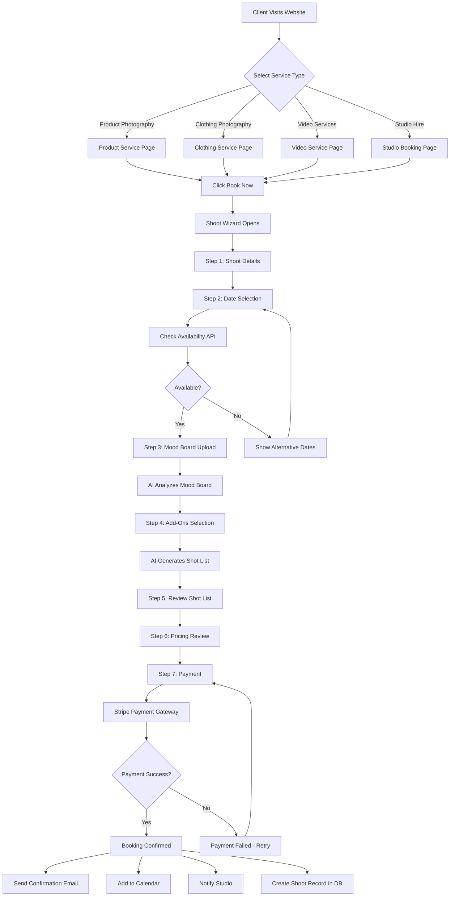
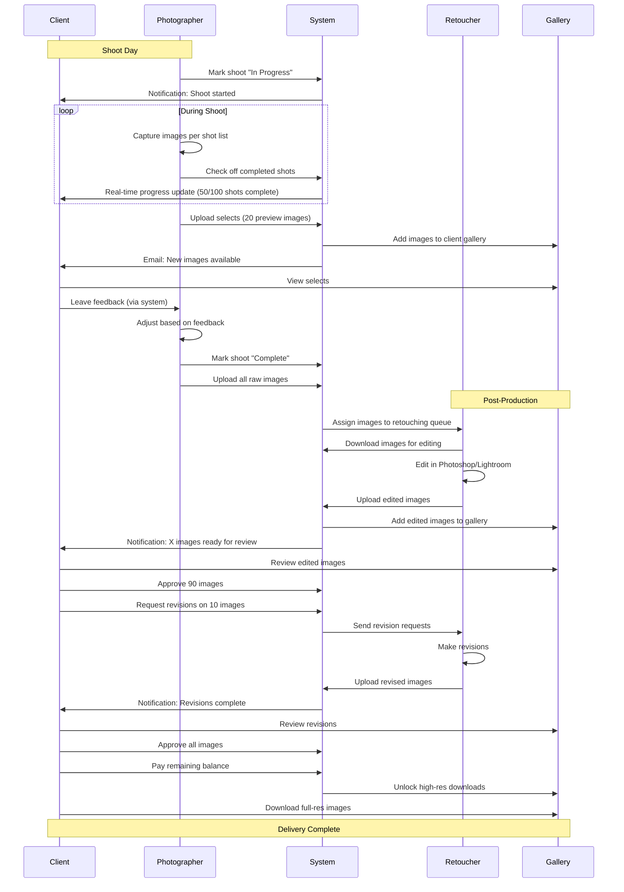
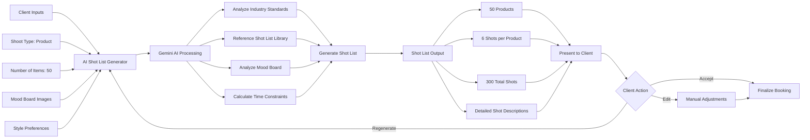
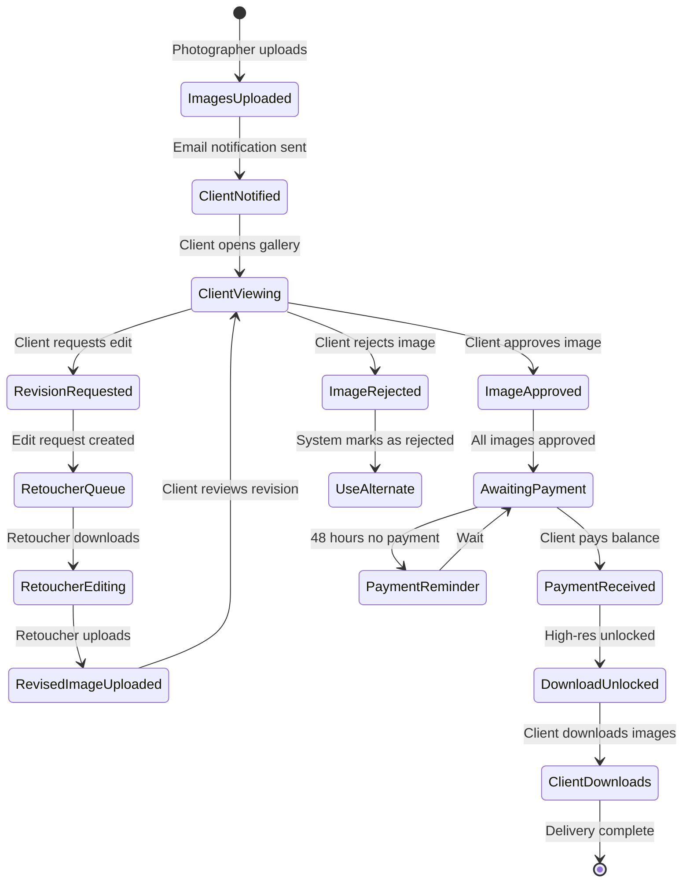
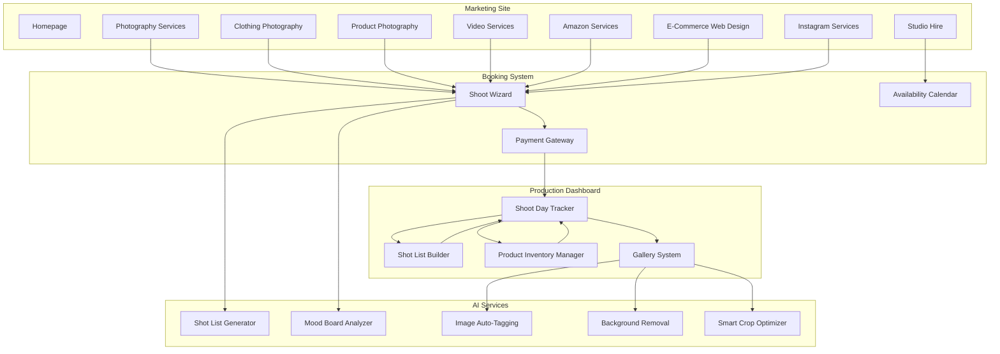

# FashionOS Services - Product Requirements Document (PRD)

**Version:** 1.0  
**Last Updated:** December 9, 2025  
**Product Module:** Photography & Video Services Management  
**Tech Stack:** React, TypeScript, Tailwind CSS, Google Gemini AI

---

## Table of Contents

1. [Executive Summary](#executive-summary)
2. [Problem Statement](#problem-statement)
3. [Target Users](#target-users)
4. [Core Features](#core-features)
5. [Advanced Features / AI Features](#advanced-features--ai-features)
6. [Use Cases + Real World Examples](#use-cases--real-world-examples)
7. [User Stories](#user-stories)
8. [User Journey](#user-journey)
9. [Workflows](#workflows)
10. [Mermaid Diagrams](#mermaid-diagrams)
11. [Service Pages (Purpose + Content)](#service-pages-purpose--content)
12. [Dashboard Pages](#dashboard-pages)
13. [Data Model](#data-model)
14. [AI Functions](#ai-functions)
15. [Success Criteria](#success-criteria)
16. [Implementation Notes](#implementation-notes)

---

## 1. Executive Summary

**FashionOS Services** is the production management module of the FashionOS platform, designed to streamline booking, planning, and executing fashion photography and video shoots. It serves as an all-in-one solution for fashion studios, brands, e-commerce companies, and content creators to manage their visual production workflow from initial inquiry to final asset delivery.

**Key Capabilities:**
- Multi-service booking system (Photography, Video, Studio Hire)
- AI-powered shoot planning and shot list generation
- Real-time shoot tracking and collaboration
- Asset management and client review workflows
- Inventory management for product shoots
- Specialized workflows for Amazon, Instagram, e-commerce, and runway content
- Automated post-production tracking and delivery

**Core Value Proposition:**
- **For Studios:** Streamline bookings, reduce no-shows, automate shot lists, track all projects in one place
- **For Brands/E-Commerce:** Book professional shoots easily, manage product inventory, approve assets faster
- **For Photographers:** Focus on creativity, not admin—AI handles shot lists, scheduling, and client communication

---

## 2. Problem Statement

### Current Industry Challenges:

**For Photography Studios:**
- Bookings managed via email/phone lead to double-bookings and miscommunication
- Shot lists created manually in spreadsheets, often incomplete
- No centralized system to track shoot progress and deliverables
- Client approvals happen via email chains with attachments, causing version control nightmares
- Difficult to showcase portfolio and service offerings professionally

**For Fashion Brands & E-Commerce:**
- Finding reliable photographers requires extensive research and referrals
- No standardized way to communicate shoot requirements
- Product inventory tracking disconnected from shoot scheduling
- Long turnaround times for receiving and approving photos
- No visibility into shoot progress or timeline

**For Freelance Photographers:**
- Managing multiple client bookings in calendar apps is chaotic
- Creating custom shot lists for each client is time-consuming
- Difficult to showcase work and attract new clients
- Payment tracking and invoicing done manually
- No professional client portal

**FashionOS Services Solution:**
Provides an integrated platform where studios can showcase services, clients can book and manage shoots, photographers can access AI-powered planning tools, and all stakeholders collaborate in real-time through a professional workflow system.

---

## 3. Target Users

### Primary Users:

1. **Photography Studios**
   - Role: Offer professional fashion photography services
   - Needs: Booking management, studio scheduling, portfolio showcase, client communication
   - Pain Point: Double-bookings, manual shot lists, disorganized client files

2. **E-Commerce Brands**
   - Role: Need product photography for online stores (especially Amazon, Shopify)
   - Needs: Easy booking, product inventory tracking, fast turnaround, white background images
   - Pain Point: Coordinating shoots for 100+ SKUs, managing product samples

3. **Fashion Designers & Brands**
   - Role: Need lookbooks, runway coverage, campaign shoots
   - Needs: Creative direction, model coordination, editorial-quality output
   - Pain Point: Finding photographers who understand fashion aesthetic

4. **Freelance Fashion Photographers**
   - Role: Independent creatives offering specialized services
   - Needs: Client booking system, shot list automation, portfolio showcase, payment tracking
   - Pain Point: Administrative overhead, no professional client portal

5. **Social Media Managers**
   - Role: Create Instagram, TikTok, and social content
   - Needs: Quick turnaround, vertical format optimization, trend-aligned content
   - Pain Point: Booking last-minute shoots, getting assets in correct formats

### Secondary Users:

6. **Models & Talent Agents**
   - Needs: Availability tracking, rate cards, portfolio updates

7. **Stylists & Art Directors**
   - Needs: Mood boards, wardrobe coordination, shot approval

8. **Post-Production Teams**
   - Needs: Retouching queues, client revision tracking, delivery schedules

---

## 4. Core Features

### 4.1 Service Marketplace & Booking System

**Purpose:** Allow clients to discover photography services and book shoots online

**Features:**
- **Service Catalog Pages:**
  - Photography Services (general fashion editorial)
  - Clothing Photography (ghost mannequin, flat lay, model on white)
  - Product Photography (jewelry, accessories, shoes)
  - Video Services (runway, campaign, social media content)
  - Amazon Services (specialized for Amazon listing requirements)
  - E-Commerce Web Design (product photo packages for Shopify/WooCommerce)
  - Instagram Services (Reels, Stories, feed content)
  - Studio Hire (rent studios with or without photographer)

- **Booking Flow:**
  - Select service type
  - Choose date and time
  - Select add-ons (models, styling, retouching)
  - Upload brief/inspiration images
  - Receive instant quote
  - Pay deposit to confirm

- **Dynamic Pricing:**
  - Half-day vs. full-day rates
  - Per-product pricing for e-commerce
  - Package deals (e.g., 50 products for $X)
  - Model fees, styling fees calculated automatically

- **Availability Calendar:**
  - Real-time studio availability
  - Photographer availability (if specific photographer requested)
  - Blocked-out dates for holidays/maintenance

**Real-World Example:**
> E-commerce brand "Luxe Accessories" needs product photography for 75 handbags. They visit FashionOS Services → select "Product Photography" → choose "E-Commerce Package (50-100 items)" → select date Feb 15 → add "Professional Styling" add-on → receive quote $3,750 → pay $1,000 deposit → booking confirmed. Shoot brief auto-sent to photographer with product list.

---

### 4.2 Shoot Wizard (Multi-Step Booking)

**Purpose:** Guide clients through shoot planning with AI assistance

**Features:**

**Step 1: Shoot Type Selection**
- Campaign Shoot (brand storytelling, editorial)
- Product Shoot (e-commerce, catalog)
- Runway Coverage (fashion shows)
- Lookbook (collection showcase)
- Video & Social (Instagram Reels, TikTok)
- Custom Shoot (build from scratch)

**Step 2: Shoot Details**
- Number of looks/products
- Shoot duration estimate (AI-calculated based on product count)
- Location: Studio, on-location, client venue
- Date and time preferences

**Step 3: Creative Direction**
- Upload mood board/inspiration images
- Select vibe: Minimalist, Editorial, Bold & Colorful, Dark & Moody, Natural Light
- Reference brands or styles (e.g., "like Zara's aesthetic")

**Step 4: Talent & Styling**
- Model needed? (Yes/No)
- If yes: Select from portfolio or studio books model
- Styling needed? (Own wardrobe vs. stylist)
- Hair & makeup? (Yes/No)

**Step 5: Deliverables**
- Number of final edited images
- Format: JPEG, PNG, TIFF, RAW
- Resolution: Web (72 DPI) or Print (300 DPI)
- Turnaround time: Rush (3 days), Standard (7 days), Extended (14 days)

**Step 6: Add-Ons**
- Retouching level: Basic, Advanced, High-End
- Video add-on (BTS, social clips)
- Usage rights: Editorial, Commercial, Unlimited

**Step 7: Review & Confirm**
- AI-generated shoot plan summary
- Itemized pricing breakdown
- Estimated timeline from shoot to delivery
- Payment: Deposit now, balance after shoot

**AI Features in Wizard:**
- Auto-calculates shoot duration based on product count and complexity
- Suggests add-ons based on shoot type (e.g., recommends styling for lookbook shoots)
- Flags potential issues (e.g., "100 products in 4 hours may be rushed—consider full-day booking")
- Generates preliminary shot list based on inputs

**Real-World Example:**
> Fashion brand launching Fall collection uses Shoot Wizard → selects "Lookbook" → 24 looks → uploads mood board (minimalist, neutral tones) → books model + stylist → requests 48 edited images + 5 Instagram Reels → AI calculates full-day shoot required → quotes $5,500 → client accepts → booking complete with auto-generated shot list.

---

### 4.3 Shot List Builder (AI-Powered)

**Purpose:** Generate comprehensive shot lists automatically or collaboratively

**Features:**

**AI Auto-Generation:**
- Input: Number of products/looks, shoot type, style references
- Output: Detailed shot list with specific angles, compositions, and setups
- Example for Product Photography:
  ```
  Product: Leather Handbag SKU-001
  1. Front view on white background (straight-on)
  2. Back view on white background
  3. Side view (profile)
  4. Top view (overhead, showing interior)
  5. Detail shot: Stitching and hardware
  6. Detail shot: Interior lining and pockets
  7. Lifestyle shot: Model holding bag (optional)
  ```

**Manual Shot List Creation:**
- Drag-and-drop interface to build custom lists
- Shot templates library:
  - E-Commerce Standard (6 angles per product)
  - Amazon Listing Requirements (main + 6 additional images)
  - Editorial Lookbook (full body, close-ups, details)
  - Flat Lay (overhead styling)
  - Ghost Mannequin (invisible model effect)

**Collaborative Editing:**
- Client can review and request additional shots
- Photographer can add notes or technical requirements
- Version history tracks changes

**Shot Checklist During Shoot:**
- Mobile-friendly checklist
- Mark shots as captured in real-time
- Upload sample images to confirm with client

**Integration with Gallery:**
- After shoot, images auto-tagged with shot list items
- Client can easily match delivered images to requested shots

**Real-World Example:**
> Photographer receives booking for 50 jewelry pieces. Shot List Builder generates 300 shots (6 per piece: front, back, side, top, detail, lifestyle). During shoot, photographer uses tablet to check off shots. At end of day, 298/300 captured (2 lifestyle shots skipped due to time). Client dashboard shows 99% completion rate.

---

### 4.4 Product Inventory Management

**Purpose:** Track products scheduled for shoots and their status

**Features:**

**Product Database:**
- Import products via CSV or manually add
- Fields: SKU, Name, Category, Color, Size, Quantity, Status, Image URL
- Custom fields for brand-specific needs

**Shoot Assignment:**
- Assign products to specific shoots
- Track which products have been photographed vs. pending
- Flag products that need re-shoots

**Product Status Tracking:**
- Statuses: Not Photographed, Scheduled, In Shoot, Completed, Delivered, Re-Shoot Needed
- Filter and sort by status
- Bulk status updates

**Sample Tracking:**
- Mark when products sent to studio
- Track return shipping
- Flag damaged or missing samples

**Integration with Shot List:**
- Products auto-populate in shot list
- Each product links to its shots
- Easy identification of incomplete products

**Reporting:**
- Products photographed this month
- Average shots per product
- Products pending photography
- Re-shoot rate

**Real-World Example:**
> E-commerce brand uploads CSV with 500 SKUs for seasonal catalog. Schedule spreads across 10 shoot days (50 products per day). As each shoot completes, products marked "Completed." Dashboard shows 350/500 photographed (70%). Brand can easily see which 150 products still need shoots and reschedule accordingly.

---

### 4.5 Studio Hire & Scheduling

**Purpose:** Rent studio space with or without photography services

**Features:**

**Studio Listings:**
- Multiple studios per location (e.g., Studio A, Studio B, Studio C)
- Studio specs: Square footage, ceiling height, equipment included
- Photo galleries of each studio
- Pricing: Hourly, half-day, full-day rates

**Availability Calendar:**
- Real-time availability for all studios
- Color-coded: Available (green), Booked (red), Blocked (yellow)
- Calendar view: Day, week, month

**Self-Service Booking:**
- Clients can book studio without photographer
- Add-ons: Equipment rental (lights, backdrops, cameras), technician assistance
- Automatic confirmation email with access instructions

**Studio Features:**
- Equipment list: Lights, modifiers, backdrops, cameras, lenses
- Amenities: WiFi, client lounge, changing room, kitchenette
- Capacity: Max people allowed

**Booking Rules:**
- Minimum booking duration (e.g., 2 hours)
- Setup/breakdown time included
- Cancellation policy (24-hour notice)

**Studio Manager Dashboard:**
- View all bookings across studios
- Manage equipment inventory
- Track studio utilization rate
- Maintenance scheduling

**Real-World Example:**
> Freelance photographer books Studio B for half-day (4 hours) for personal project → adds "Profoto Lighting Kit" rental → pays $350 total → receives access code and equipment list → arrives on shoot day, equipment ready, shoots project, leaves → studio manager marks booking complete.

---

### 4.6 Campaign Shoots & Creative Projects

**Purpose:** Manage large-scale creative shoots with multiple stakeholders

**Features:**

**Campaign Planning:**
- Create campaign brief with creative direction
- Set campaign goals and KPIs (e.g., "generate 50 hero images for Spring launch")
- Assign team: Photographer, models, stylist, hair/makeup, creative director

**Mood Board & Inspiration:**
- Upload reference images
- Create Pinterest-style mood boards
- Tag images with keywords (colors, styles, emotions)

**Shot List by Scene:**
- Organize shots into scenes/setups
- Scene 1: Beach location, model in white dress, golden hour
- Scene 2: Studio, editorial poses, bold makeup
- Estimate time per scene

**Logistics Coordination:**
- Location scouting and booking
- Permits and insurance
- Call sheet generation (who arrives when)
- Weather contingency plans for outdoor shoots

**Client Collaboration:**
- Share mood boards for approval
- Collaborate on shot list
- Real-time shoot updates (upload selects during shoot)

**Campaign Assets:**
- All images tagged with campaign name
- Easy filtering by campaign
- Campaign-specific galleries for client review

**Real-World Example:**
> Luxury fashion brand plans Spring/Summer campaign → creates brief in FashionOS → uploads mood board (ethereal, pastel colors, beach vibes) → books 2-day shoot with 3 models → AI generates 120-shot list across 8 scenes → assigns team (photographer, stylist, hair/makeup) → generates call sheets → day 1: beach location, 60 shots captured → uploads selects for client to review same evening → day 2: studio, 60 shots captured → campaign complete, 115/120 shots delivered.

---

### 4.7 Runway & Event Photography

**Purpose:** Specialized workflow for runway shows and fashion events

**Features:**

**Pre-Event Planning:**
- Event details: Date, venue, number of designers, expected runway looks
- Shot requirements: Full body, close-ups, details, backstage, VIP guests
- Access credentials: Press pass, backstage access

**Runway Shot List:**
- Auto-generate based on number of looks
- Designate priority shots (key looks for press)
- Assign shots to multiple photographers if needed

**Real-Time Capture:**
- Fast workflow for rapid shooting (runway shows last 15-30 min)
- Auto-tagging by designer and look number
- Immediate upload to cloud for client access

**Backstage Coverage:**
- Behind-the-scenes shots
- Model preparation, hair/makeup
- Designer interviews

**Post-Event Delivery:**
- Rush delivery option (selects within 2 hours)
- Full gallery within 24 hours
- High-res downloads for press

**Event Packages:**
- Bronze: Runway coverage only (full body shots)
- Silver: Runway + close-ups + key details
- Gold: Runway + backstage + VIP guests + interviews
- Platinum: Multi-photographer coverage + videographer + live social media posting

**Real-World Example:**
> Emerging designer books runway coverage for fashion week show → selects Gold package ($2,500) → photographer captures 42 runway looks + 30 backstage shots + 15 VIP guest photos → uploads selects to client gallery within 2 hours of show end → designer downloads hero images for press release same evening → full edited gallery delivered 24 hours later.

---

### 4.8 Video & Social Content Production

**Purpose:** Video shoot planning and social media content creation

**Features:**

**Video Shoot Types:**
- Campaign Video (30-60 sec brand story)
- Product Video (360° rotation, close-ups)
- Runway Video (full show coverage)
- Instagram Reels (15-30 sec vertical video)
- TikTok Content (trend-based, dance challenges)
- Behind-the-Scenes (documentary style)
- Designer Interviews (talking head + B-roll)

**Video Planning:**
- Storyboard creation (upload sketches or use templates)
- Shot list (video scenes/B-roll needed)
- Talent casting (on-camera personality or voice-over)
- Music selection (royalty-free library or custom)

**Video Deliverables:**
- Format: MP4, MOV, ProRes
- Resolutions: 4K, 1080p, 720p
- Aspect ratios: 16:9 (landscape), 9:16 (vertical for Stories/Reels), 1:1 (square for feed)
- Versions: Full length, 30-sec cut, 15-sec cut, 6-sec bumper

**Social Media Optimization:**
- Auto-crop for vertical (9:16)
- Add captions/subtitles (AI-generated)
- Thumbnail selection
- Hashtag suggestions

**Post-Production Tracking:**
- Edit queue with deadlines
- Client revision rounds (2 included, additional charged)
- Version control

**Video Gallery:**
- Stream videos directly from platform
- Download links for high-res files
- Share links for social media teams

**Real-World Example:**
> Fashion brand needs 5 Instagram Reels for new collection launch → books "Social Content Package" ($1,500) → shoots 3-hour session with model → captures 15 outfit changes → editor creates 5 Reels (each 20 sec, vertical format, trending audio) → adds captions and hashtags → delivers within 48 hours → brand schedules Reels for Instagram.

---

### 4.9 Amazon-Specific Services

**Purpose:** Photography optimized for Amazon listing requirements

**Features:**

**Amazon Image Requirements:**
- Main image: Pure white background (RGB 255, 255, 255), product fills 85% of frame
- Additional images: Lifestyle, features, scale, packaging, dimensions
- Infographics: Highlight key features with text overlays
- Compliance checking: AI flags non-compliant images

**Amazon Shot List Template:**
- 1 main image (white background)
- 6 additional images:
  - Image 2: Product in use (lifestyle)
  - Image 3: Close-up of key feature
  - Image 4: Size/scale comparison
  - Image 5: Packaging shot
  - Image 6: Infographic (features + benefits)
  - Image 7: Alternate angle or color variant

**Batch Processing:**
- Upload 100+ SKUs for batch photography
- Automated background removal (white background)
- Consistent lighting and shadows across all products
- SKU labeling system

**Amazon A+ Content:**
- Enhanced brand content images
- Lifestyle imagery with text overlays
- Comparison charts
- Brand story visuals

**Optimization Tools:**
- Image compression for fast loading (under 10MB)
- Color correction for consistent brand look
- AI suggests improvements for click-through rate

**Real-World Example:**
> Amazon seller with 200 product SKUs books "Amazon Photography Package" → ships all products to studio → photographer captures 7 images per product (1,400 total images) → AI removes backgrounds, ensures compliance → delivers organized by SKU with Amazon-ready filenames (PRODUCT-SKU-MAIN.jpg, PRODUCT-SKU-02.jpg, etc.) → seller uploads directly to Amazon listings → sees 35% increase in conversion rate due to professional images.

---

### 4.10 Gallery & Asset Review System

**Purpose:** Deliver, review, and approve final images

**Features:**

**Private Client Galleries:**
- Password-protected galleries per project
- Beautiful grid or slideshow view
- Responsive design (desktop, tablet, mobile)

**Image Approval Workflow:**
- **View:** Client browses all images
- **Select:** Client marks favorites or "approves"
- **Reject:** Client marks images for exclusion
- **Comment:** Client leaves specific feedback on images
- **Request Edit:** Client requests retouching or adjustments

**Rating & Favoriting:**
- 5-star rating system
- Heart icon to favorite images
- Filter by rating or favorites

**Download Options:**
- Individual image download
- Bulk download (all approved images)
- Select resolution: Web (1200px), Print (300 DPI), Original (RAW)
- Zipped folder delivery

**Sharing:**
- Share gallery link with team members
- Email gallery link to stakeholders
- Expiration dates for gallery access (e.g., 90 days)

**Revision Requests:**
- Client selects image and describes edit needed
- Edit request sent to photographer/retoucher
- Revised image uploaded to same gallery
- Version comparison (original vs. edited side-by-side)

**Watermarking:**
- Optional watermark for preview images
- Removed upon final approval and payment

**Gallery Analytics:**
- Track which images viewed most
- Time spent on gallery
- Download metrics

**Real-World Example:**
> Client receives link to private gallery with 75 product images → browses on desktop → marks 60 images as "Approved," 10 as "Needs Retouching" (with comments like "remove background crease"), 5 as "Reject" → photographer sees feedback → makes edits → re-uploads 10 retouched images → client approves all → downloads full-res files → gallery auto-archives after 90 days.

---

### 4.11 Post-Production & Retouching Queue

**Purpose:** Manage editing and retouching workflows

**Features:**

**Retouching Levels:**
- **Basic:** Color correction, exposure adjustment, cropping
- **Advanced:** Skin retouching, background cleanup, minor object removal
- **High-End:** Magazine-quality retouching, liquify, extensive compositing

**Retouching Queue:**
- All shoots feed into retouching queue
- Priority levels: Rush, Standard, Low Priority
- Assigned to specific retouchers
- Estimated completion time displayed

**Batch Editing:**
- Apply same edits to multiple images
- Color profile presets
- Cropping ratios (e.g., all images 4:5 for Instagram)

**Client Revision Rounds:**
- Standard: 2 revision rounds included
- Additional rounds charged per image
- Revision history tracked

**Delivery Notifications:**
- Email notification when images ready
- Push notification (if mobile app)
- SMS for rush deliveries

**Retoucher Dashboard:**
- View assigned images
- Upload edited versions
- Mark status: In Progress, Pending Client Review, Complete

**Real-World Example:**
> 100 product images enter retouching queue → assigned to retoucher team (4 people) → basic retouching required (color correction + background cleanup) → estimated 2 days → retoucher marks progress (25/100, 50/100, 75/100) → all 100 complete in 1.5 days → client receives notification → reviews images → requests 8 revisions → revisions completed same day → final delivery approved.

---

## 5. Advanced Features / AI Features

### 5.1 AI Shot List Generation

**Function:** `generateShotList(shootDetails)`

**Input Data:**
- Shoot type (product, lookbook, campaign, runway)
- Number of items/looks
- Style references or mood board images
- Client preferences (angles, compositions)

**AI Processing:**
1. Analyze shoot type and industry standards
2. Reference library of successful shot lists
3. Consider product category (e.g., jewelry requires more detail shots than apparel)
4. Adapt to client style preferences
5. Calculate optimal shot count for time available

**Output Example (Product Photography):**
```json
{
  "shoot_id": "shoot-uuid",
  "total_shots": 300,
  "products": 50,
  "shots_per_product": 6,
  "shot_list": [
    {
      "product_sku": "BAG-001",
      "product_name": "Leather Tote Black",
      "shots": [
        {
          "shot_number": 1,
          "description": "Front view on white background",
          "angle": "Straight-on, eye level",
          "setup": "Product centered, evenly lit",
          "priority": "high"
        },
        {
          "shot_number": 2,
          "description": "Back view on white background",
          "angle": "Rear view",
          "setup": "Show back pocket details",
          "priority": "high"
        },
        // ... 4 more shots
      ]
    }
    // ... 49 more products
  ],
  "estimated_duration": "8 hours (full day)",
  "recommended_breaks": ["10am", "12:30pm", "3pm"]
}
```

**Implementation:**
- Available in Shoot Wizard (Step 5: Shot List)
- Editable after generation
- Can regenerate with different parameters

---

### 5.2 Mood Board Analysis & Style Matching

**Function:** `analyzeMoodBoard(images[])`

**Input Data:**
- Client-uploaded inspiration images (3-20 images)

**AI Processing:**
1. Analyze images with Gemini Vision API
2. Extract dominant colors, lighting style, composition patterns
3. Identify aesthetic keywords (minimalist, editorial, bold, natural light)
4. Match to photographer portfolio styles
5. Generate shoot recommendations

**Output Example:**
```json
{
  "style_analysis": {
    "dominant_colors": ["#F5F5F5", "#E8E8E8", "#1A1A1A"],
    "color_palette": "Monochromatic, neutral tones",
    "lighting_style": "Soft, diffused natural light",
    "composition": "Minimalist, negative space, clean lines",
    "aesthetic_keywords": ["minimalist", "scandinavian", "editorial", "airy"],
    "similar_brands": ["Everlane", "COS", "& Other Stories"]
  },
  "recommendations": {
    "photographer": "Suggest Photographer C (specializes in minimalist aesthetic)",
    "studio": "Studio A (large windows, natural light)",
    "props": "Minimal - white surfaces, concrete, light wood",
    "models": "Natural beauty, minimal makeup, effortless styling"
  },
  "generated_brief": "Create clean, minimalist product imagery with soft natural light. Focus on negative space and simple compositions. Use neutral color palette (whites, grays, blacks). Avoid busy backgrounds or over-styling."
}
```

**Implementation:**
- Triggered when client uploads mood board in Shoot Wizard
- Displays analysis and recommendations
- Photographer receives brief with analysis

---

### 5.3 Auto-Tagging & Image Recognition

**Function:** `analyzeAndTagImage(imageUrl)`

**Input Data:**
- Uploaded shoot image

**AI Processing:**
1. Gemini Vision API analyzes image content
2. Identifies: Product type, color, angle, background, model presence
3. Detects technical qualities: Exposure, focus, composition
4. Flags issues: Blurry, underexposed, color cast

**Output Example:**
```json
{
  "image_id": "img-uuid-001",
  "tags": {
    "product_type": "handbag",
    "color": "black",
    "angle": "front view",
    "background": "white seamless",
    "model_present": false,
    "shot_type": "product photography"
  },
  "technical_analysis": {
    "exposure": "correct",
    "focus": "sharp",
    "white_balance": "neutral",
    "composition": "centered, rule of thirds"
  },
  "quality_score": 95,
  "issues": [],
  "amazon_compliant": true,
  "suggested_use": ["Main Amazon image", "E-commerce listing", "Catalog"]
}
```

**Benefits:**
- Automatic organization of images
- Searchable by tags (e.g., "all black handbag front view images")
- Quality control (flags blurry or poor images)
- Amazon compliance checking

---

### 5.4 Intelligent Shoot Duration Estimation

**Function:** `estimateShootDuration(products[], shootType, complexity)`

**Input Data:**
- Number of products or looks
- Shoot type and complexity factors

**AI Processing:**
1. Analyze historical shoot data
2. Calculate average time per product/look
3. Factor in complexity:
   - Simple products (t-shirts) = 3 min/shot
   - Complex products (jewelry with multiple pieces) = 8 min/shot
   - Model styling changes = +15 min per look
4. Add buffer time for setup and breaks

**Output Example:**
```json
{
  "products": 50,
  "shots_per_product": 6,
  "total_shots": 300,
  "estimated_time_breakdown": {
    "setup": "1 hour",
    "shooting": "5.5 hours (1.1 min per shot avg)",
    "breaks": "1 hour (3 x 20 min breaks)",
    "buffer": "0.5 hour",
    "total": "8 hours"
  },
  "recommendation": "Full day booking (8 hours) recommended",
  "confidence": 0.87,
  "warning": null
}
```

**If client tries to book insufficient time:**
```json
{
  "warning": "50 products in 4-hour half-day may be rushed. Quality may be compromised. Consider full-day booking or splitting into 2 sessions."
}
```

**Implementation:**
- Automatically calculates in Shoot Wizard
- Prevents under-booking
- Suggests optimal booking duration

---

### 5.5 Background Removal & Image Processing

**Function:** `removeBackground(imageUrl, targetColor)`

**Input Data:**
- Product image with any background
- Target background color (usually white for Amazon/e-commerce)

**AI Processing:**
1. Gemini Vision or specialized AI detects product edges
2. Creates precise mask around product
3. Removes original background
4. Replaces with solid color (white, transparent, or custom)
5. Preserves shadows and reflections (optional)

**Output:**
- Clean product image on white background
- Transparent PNG option
- Consistent background across all product images

**Batch Processing:**
- Process 100+ images simultaneously
- Consistent results across entire catalog

**Quality Control:**
- AI flags images with poor edge detection
- Manual review queue for complex products

---

### 5.6 Smart Crop & Format Optimization

**Function:** `optimizeForPlatform(imageUrl, platform, aspectRatio)`

**Input Data:**
- Original image
- Target platform (Instagram, Amazon, Pinterest, etc.)
- Desired aspect ratio

**AI Processing:**
1. Analyze image composition
2. Identify key subject/focal point
3. Intelligently crop to target aspect ratio while keeping subject centered
4. Ensure minimum quality standards for platform

**Platform Presets:**
- **Instagram Feed:** 1:1 (square) or 4:5 (portrait)
- **Instagram Stories/Reels:** 9:16 (vertical)
- **Amazon Listing:** Product fills 85% of frame, white background
- **Pinterest:** 2:3 (tall portrait)
- **Facebook/Twitter:** 16:9 (landscape)

**Batch Processing:**
- Upload 1 image, generate 5 platform-optimized versions automatically

**Real-World Example:**
> Photographer uploads 50 horizontal product images → AI generates:
> - 50 square crops for Instagram feed
> - 50 vertical crops for Instagram Stories
> - 50 Amazon-compliant versions (white background, product 85% of frame)
> Total: 200 images delivered from 50 originals

---

### 5.7 Client Preference Learning

**Function:** AI learns client preferences over time

**How It Works:**
1. Track which images client approves vs. rejects
2. Analyze patterns:
   - Preferred angles (e.g., client always approves overhead shots)
   - Color grading preferences (warmer vs. cooler tones)
   - Composition preferences (tight crops vs. negative space)
3. Apply learnings to future shoots

**Example Learning Curve:**
> **Shoot 1:** Client approves 60% of images (40% too dark, too tight crops)
> **AI Learning:** Client prefers brighter exposure, wider crops with negative space
> **Shoot 2:** Photographer briefed with client preferences → approval rate jumps to 85%
> **Shoot 3:** AI-suggested shot list includes more wide shots → approval rate 92%

**Benefits:**
- Fewer revisions needed
- Faster client approvals
- Photographers learn client preferences automatically

---

### 5.8 Predictive Booking & Smart Scheduling

**Function:** `predictOptimalBookingTime(clientId, shootType)`

**AI Processing:**
1. Analyze client's past booking patterns
2. Identify peak seasons (e.g., fashion brand books lookbook shoots every September)
3. Suggest booking in advance based on demand
4. Optimize studio utilization

**Output:**
```json
{
  "client_id": "client-uuid",
  "shoot_type": "lookbook",
  "predicted_next_booking": "September 2026",
  "recommendation": "Book now for preferred dates—September historically 80% booked",
  "suggested_dates": ["Sep 5-6", "Sep 12-13", "Sep 19-20"],
  "price_incentive": "Book 60+ days in advance for 10% discount"
}
```

**Proactive Outreach:**
- System auto-sends email: "Hi [Client], based on your past bookings, you typically schedule a lookbook shoot in September. Would you like to secure dates now?"

---

## 6. Use Cases + Real World Examples

### Use Case 1: E-Commerce Brand Launching 100-Product Line

**Scenario:** Online boutique launching new collection, needs product photography for 100 items.

**Workflow:**
1. Client visits FashionOS Services → selects "Product Photography"
2. Uses Shoot Wizard:
   - 100 products
   - E-commerce package (6 shots per product = 600 total images)
   - White background + 1 lifestyle shot per product
   - AI estimates 3 days needed (200 products/day, 8 hours/day)
3. Books 3 consecutive days at $2,500/day = $7,500 total
4. Ships all 100 products to studio
5. **Day 1:** Photographer shoots 35 products (210 images) → uploads to gallery
6. **Day 2:** 35 products → client reviews Day 1 images, approves 90%, requests 10% re-shoots
7. **Day 3:** 30 products + re-shoots from Days 1-2 → all 100 products complete
8. Post-production: Basic retouching applied to all 600 images
9. **Day 7:** Final gallery delivered, client downloads all images organized by SKU
10. Client uploads to Shopify store, launches collection

**Outcome:**
- 600 professional product images
- 7-day turnaround
- Organized by SKU for easy upload
- Cost: $7,500 (vs. $15,000+ with traditional studio + project manager)

---

### Use Case 2: Fashion Designer Needs Lookbook for Buyers

**Scenario:** Independent designer creating lookbook to show buyers and press for upcoming season.

**Workflow:**
1. Designer uses Shoot Wizard → selects "Lookbook"
2. Inputs: 18 looks, editorial aesthetic, natural light mood board
3. AI generates shot list:
   - 3 shots per look (full body, mid-length, close-up detail)
   - Total: 54 images
   - Estimated shoot time: Full day with model
4. Adds model booking + styling + hair/makeup
5. Total quote: $4,200 (photography $2,000, model $800, styling $700, hair/makeup $700)
6. Pays deposit, books shoot for June 15
7. **Pre-Shoot:** Uploads lookbook layout inspiration, shot list reviewed with photographer
8. **Shoot Day:** 8 hours, 18 looks captured, 60 total images (exceeded shot list)
9. **Same Evening:** Photographer uploads selects (10 best images) for immediate review
10. **3 Days Later:** Full gallery delivered with basic editing
11. Designer reviews, approves 52 images, requests advanced retouching on 10 hero images
12. **7 Days Later:** Final retouched images delivered
13. Designer uses images to create digital lookbook PDF, sends to 50 buyers and press contacts

**Outcome:**
- Professional lookbook in 10 days
- 52 usable images for marketing
- Press coverage secured from 3 publications due to quality of imagery

---

### Use Case 3: Amazon Seller Optimizing Listings

**Scenario:** Amazon seller with poor product photos wants to increase conversion rate.

**Workflow:**
1. Client books "Amazon Photography Package" for 50 SKUs
2. AI shot list generator creates Amazon-compliant shot list:
   - 1 main image (white background)
   - 6 additional images per product (lifestyle, features, scale, infographic)
   - Total: 350 images (7 per product)
3. Client ships all 50 products to studio in one box
4. **2-Day Shoot:** All products photographed
5. **Post-Production:**
   - AI removes backgrounds (pure white, RGB 255,255,255)
   - Ensures products fill 85% of frame per Amazon requirements
   - Creates infographics highlighting key features
6. **Day 5:** Delivers organized folder:
   ```
   Product-ABC123/
     ABC123-MAIN.jpg (main image)
     ABC123-01.jpg (lifestyle)
     ABC123-02.jpg (feature close-up)
     ABC123-03.jpg (scale comparison)
     ABC123-04.jpg (packaging)
     ABC123-05.jpg (infographic)
     ABC123-06.jpg (alternate angle)
   ```
7. Client uploads images to Amazon listings
8. **Results after 30 days:**
   - Conversion rate: 8.2% → 11.7% (+42% increase)
   - Sales: +$18,000/month attributed to new images
   - ROI: $5,000 spent on photography → $18,000 monthly revenue increase = 3.6x ROI

---

### Use Case 4: Instagram Influencer Needs Consistent Content

**Scenario:** Fashion influencer needs monthly content shoot for Instagram feed and Reels.

**Workflow:**
1. Influencer books "Instagram Content Package" (recurring monthly)
2. Package includes:
   - 4-hour studio session
   - 10 outfit changes
   - 40 edited images (4 per outfit for feed)
   - 5 Instagram Reels (15-20 seconds each)
3. **Monthly Shoot Day:**
   - Photographer captures 10 outfits in various poses and setups
   - Videographer captures B-roll for Reels
4. **Post-Production:**
   - Color grade all images with influencer's signature preset (warm, airy tones)
   - Edit 5 Reels with trending audio, captions, transitions
5. **48-Hour Turnaround:** All content delivered
6. Influencer schedules 40 images across 4 weeks (3 posts/week + Stories)
7. Posts 1 Reel per week for 5 weeks

**Outcome:**
- Consistent, high-quality content every month
- Influencer grows from 15K → 45K followers in 6 months due to consistent posting
- Cost: $1,200/month (vs. $300/post for freelance photographers = $3,600/month for same content)

---

### Use Case 5: Runway Show Coverage for Emerging Designer

**Scenario:** Designer showing at fashion week needs professional runway and backstage coverage.

**Workflow:**
1. Designer books "Runway Coverage - Gold Package" 2 weeks before show
2. Package includes:
   - Runway coverage (all looks, full body + close-ups)
   - Backstage coverage (model prep, designer candids)
   - VIP guest photos
   - 2-hour rush delivery of selects
3. **Show Day:**
   - Photographer arrives 2 hours early for backstage setup shots
   - Captures 38 runway looks (full body, close-ups, detail shots = 114 images)
   - Captures 25 backstage moments
   - Captures 12 VIP guest arrivals
4. **2 Hours After Show:**
   - Photographer uploads 20 hero selects to private gallery
   - Designer downloads immediately for press release and Instagram
5. **24 Hours After Show:**
   - Full gallery delivered (151 edited images)
   - Designer shares gallery link with press and buyers
6. Images featured in 5 fashion publications within 48 hours

**Outcome:**
- Professional runway coverage at affordable price ($2,500 vs. $10,000+ for agency)
- Fast turnaround enabled press coverage
- Designer gains credibility with buyers due to quality imagery

---

## 7. User Stories

### For Studios/Photographers:
- As a studio owner, I want an online booking system so clients can book without emailing back and forth.
- As a photographer, I want AI to generate shot lists so I don't have to create them manually for every client.
- As a freelancer, I want a professional portfolio website integrated so I can showcase my work and attract clients.
- As a retoucher, I want a queue system so I can see all images that need editing and their deadlines.

### For E-Commerce Brands:
- As an e-commerce manager, I want to book product photography for 100+ SKUs in one session so I can launch my collection on time.
- As a brand owner, I want to track which products have been photographed so I know what's left to shoot.
- As a marketer, I want images delivered in multiple formats (web, print, social) so I can use them across channels without reformatting.

### For Fashion Designers:
- As a designer, I want to book a lookbook shoot with model, styling, and hair/makeup in one package so I don't have to coordinate vendors separately.
- As a creative director, I want to upload mood boards and have AI match me with photographers who fit my aesthetic.
- As a brand owner, I want a private gallery where I can review images and request edits without email chains.

### For Social Media Managers:
- As a social media manager, I want to book monthly content shoots so I have consistent posts without scrambling last-minute.
- As an Instagram specialist, I want images automatically cropped to Instagram's aspect ratios so I don't have to edit them manually.
- As a content creator, I want video clips delivered as Reels (9:16 vertical) so they're ready to post immediately.

---

## 8. User Journey

### Journey: E-Commerce Brand Booking Product Photography

**Phase 1: Discovery (Day 1)**
1. Brand discovers FashionOS Services via Google search for "product photography for e-commerce"
2. Lands on **Product Photography** service page
3. Reads about packages, pricing, turnaround times
4. Views portfolio of past product photography work
5. Decides to book

**Phase 2: Booking (Day 1, 15 minutes)**
6. Clicks "Book Now" → Shoot Wizard opens
7. **Step 1:** Selects "Product Photography" → "E-Commerce Package"
8. **Step 2:** Inputs 75 products, selects "White Background + 1 Lifestyle Shot" = 450 total images
9. **Step 3:** AI estimates 2 days needed → selects dates (June 10-11)
10. **Step 4:** Uploads 3 reference images (clean, minimalist style)
11. **Step 5:** Reviews AI-generated shot list (6 shots per product)
12. **Step 6:** Adds "Professional Styling" add-on for lifestyle shots
13. **Step 7:** Reviews quote: $5,500 (photography $4,500, styling $1,000)
14. **Step 8:** Pays $1,500 deposit via Stripe
15. Receives confirmation email with:
    - Booking details
    - Product shipping instructions (ship to studio by June 8)
    - Shot list attached as PDF
    - Pre-shoot questionnaire link

**Phase 3: Pre-Production (Days 2-9)**
16. Brand fills out questionnaire:
    - Product details (SKUs, descriptions, special handling)
    - Style preferences
    - Deadline for final delivery (June 20)
17. Ships 75 products to studio (arrives June 8)
18. Studio confirms product receipt → uploads unboxing photos to client portal
19. Client reviews product arrival photos, flags 2 items that arrived damaged
20. Studio sources replacements locally

**Phase 4: Shoot Days (Days 10-11)**
21. **June 10 (Day 1):**
    - Photographer shoots 40 products (240 images)
    - Uploads day-end selects to gallery for client preview
22. **June 11 (Day 2):**
    - Photographer shoots 35 products (210 images)
    - Client reviews Day 1 selects, leaves 3 comments ("Can we get a tighter crop on SKU-042?")
    - Photographer re-shoots 3 products based on feedback
23. Shoot complete: 453 images captured (450 planned + 3 re-shoots)

**Phase 5: Post-Production (Days 12-16)**
24. All images enter retouching queue
25. Basic retouching: Color correction, background cleanup, cropping
26. Client receives daily updates: "120/453 images complete," "240/453 complete," etc.
27. **June 16:** Full gallery ready
28. Client receives email notification with gallery link

**Phase 6: Review & Approval (Days 17-18)**
29. Client reviews gallery:
    - Approves 440 images ✓
    - Requests 10 re-edits (minor adjustments: "brighten slightly," "crop tighter")
    - Rejects 3 images (will use alternates)
30. Editor makes 10 revisions within 24 hours
31. Client approves all revisions

**Phase 7: Delivery (Day 19)**
32. Client pays remaining balance ($4,000)
33. Downloads full-res images organized by SKU
34. Receives:
    - High-res JPEGs (300 DPI for print)
    - Web-optimized JPEGs (72 DPI, compressed)
    - File naming: SKU-001-main.jpg, SKU-001-lifestyle.jpg, etc.
35. Uploads to Shopify store

**Phase 8: Post-Delivery (Day 20+)**
36. Brand launches collection on Shopify
37. FashionOS sends follow-up survey: "How was your experience?"
38. Brand rates 5/5 stars, leaves testimonial
39. **3 Months Later:** Brand books repeat shoot for next season (AI proactively suggests based on past patterns)

**Total Journey Time:** 19 days from booking to delivery  
**Client Touchpoints:** 15 interactions with platform  
**Client Satisfaction:** 5/5 stars

---

## 9. Workflows

### Workflow 1: Client Booking Workflow

```
Client visits FashionOS Services website
   ↓
Browses service pages (Product, Clothing, Video, etc.)
   ↓
Clicks "Book Now" on desired service
   ↓
Shoot Wizard opens (multi-step form)
   ↓
Step 1: Select shoot type and details
   ↓
Step 2: Choose date and time (checks real-time availability)
   ↓
Step 3: Upload mood board (optional)
   ↓
AI analyzes mood board → suggests photographer and style
   ↓
Step 4: Select add-ons (model, styling, retouching level)
   ↓
Step 5: Review AI-generated shot list (editable)
   ↓
Step 6: Review pricing breakdown
   ↓
Step 7: Enter billing information
   ↓
Pay deposit (Stripe payment gateway)
   ↓
Booking confirmed → Email sent to client and studio
   ↓
Calendar invite added to client's calendar
   ↓
Pre-shoot questionnaire sent to client (auto-triggered)
   ↓
Client fills out questionnaire → Studio receives details
   ↓
Studio prepares for shoot
```

---

### Workflow 2: Shoot Day Workflow

```
Photographer Dashboard → View today's shoots
   ↓
Select shoot from list → Opens shoot detail page
   ↓
Review shot list, client preferences, mood board
   ↓
Mark shoot as "In Progress" (status update sent to client)
   ↓
Shoot begins → Photographer follows shot list
   ↓
Check off shots as captured (real-time progress tracking)
   ↓
Upload selects during or after shoot
   ↓
Client receives notification: "New images available in your gallery"
   ↓
Client views selects → Leaves real-time feedback
   ↓
Photographer sees feedback → Adjusts approach or re-shoots
   ↓
Shoot complete → Photographer marks "Complete"
   ↓
All raw images uploaded to cloud storage
   ↓
Images automatically queue for post-production
```

---

### Workflow 3: Post-Production Workflow

```
Shoot marked complete → Images enter retouching queue
   ↓
Retoucher assigned based on:
  - Retouching level (basic, advanced, high-end)
  - Workload balancing
  - Retoucher specialization
   ↓
Retoucher opens retouching dashboard → Views assigned images
   ↓
Downloads batch of images (e.g., 50 at a time)
   ↓
Edits in Photoshop/Lightroom:
  - Color correction
  - Exposure adjustment
  - Background cleanup
  - Skin retouching (if applicable)
   ↓
Uploads edited images back to platform
   ↓
Marks images as "Edited" → Status updates to client
   ↓
Client receives notification: "X/Y images ready for review"
   ↓
Client reviews edited images in gallery:
  - Approves
  - Requests revisions (with specific feedback)
  - Rejects (use alternate shot)
   ↓
If revisions requested:
  Retoucher receives revision requests → Makes edits → Re-uploads
   ↓
If all approved:
  Client marks "Final Approval"
   ↓
Client pays remaining balance (if not paid upfront)
   ↓
High-res images unlocked for download
   ↓
Client downloads images → Delivery complete
   ↓
Gallery archived after 90 days (or per contract terms)
```

---

### Workflow 4: Recurring Client Workflow (AI-Powered)

```
System analyzes client's booking history
   ↓
Identifies pattern: Books lookbook shoot every September
   ↓
AI prediction: Client likely to book again in September 2026
   ↓
60 days before predicted booking (July 1):
  System generates proactive email
   ↓
Email sent to client:
  "Hi [Name], based on your past bookings, you typically schedule 
   a lookbook shoot in September. September is filling up fast—
   would you like to secure your preferred dates now?
   
   Suggested dates: Sep 5-6, Sep 12-13, Sep 19-20
   Book now and save 10% with early bird discount."
   ↓
Client clicks "Book Now" in email → Pre-filled Shoot Wizard opens:
  - Shoot type: Lookbook (from past booking)
  - Details auto-populated (number of looks, model, styling)
  - Pricing pre-calculated
   ↓
Client reviews, makes minor adjustments, confirms booking
   ↓
Booking confirmed → Studio prepared 2 months in advance
   ↓
Client appreciates proactive service → Higher retention
```

---

## 10. Mermaid Diagrams

### Diagram 1: Service Booking System Architecture



---

### Diagram 2: Shoot Day & Post-Production Sequence



---

### Diagram 3: AI Shot List Generation Flow



---

### Diagram 4: Client Gallery & Review System



---

### Diagram 5: Multi-Service Ecosystem



---

## 11. Service Pages (Purpose + Content)

### 11.1 Photography Services Page (`/services`)

**Purpose:** Showcase general fashion photography capabilities

**Content:**
- **Hero Section:**
  - Headline: "Professional Fashion Photography for Brands, Designers & E-Commerce"
  - Subheadline: "From lookbooks to product shoots, we bring your vision to life"
  - CTA: "Book Your Shoot" / "View Portfolio"
  - Hero image: Stunning fashion photography example

- **Services Overview:**
  - Editorial Fashion Photography
  - Lookbook Production
  - Campaign Shoots
  - Runway Coverage
  - Behind-the-Scenes Documentation

- **Process:**
  1. Book online in minutes
  2. AI-powered shoot planning
  3. Professional shoot day
  4. Fast turnaround (7 days standard)
  5. Easy gallery review and download

- **Pricing Preview:**
  - Half-Day Shoot: Starting at $1,500
  - Full-Day Shoot: Starting at $2,500
  - Custom packages available

- **Portfolio Gallery:**
  - 20-30 best fashion photography examples
  - Filter by: Editorial, Lookbook, Campaign, Runway

- **Testimonials:**
  - 3-5 client testimonials with names and brands

- **FAQ Section:**
  - "What's included in a half-day shoot?"
  - "Can I use my own models?"
  - "What's the turnaround time?"
  - "Do you offer retouching?"

- **CTA:** "Ready to Book? Start Here"

---

### 11.2 Clothing Photography Page (`/clothing`)

**Purpose:** Specialized page for apparel brands and fashion retailers

**Content:**
- **Hero Section:**
  - Headline: "Clothing Photography That Sells"
  - Subheadline: "Ghost mannequin, flat lay, model shots—optimized for e-commerce"
  - Visual: Split-screen examples (before/after or different styles)

- **Clothing Photography Types:**
  1. **Ghost Mannequin (Invisible Model)**
     - Clean, professional look
     - Shows garment shape without distraction
     - Perfect for e-commerce
     - Starting at $25/piece
  
  2. **Flat Lay Photography**
     - Overhead styling shots
     - Instagram-ready aesthetic
     - Shows outfit combinations
     - Starting at $20/piece
  
  3. **Model On White Background**
     - Shows fit and drape
     - Amazon/eBay compliant
     - Professional model included
     - Starting at $40/look
  
  4. **Lifestyle/Editorial**
     - Storytelling imagery
     - Location or studio
     - Build brand identity
     - Starting at $150/hour

- **Why Choose Us:**
  - Fast turnaround (5-7 days)
  - High-volume capacity (100+ pieces/day)
  - Professional styling included
  - AI-powered background removal

- **Case Study:**
  - "How [Brand Name] Increased Sales 42% with Professional Clothing Photography"
  - Before/after product page screenshots
  - Results: Conversion rate, sales lift

- **Package Pricing:**
  - Starter: 25 pieces, ghost mannequin → $625
  - Growth: 50 pieces, ghost mannequin + flat lay → $1,800
  - Scale: 100+ pieces, custom package → Contact for quote

- **Portfolio:**
  - Gallery organized by type (ghost mannequin, flat lay, model)
  - Brands we've worked with

- **CTA:** "Get a Quote for Your Clothing Line"

---

### 11.3 Product Photography Page (`/product`)

**Purpose:** Target e-commerce brands needing product imagery

**Content:**
- **Hero Section:**
  - Headline: "Product Photography for E-Commerce That Converts"
  - Subheadline: "Amazon, Shopify, eBay—we shoot for all platforms"
  - Visual: Carousel of product photography examples

- **Product Photography Specializations:**
  - **Jewelry:** Close-ups, reflections, detail shots
  - **Accessories:** Handbags, shoes, belts, scarves
  - **Beauty Products:** Skincare, cosmetics, packaging
  - **Home Goods:** Decor, textiles, small furniture

- **Standard Shot List:**
  - Main image (white background)
  - Multiple angles (front, back, side, top)
  - Detail shots (texture, materials, features)
  - Scale/dimension shots
  - Lifestyle shots (product in use)
  - Packaging shots

- **Platform Optimization:**
  - **Amazon:** White background, 85% fill, infographics
  - **Shopify/WooCommerce:** Lifestyle imagery, styled shots
  - **Instagram:** Square crops, styled flat lays
  - **Print Catalog:** High-res 300 DPI

- **Volume Pricing:**
  - 1-10 products: $50/product
  - 11-50 products: $40/product
  - 51-100 products: $30/product
  - 100+ products: $25/product

- **Add-Ons:**
  - 360° product spins: +$75/product
  - Video clips (15-30 sec): +$100/product
  - Advanced retouching: +$20/product
  - Infographic design: +$50/product

- **Fast Turnaround Options:**
  - Standard: 7 days
  - Rush: 3 days (+30%)
  - Super Rush: 24 hours (+50%)

- **Portfolio & Results:**
  - Product categories gallery
  - "Our clients see 3x ROI on average"

- **CTA:** "Book Product Photography Today"

---

### 11.4 Video Services Page (`/video`)

**Purpose:** Promote video and motion content services

**Content:**
- **Hero Section:**
  - Headline: "Video Content That Stops the Scroll"
  - Subheadline: "From runway highlights to Instagram Reels, we create videos that engage"
  - Autoplay hero video (muted)

- **Video Services Offered:**
  1. **Campaign Videos** (30-60 sec brand stories)
  2. **Product Videos** (360° rotations, close-ups)
  3. **Runway Show Coverage** (full show + highlights)
  4. **Instagram Reels** (15-30 sec vertical)
  5. **TikTok Content** (trend-based, authentic)
  6. **Behind-the-Scenes** (BTS process videos)
  7. **Designer Interviews** (talking head + B-roll)
  8. **Lookbook Videos** (cinematic collection showcases)

- **Video Process:**
  1. **Pre-Production:** Storyboard, shot list, talent booking
  2. **Production:** Professional crew, lighting, audio
  3. **Post-Production:** Editing, color grading, music, graphics
  4. **Delivery:** Multiple formats and aspect ratios

- **Pricing Tiers:**
  - **Social Media Package:** $1,500
    - 4 hours shoot time
    - 5 edited Reels (15-30 sec each)
    - Vertical format (9:16)
    - Trending audio and captions
  
  - **Campaign Video:** $5,000
    - 8 hours shoot time
    - 1 hero video (60 sec)
    - 3 cutdowns (30 sec, 15 sec, 6 sec)
    - Professional talent and locations
    - Original music or licensed tracks
  
  - **Runway Coverage:** $3,000
    - Full show coverage (2-3 hours)
    - 5-minute highlight reel
    - 10 individual look videos
    - Backstage footage
    - 24-hour delivery of selects

- **Deliverable Formats:**
  - MP4, MOV, ProRes
  - 4K, 1080p, 720p
  - 16:9 (landscape), 9:16 (vertical), 1:1 (square)
  - Platform-optimized (Instagram, YouTube, TikTok)

- **Video Portfolio:**
  - Embedded videos organized by type
  - Client testimonials (video format)

- **CTA:** "Let's Create Your Video"

---

### 11.5 Amazon Services Page (`/amazon`)

**Purpose:** Target Amazon sellers with specialized requirements

**Content:**
- **Hero Section:**
  - Headline: "Amazon Product Photography That Ranks & Converts"
  - Subheadline: "Compliant images that meet Amazon's strict requirements"
  - Visual: Amazon product page mockup with professional images

- **Amazon Requirements Explained:**
  - Main image: Pure white background (RGB 255,255,255)
  - Product fills 85% of frame
  - No text, logos, or graphics on main image
  - 1000x1000 pixels minimum (zoom feature)
  - 6 additional images allowed

- **Our Amazon Photo Package:**
  - 1 Main image (compliant white background)
  - 6 Additional images:
    1. Lifestyle (product in use)
    2. Feature close-up
    3. Size/scale comparison
    4. Packaging
    5. Infographic (features + benefits with text)
    6. Alternate angle or color
  - Total: 7 images per product
  - Pricing: $175/product (for 1-20 products)
  - Volume discounts available

- **Infographic Design:**
  - Highlight key features with text overlays
  - Compare to competitors
  - Show dimensions and specs
  - Include icons and branding
  - Starting at $50/infographic

- **Amazon A+ Content:**
  - Enhanced brand content images
  - Comparison charts
  - Lifestyle imagery modules
  - Brand story visuals
  - Custom pricing

- **Why Amazon Sellers Choose Us:**
  - 100% Amazon compliant
  - Fast turnaround (5 days)
  - Bulk processing (100+ SKUs)
  - Organized delivery (files named per Amazon guidelines)
  - Increased conversion rates (proven results)

- **Case Study:**
  - "How [Seller Name] Increased Conversion Rate by 38% with Professional Images"
  - Before/after listing comparison
  - Sales data

- **Process for Amazon Sellers:**
  1. Ship products to studio
  2. We photograph and edit
  3. Deliver Amazon-ready files
  4. You upload to listings
  5. Watch conversions increase

- **CTA:** "Get Amazon-Ready Images Now"

---

### 11.6 E-Commerce Web Design Page (`/web-design`)

**Purpose:** Offer website design services for fashion brands

**Content:**
- **Hero Section:**
  - Headline: "Beautiful E-Commerce Websites for Fashion Brands"
  - Subheadline: "Shopify, WooCommerce, custom—we design sites that sell"
  - Visual: Stunning website examples on desktop and mobile

- **Services:**
  1. **Shopify Store Design**
     - Custom theme design
     - Product page optimization
     - Mobile-responsive
     - Starting at $5,000
  
  2. **WooCommerce (WordPress)**
     - Custom WordPress theme
     - E-commerce functionality
     - SEO optimization
     - Starting at $7,000
  
  3. **Custom Development**
     - Built from scratch
     - Unique features and integrations
     - Headless commerce options
     - Starting at $15,000

- **Included Features:**
  - Mobile-responsive design
  - Product gallery integration
  - Shopping cart and checkout
  - Payment gateway setup (Stripe, PayPal)
  - Email marketing integration (Klaviyo, Mailchimp)
  - Analytics setup (Google Analytics, Meta Pixel)
  - SEO optimization
  - 3 months support

- **Photography + Website Packages:**
  - Book product photography + website design together
  - Save 15%
  - Seamless integration (we use your photos in website design)

- **Website Examples:**
  - Portfolio of 10-15 e-commerce sites we've built
  - Client results: "300% increase in online sales"

- **Process:**
  1. Discovery call (understand brand, goals)
  2. Design mockups (homepage, product page)
  3. Client feedback and revisions
  4. Development and testing
  5. Launch and training
  6. Ongoing support

- **CTA:** "Start Your Website Project"

---

### 11.7 Instagram Services Page (`/instagram`)

**Purpose:** Social media content creation for Instagram

**Content:**
- **Hero Section:**
  - Headline: "Instagram Content That Grows Your Following"
  - Subheadline: "Feed posts, Reels, Stories—consistent, high-quality content every month"
  - Visual: Instagram feed grid mockup

- **Instagram Content Packages:**
  
  **Monthly Content Package:**
  - $1,200/month
  - 4-hour monthly studio session
  - 40 edited images (feed + Stories)
  - 5 Instagram Reels (15-30 sec each)
  - Content calendar planning
  - Optimized for engagement
  
  **Launch Campaign Package:**
  - $3,500 one-time
  - 2 full-day shoots
  - 100 images
  - 15 Reels
  - 60 days of content
  - Perfect for product launches

- **What We Shoot:**
  - Product flatlays
  - Lifestyle imagery
  - Model/influencer content
  - Behind-the-scenes
  - Stop-motion videos
  - Carousel posts

- **Instagram Optimization:**
  - Aspect ratios: 1:1 (feed), 4:5 (portrait), 9:16 (Stories/Reels)
  - Hashtag research and suggestions
  - Caption writing (AI-assisted)
  - Trending audio for Reels
  - Posting schedule recommendations

- **Why Instagram Content Matters:**
  - Statistics: "Posts with professional images get 3x more engagement"
  - Consistent posting = algorithm boost
  - Quality content = follower growth

- **Add-Ons:**
  - Caption writing service: +$200/month
  - Posting service (we post for you): +$300/month
  - Instagram Stories templates: +$150/month

- **Results:**
  - "Our clients grow 2x faster with consistent content"
  - Case study: Brand grew from 5K → 50K followers in 6 months

- **CTA:** "Grow Your Instagram with Pro Content"

---

### 11.8 Studio Hire Page (`/studios`)

**Purpose:** Rent out studio space for DIY shoots

**Content:**
- **Hero Section:**
  - Headline: "Professional Photography Studios for Rent"
  - Subheadline: "Fully equipped spaces for fashion, product, and video shoots"
  - Visual: Studio photos (empty and in-use)

- **Studio Listings:**
  
  **Studio A (Daylight Studio):**
  - 1,200 sq ft
  - 15-foot ceilings
  - Large windows (natural light)
  - White cyclorama wall
  - Equipment included: Profoto lights, backdrops, modifiers
  - Hourly: $150 | Half-Day (4hr): $500 | Full-Day (8hr): $800
  
  **Studio B (Black Box Studio):**
  - 800 sq ft
  - Fully blackout
  - Perfect for controlled lighting
  - Green screen available
  - Equipment included: Strobe lights, softboxes, V-flats
  - Hourly: $125 | Half-Day: $400 | Full-Day: $650
  
  **Studio C (Content Creation Studio):**
  - 600 sq ft
  - Designed for social media content
  - Multiple styled backgrounds
  - Ring lights and continuous lighting
  - Hourly: $100 | Half-Day: $300 | Full-Day: $500

- **What's Included:**
  - Studio access for booked time
  - All listed equipment
  - WiFi
  - Client lounge area
  - Changing room
  - Kitchenette (coffee, water)
  - Parking (2 spaces)

- **Equipment Add-Ons:**
  - Additional lighting kits: $50/day
  - Camera rental (Canon R5, Sony A7IV): $150/day
  - Lens rental: $75/day
  - Backdrop rental (paper rolls, fabrics): $30/day
  - Hair/makeup station: $50/day

- **Booking Rules:**
  - Minimum 2-hour booking
  - Setup/breakdown time included
  - Cancellation: 24-hour notice required
  - Overage: $50/hour beyond booked time

- **Availability Calendar:**
  - Real-time calendar showing available dates
  - Color-coded: Green (available), Red (booked), Yellow (limited)

- **Virtual Tour:**
  - 360° virtual tour of each studio
  - "Book a Studio Walkthrough" (in-person or video call)

- **CTA:** "Check Availability & Book"

---

## 12. Dashboard Pages

### 12.1 Shoot Dashboard (`/shoots`)

**Purpose:** Central hub for managing all shoots

**Data Shown:**
- **KPI Cards:**
  - Active Shoots: 12
  - Shoots This Month: 28
  - Revenue This Month: $42,500
  - Client Satisfaction: 4.8/5 stars

- **Shoot List (Table View):**
  - Columns: Shoot Date, Client Name, Shoot Type, Status, Assigned Photographer, Deliverables Due
  - Filters: Status (Upcoming, In Progress, Editing, Delivered, Completed), Date Range, Photographer
  - Search: Search by client name or shoot ID
  - Actions: View Details, Edit, Mark Complete, Download Files

- **Calendar View:**
  - Month/week/day views
  - Color-coded by shoot type
  - Click shoot to see details
  - Drag-and-drop to reschedule

- **Quick Actions:**
  - + New Shoot (manual entry for walk-ins or phone bookings)
  - Export Report (CSV of all shoots)
  - Send Client Reminder (bulk email to clients with upcoming shoots)

**AI Features:**
- Capacity planning: "Studio A is at 90% capacity this month—consider blocking off days for maintenance"
- Revenue forecast: "On track to exceed monthly goal by 15%"
- Client retention: "Client [Name] hasn't booked in 6 months—consider reaching out"

---

### 12.2 Shot List Builder (`/shotlist`)

**Purpose:** Create and manage shot lists for shoots

**Data Shown:**
- **Shoot Selection:** Dropdown to select which shoot
- **Shot List Overview:**
  - Total shots: 300
  - Products/Looks: 50
  - Average shots per item: 6
  - Estimated shoot duration: 8 hours

- **Shot List Table:**
  - Columns: Shot #, Product/Look Name, Shot Description, Angle, Setup Notes, Priority, Status (Not Captured, Captured, Approved)
  - Editable cells (click to edit)
  - Bulk actions: Mark multiple as captured, delete, duplicate

- **Shot Templates:**
  - Library of pre-built templates:
    - E-Commerce Standard (6 shots)
    - Amazon Full (7 shots)
    - Lookbook Editorial (3 shots per look)
    - Flat Lay Styled (2 shots)
  - Apply template to all products or individual items

- **AI Generation:**
  - "Generate Shot List" button
  - Input: Number of products, shoot type, style
  - Output: Fully populated shot list in seconds

- **Checklist Mode (Mobile-Friendly):**
  - During shoot, view as simple checklist
  - Tap to mark shot captured
  - Upload sample image to confirm
  - Progress bar shows completion (78/300 shots)

- **Export:**
  - PDF for client approval
  - CSV for import into other systems
  - Print-friendly version for on-set reference

**AI Features:**
- Auto-suggests additional shots based on product type
- Flags missing essential shots (e.g., "No back view shot for Product #12")
- Recommends optimal shot order to minimize setup changes

---

### 12.3 Product Inventory Manager (`/inventory`)

**Purpose:** Track products for photography

**Data Shown:**
- **KPI Cards:**
  - Total Products: 487
  - Photographed: 312 (64%)
  - Scheduled: 98 (20%)
  - Not Photographed: 77 (16%)

- **Product Table:**
  - Columns: SKU, Product Name, Category, Color, Size, Status, Shoot Date, Images Delivered, Actions
  - Filters: Status, Category, Shoot Assignment, Date Range
  - Search: Search by SKU or product name
  - Bulk actions: Assign to shoot, Mark as photographed, Export

- **Product Status Options:**
  - Not Photographed (gray)
  - Scheduled (yellow)
  - In Shoot (blue)
  - Photographed (green)
  - Delivered (dark green)
  - Re-Shoot Needed (red)

- **Product Detail View:**
  - Product information (SKU, name, description, category)
  - Shoot assignment history
  - Images captured (thumbnails)
  - Sample tracking (sent to studio date, returned date)
  - Notes field

- **Import/Export:**
  - Import CSV (bulk upload products)
  - Export CSV (full inventory or filtered)
  - Template download for CSV format

- **Sample Tracking:**
  - Mark when product sent to studio
  - Track return shipping
  - Flag damaged or missing products
  - Alert client when sample needs to be resent

**AI Features:**
- Smart scheduling: "50 products ready for photography—suggest booking 2-day shoot"
- Re-shoot predictions: "Products in Category X have 15% re-shoot rate—recommend extra time"
- Missing products alert: "10 products scheduled for shoot tomorrow not yet received"

---

### 12.4 Gallery Dashboard (`/galleries`)

**Purpose:** Manage client galleries and asset delivery

**Data Shown:**
- **Gallery List:**
  - Columns: Client Name, Shoot Date, Gallery Status, Images Count, Approval Status, Expiration Date, Actions
  - Filters: Status (Draft, Shared, Awaiting Approval, Approved, Expired)
  - Search: Search by client name or shoot ID

- **Gallery Status:**
  - Draft (not yet shared with client)
  - Shared (link sent to client)
  - Awaiting Approval (client reviewing)
  - Partially Approved (client approved some, requested revisions on others)
  - Fully Approved (all images approved)
  - Expired (gallery access expired)

- **Gallery Detail View:**
  - Image grid (thumbnails)
  - Approval status per image:
    - Approved ✓ (green)
    - Pending ⏳ (yellow)
    - Revision Requested ✏️ (orange)
    - Rejected ✗ (red)
  - Client comments per image
  - Download metrics (which images downloaded most)

- **Gallery Settings:**
  - Gallery name
  - Password protection (on/off)
  - Expiration date (default 90 days, customizable)
  - Watermark (on/off for preview)
  - Download enabled (yes/no)
  - Client can select images (yes/no)

- **Quick Actions:**
  - Share Gallery (generates link, sends email)
  - Add Images (upload more images to existing gallery)
  - Export Approved Images (bulk download)
  - Extend Expiration Date

**AI Features:**
- Auto-selects best images for client preview (top 20% based on quality score)
- Suggests gallery expiration date based on typical client review time
- Predicts approval likelihood per image (helps photographer prioritize edits)

---

### 12.5 Post-Production Queue (`/retouching`)

**Purpose:** Manage editing and retouching workflow

**Data Shown:**
- **Queue Overview (Kanban Board):**
  - Columns: To Edit, In Progress, Pending Client Review, Revisions Needed, Complete
  - Cards: Each shoot/batch of images
  - Drag-and-drop between columns

- **Queue Statistics:**
  - Total images in queue: 487
  - In Progress: 120
  - Avg. turnaround time: 4.2 days
  - Images completed this week: 342

- **Retoucher Workload:**
  - Table showing each retoucher:
    - Name, Images Assigned, Images Completed This Week, Avg. Turnaround, Current Workload
  - Workload balancing: AI suggests assignments to balance load

- **Image Batch Detail:**
  - Shoot name and client
  - Number of images: 75
  - Retouching level: Advanced
  - Due date: June 20
  - Assigned to: Retoucher A
  - Status: In Progress (45/75 complete)
  - Estimated completion: June 18

- **Revision Requests:**
  - List of images needing revisions
  - Client feedback per image
  - Priority level
  - Actions: Assign to retoucher, Mark complete

**AI Features:**
- Auto-assigns images to retouchers based on:
  - Specialization (portrait vs. product)
  - Current workload
  - Turnaround time track record
- Predicts completion dates based on historical data
- Flags potential delays: "Retoucher B is overloaded—reassign 30 images?"

---

### 12.6 Client Dashboard (`/clients`)

**Purpose:** Manage client relationships and history

**Data Shown:**
- **Client List:**
  - Columns: Client Name, Company, Email, Total Shoots, Total Spent, Last Booking, Next Booking, Status
  - Filters: Status (Active, Inactive, VIP), Total Shoots, Date Range
  - Search: Search by name or email

- **Client Status:**
  - Active: Booked within last 6 months
  - Inactive: No bookings in 6+ months
  - VIP: 10+ shoots or $25K+ lifetime spend

- **Client Detail View:**
  - Contact information
  - Booking history (table of all past shoots)
  - Upcoming bookings
  - Total revenue generated
  - Average satisfaction rating
  - Preferences (favorite photographer, preferred shoot style, notes)
  - Files (contracts, invoices, briefs)

- **Quick Actions:**
  - Create New Booking for Client
  - Send Email
  - View All Galleries
  - Generate Invoice

**AI Features:**
- Churn risk prediction: "Client [Name] hasn't booked in 8 months—85% likelihood of churn. Send re-engagement email?"
- Upsell opportunities: "Client [Name] typically books product shoots—suggest adding video service"
- Booking pattern analysis: "Client [Name] books lookbook shoots every September—proactively reach out in July"

---

### 12.7 Bookings Calendar (`/calendar`)

**Purpose:** Visualize all bookings across studios and photographers

**Data Shown:**
- **Calendar Views:**
  - Month view: See all bookings at a glance
  - Week view: Detailed daily schedule
  - Day view: Hour-by-hour timeline

- **Color Coding:**
  - Blue: Product shoots
  - Green: Lookbook/editorial
  - Purple: Video shoots
  - Orange: Studio hire (no photographer)
  - Red: Blocked time (maintenance, holidays)

- **Calendar Filters:**
  - By studio (Studio A, B, C)
  - By photographer (show only specific photographer's bookings)
  - By shoot type

- **Booking Details (Click Event):**
  - Client name
  - Shoot type
  - Time: 9am - 5pm (8 hours)
  - Studio: Studio A
  - Photographer: John Doe
  - Status: Confirmed
  - Quick actions: View shoot details, Reschedule, Cancel

- **Availability Checking:**
  - Click any date/time → See what's available
  - "Studio A: Available 9am-12pm, Booked 1pm-5pm"

**AI Features:**
- Smart scheduling suggestions: "Studio A has 4-hour gap on June 15—offer discounted half-day rate?"
- Capacity optimization: "Week of July 10 is 95% booked—consider adding weekend availability"
- Conflict detection: "Photographer John Doe double-booked on June 18—alert and resolve"

---

### 12.8 Analytics Dashboard (`/analytics`)

**Purpose:** Business intelligence and performance tracking

**Data Shown:**

**Revenue Metrics:**
- Monthly revenue: $42,500
- YTD revenue: $385,000
- Revenue by service type (pie chart):
  - Product Photography: 45%
  - Lookbook/Editorial: 25%
  - Video: 15%
  - Studio Hire: 10%
  - Other: 5%
- Revenue trend (line chart over 12 months)

**Shoot Metrics:**
- Total shoots this month: 28
- Shoots by type (bar chart)
- Average shoot value: $1,518
- Shoot volume trend (line chart)

**Client Metrics:**
- Total clients: 87
- New clients this month: 5
- Returning clients: 23
- Client retention rate: 78%
- Top 10 clients by revenue (table)

**Operational Metrics:**
- Studio utilization rate: 72% (Studio A: 85%, Studio B: 68%, Studio C: 62%)
- Average shoot duration: 5.2 hours
- Average turnaround time: 4.8 days
- Client satisfaction score: 4.7/5 stars

**Performance Benchmarks:**
- Compare month-over-month
- Compare year-over-year
- Compare to industry benchmarks (if available)

**AI Insights:**
- "Product photography revenue up 18% vs. last month—consider hiring additional photographer"
- "Studio C utilization low (62%)—consider reducing rates or marketing more"
- "Client retention dipped 5%—send satisfaction survey to identify issues"

---

## 13. Data Model

### Tables Overview

```
shoots
  - id (UUID, PK)
  - client_id (FK → clients.id)
  - shoot_type (enum: product, lookbook, campaign, runway, video, studio_hire)
  - shoot_date (date)
  - start_time (time)
  - duration_hours (decimal)
  - studio_id (FK → studios.id)
  - photographer_id (FK → users.id, nullable)
  - status (enum: booked, confirmed, in_progress, editing, delivered, completed, cancelled)
  - total_price (decimal)
  - deposit_paid (decimal)
  - balance_paid (decimal)
  - mood_board_url (text, nullable)
  - shot_list_id (FK → shot_lists.id)
  - gallery_id (FK → galleries.id, nullable)
  - created_at (timestamp)

clients
  - id (UUID, PK)
  - user_id (FK → users.id, nullable)
  - first_name (string)
  - last_name (string)
  - email (string, unique)
  - phone (string)
  - company (string, nullable)
  - status (enum: active, inactive, vip)
  - total_shoots (integer)
  - total_spent (decimal)
  - last_booking_date (date)
  - preferences (json: {photographer, style, notes})
  - created_at (timestamp)

shot_lists
  - id (UUID, PK)
  - shoot_id (FK → shoots.id)
  - total_shots (integer)
  - estimated_duration (decimal hours)
  - status (enum: draft, finalized)
  - generated_by_ai (boolean)
  - created_at (timestamp)

shot_list_items
  - id (UUID, PK)
  - shot_list_id (FK → shot_lists.id)
  - shot_number (integer)
  - product_sku (string, nullable)
  - product_name (string, nullable)
  - description (text)
  - angle (string: e.g., "front view", "overhead")
  - setup_notes (text, nullable)
  - priority (enum: high, medium, low)
  - status (enum: not_captured, captured, approved)
  - captured_image_url (string, nullable)
  - captured_at (timestamp, nullable)

products
  - id (UUID, PK)
  - client_id (FK → clients.id)
  - sku (string, unique)
  - name (string)
  - category (string)
  - color (string, nullable)
  - size (string, nullable)
  - description (text, nullable)
  - status (enum: not_photographed, scheduled, in_shoot, photographed, delivered, reshoot_needed)
  - shoot_id (FK → shoots.id, nullable)
  - images_delivered_count (integer, default 0)
  - sample_sent_date (date, nullable)
  - sample_returned_date (date, nullable)
  - notes (text, nullable)
  - created_at (timestamp)

studios
  - id (UUID, PK)
  - name (string)
  - description (text)
  - square_footage (integer)
  - ceiling_height (decimal feet)
  - features (json array: ["natural_light", "cyclorama", "blackout", etc.])
  - equipment_included (json array)
  - hourly_rate (decimal)
  - half_day_rate (decimal)
  - full_day_rate (decimal)
  - availability_status (enum: available, maintenance, retired)
  - images (json array of image URLs)
  - created_at (timestamp)

galleries
  - id (UUID, PK)
  - shoot_id (FK → shoots.id)
  - client_id (FK → clients.id)
  - gallery_name (string)
  - password (string hashed, nullable)
  - expiration_date (date)
  - watermark_enabled (boolean)
  - download_enabled (boolean)
  - client_can_select (boolean)
  - status (enum: draft, shared, awaiting_approval, approved, expired)
  - total_images (integer)
  - approved_images_count (integer)
  - created_at (timestamp)
  - shared_at (timestamp, nullable)

gallery_images
  - id (UUID, PK)
  - gallery_id (FK → galleries.id)
  - image_url (string)
  - thumbnail_url (string)
  - shot_list_item_id (FK → shot_list_items.id, nullable)
  - approval_status (enum: pending, approved, revision_requested, rejected)
  - client_comment (text, nullable)
  - rating (integer 1-5, nullable)
  - is_favorited (boolean)
  - view_count (integer)
  - download_count (integer)
  - uploaded_at (timestamp)

retouching_queue
  - id (UUID, PK)
  - shoot_id (FK → shoots.id)
  - gallery_image_id (FK → gallery_images.id)
  - retouching_level (enum: basic, advanced, high_end)
  - assigned_to (FK → users.id: retoucher)
  - status (enum: to_edit, in_progress, pending_review, revisions_needed, complete)
  - due_date (date)
  - completed_at (timestamp, nullable)
  - revision_notes (text, nullable)
  - created_at (timestamp)

bookings (for studio hire without photographer)
  - id (UUID, PK)
  - client_id (FK → clients.id)
  - studio_id (FK → studios.id)
  - booking_date (date)
  - start_time (time)
  - end_time (time)
  - duration_hours (decimal)
  - equipment_addons (json array)
  - total_price (decimal)
  - status (enum: booked, confirmed, in_use, completed, cancelled)
  - access_code (string)
  - created_at (timestamp)
```

### Relationships

```
clients (1) ←→ (many) shoots
clients (1) ←→ (many) products
clients (1) ←→ (many) galleries
clients (1) ←→ (many) bookings

shoots (1) ←→ (1) shot_lists
shoots (1) ←→ (1) galleries (nullable)
shoots (many) ←→ (1) studios
shoots (many) ←→ (1) users [photographer]

shot_lists (1) ←→ (many) shot_list_items
products (many) ←→ (1) shoots (nullable)

galleries (1) ←→ (many) gallery_images
gallery_images (1) ←→ (many) retouching_queue

studios (1) ←→ (many) shoots
studios (1) ←→ (many) bookings
```

---

## 14. AI Functions

### 14.1 AI Shot List Generation

**Covered in Section 5.1** ✓

---

### 14.2 Mood Board Analysis

**Covered in Section 5.2** ✓

---

### 14.3 Image Auto-Tagging

**Covered in Section 5.3** ✓

---

### 14.4 Shoot Duration Estimation

**Covered in Section 5.4** ✓

---

### 14.5 Background Removal

**Covered in Section 5.5** ✓

---

### 14.6 Smart Crop & Format Optimization

**Covered in Section 5.6** ✓

---

### 14.7 Client Preference Learning

**Covered in Section 5.7** ✓

---

### 14.8 Predictive Booking

**Covered in Section 5.8** ✓

---

## 15. Success Criteria

### Product Success Metrics:

**User Adoption:**
- 50+ photography studios/freelancers signed up within 6 months
- 200+ clients (brands/designers) using booking system in first year
- 500+ shoots booked through platform in first year

**User Engagement:**
- 80%+ of shoots use AI shot list generator
- 70%+ of clients approve images within 48 hours of delivery
- 90%+ gallery approval rate (minimal revisions needed)

**Business Impact:**
- Studios report 40%+ time savings on admin tasks
- Clients report 50%+ faster delivery vs. traditional studios
- 95%+ client satisfaction rating
- 25%+ reduction in re-shoot rate (due to better shot planning)

**AI Performance:**
- Shot list generation accuracy: 85%+ (clients use generated lists with minimal edits)
- Mood board analysis relevance: 80%+ (clients agree with AI style suggestions)
- Background removal quality: 95%+ (minimal manual corrections needed)
- Booking prediction accuracy: 75%+ (AI correctly predicts next booking within 2 weeks)

**Financial:**
- $30K MRR within 12 months
- 75%+ renewal rate for recurring content packages
- 20%+ monthly growth rate in first 6 months
- Average shoot value: $1,500+

---

### Technical Success Metrics:

**Performance:**
- Page load time: <2 seconds for all dashboards
- Image upload speed: Upload 100 images in <5 minutes
- AI shot list generation: <10 seconds for 300-shot list
- Gallery loading: <3 seconds for 100-image gallery
- 99.5%+ uptime

**Data Quality:**
- <0.5% error rate in bookings (double-bookings, conflicts)
- 100% of images tagged by AI (even if basic tags)

---

## 16. Implementation Notes

### Frontend Implementation Priority:

**Phase 1 (MVP - Months 1-2):**
1. Service pages (marketing site): Photography, Product, Clothing, Video
2. Shoot Wizard (booking flow)
3. Shoot Dashboard (view/manage shoots)
4. Shot List Builder (manual creation)
5. Gallery System (upload, client view, approve/reject)

**Phase 2 (Month 3-4):**
6. AI Shot List Generator integration
7. Product Inventory Manager
8. Post-Production Queue
9. Client Dashboard
10. Bookings Calendar

**Phase 3 (Month 5-6):**
11. AI Mood Board Analyzer
12. AI Image Auto-Tagging
13. Background Removal Tool
14. Analytics Dashboard
15. Studio Hire booking system

---

### Backend Implementation Priority:

**Phase 1 (MVP):**
1. Shoots API (CRUD operations)
2. Clients API
3. Shot Lists API
4. Galleries API
5. Image upload/storage (S3)
6. Payment processing (Stripe)
7. Email notifications (SendGrid)

**Phase 2:**
8. Gemini AI integration (shot list generation)
9. Products/Inventory API
10. Retouching Queue API
11. Calendar availability logic
12. Booking conflict detection

**Phase 3:**
13. Gemini Vision API (mood board analysis, image tagging)
14. Background removal AI
15. Analytics aggregation
16. Predictive booking AI
17. Webhooks for integrations

---

### Tech Stack Recommendations:

**Same as main PRD:**
- Frontend: React, TypeScript, Tailwind CSS
- Backend: Node.js/Express or Python/FastAPI
- Database: PostgreSQL + Redis
- AI: Google Gemini API
- Storage: AWS S3 or Google Cloud Storage
- Payments: Stripe

**Additional Tools for Services Module:**
- **Image Processing:** Sharp (Node.js) or Pillow (Python) for resizing, cropping
- **Background Removal:** Remove.bg API or Gemini Vision API
- **Video Processing:** FFmpeg for video encoding/transcoding
- **Calendar:** FullCalendar.js for interactive booking calendar

---

**End of Services PRD**

---

*This comprehensive Services PRD complements the main FashionOS Event Management PRD. Together, they form a complete luxury fashion platform covering both event management and production services. All features are designed with the luxury-tech aesthetic (Inter + Playfair fonts, rounded-xl cards, soft shadows, pastel gradients) and AI-first approach using Google Gemini.*

*For implementation questions, contact: [product@fashionos.com](mailto:product@fashionos.com)*

**Last Updated:** December 9, 2025
