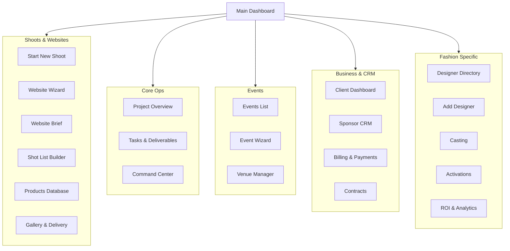
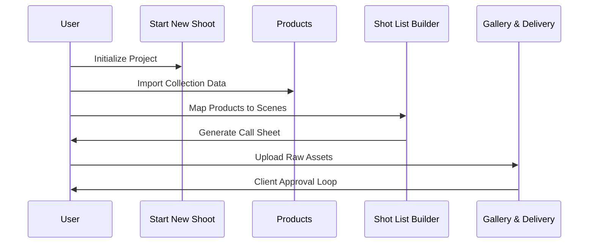

# FashionOS Dashboard Ecosystem
**Document Status:** Draft  
**Version:** 1.0  
**Date:** December 14, 2025  

## 1. Executive Summary
The FashionOS Dashboard is a multi-modular operating system designed for the luxury fashion ecosystem. It integrates creative production, event management, business operations, and fashion-specific intelligence into a unified interface. The system is designed to handle high-fidelity data (high-res images, complex relations) with a "Luxury Utility" aesthetic.

---

## 2. Sitemap & Hierarchy
The application is structured into five core pillars.

---

## 3. Module Breakdown & Workflows

### A. Creative Production (Shoots & Websites)
**Goal:** Streamline the content creation lifecycle from brief to final asset delivery.

*   **Start New Shoot:** The entry point. Captures high-level details (Date, Location, Type).
*   **Website Wizard:** AI-driven tool to generate site structures and briefs.
*   **Shot List Builder:** A granular tool connecting specific shots to specific products.
*   **Products:** The inventory source of truth. Items are selected here to be added to shot lists.
*   **Gallery & Delivery:** The output portal. Secure, branded galleries for clients to review and download assets.

**Workflow: The Shoot Lifecycle**

### B. Event Management
**Goal:** End-to-end management of runway shows, pop-ups, and PR events.

*   **Event Wizard:** Multi-step configurator for new events (Budget, Guest Count, Theme).
*   **Command Center:** A "Day-of-Show" dashboard showing real-time schedules, check-ins, and alerts.
*   **Sponsor CRM:** Pipeline for managing event funding and deliverables.
*   **Venue Manager:** Logistics data (Floor plans, capacity, access).
*   **Casting:** Model database and composite card generation.

### C. Business & Core Operations
**Goal:** The administrative backbone ensuring profitability and compliance.

*   **Project Overview:** High-level status tracking across all active modules.
*   **Client Dashboard:** A restricted view for external clients to approve items and pay invoices.
*   **Billing & Payments:** Integration with Stripe/Invoicing for milestone payments.
*   **Contracts:** Digital signing and storage for talent and venue agreements.

### D. Fashion Intelligence
**Goal:** Specialized tools for the fashion industry vertical.

*   **Designer Directory:** A searchable database of brands and talent.
*   **Add Designer:** Onboarding flow for new directory entries.
*   **Activations:** Tracking brand heat/impact across social and physical channels.
*   **ROI & Analytics:** Measuring the success of shoots and events (Impact vs. Spend).

---

## 4. User Journeys

### The Producer's Journey
1.  **Login** to `Dashboard`.
2.  Check `Project Overview` for overdue tasks.
3.  Enter `Start New Shoot` to book a campaign.
4.  Use `Casting` to select models.
5.  Send `Contracts` to selected talent.
6.  Build the day's plan in `Shot List Builder`.
7.  Post-shoot, upload to `Gallery & Delivery`.

### The Event Planner's Journey
1.  Initialize via `Event Wizard`.
2.  Secure location via `Venue Manager`.
3.  Pitch partners using `Sponsor CRM`.
4.  On event day, monitor `Command Center` for run-of-show timing.

---

## 5. Data Requirements & Architecture

### Frontend Architecture (React/State)
*   **Wizards (Event/Shoot/Website):** Require persistent multi-step state management (e.g., Zustand or Context) to prevent data loss during long completion flows.
*   **Command Center:** Requires real-time WebSocket connections (Supabase Realtime) for live updates during events.
*   **Gallery:** specialized image handling, lazy loading, and secure signed URLs for asset protection.

### Backend Schema (Supabase/PostgreSQL)

| Table | Core Columns | Relationships |
| :--- | :--- | :--- |
| `projects` | id, type (shoot/event/web), status, client_id | Has many Tasks, Assets |
| `shoots` | id, project_id, date, location_id | Has many Shots, Models |
| `shots` | id, shoot_id, description, time_est | Has many Products |
| `products` | id, sku, name, image_url | Belongs to Collection/Client |
| `events` | id, date, budget, venue_id | Has many Guests, Sponsors |
| `sponsors` | id, name, contribution_amount, status | Linked to Events |
| `casting_profiles` | id, name, measurements, agency | Many-to-Many with Shoots/Events |
| `contracts` | id, type, status, signed_url | Linked to User/Project |

### Key Data Insights
1.  **Interconnectivity:** `Products` are central. They appear in Shoots, are sold via Websites, and showcased at Events.
2.  **Role-Based Access:** `Client Dashboard` requires strict Row Level Security (RLS) to ensure clients only see their own projects.
3.  **Asset Heavy:** The system heavily relies on `storage` buckets for high-res imagery (Galleries, Casting Cards, Venue Floorplans).
