# FashionOS New Dashboard System — Implementation Plan

**Status:** Implementation Ready  
**Version:** 2.0 (Workspace-Based Architecture)  
**Last Updated:** December 23, 2024

---

## 🎯 System Philosophy

**Core Principle:** Dashboards become **contexts**, not **pages**. AI acts **inside** every screen as an intelligent assistant layer.

**Key Shift:**
- ❌ OLD: Many separate dashboards with different layouts
- ✅ NEW: 7 unified workspaces with consistent 3-panel layout + context-aware AI

---

## 📋 Executive Summary

### What Changes

| Aspect | Old System | New System |
|--------|-----------|------------|
| **Layout** | Inconsistent across dashboards | Universal 3-panel everywhere |
| **AI Integration** | Separate tools/features | Embedded assistant layer |
| **Navigation** | 15+ dashboard screens | 7 core workspaces |
| **Data Flow** | Page-to-page transitions | Context-aware workspace modes |
| **User Mental Model** | "Which dashboard do I need?" | "What workspace am I in?" |

### System Consolidation Map


---

## 🏗️ New System Architecture

### Universal 3-Panel Layout

Every workspace uses the same structure:

```
┌────────────┬────────────────────────────────────────────┬──────────────┐
│            │  Top Bar: Context | Search | Alerts | AI   │              │
│            ├────────────────────────────────────────────┤              │
│    Left    │                                            │    Right     │
│   Sidebar  │           Main Canvas                      │   AI Panel   │
│  (Scope)   │           (Execution)                      │ (Intelligence│
│            │                                            │              │
│  WORKSPACE │  • Current work                            │  CONTEXT AI  │
│  SELECTOR  │  • Active tasks                            │  • Insights  │
│            │  • Data views                              │  • Actions   │
│  - Cmd     │  • Forms                                   │  • Drafts    │
│  - Project │  • Charts                                  │  • Risks     │
│  - Work    │  • Tables                                  │  • Suggest.  │
│  - People  │                                            │              │
│  - Comm.   │                                            │  Mode based  │
│  - Create  │                                            │  on current  │
│  - Client  │                                            │  workspace   │
│            │                                            │              │
└────────────┴────────────────────────────────────────────┴──────────────┘
```

### Context-Aware AI Modes


---

## 📊 7 Core Workspaces (Detailed Specs)

### 1. Command Center Workspace

**Purpose:** Executive mission control with health monitoring and strategic insights

#### Left Sidebar Context
- Current event selector
- Quick filters (On Track / At Risk / Blocked)
- Time horizon selector (Today / This Week / All)

#### Main Canvas Sections
1. **Health Score Card** (Hero)
   - Overall score (0-100)
   - Trend indicator (↑ improving / → stable / ↓ declining)
   - Status badge (On Track / At Risk / Critical)
   - Last updated timestamp

2. **Phase Timeline** (Visual progress)
   - Horizontal timeline with milestones
   - Progress bars per phase
   - Current phase highlighted
   - Days remaining counter

3. **Critical Blockers Feed** (Priority alerts)
   - Blocker cards with severity (High / Medium / Low)
   - Recommended action per blocker
   - Source agent attribution
   - One-click navigate to resolution

4. **Quick Links Grid** (Deep work access)
   - Tasks (with overdue count)
   - Budget (with overage alert)
   - Sponsors (with pending count)
   - Venues (with unbooked alert)

#### Right AI Panel Mode: **Executive Insights**

**AI Capabilities:**
- Risk detection across all systems
- Strategic alignment analysis
- Resource optimization suggestions
- Predictive blockers (before they occur)

**AI Actions:**
```json
[
  {
    "action": "analyze_event_health",
    "trigger": "On workspace enter",
    "output": "Executive summary + risk score"
  },
  {
    "action": "detect_blockers",
    "trigger": "Every 5 minutes",
    "output": "Blocker cards with recommended fixes"
  },
  {
    "action": "suggest_optimizations",
    "trigger": "User clicks 'Optimize'",
    "output": "List of improvement opportunities"
  }
]
```

**Sample AI Insight Card:**
```
┌────────────────────────────────────────┐
│ ⚠️  RISK DETECTED                      │
├────────────────────────────────────────┤
│ Sample delay impacts shoot day         │
│                                        │
│ Impact: High                           │
│ Confidence: 87%                        │
│                                        │
│ Recommended Action:                    │
│ Swap shot #12 with #8 to buy 2h       │
│                                        │
│ [Preview Fix] [Dismiss]                │
└────────────────────────────────────────┘
```

#### User Workflows

**Workflow 1: Daily Check-In**


**Workflow 2: Risk Mitigation**

```mermaid
sequenceDiagram
    participant AI as Executive AI
    participant CMD as Command Center
    participant User
    participant PROJ as Project Workspace
    
    AI->>AI: Detects weather risk (80% rain)
    AI->>CMD: Creates blocker card
    CMD->>User: Shows alert badge
    User->>CMD: Opens Command Center
    CMD->>User: Displays blocker: "Rain at 2PM"
    User->>CMD: Clicks "Preview Fix"
    CMD->>PROJ: Opens AI Producer with indoor swap plan
    PROJ->>User: Shows Before/After timeline
    User->>PROJ: Approves change
    PROJ->>CMD: Updates health score
    CMD->>User: Blocker cleared, score 94% → 97%
```


#### Core Features
- Real-time health scoring (recalculates every 5min)
- Multi-event monitoring (switch between events)
- Blocker auto-detection (AI scans every system)
- Quick navigation to deep work areas

#### Advanced Features
- Predictive risk scoring (AI forecasts blockers 24-48h ahead)
- Resource allocation optimizer (AI suggests team rebalancing)
- Budget variance alerts (AI flags overspend before it happens)
- Timeline compression suggestions (AI finds ways to save time)

#### AI Agents
1. **Strategy Alignment Agent**
   - Ensures all activities align with event goals
   - Detects misaligned priorities
   - Suggests course corrections

2. **Risk Detection Agent**
   - Monitors for blockers, delays, dependencies
   - Calculates impact scores
   - Prioritizes interventions

3. **Timeline Optimization Agent**
   - Analyzes critical path
   - Identifies bottlenecks
   - Suggests task resequencing

#### Automations
- Auto-refresh health score every 5 minutes
- Auto-create blocker cards when risk detected
- Auto-notify stakeholders when status changes to "At Risk"
- Auto-suggest fixes when blocker appears

---

### 2. Project Workspace

**Purpose:** Real-time production management with AI Producer assistant

#### Left Sidebar Context
- Active project selector
- Phase filter (Pre / Production / Post)
- View mode toggle (Timeline / Tasks / Budget)

#### Main Canvas Sections
1. **Project Header Card**
   - Project name, client, status
   - Days to deadline
   - AI status badge (Active / Idle / Pending changes)
   - Quick stats (Tasks: 12/47, Budget: 68% used)

2. **Immediate Actions Queue**
   - Urgent decisions requiring approval
   - Deadline badges (By 12:00 PM / Today / This Week)
   - Quick action buttons (Approve / Review / Delegate)

3. **Pulse Feed** (Activity stream)
   - Live updates (samples received, contracts signed, tasks completed)
   - Signal types: Success (green) / Warning (yellow) / Neutral (gray)
   - Source attribution (Logistics / Casting / Legal / Production)
   - Timestamp (10m ago / 1h ago / Yesterday)

4. **Production Progress Stages**
   - Visual timeline: Pre → Production → Post
   - Progress % per stage
   - Task breakdown per stage
   - Milestone markers

#### Right AI Panel Mode: **AI Producer**

**AI Capabilities:**
- Proactive blocker resolution
- Timeline optimization
- Budget reallocation suggestions
- Critical path analysis

**AI Actions:**
```json
[
  {
    "action": "analyze_critical_path",
    "trigger": "User clicks 'Show Critical Path'",
    "output": "Dependency graph with bottlenecks highlighted"
  },
  {
    "action": "suggest_timeline_fix",
    "trigger": "Blocker detected",
    "output": "Before/After timeline comparison"
  },
  {
    "action": "optimize_budget",
    "trigger": "Budget variance detected",
    "output": "Reallocation recommendations"
  }
]
```

**AI Producer Chat Interface:**
```
┌────────────────────────────────────────┐
│ 🤖 AI Producer                         │
├────────────────────────────────────────┤
│ I've detected a blocker:               │
│                                        │
│ Rain forecasted at 2PM (80% chance).  │
│ This impacts outdoor shots 3-7.        │
│                                        │
│ Recommended actions:                   │
│ • [Fix Blocker] Swap to indoor setup  │
│ • [Adjust Timeline] Reschedule shots  │
│ • [Find Alternative] Suggest venues   │
│                                        │
│ What would you like to do?             │
└────────────────────────────────────────┘
```

#### Modals/Overlays
1. **Critical Path Modal**
   - Node graph showing task dependencies
   - Critical path highlighted in red
   - Blocker nodes with resolution options
   - Timeline impact preview (saves 3 days)

2. **Proposal Diff Modal**
   - Side-by-side comparison (Before → After)
   - Timeline changes highlighted
   - Budget impact shown (+$2,500 for indoor venue)
   - Approve/Reject buttons

#### User Workflows

**Workflow 3: AI-Assisted Blocker Resolution**


#### Core Features
- Real-time activity feed (updates every 30s)
- Immediate action queue (auto-sorted by urgency)
- Production stage tracking (% complete per phase)
- Budget monitoring (variance alerts)

#### Advanced Features
- AI Producer chat interface (natural language queries)
- Critical path visualization (dependency mapping)
- Proposal diff comparison (Before/After preview)
- Timeline compression (AI finds time savings)

#### AI Agents
1. **Producer Agent**
   - Proactively monitors production status
   - Suggests optimizations
   - Resolves blockers

2. **Path Analyzer**
   - Maps task dependencies
   - Identifies critical path
   - Detects bottlenecks

3. **Change Manager**
   - Generates diff comparisons
   - Calculates impact of changes
   - Validates approvals

#### Automations
- Auto-detect blockers (scans every 5min)
- Auto-suggest fixes (generates 3 options per blocker)
- Auto-notify team when timeline changes
- Auto-update budget when costs change

---

### 3. Work Workspace

**Purpose:** Task management with AI-powered prioritization

#### Left Sidebar Context
- Workflow phase selector (Pre / Production / Post)
- View mode toggle (List / Kanban / Calendar)
- Filter bar (Status / Owner / Priority / Due Date)

#### Main Canvas Sections
1. **Workflow Steps** (Top visual timeline)
   - Horizontal progress bar
   - Phase milestones with % complete
   - Task counts per phase
   - Click to filter tasks by phase

2. **Task Views** (Switchable)
   - **List View:** Table with columns (Task / Owner / Due / Status / Priority)
   - **Kanban View:** Drag-and-drop columns (Backlog / To Do / In Progress / Review / Done)
   - **Calendar View:** Monthly calendar with task dots

3. **Critical Tasks Section** (Always visible)
   - Filtered by: Overdue OR Due in 24h OR Blocked
   - Priority badges (High / Medium / Low)
   - Owner avatars
   - Quick actions (Mark Done / Reassign / Escalate)

#### Right AI Panel Mode: **Task Prioritizer**

**AI Capabilities:**
- Auto-rank tasks by impact + urgency
- Detect task dependencies causing delays
- Suggest best team member per task
- Predict task completion time

**AI Actions:**
```json
[
  {
    "action": "prioritize_tasks",
    "trigger": "User clicks 'AI Prioritize'",
    "output": "Re-ordered task list with reasoning"
  },
  {
    "action": "detect_blockers",
    "trigger": "Task becomes overdue",
    "output": "Blocker card with fix suggestions"
  },
  {
    "action": "suggest_assignee",
    "trigger": "User clicks 'Suggest Owner'",
    "output": "Top 3 team members with match scores"
  }
]
```

**AI Prioritization Card:**
```
┌────────────────────────────────────────┐
│ 🎯 AI PRIORITIZATION                   │
├────────────────────────────────────────┤
│ Suggested order (by impact):           │
│                                        │
│ 1. ⚡ Confirm model availability       │
│    Impact: High | Blocks 5 tasks      │
│                                        │
│ 2. 📋 Finalize shot list               │
│    Impact: Medium | Due in 2 days     │
│                                        │
│ 3. 💰 Approve vendor invoices          │
│    Impact: Low | Due in 5 days        │
│                                        │
│ [Apply Order] [Customize]              │
└────────────────────────────────────────┘
```

#### Work Drawer (Right overlay)
- Task detail view (full description, subtasks, comments)
- File attachments (drag-and-drop upload)
- Activity timeline (who did what, when)
- Related tasks (dependencies, blockers)
- Summary mode (aggregated stats across multiple tasks)

#### User Workflows

**Workflow 4: AI-Powered Task Prioritization**


#### Core Features
- Multi-view support (List / Kanban / Calendar)
- Critical tasks filter (auto-updates)
- Work drawer for deep focus
- Bulk actions (assign, reschedule, complete)

#### Advanced Features
- AI task prioritization (impact-based ranking)
- Dependency detection (auto-flags blockers)
- Smart assignment (AI suggests best owner)
- Predictive completion (AI estimates time to done)

#### AI Agents
1. **Task Prioritizer Agent**
   - Ranks tasks by impact × urgency
   - Considers dependencies
   - Updates ranking as context changes

2. **Blocker Detection Agent**
   - Monitors task dependencies
   - Flags tasks blocking others
   - Suggests unblocking actions

3. **Assignment Optimizer Agent**
   - Analyzes team capacity
   - Matches task requirements to skills
   - Balances workload

#### Automations
- Auto-create dependent tasks when parent completes
- Auto-reassign if owner marks "Unable to complete"
- Auto-send reminders 24h before due date
- Auto-escalate overdue tasks to project manager
- Auto-flag tasks blocking >3 other tasks

---

### 4. People Workspace

**Purpose:** Unified talent management (casting, designers, crew) with AI matching

#### Left Sidebar Context
- People type selector (Models / Designers / Crew / Vendors)
- Status filter (Available / Booked / Shortlisted / Archived)
- Search bar (name, skills, location)

#### Main Canvas Sections
1. **AI Matches Tab** (Default view)
   - Grid of AI-recommended people
   - Match score (0-100%)
   - Reasoning snippet ("Aligns with brand aesthetic, available on shoot day")
   - Quick actions (View Profile / Shortlist / Book)

2. **Shortlist Tab**
   - User-curated selection
   - Comparison mode (side-by-side view)
   - Batch actions (Send to client / Book all / Export)

3. **Search Tab**
   - Advanced filter panel (Height / Measurements / Ethnicity / Rate / Availability)
   - Results grid
   - Instant add to shortlist

4. **Venue Finder** (Sub-tab)
   - Deep research tool with natural language queries
   - AI-powered venue search
   - Match scores with reasoning

#### Right AI Panel Mode: **Matcher**

**AI Capabilities:**
- Match people to brand aesthetic
- Score fit based on past work
- Check real-time availability
- Suggest alternatives if unavailable

**AI Actions:**
```json
[
  {
    "action": "match_models",
    "trigger": "User opens AI Matches tab",
    "output": "Top 12 model matches with scores"
  },
  {
    "action": "check_availability",
    "trigger": "User shortlists model",
    "output": "Availability calendar + conflicts"
  },
  {
    "action": "suggest_backup",
    "trigger": "Model declines booking",
    "output": "3 similar models with availability"
  }
]
```

**AI Match Card:**
```
┌────────────────────────────────────────┐
│ 👤 Sarah K.                      94%   │
├────────────────────────────────────────┤
│ [Portfolio Images]                     │
│                                        │
│ Height: 5'10" | Measurements: 34-24-34│
│ Experience: 5 years | Rate: $2,500/day│
│                                        │
│ ✅ Available Sep 15                    │
│ ✅ Worked with similar brands          │
│ ✅ Strong Instagram (87K followers)    │
│                                        │
│ AI Reasoning:                          │
│ "Matches brand's minimalist aesthetic. │
│  Past work with Reformation, Everlane. │
│  Athletic build fits campaign needs."  │
│                                        │
│ [View Full Profile] [Shortlist] [Book]│
└────────────────────────────────────────┘
```

#### Profile Detail Modal
- Portfolio gallery (carousel)
- Stats (height, measurements, experience)
- Availability calendar (synced with their agency)
- Rate card (day rate, half-day, editorial)
- Past work with brand (if any)
- Social media links (Instagram, TikTok)
- Notes section (editable)

#### Deep Research Tool (Venue Finder)
- Natural language query input
- Example: "Rooftop in Brooklyn, 200 capacity, under $5K"
- AI returns 3 venues with match scores
- Reasoning per venue: "Great natural light, 2 blocks from subway, past fashion events"
- One-click to venue detail

#### User Workflows

**Workflow 5: AI-Powered Casting**


#### Core Features
- AI-powered matching (brand aesthetic + availability)
- Shortlist curation (side-by-side comparison)
- Advanced search (10+ filter criteria)
- Instant booking (one-click to contract)

#### Advanced Features
- Real-time availability sync (integrates with agency calendars)
- Portfolio auto-tagging (AI tags style, vibe, experience level)
- Predictive fit scoring (AI learns from past bookings)
- Backup suggestions (AI recommends alternatives if first choice unavailable)

#### AI Agents
1. **Casting Matcher Agent**
   - Matches models to brand aesthetic
   - Analyzes campaign requirements
   - Scores fit (0-100%)

2. **Fit Analyzer Agent**
   - Evaluates past work alignment
   - Considers client preferences
   - Predicts client approval likelihood

3. **Availability Checker Agent**
   - Syncs with external calendars
   - Detects booking conflicts
   - Suggests alternative dates

4. **Venue Finder Agent**
   - Processes natural language queries
   - Searches venue database + external APIs
   - Scores venues by fit (location, capacity, budget, vibe)

#### Automations
- Auto-shortlist top 10 matches when casting opened
- Auto-send availability requests to shortlisted models
- Auto-update availability when model confirms/declines
- Auto-generate casting deck PDF with top choices
- Auto-create contract when "Book" clicked

---

### 5. Commercial Workspace

**Purpose:** Sponsor relationship management with AI enrichment and contract tracking

#### Left Sidebar Context
- View selector (Pipeline / Contracts / Activations)
- Stage filter (Lead / Qualified / Proposal / Negotiation / Closed)
- Search bar (sponsor name, company, deal value)

#### Main Canvas Sections

**Pipeline View:**
1. **KPI Dashboard** (Top)
   - Total sponsors, Active deals, Revenue pipeline, Conversion rate
   - Trend arrows (↑ up / → flat / ↓ down)

2. **Smart Contact Input** (AI Quick Add)
   - LinkedIn URL paste field
   - AI auto-extracts: Name, title, company, email, phone, bio
   - Auto-enriches with company data (revenue, industry, employee count)
   - One-click add to CRM

3. **Pipeline Kanban**
   - Columns: Lead → Qualified → Proposal → Negotiation → Closed
   - Drag-and-drop to update stage
   - Value badges per sponsor card
   - Deal age indicators (New / 7 days / 30+ days)

**Contracts View:**
1. **Contract List**
   - Table: Sponsor / Event / Value / Status / Date
   - Status badges (Signed / Pending / Draft)
   - Click → Detail modal

2. **Deliverables Table**
   - Linked to contracts
   - Columns: Deliverable / Due Date / Status / Owner
   - Filter by: Sponsor / Event / Category (Digital / On-Site / Logistics)

3. **AI Contract Analysis Card**
   - Risk detection: "Missing force majeure clause"
   - Optimization: "Net 30 terms - consider Net 15 for faster cash flow"
   - Benchmarking: "This deal is 12% above market rate"

**Activations View:**
1. **Activation Grid**
   - Cards: Image / Name / Sponsor / Category / Budget / Progress %
   - Category filters (VIP / Runway / Website / Social / Experience)
   - Click → Detail modal

2. **Performance Dashboard** (If activation completed)
   - KPIs: Impressions, Engagement, Conversions
   - ROI calculation
   - Comparison to similar activations

#### Right AI Panel Mode: **Enrichment + Deal Intelligence**

**AI Capabilities:**
- Auto-enrich contact data from LinkedIn, websites
- Recommend sponsor-to-event fit
- Suggest next best action (follow-up, send proposal, schedule call)
- Analyze contract terms for risks

**AI Actions:**
```json
[
  {
    "action": "enrich_contact",
    "trigger": "User pastes LinkedIn URL",
    "output": "Fully populated contact card (95% complete)"
  },
  {
    "action": "match_sponsor_to_event",
    "trigger": "New sponsor added",
    "output": "Event recommendations with fit scores"
  },
  {
    "action": "analyze_contract",
    "trigger": "Contract uploaded",
    "output": "Risk flags + optimization suggestions"
  },
  {
    "action": "suggest_next_action",
    "trigger": "User opens sponsor detail",
    "output": "Recommended next step with template"
  }
]
```

**Smart Contact Input Example:**
```
Input: https://linkedin.com/in/marie-dubois-chanel

AI Extracts:
┌────────────────────────────────────────┐
│ ✨ CONTACT ENRICHED                    │
├────────────────────────────────────────┤
│ Name: Marie Dubois                     │
│ Title: CMO                             │
│ Company: Chanel                        │
│ Email: marie.dubois@chanel.com         │
│ Phone: +33 1 44 50 66 00               │
│                                        │
│ Company Enrichment:                    │
│ • Revenue: $15.6B                      │
│ • Industry: Luxury Fashion             │
│ • Employees: 28,500                    │
│ • HQ: Paris, France                    │
│                                        │
│ Recommended Event:                     │
│ NYFW Runway Show (87% fit)             │
│ Budget match: $150K-$250K              │
│                                        │
│ [Create Lead] [Customize]              │
└────────────────────────────────────────┘
```

#### Detail Sidebar (Sponsor)
- Contact profile
- Deal history (all interactions)
- Notes timeline (timestamped)
- Files/contracts (attached docs)
- Activity feed (emails, calls, meetings)
- Related events
- Next action suggestion (AI-powered)

#### User Workflows

**Workflow 6: LinkedIn Import → Deal Creation**


#### Core Features
- Smart contact input (LinkedIn auto-enrichment)
- Pipeline Kanban (drag-and-drop stage management)
- Contract tracking (status monitoring)
- Activation performance (ROI dashboards)

#### Advanced Features
- AI contact enrichment (95% accuracy)
- Sponsor-to-event matching (fit scoring)
- Contract risk analysis (clause detection)
- Next action suggestions (AI recommendations)
- Deal aging alerts (7-day / 30-day nudges)

#### AI Agents
1. **Enrichment Agent**
   - Scrapes LinkedIn, company websites
   - Extracts: Name, title, company, contact info
   - Enriches with: Revenue, industry, employee count, HQ

2. **Matching Agent**
   - Scores sponsor-to-event fit (0-100%)
   - Considers: Industry, budget, past events, audience overlap
   - Recommends top 3 events per sponsor

3. **Engagement Agent**
   - Analyzes interaction history
   - Suggests next best action (email, call, proposal, meeting)
   - Provides templates

4. **Contract Analyzer**
   - Reviews contract terms
   - Flags risks (missing clauses, unfavorable terms)
   - Suggests improvements
   - Benchmarks against industry standards

#### Automations
- Auto-enrich contacts on add (pulls LinkedIn data)
- Auto-move to "Qualified" if email opened + link clicked
- Auto-send follow-up email if no response in 3 days
- Auto-create contract task when deal moves to "Negotiation"
- Auto-notify team when deal closes
- Auto-create activation tasks when contract signed
- Auto-send performance report when activation completes

---

### 6. Creative Workspace

**Purpose:** Asset management and creative coordination with AI curation

#### Left Sidebar Context
- Asset type selector (Photos / Videos / Graphics / Docs)
- Project filter (All / Event A / Shoot B)
- Sort/filter (Recent / Tagged / Untagged)

#### Main Canvas Sections
1. **Upload Zone** (Top)
   - Drag-and-drop interface
   - Bulk upload support (50 files max)
   - Auto-preview thumbnails
   - Progress indicators

2. **Asset Grid** (Main)
   - Masonry layout (Pinterest-style)
   - Image thumbnails with overlay info (filename, date, tags)
   - Multi-select for batch operations
   - Quick filters: Date / Tags / Shot type

3. **Shot List Builder** (Integration)
   - Reference from campaign plan
   - Drag assets to shot slots
   - Progress tracking: "12/18 shots captured"
   - Missing shots highlighted

4. **Collection View** (Runway/Designer)
   - Designer list with look counts
   - Expandable look galleries
   - Approval toggles (Approved / Pending / Rejected)
   - Tagging interface (color, fabric, silhouette)

#### Right AI Panel Mode: **Curator**

**AI Capabilities:**
- Auto-tag images (subject, scene, style)
- Organize into smart collections
- Suggest best shots per category
- Detect duplicates/similar images

**AI Actions:**
```json
[
  {
    "action": "auto_tag_images",
    "trigger": "On upload",
    "output": "Tags added: 'outdoor', 'model', 'minimalist'"
  },
  {
    "action": "suggest_shot_list_match",
    "trigger": "User drags image to shot slot",
    "output": "Match score (92%) + reasoning"
  },
  {
    "action": "detect_duplicates",
    "trigger": "User clicks 'Find Duplicates'",
    "output": "Groups of similar images with best pick suggestion"
  },
  {
    "action": "generate_contact_sheet",
    "trigger": "User clicks 'Export'",
    "output": "PDF contact sheet with thumbnails + metadata"
  }
]
```

**AI Tagging Card:**
```
┌────────────────────────────────────────┐
│ 🎨 AI TAGGING COMPLETE                 │
├────────────────────────────────────────┤
│ 24 images uploaded                     │
│                                        │
│ Auto-tagged with:                      │
│ • Subject: Model (18), Product (6)     │
│ • Scene: Outdoor (12), Studio (12)     │
│ • Style: Editorial (15), Lifestyle (9) │
│ • Vibe: Minimalist (20), Bold (4)      │
│                                        │
│ Suggested collections:                 │
│ • "Outdoor Editorial" (12 images)      │
│ • "Studio Product Shots" (6 images)    │
│                                        │
│ [Review Tags] [Create Collections]     │
└────────────────────────────────────────┘
```

#### Asset Detail Modal
- Full-size preview
- Metadata: Resolution, file size, camera settings
- AI-generated tags (editable)
- Manual tag input (autocomplete)
- Download options (Original / Web-optimized)
- Share link generator (expiring links)
- Usage history (which projects used this asset)

#### User Workflows

**Workflow 7: Asset Upload → AI Tagging → Shot Assignment**
```mermaid
sequenceDiagram
    participant User
    participant CREATE as Creative Workspace
    participant AI as Curator Agent
    participant SHOT as Shot List Builder
    
    User->>CREATE: Drags 24 images to upload zone
    CREATE->>CREATE: Shows upload progress
    CREATE->>AI: Trigger auto-tagging
    AI->>AI: Analyzes images (subject, scene, style)
    AI->>CREATE: Returns tags for all 24 images
    CREATE->>User: Shows success: "24 images tagged"
    CREATE->>User: Suggests 2 smart collections
    User->>CREATE: Clicks "Create Collections"
    CREATE->>User: Collections created, grid organized
    User->>CREATE: Opens Shot List Builder
    CREATE->>SHOT: Loads shot list (18 slots)
    SHOT->>User: Shows 6 empty slots (12 assigned)
    User->>SHOT: Drags image to slot #13
    SHOT->>AI: Check match score
    AI->>SHOT: Returns 92% match: "Matches outdoor editorial vibe"
    SHOT->>User: Shows match score
    User->>SHOT: Confirms assignment
    SHOT->>User: Slot filled, progress 13/18
```

#### Core Features
- Bulk upload (drag-and-drop, 50 files)
- AI auto-tagging (subject, scene, style)
- Asset grid (masonry layout, filterable)
- Shot list integration (drag-and-drop assignment)

#### Advanced Features
- Smart collections (AI groups similar assets)
- Duplicate detection (finds similar images)
- Best shot suggestion (AI picks top image per category)
- Contact sheet generation (auto-creates PDF)
- Web-optimization (auto-generates 1200px versions)

#### AI Agents
1. **Tagging Agent**
   - Analyzes image content
   - Tags: Subject, Scene, Style, Vibe, Color palette
   - Learns from user corrections

2. **Organizer Agent**
   - Suggests folder structure
   - Groups related shots
   - Creates smart collections

3. **Quality Scorer**
   - Evaluates technical quality (sharpness, exposure, composition)
   - Flags images with issues
   - Suggests best picks

#### Automations
- Auto-tag on upload
- Auto-generate web-optimized versions (1200px width)
- Auto-create contact sheets when project complete
- Auto-notify team when all shots captured
- Auto-backup to cloud storage

---

### 7. Client Workspace

**Purpose:** Client-facing project oversight with simplified views

#### Left Sidebar Context
- Active project selector
- View mode (Overview / Deliverables / Approvals)
- Filter (All / Pending / Approved)

#### Main Canvas Sections
1. **Active Projects Grid**
   - Project cards: Name / Client / Status / Date / Progress %
   - Click → Navigate to Project detail
   - Quick actions: "View deliverables", "Message team"

2. **Deliverables List**
   - Table: Deliverable / Due Date / Status / Preview
   - Status badges (Pending / In Review / Approved)
   - Click → Opens approval modal

3. **Approval Queue**
   - Items requiring client sign-off
   - Preview images/documents
   - Quick approve/reject buttons
   - Comment field for feedback

4. **Brand Profile Card**
   - Logo, Name, Industry, Website
   - Social media links
   - Performance metrics (if available)

#### Right AI Panel Mode: **Client Success**

**AI Capabilities:**
- Summarize project status
- Predict delivery dates
- Suggest timeline adjustments
- Flag potential delays

**AI Actions:**
```json
[
  {
    "action": "summarize_project",
    "trigger": "User opens project",
    "output": "Executive summary: On track, 68% complete, 12 days to delivery"
  },
  {
    "action": "predict_delivery",
    "trigger": "User asks 'When will this be done?'",
    "output": "Predicted completion: Sep 28 (±2 days, 85% confidence)"
  },
  {
    "action": "flag_delays",
    "trigger": "Task becomes overdue",
    "output": "Alert card: 'Sample delay may impact delivery by 2 days'"
  }
]
```

#### Core Features
- Project overview cards
- Deliverables tracking
- Approval workflow (approve/reject)
- Team messaging

#### Advanced Features
- AI project summaries (status at a glance)
- Delivery date predictions (AI forecasts completion)
- Delay alerts (proactive notifications)
- Brand performance tracking (if post-launch)

#### AI Agents
1. **Client Success Agent**
   - Monitors project health from client perspective
   - Generates status summaries
   - Predicts delivery dates

#### Automations
- Auto-notify client when deliverable ready for review
- Auto-send status updates weekly
- Auto-flag delays before they impact delivery

---

## 🤖 AI Intelligence Hub (Cross-Workspace)

### AI Context Engine

**Purpose:** Centralized AI orchestration that adapts to each workspace


### AI Approval Gates (Universal Rule)

**CORE PRINCIPLE:** AI never auto-executes writes to database.

**AI Can:**
- ✅ Analyze
- ✅ Suggest
- ✅ Rank
- ✅ Draft
- ✅ Flag risks
- ✅ Preview changes

**AI Cannot:**
- ❌ Write to database without approval
- ❌ Send emails/notifications without user trigger
- ❌ Delete data
- ❌ Modify contracts/legal docs
- ❌ Book talent/venues without confirmation

**Approval Flow:**


---

## 🔄 Universal Workflows

### Workflow 8: Cross-Workspace AI Assistance

**Scenario:** User needs to resolve a blocker that spans multiple systems

```mermaid
sequenceDiagram
    participant User
    participant CMD as Command Center
    participant AI as AI Context Engine
    participant PROJ as Project Workspace
    participant PPL as People Workspace
    participant COMM as Commercial Workspace
    
    User->>CMD: Opens Command Center
    CMD->>AI: Request health analysis
    AI->>AI: Scans all systems
    AI->>CMD: Blocker detected: "Model unavailable"
    CMD->>User: Shows blocker card
    User->>CMD: Clicks "Navigate to fix"
    CMD->>PPL: Opens People Workspace
    PPL->>AI: Request backup suggestions
    AI->>AI: Searches available models
    AI->>PPL: Returns 3 backups with scores
    PPL->>User: Shows backup options
    User->>PPL: Reviews Sarah K. (94% match)
    User->>PPL: Clicks "Book"
    PPL->>COMM: Creates booking contract
    COMM->>User: Opens contract modal
    User->>COMM: Reviews terms, sends for signature
    COMM->>CMD: Updates blocker status: Resolved
    CMD->>User: Health score improves 94% → 97%
```



### Workflow 9: Wizard → Workspace Transition

**Scenario:** User creates event via wizard, then manages it in workspaces


---

## 🛠️ Implementation Roadmap

### Phase 1: Foundation (Weeks 1-4)

**Goal:** Build universal layout + navigation system

#### Week 1: Layout Components
- [ ] Create `WorkspaceLayout.tsx` (3-panel structure)
- [ ] Build `LeftSidebar.tsx` (workspace selector)
- [ ] Build `TopBar.tsx` (search, notifications, AI toggle)
- [ ] Build `RightAIPanel.tsx` (collapsible, context-aware)
- [ ] Create `WorkspaceContext.tsx` (state management)

#### Week 2: Navigation System
- [ ] Build workspace router (React Router nested routes)
- [ ] Create workspace selector component
- [ ] Implement breadcrumb navigation
- [ ] Add keyboard shortcuts (Cmd+K for search, Cmd+J for AI panel)

#### Week 3: AI Context Engine
- [ ] Create `AIContextEngine.tsx` (central orchestration)
- [ ] Build mode detection logic (workspace → AI mode mapping)
- [ ] Implement AI panel state management
- [ ] Create approval gate components (Preview, Approve, Reject)

#### Week 4: Empty States + Testing
- [ ] Design empty states for each workspace
- [ ] Create loading skeletons
- [ ] Write unit tests for layout components
- [ ] Test responsive behavior (desktop, tablet, mobile)

---

### Phase 2: Command Center Workspace (Weeks 5-6)

#### Week 5: Core Features
- [ ] Build Health Score Card component
- [ ] Create Phase Timeline visualization
- [ ] Implement Critical Blockers feed
- [ ] Add Quick Links grid

#### Week 6: AI Integration
- [ ] Integrate Executive Insights AI mode
- [ ] Build blocker detection logic
- [ ] Create AI suggestion cards
- [ ] Test health score calculations

---

### Phase 3: Project Workspace (Weeks 7-9)

#### Week 7: Core Features
- [ ] Build Project Header Card
- [ ] Create Immediate Actions queue
- [ ] Implement Pulse Feed (activity stream)
- [ ] Add Production Progress Stages

#### Week 8: AI Producer
- [ ] Build AI Producer chat interface
- [ ] Create Critical Path Modal
- [ ] Build Proposal Diff Modal
- [ ] Implement timeline comparison logic

#### Week 9: Integration + Testing
- [ ] Connect to task system
- [ ] Test blocker resolution workflow
- [ ] Add real-time updates (Supabase Realtime)

---

### Phase 4: Work Workspace (Weeks 10-12)

#### Week 10: Views
- [ ] Build List View (table)
- [ ] Create Kanban View (drag-and-drop)
- [ ] Add Calendar View
- [ ] Implement view switcher

#### Week 11: Work Drawer
- [ ] Build task detail drawer
- [ ] Add subtasks, comments, attachments
- [ ] Create summary mode
- [ ] Implement activity timeline

#### Week 12: AI Prioritization
- [ ] Build Task Prioritizer AI mode
- [ ] Create dependency detection
- [ ] Add smart assignment suggestions
- [ ] Test automation triggers

---

### Phase 5: People Workspace (Weeks 13-15)

#### Week 13: Casting Core
- [ ] Build AI Matches grid
- [ ] Create Shortlist view
- [ ] Add Search tab with filters
- [ ] Build profile modal

#### Week 14: Venue Finder
- [ ] Create Deep Research Tool
- [ ] Add natural language query input
- [ ] Build venue match scoring
- [ ] Implement venue detail view

#### Week 15: AI Matching
- [ ] Integrate Matcher AI mode
- [ ] Build availability checker
- [ ] Add backup suggestions
- [ ] Test booking workflow

---

### Phase 6: Commercial Workspace (Weeks 16-18)

#### Week 16: CRM Core
- [ ] Build Pipeline Kanban
- [ ] Create Smart Contact Input
- [ ] Add sponsor detail sidebar
- [ ] Implement drag-and-drop stage updates

#### Week 17: Contracts
- [ ] Build contract list view
- [ ] Create deliverables table
- [ ] Add AI Contract Analysis card
- [ ] Build contract detail modal

#### Week 18: Activations
- [ ] Create activation grid
- [ ] Build activation detail modal
- [ ] Add performance dashboard
- [ ] Test end-to-end sponsor flow

---

### Phase 7: Creative Workspace (Weeks 19-20)

#### Week 19: Asset Management
- [ ] Build upload zone (drag-and-drop)
- [ ] Create asset grid (masonry)
- [ ] Add multi-select + batch actions
- [ ] Build asset detail modal

#### Week 20: AI Curation
- [ ] Integrate Curator AI mode
- [ ] Build auto-tagging logic
- [ ] Create smart collections
- [ ] Add shot list builder integration

---

### Phase 8: Client Workspace (Week 21)

- [ ] Build project overview cards
- [ ] Create deliverables list
- [ ] Add approval queue
- [ ] Integrate Client Success AI mode
- [ ] Test simplified client-facing views

---

### Phase 9: Polish + Launch (Weeks 22-24)

#### Week 22: Cross-Workspace Features
- [ ] Implement global search (Cmd+K)
- [ ] Add notifications system
- [ ] Build activity feed (cross-workspace)
- [ ] Test real-time collaboration

#### Week 23: Performance + Security
- [ ] Optimize bundle size (code splitting)
- [ ] Add RLS policies verification
- [ ] Implement error boundaries
- [ ] Add analytics tracking

#### Week 24: Documentation + Launch
- [ ] Write user guides per workspace
- [ ] Create video tutorials
- [ ] Conduct beta testing
- [ ] Launch to production

---

## 📊 Feature Comparison Matrix

| Feature | Old System | New System | Improvement |
|---------|-----------|------------|-------------|
| **Layouts** | 15 different layouts | 1 universal 3-panel | 93% less complexity |
| **AI Integration** | Separate tools | Embedded in every workspace | 100% coverage |
| **Navigation Clicks** | 3-5 clicks to deep work | 1-2 clicks max | 60% faster |
| **Context Switching** | Mental model change per screen | Same layout everywhere | Zero cognitive load |
| **AI Modes** | Generic assistant | 7 specialized modes | 7× more relevant |
| **Approval Gates** | Inconsistent | Universal preview+approve | 100% safe |
| **Mobile Support** | Partial (desktop-first) | Full responsive | Desktop+mobile parity |

---

## 🎨 Design System Updates

### Component Library Additions

**New Components Needed:**
1. `WorkspaceLayout` - Universal 3-panel wrapper
2. `AIPanelContainer` - Context-aware AI panel
3. `ApprovalGate` - Preview+Approve+Reject flow
4. `WorkspaceSwitcher` - Quick navigation between workspaces
5. `HealthScoreCard` - Visual health metric (0-100)
6. `PulseCard` - Activity feed item
7. `BlockerCard` - Critical blocker alert
8. `DiffView` - Before/After comparison
9. `AIInsightCard` - AI suggestion with reasoning
10. `MatchScoreCard` - Match % with explanation

---

## 🔐 Security Considerations

### RLS Policy Updates

**New Policies Required:**
```sql
-- Workspace-based access (universal)
CREATE POLICY "workspace_isolation"
  ON all_tables
  FOR ALL
  USING (workspace_id IN (
    SELECT workspace_id 
    FROM workspace_members 
    WHERE user_id = auth.uid()
  ));

-- AI report access
CREATE POLICY "ai_reports_workspace"
  ON ai_reports
  FOR ALL
  USING (workspace_id IN (
    SELECT workspace_id 
    FROM workspace_members 
    WHERE user_id = auth.uid()
  ));

-- Cross-workspace read (for admin)
CREATE POLICY "admin_global_read"
  ON all_tables
  FOR SELECT
  USING (
    EXISTS (
      SELECT 1 FROM workspace_members
      WHERE user_id = auth.uid()
      AND role = 'admin'
    )
  );
```

---

## 📱 Responsive Behavior

### Breakpoint Strategy

| Screen Size | Left Sidebar | Main Canvas | Right AI Panel |
|-------------|-------------|-------------|----------------|
| **Desktop (>1024px)** | Visible (256px) | Flex-1 | Toggle (320px) |
| **Tablet (640-1024px)** | Hidden (hamburger) | Full width | Drawer overlay |
| **Mobile (<640px)** | Bottom nav | Full width | Full-screen modal |

---

## 🚀 Launch Checklist

### Pre-Launch (Week 22-23)
- [ ] All 7 workspaces functional
- [ ] AI modes working per workspace
- [ ] Approval gates tested
- [ ] Cross-workspace navigation smooth
- [ ] Real-time updates verified
- [ ] Mobile responsive tested
- [ ] RLS policies validated
- [ ] Performance benchmarks met (<3s load time)

### Launch Week (Week 24)
- [ ] Beta user testing (10 users)
- [ ] Feedback incorporated
- [ ] Final bug fixes
- [ ] Production deployment
- [ ] Monitoring dashboards active
- [ ] Support documentation live
- [ ] Announcement email sent

### Post-Launch (Week 25+)
- [ ] Monitor error rates (<0.1%)
- [ ] Track user adoption per workspace
- [ ] Gather AI accuracy feedback
- [ ] Plan Phase 2 enhancements

---

## 📈 Success Metrics

### Adoption Metrics (30 days post-launch)
- [ ] 80%+ users adopt Command Center
- [ ] 60%+ users use AI suggestions weekly
- [ ] 40%+ approval rate on AI recommendations
- [ ] <5% users revert to old dashboards

### Performance Metrics
- [ ] <3s average page load
- [ ] <500ms AI response time (95th percentile)
- [ ] 99.9% uptime
- [ ] <0.1% error rate

### User Satisfaction
- [ ] 8/10+ satisfaction score
- [ ] <10% support ticket volume vs. old system
- [ ] 90%+ say "easier to use"

---

## 🎓 User Training Plan

### Week 1: Introduction
- **Session 1:** Overview of new workspace system (30min)
- **Session 2:** Command Center walkthrough (20min)
- **Session 3:** AI assistant basics (15min)

### Week 2: Deep Dives
- **Session 4:** Project Workspace + AI Producer (30min)
- **Session 5:** Work Workspace + task prioritization (25min)
- **Session 6:** People Workspace + AI matching (30min)

### Week 3: Advanced
- **Session 7:** Commercial Workspace + CRM enrichment (35min)
- **Session 8:** Creative Workspace + AI curation (20min)
- **Session 9:** Cross-workspace workflows (25min)

### Resources
- Video tutorials (one per workspace, 3-5min each)
- Interactive guided tours (first-time user onboarding)
- Help center articles (searchable, with screenshots)
- In-app tooltips (contextual help)

---

## 🔮 Future Enhancements (Phase 2)

### Q2 2025
- [ ] Multi-workspace support (switch between companies)
- [ ] Team collaboration features (live cursors, comments)
- [ ] Advanced analytics dashboards per workspace
- [ ] Custom workflow automations (no-code builder)

### Q3 2025
- [ ] Third-party integrations (Shopify, Salesforce, HubSpot)
- [ ] API access for external tools
- [ ] Mobile native apps (iOS, Android)
- [ ] AI voice assistant (voice commands)

### Q4 2025
- [ ] White-label options for agencies
- [ ] Enterprise SSO (SAML, OAuth)
- [ ] Advanced RLS (row-level + column-level)
- [ ] Audit logs (compliance tracking)

---

## 📞 Support Plan

### Channels
- **In-app chat:** Real-time support (Mon-Fri, 9AM-6PM EST)
- **Email:** support@fashionos.ai (24h response time)
- **Help center:** help.fashionos.ai (searchable docs)
- **Community:** community.fashionos.ai (user forum)

### SLAs
- **Critical bugs:** 2h response, 24h fix
- **High priority:** 4h response, 3-day fix
- **Medium priority:** 1-day response, 1-week fix
- **Low priority:** 3-day response, 2-week fix

---

**Implementation Plan Version:** 2.0  
**Status:** ✅ Ready for Development  
**Estimated Completion:** 24 weeks (6 months)  
**Team Size Required:** 3-4 engineers + 1 designer  
**Total Workspaces:** 7  
**Total AI Modes:** 7  
**Total New Components:** 50+  
**Lines of Code (Est.):** ~25,000

---

## End of Implementation Plan

This plan provides a systematic, production-ready roadmap for building the new FashionOS workspace-based dashboard system. All features are documented, workflows are mapped, and timelines are realistic.

**Next Steps:**
1. Review and approve this plan
2. Allocate team resources
3. Set up project tracking (Jira/Linear)
4. Begin Phase 1: Foundation (Week 1)
