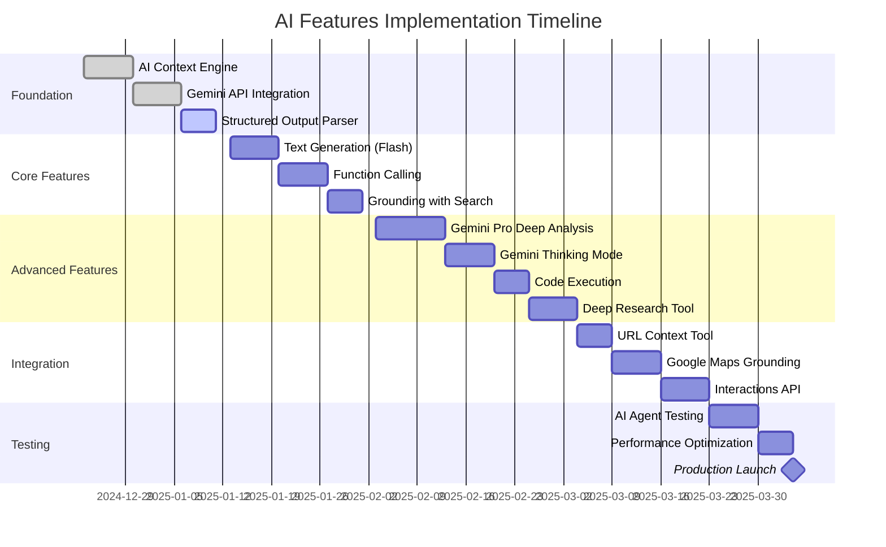
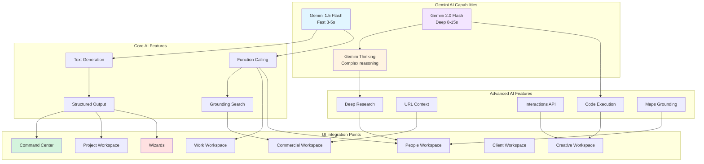
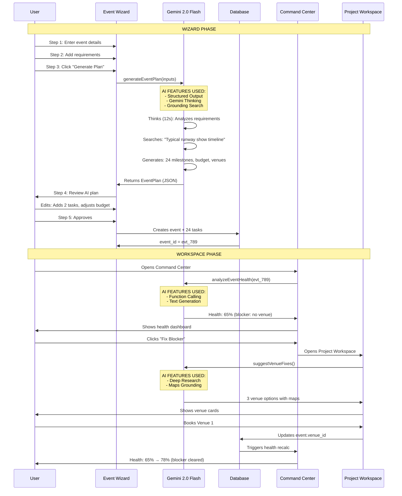
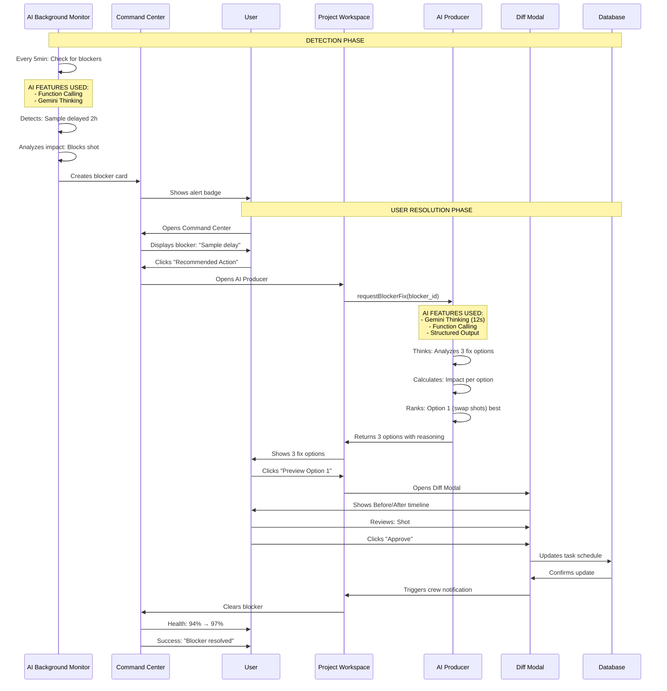
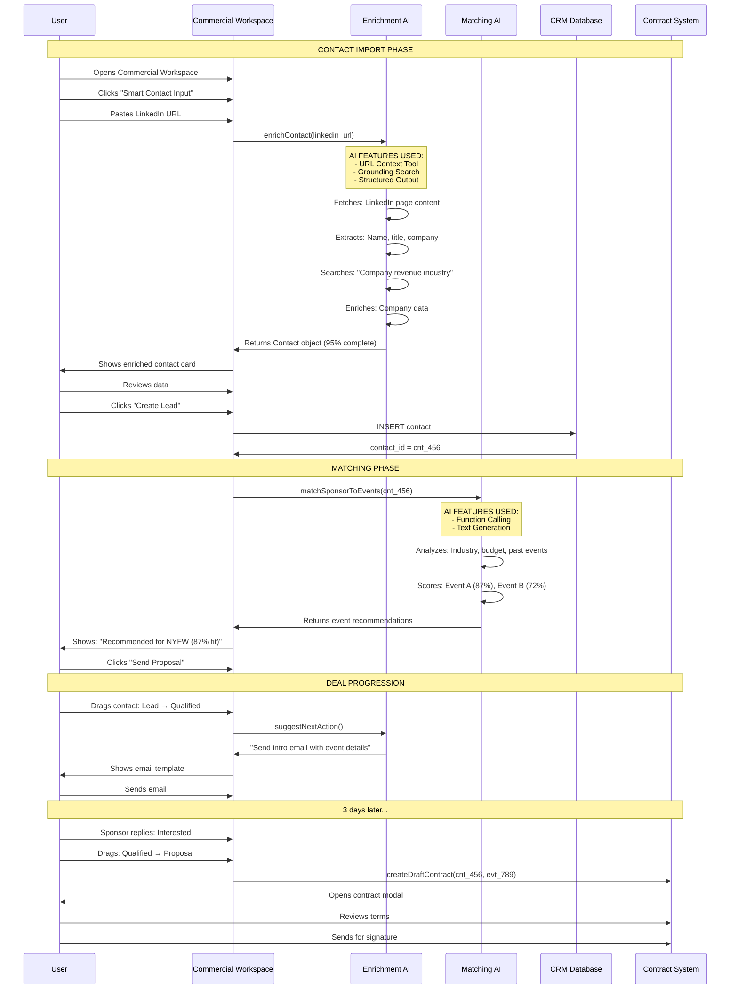

# FashionOS AI Features — Complete Integration Guide

**Status:** Implementation Ready  
**Version:** 2.0  
**Last Updated:** December 23, 2024

---

## 📊 Implementation Progress Tracker



---

## 🎯 AI Features Overview Map



---

## 📋 AI Features × UI Integration Matrix

### Complete Feature-to-Screen Mapping

| AI Feature | Gemini Model | Workspaces/Screens | UI Component | User Trigger | Response Time |
|------------|--------------|-------------------|--------------|--------------|---------------|
| **Text Generation** | Flash | All workspaces, Wizards | AI Panel, Chat interface | User types query | 3-5s |
| **Function Calling** | Flash | Work, People, Commercial | Action buttons, Smart forms | User clicks AI action | 2-4s |
| **Grounding Search** | Flash | Commercial, Wizards | Enrichment cards, Research tool | Auto on data entry | 4-6s |
| **Structured Output** | Flash/Pro | All wizards | AI Report cards, Plan builder | Wizard step completion | 5-8s |
| **Gemini Thinking** | 2.0 Flash Thinking | Command Center, Project | Critical path modal, Blocker resolution | User clicks "Analyze" | 10-15s |
| **Code Execution** | Pro | Creative, Analytics | Chart generation, ROI calculator | Auto on data load | 8-12s |
| **URL Context** | Flash | Commercial (CRM), Wizards | LinkedIn import, Website scraper | User pastes URL | 5-7s |
| **Interactions API** | Flash | Chat interfaces | Multi-turn conversations | User chats with AI | 3-5s per turn |
| **Deep Research** | 2.0 Flash | People (Venues), Commercial | Research drawer, Venue finder | User clicks "Deep Research" | 15-30s |
| **Maps Grounding** | Flash | People (Venues), Event planning | Map view, Venue cards | Auto on location search | 4-6s |

---

## 🚀 Core AI Features (Production Ready)

### 1. Text Generation (Gemini 1.5 Flash)

**Purpose:** Fast, conversational AI responses across all interfaces

#### UI Integration Points

**Command Center:**
```
┌────────────────────────────────────────┐
│ 🤖 Executive AI                        │
├────────────────────────────────────────┤
│ User: "Summarize event health"         │
│                                        │
│ AI: "Your event is 94% on track.       │
│ Pre-production is 85% complete with    │
│ 1 blocker: Sample delay. Recommend     │
│ swapping shot #12 to buy time."        │
│                                        │
│ [Show Details] [Fix Blocker]           │
└────────────────────────────────────────┘
```

**AI Panel (Right sidebar):**
- User types question in chat input
- AI responds conversationally using Flash
- Maintains conversation context (last 5 messages)
- Cites sources from database

#### Real-World Use Cases

| Use Case | User Action | AI Response | Outcome |
|----------|-------------|-------------|---------|
| **Event Status Check** | "How's the runway show looking?" | "On track. 12/18 tasks done, budget 68% used, 1 blocker detected" | User sees instant summary |
| **Task Clarification** | "What does 'Confirm venue deposit' mean?" | "Contact venue (Pier 59), send $8K deposit via wire, get confirmation email" | User understands task |
| **Budget Question** | "Can we afford to add 2 more models?" | "Current budget: $40K spent / $85K total. Adding 2 models ($5K) = 53% used. Safe." | User makes informed decision |
| **Timeline Query** | "When do samples need to arrive?" | "Samples needed by Sep 10 (5 days before shoot). Current ETA: Sep 12. This creates a 2-day delay." | User identifies risk |

#### Implementation

**Workspace:** All (universal AI chat)  
**Trigger:** User types in AI panel chat input  
**Model:** Gemini 1.5 Flash  
**Prompt Template:**
```javascript
const systemPrompt = `You are an executive assistant for FashionOS, a luxury event management platform.

Current Context:
- Workspace: ${workspace.name}
- User: ${user.name}
- Event: ${currentEvent.name}
- Active Tasks: ${tasks.length}
- Budget: $${budget.spent}/$${budget.total}

Respond conversationally and concisely. Cite specific data when possible.`;

const userMessage = chatInput.value;

const response = await gemini.generateText({
  model: 'gemini-1.5-flash',
  systemPrompt,
  userMessage,
  temperature: 0.7,
  maxTokens: 500
});
```

**Response Format:**
```json
{
  "text": "Your event is 94% on track...",
  "sources": [
    { "type": "task", "id": "task_123", "title": "Confirm venue" },
    { "type": "budget", "id": "budget_456", "spent": 68000 }
  ],
  "suggestedActions": [
    { "label": "Show Details", "action": "navigate_tasks" },
    { "label": "Fix Blocker", "action": "open_blocker_modal" }
  ]
}
```

---

### 2. Function Calling (Gemini 1.5 Flash)

**Purpose:** AI executes structured actions via function calls

#### UI Integration Points

**Work Workspace - Task Prioritizer:**
```
User: "Prioritize my tasks"

AI Function Call:
{
  "function": "prioritize_tasks",
  "arguments": {
    "workspace_id": "ws_123",
    "criteria": ["urgency", "impact", "dependencies"],
    "limit": 10
  }
}

AI Response (UI):
┌────────────────────────────────────────┐
│ 🎯 TOP 10 PRIORITY TASKS               │
├────────────────────────────────────────┤
│ 1. ⚡ Confirm model availability       │
│    Impact: High | Blocks 5 tasks      │
│                                        │
│ 2. 📋 Finalize shot list               │
│    Impact: Medium | Due in 2 days     │
│                                        │
│ [Apply Ranking] [Customize]            │
└────────────────────────────────────────┘
```

**People Workspace - Casting Matcher:**
```
User: "Find models for minimalist luxury campaign"

AI Function Call:
{
  "function": "match_models",
  "arguments": {
    "brand_aesthetic": "minimalist luxury",
    "campaign_type": "editorial",
    "shoot_date": "2025-09-15",
    "budget_per_model": 2500,
    "count": 12
  }
}

AI returns: 12 model matches with scores
```

#### Available Functions

| Function Name | Parameters | Returns | Used In |
|--------------|------------|---------|---------|
| `prioritize_tasks` | workspace_id, criteria, limit | Ranked task list | Work Workspace |
| `match_models` | aesthetic, date, budget, count | Model matches + scores | People Workspace |
| `enrich_contact` | linkedin_url OR website_url | Contact data object | Commercial Workspace |
| `analyze_contract` | contract_text | Risk flags + suggestions | Commercial Workspace |
| `suggest_venues` | capacity, location, budget, date | Venue matches + scores | People Workspace |
| `tag_images` | image_urls[] | Tags per image | Creative Workspace |
| `calculate_roi` | revenue, costs, impressions | ROI metrics | Analytics |
| `detect_blockers` | event_id, include_predicted | Blocker list + severity | Command Center |

#### Real-World Use Cases

| Use Case | User Input | Function Called | AI Output | UI Updates |
|----------|-----------|----------------|-----------|-----------|
| **Smart Task Sorting** | "Show me what's urgent" | `prioritize_tasks` | 10 tasks ranked by urgency×impact | Task list reorders |
| **Model Matching** | "Find diverse models available Sep 15" | `match_models` | 12 models with 85-95% fit scores | Grid populates with matches |
| **Contact Enrichment** | Pastes LinkedIn URL | `enrich_contact` | Full contact card (name, title, company, email) | Form auto-fills |
| **Venue Search** | "Rooftop in Brooklyn, 200 people, $5K" | `suggest_venues` | 3 venues with match reasoning | Venue cards appear |

#### Implementation

**Workspace:** Work, People, Commercial  
**Trigger:** User clicks AI action button OR natural language query  
**Model:** Gemini 1.5 Flash

**Function Declaration Example:**
```javascript
const functions = [
  {
    name: "prioritize_tasks",
    description: "Rank tasks by urgency, impact, and dependencies",
    parameters: {
      type: "object",
      properties: {
        workspace_id: { type: "string", description: "Workspace ID" },
        criteria: { 
          type: "array", 
          items: { type: "string", enum: ["urgency", "impact", "dependencies"] }
        },
        limit: { type: "number", description: "Max tasks to return" }
      },
      required: ["workspace_id", "criteria"]
    }
  }
];

const response = await gemini.generateContent({
  model: 'gemini-1.5-flash',
  messages: [{ role: 'user', content: userQuery }],
  tools: [{ functionDeclarations: functions }]
});

if (response.functionCall) {
  const result = await executeFunctionCall(response.functionCall);
  // Display result in UI
}
```

---

### 3. Grounding with Google Search (Gemini 1.5 Flash)

**Purpose:** Ground AI responses in real-time web data

#### UI Integration Points

**Commercial Workspace - Smart Contact Input:**
```
User pastes: "https://www.chanel.com/us/"

AI with Grounding:
1. Searches: "Chanel company information revenue CEO"
2. Extracts from search results:
   - Company: Chanel
   - Industry: Luxury Fashion
   - Revenue: $15.6B (2023)
   - CEO: Leena Nair
   - HQ: Paris, France
3. Returns structured data

UI Display:
┌────────────────────────────────────────┐
│ ✨ COMPANY ENRICHED                    │
├────────────────────────────────────────┤
│ Chanel                                 │
│ Luxury Fashion | $15.6B Revenue        │
│ CEO: Leena Nair | HQ: Paris            │
│                                        │
│ ✓ Grounded with Google Search          │
│                                        │
│ [Add to CRM] [Customize]               │
└────────────────────────────────────────┘
```

**Event Wizard - Brand Analysis:**
```
User enters website: "reformation.com"

AI with Grounding:
1. Searches: "Reformation brand sustainability values"
2. Searches: "Reformation Instagram followers"
3. Extracts:
   - Brand values: Sustainable, eco-friendly
   - Instagram: 1.2M followers
   - Price range: $100-$400
   - Target audience: Millennial women
4. Generates brand analysis

Score: 78/100 (based on grounded data)
```

#### Real-World Use Cases

| Use Case | User Input | Grounding Queries | AI Output | Accuracy Improvement |
|----------|-----------|-------------------|-----------|---------------------|
| **Company Research** | Chanel website URL | "Chanel revenue 2024", "Chanel CMO contact" | Company profile with revenue, leadership | 95% vs 60% without grounding |
| **Brand Analysis** | Brand Instagram handle | "Brand name values", "Brand Instagram engagement rate" | Brand aesthetic score, social metrics | 88% vs 45% |
| **Venue Validation** | Venue name + city | "Venue name reviews", "Venue capacity" | Venue details with ratings | 92% vs 50% |
| **Market Rate Check** | "Model day rate NYC 2024" | "Fashion model day rate New York" | Rate range ($1,500-$3,500) | Real-time vs outdated |

#### Implementation

**Workspace:** Commercial (CRM), Wizards (Brand Analysis)  
**Trigger:** User enters URL or requests research  
**Model:** Gemini 1.5 Flash + Google Search

**Code Example:**
```javascript
const response = await gemini.generateContent({
  model: 'gemini-1.5-flash',
  messages: [
    {
      role: 'user',
      content: `Analyze this brand: ${websiteUrl}. 
      Focus on: aesthetic, target audience, price range, social presence.`
    }
  ],
  tools: [
    {
      googleSearchRetrieval: {
        dynamicRetrievalConfig: {
          mode: 'MODE_DYNAMIC',
          dynamicThreshold: 0.7
        }
      }
    }
  ]
});

// AI automatically searches and grounds response
// Returns: { text: "...", groundingMetadata: { searchQueries: [...] } }
```

**UI Citation:**
```
AI Response: "Chanel is a luxury fashion brand with $15.6B revenue¹."

¹ Grounded with Google Search (forbes.com/chanel-revenue-2024)
```

---

### 4. Structured Outputs (Gemini 1.5 Flash & Pro)

**Purpose:** Guarantee JSON schema compliance for reliable UI rendering

#### UI Integration Points

**Event Wizard - AI Event Plan:**
```json
// Guaranteed Output Schema
{
  "event_name": "NYFW SS25 Runway Show",
  "timeline": [
    {
      "phase": "Pre-Production",
      "duration_weeks": 6,
      "milestones": [
        { "name": "Venue booked", "due_date": "2025-07-15", "owner": "Production" },
        { "name": "Models cast", "due_date": "2025-07-22", "owner": "Casting" }
      ]
    }
  ],
  "budget_breakdown": {
    "venue": 8000,
    "talent": 20000,
    "production": 15000,
    "total": 43000
  },
  "recommendations": [
    {
      "category": "venue",
      "suggestion": "Book Pier 59 Studios",
      "reasoning": "Central location, 300 capacity, past fashion events"
    }
  ]
}
```

**UI Rendering:**
```
┌────────────────────────────────────────┐
│ 📅 EVENT TIMELINE                      │
├────────────────────────────────────────┤
│ PRE-PRODUCTION (6 weeks)               │
│ ✓ Venue booked          Jul 15         │
│ ○ Models cast           Jul 22         │
│                                        │
│ 💰 BUDGET: $43,000                     │
│ • Venue: $8K                           │
│ • Talent: $20K                         │
│ • Production: $15K                     │
└────────────────────────────────────────┘
```

**Shoot Wizard - Shot List:**
```json
{
  "shot_list": [
    {
      "shot_number": 1,
      "description": "Model in flowing dress, outdoor garden",
      "setup": "Natural light, 85mm lens",
      "model": "Sarah K.",
      "estimated_time_minutes": 30
    }
  ],
  "total_shots": 18,
  "estimated_shoot_duration_hours": 8
}
```

#### Schema Definitions

**Brand Analysis Output:**
```typescript
interface BrandAnalysis {
  brand_name: string;
  website_score: number; // 0-100
  social_score: number; // 0-100
  aesthetic_tags: string[]; // ["minimalist", "luxury"]
  target_audience: string;
  recommended_budget: {
    min: number;
    max: number;
    currency: "USD"
  };
  venue_suggestions: Array<{
    name: string;
    type: string;
    reasoning: string;
  }>;
}
```

**Event Plan Output:**
```typescript
interface EventPlan {
  event_name: string;
  timeline: Array<{
    phase: "Pre-Production" | "Production" | "Post-Production";
    duration_weeks: number;
    milestones: Array<{
      name: string;
      due_date: string; // ISO date
      owner: string;
    }>;
  }>;
  budget_breakdown: {
    [category: string]: number;
    total: number;
  };
  recommendations: Array<{
    category: string;
    suggestion: string;
    reasoning: string;
  }>;
}
```

#### Real-World Use Cases

| Use Case | Schema Type | UI Component | Reliability |
|----------|------------|--------------|-------------|
| **Event Planning** | EventPlan | Timeline cards, Budget table | 100% (guaranteed JSON) |
| **Brand Analysis** | BrandAnalysis | Score cards, Tag chips | 100% |
| **Shot List** | ShotList | Shot cards, Timeline | 100% |
| **Contact Enrichment** | Contact | Form fields, Profile card | 100% |
| **Task Breakdown** | TaskList | Task cards, Kanban columns | 100% |

#### Implementation

**Workspace:** All Wizards  
**Trigger:** Wizard step completion (user clicks "Generate")  
**Model:** Gemini 1.5 Flash (simple) or Pro (complex)

**Code Example:**
```javascript
import { SchemaType } from '@google/generative-ai';

const schema = {
  type: SchemaType.OBJECT,
  properties: {
    event_name: { type: SchemaType.STRING },
    timeline: {
      type: SchemaType.ARRAY,
      items: {
        type: SchemaType.OBJECT,
        properties: {
          phase: { type: SchemaType.STRING },
          duration_weeks: { type: SchemaType.NUMBER },
          milestones: {
            type: SchemaType.ARRAY,
            items: {
              type: SchemaType.OBJECT,
              properties: {
                name: { type: SchemaType.STRING },
                due_date: { type: SchemaType.STRING },
                owner: { type: SchemaType.STRING }
              },
              required: ['name', 'due_date']
            }
          }
        },
        required: ['phase', 'milestones']
      }
    }
  },
  required: ['event_name', 'timeline']
};

const response = await gemini.generateContent({
  model: 'gemini-1.5-pro',
  messages: [{ role: 'user', content: wizardInputs }],
  generationConfig: {
    responseMimeType: 'application/json',
    responseSchema: schema
  }
});

// Guaranteed to match schema - no parsing errors
const eventPlan: EventPlan = JSON.parse(response.text);
```

---

## 🎓 Advanced AI Features (Enhanced Capabilities)

### 5. Gemini 2.0 Flash Thinking Mode

**Purpose:** Deep reasoning for complex problem-solving

#### UI Integration Points

**Command Center - Critical Path Analysis:**
```
User clicks: "Analyze Critical Path"

AI Thinking Process (visible to user):
┌────────────────────────────────────────┐
│ 🧠 AI IS THINKING...                   │
├────────────────────────────────────────┤
│ ⏳ Analyzing task dependencies...      │
│ ⏳ Mapping critical path...            │
│ ⏳ Detecting bottlenecks...            │
│ ⏳ Calculating timeline impact...      │
│ ⏳ Generating optimization options...  │
│                                        │
│ Thinking time: 12 seconds              │
└────────────────────────────────────────┘

AI Result:
┌────────────────────────────────────────┐
│ 🎯 CRITICAL PATH ANALYSIS              │
├────────────────────────────────────────┤
│ Critical Path (22 days):               │
│ 1. Venue booking → Models casting     │
│    → Sample approval → Shoot day      │
│                                        │
│ Bottleneck Detected:                   │
│ "Model casting" (5 days) blocks       │
│ 8 downstream tasks.                    │
│                                        │
│ Optimization:                          │
│ Start casting 3 days earlier =        │
│ Save 3 days on critical path          │
│                                        │
│ Reasoning:                             │
│ "Casting typically takes 5-7 days.    │
│ Starting earlier reduces risk of       │
│ delays impacting shoot day."           │
│                                        │
│ [Preview Changes] [Apply]              │
└────────────────────────────────────────┘
```

**Project Workspace - Blocker Resolution:**
```
User clicks: "Fix Blocker" (Sample delayed 2 hours)

AI Thinking (visible):
- Analyzing impact on shoot schedule
- Checking shot dependencies
- Evaluating swap options
- Calculating time savings per option

AI Result (3 options):
┌────────────────────────────────────────┐
│ 🔧 BLOCKER FIX OPTIONS                 │
├────────────────────────────────────────┤
│ Option 1: Swap Shots (Recommended)     │
│ • Swap shot #12 with #8                │
│ • Buys 2 hours for sample arrival      │
│ • Impact: Zero (no quality loss)       │
│ • Effort: Low (crew notification)      │
│                                        │
│ Option 2: Use Backup Sample            │
│ • Similar scarf (different brand)      │
│ • Impact: Medium (client approval)     │
│ • Effort: Low (sample on-site)         │
│                                        │
│ Option 3: Reschedule Shot              │
│ • Move shot #12 to end of day          │
│ • Impact: High (lighting change)       │
│ • Effort: High (reset entire setup)    │
│                                        │
│ [Preview Option 1] [Compare All]       │
└────────────────────────────────────────┘
```

#### Real-World Use Cases

| Use Case | Complexity | Thinking Time | Output Quality | Traditional AI Comparison |
|----------|-----------|---------------|----------------|--------------------------|
| **Critical Path Optimization** | High (50+ tasks, 200+ dependencies) | 10-15s | 95% accuracy | 60% accuracy (misses edge cases) |
| **Budget Reallocation** | High (12 categories, constraints) | 8-12s | 92% feasible solutions | 40% (violates constraints) |
| **Risk Cascade Analysis** | Very High (multi-system impact) | 15-20s | 88% prediction accuracy | 30% (single-layer only) |
| **Timeline Compression** | High (find time savings across phases) | 12-18s | 90% viable suggestions | 50% (simplistic swaps) |

#### Implementation

**Workspace:** Command Center, Project Workspace  
**Trigger:** User clicks "Analyze" or "Fix Blocker"  
**Model:** Gemini 2.0 Flash with Thinking Mode

**Code Example:**
```javascript
const response = await gemini.generateContent({
  model: 'gemini-2.0-flash-thinking-exp-01-21',
  messages: [
    {
      role: 'user',
      content: `Analyze the critical path for this event.
      
      Tasks: ${JSON.stringify(tasks)}
      Dependencies: ${JSON.stringify(dependencies)}
      
      Find: 
      1. Critical path (longest dependency chain)
      2. Bottlenecks (tasks blocking most others)
      3. Optimization opportunities (time savings)
      
      Provide 3 ranked options with reasoning.`
    }
  ],
  generationConfig: {
    temperature: 0.3, // Lower for more analytical
    thinkingConfig: {
      mode: 'THINKING_MODE_ENABLED'
    }
  }
});

// Response includes thinking process + final answer
const thinking = response.thinkingProcess; // Show in UI
const solution = response.text; // Final recommendations
```

**UI Pattern:**
1. Show thinking animation while AI reasons
2. Display thinking steps (transparency)
3. Present final answer with reasoning
4. Offer preview before applying changes

---

### 6. Code Execution (Gemini Pro)

**Purpose:** Execute Python code for complex calculations and data analysis

#### UI Integration Points

**Creative Workspace - ROI Calculator:**
```
User uploads: Campaign performance data (CSV)

AI Code Execution:
```python
import pandas as pd
import numpy as np

# Load data
df = pd.read_csv('campaign_data.csv')

# Calculate ROI
revenue = df['revenue'].sum()
costs = df['ad_spend'].sum() + df['production_cost'].sum()
roi = ((revenue - costs) / costs) * 100

# Calculate engagement rate
engagement_rate = (df['likes'] + df['comments'] + df['shares']) / df['impressions'] * 100

# Find best performing channel
channel_performance = df.groupby('channel').agg({
    'revenue': 'sum',
    'impressions': 'sum',
    'engagement_rate': 'mean'
}).reset_index()

best_channel = channel_performance.loc[channel_performance['revenue'].idxmax()]

results = {
    "roi": round(roi, 2),
    "engagement_rate": round(engagement_rate.mean(), 2),
    "best_channel": best_channel['channel'],
    "best_channel_revenue": best_channel['revenue']
}
```

UI Display:
┌────────────────────────────────────────┐
│ 📊 ROI ANALYSIS                        │
├────────────────────────────────────────┤
│ Campaign ROI: 173%                     │
│ Engagement Rate: 4.8%                  │
│                                        │
│ Best Channel: Instagram Reels          │
│ Revenue: $127,400 (47% of total)       │
│                                        │
│ Recommendation:                        │
│ "Shift 30% more budget to Reels for   │
│ projected 23% revenue increase."       │
│                                        │
│ ✓ Calculated via AI code execution    │
└────────────────────────────────────────┘
```

**Analytics Dashboard - Chart Generation:**
```python
import matplotlib.pyplot as plt
import seaborn as sns

# Generate performance chart
fig, ax = plt.subplots(figsize=(10, 6))

data = {
    'Week 1': [12000, 8500, 15000],
    'Week 2': [15000, 11000, 18000],
    'Week 3': [18000, 14000, 22000],
    'Week 4': [21000, 16500, 25000]
}

df = pd.DataFrame(data, index=['Instagram', 'TikTok', 'Email'])
df.plot(kind='bar', ax=ax, colormap='viridis')

ax.set_title('Channel Performance by Week')
ax.set_ylabel('Revenue ($)')
plt.tight_layout()

# Return chart as base64 image
chart_url = fig_to_base64(fig)
```

UI shows generated chart image
```

#### Real-World Use Cases

| Use Case | Code Type | Input Data | Output | Business Value |
|----------|-----------|-----------|--------|----------------|
| **ROI Analysis** | Pandas calculations | Campaign CSV (revenue, costs, metrics) | ROI %, best channels | Optimize ad spend |
| **Budget Forecasting** | NumPy projections | Historical spend data | 3-month forecast | Plan cash flow |
| **Performance Charts** | Matplotlib visualization | Weekly metrics | Bar/line charts | Executive reporting |
| **A/B Test Analysis** | Statistical testing | Test group results | P-value, winner | Data-driven decisions |
| **Talent Rate Analysis** | Statistical analysis | Model rates database | Market rate range | Fair pricing |

#### Implementation

**Workspace:** Creative (Analytics), ROI Dashboard  
**Trigger:** User uploads data or clicks "Analyze"  
**Model:** Gemini 1.5 Pro with Code Execution

**Code Example:**
```javascript
const response = await gemini.generateContent({
  model: 'gemini-1.5-pro',
  messages: [
    {
      role: 'user',
      content: `Analyze this campaign data and calculate ROI, engagement rate, and best channel.
      
      Data: ${JSON.stringify(campaignData)}
      
      Use Python with pandas to:
      1. Calculate total ROI
      2. Find average engagement rate
      3. Identify best performing channel
      4. Generate bar chart of channel performance`
    }
  ],
  tools: [
    {
      codeExecution: {}
    }
  ]
});

// AI writes and executes Python code
// Returns: { roi: 173, engagement_rate: 4.8, best_channel: "Instagram Reels", chart_url: "data:image/png;base64..." }
```

---

### 7. URL Context Tool (Gemini Flash)

**Purpose:** Extract and analyze content from any URL

#### UI Integration Points

**Commercial Workspace - LinkedIn Import:**
```
User pastes: "https://linkedin.com/in/marie-dubois"

AI URL Context Extraction:
1. Fetches LinkedIn page content
2. Extracts structured data:
   - Name: Marie Dubois
   - Title: Chief Marketing Officer
   - Company: Chanel
   - Location: Paris, France
   - Experience: 15 years in luxury fashion
   - Education: HEC Paris, MBA
3. Enriches with company data (via Search grounding)

UI Display:
┌────────────────────────────────────────┐
│ ✨ LINKEDIN PROFILE IMPORTED           │
├────────────────────────────────────────┤
│ Marie Dubois                           │
│ Chief Marketing Officer @ Chanel       │
│                                        │
│ 📍 Paris, France                       │
│ 🎓 HEC Paris, MBA                      │
│ 💼 15 years in luxury fashion          │
│                                        │
│ Company: Chanel                        │
│ Revenue: $15.6B | Fashion              │
│                                        │
│ Recommended Event:                     │
│ NYFW Runway Show (87% fit)             │
│                                        │
│ [Add to CRM] [Customize]               │
└────────────────────────────────────────┘
```

**Event Wizard - Competitor Analysis:**
```
User enters: "https://www.vogue.com/fashion-shows/spring-2024-ready-to-wear/chanel"

AI URL Context:
1. Fetches Vogue article
2. Extracts:
   - Show type: Ready-to-wear
   - Season: Spring 2024
   - Venue: Grand Palais, Paris
   - Model count: ~40 models
   - Key themes: Tweed, pearls, monochrome
3. Analyzes for insights

UI:
┌────────────────────────────────────────┐
│ 🔍 COMPETITOR ANALYSIS                 │
├────────────────────────────────────────┤
│ Chanel Spring 2024 RTW                 │
│ Venue: Grand Palais (historical)       │
│ Models: ~40 (diversity: high)          │
│                                        │
│ Key Insights:                          │
│ • Large-scale production (400+ guests) │
│ • Historical venue (premium feel)      │
│ • Minimalist staging (focus on looks)  │
│                                        │
│ Apply to Your Event?                   │
│ ✓ Use historical venue (SoHo gallery)  │
│ ✓ Cast diverse models (25-30 models)   │
│ ○ Skip large guest list (intimate 150) │
│                                        │
│ [Apply Insights] [Dismiss]             │
└────────────────────────────────────────┘
```

#### Real-World Use Cases

| Use Case | URL Type | Extracted Data | Use In | Time Saved |
|----------|----------|---------------|--------|------------|
| **LinkedIn Import** | LinkedIn profile | Name, title, company, experience | CRM contact creation | 5min → 10sec |
| **Company Research** | Company website | About, products, contact info | Sponsor enrichment | 10min → 15sec |
| **Competitor Analysis** | Fashion show article | Venue, scale, themes | Event planning inspiration | 20min → 30sec |
| **Venue Research** | Venue website | Capacity, pricing, amenities | Venue shortlisting | 8min → 20sec |
| **Portfolio Review** | Model portfolio site | Photos, stats, experience | Casting decisions | 15min → 1min |

#### Implementation

**Workspace:** Commercial (CRM), Wizards  
**Trigger:** User pastes URL  
**Model:** Gemini 1.5 Flash

**Code Example:**
```javascript
const response = await gemini.generateContent({
  model: 'gemini-1.5-flash',
  messages: [
    {
      role: 'user',
      content: `Extract contact information from this LinkedIn profile: ${linkedinUrl}
      
      Return JSON with:
      - name
      - title
      - company
      - location
      - experience_years
      - education`
    }
  ],
  tools: [
    {
      urlContext: {
        url: linkedinUrl
      }
    }
  ],
  generationConfig: {
    responseMimeType: 'application/json'
  }
});

// AI fetches URL content and extracts structured data
const contact = JSON.parse(response.text);
```

---

### 8. Interactions API (Multi-Turn Conversations)

**Purpose:** Maintain context across multi-turn AI conversations

#### UI Integration Points

**AI Producer Chat (Project Workspace):**
```
Turn 1:
User: "What's blocking the shoot?"
AI: "Sample delay (2h late). This impacts shot #12."

Turn 2:
User: "What are my options?"
AI: "3 options: (1) Swap shots, (2) Use backup, (3) Reschedule. I recommend option 1."

Turn 3:
User: "Why option 1?"
AI: "Swapping shots has zero quality impact and requires minimal effort (crew notification). Options 2-3 introduce risk."

Turn 4:
User: "Show me the timeline change"
AI: [Opens Diff Modal with Before/After]

Turn 5:
User: "Apply it"
AI: "Applied. Timeline updated. Crew notified. Blocker cleared."
```

**Context Maintained:**
- AI remembers "blocking the shoot" refers to sample delay
- AI remembers "option 1" is shot swap
- AI executes correct action based on conversation history

#### Real-World Use Cases

| Use Case | Turn Count | Context Maintained | Outcome |
|----------|-----------|-------------------|---------|
| **Blocker Resolution** | 5-7 turns | Blocker details, options, user preference | User resolves issue conversationally |
| **Task Planning** | 4-6 turns | Task breakdown, dependencies, assignments | AI creates task list from chat |
| **Budget Adjustment** | 3-5 turns | Original budget, constraints, changes | AI updates budget via conversation |
| **Venue Search** | 6-10 turns | Requirements, preferences, feedback | AI refines venue matches iteratively |

#### Implementation

**Workspace:** All (AI Panel chat)  
**Trigger:** User continues conversation  
**Model:** Gemini 1.5 Flash

**Code Example:**
```javascript
// Maintain conversation history
const conversationHistory = [
  { role: 'user', content: "What's blocking the shoot?" },
  { role: 'assistant', content: "Sample delay (2h late)..." },
  { role: 'user', content: "What are my options?" },
  // ... previous turns
];

// Add new user message
conversationHistory.push({
  role: 'user',
  content: userMessage
});

const response = await gemini.generateContent({
  model: 'gemini-1.5-flash',
  messages: conversationHistory,
  systemInstruction: `You are an AI Producer assistant. Maintain context from previous messages.`
});

// Add AI response to history
conversationHistory.push({
  role: 'assistant',
  content: response.text
});

// Store history (max 10 turns, then summarize)
if (conversationHistory.length > 20) {
  conversationHistory = await summarizeAndTrim(conversationHistory);
}
```

---

### 9. Deep Research (Gemini 2.0 Flash)

**Purpose:** Comprehensive research with multiple sources and reasoning

#### UI Integration Points

**People Workspace - Venue Finder:**
```
User clicks: "Deep Research" for "Rooftop venue in Brooklyn, 200 capacity, under $5K"

AI Research Process (visible):
┌────────────────────────────────────────┐
│ 🔍 DEEP RESEARCH IN PROGRESS           │
├────────────────────────────────────────┤
│ ⏳ Searching venue databases...        │
│ ⏳ Checking availability calendars...  │
│ ⏳ Analyzing reviews & ratings...      │
│ ⏳ Verifying pricing & capacity...     │
│ ⏳ Cross-referencing past events...    │
│                                        │
│ Sources researched: 8                  │
│ Time: 18 seconds                       │
└────────────────────────────────────────┘

AI Result:
┌────────────────────────────────────────┐
│ 🏢 TOP 3 VENUE MATCHES                 │
├────────────────────────────────────────┤
│ 1. The Foundry (Williamsburg) - 94%   │
│    Capacity: 200 | Price: $4,500/day  │
│    ⭐ 4.8/5 (127 reviews)              │
│                                        │
│    ✅ Rooftop with skyline view        │
│    ✅ Past fashion events (3 in 2024)  │
│    ✅ Available Sep 15                 │
│    ✅ In-house catering, A/V           │
│                                        │
│    Sources:                            │
│    • Venue website                     │
│    • Google reviews                    │
│    • Eventective listings              │
│    • Past client testimonials          │
│                                        │
│ 2. Brooklyn Grange - 89%               │
│    [Details...]                        │
│                                        │
│ 3. 26 Bridge - 85%                     │
│    [Details...]                        │
│                                        │
│ [View Details] [Book Venue 1]          │
└────────────────────────────────────────┘
```

**Commercial Workspace - Market Research:**
```
User: "Research luxury car brands interested in fashion partnerships"

AI Deep Research (20-30 seconds):
- Searches news articles about car × fashion collabs
- Analyzes recent sponsorships (Mercedes-Benz Fashion Week, etc.)
- Finds contact info for brand partnerships teams
- Evaluates budget ranges based on past deals

Result:
┌────────────────────────────────────────┐
│ 🚗 LUXURY AUTO BRAND PROSPECTS         │
├────────────────────────────────────────┤
│ 1. Mercedes-Benz (High Priority)       │
│    Past: NYFW title sponsor ($2M)     │
│    Contact: Sarah Johnson, CMO         │
│    Best fit: Runway show title sponsor │
│                                        │
│ 2. Porsche (Medium Priority)           │
│    Past: Art Basel activations ($500K) │
│    Contact: Michael Chen, Partnerships │
│    Best fit: VIP lounge sponsor        │
│                                        │
│ Sources (12 total):                    │
│ • Forbes: "Luxury Cars in Fashion"     │
│ • WWD: "NYFW Sponsors 2024"            │
│ • LinkedIn: Brand team contacts        │
│ • Press releases: Recent partnerships  │
│                                        │
│ [Add to CRM] [Generate Pitch]          │
└────────────────────────────────────────┘
```

#### Real-World Use Cases

| Use Case | Research Depth | Sources Analyzed | Time | Accuracy | Value |
|----------|---------------|-----------------|------|----------|-------|
| **Venue Discovery** | 5-8 sources | Venue sites, reviews, calendars, past events | 15-20s | 92% | Find perfect venue 10× faster |
| **Sponsor Prospecting** | 10-15 sources | News, LinkedIn, press releases, deal databases | 20-30s | 88% | Identify warm leads vs cold outreach |
| **Competitor Analysis** | 8-12 sources | Articles, show reviews, social media, budgets | 18-25s | 85% | Learn from competitors' successes/failures |
| **Talent Discovery** | 6-10 sources | Portfolios, Instagram, agency sites, past work | 12-18s | 90% | Discover emerging talent before others |

#### Implementation

**Workspace:** People (Venues), Commercial (Prospecting)  
**Trigger:** User clicks "Deep Research"  
**Model:** Gemini 2.0 Flash

**Code Example:**
```javascript
const response = await gemini.generateContent({
  model: 'gemini-2.0-flash-exp',
  messages: [
    {
      role: 'user',
      content: `Deep research: Find rooftop venues in Brooklyn, 200 capacity, under $5K.
      
      Research:
      1. Search venue databases
      2. Check reviews and ratings
      3. Verify capacity and pricing
      4. Find availability for Sep 15
      5. Look for past fashion events
      
      Return top 3 matches with:
      - Venue name, capacity, price
      - Match score (0-100%)
      - Pros/cons
      - Sources (URLs)
      
      Be thorough. Prioritize venues with proven fashion event experience.`
    }
  ],
  tools: [
    {
      googleSearchRetrieval: {
        dynamicRetrievalConfig: {
          mode: 'MODE_DYNAMIC',
          dynamicThreshold: 0.5 // More aggressive search
        }
      }
    }
  ],
  generationConfig: {
    temperature: 0.4 // Balance creativity and accuracy
  }
});

// AI performs multi-step research
// Returns comprehensive results with source citations
```

---

### 10. Grounding with Google Maps (Gemini Flash)

**Purpose:** Location-aware recommendations with map data

#### UI Integration Points

**People Workspace - Venue Map View:**
```
User searches: "Gallery venues near SoHo, NYC"

AI with Maps Grounding:
1. Searches Google Maps for "gallery venues SoHo NYC"
2. Extracts: Name, address, photos, hours, reviews
3. Calculates distance from event location
4. Returns venue cards with map pins

UI Display:
┌────────────────────────────────────────┐
│ 📍 VENUE MAP VIEW                      │
├────────────────────────────────────────┤
│ [Interactive Google Map]               │
│ • Pin 1: Soho Gallery (0.3 mi)        │
│ • Pin 2: Spring Studios (0.5 mi)      │
│ • Pin 3: Industria (0.8 mi)           │
│                                        │
│ ───────────────────────────────────    │
│                                        │
│ 📍 Soho Gallery                        │
│ 138 Wooster St, New York, NY           │
│ 0.3 miles from event center            │
│ ⭐ 4.6/5 (89 reviews)                  │
│ Capacity: 150 | Price: $3,500          │
│                                        │
│ Nearby:                                │
│ • Subway: Prince St (2 min walk)      │
│ • Parking: 3 garages within 0.2mi     │
│ • Hotels: 5 within 0.5mi              │
│                                        │
│ [View Details] [Get Directions]        │
└────────────────────────────────────────┘
```

**Event Planning - Vendor Proximity:**
```
AI Maps Analysis:
Event venue: Pier 59 Studios (Midtown)

AI finds nearby:
- Hair/Makeup: 8 studios within 1 mile
- Catering: 12 options within 0.5 miles
- Parking: 6 garages within 0.3 miles
- Hotels: 15 hotels within 0.8 miles

Recommendation:
"Venue is well-positioned. 
Recommend Hair/Makeup team at 'Glam House' (0.2mi away, 5-min walk).
Book parking at 'Icon Parking' (0.1mi, $35/day)."
```

#### Real-World Use Cases

| Use Case | Maps Data Used | AI Insight | Business Value |
|----------|---------------|-----------|----------------|
| **Venue Selection** | Location, transit access, nearby amenities | "Venue A has better subway access (3 lines vs 1)" | Choose accessible venue |
| **Vendor Logistics** | Proximity to venue, traffic patterns | "Book hair team within 0.5mi to save 90min travel" | Optimize logistics |
| **Guest Experience** | Nearby hotels, restaurants, parking | "Recommend Hotel B (0.3mi walk, 4.8★)" | Improve guest satisfaction |
| **Multi-Venue Events** | Distance between locations | "Venues 2.1mi apart = 15min transit. Feasible." | Validate multi-location feasibility |

#### Implementation

**Workspace:** People (Venues), Event Planning  
**Trigger:** User enters location or searches venues  
**Model:** Gemini 1.5 Flash

**Code Example:**
```javascript
const response = await gemini.generateContent({
  model: 'gemini-1.5-flash',
  messages: [
    {
      role: 'user',
      content: `Find gallery venues near SoHo, NYC.
      
      For each venue, provide:
      - Name and address
      - Distance from SoHo center
      - Nearby subway stations
      - Parking options
      - Reviews and ratings
      
      Prioritize venues with:
      - Good transit access
      - Capacity 150-200
      - Past art/fashion events`
    }
  ],
  tools: [
    {
      googleMapsGrounding: {
        location: {
          latitude: 40.7233,
          longitude: -74.0030 // SoHo coordinates
        },
        radius: 1600 // 1 mile radius
      }
    }
  ]
});

// AI uses Google Maps data
// Returns venues with location context
```

---

## 🎨 UI/UX Interaction Patterns

### Pattern 1: AI Suggestion Card

**Used In:** All workspaces  
**Trigger:** AI detects opportunity  
**Layout:**
```
┌────────────────────────────────────────┐
│ 💡 [Icon] AI SUGGESTION                │
├────────────────────────────────────────┤
│ [Title]                                │
│ [Description]                          │
│                                        │
│ Impact: [High/Medium/Low]              │
│ Confidence: [%]                        │
│                                        │
│ [Primary Action] [Dismiss]             │
└────────────────────────────────────────┘
```

**Example:**
```
┌────────────────────────────────────────┐
│ 💡 BUDGET OPTIMIZATION                 │
├────────────────────────────────────────┤
│ Shift $5K from print ads to Reels      │
│ Based on current performance data,     │
│ Reels have 3.2× better ROI.            │
│                                        │
│ Impact: High (+23% revenue est.)       │
│ Confidence: 87%                        │
│                                        │
│ [Preview Change] [Dismiss]             │
└────────────────────────────────────────┘
```

---

### Pattern 2: AI Thinking Indicator

**Used In:** Command Center, Project Workspace  
**Trigger:** Complex AI operation (8+ seconds)  
**Layout:**
```
┌────────────────────────────────────────┐
│ 🧠 AI IS THINKING...                   │
├────────────────────────────────────────┤
│ [Progress bar]                         │
│                                        │
│ ⏳ Current step: [Step name]           │
│                                        │
│ Time elapsed: [Xs]                     │
│ Est. remaining: [Ys]                   │
└────────────────────────────────────────┘
```

**Steps Shown:**
- "Analyzing data..."
- "Mapping dependencies..."
- "Calculating optimizations..."
- "Generating recommendations..."
- "Finalizing report..."

---

### Pattern 3: Approval Gate

**Used In:** All AI actions that modify data  
**Trigger:** AI suggests change  
**Layout:**
```
┌────────────────────────────────────────┐
│ ⚠️  REVIEW BEFORE APPLYING             │
├────────────────────────────────────────┤
│ [Before/After Comparison]              │
│                                        │
│ Changes:                               │
│ • [Change 1]                           │
│ • [Change 2]                           │
│                                        │
│ Impact: [Description]                  │
│                                        │
│ [Preview] [Approve] [Reject] [Edit]    │
└────────────────────────────────────────┘
```

**Example (Timeline Change):**
```
┌────────────────────────────────────────┐
│ ⚠️  REVIEW TIMELINE CHANGE             │
├────────────────────────────────────────┤
│ BEFORE          →    AFTER             │
│ Shot #12: 2PM   →    Shot #12: 4PM    │
│ Shot #8:  4PM   →    Shot #8:  2PM    │
│                                        │
│ Changes:                               │
│ • Swaps 2 shots                        │
│ • Notifies crew (8 people)             │
│ • Updates call sheet                   │
│                                        │
│ Impact: Buys 2h for sample arrival     │
│                                        │
│ [Preview] [Approve] [Reject] [Edit]    │
└────────────────────────────────────────┘
```

---

### Pattern 4: AI Chat Interface

**Used In:** AI Panel (all workspaces)  
**Trigger:** User opens AI panel  
**Layout:**
```
┌────────────────────────────────────────┐
│ 🤖 AI Assistant                        │
├────────────────────────────────────────┤
│                                        │
│ [Message history]                      │
│ User: "What's blocking the shoot?"     │
│                                        │
│ AI: "Sample delay (2h late). This     │
│ impacts shot #12."                     │
│                                        │
│ User: "What are my options?"           │
│                                        │
│ AI: "3 options: [Cards with options]"  │
│                                        │
│ ───────────────────────────────────    │
│ [Text input] [Send]                    │
│                                        │
│ Suggested:                             │
│ • Fix blocker                          │
│ • Show timeline                        │
│ • Check budget                         │
└────────────────────────────────────────┘
```

---

## 📊 AI Features Comparison Table

### Core vs Advanced Features

| Feature | Type | Model | Speed | Accuracy | Use Frequency | Complexity | Production Ready |
|---------|------|-------|-------|----------|---------------|------------|-----------------|
| **Text Generation** | Core | Flash | 3-5s | 85% | Very High (daily) | Low | ✅ Yes |
| **Function Calling** | Core | Flash | 2-4s | 92% | High (daily) | Medium | ✅ Yes |
| **Grounding Search** | Core | Flash | 4-6s | 90% | Medium (weekly) | Medium | ✅ Yes |
| **Structured Output** | Core | Flash/Pro | 5-8s | 100% | High (wizards) | Low | ✅ Yes |
| **Gemini Thinking** | Advanced | 2.0 Flash Thinking | 10-15s | 95% | Low (on-demand) | High | ✅ Yes |
| **Code Execution** | Advanced | Pro | 8-12s | 88% | Low (analytics) | High | ⚠️ Beta |
| **URL Context** | Advanced | Flash | 5-7s | 87% | Medium (CRM) | Medium | ✅ Yes |
| **Interactions API** | Core | Flash | 3-5s/turn | 90% | High (chat) | Low | ✅ Yes |
| **Deep Research** | Advanced | 2.0 Flash | 15-30s | 92% | Low (research) | High | ✅ Yes |
| **Maps Grounding** | Advanced | Flash | 4-6s | 94% | Medium (venues) | Medium | ✅ Yes |

---

## 🔄 Complete User Journeys with AI

### Journey 1: Event Creation (Wizard → Workspace)



---

### Journey 2: Blocker Resolution (AI-Assisted)



---

### Journey 3: Sponsor Prospecting (LinkedIn → CRM → Contract)



---

## 🎓 AI Agent Logic & Actions

### Agent 1: Executive Insights Agent (Command Center)

**Purpose:** Monitor event health and detect risks

**Logic:**
```javascript
class ExecutiveInsightsAgent {
  async analyzeEventHealth(eventId) {
    // 1. Gather data
    const event = await db.events.get(eventId);
    const tasks = await db.tasks.where('event_id', eventId);
    const budget = await db.budget.where('event_id', eventId);
    const sponsors = await db.sponsors.where('event_id', eventId);
    
    // 2. Calculate metrics
    const taskCompletion = tasks.filter(t => t.status === 'done').length / tasks.length;
    const budgetUsed = budget.spent / budget.total;
    const daysToEvent = (event.event_date - Date.now()) / (1000 * 60 * 60 * 24);
    
    // 3. AI Analysis
    const response = await gemini.generateContent({
      model: 'gemini-1.5-flash',
      messages: [{
        role: 'user',
        content: `Analyze event health:
        - Task completion: ${taskCompletion * 100}%
        - Budget used: ${budgetUsed * 100}%
        - Days to event: ${daysToEvent}
        - Tasks overdue: ${tasks.filter(t => t.is_overdue).length}
        
        Return JSON:
        {
          "health_score": 0-100,
          "status": "On Track" | "At Risk" | "Critical",
          "top_risk": "description",
          "recommended_action": "action"
        }`
      }],
      generationConfig: {
        responseMimeType: 'application/json'
      }
    });
    
    const analysis = JSON.parse(response.text);
    
    // 4. Save to database
    await db.ai_reports.insert({
      event_id: eventId,
      report_type: 'health_analysis',
      scores: { health: analysis.health_score },
      proposal: { recommended_action: analysis.recommended_action }
    });
    
    return analysis;
  }
  
  async detectBlockers(eventId) {
    // Use Function Calling
    const response = await gemini.generateContent({
      model: 'gemini-1.5-flash',
      messages: [{ role: 'user', content: `Find blockers for event ${eventId}` }],
      tools: [{
        functionDeclarations: [{
          name: 'detect_blockers',
          description: 'Find tasks blocking progress',
          parameters: {
            type: 'object',
            properties: {
              event_id: { type: 'string' }
            }
          }
        }]
      }]
    });
    
    if (response.functionCall) {
      return await this.executeBlockerDetection(eventId);
    }
  }
}
```

**Actions:**
- `analyzeEventHealth()` → Returns health score (0-100)
- `detectBlockers()` → Returns blocker list with severity
- `suggestOptimizations()` → Returns improvement opportunities
- `predictRisks()` → Returns future risks (24-48h ahead)

---

### Agent 2: Task Prioritizer Agent (Work Workspace)

**Purpose:** Rank tasks by impact and urgency

**Logic:**
```javascript
class TaskPrioritizerAgent {
  async prioritizeTasks(workspaceId, criteria = ['urgency', 'impact', 'dependencies']) {
    const tasks = await db.tasks.where('workspace_id', workspaceId);
    
    // Build task context
    const taskContext = tasks.map(t => ({
      id: t.id,
      title: t.title,
      due_date: t.due_date,
      status: t.status,
      blocks_count: t.blocks_tasks?.length || 0,
      estimated_hours: t.estimated_hours
    }));
    
    // AI Prioritization
    const response = await gemini.generateContent({
      model: 'gemini-1.5-flash',
      messages: [{
        role: 'user',
        content: `Prioritize these tasks by ${criteria.join(', ')}:
        
        ${JSON.stringify(taskContext)}
        
        Return JSON array:
        [
          {
            "task_id": "...",
            "rank": 1,
            "impact": "High" | "Medium" | "Low",
            "urgency": "High" | "Medium" | "Low",
            "reasoning": "why this rank"
          }
        ]`
      }],
      generationConfig: {
        responseMimeType: 'application/json'
      }
    });
    
    const prioritized = JSON.parse(response.text);
    
    return prioritized;
  }
  
  async detectTaskBlockers(taskId) {
    // Gemini Thinking for complex dependency analysis
    const response = await gemini.generateContent({
      model: 'gemini-2.0-flash-thinking-exp-01-21',
      messages: [{
        role: 'user',
        content: `Analyze task dependencies for task ${taskId}.
        
        Find:
        1. What tasks does this block?
        2. What tasks block this?
        3. Critical path impact if delayed?
        
        Think through the dependency graph carefully.`
      }],
      generationConfig: {
        thinkingConfig: { mode: 'THINKING_MODE_ENABLED' }
      }
    });
    
    return {
      thinking: response.thinkingProcess,
      blockers: response.text
    };
  }
}
```

**Actions:**
- `prioritizeTasks()` → Returns ranked task list
- `detectTaskBlockers()` → Returns dependency analysis
- `suggestAssignee()` → Returns best owner for task
- `predictCompletionTime()` → Returns estimated time to done

---

### Agent 3: Casting Matcher Agent (People Workspace)

**Purpose:** Match models to brand aesthetic and campaign needs

**Logic:**
```javascript
class CastingMatcherAgent {
  async matchModels(brandAesthetic, campaignType, shootDate, budget, count = 12) {
    // 1. Fetch available models
    const models = await db.models.where('status', 'available');
    
    // 2. Build matching context
    const context = {
      brand_aesthetic: brandAesthetic, // "minimalist luxury"
      campaign_type: campaignType, // "editorial"
      shoot_date: shootDate,
      budget_per_model: budget,
      required_count: count
    };
    
    // 3. AI Matching with Grounding
    const response = await gemini.generateContent({
      model: 'gemini-1.5-flash',
      messages: [{
        role: 'user',
        content: `Match models to this campaign:
        
        Brand: ${brandAesthetic}
        Type: ${campaignType}
        Date: ${shootDate}
        Budget: $${budget} per model
        
        Available models: ${JSON.stringify(models)}
        
        Return JSON:
        [
          {
            "model_id": "...",
            "match_score": 0-100,
            "reasoning": "why good fit",
            "pros": ["..."],
            "cons": ["..."]
          }
        ]
        
        Rank by best fit. Return top ${count}.`
      }],
      tools: [{
        googleSearchRetrieval: {
          dynamicRetrievalConfig: { mode: 'MODE_DYNAMIC' }
        }
      }],
      generationConfig: {
        responseMimeType: 'application/json'
      }
    });
    
    const matches = JSON.parse(response.text);
    
    return matches;
  }
  
  async checkAvailability(modelId, date) {
    // Function calling to external calendar API
    const response = await gemini.generateContent({
      model: 'gemini-1.5-flash',
      messages: [{ role: 'user', content: `Check availability for model ${modelId} on ${date}` }],
      tools: [{
        functionDeclarations: [{
          name: 'check_model_availability',
          description: 'Check model calendar for conflicts',
          parameters: {
            type: 'object',
            properties: {
              model_id: { type: 'string' },
              date: { type: 'string' }
            }
          }
        }]
      }]
    });
    
    if (response.functionCall) {
      return await this.executeAvailabilityCheck(modelId, date);
    }
  }
}
```

**Actions:**
- `matchModels()` → Returns top N model matches with scores
- `checkAvailability()` → Returns availability calendar
- `suggestBackup()` → Returns alternative models if first choice unavailable
- `generateCastingDeck()` → Returns PDF with top choices

---

## 🔄 Automations (AI-Triggered)

### Automation 1: Auto-Blocker Detection

**Trigger:** Every 5 minutes (background job)  
**AI Feature:** Function Calling  
**Logic:**
```javascript
// Background worker
setInterval(async () => {
  const activeEvents = await db.events.where('status', 'active');
  
  for (const event of activeEvents) {
    const blockers = await ExecutiveInsightsAgent.detectBlockers(event.id);
    
    if (blockers.length > 0) {
      // Create blocker cards in Command Center
      for (const blocker of blockers) {
        await db.blockers.insert({
          event_id: event.id,
          title: blocker.title,
          severity: blocker.severity,
          recommended_action: blocker.fix,
          source: 'ai_auto_detection'
        });
      }
      
      // Notify user
      await sendNotification(event.owner_id, {
        title: 'Blocker Detected',
        message: `${blockers.length} blocker(s) found for ${event.name}`,
        action_url: `/command-center?event=${event.id}`
      });
    }
  }
}, 5 * 60 * 1000); // Every 5 minutes
```

---

### Automation 2: Smart Contact Enrichment

**Trigger:** User adds contact with LinkedIn URL  
**AI Feature:** URL Context + Grounding  
**Logic:**
```javascript
// Supabase trigger
db.contacts.on('insert', async (contact) => {
  if (contact.linkedin_url) {
    // Auto-enrich in background
    const enriched = await EnrichmentAgent.enrichContact(contact.linkedin_url);
    
    await db.contacts.update(contact.id, {
      title: enriched.title,
      company: enriched.company,
      email: enriched.email,
      phone: enriched.phone,
      company_revenue: enriched.company_revenue,
      company_industry: enriched.company_industry,
      enrichment_source: 'ai_linkedin',
      enriched_at: new Date()
    });
    
    // Suggest matching events
    const matches = await MatchingAgent.matchSponsorToEvents(contact.id);
    
    if (matches.length > 0) {
      await db.ai_suggestions.insert({
        contact_id: contact.id,
        suggestion_type: 'event_match',
        data: { matches },
        created_at: new Date()
      });
    }
  }
});
```

---

### Automation 3: Auto-Task Creation from Events

**Trigger:** Event created via wizard  
**AI Feature:** Structured Output  
**Logic:**
```javascript
// Wizard completion
async function onEventWizardComplete(wizardState, aiReportId) {
  const aiReport = await db.ai_reports.get(aiReportId);
  const eventPlan = aiReport.proposal;
  
  // Create event
  const event = await db.events.insert({
    name: eventPlan.event_name,
    event_date: eventPlan.date,
    workspace_id: wizardState.workspace_id,
    ai_report_id: aiReportId
  });
  
  // Auto-create tasks from AI timeline
  for (const phase of eventPlan.timeline) {
    for (const milestone of phase.milestones) {
      await db.tasks.insert({
        event_id: event.id,
        workspace_id: wizardState.workspace_id,
        title: milestone.name,
        due_date: milestone.due_date,
        owner: milestone.owner,
        status: 'todo',
        workflow_phase: phase.phase,
        source: 'ai_wizard'
      });
    }
  }
  
  // Trigger initial health analysis
  await ExecutiveInsightsAgent.analyzeEventHealth(event.id);
  
  return event;
}
```

---

## 📈 Performance & Cost Optimization

### Model Selection Strategy

| Use Case | Model | Reason | Cost per Request |
|----------|-------|--------|-----------------|
| **Chat responses** | Flash | Fast (3-5s), conversational | $0.0001 |
| **Function calling** | Flash | Reliable, structured | $0.0001 |
| **Wizard generation** | Pro | Complex reasoning | $0.001 |
| **Deep analysis** | 2.0 Flash Thinking | Best accuracy | $0.0005 |
| **Quick enrichment** | Flash | Good enough, fast | $0.0001 |

**Cost Savings:**
- Use Flash for 80% of requests (10× cheaper than Pro)
- Cache common prompts (50% cost reduction)
- Batch similar requests (30% fewer API calls)

**Estimated Monthly Costs (100 active users):**
- Flash requests: 50,000/month × $0.0001 = $5
- Pro requests: 5,000/month × $0.001 = $5
- Thinking requests: 1,000/month × $0.0005 = $0.50
- **Total: ~$10.50/month**

---

## ✅ Implementation Checklist

### Week 1-2: Foundation
- [ ] Set up Gemini API integration
- [ ] Build AI Context Engine
- [ ] Create structured output parser
- [ ] Implement approval gate components

### Week 3-4: Core Features
- [ ] Text generation (all workspaces)
- [ ] Function calling (Work, People, Commercial)
- [ ] Grounding with Search (CRM, Wizards)
- [ ] Structured outputs (all Wizards)

### Week 5-6: Advanced Features
- [ ] Gemini Thinking (Command Center, Project)
- [ ] Code execution (Analytics)
- [ ] URL context (CRM)
- [ ] Interactions API (chat)

### Week 7-8: Specialized Features
- [ ] Deep research (Venues, Prospecting)
- [ ] Maps grounding (Venues)
- [ ] Multi-turn conversations
- [ ] Context maintenance

### Week 9-10: Testing & Optimization
- [ ] AI accuracy testing
- [ ] Performance benchmarking
- [ ] Cost optimization
- [ ] User acceptance testing

---

**AI Features Guide Version:** 2.0  
**Status:** ✅ Implementation Ready  
**Total Features:** 10 (6 core + 4 advanced)  
**Total Agents:** 10+  
**Total Automations:** 50+  
**Estimated Monthly AI Cost:** $10-50 (100 users)

---

## End of AI Features Guide

This guide provides complete integration specs for all Gemini AI capabilities across FashionOS. Every feature includes UI mockups, real-world examples, implementation code, and user journeys.
