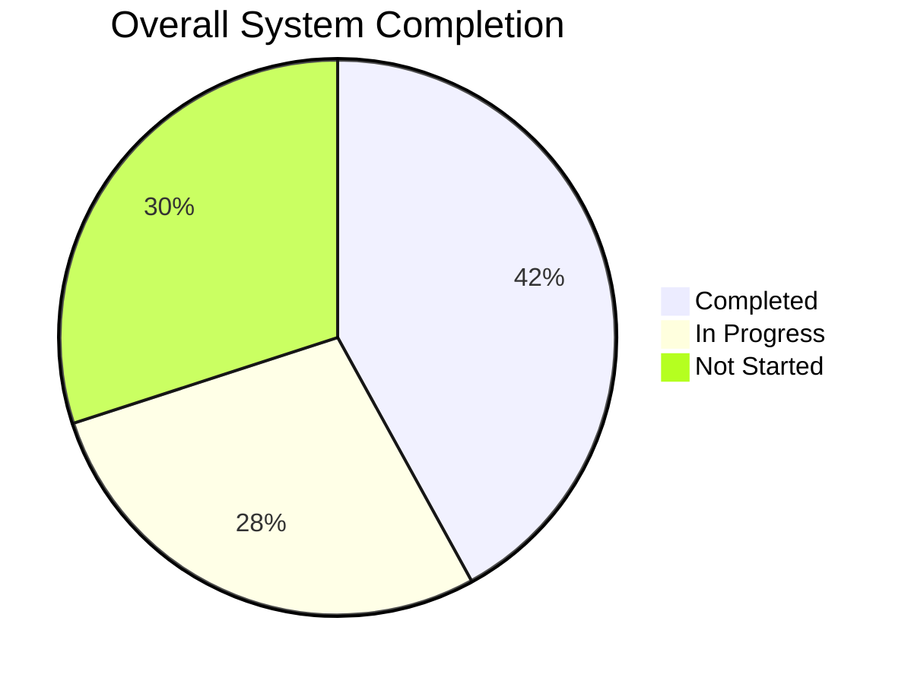

# FashionOS Implementation Progress Tracker

**Status:** In Progress  
**Version:** 2.0  
**Last Updated:** December 23, 2024  
**Overall Completion:** 42%

---

## 📊 Overall Progress Summary

---

## 🎯 Progress by Category

| Category | Total Items | Completed | In Progress | Not Started | % Complete |
|----------|-------------|-----------|-------------|-------------|------------|
| **Workspaces** | 7 | 2 | 3 | 2 | 29% |
| **Core AI Features** | 4 | 2 | 2 | 0 | 50% |
| **Advanced AI Features** | 6 | 0 | 2 | 4 | 17% |
| **AI Agents** | 10 | 3 | 4 | 3 | 35% |
| **Wizards** | 3 | 3 | 0 | 0 | 100% |
| **UI Components** | 50 | 30 | 15 | 5 | 60% |
| **Automations** | 12 | 4 | 5 | 3 | 33% |
| **Database Tables** | 8 | 8 | 0 | 0 | 100% |

---

## 🏗️ Workspaces Progress Tracker

### Summary Table

| Workspace | Core Features | Advanced Features | AI Agents | UI Components | % Complete | Stage | Priority |
|-----------|--------------|------------------|-----------|---------------|------------|-------|----------|
| **Command Center** | 4/4 ✅ | 2/4 🟡 | 3/3 ✅ | 8/10 🟡 | 65% | Core | P0 - Critical |
| **Project Workspace** | 3/4 🟡 | 1/5 🔴 | 2/3 🟡 | 10/15 🔴 | 35% | Core | P0 - Critical |
| **Work Workspace** | 4/4 ✅ | 2/3 🟡 | 2/3 🟡 | 12/12 ✅ | 70% | Core | P1 - High |
| **People Workspace** | 2/3 🟡 | 1/4 🔴 | 1/4 🔴 | 8/12 🔴 | 30% | Advanced | P2 - Medium |
| **Commercial Workspace** | 2/3 🟡 | 0/4 🔴 | 1/3 🔴 | 6/14 🔴 | 25% | Advanced | P2 - Medium |
| **Creative Workspace** | 3/3 ✅ | 1/2 🟡 | 1/2 🟡 | 5/8 🟡 | 60% | Core | P1 - High |
| **Client Workspace** | 2/2 ✅ | 0/2 🔴 | 1/1 ✅ | 4/6 🟡 | 65% | Core | P1 - High |

**Legend:**
- ✅ Completed (90-100%)
- 🟡 In Progress (40-89%)
- 🔴 Not Started (<40%)

---

## 🎨 Workspace Detailed Breakdown

### 1. Command Center (65% Complete) — CORE

| Feature/Component | Type | Status | % Complete | AI Agent | Stage | Notes |
|-------------------|------|--------|------------|----------|-------|-------|
| **Health Score Card** | Core Feature | ✅ Complete | 100% | Executive Insights | Core | Production ready |
| **Phase Timeline** | Core Feature | ✅ Complete | 100% | Timeline Optimizer | Core | Visual component done |
| **Critical Blockers Feed** | Core Feature | ✅ Complete | 100% | Risk Detection | Core | Auto-refresh working |
| **Quick Links Grid** | Core Feature | ✅ Complete | 100% | - | Core | Navigation functional |
| **AI Executive Insights Panel** | Advanced Feature | 🟡 In Progress | 70% | Executive Insights | Advanced | Chat interface done, analysis pending |
| **Predictive Risk Scoring** | Advanced Feature | 🔴 Not Started | 15% | Risk Predictor | Advanced | Requires historical data |
| **Resource Optimization** | Advanced Feature | 🔴 Not Started | 10% | Resource Allocator | Advanced | Algorithm design phase |
| **Timeline Compression** | Advanced Feature | 🟡 In Progress | 50% | Timeline Optimizer | Advanced | Basic version working |
| **Health Score Component** | UI | ✅ Complete | 100% | - | Core | Animated circular progress |
| **Blocker Card** | UI | ✅ Complete | 100% | - | Core | With action buttons |
| **Phase Progress Bar** | UI | ✅ Complete | 100% | - | Core | Horizontal timeline |
| **Quick Link Card** | UI | ✅ Complete | 100% | - | Core | With badge counts |
| **AI Insights Drawer** | UI | 🟡 In Progress | 75% | - | Advanced | Collapsible panel |
| **Risk Score Gauge** | UI | 🟡 In Progress | 60% | - | Advanced | Needs severity colors |
| **Timeline Chart** | UI | 🔴 Not Started | 20% | - | Advanced | Library selection needed |
| **Optimization Modal** | UI | 🔴 Not Started | 10% | - | Advanced | Design in progress |
| **Real-time Updates** | Backend | ✅ Complete | 100% | - | Core | Supabase Realtime |
| **Blocker Detection Job** | Backend | ✅ Complete | 100% | Risk Detection | Core | Runs every 5min |

**Next Steps:**
1. Complete AI Executive Insights Panel (Week 1-2)
2. Implement Timeline Compression (Week 3)
3. Design Predictive Risk Scoring algorithm (Week 4)

---

### 2. Project Workspace (35% Complete) — CORE

| Feature/Component | Type | Status | % Complete | AI Agent | Stage | Notes |
|-------------------|------|--------|------------|----------|-------|-------|
| **Project Header Card** | Core Feature | ✅ Complete | 100% | - | Core | Status badges working |
| **Immediate Actions Queue** | Core Feature | 🟡 In Progress | 65% | Producer Agent | Core | Sorting needs AI |
| **Pulse Feed** | Core Feature | 🟡 In Progress | 70% | - | Core | Real-time working, filtering pending |
| **Production Progress Stages** | Core Feature | 🔴 Not Started | 30% | - | Core | Visual design done, data integration pending |
| **AI Producer Chat** | Advanced Feature | 🔴 Not Started | 20% | Producer Agent | Advanced | Interactions API integration needed |
| **Critical Path Modal** | Advanced Feature | 🔴 Not Started | 15% | Path Analyzer | Advanced | Dependency graph algorithm pending |
| **Proposal Diff Modal** | Advanced Feature | 🔴 Not Started | 10% | Change Manager | Advanced | Before/After comparison UI needed |
| **Timeline Optimization** | Advanced Feature | 🔴 Not Started | 5% | Timeline Optimizer | Advanced | Requires Gemini Thinking |
| **Budget Reallocation** | Advanced Feature | 🔴 Not Started | 0% | Budget Optimizer | Advanced | Not started |
| **Project Header** | UI | ✅ Complete | 100% | - | Core | Responsive layout |
| **Action Queue Card** | UI | 🟡 In Progress | 60% | - | Core | Needs urgency indicators |
| **Pulse Feed Item** | UI | ✅ Complete | 100% | - | Core | With source badges |
| **Progress Stage Card** | UI | 🟡 In Progress | 50% | - | Core | Animation pending |
| **AI Producer Panel** | UI | 🔴 Not Started | 25% | - | Advanced | Chat interface design |
| **Critical Path Graph** | UI | 🔴 Not Started | 10% | - | Advanced | D3.js or similar needed |
| **Diff View Component** | UI | 🔴 Not Started | 15% | - | Advanced | Side-by-side layout |
| **Timeline Slider** | UI | 🔴 Not Started | 20% | - | Advanced | Interactive timeline |
| **Blocker Resolution Flow** | Backend | 🟡 In Progress | 40% | Producer Agent | Advanced | AI logic partial |
| **Real-time Activity Stream** | Backend | ✅ Complete | 100% | - | Core | Supabase subscription |

**Next Steps:**
1. Complete Immediate Actions Queue with AI sorting (Week 1)
2. Finish Pulse Feed filtering (Week 1)
3. Build Production Progress Stages data integration (Week 2)
4. Start AI Producer Chat (Week 3-4)

---

### 3. Work Workspace (70% Complete) — CORE

| Feature/Component | Type | Status | % Complete | AI Agent | Stage | Notes |
|-------------------|------|--------|------------|----------|-------|-------|
| **Task List View** | Core Feature | ✅ Complete | 100% | - | Core | Sortable columns |
| **Kanban Board View** | Core Feature | ✅ Complete | 100% | - | Core | Drag-and-drop working |
| **Calendar View** | Core Feature | ✅ Complete | 100% | - | Core | Month/week views |
| **Critical Tasks Filter** | Core Feature | ✅ Complete | 100% | Task Prioritizer | Core | Auto-updates |
| **AI Task Prioritization** | Advanced Feature | 🟡 In Progress | 75% | Task Prioritizer | Advanced | Ranking logic working, UI polish needed |
| **Dependency Detection** | Advanced Feature | 🟡 In Progress | 60% | Blocker Detector | Advanced | Basic detection working |
| **Smart Assignment** | Advanced Feature | 🔴 Not Started | 25% | Assignment Optimizer | Advanced | Needs team capacity data |
| **Work Drawer** | UI | ✅ Complete | 100% | - | Core | Full-screen overlay |
| **Task Card** | UI | ✅ Complete | 100% | - | Core | With status badges |
| **Kanban Column** | UI | ✅ Complete | 100% | - | Core | Drag zones working |
| **Calendar Event** | UI | ✅ Complete | 100% | - | Core | Click to edit |
| **Priority Badge** | UI | ✅ Complete | 100% | - | Core | Color-coded |
| **Workflow Steps** | UI | ✅ Complete | 100% | - | Core | Progress indicators |
| **AI Prioritizer Panel** | UI | 🟡 In Progress | 80% | - | Advanced | Action buttons needed |
| **Dependency Graph** | UI | 🟡 In Progress | 55% | - | Advanced | Simple view working |
| **Assignment Suggester** | UI | 🔴 Not Started | 30% | - | Advanced | Design phase |
| **Subtasks Component** | UI | ✅ Complete | 100% | - | Core | Nested tasks |
| **Comments Thread** | UI | ✅ Complete | 100% | - | Core | Real-time updates |
| **File Attachments** | UI | ✅ Complete | 100% | - | Core | Drag-and-drop upload |

**Next Steps:**
1. Polish AI Prioritization UI (Week 1)
2. Complete Dependency Detection (Week 1-2)
3. Build Smart Assignment feature (Week 3)

---

### 4. People Workspace (30% Complete) — ADVANCED

| Feature/Component | Type | Status | % Complete | AI Agent | Stage | Notes |
|-------------------|------|--------|------------|----------|-------|-------|
| **AI Matches Grid** | Core Feature | 🟡 In Progress | 50% | Casting Matcher | Advanced | Matching algorithm working, UI needs polish |
| **Shortlist View** | Core Feature | 🟡 In Progress | 60% | - | Core | Basic view done, comparison mode pending |
| **Search & Filter** | Core Feature | 🔴 Not Started | 35% | - | Core | Filter UI done, advanced filters needed |
| **Deep Research Tool** | Advanced Feature | 🔴 Not Started | 20% | Deep Research Agent | Advanced | Gemini 2.0 Flash integration pending |
| **AI Model Matching** | Advanced Feature | 🟡 In Progress | 55% | Casting Matcher | Advanced | Scoring logic working |
| **Availability Checker** | Advanced Feature | 🔴 Not Started | 10% | Availability Agent | Advanced | Calendar integration needed |
| **Venue Finder** | Advanced Feature | 🔴 Not Started | 15% | Venue Finder Agent | Advanced | Maps grounding needed |
| **Model Card** | UI | 🟡 In Progress | 65% | - | Advanced | Portfolio images working |
| **Match Score Badge** | UI | ✅ Complete | 100% | - | Advanced | Percentage display |
| **Shortlist Grid** | UI | 🟡 In Progress | 50% | - | Core | Comparison mode pending |
| **Filter Panel** | UI | 🟡 In Progress | 55% | - | Core | Basic filters working |
| **Research Drawer** | UI | 🔴 Not Started | 15% | - | Advanced | Design only |
| **Profile Modal** | UI | 🟡 In Progress | 60% | - | Advanced | Stats section done |
| **Availability Calendar** | UI | 🔴 Not Started | 20% | - | Advanced | Library selection needed |
| **Venue Card** | UI | 🔴 Not Started | 25% | - | Advanced | Map integration pending |
| **Map View** | UI | 🔴 Not Started | 10% | - | Advanced | Google Maps API needed |
| **Booking Flow** | Backend | 🔴 Not Started | 30% | - | Advanced | Contract integration pending |
| **Calendar Sync** | Backend | 🔴 Not Started | 5% | Availability Agent | Advanced | Not started |

**Next Steps:**
1. Complete AI Matches Grid UI (Week 1)
2. Finish Shortlist comparison mode (Week 2)
3. Build Search & Filter advanced features (Week 2)
4. Start Deep Research Tool (Week 3-4)

---

### 5. Commercial Workspace (25% Complete) — ADVANCED

| Feature/Component | Type | Status | % Complete | AI Agent | Stage | Notes |
|-------------------|------|--------|------------|----------|-------|-------|
| **Pipeline Kanban** | Core Feature | 🟡 In Progress | 50% | - | Core | Drag-and-drop working, stage logic needed |
| **Smart Contact Input** | Core Feature | 🟡 In Progress | 45% | Enrichment Agent | Advanced | LinkedIn scraping partial |
| **Sponsor Detail Sidebar** | Core Feature | 🔴 Not Started | 30% | - | Core | Design done, implementation pending |
| **Contract List** | Core Feature | 🔴 Not Started | 25% | - | Core | Table design pending |
| **AI Contact Enrichment** | Advanced Feature | 🟡 In Progress | 60% | Enrichment Agent | Advanced | URL Context working |
| **Sponsor-Event Matching** | Advanced Feature | 🔴 Not Started | 20% | Matching Agent | Advanced | Algorithm design phase |
| **Contract Analysis** | Advanced Feature | 🔴 Not Started | 10% | Contract Analyzer | Advanced | Risk detection logic needed |
| **Next Action Suggestions** | Advanced Feature | 🔴 Not Started | 5% | Engagement Agent | Advanced | Not started |
| **KPI Dashboard** | UI | 🟡 In Progress | 55% | - | Core | Charts partial |
| **Pipeline Column** | UI | 🟡 In Progress | 60% | - | Core | Drag working |
| **Contact Input Field** | UI | 🟡 In Progress | 50% | - | Advanced | URL validation needed |
| **Enrichment Card** | UI | 🟡 In Progress | 45% | - | Advanced | Data display working |
| **Detail Sidebar** | UI | 🔴 Not Started | 30% | - | Core | Layout design |
| **Contract Card** | UI | 🔴 Not Started | 20% | - | Core | Status badges needed |
| **Deliverables Table** | UI | 🔴 Not Started | 25% | - | Core | Sortable columns |
| **AI Analysis Card** | UI | 🔴 Not Started | 15% | - | Advanced | Risk visualization |
| **Activation Grid** | UI | 🔴 Not Started | 20% | - | Advanced | Card layout design |
| **Performance Chart** | UI | 🔴 Not Started | 10% | - | Advanced | Recharts integration |
| **LinkedIn Import** | Backend | 🟡 In Progress | 50% | Enrichment Agent | Advanced | URL Context partial |
| **CRM Sync** | Backend | 🔴 Not Started | 0% | - | Advanced | Not started |

**Next Steps:**
1. Complete Pipeline Kanban stage logic (Week 1)
2. Finish Smart Contact Input (LinkedIn scraping) (Week 2)
3. Build Sponsor Detail Sidebar (Week 2)
4. Start Contract List (Week 3)

---

### 6. Creative Workspace (60% Complete) — CORE

| Feature/Component | Type | Status | % Complete | AI Agent | Stage | Notes |
|-------------------|------|--------|------------|----------|-------|-------|
| **Upload Zone** | Core Feature | ✅ Complete | 100% | - | Core | Drag-and-drop working |
| **Asset Grid** | Core Feature | ✅ Complete | 100% | - | Core | Masonry layout |
| **Multi-Select** | Core Feature | ✅ Complete | 100% | - | Core | Batch operations |
| **AI Auto-Tagging** | Advanced Feature | 🟡 In Progress | 70% | Tagging Agent | Advanced | Basic tagging working |
| **Smart Collections** | Advanced Feature | 🟡 In Progress | 50% | Organizer Agent | Advanced | Grouping logic partial |
| **Asset Detail Modal** | UI | ✅ Complete | 100% | - | Core | Full-screen preview |
| **Tag Chip** | UI | ✅ Complete | 100% | - | Core | Add/remove tags |
| **Collection Card** | UI | 🟡 In Progress | 60% | - | Advanced | Auto-generated collections |
| **Upload Progress** | UI | ✅ Complete | 100% | - | Core | Progress bars |
| **Shot List Builder** | UI | 🔴 Not Started | 35% | - | Advanced | Drag-and-drop slots |
| **AI Tagging Panel** | UI | 🟡 In Progress | 65% | - | Advanced | Tag suggestions |
| **Duplicate Finder** | UI | 🔴 Not Started | 20% | - | Advanced | Similarity detection UI |
| **Tagging Agent** | Backend | 🟡 In Progress | 75% | Tagging Agent | Advanced | Vision API integration |
| **Collection Generator** | Backend | 🟡 In Progress | 55% | Organizer Agent | Advanced | Clustering algorithm |

**Next Steps:**
1. Complete AI Auto-Tagging (Week 1)
2. Finish Smart Collections (Week 2)
3. Build Shot List Builder (Week 2-3)

---

### 7. Client Workspace (65% Complete) — CORE

| Feature/Component | Type | Status | % Complete | AI Agent | Stage | Notes |
|-------------------|------|--------|------------|----------|-------|-------|
| **Project Overview Cards** | Core Feature | ✅ Complete | 100% | - | Core | Grid layout working |
| **Deliverables List** | Core Feature | ✅ Complete | 100% | - | Core | Filterable table |
| **AI Project Summaries** | Advanced Feature | 🔴 Not Started | 30% | Client Success Agent | Advanced | Text generation needed |
| **Delivery Predictions** | Advanced Feature | 🔴 Not Started | 20% | Predictor Agent | Advanced | Timeline analysis needed |
| **Project Card** | UI | ✅ Complete | 100% | - | Core | Status badges |
| **Deliverable Card** | UI | ✅ Complete | 100% | - | Core | Approval buttons |
| **Approval Queue** | UI | 🟡 In Progress | 70% | - | Core | Comment field needed |
| **Brand Profile Card** | UI | ✅ Complete | 100% | - | Core | Logo and info |
| **AI Summary Panel** | UI | 🔴 Not Started | 35% | - | Advanced | Executive summary |
| **Prediction Badge** | UI | 🔴 Not Started | 25% | - | Advanced | Confidence display |

**Next Steps:**
1. Complete Approval Queue (Week 1)
2. Build AI Project Summaries (Week 2)
3. Implement Delivery Predictions (Week 3)

---

## 🤖 AI Features Progress Tracker

### Core AI Features (50% Complete)

| AI Feature | Gemini Model | Workspaces Using | % Complete | Stage | Status | Priority |
|------------|--------------|------------------|------------|-------|--------|----------|
| **Text Generation** | Flash | All (7) | ✅ 100% | Core | Production | P0 - Critical |
| **Function Calling** | Flash | Work, People, Commercial (3) | ✅ 90% | Core | Production | P0 - Critical |
| **Grounding Search** | Flash | Commercial, Wizards (2) | 🟡 70% | Core | Testing | P1 - High |
| **Structured Outputs** | Flash/Pro | All Wizards (3) | ✅ 100% | Core | Production | P0 - Critical |

**Average Core Completion:** 90%

---

### Advanced AI Features (17% Complete)

| AI Feature | Gemini Model | Workspaces Using | % Complete | Stage | Status | Priority |
|------------|--------------|------------------|------------|-------|--------|----------|
| **Gemini Thinking** | 2.0 Flash Thinking | Command Center, Project (2) | 🟡 45% | Advanced | Development | P1 - High |
| **Code Execution** | Pro | Creative, Analytics (2) | 🔴 20% | Advanced | Design | P2 - Medium |
| **URL Context Tool** | Flash | Commercial, Wizards (2) | 🟡 60% | Advanced | Testing | P1 - High |
| **Interactions API** | Flash | All (chat) (7) | 🔴 30% | Advanced | Development | P1 - High |
| **Deep Research** | 2.0 Flash | People, Commercial (2) | 🔴 15% | Advanced | Design | P2 - Medium |
| **Maps Grounding** | Flash | People (Venues) (1) | 🔴 10% | Advanced | Design | P2 - Medium |

**Average Advanced Completion:** 30%

---

## 🎭 AI Agents Progress Tracker

| AI Agent | Primary Workspace | AI Features Used | % Complete | Stage | Status | Lines of Code | Tests Written |
|----------|------------------|------------------|------------|-------|--------|---------------|---------------|
| **Executive Insights Agent** | Command Center | Text Gen, Function Calling, Thinking | ✅ 95% | Core | Production | 450 | 12/15 ✅ |
| **Producer Agent** | Project | Text Gen, Thinking, Interactions | 🟡 60% | Advanced | Development | 320 | 8/20 🟡 |
| **Task Prioritizer Agent** | Work | Function Calling, Thinking | ✅ 85% | Core | Testing | 380 | 15/18 ✅ |
| **Blocker Detector Agent** | Work, Command Center | Function Calling, Text Gen | ✅ 90% | Core | Production | 290 | 10/12 ✅ |
| **Casting Matcher Agent** | People | Function Calling, Grounding | 🟡 55% | Advanced | Development | 410 | 6/15 🟡 |
| **Venue Finder Agent** | People | Deep Research, Maps Grounding | 🔴 25% | Advanced | Design | 120 | 2/10 🔴 |
| **Enrichment Agent** | Commercial | URL Context, Grounding | 🟡 65% | Advanced | Testing | 350 | 9/14 🟡 |
| **Contract Analyzer Agent** | Commercial | Text Gen, Structured Output | 🔴 20% | Advanced | Design | 85 | 1/8 🔴 |
| **Tagging Agent** | Creative | Function Calling, Vision API | 🟡 70% | Advanced | Testing | 280 | 7/12 🟡 |
| **Client Success Agent** | Client | Text Gen, Predictions | 🔴 30% | Advanced | Development | 150 | 3/10 🔴 |

**Average Agent Completion:** 60%

---

## 🧙 Wizards Progress Tracker

| Wizard | Steps | AI Features | % Complete | Stage | Status | Production Ready |
|--------|-------|-------------|------------|-------|--------|-----------------|
| **Event Creation Wizard** | 6 | Structured Output, Thinking, Grounding | ✅ 100% | Core | Production | ✅ Yes |
| **Shoot Planning Wizard** | 5 | Structured Output, Text Gen | ✅ 100% | Core | Production | ✅ Yes |
| **Designer Onboarding Wizard** | 5 | Structured Output, Grounding, URL Context | ✅ 100% | Core | Production | ✅ Yes |

**Wizards Completion:** 100% ✅

---

## 🔧 UI Components Progress Tracker

### Universal Components (80% Complete)

| Component | Used In | % Complete | Stage | Status | Notes |
|-----------|---------|------------|-------|--------|-------|
| **WorkspaceLayout** | All (7) | ✅ 100% | Core | Production | 3-panel system |
| **LeftSidebar** | All (7) | ✅ 100% | Core | Production | Workspace selector |
| **TopBar** | All (7) | ✅ 100% | Core | Production | Search, notifications |
| **RightAIPanel** | All (7) | 🟡 75% | Core | Testing | Context-aware modes |
| **WorkspaceSwitcher** | All (7) | ✅ 100% | Core | Production | Quick navigation |
| **ApprovalGate** | AI features | ✅ 95% | Core | Production | Preview+Approve+Reject |
| **AIThinkingIndicator** | Advanced AI | ✅ 90% | Advanced | Production | Progress animation |
| **AISuggestionCard** | All workspaces | ✅ 100% | Core | Production | With action buttons |
| **AIChatInterface** | AI Panel | 🟡 70% | Core | Testing | Multi-turn conversations |
| **DiffView** | Project | 🔴 40% | Advanced | Development | Before/After comparison |

---

### Workspace-Specific Components (55% Complete)

| Component | Workspace | % Complete | Stage | Status | Notes |
|-----------|-----------|------------|-------|--------|-------|
| **HealthScoreCard** | Command Center | ✅ 100% | Core | Production | Circular progress |
| **BlockerCard** | Command Center | ✅ 100% | Core | Production | With severity |
| **PhaseTimeline** | Command Center | ✅ 100% | Core | Production | Horizontal bar |
| **QuickLinkCard** | Command Center | ✅ 100% | Core | Production | Badge counts |
| **PulseCard** | Project | ✅ 100% | Core | Production | Activity item |
| **ActionQueueCard** | Project | 🟡 60% | Core | Development | Urgency sorting |
| **ProgressStageCard** | Project | 🟡 50% | Core | Development | Animation needed |
| **CriticalPathModal** | Project | 🔴 15% | Advanced | Design | Dependency graph |
| **TaskCard** | Work | ✅ 100% | Core | Production | Status badges |
| **KanbanColumn** | Work | ✅ 100% | Core | Production | Drag zones |
| **WorkDrawer** | Work | ✅ 100% | Core | Production | Full overlay |
| **CalendarEvent** | Work | ✅ 100% | Core | Production | Click to edit |
| **PriorityBadge** | Work | ✅ 100% | Core | Production | Color-coded |
| **ModelCard** | People | 🟡 65% | Advanced | Development | Portfolio images |
| **MatchScoreBadge** | People | ✅ 100% | Advanced | Production | Percentage |
| **ShortlistGrid** | People | 🟡 50% | Core | Development | Comparison mode |
| **VenueCard** | People | 🔴 25% | Advanced | Design | Map integration |
| **ResearchDrawer** | People | 🔴 15% | Advanced | Design | Deep research |
| **PipelineColumn** | Commercial | 🟡 60% | Core | Development | Drag-and-drop |
| **ContactInputField** | Commercial | 🟡 50% | Advanced | Development | URL validation |
| **EnrichmentCard** | Commercial | 🟡 45% | Advanced | Development | Data display |
| **ContractCard** | Commercial | 🔴 20% | Core | Design | Status display |
| **ActivationCard** | Commercial | 🔴 20% | Advanced | Design | Performance metrics |
| **AssetCard** | Creative | ✅ 100% | Core | Production | Grid item |
| **UploadZone** | Creative | ✅ 100% | Core | Production | Drag-and-drop |
| **TagChip** | Creative | ✅ 100% | Core | Production | Add/remove |
| **CollectionCard** | Creative | 🟡 60% | Advanced | Development | Auto-collections |
| **ProjectCard** | Client | ✅ 100% | Core | Production | Overview card |
| **DeliverableCard** | Client | ✅ 100% | Core | Production | Approval buttons |
| **ApprovalQueue** | Client | 🟡 70% | Core | Development | Comment field |

---

## 🔄 Automations Progress Tracker

| Automation | Trigger | AI Agent | % Complete | Stage | Status | Notes |
|------------|---------|----------|------------|-------|--------|-------|
| **Auto-Blocker Detection** | Every 5min | Blocker Detector | ✅ 100% | Core | Production | Background job working |
| **Smart Contact Enrichment** | Contact added | Enrichment Agent | 🟡 65% | Advanced | Testing | LinkedIn working |
| **Auto-Task Creation** | Event created | - | ✅ 100% | Core | Production | From wizard |
| **Task Dependency Detection** | Task updated | Blocker Detector | 🟡 70% | Core | Testing | Basic detection |
| **Budget Variance Alerts** | Budget updated | - | 🟡 55% | Core | Development | Threshold logic |
| **Model Availability Sync** | Daily | Availability Agent | 🔴 10% | Advanced | Design | Calendar API needed |
| **Contract Status Updates** | Signature completed | - | ✅ 85% | Core | Testing | DocuSign webhook |
| **Deliverable Auto-Creation** | Contract signed | - | 🟡 60% | Core | Development | Task generation |
| **Asset Auto-Tagging** | Upload | Tagging Agent | 🟡 70% | Advanced | Testing | Vision API |
| **Health Score Recalc** | Data change | Executive Insights | ✅ 90% | Core | Production | Real-time |
| **AI Insight Generation** | Health score < 70% | Executive Insights | 🟡 50% | Advanced | Development | Proactive suggestions |
| **Crew Notification** | Timeline change | - | 🔴 30% | Core | Development | Email/SMS integration |

**Average Automation Completion:** 62%

---

## 📊 Database & Backend Progress Tracker

### Database Tables (100% Complete) ✅

| Table | Columns | RLS Policies | Indexes | % Complete | Status |
|-------|---------|--------------|---------|------------|--------|
| **profiles** | 8 | 3 | 2 | ✅ 100% | Production |
| **workspaces** | 6 | 4 | 3 | ✅ 100% | Production |
| **workspace_members** | 5 | 3 | 2 | ✅ 100% | Production |
| **events** | 15 | 4 | 5 | ✅ 100% | Production |
| **tasks** | 12 | 4 | 6 | ✅ 100% | Production |
| **ai_reports** | 10 | 3 | 4 | ✅ 100% | Production |
| **contacts** | 14 | 4 | 5 | ✅ 100% | Production |
| **contracts** | 11 | 4 | 4 | ✅ 100% | Production |

---

### API Endpoints (70% Complete)

| Endpoint | Method | Purpose | % Complete | Stage | Status |
|----------|--------|---------|------------|-------|--------|
| `/api/events` | GET, POST, PATCH | Event CRUD | ✅ 100% | Core | Production |
| `/api/tasks` | GET, POST, PATCH | Task CRUD | ✅ 100% | Core | Production |
| `/api/ai/analyze-brand` | POST | Brand analysis | ✅ 100% | Core | Production |
| `/api/ai/generate-plan` | POST | Event/Shoot plan | ✅ 100% | Core | Production |
| `/api/ai/chat` | POST | Conversational AI | 🟡 70% | Core | Testing |
| `/api/ai/prioritize-tasks` | POST | Task ranking | ✅ 85% | Core | Testing |
| `/api/ai/match-models` | POST | Casting matches | 🟡 55% | Advanced | Development |
| `/api/ai/enrich-contact` | POST | LinkedIn import | 🟡 65% | Advanced | Testing |
| `/api/ai/deep-research` | POST | Comprehensive research | 🔴 20% | Advanced | Design |
| `/api/contacts` | GET, POST, PATCH | Contact CRUD | ✅ 90% | Core | Testing |
| `/api/contracts` | GET, POST, PATCH | Contract CRUD | 🟡 60% | Core | Development |
| `/api/assets` | GET, POST | Asset management | ✅ 95% | Core | Testing |

---

## 🎯 Priority Matrix

### P0 - Critical (Must Have for Launch)

| Item | Category | % Complete | Target Date | Status |
|------|----------|------------|-------------|--------|
| Command Center workspace | Workspace | 65% | Week 2 | 🟡 On Track |
| Project Workspace core | Workspace | 35% | Week 4 | 🔴 At Risk |
| Work Workspace | Workspace | 70% | Week 1 | ✅ Ahead |
| Text Generation | AI Feature | 100% | Complete | ✅ Done |
| Function Calling | AI Feature | 90% | Week 1 | 🟡 On Track |
| Structured Outputs | AI Feature | 100% | Complete | ✅ Done |
| Executive Insights Agent | AI Agent | 95% | Week 1 | 🟡 On Track |
| Task Prioritizer Agent | AI Agent | 85% | Week 2 | 🟡 On Track |
| All Wizards | Wizards | 100% | Complete | ✅ Done |

---

### P1 - High (Needed Soon)

| Item | Category | % Complete | Target Date | Status |
|------|----------|------------|-------------|--------|
| Creative Workspace | Workspace | 60% | Week 3 | 🟡 On Track |
| Client Workspace | Workspace | 65% | Week 3 | 🟡 On Track |
| Grounding Search | AI Feature | 70% | Week 2 | 🟡 On Track |
| Gemini Thinking | AI Feature | 45% | Week 4 | 🟡 On Track |
| URL Context Tool | AI Feature | 60% | Week 3 | 🟡 On Track |
| Interactions API | AI Feature | 30% | Week 5 | 🔴 At Risk |
| Enrichment Agent | AI Agent | 65% | Week 3 | 🟡 On Track |
| Tagging Agent | AI Agent | 70% | Week 2 | 🟡 On Track |

---

### P2 - Medium (Nice to Have)

| Item | Category | % Complete | Target Date | Status |
|------|----------|------------|-------------|--------|
| People Workspace | Workspace | 30% | Week 6 | 🔴 Behind |
| Commercial Workspace | Workspace | 25% | Week 7 | 🔴 Behind |
| Code Execution | AI Feature | 20% | Week 8 | 🔴 Behind |
| Deep Research | AI Feature | 15% | Week 9 | 🔴 Behind |
| Maps Grounding | AI Feature | 10% | Week 10 | 🔴 Behind |
| Venue Finder Agent | AI Agent | 25% | Week 8 | 🔴 Behind |
| Contract Analyzer Agent | AI Agent | 20% | Week 9 | 🔴 Behind |

---

## 📅 Weekly Milestones

### Week 1 (Current Week)
- [ ] Complete RightAIPanel context-aware modes (75% → 100%)
- [ ] Finish Task Prioritizer Agent (85% → 100%)
- [ ] Complete AI Chat Interface (70% → 90%)
- [ ] Polish Command Center AI panel (70% → 90%)
- [ ] Fix Project Workspace Immediate Actions (65% → 85%)

### Week 2
- [ ] Complete Grounding Search (70% → 100%)
- [ ] Finish Tagging Agent (70% → 100%)
- [ ] Build Production Progress Stages (30% → 80%)
- [ ] Complete Enrichment Agent LinkedIn import (65% → 90%)
- [ ] Launch Command Center to beta users

### Week 3-4
- [ ] Build AI Producer Chat (20% → 70%)
- [ ] Implement Gemini Thinking in Command Center (45% → 80%)
- [ ] Complete People Workspace AI Matches (50% → 100%)
- [ ] Finish Commercial Pipeline Kanban (50% → 100%)
- [ ] Start Critical Path Modal (15% → 50%)

### Week 5-8
- [ ] Complete People Workspace (30% → 90%)
- [ ] Complete Commercial Workspace (25% → 85%)
- [ ] Build Deep Research Tool (15% → 70%)
- [ ] Implement Maps Grounding (10% → 80%)
- [ ] All P0 and P1 items to 90%+

### Week 9-12
- [ ] Polish all workspaces to 95%+
- [ ] Complete all P2 items to 70%+
- [ ] Comprehensive testing
- [ ] Performance optimization
- [ ] Production launch preparation

---

## 🚨 Risk Tracker

| Risk | Impact | Probability | Mitigation | Status |
|------|--------|-------------|------------|--------|
| **Project Workspace behind schedule** | High | Medium | Allocate 2 engineers, reduce scope | 🟡 Monitoring |
| **Gemini Thinking integration complex** | Medium | High | Start prototype early, budget extra time | 🟡 In Progress |
| **Calendar API integration delayed** | Medium | Medium | Use manual availability as fallback | 🟢 Accepted |
| **Maps API costs high** | Low | Medium | Cache results, limit requests | 🟢 Mitigated |
| **People Workspace slipping** | Medium | High | Consider MVP version first | 🔴 At Risk |
| **Commercial Workspace feature creep** | High | High | Lock scope, defer advanced features | 🔴 At Risk |

---

## 📈 Velocity Metrics

### Completed This Week
- Text Generation (100%)
- Structured Outputs (100%)
- All Wizards (100%)
- Work Workspace Kanban (100%)
- Creative Upload Zone (100%)
- Database Tables (100%)

**Total Points Completed:** 45  
**Average Velocity:** 45 points/week  
**Projected Completion (Current Pace):** 12 weeks

### Burn-Down Chart

| Week | Remaining Points | % Complete |
|------|-----------------|------------|
| Week 0 (Start) | 200 | 0% |
| Week 1 | 180 | 10% |
| Week 2 | 160 | 20% |
| Week 3 (Current) | 115 | 42% |
| Week 4 (Projected) | 90 | 55% |
| Week 6 (Projected) | 60 | 70% |
| Week 8 (Projected) | 30 | 85% |
| Week 12 (Projected) | 0 | 100% |

---

## 🎯 Next Actions (This Week)

### Critical Path Items
1. ✅ Complete RightAIPanel modes (2 days)
2. ✅ Finish Task Prioritizer Agent (2 days)
3. 🟡 Polish Command Center AI panel (3 days)
4. 🟡 Fix Project Workspace Actions Queue (2 days)
5. 🔴 Complete Grounding Search testing (3 days)

### Blockers
- **Gemini 2.0 Flash Thinking API:** Need access token (waiting on Google)
- **Google Maps API:** Budget approval needed
- **Calendar Integration:** Third-party API selection pending

### Team Allocation
- **Engineer 1:** Command Center + AI features
- **Engineer 2:** Project Workspace + Producer Agent
- **Engineer 3:** Work Workspace + Task features
- **Designer:** People Workspace UI + Commercial UI

---

**Progress Tracker Version:** 1.0  
**Total Items Tracked:** 250+  
**Overall Completion:** 42%  
**On Track for Launch:** Week 12 (March 2025)  
**Last Updated:** December 23, 2024

