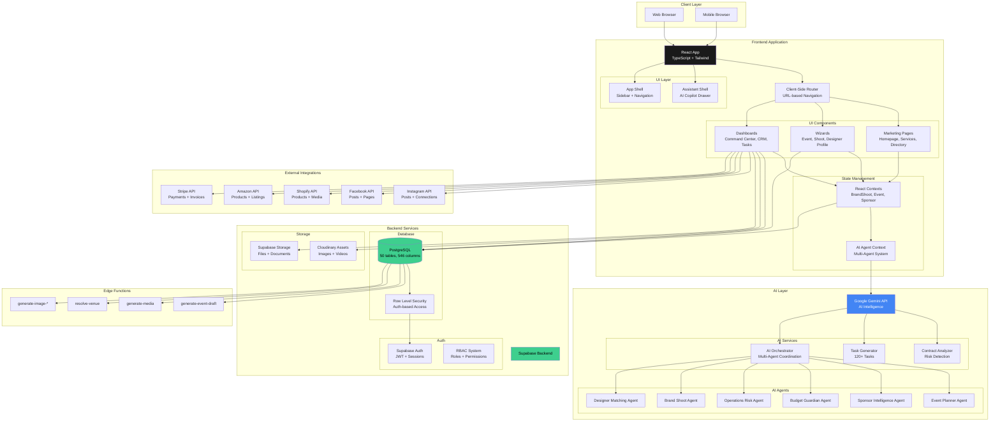
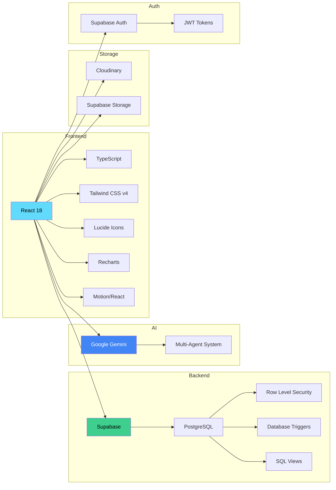
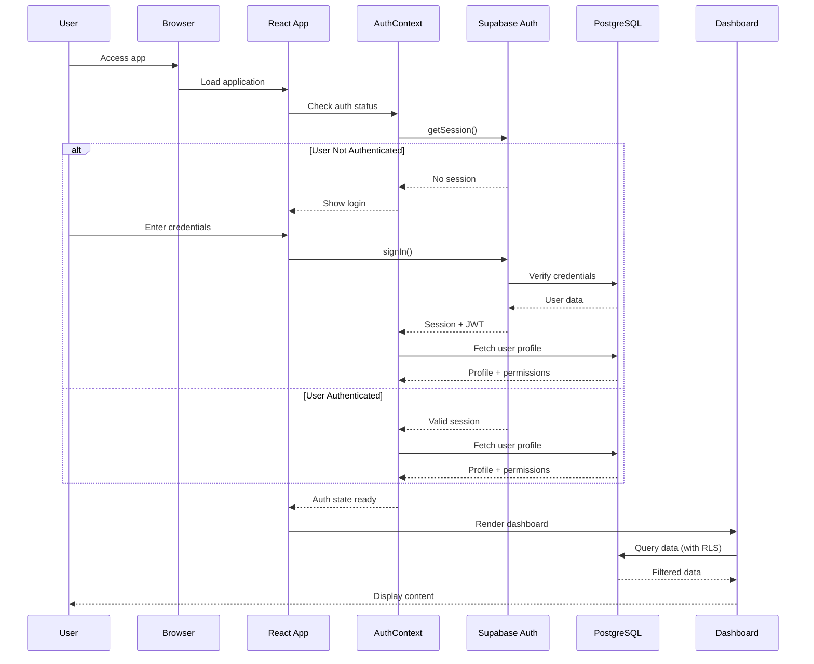
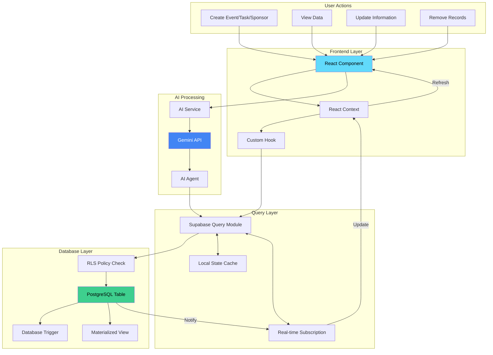

# System Overview Diagram

## High-Level Architecture

```mermaid
graph TB
    subgraph "Client Layer"
        BROWSER[Web Browser]
        MOBILE[Mobile Browser]
    end
    
    subgraph "Frontend Application"
        APP[React App<br/>TypeScript + Tailwind]
        ROUTER[Client-Side Router<br/>URL-based Navigation]
        
        subgraph "UI Components"
            MARKETING[Marketing Pages<br/>Homepage, Services, Directory]
            WIZARDS[Wizards<br/>Event, Shoot, Designer Profile]
            DASHBOARDS[Dashboards<br/>Command Center, CRM, Tasks]
        end
        
        subgraph "State Management"
            CONTEXTS[React Contexts<br/>BrandShoot, Event, Sponsor]
            AGENTS[AI Agent Context<br/>Multi-Agent System]
        end
        
        subgraph "UI Layer"
            ASSISTANT[Assistant Shell<br/>AI Copilot Drawer]
            APPSHELL[App Shell<br/>Sidebar + Navigation]
        end
    end
    
    subgraph "Backend Services"
        SUPABASE[Supabase Backend]
        
        subgraph "Database"
            POSTGRES[(PostgreSQL<br/>50 tables, 546 columns)]
            RLS[Row Level Security<br/>Auth-based Access]
        end
        
        subgraph "Storage"
            CLOUDINARY[Cloudinary Assets<br/>Images + Videos]
            SUPASTORAGE[Supabase Storage<br/>Files + Documents]
        end
        
        subgraph "Auth"
            SUPAAUTH[Supabase Auth<br/>JWT + Sessions]
            RBAC[RBAC System<br/>Roles + Permissions]
        end
    end
    
    subgraph "AI Layer"
        GEMINI[Google Gemini API<br/>AI Intelligence]
        
        subgraph "AI Services"
            CONTRACT[Contract Analyzer<br/>Risk Detection]
            TASKGEN[Task Generator<br/>120+ Tasks]
            ORCHESTRATOR[AI Orchestrator<br/>Multi-Agent Coordination]
        end
        
        subgraph "AI Agents"
            EVENTPLANNER[Event Planner Agent]
            SPONSORINTEL[Sponsor Intelligence Agent]
            BUDGETGUARD[Budget Guardian Agent]
            OPSRISK[Operations Risk Agent]
            BRANDSHOOT[Brand Shoot Agent]
            DESIGNER[Designer Matching Agent]
        end
    end
    
    subgraph "External Integrations"
        INSTAGRAM[Instagram API<br/>Posts + Connections]
        FACEBOOK[Facebook API<br/>Posts + Pages]
        SHOPIFY[Shopify API<br/>Products + Media]
        AMAZON[Amazon API<br/>Products + Listings]
        STRIPE[Stripe API<br/>Payments + Invoices]
    end
    
    subgraph "Edge Functions"
        EDGEGEN[generate-event-draft]
        EDGEMEDIA[generate-media]
        EDGEVENUE[resolve-venue]
        EDGEIMAGE[generate-image-*]
    end
    
    BROWSER --> APP
    MOBILE --> APP
    APP --> ROUTER
    ROUTER --> MARKETING
    ROUTER --> WIZARDS
    ROUTER --> DASHBOARDS
    
    MARKETING --> CONTEXTS
    WIZARDS --> CONTEXTS
    DASHBOARDS --> CONTEXTS
    
    CONTEXTS --> AGENTS
    
    APP --> ASSISTANT
    APP --> APPSHELL
    
    DASHBOARDS --> POSTGRES
    WIZARDS --> POSTGRES
    CONTEXTS --> POSTGRES
    
    POSTGRES --> RLS
    RLS --> SUPAAUTH
    
    DASHBOARDS --> CLOUDINARY
    DASHBOARDS --> SUPASTORAGE
    
    AGENTS --> GEMINI
    GEMINI --> CONTRACT
    GEMINI --> TASKGEN
    GEMINI --> ORCHESTRATOR
    
    ORCHESTRATOR --> EVENTPLANNER
    ORCHESTRATOR --> SPONSORINTEL
    ORCHESTRATOR --> BUDGETGUARD
    ORCHESTRATOR --> OPSRISK
    ORCHESTRATOR --> BRANDSHOOT
    ORCHESTRATOR --> DESIGNER
    
    POSTGRES --> EDGEGEN
    POSTGRES --> EDGEMEDIA
    POSTGRES --> EDGEVENUE
    POSTGRES --> EDGEIMAGE
    
    DASHBOARDS --> INSTAGRAM
    DASHBOARDS --> FACEBOOK
    DASHBOARDS --> SHOPIFY
    DASHBOARDS --> AMAZON
    DASHBOARDS --> STRIPE
    
    style APP fill:#1A1A1A,color:#fff
    style POSTGRES fill:#3ECF8E,color:#000
    style GEMINI fill:#4285F4,color:#fff
    style SUPABASE fill:#3ECF8E,color:#000
```

## Technology Stack

```mermaid
graph LR
    subgraph "Frontend"
        REACT[React 18]
        TS[TypeScript]
        TAILWIND[Tailwind CSS v4]
        LUCIDE[Lucide Icons]
        RECHARTS[Recharts]
        MOTION[Motion/React]
    end
    
    subgraph "Backend"
        SUPA[Supabase]
        POSTGRES[PostgreSQL]
        RLS[Row Level Security]
        TRIGGERS[Database Triggers]
        VIEWS[SQL Views]
    end
    
    subgraph "AI"
        GEMINI[Google Gemini]
        AGENTS[Multi-Agent System]
    end
    
    subgraph "Storage"
        CLOUD[Cloudinary]
        SUPSTOR[Supabase Storage]
    end
    
    subgraph "Auth"
        SUPAAUTH[Supabase Auth]
        JWT[JWT Tokens]
    end
    
    REACT --> TS
    REACT --> TAILWIND
    REACT --> LUCIDE
    REACT --> RECHARTS
    REACT --> MOTION
    
    REACT --> SUPA
    SUPA --> POSTGRES
    POSTGRES --> RLS
    POSTGRES --> TRIGGERS
    POSTGRES --> VIEWS
    
    REACT --> GEMINI
    GEMINI --> AGENTS
    
    REACT --> CLOUD
    REACT --> SUPSTOR
    
    REACT --> SUPAAUTH
    SUPAAUTH --> JWT
    
    style REACT fill:#61DAFB,color:#000
    style SUPA fill:#3ECF8E,color:#000
    style GEMINI fill:#4285F4,color:#fff
```

## Authentication Flow

```mermaid
sequenceDiagram
    participant User
    participant Browser
    participant React App
    participant AuthContext
    participant Supabase Auth
    participant PostgreSQL
    participant Dashboard
    
    User->>Browser: Access app
    Browser->>React App: Load application
    React App->>AuthContext: Check auth status
    AuthContext->>Supabase Auth: getSession()
    
    alt User Not Authenticated
        Supabase Auth-->>AuthContext: No session
        AuthContext-->>React App: Show login
        User->>React App: Enter credentials
        React App->>Supabase Auth: signIn()
        Supabase Auth->>PostgreSQL: Verify credentials
        PostgreSQL-->>Supabase Auth: User data
        Supabase Auth-->>AuthContext: Session + JWT
        AuthContext->>PostgreSQL: Fetch user profile
        PostgreSQL-->>AuthContext: Profile + permissions
    else User Authenticated
        Supabase Auth-->>AuthContext: Valid session
        AuthContext->>PostgreSQL: Fetch user profile
        PostgreSQL-->>AuthContext: Profile + permissions
    end
    
    AuthContext-->>React App: Auth state ready
    React App->>Dashboard: Render dashboard
    Dashboard->>PostgreSQL: Query data (with RLS)
    PostgreSQL-->>Dashboard: Filtered data
    Dashboard-->>User: Display content
```

## Data Flow Overview

```mermaid
flowchart TD
    subgraph "User Actions"
        CREATE[Create Event/Task/Sponsor]
        READ[View Data]
        UPDATE[Update Information]
        DELETE[Remove Records]
    end
    
    subgraph "Frontend Layer"
        COMPONENT[React Component]
        CONTEXT[React Context]
        HOOK[Custom Hook]
    end
    
    subgraph "Query Layer"
        QUERY[Supabase Query Module]
        CACHE[Local State Cache]
        REALTIME[Real-time Subscription]
    end
    
    subgraph "Database Layer"
        TABLE[PostgreSQL Table]
        RLS[RLS Policy Check]
        TRIGGER[Database Trigger]
        VIEW[Materialized View]
    end
    
    subgraph "AI Processing"
        AISERVICE[AI Service]
        GEMINI[Gemini API]
        AGENT[AI Agent]
    end
    
    CREATE --> COMPONENT
    READ --> COMPONENT
    UPDATE --> COMPONENT
    DELETE --> COMPONENT
    
    COMPONENT --> CONTEXT
    CONTEXT --> HOOK
    HOOK --> QUERY
    
    QUERY --> RLS
    RLS --> TABLE
    TABLE --> TRIGGER
    TABLE --> VIEW
    
    QUERY <--> CACHE
    QUERY <--> REALTIME
    
    COMPONENT --> AISERVICE
    AISERVICE --> GEMINI
    GEMINI --> AGENT
    AGENT --> QUERY
    
    TABLE --Notify--> REALTIME
    REALTIME --Update--> CONTEXT
    CONTEXT --Refresh--> COMPONENT
    
    style COMPONENT fill:#61DAFB,color:#000
    style TABLE fill:#3ECF8E,color:#000
    style GEMINI fill:#4285F4,color:#fff
```
