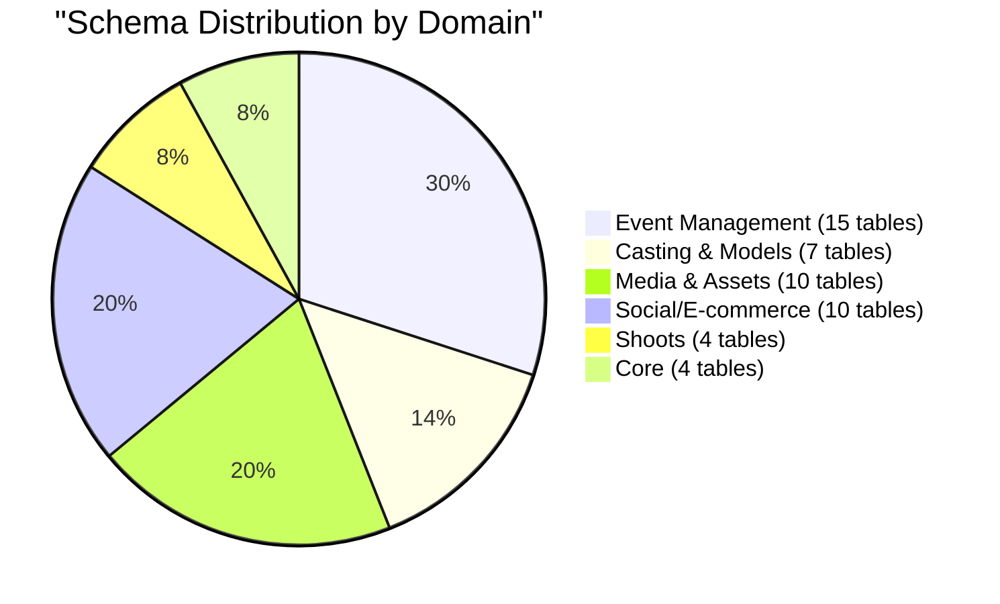

# Core Data Model (ERD)

## Primary Entity Relationships

```mermaid
erDiagram
    PROFILES ||--o{ EVENTS : "organizes"
    PROFILES ||--o{ ORGANIZATIONS : "owns"
    PROFILES ||--o{ ORGANIZER_TEAMS : "creates"
    PROFILES ||--o{ MODEL_PROFILES : "has"
    PROFILES ||--o{ STAKEHOLDERS : "manages"
    PROFILES ||--o{ FASHION_SHOW_DESIGNER_PROFILES : "represents"
    
    ORGANIZATIONS ||--o{ EVENTS : "hosts"
    ORGANIZATIONS ||--o{ SHOOTS : "orders"
    
    EVENTS ||--o{ TICKET_TIERS : "offers"
    EVENTS ||--o{ REGISTRATIONS : "receives"
    EVENTS ||--o{ EVENT_PHASES : "contains"
    EVENTS ||--o{ TASKS : "tracks"
    EVENTS ||--o{ EVENT_STAKEHOLDERS : "involves"
    EVENTS ||--o{ EVENT_ASSETS : "displays"
    EVENTS ||--o{ EVENT_SCHEDULES : "schedules"
    EVENTS ||--o{ EVENT_REHEARSALS : "plans"
    EVENTS ||--o{ EVENT_MODELS : "casts"
    EVENTS ||--o{ EVENT_DESIGNERS : "features"
    EVENTS ||--o{ EVENT_SPONSORS : "sponsored_by"
    EVENTS }o--|| VENUES : "held_at"
    EVENTS }o--|| ORGANIZER_TEAMS : "managed_by"
    
    TICKET_TIERS ||--o{ REGISTRATIONS : "sold_as"
    REGISTRATIONS ||--o{ PAYMENTS : "requires"
    
    EVENT_PHASES ||--o{ TASKS : "groups"
    TASKS ||--o{ TASK_ASSIGNEES : "assigned_to"
    
    STAKEHOLDERS ||--o{ TASK_ASSIGNEES : "receives"
    STAKEHOLDERS ||--o{ EVENT_STAKEHOLDERS : "participates"
    STAKEHOLDERS ||--o{ ORGANIZER_TEAM_MEMBERS : "joins"
    STAKEHOLDERS ||--o{ CALL_TIMES : "scheduled"
    
    ORGANIZER_TEAMS ||--o{ ORGANIZER_TEAM_MEMBERS : "includes"
    
    MODEL_PROFILES ||--o{ EVENT_MODELS : "walks_in"
    MODEL_PROFILES ||--o{ MODEL_AVAILABILITY : "available"
    MODEL_PROFILES ||--o{ CALL_TIMES : "called"
    MODEL_PROFILES }o--|| MODEL_AGENCIES : "represented_by"
    
    FASHION_BRANDS ||--o{ FASHION_SHOW_DESIGNER_PROFILES : "owns"
    FASHION_BRANDS ||--o{ EVENT_DESIGNERS : "showcases"
    FASHION_BRANDS ||--o{ DESIGNER_AVAILABILITY : "available"
    
    SPONSOR_ORGANIZATIONS ||--o{ EVENT_SPONSORS : "sponsors"
    SPONSOR_ORGANIZATIONS ||--o{ SPONSORSHIP_PACKAGES : "purchases"
    
    VENUES ||--o{ EVENTS : "hosts"
    VENUES ||--o{ VENUE_AVAILABILITY : "availability"
    
    SHOOTS ||--o{ SHOOT_ITEMS : "contains"
    SHOOTS ||--o{ SHOOT_ASSETS : "produces"
    SHOOTS ||--o{ SHOOT_PAYMENTS : "billed"
    
    ASSETS ||--o{ ASSET_VARIANTS : "has_versions"
    ASSETS ||--o{ ASSET_LINKS : "linked_to"
    ASSETS ||--o{ CLOUDINARY_ASSETS : "stored_in"
    ASSETS ||--o{ SHOOT_ASSETS : "used_in"
    ASSETS }o--|| MEDIA_SIZE_SPECS : "sized_for"
    
    INSTAGRAM_CONNECTIONS ||--o{ INSTAGRAM_POSTS : "publishes"
    FACEBOOK_CONNECTIONS ||--o{ FACEBOOK_POSTS : "publishes"
    SHOPIFY_SHOPS ||--o{ SHOPIFY_PRODUCTS : "lists"
    AMAZON_CONNECTIONS ||--o{ AMAZON_PRODUCTS : "sells"
    
    SHOPIFY_PRODUCTS ||--o{ SHOPIFY_MEDIA_LINKS : "uses"
    AMAZON_PRODUCTS ||--o{ AMAZON_MEDIA_LINKS : "uses"
    ASSETS ||--o{ SHOPIFY_MEDIA_LINKS : "exported_to"
    ASSETS ||--o{ AMAZON_MEDIA_LINKS : "exported_to"
    
    PROFILES {
        uuid id PK
        text full_name
        text email
        text avatar_url
        text role
        timestamptz created_at
    }
    
    ORGANIZATIONS {
        uuid id PK
        uuid owner_id FK
        text name
        text slug UK
        text industry
        timestamptz created_at
    }
    
    EVENTS {
        uuid id PK
        uuid organizer_id FK
        uuid venue_id FK
        uuid organizer_team_id FK
        text title
        text slug UK
        text status
        boolean is_public
        timestamptz start_time
        timestamptz end_time
        integer capacity_limit
        text event_type
        date event_date
        timestamptz created_at
    }
    
    VENUES {
        uuid id PK
        uuid owner_id FK
        text name
        text city
        text country
        integer capacity
        text type
        text indoor_outdoor
        timestamptz created_at
    }
    
    TICKET_TIERS {
        uuid id PK
        uuid event_id FK
        text name
        text type
        numeric price
        integer quantity_total
        integer quantity_sold
        timestamptz created_at
    }
    
    REGISTRATIONS {
        uuid id PK
        uuid event_id FK
        uuid ticket_tier_id FK
        uuid profile_id FK
        text attendee_email
        text attendee_name
        text status
        text qr_code_data UK
        timestamptz checked_in_at
        timestamptz created_at
    }
    
    PAYMENTS {
        uuid id PK
        uuid registration_id FK
        uuid payer_id FK
        numeric amount
        text currency
        text status
        text provider
        timestamptz created_at
    }
    
    EVENT_PHASES {
        uuid id PK
        uuid event_id FK
        text phase_key
        text title
        integer order_index
        text status
        timestamptz created_at
    }
    
    TASKS {
        uuid id PK
        uuid event_id FK
        uuid phase_id FK
        text title
        text status
        text priority
        date due_date
        timestamptz created_at
    }
    
    TASK_ASSIGNEES {
        uuid id PK
        uuid task_id FK
        uuid assignee_id FK
        uuid stakeholder_id FK
        timestamptz created_at
    }
    
    STAKEHOLDERS {
        uuid id PK
        uuid profile_id FK
        text name
        text email
        text phone
        text role
        text fashion_show_role
        timestamptz created_at
    }
    
    EVENT_STAKEHOLDERS {
        uuid id PK
        uuid event_id FK
        uuid stakeholder_id FK
        text role
        timestamptz created_at
    }
    
    ORGANIZER_TEAMS {
        uuid id PK
        uuid owner_id FK
        text name
        text type
        timestamptz created_at
    }
    
    ORGANIZER_TEAM_MEMBERS {
        uuid id PK
        uuid team_id FK
        uuid user_id FK
        uuid stakeholder_id FK
        text role
        timestamptz created_at
    }
    
    MODEL_PROFILES {
        uuid id PK
        uuid profile_id FK
        uuid agency_id FK
        text height
        text measurements
        timestamptz created_at
    }
    
    MODEL_AGENCIES {
        uuid id PK
        text name
        text city
        text country
        timestamptz created_at
    }
    
    EVENT_MODELS {
        uuid id PK
        uuid event_id FK
        uuid model_profile_id FK
        integer walk_order
        boolean is_opening
        boolean is_closing
        text fitting_status
        timestamptz created_at
    }
    
    MODEL_AVAILABILITY {
        uuid id PK
        uuid model_profile_id FK
        uuid event_id FK
        date date
        timestamptz start_time
        timestamptz end_time
        text status
        timestamptz created_at
    }
    
    FASHION_BRANDS {
        uuid id PK
        text name
        text country
        text style
        timestamptz created_at
    }
    
    FASHION_SHOW_DESIGNER_PROFILES {
        uuid id PK
        uuid user_id FK
        uuid brand_id FK
        text specialty
        timestamptz created_at
    }
    
    EVENT_DESIGNERS {
        uuid id PK
        uuid event_id FK
        uuid designer_id FK
        uuid brand_id FK
        integer collection_order
        timestamptz created_at
    }
    
    DESIGNER_AVAILABILITY {
        uuid id PK
        uuid brand_id FK
        uuid event_id FK
        date date
        timestamptz start_time
        timestamptz end_time
        text status
        timestamptz created_at
    }
    
    SPONSOR_ORGANIZATIONS {
        uuid id PK
        text name
        text industry
        text logo_url
        timestamptz created_at
    }
    
    EVENT_SPONSORS {
        uuid id PK
        uuid event_id FK
        uuid sponsor_org_id FK
        text tier
        numeric amount
        text status
        timestamptz created_at
    }
    
    SPONSORSHIP_PACKAGES {
        uuid id PK
        text name
        text tier
        numeric price
        text benefits
        timestamptz created_at
    }
    
    EVENT_ASSETS {
        uuid id PK
        uuid event_id FK
        text type
        text url
        boolean is_featured
        timestamptz created_at
    }
    
    EVENT_SCHEDULES {
        uuid id PK
        uuid event_id FK
        text title
        timestamptz start_time
        timestamptz end_time
        timestamptz created_at
    }
    
    EVENT_REHEARSALS {
        uuid id PK
        uuid event_id FK
        date date
        text time_slot
        text location
        timestamptz created_at
    }
    
    CALL_TIMES {
        uuid id PK
        uuid event_id FK
        uuid model_profile_id FK
        uuid designer_id FK
        uuid stakeholder_id FK
        date date
        text time
        timestamptz created_at
    }
    
    VENUE_AVAILABILITY {
        uuid id PK
        uuid venue_id FK
        uuid event_id FK
        date date
        timestamptz start_time
        timestamptz end_time
        text status
        timestamptz created_at
    }
    
    SHOOTS {
        uuid id PK
        uuid designer_id FK
        text title
        text status
        date scheduled_date
        timestamptz created_at
    }
    
    SHOOT_ITEMS {
        uuid id PK
        uuid shoot_id FK
        text name
        text sku
        text status
        timestamptz created_at
    }
    
    SHOOT_ASSETS {
        uuid id PK
        uuid shoot_id FK
        text url
        boolean is_final
        timestamptz created_at
    }
    
    SHOOT_PAYMENTS {
        uuid id PK
        uuid shoot_id FK
        uuid user_id FK
        numeric amount
        text status
        timestamptz created_at
    }
    
    ASSETS {
        uuid id PK
        uuid shoot_id FK
        uuid media_size_spec_id FK
        text asset_type
        text status
        text cloudinary_public_id
        text[] tags
        timestamptz created_at
    }
    
    ASSET_VARIANTS {
        uuid id PK
        uuid asset_id FK
        uuid media_size_spec_id FK
        text url
        boolean is_primary
        timestamptz created_at
    }
    
    ASSET_LINKS {
        uuid id PK
        uuid asset_id FK
        text entity_type
        uuid entity_id
        text role
        timestamptz created_at
    }
    
    CLOUDINARY_ASSETS {
        uuid id PK
        uuid asset_id FK
        text public_id UK
        text folder
        text format
        timestamptz created_at
    }
    
    MEDIA_SIZE_SPECS {
        uuid id PK
        text platform
        text use_case
        integer width
        integer height
        boolean is_active
        timestamptz created_at
    }
    
    INSTAGRAM_CONNECTIONS {
        uuid id PK
        uuid user_id FK
        text instagram_account_id UK
        text access_token
        text status
        timestamptz created_at
    }
    
    INSTAGRAM_POSTS {
        uuid id PK
        uuid connection_id FK
        text instagram_media_id UK
        text caption
        text status
        timestamptz scheduled_at
        timestamptz created_at
    }
    
    FACEBOOK_CONNECTIONS {
        uuid id PK
        uuid user_id FK
        text facebook_page_id UK
        text access_token
        text status
        timestamptz created_at
    }
    
    FACEBOOK_POSTS {
        uuid id PK
        uuid connection_id FK
        text facebook_post_id UK
        text message
        text status
        timestamptz created_at
    }
    
    SHOPIFY_SHOPS {
        uuid id PK
        uuid user_id FK
        text shop_domain UK
        text access_token
        text status
        timestamptz created_at
    }
    
    SHOPIFY_PRODUCTS {
        uuid id PK
        uuid shop_id FK
        text shopify_product_id
        text title
        text status
        timestamptz created_at
    }
    
    SHOPIFY_MEDIA_LINKS {
        uuid id PK
        uuid asset_id FK
        uuid shopify_product_id FK
        text shopify_media_id
        timestamptz created_at
    }
    
    AMAZON_CONNECTIONS {
        uuid id PK
        uuid user_id FK
        text seller_id UK
        text access_token
        text status
        timestamptz created_at
    }
    
    AMAZON_PRODUCTS {
        uuid id PK
        uuid seller_id FK
        text sku
        text asin
        text status
        timestamptz created_at
    }
    
    AMAZON_MEDIA_LINKS {
        uuid id PK
        uuid asset_id FK
        uuid amazon_product_id FK
        timestamptz created_at
    }
```

## Database Schema Statistics

```mermaid
pie title "Schema Distribution by Domain"
    "Event Management (15 tables)" : 30
    "Casting & Models (7 tables)" : 14
    "Media & Assets (10 tables)" : 20
    "Social/E-commerce (10 tables)" : 20
    "Shoots (4 tables)" : 8
    "Core (4 tables)" : 8
```

## Relationship Complexity

```mermaid
graph TD
    EVENTS[EVENTS<br/>Central Hub]
    
    EVENTS --> LOGISTICS[Logistics Layer<br/>Venues, Schedules, Rehearsals]
    EVENTS --> PEOPLE[People Layer<br/>Models, Designers, Stakeholders]
    EVENTS --> COMMERCE[Commerce Layer<br/>Tickets, Payments, Sponsors]
    EVENTS --> WORKFLOW[Workflow Layer<br/>Phases, Tasks, Assignees]
    EVENTS --> MEDIA[Media Layer<br/>Assets, Gallery]
    
    LOGISTICS --> VENUES_T[venues]
    LOGISTICS --> VENUE_AVAIL[venue_availability]
    LOGISTICS --> SCHEDULES[event_schedules]
    LOGISTICS --> REHEARSALS[event_rehearsals]
    
    PEOPLE --> MODELS_T[model_profiles]
    PEOPLE --> EVENT_MODELS[event_models]
    PEOPLE --> DESIGNERS_T[fashion_brands]
    PEOPLE --> EVENT_DESIGNERS[event_designers]
    PEOPLE --> STAKEHOLDERS_T[stakeholders]
    PEOPLE --> EVENT_STAKEHOLDERS[event_stakeholders]
    
    COMMERCE --> TICKETS[ticket_tiers]
    COMMERCE --> REGISTRATIONS[registrations]
    COMMERCE --> PAYMENTS[payments]
    COMMERCE --> SPONSORS[event_sponsors]
    
    WORKFLOW --> PHASES[event_phases]
    WORKFLOW --> TASKS_T[tasks]
    WORKFLOW --> ASSIGNEES[task_assignees]
    
    MEDIA --> EVENT_ASSETS[event_assets]
    MEDIA --> ASSETS_T[assets]
    
    style EVENTS fill:#D4A5A5,color:#000
    style LOGISTICS fill:#A8D5BA,color:#000
    style PEOPLE fill:#E8D5F2,color:#000
    style COMMERCE fill:#F8E8EE,color:#000
    style WORKFLOW fill:#FFE5CC,color:#000
    style MEDIA fill:#E5F2FF,color:#000
```
