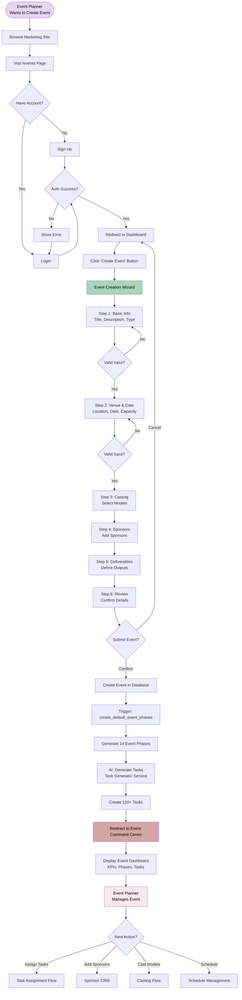
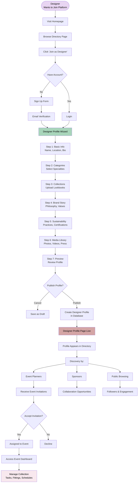
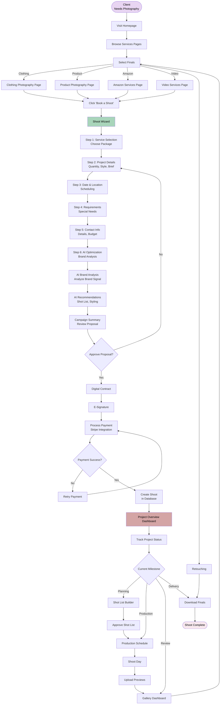
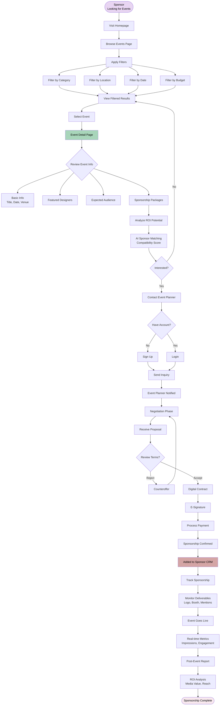
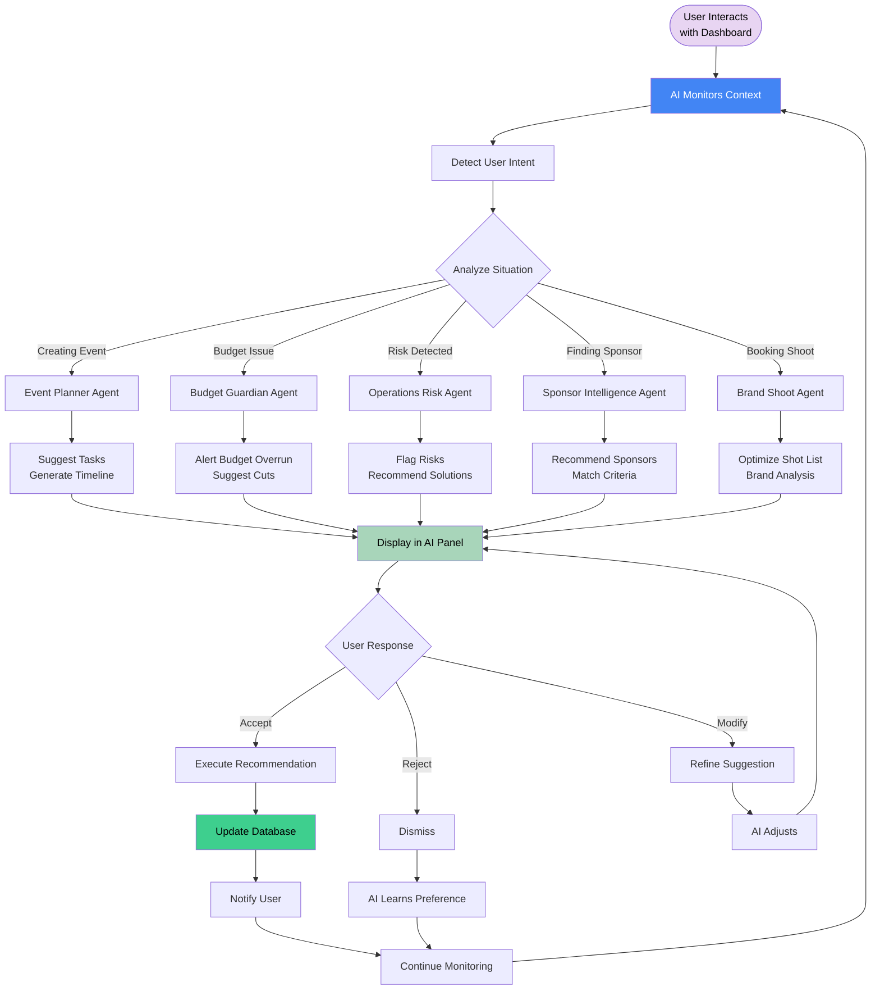
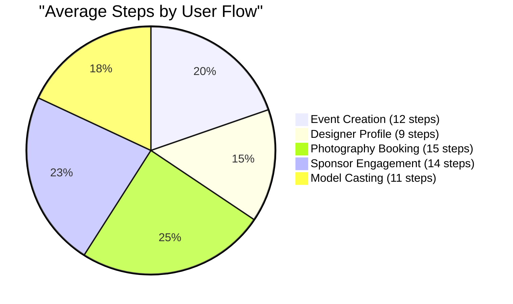

# User Flow Diagrams

## 1. Event Planner: Create Event Flow



## 2. Designer: Create Profile Flow



## 3. Client: Book Photography Shoot Flow



## 4. Sponsor: Find & Sponsor Event Flow



## 5. Model: Get Cast in Event Flow

```mermaid
flowchart TD
    START([Model<br/>Looking for Work]) --> PROFILE{Have Profile?}
    PROFILE -->|No| CREATE[Create Model Profile]
    PROFILE -->|Yes| LOGIN[Login]
    
    CREATE --> UPLOAD[Upload Portfolio]
    UPLOAD --> MEASUREMENTS[Enter Measurements]
    MEASUREMENTS --> AGENCY[Link Agency (Optional)]
    AGENCY --> PROFILE_LIVE[Profile Live]
    
    LOGIN --> DASHBOARD[Model Dashboard]
    PROFILE_LIVE --> DASHBOARD
    
    DASHBOARD --> OPPORTUNITIES[View Casting Calls]
    OPPORTUNITIES --> FILTER[Filter Opportunities]
    FILTER --> RESULTS[View Matching Events]
    
    RESULTS --> APPLY[Apply to Casting Call]
    APPLY --> AVAILABILITY[Set Availability]
    AVAILABILITY --> SUBMIT[Submit Application]
    
    SUBMIT --> CASTING_DIR[Casting Director Reviews]
    CASTING_DIR --> DECISION{Selected?}
    DECISION -->|No| DECLINE[Not Selected]
    DECISION -->|Yes| CONFIRM[Casting Confirmed]
    
    CONFIRM --> EVENT_ASSIGN[Assigned to Event]
    EVENT_ASSIGN --> NOTIFICATIONS[Receive Notifications]
    
    NOTIFICATIONS --> FITTING[Fitting Schedule]
    FITTING --> ATTEND[Attend Fitting]
    ATTEND --> REHEARSAL[Rehearsal Schedule]
    REHEARSAL --> CALL_TIME[Receive Call Time]
    
    CALL_TIME --> SHOW_DAY[Show Day]
    SHOW_DAY --> WALK[Walk Runway]
    WALK --> COMPLETE[Event Complete]
    
    COMPLETE --> PAYMENT_MODEL[Receive Payment]
    PAYMENT_MODEL --> PORTFOLIO[Add to Portfolio]
    
    style START fill:#E8D5F2,color:#000
    style DASHBOARD fill:#A8D5BA,color:#000
    style EVENT_ASSIGN fill:#D4A5A5,color:#000
    style COMPLETE fill:#F8E8EE,color:#000
```

## 6. AI Assistant: Proactive Workflow



## User Journey Statistics


