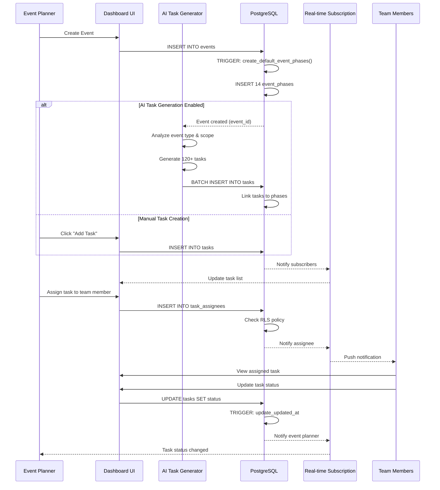
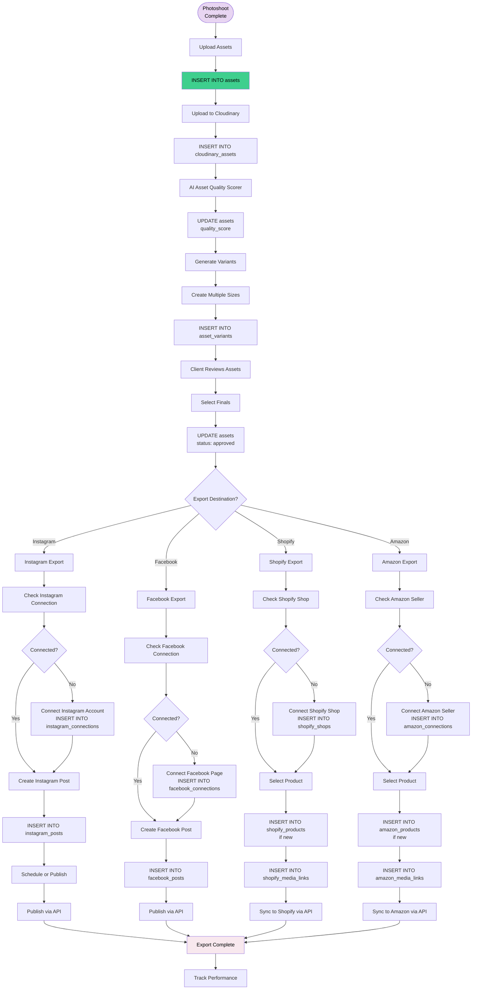
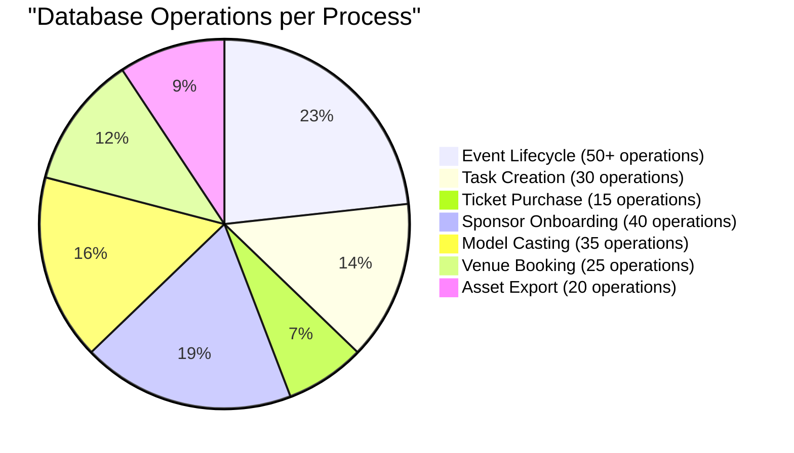

# Event & Process Flow Diagrams

## 1. Event Lifecycle (14 Phases)

```mermaid
flowchart LR
    subgraph "Pre-Production"
        P1[1. Concept &<br/>Planning]
        P2[2. Budget &<br/>Resource Allocation]
        P3[3. Venue<br/>Selection]
    end
    
    subgraph "Team & Partnerships"
        P4[4. Team<br/>Assembly]
        P5[5. Designer &<br/>Model Casting]
        P6[6. Sponsor<br/>Acquisition]
    end
    
    subgraph "Creative Development"
        P7[7. Creative<br/>Direction]
        P8[8. Collection<br/>Coordination]
        P9[9. Rehearsals]
    end
    
    subgraph "Operations"
        P10[10. Logistics<br/>Setup]
        P11[11. Marketing &<br/>Media]
        P12[12. Final<br/>Preparation]
    end
    
    subgraph "Event Execution"
        P13[13. Event<br/>Day]
    end
    
    subgraph "Post-Event"
        P14[14. Wrap-up &<br/>Analysis]
    end
    
    P1 --> P2 --> P3
    P3 --> P4 --> P5 --> P6
    P6 --> P7 --> P8 --> P9
    P9 --> P10 --> P11 --> P12
    P12 --> P13
    P13 --> P14
    
    style "Pre-Production" fill:#E8D5F2,color:#000
    style "Team & Partnerships" fill:#A8D5BA,color:#000
    style "Creative Development" fill:#D4A5A5,color:#000
    style "Operations" fill:#F8E8EE,color:#000
    style "Event Execution" fill:#FFE5CC,color:#000
    style "Post-Event" fill:#E5F2FF,color:#000
```

## 2. Task Creation & Assignment Flow



## 3. Ticket Purchase & Registration Flow

```mermaid
flowchart TD
    START([Attendee<br/>Wants Ticket]) --> EVENT[View Event Page]
    EVENT --> CHECK_STATUS{Event Status}
    CHECK_STATUS -->|Draft| NOT_AVAILABLE[Not Available]
    CHECK_STATUS -->|Published| VIEW_TIERS[View Ticket Tiers]
    CHECK_STATUS -->|Sold Out| WAITLIST[Join Waitlist]
    
    VIEW_TIERS --> SELECT[Select Ticket Tier]
    SELECT --> CHECK_AVAIL{Check Availability}
    
    CHECK_AVAIL -->|Sold Out| WAITLIST
    CHECK_AVAIL -->|Available| REGISTER[Registration Form]
    
    REGISTER --> FILL[Fill Attendee Info<br/>Name, Email, Phone]
    FILL --> VALIDATE{Valid Info?}
    VALIDATE -->|No| FILL
    VALIDATE -->|Yes| CREATE_REG
    
    CREATE_REG[Create Registration] --> TRIGGER1[TRIGGER: check_ticket_availability]
    TRIGGER1 --> CHECK_QTY{Quantity Available?}
    CHECK_QTY -->|No| ERROR[Error: Sold Out]
    CHECK_QTY -->|Yes| TRIGGER2
    
    TRIGGER2[TRIGGER: generate_qr_code] --> QR[Generate QR Code]
    QR --> INSERT_REG[INSERT INTO registrations]
    
    INSERT_REG --> PAYMENT_REQ{Payment Required?}
    PAYMENT_REQ -->|Free| CONFIRM_FREE
    PAYMENT_REQ -->|Paid| PAYMENT
    
    PAYMENT[Process Payment<br/>Stripe] --> PAY_STATUS{Payment Status?}
    PAY_STATUS -->|Failed| ERROR_PAY[Payment Error]
    ERROR_PAY --> PAYMENT
    PAY_STATUS -->|Success| INSERT_PAYMENT
    
    INSERT_PAYMENT[INSERT INTO payments] --> UPDATE_SOLD
    UPDATE_SOLD[UPDATE ticket_tiers<br/>quantity_sold++] --> CONFIRM_PAID
    
    CONFIRM_FREE[Status: Confirmed] --> SEND_EMAIL
    CONFIRM_PAID[Status: Confirmed] --> SEND_EMAIL
    
    SEND_EMAIL[Send Confirmation Email<br/>with QR Code] --> END([Registration Complete])
    
    END --> EVENT_DAY{Event Day}
    EVENT_DAY --> SCAN[Scan QR Code]
    SCAN --> CHECKIN[Check-in]
    CHECKIN --> UPDATE_REG[UPDATE registrations<br/>checked_in_at = NOW()]
    
    style START fill:#E8D5F2,color:#000
    style INSERT_REG fill:#3ECF8E,color:#000
    style END fill:#F8E8EE,color:#000
```

## 4. Sponsor Onboarding Process

```mermaid
flowchart TD
    START([Sponsor Interest]) --> PROSPECT[Add to Sponsor CRM<br/>Status: Prospect]
    
    PROSPECT --> CONTACT[Event Planner Contacts]
    CONTACT --> UPDATE1[UPDATE Status: Contacted]
    
    UPDATE1 --> PROPOSAL[Send Proposal]
    PROPOSAL --> UPDATE2[UPDATE Status: Proposal Sent]
    
    UPDATE2 --> NEGOTIATE{Negotiation}
    NEGOTIATE -->|Counter Offer| REVISE[Revise Proposal]
    REVISE --> PROPOSAL
    
    NEGOTIATE -->|Reject| LOST[Status: Lost]
    NEGOTIATE -->|Accept| CONFIRM[Status: Confirmed]
    
    CONFIRM --> CONTRACT[Create Contract]
    CONTRACT --> INSERT_CONTRACT[INSERT INTO contracts]
    
    INSERT_CONTRACT --> SIGN[E-Signature Process]
    SIGN --> UPDATE_CONTRACT[UPDATE contracts<br/>signed_at = NOW()]
    
    UPDATE_CONTRACT --> INSERT_SPONSOR[INSERT INTO event_sponsors]
    INSERT_SPONSOR --> ASSIGN_TIER[Assign Sponsor Tier<br/>Platinum/Gold/Silver]
    
    ASSIGN_TIER --> DELIVERABLES[Define Deliverables]
    DELIVERABLES --> TASKS[Create Sponsor Tasks]
    TASKS --> INSERT_TASKS[INSERT INTO tasks<br/>type: sponsorship]
    
    INSERT_TASKS --> TRACK[Track Deliverables]
    TRACK --> CHECKLIST{Deliverable Status}
    
    CHECKLIST -->|Pending| REMIND[Send Reminder]
    REMIND --> TRACK
    
    CHECKLIST -->|Complete| ALL_DONE{All Complete?}
    ALL_DONE -->|No| TRACK
    ALL_DONE -->|Yes| EVENT_READY[Event Ready]
    
    EVENT_READY --> EVENT_LIVE[Event Executes]
    EVENT_LIVE --> METRICS[Collect Metrics<br/>Impressions, Reach]
    
    METRICS --> ROI[Calculate ROI]
    ROI --> REPORT[Generate Report]
    REPORT --> SEND_REPORT[Send to Sponsor]
    
    SEND_REPORT --> FOLLOWUP{Future Partnership?}
    FOLLOWUP -->|Yes| PROSPECT
    FOLLOWUP -->|No| ARCHIVE[Archive Sponsor]
    
    style START fill:#E8D5F2,color:#000
    style INSERT_SPONSOR fill:#3ECF8E,color:#000
    style REPORT fill:#F8E8EE,color:#000
```

## 5. Model Casting & Walk Order Flow

```mermaid
flowchart TD
    START([Casting<br/>Requirements]) --> CREATE_CALL[Create Casting Call]
    CREATE_CALL --> INSERT_CALL[INSERT INTO casting_calls]
    
    INSERT_CALL --> PUBLISH[Publish to Models]
    PUBLISH --> APPLICATIONS[Receive Applications]
    
    APPLICATIONS --> REVIEW[Casting Director<br/>Reviews Applications]
    REVIEW --> FILTER[Filter by Criteria<br/>Height, Measurements, Style]
    
    FILTER --> SHORTLIST[Create Shortlist]
    SHORTLIST --> INVITE[Invite to Fitting]
    
    INVITE --> SCHEDULE[Schedule Fittings]
    SCHEDULE --> INSERT_AVAIL[INSERT INTO model_availability]
    
    INSERT_AVAIL --> FITTING[Conduct Fittings]
    FITTING --> DECISION{Select Model?}
    
    DECISION -->|No| REJECT[Reject Application]
    DECISION -->|Yes| CONFIRM[Confirm Model]
    
    CONFIRM --> INSERT_MODEL[INSERT INTO event_models]
    INSERT_MODEL --> ASSIGN_DESIGNER[Assign to Designer]
    
    ASSIGN_DESIGNER --> WALK_ORDER[Set Walk Order]
    WALK_ORDER --> UPDATE_ORDER[UPDATE event_models<br/>walk_order, is_opening, is_closing]
    
    UPDATE_ORDER --> OUTFITS[Assign Outfit Changes]
    OUTFITS --> REHEARSAL[Schedule Rehearsals]
    REHEARSAL --> INSERT_REHEARSAL[INSERT INTO event_rehearsals]
    
    INSERT_REHEARSAL --> PRACTICE[Rehearsal Sessions]
    PRACTICE --> ADJUST{Adjustments Needed?}
    ADJUST -->|Yes| WALK_ORDER
    ADJUST -->|No| FINALIZE
    
    FINALIZE[Finalize Walk Order] --> CALL_TIME[Generate Call Times]
    CALL_TIME --> INSERT_CALL_TIME[INSERT INTO call_times]
    
    INSERT_CALL_TIME --> NOTIFY[Notify Models]
    NOTIFY --> EVENT_DAY[Event Day]
    
    EVENT_DAY --> CHECKIN[Model Check-in]
    CHECKIN --> PREP[Prep: Hair, Makeup]
    PREP --> BACKSTAGE[Backstage Management]
    
    BACKSTAGE --> CUE[Cue System]
    CUE --> WALK[Model Walks Runway]
    WALK --> NEXT{More Outfits?}
    
    NEXT -->|Yes| CHANGE[Quick Change]
    CHANGE --> CUE
    
    NEXT -->|No| COMPLETE[Runway Complete]
    COMPLETE --> PAYMENT[Process Model Payment]
    PAYMENT --> INSERT_PAYMENT[INSERT INTO payments]
    
    style START fill:#E8D5F2,color:#000
    style INSERT_MODEL fill:#3ECF8E,color:#000
    style COMPLETE fill:#F8E8EE,color:#000
```



## 6. Venue Booking & Production Setup Flow

```mermaid
flowchart TD
    START([Venue<br/>Requirements]) --> SEARCH[Search Venues]
    SEARCH --> FILTER[Filter by:<br/>Capacity, Type, Location]
    
    FILTER --> RESULTS[View Available Venues]
    RESULTS --> SELECT[Select Venue]
    
    SELECT --> CHECK_AVAIL[Check Availability]
    CHECK_AVAIL --> QUERY[QUERY venue_availability]
    
    QUERY --> STATUS{Available?}
    STATUS -->|No| RESULTS
    STATUS -->|Yes| REQUEST[Request Booking]
    
    REQUEST --> INSERT_AVAIL[INSERT INTO venue_availability<br/>status: requested]
    
    INSERT_AVAIL --> VENUE_OWNER[Venue Owner Reviews]
    VENUE_OWNER --> APPROVE{Approve?}
    
    APPROVE -->|No| DECLINE[Decline Booking]
    DECLINE --> RESULTS
    
    APPROVE -->|Yes| UPDATE_AVAIL[UPDATE venue_availability<br/>status: booked]
    
    UPDATE_AVAIL --> LINK_EVENT[UPDATE events<br/>SET venue_id]
    
    LINK_EVENT --> PRODUCTION[Plan Production Setup]
    PRODUCTION --> FLOORPLAN[Upload Floor Plan]
    FLOORPLAN --> SEATING[Arrange Seating<br/>VIP, General, Press]
    
    SEATING --> RUNWAY[Design Runway Layout]
    RUNWAY --> BACKSTAGE[Plan Backstage Area<br/>Dressing, Hair, Makeup]
    
    BACKSTAGE --> TECH[Technical Requirements]
    TECH --> LIGHTING[Lighting Design]
    TECH --> SOUND[Sound System]
    TECH --> AV[AV Equipment]
    
    LIGHTING --> VENDORS[Coordinate Vendors]
    SOUND --> VENDORS
    AV --> VENDORS
    
    VENDORS --> SCHEDULE_SETUP[Schedule Setup<br/>Load-in Times]
    SCHEDULE_SETUP --> INSERT_SCHEDULE[INSERT INTO event_schedules<br/>Setup, Soundcheck, Rehearsal]
    
    INSERT_SCHEDULE --> TIMELINE[Create Production Timeline]
    TIMELINE --> CHECKLIST[Setup Checklist]
    
    CHECKLIST --> TASKS[Generate Tasks]
    TASKS --> INSERT_TASKS[INSERT INTO tasks<br/>venue-related tasks]
    
    INSERT_TASKS --> ASSIGN[Assign to Production Team]
    ASSIGN --> TRACK[Track Setup Progress]
    
    TRACK --> READY{Venue Ready?}
    READY -->|No| TRACK
    READY -->|Yes| REHEARSAL[Final Rehearsal]
    
    REHEARSAL --> EVENT[Event Day]
    
    style START fill:#E8D5F2,color:#000
    style UPDATE_AVAIL fill:#3ECF8E,color:#000
    style EVENT fill:#F8E8EE,color:#000
```



## 7. Asset Management & Social Export Flow



## Process Complexity Metrics


