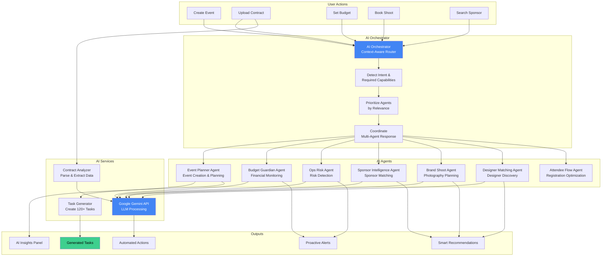
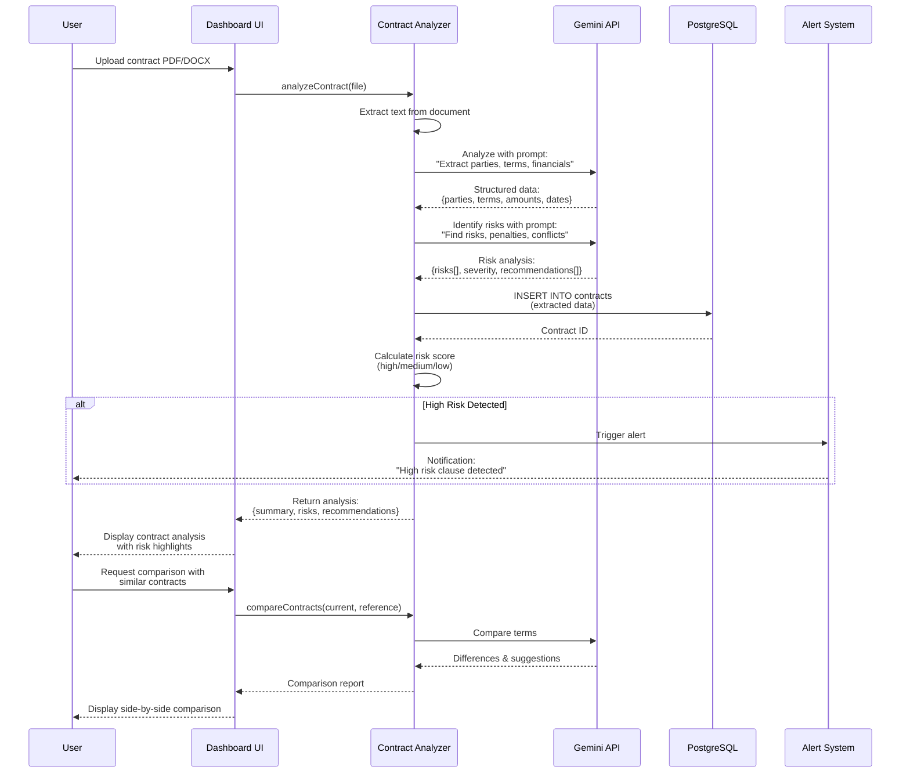
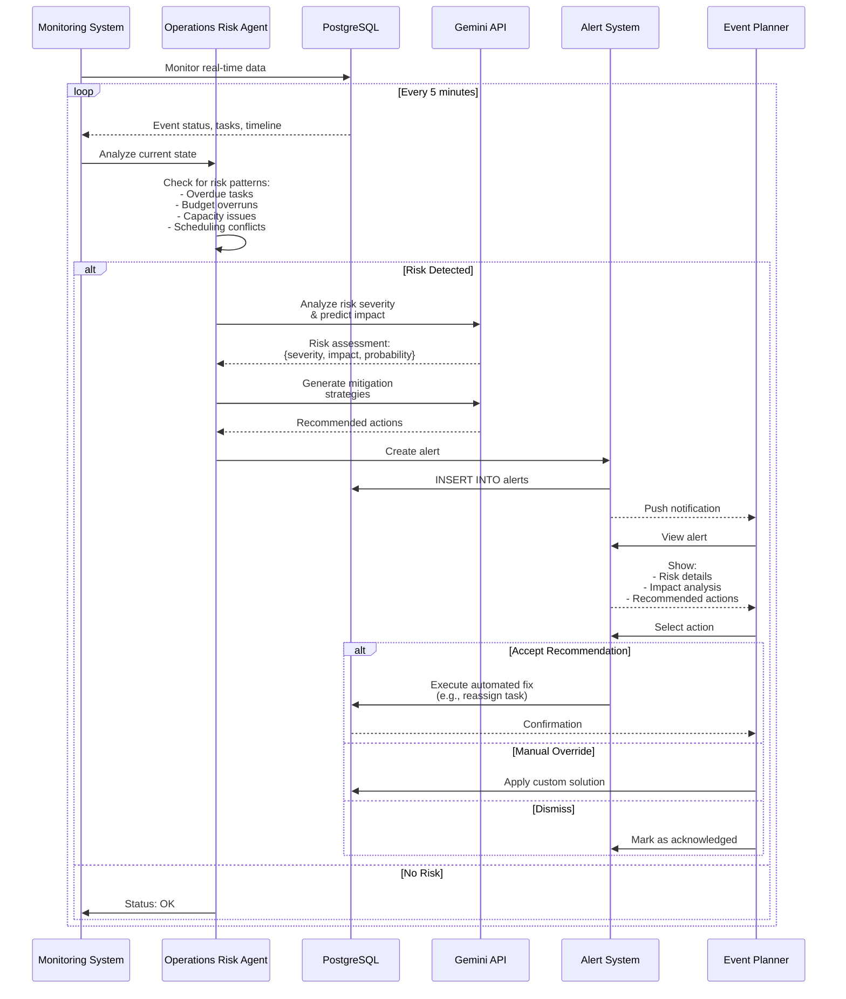
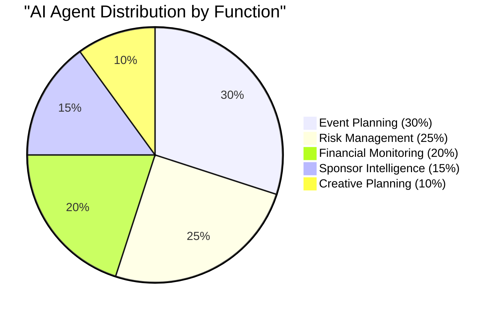
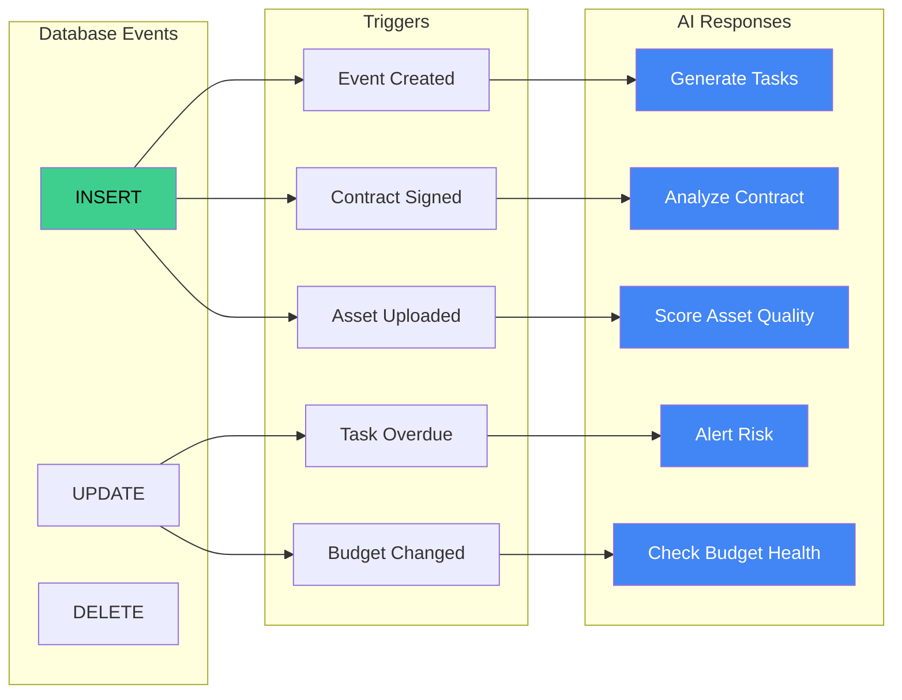

# AI & Automation Flow Diagrams

## 1. AI Orchestrator & Multi-Agent System



## 2. Contract Analysis AI Workflow



## 3. AI Task Generation Workflow

```mermaid
flowchart TD
    START([Event Created]) --> TRIGGER[Database Trigger]
    TRIGGER --> TASKGEN[Task Generator Service]
    
    TASKGEN --> ANALYZE[Analyze Event Data]
    ANALYZE --> EVENT_TYPE{Event Type?}
    
    EVENT_TYPE -->|Runway Show| RUNWAY_TASKS[Runway Task Template]
    EVENT_TYPE -->|Gallery| GALLERY_TASKS[Gallery Task Template]
    EVENT_TYPE -->|Pop-up| POPUP_TASKS[Pop-up Task Template]
    EVENT_TYPE -->|Activation| ACTIVATION_TASKS[Activation Task Template]
    
    RUNWAY_TASKS --> BASE_TASKS[Generate Base Tasks<br/>120+ tasks]
    GALLERY_TASKS --> BASE_TASKS
    POPUP_TASKS --> BASE_TASKS
    ACTIVATION_TASKS --> BASE_TASKS
    
    BASE_TASKS --> PHASE_MAP[Map to 14 Event Phases]
    PHASE_MAP --> TIMELINE[Calculate Timeline<br/>Based on Event Date]
    
    TIMELINE --> ASSIGN_DATES[Assign Due Dates<br/>Working Backwards]
    ASSIGN_DATES --> DEPENDENCIES[Set Task Dependencies]
    
    DEPENDENCIES --> PRIORITY[Calculate Priority<br/>Critical Path Analysis]
    PRIORITY --> AI_ENHANCE[AI Enhancement via Gemini]
    
    AI_ENHANCE --> GEMINI[Gemini API Call:<br/>"Optimize task order"]
    GEMINI --> OPTIMIZED[Optimized Task List]
    
    OPTIMIZED --> BATCH_INSERT[Batch INSERT INTO tasks]
    BATCH_INSERT --> LINK_PHASES[Link to event_phases]
    
    LINK_PHASES --> AUTO_ASSIGN{Auto-assign?}
    AUTO_ASSIGN -->|Yes| ASSIGN[Smart Task Assignment<br/>Based on Roles]
    AUTO_ASSIGN -->|No| MANUAL[Manual Assignment]
    
    ASSIGN --> INSERT_ASSIGNEES[INSERT INTO task_assignees]
    MANUAL --> INSERT_ASSIGNEES
    
    INSERT_ASSIGNEES --> NOTIFY[Notify Team Members]
    NOTIFY --> MONITOR[AI Monitoring Active]
    
    MONITOR --> CHECK{Monitor Task Progress}
    CHECK -->|Overdue| RISK_ALERT[Operations Risk Agent<br/>Flags Risk]
    CHECK -->|On Track| CONTINUE[Continue Monitoring]
    
    RISK_ALERT --> RECOMMEND[Recommend Mitigation<br/>Reassign, Extend, Prioritize]
    
    style START fill:#E8D5F2,color:#000
    style GEMINI fill:#4285F4,color:#fff
    style BATCH_INSERT fill:#3ECF8E,color:#000
```

## 4. Budget Guardian Agent Workflow

```mermaid
flowchart TD
    START([Budget Set]) --> MONITOR[Budget Guardian Agent<br/>Continuous Monitoring]
    
    MONITOR --> WATCH[Watch Database Events]
    WATCH --> DETECT{Detect Change?}
    
    DETECT -->|New Expense| EXPENSE[New Budget Item Added]
    DETECT -->|Payment| PAYMENT[Payment Processed]
    DETECT -->|Contract| CONTRACT[Contract Signed]
    DETECT -->|No Change| WATCH
    
    EXPENSE --> UPDATE[Update Budget Totals]
    PAYMENT --> UPDATE
    CONTRACT --> UPDATE
    
    UPDATE --> CALCULATE[Calculate:<br/>- Total Spent<br/>- Remaining Budget<br/>- Burn Rate<br/>- Projected Overrun]
    
    CALCULATE --> CHECK{Budget Health?}
    
    CHECK -->|Under Budget| SAFE[Status: Safe]
    CHECK -->|Near Limit| WARNING[Status: Warning<br/>85-95% spent]
    CHECK -->|Over Budget| CRITICAL[Status: Critical<br/>95%+ spent]
    
    SAFE --> LOG[Log Status]
    
    WARNING --> ALERT1[Generate Alert]
    ALERT1 --> AI_ANALYZE1[AI Analysis:<br/>"Identify cost drivers"]
    AI_ANALYZE1 --> RECOMMEND1[Recommend:<br/>- Defer non-critical<br/>- Negotiate discounts<br/>- Find alternatives]
    RECOMMEND1 --> NOTIFY1[Notify Event Planner]
    
    CRITICAL --> ALERT2[Generate Critical Alert]
    ALERT2 --> AI_ANALYZE2[AI Analysis:<br/>"Find immediate cuts"]
    AI_ANALYZE2 --> RECOMMEND2[Recommend:<br/>- Cancel low-ROI items<br/>- Reduce scope<br/>- Seek additional funding]
    RECOMMEND2 --> NOTIFY2[Urgent Notification]
    
    NOTIFY1 --> DASHBOARD[Update Budget Dashboard]
    NOTIFY2 --> DASHBOARD
    LOG --> DASHBOARD
    
    DASHBOARD --> ACTION{User Action?}
    ACTION -->|Accept| IMPLEMENT[Implement Suggestion]
    ACTION -->|Modify| ADJUST[Adjust Budget]
    ACTION -->|Dismiss| IGNORE[Continue Monitoring]
    
    IMPLEMENT --> UPDATE_DB[Update Database]
    ADJUST --> UPDATE_DB
    UPDATE_DB --> MONITOR
    IGNORE --> MONITOR
    
    style MONITOR fill:#4285F4,color:#fff
    style CRITICAL fill:#FF6B6B,color:#fff
    style WARNING fill:#FFD93D,color:#000
```

## 5. Sponsor Intelligence Agent Workflow

```mermaid
flowchart TD
    START([User Searches<br/>for Sponsors]) --> AGENT[Sponsor Intelligence Agent]
    
    AGENT --> GATHER[Gather Context]
    GATHER --> EVENT_DATA[Event Data:<br/>Type, Audience, Budget]
    GATHER --> BRAND_DATA[Brand Data:<br/>Values, Category, Style]
    
    EVENT_DATA --> AI_MATCH[AI Matching Algorithm]
    BRAND_DATA --> AI_MATCH
    
    AI_MATCH --> QUERY_DB[Query sponsor_organizations<br/>+ historical data]
    QUERY_DB --> CANDIDATES[Candidate Sponsors]
    
    CANDIDATES --> GEMINI[Gemini API Call:<br/>"Score compatibility"]
    
    GEMINI --> ANALYZE[Analyze Each Sponsor]
    ANALYZE --> SCORE[Calculate Scores:<br/>- Brand Alignment<br/>- Budget Fit<br/>- Historical ROI<br/>- Industry Relevance]
    
    SCORE --> RANK[Rank by Compatibility]
    RANK --> TOP_MATCHES[Top 10 Matches]
    
    TOP_MATCHES --> INSIGHTS[Generate Insights]
    INSIGHTS --> WHY[Explain Why:<br/>"Great fit because..."]
    INSIGHTS --> ROI_PRED[Predict ROI Range]
    INSIGHTS --> APPROACH[Suggest Approach:<br/>"How to pitch"]
    
    WHY --> DISPLAY
    ROI_PRED --> DISPLAY
    APPROACH --> DISPLAY
    
    DISPLAY[Display Recommendations] --> USER_ACTION{User Action?}
    
    USER_ACTION -->|View Details| DETAIL[Show Sponsor Profile]
    USER_ACTION -->|Contact| OUTREACH[Initiate Outreach]
    USER_ACTION -->|Refine| FILTER[Adjust Filters]
    
    DETAIL --> HISTORY[Show Past Events<br/>ROI Data<br/>Contact Info]
    
    OUTREACH --> EMAIL[Generate Email Template<br/>AI-Personalized]
    EMAIL --> SEND[Send via CRM]
    SEND --> TRACK[Track in Pipeline]
    
    FILTER --> AI_MATCH
    
    TRACK --> MONITOR[Monitor Response]
    MONITOR --> FOLLOWUP{Response?}
    FOLLOWUP -->|Yes| CRM[Update CRM]
    FOLLOWUP -->|No| REMINDER[Schedule Follow-up]
    
    style AGENT fill:#4285F4,color:#fff
    style GEMINI fill:#4285F4,color:#fff
    style DISPLAY fill:#A8D5BA,color:#000
```

## 6. Brand Shoot Agent Workflow

```mermaid
flowchart TD
    START([Client Starts<br/>Shoot Wizard]) --> AGENT[Brand Shoot Agent<br/>Activates]
    
    AGENT --> CAPTURE[Capture Brand Signals]
    CAPTURE --> INPUT1[Website URL]
    CAPTURE --> INPUT2[Social Media]
    CAPTURE --> INPUT3[Brand Description]
    CAPTURE --> INPUT4[Reference Images]
    
    INPUT1 --> ANALYZE[AI Brand Analysis]
    INPUT2 --> ANALYZE
    INPUT3 --> ANALYZE
    INPUT4 --> ANALYZE
    
    ANALYZE --> GEMINI[Gemini API:<br/>"Analyze brand identity"]
    
    GEMINI --> EXTRACT[Extract Attributes]
    EXTRACT --> STYLE[Visual Style:<br/>Minimalist, Bold, Vintage]
    EXTRACT --> COLOR[Color Palette:<br/>Primary, Secondary]
    EXTRACT --> TONE[Brand Tone:<br/>Luxury, Casual, Edgy]
    EXTRACT --> AUDIENCE[Target Audience:<br/>Demographics, Psychographics]
    
    STYLE --> SYNTHESIS[Synthesize Brand DNA]
    COLOR --> SYNTHESIS
    TONE --> SYNTHESIS
    AUDIENCE --> SYNTHESIS
    
    SYNTHESIS --> RECOMMENDATIONS[Generate Recommendations]
    
    RECOMMENDATIONS --> SHOTLIST[Suggested Shot List<br/>30-50 shots]
    RECOMMENDATIONS --> STYLING[Styling Suggestions<br/>Props, Backgrounds]
    RECOMMENDATIONS --> MODELS_REC[Model Recommendations<br/>Type, Look]
    RECOMMENDATIONS --> LOCATIONS[Location Ideas<br/>Studio vs. On-location]
    
    SHOTLIST --> OPTIMIZE[Optimize for Efficiency]
    OPTIMIZE --> GROUP[Group by:<br/>Setup, Lighting, Model]
    GROUP --> TIMELINE_EST[Estimate Timeline<br/>Shoot Duration]
    
    TIMELINE_EST --> BUDGET_EST[Estimate Budget<br/>Itemized Costs]
    
    BUDGET_EST --> PRESENT[Present to Client]
    PRESENT --> REVIEW{Client Reviews}
    
    REVIEW -->|Request Changes| REFINE[Refine Recommendations]
    REFINE --> GEMINI
    
    REVIEW -->|Approve| CONFIRM[Confirm Shoot Plan]
    CONFIRM --> CREATE_SHOOT[Create Shoot in Database]
    CREATE_SHOOT --> TASKS_AUTO[Auto-generate Tasks]
    
    TASKS_AUTO --> PRE_PROD[Pre-production Tasks]
    TASKS_AUTO --> SHOOT_DAY[Shoot Day Tasks]
    TASKS_AUTO --> POST_PROD[Post-production Tasks]
    
    PRE_PROD --> ASSIGN[Assign to Team]
    SHOOT_DAY --> ASSIGN
    POST_PROD --> ASSIGN
    
    ASSIGN --> MONITOR[Monitor Progress]
    MONITOR --> ALERTS{Issues Detected?}
    ALERTS -->|Yes| RECOMMEND_FIX[Recommend Solutions]
    ALERTS -->|No| CONTINUE[Continue Monitoring]
    
    style AGENT fill:#4285F4,color:#fff
    style GEMINI fill:#4285F4,color:#fff
    style PRESENT fill:#A8D5BA,color:#000
```

## 7. Proactive Risk Detection System



## 8. AI Assistant Proactive Workflow

```mermaid
flowchart TD
    START([User Opens<br/>Dashboard]) --> CONTEXT[Assistant Shell<br/>Captures Context]
    
    CONTEXT --> DETECT[Detect Current Page]
    DETECT --> PAGE{Which Page?}
    
    PAGE -->|Command Center| KIT1[Events Kit]
    PAGE -->|Casting| KIT2[Logistics Kit]
    PAGE -->|Sponsors| KIT3[Marketing Kit]
    PAGE -->|Gallery| KIT4[Media Kit]
    PAGE -->|Services| KIT5[Services Kit]
    
    KIT1 --> SKILLS1[Activate Skills:<br/>- Event Management<br/>- Timeline Optimization]
    KIT2 --> SKILLS2[Activate Skills:<br/>- Logistics Planning<br/>- Resource Allocation]
    KIT3 --> SKILLS3[Activate Skills:<br/>- Sponsor Discovery<br/>- Campaign Planning]
    KIT4 --> SKILLS4[Activate Skills:<br/>- Media Organization<br/>- Asset Tagging]
    KIT5 --> SKILLS5[Activate Skills:<br/>- Service Recommendations<br/>- Pricing Optimization]
    
    SKILLS1 --> MONITOR[Monitor User Actions]
    SKILLS2 --> MONITOR
    SKILLS3 --> MONITOR
    SKILLS4 --> MONITOR
    SKILLS5 --> MONITOR
    
    MONITOR --> INTENT{Detect Intent?}
    
    INTENT -->|Creating| SUGGEST_CREATE[Suggest:<br/>"I can help create..."]
    INTENT -->|Searching| SUGGEST_SEARCH[Suggest:<br/>"Looking for...?"]
    INTENT -->|Organizing| SUGGEST_ORG[Suggest:<br/>"I can organize..."]
    INTENT -->|Stuck| SUGGEST_HELP[Suggest:<br/>"Need help with...?"]
    
    SUGGEST_CREATE --> PANEL[AI Panel Opens]
    SUGGEST_SEARCH --> PANEL
    SUGGEST_ORG --> PANEL
    SUGGEST_HELP --> PANEL
    
    PANEL --> OPTIONS[Present Options]
    OPTIONS --> USER_CHOICE{User Selects?}
    
    USER_CHOICE -->|Quick Action| AUTO[Execute Automation]
    USER_CHOICE -->|Deep Research| RESEARCH[Deep Research Tool]
    USER_CHOICE -->|Chat| CHAT[Open Chat Interface]
    
    AUTO --> DB[Update Database]
    DB --> CONFIRM[Show Confirmation]
    
    RESEARCH --> GEMINI_RESEARCH[Gemini Deep Dive]
    GEMINI_RESEARCH --> RESULTS[Present Findings]
    
    CHAT --> CONVERSATION[Chat Interface]
    CONVERSATION --> GEMINI_CHAT[Gemini Conversation]
    GEMINI_CHAT --> RESPONSE[AI Response]
    RESPONSE --> ACTION{Action Needed?}
    ACTION -->|Yes| DB
    ACTION -->|No| CONTINUE[Continue Chat]
    
    style CONTEXT fill:#4285F4,color:#fff
    style PANEL fill:#A8D5BA,color:#000
    style DB fill:#3ECF8E,color:#000
```

## AI Coverage Matrix



## Automation Triggers


