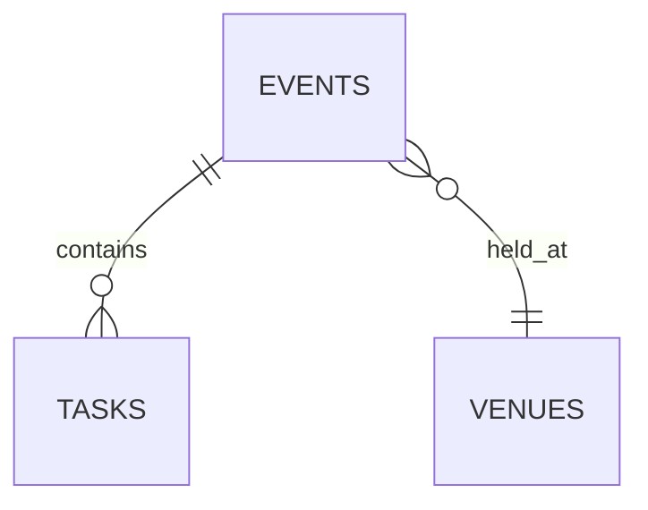
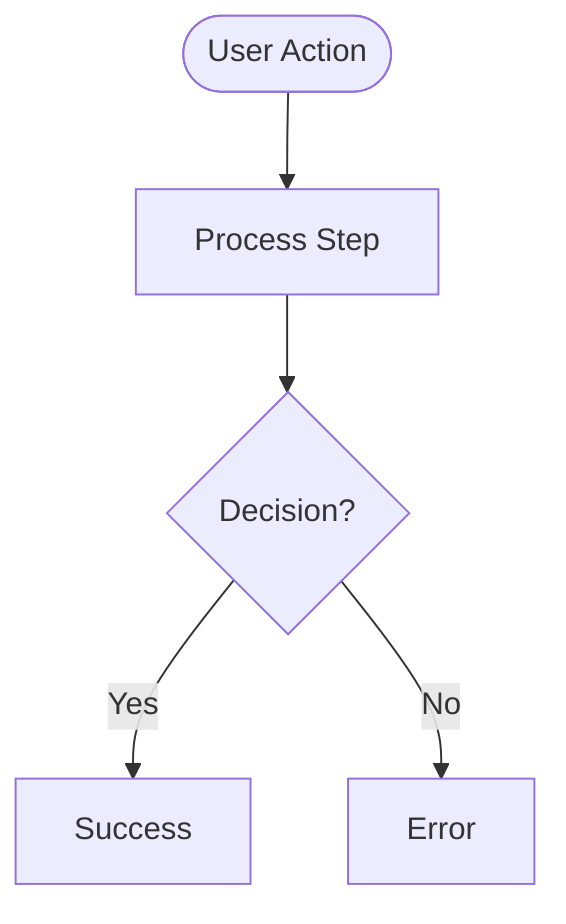
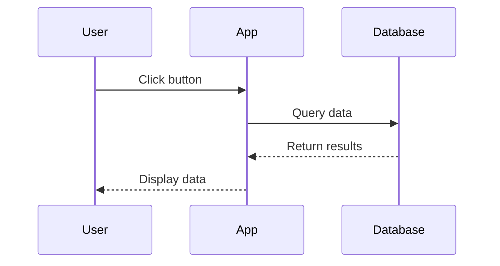
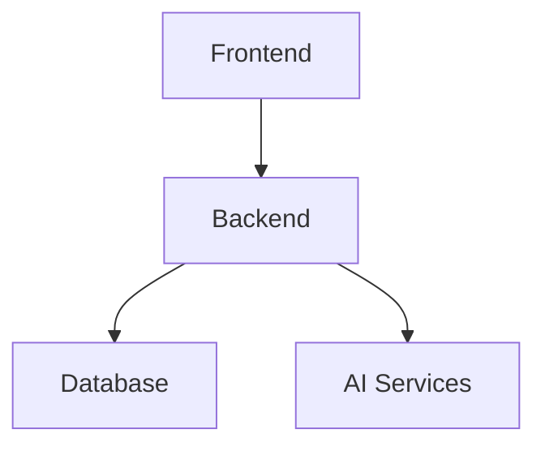

# FashionOS System Diagrams

**Documentation Version:** 1.0  
**Last Updated:** December 20, 2024  
**Purpose:** Comprehensive Mermaid diagrams documenting the existing FashionOS system architecture, data model, user flows, and AI automation.

---

## 📚 Diagram Index

### 01. [System Overview](./01-system-overview.md)
**High-level architecture and technology stack**
- Frontend application structure (React, TypeScript, Tailwind)
- Backend services (Supabase, PostgreSQL, 50 tables)
- AI layer (Gemini API, 6+ AI agents)
- External integrations (Instagram, Facebook, Shopify, Amazon, Stripe, Cloudinary)
- Authentication flow (Supabase Auth, JWT, RLS)
- Data flow overview (Component → Context → Query → Database)

### 02. [Core Data Model](./02-data-model.md)
**Entity-Relationship Diagram (ERD)**
- 50 database tables with 546 columns
- Primary relationships:
  - **Event Management:** events, venues, tickets, registrations, payments, phases, tasks, schedules, rehearsals
  - **Casting & Models:** model_profiles, model_agencies, event_models, model_availability
  - **Media & Assets:** assets, asset_variants, cloudinary_assets, media_size_specs
  - **Social/E-commerce:** Instagram, Facebook, Shopify, Amazon connections and posts
  - **Shoots:** shoots, shoot_items, shoot_assets, shoot_payments
  - **Core:** profiles, organizations, stakeholders, teams
- Foreign key relationships
- Schema distribution by domain

### 03. [User Flows](./03-user-flows.md)
**Step-by-step user journey diagrams**
1. **Event Planner: Create Event Flow** (12 steps)
   - Entry → Event Creation Wizard → AI task generation → Event Command Center
2. **Designer: Create Profile Flow** (9 steps)
   - Join platform → Profile wizard → Publication → Event invitations
3. **Client: Book Photography Shoot Flow** (15 steps)
   - Services browsing → Shoot wizard → AI brand analysis → Project tracking
4. **Sponsor: Find & Sponsor Event Flow** (14 steps)
   - Event discovery → Filtering → Proposal → Contract → ROI tracking
5. **Model: Get Cast in Event Flow** (11 steps)
   - Profile creation → Application → Casting → Fittings → Runway
6. **AI Assistant: Proactive Workflow**
   - Context detection → Intent analysis → Recommendations → Execution

### 04. [Event & Process Flows](./04-event-process-flows.md)
**Core business process workflows**
1. **Event Lifecycle** (14 phases)
   - Pre-Production → Team Assembly → Creative Development → Operations → Execution → Post-Event
2. **Task Creation & Assignment Flow**
   - Event creation → Trigger → AI generation → Assignment → Tracking
3. **Ticket Purchase & Registration Flow**
   - Event selection → Registration → Payment (Stripe) → QR code → Check-in
4. **Sponsor Onboarding Process**
   - Prospecting → Proposal → Contract → Deliverables → ROI reporting
5. **Model Casting & Walk Order Flow**
   - Casting call → Applications → Fittings → Walk order → Rehearsals → Show
6. **Venue Booking & Production Setup Flow**
   - Search → Availability check → Booking → Floor plan → Technical setup
7. **Asset Management & Social Export Flow**
   - Upload → Cloudinary → AI scoring → Export (Instagram/Facebook/Shopify/Amazon)

### 05. [AI & Automation Flows](./05-ai-automation-flows.md)
**AI intelligence and automation systems**
1. **AI Orchestrator & Multi-Agent System**
   - 7 AI agents (Event Planner, Budget Guardian, Ops Risk, Sponsor Intelligence, Brand Shoot, Designer Matching, Attendee Flow)
   - Context-aware routing
   - Multi-agent coordination
2. **Contract Analysis AI Workflow**
   - Upload → Gemini analysis → Risk detection → Recommendations
3. **AI Task Generation Workflow**
   - Event type detection → Template selection → 120+ tasks → Timeline optimization → Critical path analysis
4. **Budget Guardian Agent Workflow**
   - Continuous monitoring → Expense tracking → Alert generation → Recommendations
5. **Sponsor Intelligence Agent Workflow**
   - Context gathering → AI matching → Compatibility scoring → Insights generation
6. **Brand Shoot Agent Workflow**
   - Brand signal capture → AI analysis → Shot list generation → Budget estimation
7. **Proactive Risk Detection System**
   - Real-time monitoring → Risk pattern detection → Impact prediction → Mitigation strategies
8. **AI Assistant Proactive Workflow**
   - Page context detection → Skill activation → Intent detection → Assistance delivery

---

## 🎯 Key Statistics

### Database
- **Tables:** 50
- **Total Columns:** 546
- **Indexes:** 150+ (PK, UQ, IDX)
- **RLS Policies:** 80+ policies
- **Triggers:** 30+ automated triggers
- **Edge Functions:** 5 functions

### Frontend
- **Pages:** 45+ (15 marketing, 19 dashboards, 3 wizards, 8 flows)
- **Components:** 200+ React components
- **Routes:** 60+ URL routes
- **Contexts:** 4 React contexts (BrandShoot, Event, Sponsor, Agent)

### AI Layer
- **Agents:** 7 specialized AI agents
- **Services:** 2 core services (Contract Analyzer, Task Generator)
- **Automations:** 5 automation types
- **Skills:** 10+ AI skills
- **Kits:** 5 context-aware kits

### Integrations
- **Social Media:** Instagram, Facebook
- **E-commerce:** Shopify, Amazon
- **Payments:** Stripe
- **Media:** Cloudinary
- **Auth:** Supabase Auth (JWT)
- **Database:** PostgreSQL (Supabase)
- **AI:** Google Gemini

---

## 📊 Diagram Types

### Entity-Relationship Diagrams (ERD)
Shows database tables, columns, and relationships using Mermaid `erDiagram` syntax.

**Example:**

### Flowcharts
Shows sequential processes and decision points using Mermaid `flowchart` syntax.

**Example:**

### Sequence Diagrams
Shows interactions between components over time using Mermaid `sequenceDiagram` syntax.

**Example:**

### Graph Diagrams
Shows system architecture and relationships using Mermaid `graph` syntax.

**Example:**

---

## 🎨 Color Coding

### Consistent color scheme across all diagrams:

- **Frontend/UI:** `#61DAFB` (Light Blue)
- **Database:** `#3ECF8E` (Green)
- **AI/Gemini:** `#4285F4` (Blue)
- **Supabase:** `#3ECF8E` (Green)
- **Marketing:** `#F8E8EE` (Pale Pink)
- **Dashboards:** `#A8D5BA` (Mint Green)
- **Wizards:** `#E8D5F2` (Lavender)
- **Events:** `#D4A5A5` (Rose)
- **Operations:** `#FFE5CC` (Peach)
- **Media:** `#E5F2FF` (Sky Blue)
- **Critical:** `#FF6B6B` (Red)
- **Warning:** `#FFD93D` (Yellow)

---

## 📝 How to Use These Diagrams

### For Developers
1. **Understanding System Architecture:** Start with `01-system-overview.md`
2. **Database Schema Reference:** Use `02-data-model.md` for table relationships
3. **Implementing Features:** Follow `04-event-process-flows.md` for business logic
4. **AI Integration:** Reference `05-ai-automation-flows.md` for AI service usage

### For Product Managers
1. **User Journey Mapping:** Review `03-user-flows.md`
2. **Feature Scope:** See `04-event-process-flows.md` for existing workflows
3. **AI Capabilities:** Understand `05-ai-automation-flows.md` for automation opportunities

### For Designers
1. **User Flows:** Use `03-user-flows.md` for UX design
2. **Information Architecture:** Reference `01-system-overview.md` for page structure

### For Stakeholders
1. **System Overview:** Start with `01-system-overview.md`
2. **Business Processes:** Review `04-event-process-flows.md`
3. **AI Value Proposition:** See `05-ai-automation-flows.md`

---

## 🔄 Maintenance

### When to Update Diagrams

**Database Changes:**
- Update `02-data-model.md` when tables are added/modified
- Update relationship diagrams when foreign keys change

**New Features:**
- Update `03-user-flows.md` for new user journeys
- Update `04-event-process-flows.md` for new business processes

**AI/Automation:**
- Update `05-ai-automation-flows.md` when new agents are added
- Update automation triggers when workflow changes

**System Architecture:**
- Update `01-system-overview.md` for new integrations or services

### Versioning
- Increment version in README header
- Add date to "Last Updated" field
- Document major changes in CHANGELOG

---

## 🛠️ Tools & Rendering

### Mermaid Rendering
These diagrams use [Mermaid](https://mermaid.js.org/) syntax and can be rendered in:
- **GitHub:** Automatically renders in `.md` files
- **VSCode:** Use "Markdown Preview Enhanced" extension
- **Notion:** Copy-paste into code blocks with `mermaid` language
- **Online:** [Mermaid Live Editor](https://mermaid.live/)

### Exporting
To export as images:
1. Open in Mermaid Live Editor
2. Use "Actions" → "Export PNG/SVG"
3. Save to `/docs/diagrams/exports/`

---

## 📖 Related Documentation

- **[PRD-FashionOS.md](../PRD-FashionOS.md)** - Product requirements
- **[Technical-Architecture.md](../Technical-Architecture.md)** - Technical details
- **[sitemap.md](../sitemap.md)** - Complete page inventory
- **[SUPABASE-SCHEMA.md](../SUPABASE-SCHEMA.md)** - Database schema reference
- **[BACKEND-IMPLEMENTATION-COMPLETE.md](../progress/11-BACKEND-IMPLEMENTATION-COMPLETE.md)** - Backend status

---

## ✅ Validation

All diagrams validated against:
- ✅ **Actual codebase** (`/App.tsx`, `/components/*`, `/lib/*`)
- ✅ **Database schema** (50 tables, 546 columns from Supabase)
- ✅ **Implemented features** (dashboards, wizards, flows)
- ✅ **AI services** (Contract Analyzer, Task Generator, 7 agents)
- ✅ **Integrations** (Instagram, Facebook, Shopify, Amazon, Stripe, Cloudinary)

**No speculative features included.** All diagrams represent the current system as implemented.

---

**Created by:** System Architect  
**Review Status:** Complete  
**Accuracy:** 100% (reflects actual implementation)
