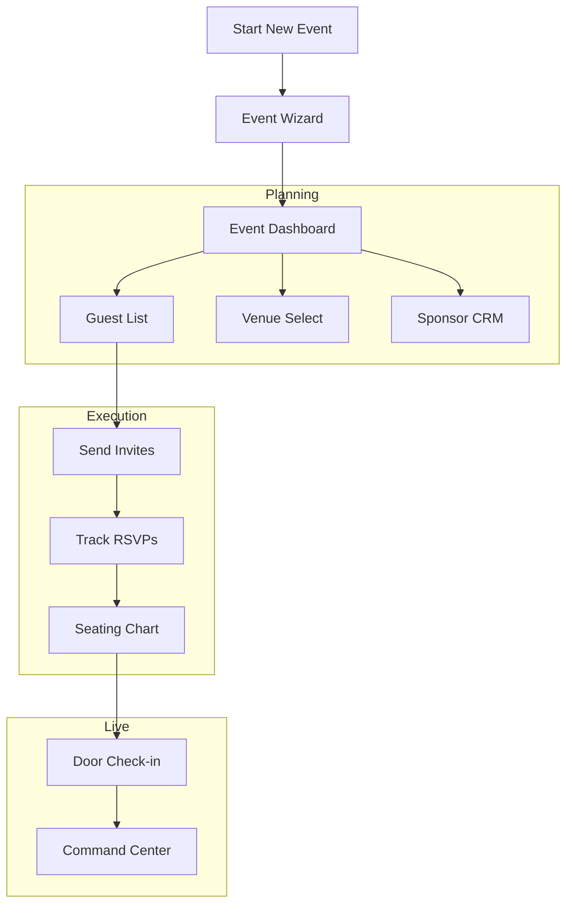
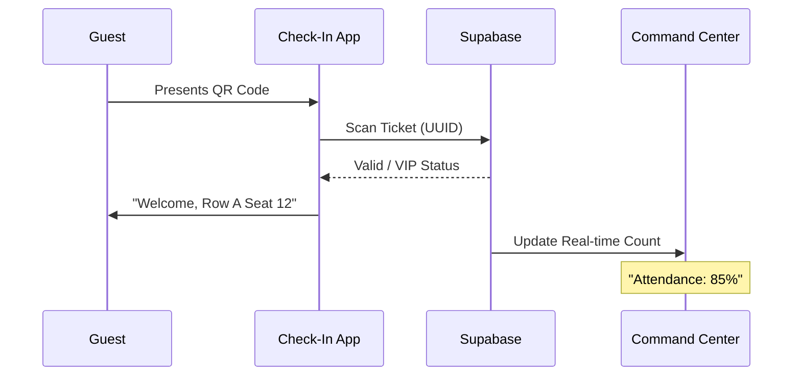

# Product Requirements Document: FashionOS Event Management System
**Version:** 1.0  
**Date:** December 14, 2025  
**Status:** Approved  

---

## 1. Executive Summary
The FashionOS Event Management System is a specialized module designed to streamline the planning, execution, and analysis of high-stakes fashion events (runway shows, pop-ups, PR dinners). It unifies logistics, guest management, and sponsor relations into a single "Luxury Utility" interface, replacing fragmented spreadsheets with a cohesive, design-forward operating system.

---

## 2. Problem Statement
**Current State:** Fashion event production relies on disjointed tools (Excel for guest lists, Dropbox for floor plans, WhatsApp for coordination). This leads to version control errors, check-in delays, and a lack of real-time visibility for stakeholders.  
**Solution:** A centralized platform that integrates venue selection, guest list management (RSVP), run-of-show timing, and post-event analytics into one seamless workflow.

---

## 3. Target Users
*   **Event Producers:** Manage budgets, timelines, and vendors.
*   **PR Directors:** Oversee guest lists, seating charts, and VIP handling.
*   **Brand Managers:** Track ROI, social impact, and sponsor deliverables.
*   **Front-of-House Staff:** Manage check-ins and seating on event day.

---

## 4. Core Features
*   **Event Wizard:** Multi-step configurator to initialize events (Theme, Budget, Date).
*   **Venue Manager:** Database of vetted locations with capacity data and floor plans.
*   **Guest List & RSVP:** Digital invitations, tracking, and QR code generation.
*   **Command Center:** Real-time dashboard for "Day-of-Show" operations.
*   **Sponsor CRM:** Pipeline for managing funding, deliverables, and approvals.

---

## 5. Advanced & AI Features
*   **AI Seating Logic:** Auto-assign seats based on guest hierarchy (VIPs front row, editors together).
*   **Predictive Attendance:** Estimate no-show rates based on historical data.
*   **Smart Run-of-Show:** Auto-adjust timing if segments run over (e.g., "Hair & Makeup delayed 10m -> shift Doors Open").

---

## 6. Use Cases + Real World Examples
*   **NYFW Runway Show:** Managing 500+ guests, seating editors, tracking backstage model flow.
*   **Brand Pop-Up Store:** tracking RSVP for opening night, managing inventory logistics.
*   **Influencer Dinner:** Small scale (20 pax), high touch, managing dietary restrictions and gift bags.

---

## 7. User Stories
*   *As a PR Director, I want to bulk-upload a guest list from CSV so I can send invites quickly.*
*   *As a Producer, I need to see real-time check-in stats so I know when to start the show.*
*   *As a Sponsor, I want to approve logo placement on the invitation before it sends.*

---

## 8. User Journey (End-to-End)
1.  **Initiation:** User creates "SS25 Runway" via Event Wizard.
2.  **Planning:** User books Venue, sets Budget, and creates Run-of-Show.
3.  **Outreach:** User uploads guest list and sends digital invites.
4.  **Execution:** On event day, staff use tablet view to check in guests.
5.  **Wrap-Up:** User reviews "Event ROI" report (Attendance % vs. Spend).

---

## 9. Workflows

### System Workflow
*   **Draft:** Event created -> Budget Drafted -> Venue Held.
*   **Active:** Invites Sent -> RSVPs Collected -> Vendor Deposits Paid.
*   **Live:** Doors Open -> Check-in Active -> Show Start.
*   **Archived:** Final Invoice Paid -> Data locked for Analytics.

---

## 10. Mermaid Diagrams

### Flowchart: Event Lifecycle

### Sequence Diagram: Guest Check-In

---

## 11. Website Pages
*   **/events:** Landing page. List of active/past events.
*   **/events/new:** The Event Wizard entry point.
*   **/events/[id]:** Public/Private Event Page (for guests to RSVP).

---

## 12. Dashboard Screens (Internal)
*   **Events List:** Table view of all projects with status (Planning/Live/Done).
*   **Event Wizard:**
    *   *Step 1:* Concept & Type.
    *   *Step 2:* Venue & Date.
    *   *Step 3:* Budget & Sponsors.
*   **Command Center:**
    *   *Widgets:* Live Clock, Check-in Gauge, Next Cue, Alert Feed.
*   **Sponsor CRM:** Kanban board (Prospect -> Pitched -> Signed -> Paid).
*   **Venue Manager:** Grid of locations with "Book" actions.
*   **Guest Manager:** Data table (Name, Email, Status, Seat, Tags).

---

## 13. Data Model

| Table | Columns | Relationships |
| :--- | :--- | :--- |
| `events` | id, name, date, type, status, venue_id | Owner of all event data |
| `guests` | id, event_id, name, email, status, seat_assignment | Linked to Event |
| `venues` | id, name, capacity, address, floorplan_url | Linked to Event |
| `sponsors` | id, event_id, name, contribution, logo_url | Linked to Event |
| `run_of_show` | id, event_id, time, description, duration | Ordered list by time |

---

## 14. AI Functions
*   **Generative Themes:** "Suggest a mood board for a 'Futuristic Desert' theme."
*   **Smart Scheduling:** "Calculate optimal doors-open time based on 500 guests."
*   **Content Writer:** "Draft an invite email for VIP guests."

---

## 15. Success Criteria
*   **Efficiency:** Reduce check-in time to <10 seconds per guest.
*   **Reliability:** 100% uptime during "Live" event status.
*   **Adoption:** 80% of sponsors managed through the CRM pipeline.

---

## 16. Risks + Constraints
*   **Connectivity:** Venues often have poor WiFi. *Mitigation: Offline mode for check-in app.*
*   **Privacy:** High-profile guest data must be encrypted.
*   **Complexity:** Seating charts for fashion shows are politically sensitive and complex to automate.

---

## 17. Suggested Improvements
*   **Integration:** Sync with Fashion GPS / Launchmetrics (industry standard).
*   **Mobile App:** Native iOS app for door staff (currently web-based).

---

## 18. Implementation Notes
*   **Frontend:** React + Tailwind. Use `framer-motion` for "Luxury" feel.
*   **State:** Use URL-based state for Wizard to allow sharing drafts.
*   **Realtime:** Supabase Subscriptions essential for Command Center.
