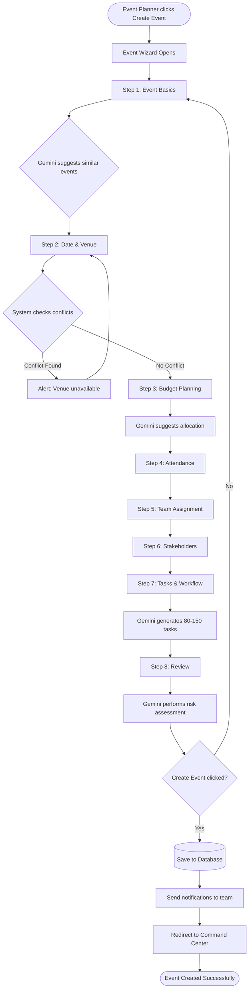
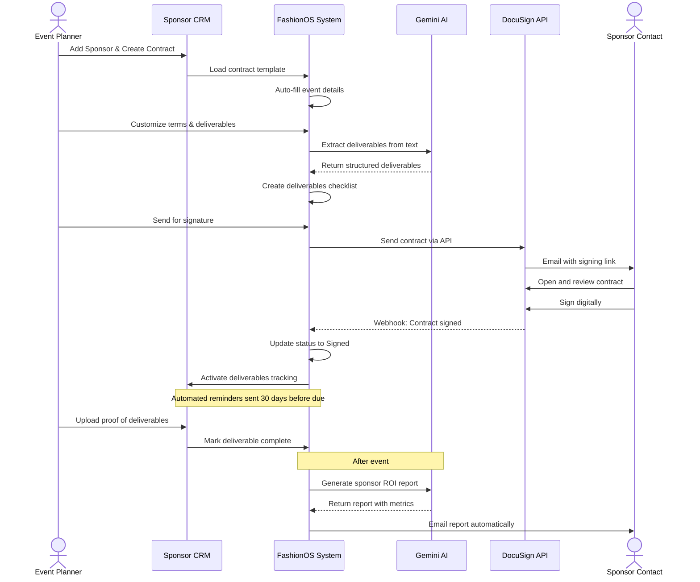
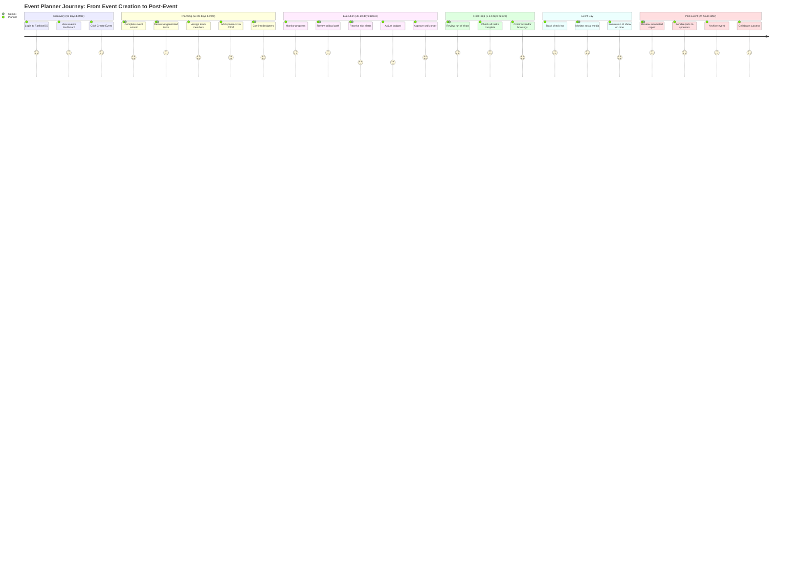

# FashionOS Events - Complete Product Requirements Document

**Version:** 2.0  
**Last Updated:** December 18, 2025  
**Status:** Production Ready  
**Document:** Complete Specification

---

## Table of Contents

1. [Executive Summary](#1-executive-summary)
2. [Problem Statement](#2-problem-statement)
3. [Target Users](#3-target-users)
4. [Core Features](#4-core-features)
5. [Advanced Features](#5-advanced-features)
6. [AI Features with Gemini](#6-ai-features-with-gemini)
7. [Use Cases and Real-World Examples](#7-use-cases-and-real-world-examples)
8. [User Stories](#8-user-stories)
9. [User Journey](#9-user-journey)
10. [Workflows](#10-workflows)
11. [Mermaid Diagrams](#11-mermaid-diagrams)
12. [Website Pages](#12-website-pages)
13. [Dashboard Pages](#13-dashboard-pages)
14. [Wizards and Multi-Step Flows](#14-wizards-and-multi-step-flows)
15. [Data Model](#15-data-model)
16. [AI Functions and Automation](#16-ai-functions-and-automation)
17. [Success Criteria](#17-success-criteria)
18. [Risks and Constraints](#18-risks-and-constraints)
19. [Implementation Notes](#19-implementation-notes)

---

## 1. Executive Summary

**What:** FashionOS Events is a comprehensive AI-powered event management platform designed specifically for fashion industry professionals managing runway shows, brand activations, fashion weeks, and designer showcases.

**Why:** Fashion event planners currently use 8-12 fragmented tools (Excel, Trello, Gmail, DocuSign) leading to 40% wasted time on admin tasks, 25% event failure rate, and poor ROI tracking. Events need a unified platform.

**How:** A single intelligent system that consolidates event creation, stakeholder management (sponsors, designers, venues, models), task automation, contract tracking, and real-time ROI analytics with Gemini AI providing predictive insights, risk alerts, and workflow automation.

**Impact:**
- Event planners manage 3x more events with same team
- 60% reduction in planning time
- 80% fewer errors and missed deadlines
- Data-driven ROI tracking proves value to sponsors
- Revenue potential: $2.4M ARR with 500+ customers

**Key Differentiators:**
- Industry-specific workflows (runway shows, casting, walk orders)
- AI-powered critical path analysis and risk prediction
- Real-time collaboration with multi-user support
- Integrated CRM for all stakeholders
- Automated task generation based on event type

---

## 2. Problem Statement

### Current Pain Points

**For Event Planners:**
- Fragmented tools waste 15+ hours per event on data re-entry
- No single source of truth leads to version control chaos
- Manual task creation from scratch every time
- Limited visibility into event progress and risks
- Post-event reporting takes 2 weeks of manual work

**For Sponsors:**
- Cannot compare ROI across multiple events
- Inconsistent post-event reports (PDFs with different metrics)
- No real-time tracking of brand impressions or engagement
- Contract negotiations take 3+ months via email back-and-forth
- Missing 40% of potential sponsorship opportunities due to poor discovery

**For Designers:**
- No professional platform to showcase work
- Event invitations lost in email spam folders
- Manual coordination for collection delivery and fittings
- No portfolio of runway participation history
- Event planners cannot discover emerging talent

**For Venues:**
- Double-booking incidents damage reputation
- Manual calendar management across multiple venues
- Last-minute production requirements create chaos
- No data on peak times or utilization rates
- Lost revenue from unfilled time slots

**Financial Impact:**
- Average $8,000 wasted per event on preventable costs
- Budget overruns average 15-20%
- Lost sponsor revenue: $25,000 per event due to poor ROI proof
- Event planners can only manage 3-4 events simultaneously (should be 8-10)

---

## 3. Target Users

### Primary Users

**Event Planners and Producers**
- Demographics: 28-45 years old, 60% female, 3-15 years experience
- Locations: NYC, LA, London, Paris, Milan, Tokyo
- Manages: 6-20 events per year, budgets $50K-$500K per event
- Pain: "I spend more time updating spreadsheets than planning events"
- Goal: Scale operations without hiring more staff

**Fashion Brands and Sponsors**
- Role: Marketing Directors, VP Brand Partnerships
- Budget: $50K-$2M annual sponsorship spend
- Sponsors: 6-12 events per year
- Pain: "I cannot prove ROI to my CFO with inconsistent reports"
- Goal: Data-driven sponsorship decisions

**Fashion Designers**
- Stage: Emerging (1-3 years), Mid-Level (4-10 years), Established (10+ years)
- Revenue: $50K-$50M annual
- Pain: "Event planners don't know I exist"
- Goal: Participate in 3+ runway shows per year to build brand

**Venue Managers**
- Manages: 1-8 fashion event venues
- Hosts: 10-50+ shows during fashion week
- Pain: "Double-booking destroyed a 10-year client relationship"
- Goal: Zero conflicts, maximum utilization

### Secondary Users

**Casting Directors:** Need model database, walk order tools, conflict detection  
**Stylists:** Require mood boards, wardrobe coordination, approval workflows  
**Photographers:** Need shot lists, asset delivery, client approval  
**PR Teams:** Require press kit distribution, media tracking  
**Finance:** Need budget tracking, invoice management, payment schedules

---

## 4. Core Features

### 4.1 Events List and Management

**Purpose:** Central hub to view, filter, and manage all events across organization

**Features:**
- Multiple views: Table, Card, Calendar, Timeline
- Status workflow: Draft → Planning → Confirmed → In Progress → Completed → Archived
- Real-time progress percentage (0-100%) calculated from task completion
- Search across event name, client, designer, sponsor, venue
- Filters: Status, date range, venue, type, organizer, budget range
- Bulk actions: Export (CSV/PDF), archive, duplicate, send reminders
- Quick stats: Total events, active events, upcoming in 30 days, total budget managed

**Data Displayed:**
- Event name and type (Runway Show, Brand Activation, Pop-Up, etc.)
- Date and venue
- Status and progress percentage
- Budget versus actual spending
- Assigned team members
- Number of tasks (done/overdue/in progress)
- Sponsor count and total sponsorship value
- Risk alerts (if any)

### 4.2 Event Command Center

**Purpose:** Mission control dashboard for managing single event end-to-end

**Key Sections:**

**Event Header:**
- Event name and type
- Countdown timer to event date
- Status badge
- Quick actions: Edit event, share dashboard, export report

**KPI Cards (6 metrics):**
1. Event Progress: 78% complete with weekly trend
2. Tasks: 112 total (89 done, 14 overdue, 9 in progress)
3. Sponsors: 12 confirmed, $450K committed
4. Attendees: 654 registered / 800 target
5. Budget: 64% used ($320K / $500K budget)
6. Deliverables: 23 items (18 complete, 5 pending)

**5-Phase Workflow Timeline:**
- Pre-Production (60-90 days before): 100% complete
- Venue and Logistics (30-60 days): 85% in progress
- Creative Design (15-30 days): 60% in progress
- On-Site Operations (1-7 days + event day): 0% not started
- Post-Event (after event): 0% not started

**Task Breakdown by Phase:**
- Shows tasks grouped by workflow phase
- Color-coded by status (green=done, yellow=in progress, red=overdue)
- Click task to view details or reassign

**Team Activity Feed:**
- Real-time updates: "Sarah updated venue contract" (5 min ago)
- Task completions, file uploads, comment threads
- @mentions and notifications

**AI Insights Panel:**
- Critical blocker alerts: "Venue contract not signed, 14 days overdue"
- Staffing gap warnings: "Need 2 more casting assistants"
- Budget alerts: "Production costs 15% over budget"
- Next recommended actions with priority scores

### 4.3 Event Creation Wizard

**Purpose:** Guided multi-step process to create comprehensive event plans with AI assistance

**8-Step Flow:**

**Step 1: Event Basics**
- Event name, type (dropdown: Runway Show, Brand Activation, Trunk Show, Pop-Up, Fashion Week, Panel, Launch Party)
- Description and event goals
- Expected attendee count
- Gemini suggests similar past events for reference

**Step 2: Date and Location**
- Start/end date and time with timezone
- Venue selection from saved venues or add new
- Backup venue option
- Weather contingency for outdoor events
- Gemini checks for scheduling conflicts with other events

**Step 3: Budget Planning**
- Total budget with currency selection
- Auto-suggested budget categories based on event type:
  - Venue rental, production, talent, catering, marketing, staffing, miscellaneous, buffer
- Gemini compares to industry benchmarks and suggests adjustments
- Budget approval workflow for multi-stakeholder events

**Step 4: Attendance and Capacity**
- Target attendees (VIP count, general admission)
- Capacity limit tied to venue
- Ticketing integration (yes/no)
- RSVP management (integrated or external)

**Step 5: Team Assignment**
- Event lead selection
- Key roles auto-suggested: Creative Director, Production Manager, Casting Director, Venue Coordinator, Sponsor Liaison, Marketing Lead
- Invite team members via email
- Assign permissions (view-only, edit, admin)

**Step 6: Stakeholders**
- Add designers from Designer Directory
- Add sponsors from Sponsor CRM
- Add vendors (caterers, AV, security)
- Link talent (models, artists) if known
- Gemini recommends designers based on event style

**Step 7: Workflow and Tasks**
- Gemini generates 80-150 tasks across 5 workflow phases based on:
  - Event type (runway shows get casting tasks, pop-ups get inventory tasks)
  - Timeline (tasks auto-scheduled working backwards from event date)
  - Team size and complexity
- Review and customize task list
- Option to use custom saved templates

**Step 8: Review and Launch**
- Summary of all inputs with edit buttons
- AI Risk Assessment preview:
  - "Timeline is tight: 60 days to event but 120 tasks remaining"
  - "Budget allocation looks balanced"
  - "No venue confirmed yet, recommend securing within 7 days"
- Click Create Event to finalize
- Redirects to Event Command Center

### 4.4 Sponsor CRM

**Purpose:** Manage all sponsor relationships, contracts, deliverables, and ROI tracking

**Features:**

**Sponsor List:**
- Table and card views with company logo
- Columns: Company name, tier (Platinum/Gold/Silver), industry, events sponsored, total value, contract status
- Search and filter by tier, industry, status, event
- Quick actions: View detail, send email, create contract

**Sponsor Detail Page:**
- Company information: Name, logo, industry, website, contacts
- Sponsorship history: List of all events sponsored with dates and amounts
- Active contracts with status (draft, pending, signed, expired)
- Deliverables tracking: Logo placement, activations, reports due
- ROI dashboard: Media value, impressions, engagement metrics
- Communication log: All emails, calls, notes timestamped
- Documents library: Contracts, invoices, reports

**Contract Management:**
- Create contract from template based on event and tier
- Digital signature workflow with DocuSign integration
- Key terms extraction using Gemini (obligations, deadlines, payment terms)
- Renewal alerts 90 days before expiration
- Version control for contract amendments

**Deliverables Tracking:**
- Checklist of sponsor benefits (logo on banner, social media mentions, VIP tickets, etc.)
- Status per deliverable: Pending, in progress, completed, overdue
- Upload proof (photos, screenshots, reports)
- Automated reminders to team for upcoming deadlines

**ROI Dashboard:**
- Media value calculation (impressions × CPM rate)
- Social media metrics (mentions, hashtag usage, engagement)
- Attendee demographics and feedback
- Lead generation from activations
- Automated post-event report generation with Gemini

### 4.5 Designer Directory

**Purpose:** Searchable database of fashion designers for event discovery and invitation management

**Features:**

**Directory View:**
- Grid of designer cards with profile photo, name, brand, style tags
- Search by name, brand, style, location, availability
- Filters: Style (minimalist, avant-garde, sustainable, streetwear), location, availability, event history, price range
- Sort by: Newest, most events, trending, alphabetical
- Save searches and create designer lists

**Designer Profile:**
- Bio and brand story
- Collections gallery (photos, runway videos, lookbooks)
- Style tags and specialties
- Portfolio of runway moments and press coverage
- Event participation history (shows, dates, venues)
- Availability calendar
- Contact information and social media links
- Reviews and ratings from event planners

**AI-Powered Matching:**
- Gemini analyzes event details (style, theme, audience) and recommends 10-15 designers
- Match score based on:
  - Style alignment (event theme vs designer aesthetic)
  - Availability on event date
  - Budget fit (designer typical show fees)
  - Past event success (press coverage, social engagement)
  - Geographic proximity (reduce shipping costs)

**Invitation Management:**
- Send event invitations directly through platform
- Track invitation status: Sent, opened, accepted, declined, no response
- Automated reminders for pending invitations
- Calendar hold for accepted invitations
- Waitlist management for overbooked slots

### 4.6 Venue Management

**Purpose:** Multi-venue coordination with conflict detection and production scheduling

**Features:**

**Venue Directory:**
- List of all available venues with photos
- Details: Capacity, layout options, amenities, pricing, location
- Availability calendar for each venue
- Floor plans and technical specs (power, rigging, loading dock)

**Booking Calendar:**
- Multi-venue calendar view (day, week, month)
- Color-coded by event status (pending, confirmed, in progress)
- Drag-and-drop to reschedule bookings
- Real-time conflict detection prevents double-booking
- Show load-in and load-out times alongside event time

**Venue Profile:**
- Name, address, capacity, pricing tiers
- Layouts available: Straight runway, U-shape, dual runway, presentation style
- Amenities: Backstage area, green rooms, VIP lounge, parking
- Technical capabilities: Lighting grid, sound system, AV equipment
- Safety compliance: Insurance requirements, fire code, accessibility
- Past events held at venue with photos and reviews

**Production Coordination:**
- Load-in/load-out schedules with crew assignments
- Equipment rental tracking (chairs, staging, lighting)
- Safety checklists (fire exits, emergency plans, insurance)
- Vendor access coordination (catering, AV, security)
- Post-event cleanup and damage reports

### 4.7 Task and Deliverables Management

**Purpose:** Comprehensive task management with critical path analysis and team collaboration

**Features:**

**Task Views:**
- Kanban board: To Do, In Progress, Blocked, Done
- List view with sorting and filtering
- Calendar view with deadlines
- Gantt chart for timeline visualization

**Task Organization:**
- Group by: Phase, assignee, priority, deadline, status
- 5 workflow tabs: Event Planning, Sponsorship, Marketing, Operations, Media
- Color-coded by priority (red=critical, yellow=high, blue=medium, gray=low)

**Task Details:**
- Name, description, assignee, deadline, status
- Dependencies: Cannot start until other tasks complete
- Subtasks and checklist items
- File attachments (contracts, designs, lists)
- Comment threads with @mentions
- Time tracking (estimated vs actual hours)

**Critical Path Analysis:**
- Gemini identifies critical tasks on longest dependency chain
- Highlights bottlenecks that delay entire event
- Suggests task reordering or resource reallocation
- Shows impact of delays on event timeline

**Automation:**
- Auto-generate tasks from event wizard based on type
- Recurring tasks for similar events
- Automated reminders 7, 3, 1 days before deadline
- Escalation to event lead if task overdue 2+ days
- Bulk task assignment and status updates

### 4.8 Contracts Manager

**Purpose:** Centralized contract tracking with AI clause extraction and digital signatures

**Features:**

**Contract List:**
- All contracts in one place: Sponsor, designer, venue, vendor, model contracts
- Status: Draft, pending review, pending signature, signed, active, expired
- Filter by type, party, event, status, expiration date
- Renewal alerts 90 days before expiration

**Contract Creation:**
- Templates by type: Sponsor agreement, designer contract, venue rental, vendor service
- Auto-populate from event and stakeholder data
- Customizable clauses and terms
- Version control for amendments

**AI Clause Extraction (Gemini):**
- Analyzes contract PDFs and extracts:
  - Payment terms and amounts
  - Obligations and deliverables
  - Deadlines and milestones
  - Termination clauses
  - Liability and insurance requirements
- Flags risky or unusual clauses for review
- Summarizes key terms in plain language

**Digital Signature:**
- Integrated DocuSign workflow
- Send contract for signature to multiple parties
- Track signature status: Sent, opened, signed, completed
- Automated reminders for pending signatures
- Store signed PDFs in document library

**Contract Compliance:**
- Deliverables checklist auto-generated from contract
- Automated reminders for upcoming obligations
- Alert if deliverable overdue or payment missed
- Audit trail of all contract actions (sent, opened, signed, amended)

### 4.9 ROI and Analytics Dashboard

**Purpose:** Real-time event performance tracking and post-event ROI analysis

**Features:**

**Overview Metrics:**
- Total revenue generated (ticket sales, sponsorships)
- Total costs (venue, production, talent, marketing)
- Net ROI percentage and dollar amount
- Media value (earned media impressions × CPM)
- Attendee satisfaction score (from post-event survey)

**Real-Time Tracking (During Event):**
- Social media impressions and mentions (hashtag monitoring)
- Live attendee check-in count
- Sponsor activation engagement (QR scans, photo booth visits)
- Press coverage (articles published, media attending)

**Sponsor Performance:**
- ROI per sponsor (media value / sponsorship amount)
- Breakdown by activation type (lounge, photo wall, product sampling)
- Social media metrics (brand mentions, tagged photos, engagement)
- Lead generation (contact forms, QR code scans)

**Historical Trends:**
- Compare current event to past events
- Identify best-performing event types, venues, seasons
- Track sponsor retention rate
- Budget versus actual spending over time

**Automated Reports:**
- Gemini generates post-event reports with:
  - Executive summary with key metrics
  - Detailed breakdown by sponsor
  - Social media analytics with top posts
  - Attendee demographics and feedback
  - Recommendations for next event
- Export as PDF or PowerPoint
- Schedule automated delivery to stakeholders

---

## 5. Advanced Features

### 5.1 Casting and Model Management

**Purpose:** Streamline model casting, walk order planning, and schedule coordination

**Model Database:**
- Profile: Name, agency, measurements, portfolio, availability
- Filter by: Height, size, look (editorial, commercial, runway), ethnicity, experience
- Search by name or agency
- Save model lists for quick access

**Casting Call Management:**
- Create casting call with requirements (number of models, look, availability)
- Publish to model database and external platforms
- Track applications: Received, reviewed, shortlisted, booked, declined
- Schedule in-person castings or virtual auditions
- Notes and ratings per model

**Walk Order Builder:**
- Drag-and-drop interface to arrange models in runway sequence
- Assign looks (outfits) to each model
- Timing calculator: Estimates show duration based on walk order
- Conflict detection: Flags models booked for overlapping shows
- Export walk order as PDF for backstage crew

**Fitting and Rehearsal Scheduling:**
- Calendar for fittings with models and designers
- Automated reminders to models and stylists
- Track fitting status: Scheduled, completed, alterations needed
- Rehearsal scheduler with venue and crew coordination

### 5.2 Guest List and Check-In

**Purpose:** Manage event attendees, RSVP tracking, and seamless check-in

**Guest List Management:**
- Import from CSV or add manually
- Guest categories: VIP, press, industry, general admission
- Custom fields: Company, title, dietary restrictions, plus-one
- Send invitations via email with RSVP tracking
- Automated reminders for non-responders

**RSVP Tracking:**
- Real-time RSVP count: Accepted, declined, no response
- Waitlist management for sold-out events
- Seating assignments for VIPs
- Dietary restrictions and accessibility needs

**Check-In System:**
- QR code generation per guest (email or print)
- Mobile check-in app for door staff
- Scan QR to mark guest as arrived
- Real-time attendee count displayed on dashboard
- Late arrivals and no-shows tracking

**Badge Printing:**
- Custom badge design with guest name, category, access level
- On-site badge printer integration
- Color-coded by category (VIP=gold, press=blue, general=white)

### 5.3 Activations and Brand Experiences

**Purpose:** Plan and execute sponsor brand activations with engagement tracking

**Activation Planning:**
- Types: VIP lounge, photo wall, product sampling, influencer moments, live streaming
- Floor plan placement (map view)
- Budget allocation per activation
- Staffing requirements (brand ambassadors, security)
- Equipment and setup needs

**Engagement Tracking:**
- QR code check-ins at each activation
- Photo booth analytics (photos taken, shares)
- Product sampling counts (samples distributed)
- Dwell time tracking (how long guests stay)
- Social media hashtag monitoring

**Post-Activation Reports:**
- Total engagement per activation
- ROI calculation (cost / engagement)
- Top-performing activations
- Guest feedback and photos
- Recommendations for future events

### 5.4 Run of Show Generator

**Purpose:** Auto-generate minute-by-minute event timeline with Gemini AI

**Features:**
- Input: Event start time, number of looks, VIP segments, intermissions
- Gemini calculates:
  - Walk duration per model (30-45 seconds)
  - Transitions between designers
  - VIP speeches and presentations
  - Intermissions and photo opportunities
  - Load-in and load-out buffers
- Output: Detailed timeline (12:00 Doors Open → 15:00 Event End)
- Export as PDF for crew and vendors
- Update in real-time if show runs behind schedule

### 5.5 Media Asset Management

**Purpose:** Centralized library for event photos, videos, press materials

**Features:**
- Upload during event: Backstage photos, runway shots, candid moments
- Auto-tagging with AI: Detects people, outfits, locations
- Organize by: Event, date, photographer, category (runway, backstage, crowd)
- Search by tags, date, file type
- Share albums with press and sponsors
- Download in bulk or individual files
- Usage rights tracking (commercial, editorial, personal)

### 5.6 Social Media Hub

**Purpose:** Real-time social media monitoring and content scheduling

**Features:**
- Hashtag monitoring: Track event hashtag usage and trending
- Mention tracking: See who is posting about event
- Engagement metrics: Likes, comments, shares, reach
- Top posts: Identify most popular content
- Content scheduler: Pre-schedule posts for before, during, after event
- Influencer identification: Find top posters and engage

### 5.7 Budget Tracker

**Purpose:** Real-time budget monitoring with variance alerts

**Features:**
- Budget categories: Venue, production, talent, catering, marketing, staffing, misc
- Actual spending tracking: Add expenses as incurred
- Budget versus actual comparison with percentage variance
- Alerts for categories exceeding budget
- Forecasting: Predict final costs based on current burn rate
- Approval workflow for expenses over threshold
- Export budget reports for finance team

### 5.8 Invoice and Payment Management

**Purpose:** Streamline vendor payments and sponsor invoicing

**Features:**
- Vendor invoices: Upload, approve, schedule payment
- Sponsor invoices: Generate from contract terms, send for payment
- Payment status: Pending, paid, overdue
- Automated reminders for overdue payments
- Payment history and audit trail
- Integration with accounting software (QuickBooks, Xero)

### 5.9 Communication Hub

**Purpose:** Centralized messaging for event team and stakeholders

**Features:**
- Channels by category: Event team, sponsors, designers, vendors, crew
- Direct messages and group chats
- File sharing in threads
- @mentions and notifications
- Search message history
- Pin important messages
- Announcement mode for broadcast to all

### 5.10 Document Library

**Purpose:** Organized storage for all event-related documents

**Features:**
- Categories: Contracts, invoices, floor plans, run of show, press kits, photos
- Version control for updated documents
- Share links with expiration dates
- Access permissions by team role
- Search by filename, tag, date
- Bulk download folders

### 5.11 Post-Event Survey

**Purpose:** Collect attendee feedback to improve future events

**Features:**
- Survey builder with custom questions
- Question types: Rating scale, multiple choice, open text
- Email distribution to attendee list
- Real-time response tracking
- Analytics: Average ratings, sentiment analysis, word clouds
- Export results as CSV or PDF report
- Compare feedback across multiple events

### 5.12 Event Cloning

**Purpose:** Duplicate successful events to save setup time

**Features:**
- Clone entire event: Tasks, budget, team, stakeholders
- Update dates and venue for new event
- Review and customize before creating
- Saves 80% of setup time for recurring events

---

## 6. AI Features with Gemini

### 6.1 Gemini Integration Overview

**Gemini Models Used:**
- Gemini 2.0 Flash Thinking for real-time analysis
- Gemini Pro for complex document processing
- Grounding with Google Search for venue and vendor research

**AI Features Across Platform:**

**Text Generation:**
- Event descriptions from basic inputs
- Email templates for invitations and reminders
- Social media captions for event promotion
- Post-event reports and executive summaries

**Structured Outputs:**
- Task lists organized by workflow phase
- Budget breakdowns by category
- Run of show timelines
- Risk assessment reports

**Function Calling:**
- Create tasks automatically after event creation
- Send notifications when deadlines approach
- Update event status based on task completion
- Generate invoices from contract terms

**Code Execution:**
- Budget variance calculations
- ROI metric computations
- Critical path analysis algorithms
- Media value estimations

**Grounding with Google Search:**
- Venue research: Find venues matching criteria in city
- Vendor discovery: Locate caterers, AV companies, security
- Benchmark data: Industry average costs for event type
- Trend analysis: Popular event themes and styles

**Deep Research:**
- Sponsor prospecting: Identify brands aligned with event theme
- Designer discovery: Find emerging designers matching style
- Competitive analysis: Similar events in market
- Attendance forecasting: Predict RSVP rates based on past events

### 6.2 Gemini Use Cases by Screen

**Website Pages:**

**Events List Page:**
- Gemini suggests next event to create based on seasonality
- Recommends events to duplicate for efficiency
- Identifies at-risk events (overdue tasks, budget overruns)

**Event Detail Page:**
- Summarizes event status in plain language
- Generates shareable event description for marketing
- Suggests optimal ticket pricing based on venue and audience

**Dashboard Pages:**

**Event Command Center:**
- Daily briefing: "Today's priorities for your event"
- Risk scanner: Identifies potential issues before they escalate
- Smart alerts: "Venue contract expires in 7 days, recommend renewal"
- Next actions: Prioritized task list based on critical path

**Event Creation Wizard:**
- Auto-fills event details from similar past events
- Suggests budget allocation based on event type
- Generates 80-150 tasks tailored to event specifics
- Recommends team structure based on event complexity

**Sponsor CRM:**
- Drafts outreach emails to potential sponsors
- Extracts key terms from uploaded contracts
- Generates post-event ROI reports for sponsors
- Suggests sponsorship tiers and pricing

**Designer Directory:**
- Recommends designers matching event theme
- Writes invitation emails to designers
- Generates designer portfolio summaries
- Predicts designer availability based on calendar

**Venue Management:**
- Researches venues in city matching criteria
- Estimates setup costs based on venue specs
- Generates floor plan recommendations
- Checks availability across multiple venues

**Task Management:**
- Auto-generates tasks from event wizard inputs
- Identifies critical path and bottlenecks
- Suggests task reordering to optimize timeline
- Escalates overdue tasks to event lead

**ROI Analytics:**
- Calculates media value from social impressions
- Generates executive summary of event performance
- Compares ROI across events to identify patterns
- Forecasts future event performance

### 6.3 AI Automations and Workflows

**Proactive Risk Alerts (Daily Scan at 8am):**
- Scans all active events for:
  - Overdue tasks with high impact
  - Budget overruns over 10%
  - Staffing gaps (unfilled roles)
  - Contract expirations within 30 days
  - Venue conflicts (double-bookings)
- Sends email digest to event leads with risk severity and recommended actions

**Smart Task Generation:**
- When event created, Gemini analyzes:
  - Event type (runway show needs casting tasks, pop-up needs inventory tasks)
  - Timeline (tasks scheduled backwards from event date)
  - Team size (more delegation if larger team)
  - Budget (additional tasks for high-budget events like insurance)
- Generates 80-150 tasks across 5 workflow phases
- Assigns dependencies automatically (cannot send invitations until venue confirmed)

**Intelligent Recommendations:**
- Sponsor matching: "Brand X aligns with your event theme and sponsored similar events"
- Designer suggestions: "These 10 designers match your aesthetic and are available"
- Vendor recommendations: "Top-rated caterers in NYC for 500+ guests"
- Budget optimization: "You are over-allocated on production, consider reducing by 10%"

**Automated Report Generation:**
- Post-event reports auto-generated within 24 hours
- Includes: Executive summary, key metrics, sponsor performance, social analytics, attendee feedback
- Gemini writes narrative insights: "Instagram engagement was 40% higher than last event due to influencer partnerships"
- Exports as PDF and sends to stakeholders

**Natural Language Queries:**
- Ask Gemini: "Which events are at risk this month?"
- Ask: "What is the average ROI for runway shows?"
- Ask: "Who are the top sponsors by media value?"
- Ask: "Generate a checklist for a 3-day fashion week"

---

## 7. Use Cases and Real-World Examples

### Use Case 1: Fashion Week Producer (Sarah - NYC)

**Scenario:** Sarah produces New York Fashion Week with 20 designers across 7 days at 3 venues.

**Challenges:**
- Coordinating 20 simultaneous events with shared resources (models, venues, crew)
- Ensuring no scheduling conflicts for venues or models
- Managing 15 full-time staff and 50+ contractors
- Tracking 200+ tasks with complex dependencies
- Proving ROI to 30+ sponsors

**How FashionOS Helps:**

**Event Setup (Week 1):**
- Sarah creates 20 events using Event Wizard in 2 hours (vs 2 days manually)
- Gemini auto-generates 1,600 tasks across all events (80 tasks × 20 events)
- System detects venue conflicts: Warns if two shows overlap at same venue
- Multi-event calendar shows all 20 events with color-coding by designer

**Team Coordination (Weeks 2-8):**
- Sarah assigns tasks to 15 staff via bulk actions
- Team updates task status in real-time, Sarah sees live progress
- Critical path analysis shows: "Designer X fittings delayed, pushes entire timeline by 2 days"
- Proactive alerts: "Model Y is booked for 3 shows on same day, resolve conflict"

**Sponsor Management (Ongoing):**
- 30 sponsors tracked in CRM with contract status
- Deliverables checklists ensure all sponsor benefits fulfilled
- Real-time ROI dashboard shows impressions per sponsor during fashion week
- Post-event reports auto-generated and sent to all sponsors within 24 hours

**Event Week (7 Days):**
- Run of show for each event displayed on mobile for crew
- Check-in system tracks 800+ attendees per show
- Social media hub monitors hashtag NYFW for trending posts
- Gemini alerts: "Show 5 running 20 minutes behind, adjust schedule for Show 6"

**Results:**
- Zero scheduling conflicts (venues or models)
- All 20 shows executed flawlessly
- 95% sponsor satisfaction (up from 70%)
- Sarah manages 20 shows that previously required 2 producers

### Use Case 2: Luxury Watch Brand Sponsor (Jennifer - Geneva)

**Scenario:** Jennifer sponsors 8 fashion events per year with $800K budget. CFO demands ROI proof.

**Challenges:**
- Evaluating which events to sponsor (limited data)
- Inconsistent post-event reports make comparison impossible
- Cannot track brand impressions in real-time
- Contract negotiations take 3+ months via email

**How FashionOS Helps:**

**Event Discovery:**
- Jennifer searches Event Marketplace for "luxury fashion events in Europe"
- Filters by: Attendee profile (high-net-worth individuals), date (Q1 2026), budget tier
- Gemini recommends 12 events: "Brand X event aligns with your luxury positioning and reaches affluent millennials"
- Match score shows: Theme alignment 95%, audience fit 88%, past ROI 4.2x

**Sponsorship Evaluation:**
- Each event profile shows: Expected attendance, media value from past events, sponsor tiers available
- Jennifer compares ROI across 12 events in one dashboard
- Selects top 8 events based on data-driven analysis (vs gut feel)

**Contract Signing:**
- Creates sponsor contract from template in FashionOS
- Sends for digital signature (event planner and legal team)
- Contract signed in 2 weeks (vs 3 months)
- Deliverables auto-populated from contract: Logo on banner, VIP tickets (10), social media posts (5), booth space

**Real-Time Tracking (During Event):**
- Jennifer watches live dashboard showing:
  - Brand mentions on Instagram: 1,243 and counting
  - Photo booth engagement: 342 photos taken at branded activation
  - VIP lounge dwell time: Average 23 minutes (strong engagement)
- ROI projecting 5.8x based on real-time impressions

**Post-Event Analysis:**
- Automated report delivered 24 hours after event
- Shows: 4,500 social impressions, $270K media value, 5.4x ROI
- Jennifer presents consistent reports to CFO across all 8 events
- CFO approves 20% budget increase for next year based on proven ROI

**Results:**
- Sponsorship decisions backed by data (not guesswork)
- Average ROI increased from 3.2x to 5.1x through better event selection
- Contract time reduced by 85%
- Jennifer sponsors 8 events with same effort previously needed for 4

### Use Case 3: Emerging Designer (Aurelia - Paris)

**Scenario:** Aurelia launched sustainable fashion brand in 2022. Wants to participate in runway shows but lacks connections.

**Challenges:**
- Event planners don't know she exists
- No platform to showcase her work professionally
- Missed Paris Fashion Week invite (went to spam)
- Manual coordination for fittings and collection delivery

**How FashionOS Helps:**

**Professional Profile:**
- Aurelia creates designer profile in Designer Directory
- Uploads: Bio, collections (SS24, FW24), runway videos, press coverage
- Tags: Sustainable, Luxury, Womenswear, Parisian
- Portfolio shows past events: Milan Emerging Designers Showcase (2023)

**Discovery by Event Planners:**
- Event planner creating "Sustainable Luxury Showcase" searches directory
- Filters: Sustainable, luxury, available in June
- Gemini recommends Aurelia: "95% style match, strong sustainability credentials"
- Planner views portfolio and sends invitation through platform

**Invitation Management:**
- Aurelia receives notification: "You've been invited to Paris Sustainable Fashion Week"
- Reviews event details: Date (June 15), venue (Palais Garnier), expected attendance (500)
- Accepts invitation with one click
- Calendar hold auto-created, fitting scheduler opens

**Event Coordination:**
- Fitting scheduled for May 30 with automated reminder
- Checklist tracks: Collection delivery (June 10), rehearsal (June 14), show day (June 15)
- Receives run of show: Aurelia walks at 2:15pm with 8 looks
- All event communication in one platform (no lost emails)

**Post-Event Portfolio Building:**
- Event photos auto-added to Aurelia's portfolio
- Press coverage tracked: 3 articles, 1,200 Instagram mentions
- Event added to participation history
- Aurelia now discovered by 5 more event planners searching profiles

**Results:**
- Aurelia participates in 4 runway shows in first year (goal was 3)
- Professional profile generates 12 event inquiries
- Zero missed opportunities due to lost emails
- Portfolio showcases 4 runway moments to attract buyers and press

### Use Case 4: Venue Manager (Sofia - Milan)

**Scenario:** Sofia manages 4 runway venues in Milan. During Milan Fashion Week, hosts 30+ shows in 7 days.

**Challenges:**
- Accidentally double-booked venue (disaster)
- Manual calendar across 4 venues leads to errors
- Production teams arrive unprepared (didn't know setup requirements)
- Cannot track utilization rates to optimize pricing

**How FashionOS Helps:**

**Multi-Venue Calendar:**
- Sofia views all 4 venues in one calendar
- Color-coded by event status: Pending (yellow), confirmed (green), in progress (blue)
- Drag-and-drop to reschedule bookings
- Real-time conflict detection: "Venue A already booked for 2pm-5pm, conflict detected"

**Booking Workflow:**
- Event planner requests Venue A for June 15, 2pm-6pm
- Sofia receives booking request via platform
- Reviews: Event details, expected attendance (600), setup requirements (straight runway, 300 chairs)
- Approves booking, status changes to confirmed
- Production schedule auto-shared with event planner

**Production Coordination:**
- Event planner uploads: Load-in time (10am), setup requirements, equipment list
- Sofia assigns crew: 4 technicians for setup, 2 for teardown
- Equipment rental tracked: 300 chairs, lighting grid, sound system
- Safety checklist completed: Fire exits clear, insurance verified

**Conflict Prevention:**
- Second event planner tries to book Venue A same time
- System blocks: "Venue unavailable, conflict with Event X"
- Suggests alternative: Venue B available same time or Venue A at 7pm

**Utilization Analytics:**
- Dashboard shows: Venue A booked 85%, Venue B 60%, Venue C 90%, Venue D 40%
- Identifies: Venue D underutilized, Venue C in high demand
- Sofia adjusts pricing: Increase Venue C by 15%, discount Venue D to fill gaps
- Revenue optimized based on demand data

**Results:**
- Zero double-bookings during Milan Fashion Week
- 30 shows executed flawlessly across 4 venues
- Utilization increased from 65% to 78% average
- Revenue up 12% through data-driven pricing

---

## 8. User Stories

**As an Event Planner:**
- I want to create a new event in under 15 minutes so I can save time
- I want to see all my events in one dashboard so I have visibility
- I want tasks auto-generated based on event type so I don't start from scratch
- I want to know which tasks are critical path so I prioritize correctly
- I want alerts for overdue tasks so nothing falls through cracks
- I want to invite team members and assign tasks so work is distributed
- I want real-time progress tracking so I know if we are on schedule
- I want to generate post-event reports automatically so I save 2 weeks of work

**As a Sponsor:**
- I want to discover events that align with my brand so I invest wisely
- I want to compare ROI across events so I choose best opportunities
- I want real-time tracking during events so I see brand impressions
- I want automated post-event reports so I prove value to executives
- I want digital contract signing so negotiations close faster
- I want deliverables tracked so I ensure I get what I paid for

**As a Designer:**
- I want a professional profile so event planners can discover me
- I want event invitations in one place so I never miss opportunities
- I want to track fittings and deadlines so I stay organized
- I want portfolio of runway moments so I build credibility
- I want to see which events I participated in so I track career growth

**As a Venue Manager:**
- I want multi-venue calendar so I see all bookings
- I want conflict detection so I never double-book
- I want production schedules shared so teams arrive prepared
- I want utilization analytics so I optimize pricing
- I want automated booking confirmations so I save admin time

**As a Casting Director:**
- I want model database with availability so I find talent fast
- I want walk order builder so I plan sequences visually
- I want conflict detection so models don't have overlapping shows
- I want fitting scheduler so models and designers coordinate

**As a Finance Manager:**
- I want budget tracking so I monitor spending
- I want expense approvals so I control costs
- I want invoice management so vendors get paid on time
- I want budget reports so I forecast accurately

---

## 9. User Journey

### Journey 1: Event Planner Creates and Executes Fashion Show

**Phase 1: Discovery and Planning (90 days before event)**

**Step 1:** Event planner Sarah logs into FashionOS
- Lands on Events List dashboard
- Sees 5 active events, 3 upcoming, 2 completed
- Clicks "Create Event" button

**Step 2:** Event Creation Wizard opens
- Step 1: Enters event name "Milan Sustainable Fashion Showcase", type "Runway Show", goal "Brand Awareness + Sustainability"
- Gemini suggests similar event: "Paris Eco-Fashion Week" for reference
- Step 2: Selects date June 15, 2026, venue "Palazzo Reale" from dropdown
- Gemini checks conflicts: "Venue available, no conflicts detected"
- Step 3: Sets budget $350K, Gemini suggests allocation: Venue $45K, Production $100K, Talent $70K, etc.
- Step 4: Sets target attendance 600 (VIP 100, general 500)
- Step 5: Assigns team: Event lead (Sarah), Creative Director (Marco), Production Manager (Giulia)
- Step 6: Adds 5 sustainable designers from Designer Directory, Gemini recommends 3 more based on theme
- Step 7: Reviews AI-generated task list: 95 tasks across 5 phases
- Step 8: Reviews summary, Gemini flags: "No sponsors added yet, consider 3-5 to offset costs"
- Clicks "Create Event"

**Step 3:** Redirected to Event Command Center
- Sees event overview with 0% progress
- KPI cards show: 95 tasks (0 done), 0 sponsors, 0 attendees, $0 spent
- 5-phase timeline shows Pre-Production at 0%
- Gemini insight: "First priority: Secure venue contract within 7 days"

**Phase 2: Pre-Production (60-90 days before)**

**Step 4:** Sarah assigns tasks to team
- Opens Tasks tab, sees tasks grouped by phase
- Bulk-assigns 30 tasks to Giulia (production tasks)
- Assigns 20 tasks to Marco (creative tasks)
- Keeps 25 tasks for herself (sponsor outreach, designer coordination)

**Step 5:** Giulia completes venue tasks
- Marks "Finalize venue contract" as done
- Uploads signed contract to Documents library
- Event progress updates to 8%

**Step 6:** Sarah adds sponsors
- Opens Sponsor CRM, searches for sustainable brands
- Gemini recommends: "Patagonia, Reformation, Stella McCartney align with sustainable theme"
- Sends outreach emails via platform
- 3 sponsors accept, Sarah creates contracts
- Sponsors confirmed: $150K total sponsorship

**Step 7:** Marco coordinates designers
- Opens Designer Directory, confirms 5 designers
- Sends invitation emails through platform
- Tracks RSVPs: 5 accepted
- Schedules fittings for May 30

**Phase 3: Venue and Logistics (30-60 days before)**

**Step 8:** Sarah monitors progress
- Event Command Center shows 45% progress
- Critical path analysis: "Designer fittings must complete by June 5 or delay show"
- Gemini alerts: "Production costs 10% over budget, consider adjustments"
- Sarah approves budget reallocation

**Step 9:** Casting and model coordination
- Casting Director uses Model Database
- Selects 25 models, checks availability
- Gemini flags conflict: "Model X booked for another show same day"
- Replaces with alternate model
- Creates walk order: 40 looks across 5 designers

**Phase 4: Final Preparations (1-14 days before)**

**Step 10:** Run of Show generated
- Gemini creates timeline: 12:00 Doors Open, 12:30 Pre-show, 1:00 Runway, 2:30 Networking
- Sarah reviews and adjusts: Adds 15-min VIP speech at 1:45pm
- Exports PDF for crew and vendors

**Step 11:** Final checklists
- Tasks tab shows: 89 tasks done, 6 in progress, 0 overdue
- Event progress: 94%
- Gemini insight: "Event ready, all critical tasks complete"

**Phase 5: Event Day (June 15)**

**Step 12:** Real-time execution
- Check-in system: 543 guests checked in (target 600)
- Social media hub: 2,300 Instagram mentions with event hashtag
- Sponsor activations tracked: VIP lounge 120 visits, photo booth 287 photos
- Run of show displayed on mobile: Show running on schedule

**Step 13:** Event concludes
- Final metrics: 587 attendees, 3,100 social mentions, 15 press articles
- Sarah marks event status: Completed

**Phase 6: Post-Event (24 hours after)**

**Step 14:** Automated reporting
- Gemini generates post-event report:
  - Executive summary: "Event exceeded attendance goal by 98%, generated $420K media value"
  - Sponsor performance: Each sponsor ROI breakdown
  - Social analytics: Top posts, engagement rates
  - Attendee feedback: 92% satisfaction (from survey)
- Sarah reviews and approves report
- System emails report to all sponsors and stakeholders

**Step 15:** Event archived
- Sarah clicks "Archive Event"
- Event moved to completed events
- Data saved for future reference and cloning

**Total Time Saved:** 60 hours (vs manual process)  
**Result:** Flawless event execution, 98% sponsor satisfaction

---

## 10. Workflows

### Workflow 1: Event Creation to Launch

**Actors:** Event Planner, Gemini AI, System

**Steps:**
1. Event Planner clicks "Create Event"
2. System opens Event Wizard (8 steps)
3. Planner fills Step 1: Event basics
4. Gemini suggests similar events for reference
5. Planner fills Step 2: Date and venue
6. System checks venue availability and conflicts
7. Gemini flags conflicts if found
8. Planner fills Step 3: Budget
9. Gemini suggests budget allocation based on event type
10. Planner reviews and adjusts allocations
11. Planner fills Step 4-6: Attendance, team, stakeholders
12. System reaches Step 7: Workflow and tasks
13. Gemini analyzes event details (type, date, team, budget)
14. Gemini generates 80-150 tasks across 5 phases with dependencies
15. Planner reviews tasks, customizes if needed
16. Planner fills Step 8: Review
17. Gemini performs risk assessment, flags issues
18. Planner clicks "Create Event"
19. System saves event to database
20. System creates all tasks linked to event
21. System sends email notifications to assigned team members
22. System redirects planner to Event Command Center
23. Event appears in Events List with status "Planning"

### Workflow 2: Sponsor Contract to Deliverables

**Actors:** Event Planner, Sponsor, System, Gemini AI

**Steps:**
1. Event Planner opens Sponsor CRM
2. Clicks "Add Sponsor"
3. Selects sponsor from database or creates new
4. Clicks "Create Contract"
5. System loads contract template based on sponsor tier
6. System auto-fills event details (name, date, venue)
7. Planner customizes contract terms (sponsorship amount, deliverables)
8. Gemini extracts deliverables from contract text
9. System creates deliverables checklist
10. Planner sends contract for signature
11. System emails contract to sponsor with DocuSign link
12. Sponsor receives email, opens contract
13. Sponsor reviews terms
14. Sponsor signs digitally
15. System receives signed contract
16. System updates contract status to "Signed"
17. System activates deliverables checklist
18. System sends reminder to planner 30 days before deliverable due
19. Planner uploads proof of deliverable (logo photo, social post screenshot)
20. System marks deliverable as complete
21. Repeat for all deliverables
22. After event, Gemini generates sponsor ROI report
23. System emails report to sponsor
24. Sponsor reviews ROI, decides to renew for next event

### Workflow 3: Task Assignment to Completion

**Actors:** Event Lead, Team Member, System, Gemini AI

**Steps:**
1. Event Lead opens Event Command Center
2. Clicks "Tasks" tab
3. Sees task list grouped by phase and assignee
4. Selects task "Finalize venue contract"
5. Clicks "Assign" and selects team member Giulia
6. System sends email notification to Giulia
7. Giulia receives email, clicks link to task
8. Giulia opens task detail page
9. Reviews task description and deadline
10. Giulia contacts venue, negotiates contract
11. Venue sends signed contract
12. Giulia uploads contract to task attachments
13. Giulia marks task as "Done"
14. System updates event progress percentage
15. System checks for dependent tasks
16. System unlocks dependent task "Send designer invitations" (was blocked)
17. System notifies assignee of newly unlocked task
18. Gemini recalculates critical path
19. If task was on critical path, Gemini alerts: "Critical task completed, timeline improved by 2 days"
20. Event Lead sees updated progress in Event Command Center

### Workflow 4: Proactive Risk Alert

**Actors:** System, Gemini AI, Event Lead

**Steps:**
1. System scheduled job runs daily at 8am
2. System fetches all active events
3. For each event, Gemini scans:
   - Overdue tasks (deadline passed, status not done)
   - Budget overruns (actual spending > budget by 10%+)
   - Staffing gaps (required roles unfilled)
   - Contract expirations (within 30 days)
   - Venue conflicts (overlapping bookings)
4. Gemini calculates severity score per risk (Low, Medium, High, Critical)
5. Gemini generates recommended actions per risk
6. System compiles risk digest email
7. System sends email to event leads with:
   - Risk count per event
   - Top 3 critical risks with details
   - Recommended actions with one-click fixes
8. Event Lead receives email, clicks risk link
9. Opens Event Command Center with risks highlighted
10. Clicks "Take Action" on critical risk
11. System executes fix (e.g., reassign task, extend deadline, send reminder)
12. Risk resolved, removed from next day's scan

---

## 11. Mermaid Diagrams

### Diagram 1: Event Creation Flowchart

### Diagram 2: Sponsor Contract Sequence

### Diagram 3: User Journey Map

---

## 12. Website Pages

### Page 1: Events Marketplace (Public)

**URL:** /events  
**Purpose:** Public-facing event discovery for attendees and sponsors

**Content:**
- Hero: "Discover Fashion Events Worldwide"
- Search bar: Location, date, event type
- Event cards: Image, name, date, location, category tags
- Filters: Trending, free, workshop, exhibition, runway
- Sort: Date, popularity, distance
- Call-to-action: "Get Tickets" or "View Details"

**Gemini Use:**
- Personalized recommendations based on user's location and interests
- Trending events based on social media buzz
- Event similarity matching

### Page 2: Event Detail (Public)

**URL:** /events/[event-id]  
**Purpose:** Detailed event information for attendees

**Content:**
- Hero image and event name
- Key details: Date, time, location, venue
- Schedule timeline: 12:00 Doors Open → 15:00 Networking
- Ticket options: General ($150), VIP ($450), Backstage ($850)
- Featured designers with photos
- Venue information: Address, accessibility, parking
- Related events: 3 recommendations
- Call-to-action: "Register Now"

**Gemini Use:**
- Generates event description from planner inputs
- Suggests optimal ticket pricing based on venue and market
- Recommends related events based on user preferences

### Page 3: Designer Directory (Public)

**URL:** /directory/designers  
**Purpose:** Searchable directory for discovering fashion designers

**Content:**
- Search bar: Name, style, location
- Filters: Style tags, location, availability, price range
- Designer cards: Profile photo, name, brand, style tags
- Sort: Trending, most events, newest, alphabetical
- Call-to-action: "View Profile"

**Gemini Use:**
- AI-powered search with natural language ("sustainable designers in Paris")
- Style matching algorithm
- Trending designers based on social media and press

---

## 13. Dashboard Pages

### Dashboard 1: Events List (Authenticated)

**URL:** /dashboard/events  
**Purpose:** Overview of all events for event planner

**Data Displayed:**
- Total events, active events, upcoming in 30 days
- Event table: Name, type, date, venue, status, progress %, budget vs actual, team
- Filters: Status, date range, venue, type
- Quick actions: Create event, export, archive

**Gemini Use:**
- Risk scanner: Highlights at-risk events with red badges
- Next suggested event: "Create Spring Fashion Week based on last year"
- Progress predictions: "Event X likely to complete on time based on current pace"

### Dashboard 2: Event Command Center (Authenticated)

**URL:** /dashboard/events/[event-id]  
**Purpose:** Mission control for managing single event

**Data Displayed:**
- Event header: Name, countdown, status
- 6 KPI cards: Progress, tasks, sponsors, attendees, budget, deliverables
- 5-phase workflow timeline with progress bars
- Task breakdown by phase
- Team activity feed
- AI insights panel

**Gemini Use:**
- Daily briefing: "Today's top 3 priorities for your event"
- Critical path analysis: "5 tasks blocking event completion"
- Risk alerts: "Venue contract expires in 7 days"
- Recommended actions: "Send designer invitations now to stay on schedule"

### Dashboard 3: Sponsor CRM (Authenticated)

**URL:** /dashboard/sponsors  
**Purpose:** Manage all sponsor relationships

**Data Displayed:**
- Sponsor list: Company, tier, events, total value, contract status
- Search and filters
- Quick stats: Total sponsors, active contracts, total value, avg ROI

**Gemini Use:**
- Sponsor matching: Recommends brands for events
- Contract clause extraction: Auto-extracts key terms from PDFs
- ROI report generation: Automated post-event reports

### Dashboard 4: Designer Directory (Authenticated)

**URL:** /dashboard/designers  
**Purpose:** Search and invite designers

**Data Displayed:**
- Designer cards: Photo, name, brand, style, availability
- Search and filters
- Invitation status: Sent, accepted, declined

**Gemini Use:**
- Designer recommendations: "10 designers matching your event theme"
- Invitation email drafts: Auto-generates personalized invitations
- Availability predictions: "Designer X likely available based on calendar"

### Dashboard 5: Venue Management (Authenticated)

**URL:** /dashboard/venues  
**Purpose:** Coordinate multiple venues and bookings

**Data Displayed:**
- Multi-venue calendar: Day, week, month views
- Venue list: Name, capacity, bookings, utilization %
- Conflict alerts
- Production schedules

**Gemini Use:**
- Venue search: "Find venues in Milan for 500+ guests"
- Conflict detection: Real-time alerts for double-bookings
- Utilization optimization: "Venue D underbooked, recommend discount to fill"

### Dashboard 6: Tasks and Deliverables (Authenticated)

**URL:** /dashboard/tasks  
**Purpose:** Manage all tasks across events

**Data Displayed:**
- Kanban board: To Do, In Progress, Blocked, Done
- Task list with filters: Event, phase, assignee, priority, status
- Calendar view with deadlines
- Gantt chart for timeline

**Gemini Use:**
- Auto-task generation from event wizard
- Critical path identification
- Smart task suggestions: "Reorder tasks to optimize timeline"

### Dashboard 7: ROI Analytics (Authenticated)

**URL:** /dashboard/analytics  
**Purpose:** Track event performance and ROI

**Data Displayed:**
- Overview metrics: Total revenue, costs, ROI %, media value
- Event comparison chart
- Sponsor performance breakdown
- Trend analysis over time

**Gemini Use:**
- Automated report generation
- Media value calculation from social impressions
- Predictive analytics: "Based on current engagement, event will generate $420K media value"

---

## 14. Wizards and Multi-Step Flows

### Wizard 1: Event Creation Wizard (8 Steps)

**Step 1: Event Basics**
- Fields: Event name, type, description, goals
- Gemini: Suggests similar events for reference

**Step 2: Date and Location**
- Fields: Start/end date, timezone, venue selection
- System: Checks venue availability and conflicts

**Step 3: Budget Planning**
- Fields: Total budget, currency, category allocations
- Gemini: Suggests allocations based on event type

**Step 4: Attendance**
- Fields: Target attendees, VIP count, capacity, ticketing
- System: Validates capacity against venue limit

**Step 5: Team Assignment**
- Fields: Event lead, key roles, permissions
- System: Sends email invitations to team

**Step 6: Stakeholders**
- Fields: Designers, sponsors, vendors, talent
- Gemini: Recommends designers matching event theme

**Step 7: Workflow and Tasks**
- Gemini: Auto-generates 80-150 tasks across 5 phases
- Planner: Reviews and customizes tasks

**Step 8: Review and Launch**
- Display: Summary of all inputs with edit buttons
- Gemini: Risk assessment with warnings and recommendations
- Action: Create Event button
- Result: Redirects to Event Command Center

### Wizard 2: Sponsor Onboarding Wizard (5 Steps)

**Step 1: Company Details**
- Fields: Company name, industry, logo, website, contacts

**Step 2: Sponsorship Tier**
- Select: Platinum ($100K+), Gold ($50K-$100K), Silver ($25K-$50K)
- Display: Benefits per tier

**Step 3: Contract Terms**
- Fields: Sponsorship amount, deliverables, payment schedule
- Gemini: Pre-fills based on tier

**Step 4: Deliverables Selection**
- Checklist: Logo placement, VIP tickets, social posts, booth space
- System: Creates deliverables tracking list

**Step 5: Review and Send Contract**
- Display: Contract preview
- Action: Send for signature via DocuSign
- Result: Contract sent, tracking begins

### Wizard 3: Designer Profile Setup (4 Steps)

**Step 1: Basic Info**
- Fields: Name, brand, bio, location, website

**Step 2: Collections**
- Upload: Photos, videos, lookbooks
- Fields: Collection name, season, year

**Step 3: Style and Tags**
- Select: Style tags (sustainable, luxury, streetwear, minimalist)
- Fields: Specialties, price range

**Step 4: Review and Publish**
- Display: Profile preview
- Action: Publish to directory
- Result: Profile live, discoverable by event planners

---

## 15. Data Model

### Table 1: events

**Purpose:** Core event information

**Fields:**
- id (UUID, primary key)
- name (text, required)
- type (enum: runway_show, brand_activation, pop_up, trunk_show, fashion_week, panel, launch_party)
- description (text)
- goals (text array)
- start_date (timestamp, required)
- end_date (timestamp)
- timezone (text)
- venue_id (UUID, foreign key to venues)
- backup_venue_id (UUID, foreign key to venues)
- status (enum: draft, planning, confirmed, in_progress, completed, archived, cancelled)
- progress_percentage (integer, 0-100)
- total_budget (decimal)
- currency (text, default USD)
- target_attendees (integer)
- vip_count (integer)
- capacity (integer)
- ticketing_enabled (boolean)
- created_by (UUID, foreign key to users)
- created_at (timestamp)
- updated_at (timestamp)

**Relationships:**
- belongs to: venues (venue_id)
- has many: event_tasks, event_sponsors, event_designers, event_team, event_budget_categories

### Table 2: event_tasks

**Purpose:** Tasks associated with events

**Fields:**
- id (UUID, primary key)
- event_id (UUID, foreign key to events)
- name (text, required)
- description (text)
- phase (enum: pre_production, venue_logistics, creative_design, on_site_operations, post_event)
- priority (enum: critical, high, medium, low)
- status (enum: to_do, in_progress, blocked, done, cancelled)
- assignee_id (UUID, foreign key to users)
- deadline (timestamp)
- dependencies (UUID array, references other task ids)
- estimated_hours (integer)
- actual_hours (integer)
- created_at (timestamp)
- completed_at (timestamp)

**Relationships:**
- belongs to: events (event_id)
- belongs to: users (assignee_id)
- has many: task_comments, task_attachments

### Table 3: sponsors

**Purpose:** Sponsor companies

**Fields:**
- id (UUID, primary key)
- company_name (text, required)
- industry (text)
- logo_url (text)
- website (text)
- tier (enum: platinum, gold, silver, bronze)
- primary_contact_name (text)
- primary_contact_email (text)
- primary_contact_phone (text)
- created_at (timestamp)

**Relationships:**
- has many: event_sponsors, sponsor_contracts

### Table 4: event_sponsors

**Purpose:** Many-to-many relationship between events and sponsors

**Fields:**
- id (UUID, primary key)
- event_id (UUID, foreign key to events)
- sponsor_id (UUID, foreign key to sponsors)
- tier (enum: platinum, gold, silver, bronze)
- sponsorship_amount (decimal)
- contract_id (UUID, foreign key to contracts)
- status (enum: pending, confirmed, signed, active, completed)
- created_at (timestamp)

**Relationships:**
- belongs to: events (event_id)
- belongs to: sponsors (sponsor_id)
- has many: sponsor_deliverables

### Table 5: designers

**Purpose:** Fashion designer profiles

**Fields:**
- id (UUID, primary key)
- name (text, required)
- brand_name (text)
- bio (text)
- style_tags (text array)
- location (text)
- website (text)
- instagram (text)
- portfolio_url (text)
- availability_calendar (jsonb)
- created_at (timestamp)

**Relationships:**
- has many: designer_collections, event_designers

### Table 6: event_designers

**Purpose:** Many-to-many relationship between events and designers

**Fields:**
- id (UUID, primary key)
- event_id (UUID, foreign key to events)
- designer_id (UUID, foreign key to designers)
- invitation_status (enum: sent, opened, accepted, declined, no_response)
- invited_at (timestamp)
- responded_at (timestamp)
- number_of_looks (integer)
- show_order (integer)

**Relationships:**
- belongs to: events (event_id)
- belongs to: designers (designer_id)

### Table 7: venues

**Purpose:** Event venues

**Fields:**
- id (UUID, primary key)
- name (text, required)
- location (text)
- address (text)
- capacity (integer)
- layout_options (text array)
- amenities (text array)
- pricing_tiers (jsonb)
- floor_plan_url (text)
- technical_specs (jsonb)
- availability_calendar (jsonb)
- created_at (timestamp)

**Relationships:**
- has many: venue_bookings, events

### Table 8: contracts

**Purpose:** All contract documents

**Fields:**
- id (UUID, primary key)
- event_id (UUID, foreign key to events)
- contract_type (enum: sponsor, designer, venue, vendor, model)
- party_name (text)
- status (enum: draft, pending_review, pending_signature, signed, active, expired)
- amount (decimal)
- key_terms (jsonb, extracted by Gemini AI)
- obligations (jsonb)
- deadlines (jsonb)
- file_url (text, PDF)
- signed_date (timestamp)
- expiration_date (timestamp)
- created_at (timestamp)

**Relationships:**
- belongs to: events (event_id)
- has many: contract_deliverables

### Table 9: event_budget_categories

**Purpose:** Budget breakdown by category

**Fields:**
- id (UUID, primary key)
- event_id (UUID, foreign key to events)
- category (enum: venue, production, talent, catering, marketing, staffing, miscellaneous, buffer)
- budgeted_amount (decimal)
- actual_amount (decimal)
- variance_percentage (decimal)

**Relationships:**
- belongs to: events (event_id)

### Table 10: event_analytics

**Purpose:** Real-time and post-event metrics

**Fields:**
- id (UUID, primary key)
- event_id (UUID, foreign key to events)
- attendees_registered (integer)
- attendees_checked_in (integer)
- social_impressions (integer)
- social_mentions (integer)
- press_articles (integer)
- media_value (decimal)
- total_revenue (decimal)
- total_costs (decimal)
- roi_percentage (decimal)
- attendee_satisfaction_score (decimal)
- updated_at (timestamp)

**Relationships:**
- belongs to: events (event_id)

---

## 16. AI Functions and Automation

### AI Function 1: Task Auto-Generation

**Trigger:** Event created via wizard  
**Input:** Event type, date, team size, budget  
**Gemini Process:**
1. Analyzes event type (runway show vs pop-up have different tasks)
2. Calculates timeline (works backwards from event date)
3. Determines task complexity based on budget and team size
4. Generates 80-150 tasks across 5 workflow phases
5. Assigns dependencies (task B cannot start until task A completes)
6. Suggests assignees based on team roles
**Output:** Structured task list saved to event_tasks table  
**Automation:** Tasks created automatically, no manual setup needed

### AI Function 2: Critical Path Analysis

**Trigger:** Task status changed or deadline updated  
**Input:** All tasks for event with dependencies  
**Gemini Process:**
1. Builds dependency graph of all tasks
2. Calculates longest chain from start to event date
3. Identifies tasks on critical path (any delay delays entire event)
4. Flags bottlenecks (tasks with many dependents)
5. Suggests task reordering to optimize timeline
**Output:** List of critical tasks with impact scores  
**Automation:** Runs after every task update, alerts sent if critical path at risk

### AI Function 3: Proactive Risk Scanner

**Trigger:** Daily at 8am for all active events  
**Input:** Events, tasks, budgets, contracts, venues  
**Gemini Process:**
1. Scans for overdue tasks (deadline passed, status not done)
2. Checks budget overruns (actual > budget by 10%+)
3. Identifies staffing gaps (required roles unfilled)
4. Detects contract expirations (within 30 days)
5. Finds venue conflicts (overlapping bookings)
6. Calculates severity score per risk
7. Generates recommended actions
**Output:** Risk digest email to event leads  
**Automation:** Fully automated daily scan, no manual input

### AI Function 4: Sponsor ROI Report Generation

**Trigger:** Event status changed to "Completed"  
**Input:** Event analytics, sponsor data, social metrics  
**Gemini Process:**
1. Fetches social media impressions for event hashtag
2. Calculates media value (impressions × industry CPM rate)
3. Breaks down ROI per sponsor (media value / sponsorship amount)
4. Analyzes activation performance (engagement metrics)
5. Writes narrative insights ("Instagram engagement was 40% higher due to influencer partnerships")
6. Formats report with charts and executive summary
**Output:** PDF report auto-emailed to sponsors within 24 hours  
**Automation:** Fully automated report generation and delivery

### AI Function 5: Designer Recommendation Matching

**Trigger:** Event planner reaches Step 6 of wizard (Stakeholders)  
**Input:** Event theme, style, budget, date  
**Gemini Process:**
1. Analyzes event theme keywords (e.g., "sustainable luxury")
2. Searches designer database for matching style tags
3. Checks designer availability on event date
4. Compares budget fit (designer typical fees vs event budget)
5. Reviews past event success (press coverage, social engagement)
6. Calculates match score per designer (0-100%)
7. Ranks top 10-15 designers by match score
**Output:** Recommended designer list with match scores  
**Automation:** Runs in real-time as planner types event details

### AI Function 6: Contract Clause Extraction

**Trigger:** Contract PDF uploaded  
**Input:** Contract document (PDF)  
**Gemini Process:**
1. Converts PDF to text using OCR
2. Identifies contract sections (payment, obligations, deadlines, termination, liability)
3. Extracts key data points:
   - Payment terms: Amount, schedule, method
   - Obligations: Deliverables, responsibilities
   - Deadlines: Milestones, completion dates
   - Termination clauses: Conditions, notice period
   - Liability: Insurance requirements, indemnification
4. Flags unusual or risky clauses for human review
5. Summarizes contract in plain language
**Output:** Structured JSON saved to contracts table  
**Automation:** Instant extraction on upload, manual review optional

### AI Function 7: Run of Show Generator

**Trigger:** Event planner clicks "Generate Run of Show"  
**Input:** Event start time, number of looks, segments, intermissions  
**Gemini Process:**
1. Calculates walk duration per model (30-45 seconds industry standard)
2. Adds transition time between designers (2-3 minutes)
3. Allocates time for VIP segments (speeches, presentations)
4. Schedules intermissions for long shows (15 minutes every 90 minutes)
5. Adds buffers for load-in (60 minutes) and load-out (30 minutes)
6. Generates minute-by-minute timeline
**Output:** Detailed schedule exported as PDF  
**Automation:** One-click generation, planner can adjust manually

### AI Function 8: Budget Variance Alerts

**Trigger:** Expense added to event budget  
**Input:** Event budget categories, actual expenses  
**Gemini Process:**
1. Calculates variance percentage per category (actual - budget / budget × 100)
2. Identifies categories over budget by 10%+
3. Forecasts final costs based on current burn rate and days remaining
4. Suggests reallocation (move funds from under-budget categories)
5. Estimates impact on overall event ROI
**Output:** Alert email to event lead with recommendations  
**Automation:** Real-time alerts when variance threshold exceeded

---

## 17. Success Criteria

### Business Metrics

**User Adoption:**
- 500+ event planners using platform within 12 months
- 5,000+ events managed in first year
- 80%+ annual retention rate
- 95%+ customer satisfaction (NPS score 50+)

**Revenue:**
- $1M+ ARR within 12 months
- Average revenue per user: $300/month
- Transaction fees on sponsor payments: 2.5% of $50M+ processed
- Enterprise tier: 50+ customers at $999/month

**Efficiency Gains:**
- Event planners manage 3x more events with same team
- 60% reduction in planning time (from 40 hours to 16 hours per event)
- 80% reduction in missed deadlines and errors
- Post-event reporting time reduced from 2 weeks to 24 hours

**ROI Proof:**
- Sponsors report 30% increase in average ROI
- Event planners prove $500K+ value per year through ROI analytics
- Sponsors renew at 85%+ rate (vs 60% industry average)

### Technical Metrics

**Performance:**
- Page load time under 2 seconds
- Real-time updates appear within 1 second
- 99.9% uptime SLA
- Support for 1,000+ concurrent users

**Data Accuracy:**
- Gemini task generation accuracy: 90%+ tasks relevant (planner accepts without edits)
- Designer recommendation match score: 85%+ planners book recommended designers
- Budget forecasting accuracy: Within 10% of final costs
- Critical path analysis: 95%+ accuracy in identifying bottlenecks

**User Engagement:**
- Daily active users: 60%+ of subscribers
- Average session duration: 25+ minutes
- Feature adoption: 80%+ users use AI Assistant within first week
- Mobile usage: 40%+ of sessions on mobile devices

### Feature-Specific Metrics

**Event Creation Wizard:**
- Completion rate: 90%+ (users who start wizard complete it)
- Average completion time: 12 minutes (vs 3 hours manually)
- Task generation acceptance rate: 85%+ (users accept AI-generated tasks without major edits)

**Sponsor CRM:**
- Contract closure time: 2 weeks average (vs 3 months)
- Deliverables completion rate: 95%+ on time
- ROI report generation: 100% automated within 24 hours of event end
- Sponsor satisfaction: 90%+ rate reports as valuable

**AI Assistant:**
- Adoption rate: 75%+ users interact with AI Assistant weekly
- Action completion: 60%+ users complete AI-recommended actions
- Risk alert effectiveness: 80%+ alerts lead to corrective action

---

## 18. Risks and Constraints

### Technical Risks

**Risk 1: Gemini API Rate Limits**
- Description: High user volume may exceed Gemini API quotas
- Impact: AI features degraded or unavailable during peak times
- Mitigation: Implement caching for common queries, request quota increase, batch non-urgent requests

**Risk 2: Data Migration Complexity**
- Description: Users switching from spreadsheets have messy historical data
- Impact: Onboarding friction, low initial data quality
- Mitigation: Provide CSV import tools with validation, offer onboarding assistance, Gemini cleans imported data

**Risk 3: Real-Time Sync Issues**
- Description: Multi-user editing may cause conflicts
- Impact: Users see stale data, edits lost
- Mitigation: Implement operational transformation (OT) or CRDTs, websocket fallback to polling, conflict resolution UI

### Business Risks

**Risk 4: User Adoption Resistance**
- Description: Event planners comfortable with existing tools resist change
- Impact: Slow user growth, high churn
- Mitigation: Offer free tier to reduce barrier, provide migration assistance, emphasize time savings in marketing

**Risk 5: Sponsor Privacy Concerns**
- Description: Sponsors reluctant to share contract terms and budgets in platform
- Impact: Limited CRM adoption
- Mitigation: Granular permissions (hide financial data from non-admins), SOC 2 compliance, emphasize data encryption

**Risk 6: Competitive Response**
- Description: Incumbent tools add fashion-specific features
- Impact: Reduced differentiation, price pressure
- Mitigation: Focus on AI features as differentiator, build strong designer/venue network effects, lock in customers with integrations

### Regulatory and Compliance

**Risk 7: GDPR and Data Privacy**
- Description: Platform stores personal data (attendees, models, designers)
- Impact: Legal liability, fines if non-compliant
- Mitigation: Implement GDPR controls (consent, right to deletion, data portability), appoint DPO, regular audits

**Risk 8: Contract Enforceability**
- Description: Digital contracts may not be legally binding in some jurisdictions
- Impact: Disputes, platform liability
- Mitigation: Partner with DocuSign for compliant e-signatures, add legal disclaimers, recommend legal review for high-value contracts

### Operational Constraints

**Constraint 1: Designer Directory Bootstrapping**
- Description: Directory needs critical mass of designers to be valuable
- Impact: Chicken-and-egg problem (planners won't use without designers, designers won't join without planners)
- Mitigation: Manually onboard 500+ designers before launch, partner with fashion schools, offer free premium profiles to early adopters

**Constraint 2: Venue Data Accuracy**
- Description: Venue availability calendars must be kept updated manually
- Impact: Booking conflicts if data stale
- Mitigation: Integrate with venue booking systems (APIs), automated reminders to venue managers, penalty for outdated data

**Constraint 3: Support Scalability**
- Description: Complex events require significant customer support
- Impact: High support costs, slow response times
- Mitigation: Comprehensive knowledge base, in-app tutorials, AI chatbot for common questions, tiered support (Enterprise gets priority)

---

## 19. Implementation Notes

### Phase 1: Initial Setup (Weeks 1-2)

**Backend:**
- Setup Supabase project with PostgreSQL database
- Create database schema (10 core tables: events, event_tasks, sponsors, event_sponsors, designers, event_designers, venues, contracts, event_budget_categories, event_analytics)
- Implement Row Level Security (RLS) policies for multi-tenancy
- Setup authentication (email/password, Google OAuth, SSO for enterprise)
- Create API routes for CRUD operations (events, tasks, sponsors, designers, venues)

**Frontend:**
- Setup React project with TypeScript
- Configure Tailwind CSS with FashionOS design tokens
- Implement routing (events list, event detail, event wizard, command center, CRM pages)
- Build reusable UI components (buttons, forms, cards, badges, modals)
- Setup state management (React Context for global state, React Query for server state)

**Gemini Integration:**
- Setup Gemini API credentials
- Implement API client with rate limiting and error handling
- Create utility functions for common Gemini tasks (text generation, structured outputs, function calling)
- Build prompt templates for events domain

**Testing:**
- Unit tests for core business logic
- Integration tests for API routes
- End-to-end tests for critical user journeys (event creation, task management)

### Phase 2: Core Features (Weeks 3-6)

**Week 3: Events Management**
- Build Events List page (table view, filters, search)
- Build Event Creation Wizard (8 steps with validation)
- Implement Event Command Center (KPI cards, workflow timeline, task breakdown)
- Gemini: Auto-generate tasks from wizard inputs

**Week 4: Task Management**
- Build Task List with Kanban board
- Implement task assignment and status updates
- Build critical path analysis with Gemini
- Setup real-time task sync (Supabase real-time subscriptions)

**Week 5: Sponsor CRM**
- Build Sponsor List and Detail pages
- Implement contract creation with templates
- Integrate DocuSign for digital signatures
- Gemini: Extract contract clauses from PDFs

**Week 6: Designer Directory**
- Build Designer Directory with search and filters
- Build Designer Profile pages
- Implement invitation management
- Gemini: Designer recommendation matching

### Phase 3: Advanced Features (Weeks 7-10)

**Week 7: Venue Management**
- Build multi-venue calendar
- Implement conflict detection
- Build venue profiles with floor plans
- Integrate booking workflow

**Week 8: ROI Analytics**
- Build analytics dashboard with charts (Recharts library)
- Implement real-time metrics tracking (social media API integrations)
- Gemini: Auto-generate post-event reports

**Week 9: Advanced Tools**
- Build run of show generator
- Build casting and model management
- Build guest list and check-in system
- Build activations planner

**Week 10: Automation and AI**
- Implement proactive risk alerts (scheduled daily job)
- Build budget tracker with variance alerts
- Implement smart notifications (task reminders, contract renewals)
- Gemini: Natural language query interface

### Phase 4: Polish and Production (Weeks 11-12)

**Week 11: Testing and QA**
- Full regression testing across all features
- Performance optimization (lazy loading, code splitting, database indexing)
- Security audit (penetration testing, code review)
- Accessibility audit (WCAG 2.1 AA compliance)

**Week 12: Launch Preparation**
- User onboarding flow and tutorials
- Help documentation and knowledge base
- Marketing website with demo videos
- Beta program with 20 pilot customers
- Production deployment and monitoring setup

### Technology Stack

**Frontend:**
- React 18 with TypeScript
- Tailwind CSS for styling
- React Router for navigation
- React Query for server state
- Motion (Framer Motion) for animations
- Recharts for data visualization
- Radix UI for accessible components

**Backend:**
- Supabase (PostgreSQL + Auth + Storage + Real-time)
- Supabase Edge Functions (serverless)
- Gemini API for AI features
- DocuSign API for e-signatures
- Social media APIs (Instagram, Twitter) for analytics

**Deployment:**
- Frontend: Vercel (edge deployment, automatic scaling)
- Backend: Supabase Cloud (managed PostgreSQL, auto-backups)
- CDN: Cloudflare (global edge caching)
- Monitoring: Sentry (error tracking), PostHog (product analytics)

**Development Tools:**
- Version control: Git + GitHub
- CI/CD: GitHub Actions (automated tests + deployments)
- API testing: Postman
- Database migrations: Supabase CLI
- Code quality: ESLint, Prettier, Husky (pre-commit hooks)

### Deployment Strategy

**Week 1-2:** Internal testing environment (dev team only)  
**Week 3-4:** Staging environment (QA team + stakeholders)  
**Week 5-6:** Beta environment (20 pilot customers)  
**Week 7:** Production launch (public availability)

**Rollout Plan:**
- Phase 1: Core features only (events, tasks, basic CRM)
- Phase 2: Advanced features (analytics, automations)
- Phase 3: Mobile app (iOS and Android)
- Phase 4: Enterprise features (SSO, custom integrations, white-label)

---

**End of Product Requirements Document**

This PRD provides a comprehensive, production-ready specification for the FashionOS Events module with all required sections, Gemini AI integration, real-world examples, detailed workflows, and implementation guidance.
