# Task 01: Event Command Center - Mission Control Dashboard

**Priority:** 🔴 **P0 - CRITICAL BLOCKER**  
**Category:** Core Feature  
**Estimated Time:** 12-16 hours  
**Owner:** Frontend Team (Figma Make) + AI Integration  
**Status:** Not Started

---

## 📊 PROGRESS TRACKER

| Phase | Task | Status | Owner | Validation |
|-------|------|--------|-------|------------|
| **1. Design** | Wireframes & Layout | ⚪ Not Started | UX/Design | Figma prototype approved |
| **1. Design** | Component breakdown | ⚪ Not Started | UX/Design | Component list complete |
| **1. Design** | Responsive behavior | ⚪ Not Started | UX/Design | Mobile/tablet/desktop specs |
| **2. UI Build** | Event header component | ⚪ Not Started | Frontend | Component renders |
| **2. UI Build** | 6 KPI cards | ⚪ Not Started | Frontend | All metrics display |
| **2. UI Build** | 5-phase workflow timeline | ⚪ Not Started | Frontend | Progress bar works |
| **2. UI Build** | Task breakdown section | ⚪ Not Started | Frontend | Tasks grouped by phase |
| **2. UI Build** | Team activity feed | ⚪ Not Started | Frontend | Real-time updates shown |
| **2. UI Build** | AI insights panel | ⚪ Not Started | Frontend | Gemini alerts display |
| **3. Data Integration** | Connect to event data | ⚪ Not Started | Backend | Event loads from database |
| **3. Data Integration** | Task data fetching | ⚪ Not Started | Backend | Tasks filtered by event |
| **3. Data Integration** | Real-time sync | ⚪ Not Started | Backend | Updates propagate instantly |
| **4. AI Features** | Gemini risk scanner | ⚪ Not Started | AI | Alerts appear automatically |
| **4. AI Features** | Next actions suggestions | ⚪ Not Started | AI | Priority actions shown |
| **4. AI Features** | Progress predictions | ⚪ Not Started | AI | Timeline forecasts accurate |
| **5. Testing** | User flow testing | ⚪ Not Started | QA | All journeys complete |
| **5. Testing** | Performance testing | ⚪ Not Started | QA | Page loads under 2 seconds |
| **5. Testing** | Mobile responsiveness | ⚪ Not Started | QA | Works on all devices |

**Current Completion:** 0/18 tasks (0%)  
**Target Completion:** 18/18 tasks (100%)

---

## 1. PRODUCT GOAL

**Core Problem:** Event planners create events via wizard but have no way to manage, monitor, or execute them afterward. The user journey ends at a dead end.

**Primary Users:** Event planners, production managers, creative directors managing fashion events from creation through execution.

**Desired Outcome:** A centralized mission control dashboard where users can monitor event progress in real-time, manage tasks across 5 workflow phases, track KPIs (budget, sponsors, attendees), receive AI-powered risk alerts, and coordinate team activities—all in one screen.

**Success Metric:** Users successfully manage events from 0% to 100% completion, reducing planning time by 60% and errors by 80%.

---

## 2. FEATURE & TASK MATRIX

| Feature | Type | User Value | AI Used | Screens Involved | Status |
|---------|------|------------|---------|------------------|--------|
| **Event Header** | Core | Quick context (name, date, countdown) | None | Command Center | Not Started |
| **6 KPI Cards** | Core | Real-time progress tracking | Gemini (predictions) | Command Center | Not Started |
| **5-Phase Timeline** | Core | Visual workflow status | Gemini (critical path) | Command Center | Not Started |
| **Task Breakdown** | Core | Manage deliverables | Gemini (auto-generate) | Command Center → Tasks | Not Started |
| **Team Activity Feed** | Core | Collaboration awareness | None | Command Center | Not Started |
| **AI Insights Panel** | Advanced | Proactive risk management | Gemini (risk scanner) | Command Center | Not Started |
| **Quick Actions** | Core | One-click operations | None | Command Center | Not Started |
| **Progress Predictions** | Advanced | Timeline forecasting | Gemini Flash Thinking | Command Center | Not Started |
| **Budget Alerts** | Advanced | Cost overrun warnings | Gemini (variance analysis) | Command Center | Not Started |
| **Smart Suggestions** | Advanced | Next best actions | Gemini (priority ranking) | Command Center | Not Started |

---

## 3. USER JOURNEYS

### Journey 1: First-Time User (Event Creation → Management)

**Entry Point:** User completes Event Creation Wizard, clicks "Create Event"

**Screen-by-Screen Flow:**

1. **Wizard Completion Screen**
   - User Action: Clicks "Create Event" button
   - AI Action: Gemini generates 80-150 tasks based on event type, saves to database
   - Outcome: Event saved, tasks created, user redirected

2. **Event Command Center (First Load)**
   - User Action: Lands on Command Center for first time
   - AI Action: Gemini analyzes event, shows critical path, identifies 2-3 immediate priorities
   - Outcome: User sees event overview with 0% progress, next actions highlighted
   - Screen Elements:
     - Event header (name, date, countdown timer)
     - 6 KPI cards (all zeros, trend arrows inactive)
     - 5-phase workflow (Pre-Production phase active, others locked)
     - AI Insight: "Welcome! Your event is 90 days away. Top priority: Secure venue contract within 7 days."
     - Next Action Button: "Finalize Venue Contract" (red, urgent)

3. **Task Completion Flow**
   - User Action: Clicks "Finalize Venue Contract" task
   - System Action: Opens task detail modal, shows contract checklist
   - User Action: Marks task as complete, uploads signed contract
   - AI Action: Gemini recalculates critical path, updates progress to 8%, unlocks dependent tasks
   - Outcome: Progress bar updates, new tasks appear, AI congratulates user

4. **Return Visit (Progress Monitoring)**
   - User Action: Returns to Command Center next day
   - AI Action: Gemini shows daily briefing: "Yesterday you completed 1 task. Today's priority: Send designer invitations (deadline in 3 days)."
   - Outcome: User sees updated progress (8% → 12%), new KPI values, team activity feed showing what teammates completed

5. **AI Alert Scenario**
   - System Action: Gemini proactive scanner runs, detects risk: "Casting Director role unfilled, need 2 more people for timeline"
   - User Action: Clicks AI insight card
   - AI Action: Shows staffing gap details, suggests 3 candidates from team directory
   - User Action: Assigns 2 team members to Casting Director role
   - Outcome: Risk resolved, alert dismissed, progress continues

**Key Friction Points Removed:**
- No dead end after wizard completion
- Clear next action always visible
- AI explains why tasks matter (critical path context)
- One-click task access from dashboard
- Real-time progress feedback

---

### Journey 2: Returning User (Mid-Planning Phase)

**Entry Point:** User navigates to Events List, clicks event card

**Screen-by-Screen Flow:**

1. **Event Command Center (45% Complete)**
   - User sees: Event 45 days away, 45% progress
   - KPI Cards show:
     - Progress: 45% (up 12% this week, green trend)
     - Tasks: 68/150 done, 12 overdue (red alert)
     - Sponsors: 8 confirmed, $420K committed
     - Attendees: 412 registered / 800 target (52%)
     - Budget: 38% used ($190K / $500K)
     - Deliverables: 14/30 complete
   - Workflow Timeline: Pre-Production 100%, Venue & Logistics 85%, Creative Design 40%
   - AI Insight (red): "Critical: 12 tasks overdue. Risk of 5-day delay if not resolved."

2. **Overdue Tasks Deep Dive**
   - User Action: Clicks "12 overdue" metric in Tasks KPI card
   - System Action: Opens task list filtered to overdue tasks only
   - AI Action: Gemini prioritizes tasks by impact: "Designer contract signatures" (critical) vs "Update social media bio" (low)
   - User Action: Assigns top 3 critical tasks to team members with new deadlines
   - Outcome: Overdue count drops to 9, critical path cleared

3. **Sponsor Check-In**
   - User Action: Clicks "8 sponsors" metric in Sponsors KPI card
   - System Action: Opens Sponsor CRM filtered to this event
   - User sees: 8 sponsor cards with deliverable status
   - User Action: Clicks sponsor "Chanel" with overdue deliverable (logo placement)
   - System Action: Opens sponsor detail, shows deliverable checklist
   - User Action: Uploads proof photo (logo on banner mockup), marks complete
   - Outcome: Deliverables metric updates: 14 → 15 complete

4. **Budget Review**
   - User Action: Clicks Budget KPI card
   - System Action: Opens budget breakdown (venue, production, talent, etc.)
   - AI Action: Gemini flags variance: "Production costs 15% over budget ($85K vs $75K planned)"
   - AI Suggestion: "Consider reducing lighting package by $10K or reallocate from marketing budget"
   - User Action: Adjusts budget allocation, approves reallocation
   - Outcome: Budget variance resolved, alert dismissed

---

### Journey 3: Power User (Event Week - Real-Time Execution)

**Entry Point:** User managing event 2 days before launch, monitoring real-time

**Screen-by-Screen Flow:**

1. **Command Center (94% Complete, Crunch Mode)**
   - User sees: Event in 2 days, 94% progress
   - KPI Cards:
     - Progress: 94% (target 100% by tomorrow)
     - Tasks: 141/150 done, 3 in progress, 6 pending
     - Sponsors: 12 confirmed, all deliverables complete
     - Attendees: 687 registered / 800 (86%)
     - Budget: 92% used ($460K / $500K)
   - Workflow Timeline: Phases 1-3 complete, On-Site Operations 60%, Post-Event locked
   - AI Insight (yellow): "On track. Final 6 tasks due tomorrow. Weather forecast: 20% rain (outdoor contingency recommended)."

2. **Final Task Sprint**
   - User Action: Opens task list, sees 6 remaining tasks
   - Tasks: Final rehearsal, print badges, load equipment, brief security, test AV, final walkthrough
   - User Action: Marks "Final rehearsal" complete
   - AI Action: Gemini auto-checks dependency, unlocks "Brief security" task
   - User Action: Assigns "Print badges" to assistant, sets deadline 12 hours
   - Outcome: Progress updates to 95%, task count: 142/150

3. **Weather Contingency Alert**
   - AI Action: Gemini proactive scanner checks weather API, detects 40% rain forecast (updated from 20%)
   - System Action: Red alert appears in AI Insights: "Rain probability increased to 40%. Activate indoor backup plan?"
   - User Action: Clicks alert, views contingency options
   - AI Action: Shows backup venue availability, timeline impact, cost estimate
   - User Action: Clicks "Notify team of potential venue change"
   - Outcome: Automated email sent to team with contingency plan

4. **Event Day (Real-Time Dashboard)**
   - User sees: Event TODAY, 98% progress
   - New KPI appears: Live Attendee Check-Ins (324/687 so far)
   - Social Media widget: 1,243 Instagram mentions with event hashtag (live counter)
   - Team Activity Feed: "Sarah completed setup at 9:15am", "Doors opened 10:02am (2 min late)"
   - AI Insight: "Event running 2 minutes behind schedule. Recommend 3-minute buffer before first walk."
   - User Action: Sends quick message to backstage team via Command Center
   - Outcome: Event executes smoothly, real-time monitoring prevents delays

5. **Post-Event (24 Hours Later)**
   - User sees: Event COMPLETED, 100% progress
   - New section appears: Post-Event Report (auto-generated by Gemini)
   - Report shows: 687 attendees, 3,420 social impressions, $850K media value, 92% satisfaction
   - AI Insight: "Event exceeded attendance goal by 86%. Media value 70% higher than last event. Recommend booking venue again."
   - User Action: Clicks "Share Report with Sponsors"
   - Outcome: Automated PDF report emailed to all 12 sponsors within seconds

---

## 4. UI/UX SCREENS & WIREFRAMES

### Screen: Event Command Center

**Purpose:** Centralized mission control for managing single event from planning through execution

**Layout Structure:**

**Top Section (Event Header):**
- Left: Event name (large heading) + Event type badge + Status badge (Planning/Confirmed/In Progress)
- Center: Countdown timer (e.g., "45 days until event") with visual progress ring
- Right: Quick action buttons (Edit Event, Share Dashboard, Export Report, Archive)

**Section 1: KPI Cards (6-card grid, 2 rows × 3 columns)**

Card 1: Event Progress
- Large number: 45%
- Trend: "+12% this week" (green arrow)
- Mini sparkline chart (last 7 days)
- Click action: Scroll to workflow timeline

Card 2: Tasks
- Large number: 68/150
- Breakdown: "12 overdue, 20 in progress, 50 upcoming"
- Click action: Open task list filtered to event

Card 3: Sponsors
- Large number: 8 confirmed
- Subtext: "$420K committed"
- Click action: Open Sponsor CRM for event

Card 4: Attendees
- Large number: 412 / 800
- Progress bar: 52% to target
- Click action: Open guest list

Card 5: Budget
- Large number: 38% used
- Subtext: "$190K / $500K"
- Visual: Circular budget gauge
- Click action: Open budget tracker

Card 6: Deliverables
- Large number: 14/30
- Breakdown: "5 overdue"
- Click action: Open deliverables list

**Section 2: 5-Phase Workflow Timeline**

Visual: Horizontal progress bar with 5 segments

1. Pre-Production (60-90 days) - 100% complete (green checkmark)
2. Venue & Logistics (30-60 days) - 85% in progress (blue bar)
3. Creative Design (15-30 days) - 40% in progress (blue bar)
4. On-Site Operations (1-7 days) - 0% locked (gray)
5. Post-Event (after) - 0% locked (gray)

Each phase shows:
- Phase name
- Date range
- Progress percentage
- Task count (e.g., "28/33 tasks")
- Click action: Expand to show tasks in phase

**Section 3: Task Breakdown (Collapsible by Phase)**

Tabs: Event Planning | Sponsorship | Marketing | Operations | Media

Each tab shows tasks grouped by status:
- Overdue (red badge, count)
- In Progress (yellow badge, assignee avatar)
- Upcoming (gray badge, deadline)
- Complete (green checkmark, collapsed by default)

Task card shows:
- Task name
- Assignee avatar + name
- Deadline (relative: "in 3 days" or "2 days overdue")
- Priority badge (Critical, High, Medium)
- Quick actions: Mark done, reassign, view details

**Section 4: Team Activity Feed (Right Sidebar - Collapsible)**

Real-time updates (reverse chronological):
- "Sarah completed 'Finalize venue contract' 5 min ago"
- "Marcus uploaded designer portfolio 23 min ago"
- "Gemini AI: Budget variance detected, review recommended 1 hr ago"
- "Julia assigned 'Send invitations' to David 2 hrs ago"

Each item shows:
- User avatar (or Gemini icon for AI actions)
- Action description
- Timestamp
- Click action: Jump to related item

**Section 5: AI Insights Panel (Bottom - Collapsible)**

Header: "AI Insights & Recommendations" (Gemini sparkle icon)

Card layout (3 cards max, priority ranked):

Insight Card 1 (Red - Critical):
- Icon: Alert triangle
- Title: "Critical Path Risk Detected"
- Description: "12 tasks overdue. Potential 5-day delay if not resolved today."
- Recommended Action: "Prioritize designer contract signatures (blocks 8 tasks)"
- CTA Button: "View Overdue Tasks"

Insight Card 2 (Yellow - Warning):
- Icon: People icon
- Title: "Staffing Gap Identified"
- Description: "Need 2 more Casting Directors for timeline. Currently 1/3 assigned."
- Recommended Action: "Assign team members or post job opening"
- CTA Button: "View Team Roles"

Insight Card 3 (Blue - Suggestion):
- Icon: Lightbulb
- Title: "Budget Optimization Available"
- Description: "Marketing budget 20% under. Consider reallocating to production for better ROI."
- Recommended Action: "Review budget allocation"
- CTA Button: "Open Budget"

**Primary CTA:** "Take Action" on highest-priority AI insight

**AI Feature Used:** Gemini Flash Thinking for real-time risk analysis, Gemini Pro for task prioritization

**Next Screen Options:**
- Task list (filtered by event)
- Sponsor CRM (filtered by event)
- Budget tracker
- Venue calendar
- Guest list
- ROI analytics

**Responsive Behavior:**
- Desktop: 3-column grid, sidebar visible
- Tablet: 2-column grid, sidebar collapsible
- Mobile: 1-column stack, KPI cards as carousel, sidebar as bottom sheet

---

## 5. FORMS, CHATBOTS & AI INTERACTION

### Form: Quick Task Creation (Modal)

**Trigger:** User clicks "+ Add Task" from Command Center

**Fields (Progressive):**

Step 1: Task Basics
- Task name (text input, AI autocomplete suggests common tasks)
- Description (textarea, optional)

Step 2: Assignment
- Assignee (dropdown, team members)
- Priority (Critical/High/Medium/Low, AI suggests based on deadline)
- Deadline (date picker, AI suggests based on event date)

Step 3: Dependencies (Advanced)
- "Does this task depend on other tasks?" (yes/no toggle)
- If yes: Multi-select from existing tasks
- AI shows: "This creates a dependency chain: Venue → Invitations → This Task"

**AI Autofill:**
- User types "Send designer inv..."
- AI suggests: "Send designer invitations" (full task name)
- AI pre-fills: Priority: High, Deadline: 45 days before event, Assignee: Creative Director
- User confirms or adjusts

**Validation:**
- Deadline cannot be after event date
- Circular dependencies prevented
- Required fields highlighted if missing

**Completion:**
- User clicks "Create Task"
- AI Action: Gemini analyzes task, adds to critical path if needed, sends notification to assignee
- Outcome: Task appears in Command Center task list, progress recalculates

---

### Chatbot: Event Command Center Assistant

**Context:** Always aware of current event (name, date, status, progress)

**Sample Conversation:**

User: "What should I focus on today?"

Gemini: "Your event is 45 days away at 45% progress. Top 3 priorities today:
1. CRITICAL: Finalize designer contracts (12 pending signatures, blocks 8 tasks)
2. HIGH: Review budget variance (production costs 15% over)
3. MEDIUM: Confirm catering vendor (deadline in 7 days)

Would you like me to open the designer contract list?"

User: "Yes, show me designers"

Gemini: [Opens Designer CRM filtered to event, highlights 12 pending contracts]
"I've opened your designer list. 12 designers have accepted invitations but contracts are not signed. Shall I send automated reminder emails?"

User: "Send reminders"

Gemini: "Reminder emails sent to 12 designers. I've set a follow-up task for 3 days from now to check status. Anything else?"

**Memory:**
- Remembers event context across conversation
- Recalls user's last action (e.g., "Last time you reviewed budget, want to see updates?")
- Tracks completed recommendations

**Action Buttons (Quick Replies):**
- "Show overdue tasks"
- "Budget breakdown"
- "Team status"
- "Event preview"

**Completion Signal:**
- Gemini: "Great! Your event progress is now 47%. Keep going, you're on track! 🎉"

---

## 6. AI FEATURES (CORE VS ADVANCED)

### Core AI Features

**Feature 1: Critical Path Analysis (Gemini Flash Thinking)**

**What It Does:** Analyzes all event tasks and their dependencies to identify the longest chain of tasks (critical path). If any task on this path is delayed, the entire event is delayed.

**Why It Matters:** Event planners waste hours manually tracking which tasks are truly urgent vs nice-to-have. Gemini instantly identifies the 5-10 critical tasks that must complete on time.

**How It Works:**
1. User creates event with 150 tasks
2. Gemini builds dependency graph: Task A → Task B → Task C
3. Calculates longest path from today to event date
4. Highlights critical tasks in red in Command Center
5. Updates in real-time as tasks complete

**User Value:** Focus only on what matters, ignore distractions, prevent delays

---

**Feature 2: Staffing Gap Detection (Gemini Pro)**

**What It Does:** Compares required team roles vs assigned team members. Flags gaps (e.g., "Need 3 Casting Directors, only 1 assigned").

**Why It Matters:** Event failures often stem from understaffing. Gemini proactively alerts users before it's too late.

**How It Works:**
1. Event Wizard defines required roles based on event type (Runway Show needs 3 Casting Directors)
2. Gemini scans team assignments
3. Flags gap: "2 Casting Directors short"
4. Suggests candidates from team directory or recommends posting job
5. Sends alert 30 days before event if gap unresolved

**User Value:** Prevent last-minute staffing crises, ensure adequate resources

---

**Feature 3: Next Action Suggestions (Gemini Flash)**

**What It Does:** Ranks all pending tasks by urgency and impact. Tells user exactly what to do next.

**Why It Matters:** Decision fatigue kills productivity. With 150 tasks, users don't know where to start. Gemini removes guesswork.

**How It Works:**
1. Gemini analyzes all tasks: deadline, priority, dependencies, assignee
2. Calculates urgency score: (days until deadline) × (number of blocked tasks)
3. Ranks top 3 actions
4. Shows in AI Insights Panel: "Top priority: Finalize venue contract (blocks 12 tasks)"
5. Updates hourly

**User Value:** Always know the next best action, stay productive, reduce stress

---

### Advanced AI Features

**Feature 4: Proactive Risk Scanner (Gemini Pro + Scheduled)**

**What It Does:** Runs daily at 8am, scans all active events for risks (overdue tasks, budget overruns, staffing gaps, venue conflicts). Sends digest email to event leads.

**Why It Matters:** Problems caught early are cheap to fix. Gemini acts as 24/7 event guardian, never forgets to check.

**How It Works:**
1. Scheduled function runs daily at 8am
2. Fetches all active events
3. For each event, Gemini checks:
   - Overdue tasks (especially critical path)
   - Budget variance (actual vs planned)
   - Staffing gaps (required vs assigned)
   - Contract expirations (within 30 days)
   - Venue conflicts (overlapping bookings)
4. Calculates severity: Low/Medium/High/Critical
5. Generates risk digest with recommended actions
6. Sends email + pushes to Command Center AI Insights Panel

**User Value:** Sleep soundly knowing AI is monitoring events, catch problems before they escalate

---

**Feature 5: Progress Predictions (Gemini Flash Thinking + Time Series)**

**What It Does:** Forecasts event completion date based on current task velocity. Warns if event will be late.

**Why It Matters:** Event planners have no visibility into whether they're on track. Gemini provides data-driven timeline forecast.

**How It Works:**
1. Gemini tracks task completion rate: Last 7 days completed 14 tasks (2 per day)
2. Calculates remaining tasks: 82 tasks left
3. Projects completion: 82 tasks ÷ 2 per day = 41 days
4. Compares to event date: 45 days away
5. Verdict: "On track with 4-day buffer" (green) OR "5-day delay likely" (red)
6. Shows forecast in Command Center with confidence score

**User Value:** Objective timeline assessment, early warning of delays, ability to course-correct

---

**Feature 6: Budget Variance Alerts (Gemini Pro + Real-Time)**

**What It Does:** Monitors actual spending vs budget in real-time. Alerts when category exceeds budget by 10%+.

**Why It Matters:** Budget overruns are common (15-20% average). Gemini flags overspending immediately, not after event.

**How It Works:**
1. User adds expense: "Production - Lighting Package: $85K"
2. Gemini checks budget: Production budgeted at $75K
3. Calculates variance: +13% over budget
4. Sends real-time alert: "Production costs 13% over budget"
5. AI suggests: "Reduce lighting by $10K OR reallocate from Marketing (20% under budget)"
6. User approves reallocation, alert dismissed

**User Value:** Prevent budget disasters, make informed trade-offs, stay profitable

---

## 7. AI AGENTS, FUNCTIONS & TOOLS

### Main AI Orchestrator: Event Intelligence Agent

**Role:** Coordinates all AI features for Event Command Center

**Triggers:**
- Event created (via wizard)
- Task status changed
- Deadline approaching
- User opens Command Center
- Daily 8am scan

**Inputs:**
- Event data (name, date, type, status, progress)
- All tasks (name, deadline, status, assignee, dependencies)
- Team data (roles, assignments, capacity)
- Budget data (categories, budgeted, actual)
- Contract data (parties, status, expirations)

**Functions Called:**
1. analyzeCriticalPath() - finds critical tasks
2. identifyStaffingGaps() - detects resource shortages
3. suggestNextActions() - prioritizes tasks
4. scanEventRisks() - proactive risk detection
5. forecastCompletion() - timeline prediction
6. detectBudgetVariance() - spending alerts

**Output:**
- AI Insights Panel content (3 priority cards)
- Daily briefing text
- Risk digest email
- Next action recommendations

---

### Specialized Agent 1: Critical Path Analyzer

**Trigger:** Task status changed OR user opens Command Center

**Input:** Event task list with dependencies

**Logic:**
1. Build directed acyclic graph (DAG) of all tasks
2. Calculate longest path from current date to event date
3. Identify tasks on critical path (any delay = event delay)
4. Flag bottlenecks (tasks with many dependents)
5. Calculate slack time (how much delay tolerable per task)

**Tools Used:**
- Graph algorithm (topological sort + longest path)
- Date/time calculations
- Task database queries

**Output:**
- List of critical tasks (IDs + names)
- Bottleneck warnings
- Slack time per task
- Visual critical path diagram

---

### Specialized Agent 2: Staffing Gap Detector

**Trigger:** Event created OR team assignment changed OR 30 days before event

**Input:** Event required roles + current team assignments

**Logic:**
1. Fetch required roles from event type template (Runway Show needs 3 Casting Directors, 1 Creative Director, etc.)
2. Query team assignments for this event
3. Compare required vs assigned per role
4. Calculate gap: required - assigned
5. Rank gaps by severity (Critical: 0 assigned, High: 50%+ short, Medium: <50% short)

**Tools Used:**
- Team database queries
- Event templates database
- Severity scoring algorithm

**Output:**
- List of staffing gaps (role, required, assigned, gap count)
- Severity per gap (Critical/High/Medium)
- Recommended actions (assign team member, post job, reduce scope)
- Candidate suggestions from team directory

---

### Specialized Agent 3: Proactive Risk Scanner

**Trigger:** Daily at 8am (scheduled cron job)

**Input:** All active events (status: Planning, Confirmed, In Progress)

**Logic:**
1. For each event, scan 5 risk categories:
   - **Overdue Tasks:** Tasks with deadline < today and status != done
   - **Budget Overruns:** Categories where actual > budget × 1.10
   - **Staffing Gaps:** Required roles with 0 assigned
   - **Contract Expirations:** Contracts expiring within 30 days
   - **Venue Conflicts:** Overlapping bookings at same venue
2. Calculate severity score per risk: (impact × urgency)
3. Generate recommended action per risk
4. Compile risk digest per event

**Tools Used:**
- Task database queries
- Budget database queries
- Team database queries
- Contract database queries
- Venue booking database queries
- Date/time calculations
- Severity scoring algorithm

**Output:**
- Risk digest per event (list of risks with severity, description, recommended action)
- Email digest to event lead
- Push to Command Center AI Insights Panel

---

## 8. WORKFLOWS (END-TO-END)

### Workflow 1: Simple - Daily Progress Check

**User Action:** Event planner opens Event Command Center in morning

**Screens Involved:**
1. Events List (user clicks event card)
2. Event Command Center (loads with fresh data)

**AI Reasoning:**
- Gemini Event Intelligence Agent triggers on page load
- Runs analyzeCriticalPath() to identify urgent tasks
- Runs suggestNextActions() to rank priorities
- Generates daily briefing text

**Tool Usage:**
- Database query: Fetch event + tasks + team data
- Graph algorithm: Critical path calculation
- Priority scoring: Task urgency ranking

**Final Result:**
- User sees Command Center with updated metrics
- AI Insights Panel shows: "Good morning! Your event is 44 days away. Top priority today: Send designer invitations (deadline in 2 days, blocks 5 tasks)."
- User clicks "View Invitations" button, opens Designer CRM
- User sends invitations, marks task complete
- Progress updates from 45% → 47%

**Time Saved:** 15 minutes (vs manually reviewing 150 tasks to find priorities)

---

### Workflow 2: Medium - Budget Overrun Alert & Resolution

**User Action:** User adds expense to event: "Production - Lighting Package: $85K"

**Screens Involved:**
1. Event Command Center → Budget Tracker
2. Budget Tracker (add expense form)
3. Event Command Center (alert appears)

**AI Reasoning:**
- User submits expense
- Gemini Budget Variance Agent triggers on expense create
- Checks: Production budgeted at $75K, actual now $85K
- Calculates variance: +13%
- Compares to threshold: 13% > 10% threshold
- Generates alert with severity: High
- Analyzes other categories: Marketing 20% under budget ($40K budgeted, $32K spent)
- Suggests reallocation: Move $8K from Marketing to Production

**Tool Usage:**
- Budget database queries (fetch all categories)
- Variance calculation: (actual - budget) / budget × 100
- Reallocation suggestions: Find under-budget categories

**Final Result:**
- Red alert appears in AI Insights Panel: "Production costs 13% over budget (+$10K)"
- AI Suggestion card: "Marketing budget 20% under. Reallocate $8K to Production?"
- User clicks "Approve Reallocation"
- System updates budgets: Production $83K, Marketing $32K (net neutral)
- Alert dismissed, budget balanced

**Time Saved:** 30 minutes (vs manually reviewing budget spreadsheet, calculating variances, finding reallocation sources)

---

### Workflow 3: Complex - Proactive Risk Detection & Multi-Step Resolution

**User Action:** None (automated daily scan)

**Screens Involved:**
1. Email inbox (risk digest)
2. Event Command Center (AI Insights Panel)
3. Task List (overdue filter)
4. Team Management (staffing assignments)
5. Sponsor CRM (contract renewals)

**AI Reasoning:**

**8:00 AM - Scheduled Scan Starts:**
1. Proactive Risk Scanner Agent fetches all active events (12 events)
2. For Event "Milan Fashion Showcase":
   - Scans tasks: Finds 8 overdue tasks, 3 on critical path (CRITICAL severity)
   - Scans budget: Production 15% over (HIGH severity)
   - Scans team: Casting Director gap, 1/3 assigned (HIGH severity)
   - Scans contracts: Venue contract expires in 25 days (MEDIUM severity)
   - Scans venue: No conflicts (OK)
3. Ranks risks by severity: Critical (3) → High (2) → Medium (1)
4. Generates recommended actions:
   - Critical: "Prioritize 3 overdue critical path tasks today"
   - High: "Assign 2 more Casting Directors ASAP"
   - High: "Review production budget variance"
   - Medium: "Renew venue contract within 2 weeks"
5. Compiles risk digest email

**8:05 AM - Email Sent:**
- Event planner receives email: "Risk Digest: Milan Fashion Showcase - 3 Critical Risks Detected"
- Email shows 4 risks with descriptions + recommended actions + CTA buttons

**9:00 AM - User Opens Email:**
- User clicks "View Event Dashboard" button in email
- Lands on Event Command Center
- AI Insights Panel shows same 3 risks (synced with email)

**9:05 AM - User Addresses Critical Risk:**
- User clicks first red insight card: "3 Critical Path Tasks Overdue"
- Opens Task List filtered to overdue + critical path
- Sees 3 tasks: "Designer contract signatures", "Venue floor plan approval", "Lighting design finalized"
- User reassigns "Designer contracts" to assistant with urgent flag
- User marks "Venue floor plan" complete (uploads approved PDF)
- User extends deadline for "Lighting design" by 2 days (negotiated with vendor)
- Result: 3 critical risks → 1 in progress, 1 resolved, 1 deadline extended

**9:20 AM - User Addresses Staffing Gap:**
- User clicks second yellow insight card: "Casting Director Gap (1/3 assigned)"
- Opens Team Management
- AI suggests 3 candidates from team directory with availability
- User assigns 2 team members to Casting Director role
- Result: Gap closed, 3/3 Casting Directors assigned

**9:30 AM - User Reviews Budget:**
- User clicks third insight card: "Production Budget 15% Over"
- Opens Budget Tracker
- AI shows variance breakdown: Lighting $20K over, Set Design $5K under
- AI suggests: "Reduce lighting scope OR reallocate from under-budget Marketing"
- User approves reallocation: Move $15K from Marketing to Production
- Result: Budget balanced, variance reduced to 0%

**9:35 AM - AI Recalculates:**
- Gemini Event Intelligence Agent detects all 3 risks resolved
- Recalculates event health score: 68% → 82% (green)
- Updates AI Insights Panel: "Great work! All critical risks resolved. Event back on track."
- Sends confirmation email: "Risk Digest Update: All Risks Resolved ✅"

**Tool Usage:**
- Database queries: Events, tasks, team, budget, contracts
- Email API: Send risk digest + confirmation
- Graph algorithm: Critical path recalculation
- Severity scoring: Risk prioritization
- Candidate matching: Team directory search

**Final Result:**
- User resolves 3 critical risks in 30 minutes (would take 3+ hours manually)
- Event timeline protected (no delay)
- Team properly staffed
- Budget balanced
- User confidence restored

**Time Saved:** 2.5 hours daily (automated risk detection + prioritized action plan)

---

## 9. DIAGRAMS (MERMAID)

### Diagram 1: Event Command Center Flowchart

---

### Diagram 2: AI Risk Scanner Sequence

```mermaid
sequenceDiagram
    participant Cron as Scheduled Job
    participant Scanner as Risk Scanner Agent
    participant DB as Database
    participant Gemini as Gemini Pro
    participant Email as Email Service
    participant User as Event Planner
    participant UI as Command Center

    Note over Cron: Daily at 8:00 AM
    Cron->>Scanner: Trigger proactive scan
    Scanner->>DB: Fetch all active events
    DB-->>Scanner: Return 12 events
    
    loop For each event
        Scanner->>DB: Fetch tasks for event
        Scanner->>DB: Fetch budget data
        Scanner->>DB: Fetch team assignments
        Scanner->>DB: Fetch contracts
        Scanner->>DB: Fetch venue bookings
        
        Scanner->>Gemini: Analyze risks (tasks, budget, team, contracts, venue)
        Gemini-->>Scanner: Return risk list with severity
        
        alt Critical risks found
            Gemini->>Gemini: Calculate impact score
            Gemini->>Gemini: Generate recommended actions
            Scanner->>Scanner: Add to risk digest
        else No critical risks
            Scanner->>Scanner: Mark event as healthy
        end
    end
    
    Scanner->>Gemini: Compile all risk digests
    Gemini-->>Scanner: Return formatted digest per event
    
    Scanner->>Email: Send digest to event leads
    Email->>User: Deliver email: "3 Critical Risks Detected"
    
    Scanner->>DB: Save risks to database
    DB-->>Scanner: Confirm saved
    
    Note over User: 9:00 AM - User checks email
    User->>Email: Open risk digest email
    User->>UI: Click "View Event Dashboard"
    
    UI->>DB: Fetch event + risks
    DB-->>UI: Return data
    
    UI->>Gemini: Get AI insights
    Gemini-->>UI: Return insight cards
    
    UI-->>User: Display Command Center with red alerts
    
    User->>UI: Click insight card "Overdue Tasks"
    UI->>DB: Fetch overdue tasks
    DB-->>UI: Return task list
    UI-->>User: Show task list
    
    User->>UI: Reassign tasks + extend deadlines
    UI->>DB: Update tasks
    DB-->>UI: Confirm updated
    
    UI->>Gemini: Recalculate risks
    Gemini-->>UI: Risks reduced
    
    UI->>Scanner: Dismiss resolved risks
    Scanner->>Email: Send confirmation: "Risks Resolved ✅"
    Email->>User: Deliver success email
```

---

### Diagram 3: Event Command Center Architecture

---

### Diagram 4: Task Completion State Machine

---

### Diagram 5: Event Progress Calculation

---

## 10. REAL-WORLD USE CASES

### Use Case 1: New York Fashion Week Producer

**Situation:** Sarah produces 20 designer shows across 7 days during NYFW. Managing 3,000+ tasks across 20 events simultaneously.

**User Goal:** Monitor all 20 events from one dashboard, identify which events need immediate attention.

**Screens Used:**
1. Events List (shows all 20 events with progress %, status badges)
2. Event Command Center (drill into at-risk event)
3. Task List (filtered to overdue tasks across all events)

**AI Actions:**
- Gemini scans all 20 events, calculates health score per event
- Flags 3 events with critical risks (overdue critical path tasks)
- Highlights Event "Designer X Show" in red: "12 overdue tasks, 5-day delay risk"
- Prioritizes Sarah's attention: "Focus on Event X today, Events Y and Z are on track"

**Result:** Sarah focuses only on at-risk events, not healthy ones. Prevents 2 events from disaster by reallocating resources early. Completes all 20 shows successfully.

**Time Saved:** 15 hours per week (vs manually checking 20 event spreadsheets)

---

### Use Case 2: Luxury Watch Brand Sponsor

**Situation:** Jennifer sponsors 8 fashion events per year. CFO demands ROI proof for each event before approving next year's budget.

**User Goal:** View real-time event progress, ensure sponsor deliverables are on track, access post-event ROI report instantly.

**Screens Used:**
1. Sponsor Dashboard (shows all 8 events Jennifer sponsors)
2. Event Command Center (for specific event)
3. Deliverables Tracker (sponsor-specific view)
4. ROI Analytics (auto-generated post-event)

**AI Actions:**
- Event planner shares Command Center view with Jennifer (sponsor access level)
- Jennifer sees Event "Milan Sustainable Fashion" at 78% progress
- Gemini shows deliverables status: Logo placement ✅, VIP lounge setup ⏳ in progress, social media posts ✅
- After event, Gemini auto-generates ROI report: $450K media value, 5.2x ROI, 3,400 social impressions
- Report auto-emailed to Jennifer and CFO within 24 hours

**Result:** Jennifer presents data-driven ROI to CFO. CFO approves 20% budget increase for next year based on proven results.

**Time Saved:** 2 weeks per event (vs manually compiling post-event reports)

---

### Use Case 3: Emerging Designer

**Situation:** Aurelia is a sustainable fashion designer invited to participate in "Paris Eco-Fashion Week" for the first time. Needs to coordinate fittings, collection delivery, and rehearsals.

**User Goal:** Track all event deadlines, communicate with event planner, ensure collection arrives on time.

**Screens Used:**
1. Designer Dashboard (Aurelia's view of event)
2. Event Command Center (shared by event planner, designer view with limited access)
3. Task Checklist (Aurelia's designer-specific tasks)
4. Communication Hub (chat with event planner)

**AI Actions:**
- Event planner invites Aurelia to event, assigns 8 tasks: "Submit collection photos", "Confirm model count", "Schedule fitting", "Deliver collection", "Attend rehearsal"
- Gemini sends automated reminders: "Fitting scheduled for May 30, confirm attendance?"
- Aurelia confirms via Command Center
- Day before event, Gemini sends checklist: "All tasks complete ✅. Rehearsal tomorrow at 2pm."

**Result:** Aurelia coordinates seamlessly with event planner, zero missed deadlines, show goes perfectly. Event planner invites her to 3 more shows.

**Time Saved:** 8 hours (vs email back-and-forth and manual tracking)

---

### Use Case 4: Venue Manager During Fashion Week

**Situation:** Sofia manages 4 runway venues in Milan. During Fashion Week, hosts 30+ shows in 7 days. High risk of double-booking disasters.

**User Goal:** Ensure zero venue conflicts, manage load-in/load-out schedules, track venue utilization.

**Screens Used:**
1. Venue Management Dashboard (multi-venue calendar)
2. Event Command Center (for specific events at her venues)
3. Venue Conflict Detector (AI-powered alerts)

**AI Actions:**
- Event planner tries to book Venue A for June 15, 2pm-5pm
- Gemini checks venue calendar: CONFLICT - another event already booked
- System blocks booking, suggests alternatives: "Venue B available same time" OR "Venue A available at 7pm"
- Event planner selects Venue B
- Gemini updates multi-venue calendar, prevents double-booking

**Result:** Zero venue conflicts during entire Fashion Week (30 shows across 7 days). Sofia's reputation protected, revenue maximized.

**Time Saved:** 20 hours per Fashion Week (vs manual calendar management)

---

### Use Case 5: Event Team Member (Casting Director)

**Situation:** Marcus is assigned as Casting Director for "London Streetwear Showcase". Responsible for 15 tasks: model selection, walk order, fittings, rehearsals.

**User Goal:** See only his assigned tasks, update progress, communicate with event lead.

**Screens Used:**
1. My Tasks Dashboard (filtered to Marcus's assignments)
2. Event Command Center (Marcus sees team view)
3. Task Detail Modal (update status, upload files)
4. Team Activity Feed (see what others are doing)

**AI Actions:**
- Marcus logs in, sees 15 tasks assigned to him
- Gemini prioritizes: "Top priority: Finalize walk order (deadline tomorrow, blocks rehearsal)"
- Marcus completes walk order, uploads PDF
- Gemini notifies event lead: "Marcus completed walk order ✅"
- Event lead sees update in Team Activity Feed in real-time
- Gemini auto-unlocks next task: "Schedule rehearsal" (was dependent on walk order)

**Result:** Marcus completes all 15 tasks on time, zero bottlenecks. Event lead has full visibility without micromanaging.

**Time Saved:** 5 hours (vs manual status emails and task tracking)

---

## 11. CONTENT & MICROCOPY

### Headlines

**Event Command Center:**
- "Milan Sustainable Fashion Showcase - Mission Control"
- "45 Days Until Showtime"
- "Event Progress: On Track 🎯"

**AI Insights Panel:**
- "AI Insights & Recommendations"
- "Critical Path Analysis"
- "Proactive Risk Alerts"

**Empty States:**
- "No tasks overdue - You're crushing it! 🎉"
- "No team activity yet - Invite team members to get started"
- "No AI insights right now - Your event is running smoothly ✅"

---

### Helper Text

**KPI Cards:**
- "Progress shows % of tasks completed. Updates in real-time as team works."
- "Tasks are grouped by phase: Planning, Venue, Creative, On-Site, Post-Event."
- "Sponsors confirmed and contracts signed. Track deliverables to ensure all benefits fulfilled."
- "Budget shows actual spending vs planned. Alerts appear if over 10% variance."

**Task Breakdown:**
- "Tasks on critical path are marked in red - any delay affects event timeline."
- "Overdue tasks are automatically escalated to event lead after 2 days."
- "Mark tasks as 'Blocked' if waiting on someone else. System will notify them."

**AI Insights:**
- "Gemini scans your event daily at 8am for risks. Check here for proactive alerts."
- "Next action suggestions are ranked by urgency and impact. Start with top priority."
- "Click any insight to see details and recommended actions."

---

### AI Responses

**Daily Briefing:**
- "Good morning! Your event is 44 days away. Top priority today: Send designer invitations (deadline in 2 days)."
- "Great progress yesterday! You completed 3 critical path tasks. Event now 47% complete."
- "Heads up: Budget variance detected in Production category. Review recommended."

**Risk Alerts:**
- "⚠️ Critical: 12 tasks overdue. Potential 5-day delay if not resolved today."
- "⚠️ Warning: Staffing gap detected. Need 2 more Casting Directors for timeline."
- "💡 Suggestion: Marketing budget 20% under. Consider reallocating to production."

**Success Messages:**
- "Awesome! Task completed. Event progress now 47%. Keep going! 🎉"
- "All critical risks resolved. Event back on track. Nice work! ✅"
- "Event completed! Post-event report generated. Check your email for details."

---

### CTAs

**Primary Actions:**
- "View Overdue Tasks"
- "Assign Team Members"
- "Review Budget"
- "Send Invitations"
- "Export Report"

**Secondary Actions:**
- "Mark Complete"
- "Reassign Task"
- "Extend Deadline"
- "View Details"
- "Dismiss Alert"

---

## 12. IMPLEMENTATION PLAN (STEP-BY-STEP)

### Phase 1: Core UI Build (Figma Make - 6 hours)

**Design Tasks:**
1. Create Event Command Center layout (desktop/tablet/mobile wireframes)
2. Design 6 KPI card components (progress, tasks, sponsors, attendees, budget, deliverables)
3. Design 5-phase workflow timeline (horizontal progress bar with segments)
4. Design task breakdown section (collapsible by phase, status badges)
5. Design team activity feed (right sidebar, real-time updates)
6. Design AI insights panel (3 priority cards with severity badges)
7. Define responsive breakpoints (desktop: 3-col grid, tablet: 2-col, mobile: 1-col stack)

**Validation:** Figma prototype clickable, all screens connected, responsive layouts defined

---

**Frontend Tasks (Figma Make - Auto-Generated):**
1. Generate Event Command Center component from Figma design
2. Generate KPI card components (6 variations with metrics)
3. Generate workflow timeline component (progress bar with 5 phases)
4. Generate task breakdown component (collapsible tabs, status badges)
5. Generate team activity feed component (real-time list)
6. Generate AI insights panel component (3 alert cards)
7. Wire up navigation (Events List → Command Center, Command Center → sub-screens)
8. Add animations (progress bar transitions, card hover effects, collapsible sections)

**Validation:** All components render, responsive on all devices, animations smooth

---

### Phase 2: Backend Integration (Cursor AI + Claude - 8 hours)

**Backend Tasks (Cursor AI with specific prompts):**

**Prompt 1 to Cursor:**
"Create Supabase schema for Event Command Center. Need tables: events, event_tasks, event_team, event_budget_categories. Events table should have: id, name, type, date, status, progress_percentage. Event_tasks should have: id, event_id, name, deadline, status, assignee_id, dependencies (array). Include Row Level Security policies for multi-tenancy."

**Prompt 2 to Cursor:**
"Create API route GET /api/events/:id that fetches event data with all related tasks, team members, budget categories, and calculates real-time progress percentage (done tasks / total tasks). Return structured JSON matching Command Center component props."

**Prompt 3 to Cursor:**
"Create API route PUT /api/events/:id/tasks/:taskId that updates task status (to_do, in_progress, done, blocked, overdue). After update, recalculate event progress percentage and update event record. Trigger real-time notification to event lead."

**Prompt 4 to Cursor:**
"Setup Supabase real-time subscriptions for event_tasks table. When task status changes, broadcast update to all connected clients viewing the same event. Update Event Command Center in real-time without page refresh."

**Validation:** API routes return correct data, real-time updates work, progress auto-calculates

---

### Phase 3: AI Feature Integration (Cursor AI + Gemini SDK - 6 hours)

**AI Integration Tasks (Cursor AI with specific prompts):**

**Prompt 5 to Cursor:**
"Integrate Gemini Flash Thinking API into Event Command Center. Create function analyzeCriticalPath(eventId) that fetches all event tasks with dependencies, builds dependency graph, calculates longest path, returns list of critical task IDs. Call this function when Command Center loads and display critical tasks in red."

**Prompt 6 to Cursor:**
"Create Gemini Pro function identifyStaffingGaps(eventId) that compares event required roles (from event type template) vs current team assignments. Return list of gaps with severity (critical: 0 assigned, high: 50%+ short). Display in AI Insights Panel as warning card."

**Prompt 7 to Cursor:**
"Create Gemini Flash function suggestNextActions(eventId) that ranks all pending tasks by urgency score: (days until deadline) × (number of blocked tasks). Return top 3 actions with priority labels. Display in AI Insights Panel as suggestion cards with CTA buttons."

**Prompt 8 to Cursor:**
"Create scheduled Supabase Edge Function (cron daily at 8am) that runs Gemini Pro scanEventRisks(eventId) for all active events. For each event, check: overdue tasks, budget variance, staffing gaps, contract expirations. Send email digest to event leads with risk list and recommended actions."

**Validation:** AI functions return accurate results, critical path correct, risk scanner runs on schedule

---

### Phase 4: Advanced Features (Cursor AI - 4 hours)

**Advanced Tasks:**

**Prompt 9 to Cursor:**
"Add budget variance detection to Event Command Center. When user adds expense, calculate variance per category: (actual - budget) / budget × 100. If variance > 10%, trigger Gemini alert in AI Insights Panel with reallocation suggestions from under-budget categories."

**Prompt 10 to Cursor:**
"Add progress prediction feature using Gemini Flash Thinking. Calculate task completion velocity (tasks done per day over last 7 days), project remaining time (tasks left / velocity), compare to event date. Show forecast in Command Center: 'On track with 4-day buffer' (green) or 'Likely 5-day delay' (red)."

**Prompt 11 to Cursor:**
"Add team activity feed real-time updates. When any team member completes task, uploads file, adds comment, or changes status, broadcast to activity feed using Supabase real-time. Show avatar, action description, timestamp. Limit to last 20 activities."

**Validation:** Budget alerts trigger correctly, progress prediction accurate, activity feed updates live

---

### Phase 5: Testing & Polish (QA - 4 hours)

**Testing Tasks:**
1. Test Event Creation Wizard → Command Center redirect (ensure event saves, tasks created)
2. Test KPI card calculations (progress %, task counts, budget variance)
3. Test workflow timeline (phases unlock as tasks complete)
4. Test task status updates (mark done, reassign, extend deadline)
5. Test AI insights (critical path, staffing gaps, next actions)
6. Test real-time updates (multi-user: two users editing same event)
7. Test mobile responsiveness (all components work on phone)
8. Test performance (Command Center loads in <2 seconds with 150 tasks)

**Validation:** All user journeys complete without errors, performance meets targets

---

## 13. ACCEPTANCE TESTS

### Test 1: Event Creation → Command Center Flow

**Given:** User completes Event Creation Wizard with all fields  
**When:** User clicks "Create Event" button  
**Then:**  
- Event saved to database with status "Planning"  
- 80-150 tasks auto-generated by Gemini based on event type  
- Tasks saved to database linked to event_id  
- User redirected to Event Command Center  
- Command Center displays event with 0% progress  
- AI Insights Panel shows: "Welcome! Top priority: [first critical task]"

---

### Test 2: Task Completion Updates Progress

**Given:** Event at 45% progress (68/150 tasks done)  
**When:** User marks task "Finalize venue contract" as complete  
**Then:**  
- Task status updates to "done" in database  
- Event progress recalculates: 68 → 69 tasks done, 45% → 46%  
- Progress bar animates to new percentage  
- Gemini recalculates critical path (removes completed task)  
- Dependent tasks unlock (status changes from "blocked" to "to_do")  
- Team activity feed shows: "User completed 'Finalize venue contract' 1 min ago"  
- Event lead receives notification (if task was critical)

---

### Test 3: Budget Variance Alert

**Given:** Event with Production budget $75K, actual spending $70K  
**When:** User adds expense: "Lighting Package: $15K" to Production category  
**Then:**  
- Actual spending updates: $70K → $85K  
- Variance calculated: ($85K - $75K) / $75K = +13%  
- Variance exceeds 10% threshold  
- AI Insights Panel shows red alert: "Production costs 13% over budget"  
- Gemini analyzes other categories, finds Marketing 20% under budget  
- AI suggests: "Reallocate $10K from Marketing to Production?"  
- User can approve reallocation or dismiss alert

---

### Test 4: Proactive Risk Scanner (Daily Scan)

**Given:** Event with 12 overdue tasks, 3 on critical path  
**When:** Scheduled scan runs at 8:00 AM  
**Then:**  
- Gemini Proactive Risk Scanner fetches event  
- Scans tasks, detects 12 overdue (severity: HIGH)  
- Identifies 3 critical path tasks (severity: CRITICAL)  
- Generates risk digest with recommended actions  
- Sends email to event lead: "3 Critical Risks Detected"  
- Saves risks to database  
- AI Insights Panel updates with 3 red alert cards  
- User clicks email link → lands on Command Center with alerts visible

---

### Test 5: Multi-User Real-Time Sync

**Given:** Two users (Event Lead and Team Member) viewing same event Command Center  
**When:** Team Member marks task complete  
**Then:**  
- Task status updates in database  
- Supabase real-time broadcasts update to all connected clients  
- Event Lead's screen updates instantly (no refresh needed):  
  - Progress bar animates to new percentage  
  - Task count updates (68 → 69 done)  
  - Team activity feed shows: "Team Member completed [task] just now"  
- AI Insights Panel updates if critical path changed

---

## 14. TROUBLESHOOTING

### UX Failure: Command Center Loads Slowly (>5 seconds)

**Symptoms:** User clicks event card, waits 5+ seconds for Command Center to load  
**Root Cause:** Fetching 150+ tasks with all relationships in single API call  
**Solution:**  
- Implement lazy loading: Load KPIs first (1 second), then tasks (2 seconds), then AI insights (3 seconds)  
- Add loading skeletons to show progress  
- Cache event data in browser for 5 minutes (refresh only on user action)  
**Prevention:** Performance test with 500+ tasks during development

---

### AI Failure: Critical Path Analysis Returns Incorrect Tasks

**Symptoms:** AI highlights non-critical tasks as critical, or misses actual bottlenecks  
**Root Cause:** Circular dependencies in task graph, or incomplete dependency data  
**Solution:**  
- Add dependency validation in Event Wizard: Prevent circular references  
- Gemini pre-processes task graph: Detect cycles, break them, log warning  
- Fallback: If cycle detected, show all tasks as critical (safe fail)  
**Prevention:** Validate task dependencies on creation, limit depth to 5 levels

---

### Data Issue: Progress Percentage Stuck at 0% Despite Completed Tasks

**Symptoms:** User marks tasks complete, but progress stays 0%  
**Root Cause:** Progress calculation query excludes completed tasks due to filter bug  
**Solution:**  
- Fix query: SELECT COUNT(*) WHERE status = 'done' (not WHERE status != 'done')  
- Add data validation: If progress = 0 but done_count > 0, recalculate from scratch  
- Add admin tool to "Recalculate All Event Progress" for batch fix  
**Prevention:** Add unit tests for progress calculation with edge cases

---

### Fallback Behavior: Gemini API Rate Limit Exceeded

**Symptoms:** AI Insights Panel shows "AI temporarily unavailable"  
**Root Cause:** Too many Gemini API calls during high traffic (e.g., 100 events analyzed simultaneously)  
**Solution:**  
- Implement request queue: Batch Gemini calls, process 10 events at a time  
- Cache AI insights for 1 hour (refresh only on user request or task completion)  
- Fallback to rule-based alerts if Gemini unavailable: "X tasks overdue" (no AI analysis)  
**Prevention:** Monitor API usage, request quota increase, implement exponential backoff

---

## 15. PRODUCTION-READY CHECKLIST

### UX Completeness
- [ ] Event Command Center loads in <2 seconds  
- [ ] All 6 KPI cards display correct real-time data  
- [ ] 5-phase workflow timeline updates as tasks complete  
- [ ] Task breakdown collapsible by phase (5 phases)  
- [ ] Team activity feed shows real-time updates  
- [ ] AI Insights Panel shows 3 priority alerts  
- [ ] Mobile responsive (works on phone, tablet, desktop)  
- [ ] All navigation flows complete (no dead ends)  
- [ ] Empty states handled (no tasks, no team, no alerts)  
- [ ] Loading states for all async operations  

### AI Reliability
- [ ] Critical path analysis 95%+ accurate (validated with test events)  
- [ ] Staffing gap detection flags all missing roles  
- [ ] Next action suggestions ranked correctly by urgency  
- [ ] Proactive risk scanner runs daily at 8am (verified logs)  
- [ ] Risk alerts sent via email within 5 minutes  
- [ ] Budget variance alerts trigger at 10%+ threshold  
- [ ] Progress predictions within 10% of actual completion  
- [ ] AI fallback behavior works if API fails  

### Performance
- [ ] Command Center page loads <2 seconds (500 tasks)  
- [ ] Real-time updates propagate <1 second  
- [ ] Database queries optimized (indexed foreign keys)  
- [ ] API responses cached for 5 minutes  
- [ ] Gemini API calls batched (max 10 concurrent)  
- [ ] Images lazy-loaded (not blocking render)  

### Mobile Responsiveness
- [ ] KPI cards stack vertically on mobile  
- [ ] Workflow timeline scrollable horizontally  
- [ ] Task breakdown uses bottom sheet on mobile  
- [ ] Team activity feed collapsible on mobile  
- [ ] AI Insights Panel swipeable cards on mobile  
- [ ] Touch targets 44×44px minimum  

### Safety & Trust
- [ ] Row Level Security policies prevent cross-event data leaks  
- [ ] User permissions enforced (team members see limited view)  
- [ ] Sensitive data (budgets, contracts) hidden from non-admins  
- [ ] AI explanations transparent ("Why is this critical?")  
- [ ] Error messages helpful (not technical jargon)  
- [ ] Data export available (GDPR compliance)  

---

## 16. PROMPT LIST (SEQUENTIAL FOR CURSOR AI)

### Design Phase

**Prompt 1:** "Generate Event Command Center wireframe: 3-section layout (header with countdown, 6 KPI cards in 2×3 grid, 5-phase workflow timeline). Make responsive: desktop 3-col, tablet 2-col, mobile 1-col stack."

**Prompt 2:** "Design 6 KPI card components: Progress (% + trend), Tasks (count + breakdown), Sponsors (count + $ value), Attendees (count/target), Budget (% used + gauge), Deliverables (count done/total). Include mini charts and click actions."

**Prompt 3:** "Design collapsible task breakdown section: 5 tabs (Event Planning, Sponsorship, Marketing, Operations, Media). Each tab shows tasks grouped by status (Overdue, In Progress, Upcoming, Complete). Add status badges, assignee avatars, deadline labels."

---

### Backend Phase

**Prompt 4:** "Create Supabase schema for events module: tables events (id, name, type, date, status, progress), event_tasks (id, event_id, name, deadline, status, assignee_id, dependencies), event_team (id, event_id, user_id, role). Add RLS policies for multi-tenancy."

**Prompt 5:** "Create GET /api/events/:id API route that fetches event with all tasks, team, budget. Calculate progress: done_tasks / total_tasks × 100. Return JSON matching Command Center props. Optimize query with joins and indexes."

**Prompt 6:** "Create PUT /api/events/:id/tasks/:taskId route that updates task status. After update, recalculate event progress, check if critical path changed, send notification to event lead if task was critical."

**Prompt 7:** "Setup Supabase real-time subscriptions for event_tasks table. When task status changes, broadcast to all clients viewing same event. Update Command Center progress bar and task list in real-time without refresh."

---

### AI Integration Phase

**Prompt 8:** "Integrate Gemini Flash Thinking API: create analyzeCriticalPath(eventId) function. Fetch tasks with dependencies, build DAG, calculate longest path, return critical task IDs. Call on Command Center load, highlight critical tasks in red."

**Prompt 9:** "Create Gemini Pro function identifyStaffingGaps(eventId). Compare required roles (from event type template) vs current team assignments. Return gaps with severity (critical/high/medium). Display in AI Insights Panel as warning cards."

**Prompt 10:** "Create Gemini Flash function suggestNextActions(eventId). Rank pending tasks by urgency: (days_until_deadline) × (blocked_tasks_count). Return top 3 with priority labels. Show in AI Insights Panel with CTA buttons."

**Prompt 11:** "Create Supabase Edge Function (cron daily 8am) that runs Gemini scanEventRisks(eventId) for all active events. Check: overdue tasks, budget variance, staffing gaps, contracts expiring. Send email digest with risk list and actions."

---

### Advanced Features Phase

**Prompt 12:** "Add budget variance detection. When expense added, calculate variance per category: (actual - budget) / budget × 100. If > 10%, trigger Gemini alert with reallocation suggestions from under-budget categories."

**Prompt 13:** "Add progress prediction using Gemini. Calculate task velocity (done per day last 7 days), project remaining time (tasks left / velocity), compare to event date. Show: 'On track with X-day buffer' or 'Likely X-day delay'."

**Prompt 14:** "Add team activity feed with real-time updates. When task completed, file uploaded, comment added, broadcast to feed using Supabase real-time. Show avatar, action, timestamp. Limit to last 20 activities."

---

### Testing Phase

**Prompt 15:** "Create acceptance test suite for Event Command Center: test event creation → redirect, task completion → progress update, budget variance → AI alert, multi-user real-time sync. Use Playwright for end-to-end tests."

**Prompt 16:** "Performance test Command Center with 500 tasks. Optimize query to load in <2 seconds. Add database indexes on event_id, assignee_id, deadline. Implement lazy loading: KPIs first (1s), tasks (2s), AI insights (3s)."

---

**End of Task 01: Event Command Center**

**Next Steps:** Review this plan with design and engineering teams. Prioritize Phase 1 (Core UI Build) for immediate implementation. Allocate 12-16 hours for complete implementation. Begin with Figma wireframes, then hand off to Cursor AI for backend and AI integration.