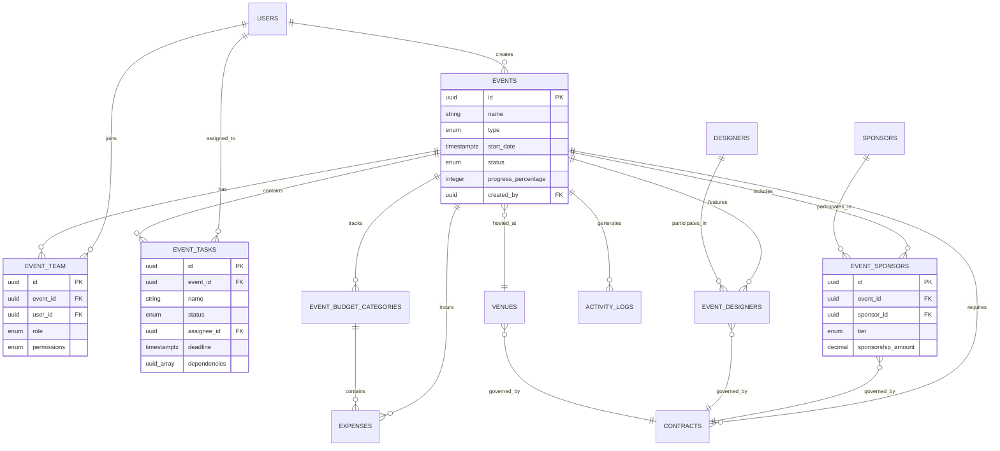

# Task 02: Backend Integration - Supabase Data Persistence

**Priority:** 🔴 **P0 - CRITICAL BLOCKER**  
**Category:** Core Infrastructure  
**Estimated Time:** 8-12 hours  
**Owner:** Backend Team (Cursor AI + Claude)  
**Status:** Not Started

---

## 📊 PROGRESS TRACKER

| Phase | Task | Status | Owner | Validation |
|-------|------|--------|-------|------------|
| **1. Database Design** | Schema definition | ⚪ Not Started | Backend | ERD diagram complete |
| **1. Database Design** | Table creation scripts | ⚪ Not Started | Backend | Tables exist in Supabase |
| **1. Database Design** | RLS policies | ⚪ Not Started | Backend | Security tests pass |
| **1. Database Design** | Indexes and constraints | ⚪ Not Started | Backend | Query performance optimized |
| **2. API Routes** | GET events list | ⚪ Not Started | Backend | Returns paginated data |
| **2. API Routes** | GET event detail | ⚪ Not Started | Backend | Returns full event with relations |
| **2. API Routes** | POST create event | ⚪ Not Started | Backend | Event persists correctly |
| **2. API Routes** | PUT update event | ⚪ Not Started | Backend | Updates save without conflicts |
| **2. API Routes** | DELETE archive event | ⚪ Not Started | Backend | Soft delete works |
| **3. Real-Time** | Task updates subscription | ⚪ Not Started | Backend | Live updates work |
| **3. Real-Time** | Team activity broadcast | ⚪ Not Started | Backend | Multi-user sync verified |
| **3. Real-Time** | Progress recalculation | ⚪ Not Started | Backend | Auto-updates on change |
| **4. Data Migration** | Mock to real data conversion | ⚪ Not Started | Backend | All screens use database |
| **4. Data Migration** | Event Wizard integration | ⚪ Not Started | Backend | Form saves to database |
| **4. Data Migration** | Command Center integration | ⚪ Not Started | Backend | Fetches live data |
| **5. Testing** | API endpoint tests | ⚪ Not Started | QA | All CRUD operations work |
| **5. Testing** | Real-time sync tests | ⚪ Not Started | QA | Multi-user scenarios verified |
| **5. Testing** | Data integrity tests | ⚪ Not Started | QA | Constraints prevent bad data |

**Current Completion:** 0/18 tasks (0%)  
**Target Completion:** 18/18 tasks (100%)

---

## 1. PRODUCT GOAL

**Core Problem:** All event data is currently hardcoded mock data. Users create events via wizard but data disappears on page refresh. No persistence means no real production use, no multi-user collaboration, no scalability.

**Primary Users:** All FashionOS Events users (event planners, sponsors, designers, team members) who need reliable data storage and real-time collaboration.

**Desired Outcome:** Complete backend infrastructure where events, tasks, sponsors, team members, budgets, and contracts persist in PostgreSQL database via Supabase. Users can create, update, and collaborate on events with data synchronized across all users in real-time.

**Success Metric:** Zero data loss on refresh, 100% of user actions persisted to database, real-time updates propagate to all connected users within 1 second.

---

## 2. FEATURE & TASK MATRIX

| Feature | Type | User Value | AI Used | Backend Complexity | Status |
|---------|------|------------|---------|-------------------|--------|
| **Event Persistence** | Core | Events survive page refresh | None | Medium | Not Started |
| **Task Management** | Core | Tasks linked to events | Gemini (auto-generate) | Medium | Not Started |
| **Team Assignments** | Core | Multi-user collaboration | None | High | Not Started |
| **Sponsor CRM Data** | Core | Sponsor relationships persist | None | Medium | Not Started |
| **Budget Tracking** | Core | Financial data accuracy | Gemini (variance alerts) | Medium | Not Started |
| **Contract Storage** | Core | Legal documents organized | Gemini (clause extraction) | Medium | Not Started |
| **Real-Time Sync** | Advanced | Live multi-user updates | None | High | Not Started |
| **Progress Calculation** | Advanced | Auto-compute metrics | Gemini (predictions) | Medium | Not Started |
| **File Uploads** | Advanced | Images, PDFs, documents | None | Medium | Not Started |
| **Audit Logs** | Advanced | Track all changes | None | Low | Not Started |

---

## 3. USER JOURNEYS

### Journey 1: First Database Save (Event Wizard → Persistence)

**Entry Point:** User completes Event Creation Wizard, all 6 steps filled

**Screen-by-Screen Flow:**

1. **Event Wizard - Final Review Step**
   - User Action: Reviews event summary (name, date, venue, sponsors, budget)
   - User Action: Clicks "Create Event" button
   - System Action: Validates all required fields present

2. **Backend Processing (Invisible to User)**
   - API Call: POST /api/events with full event data payload
   - Database Action: Begin transaction
   - Insert into events table: name, type, date, venue_id, status=draft, created_by=user_id
   - Receive event_id from database (UUID generated)
   - Gemini AI Action: Generate 80-150 tasks based on event type
   - Insert into event_tasks table: 150 tasks linked to event_id
   - Insert into event_sponsors table: Selected sponsors linked to event_id
   - Insert into event_budget_categories table: Budget allocations per category
   - Insert into event_team table: Event lead + assigned team members
   - Commit transaction (all or nothing)
   - Return success response with event_id

3. **Success Confirmation Screen**
   - System Action: Shows success message "Event Created Successfully!"
   - System Action: Redirects to Event Command Center with event_id in URL: /events/abc-123-def
   - User sees: Event Command Center loads with persisted data
   - User sees: Progress at 0%, 150 tasks generated, team assigned, sponsors added

4. **Refresh Test (Validation)**
   - User Action: Refreshes browser (F5)
   - System Action: Page reloads, fetches event from database by event_id
   - Outcome: ✅ All data still present (name, tasks, team, sponsors, budget)
   - Outcome: ✅ No data loss, event persists permanently

**Key Outcome:** User creates event once, data never lost, can access from any device anytime

---

### Journey 2: Multi-User Real-Time Collaboration

**Entry Point:** Two users (Event Lead Sarah and Team Member Marcus) viewing same event

**Screen-by-Screen Flow:**

1. **Initial State (Both Users Online)**
   - Sarah (Event Lead): Opens Event Command Center for "Milan Fashion Showcase"
   - Marcus (Team Member): Opens same event 10 seconds later
   - System Action: Both establish WebSocket connection to Supabase real-time
   - System Action: Both subscribe to event_tasks channel for event_id=abc-123

2. **Marcus Updates Task**
   - Marcus Action: Marks task "Finalize walk order" as complete
   - System Action: PUT /api/events/abc-123/tasks/task-456 with status=done
   - Database Action: Updates task status in event_tasks table
   - Database Action: Triggers real-time broadcast to event_tasks channel
   - Real-Time Action: Supabase broadcasts update to all subscribed clients (Sarah + Marcus)

3. **Sarah's Screen Updates (No Refresh Needed)**
   - Sarah's Browser: Receives WebSocket message: task-456 status changed to done
   - UI Action: Finds task card in task list, updates status badge to "Done" (green)
   - UI Action: Recalculates event progress: 68 → 69 tasks done, 45% → 46%
   - UI Action: Progress bar animates to 46%
   - UI Action: Team Activity Feed adds entry: "Marcus completed 'Finalize walk order' 1 second ago"
   - Sarah sees: All updates instantly, no page refresh

4. **Sarah Reassigns Task**
   - Sarah Action: Reassigns task "Send designer invitations" from Marcus to Julia
   - System Action: PUT /api/events/abc-123/tasks/task-789 with assignee_id=julia-id
   - Database Action: Updates task, broadcasts to real-time channel

5. **Marcus's Screen Updates**
   - Marcus's Browser: Receives update, removes task from "My Tasks" list
   - Marcus sees: Task no longer assigned to him, moved to Julia
   - Julia's Browser (if online): Receives update, adds task to "My Tasks" list
   - Julia sees: New task notification

**Key Outcome:** Two users collaborate in real-time, changes sync instantly, no conflicts or data loss

---

### Journey 3: Data Recovery After System Failure

**Entry Point:** Event planner working on event when internet disconnects

**Screen-by-Screen Flow:**

1. **Normal Operation (Online)**
   - User Action: Editing event "Paris Fashion Week"
   - User Action: Completes 3 tasks, uploads 2 files, adjusts budget
   - System Action: Each action saves to database immediately
   - User sees: Success confirmations after each action

2. **Internet Disconnects (Offline)**
   - System Action: WebSocket connection lost, real-time sync stops
   - UI Action: Shows offline indicator: "Connection lost - Retrying..."
   - User Action: Tries to mark task complete
   - UI Action: Shows error: "Offline - Changes will save when connection restored"
   - Browser Action: Queues changes in localStorage

3. **Internet Reconnects (Online Restored)**
   - System Action: WebSocket reconnects automatically
   - System Action: Fetches latest event state from database
   - System Action: Detects queued changes in localStorage
   - System Action: Replays queued changes to database (mark task complete, etc.)
   - UI Action: Shows success: "Connection restored - All changes saved ✅"

4. **User Refreshes Page**
   - User Action: Refreshes browser to verify data
   - System Action: Fetches event from database (includes changes made offline)
   - Outcome: ✅ All changes persisted, no data lost

**Key Outcome:** Offline resilience, queued changes auto-save when online, no manual re-entry

---

## 4. DATABASE SCHEMA & ARCHITECTURE

### Core Tables (12 Total)

**Table 1: events**  
Purpose: Core event information  
Fields:
- id (UUID, primary key, auto-generated)
- name (text, required, max 200 chars)
- type (enum: runway_show, brand_activation, pop_up, trunk_show, fashion_week, panel, launch_party)
- description (text, max 2000 chars)
- goals (text array, e.g., brand awareness, sales, press coverage)
- start_date (timestamptz, required)
- end_date (timestamptz, nullable)
- timezone (text, default UTC, e.g., America/New_York)
- venue_id (UUID, foreign key to venues, nullable)
- backup_venue_id (UUID, foreign key to venues, nullable)
- status (enum: draft, planning, confirmed, in_progress, completed, archived, cancelled)
- progress_percentage (integer, 0-100, calculated field)
- target_attendees (integer)
- actual_attendees (integer, nullable, filled after event)
- created_by (UUID, foreign key to auth.users)
- created_at (timestamptz, auto)
- updated_at (timestamptz, auto)

Indexes:
- events_created_by_idx on created_by
- events_status_idx on status
- events_start_date_idx on start_date

RLS Policy:
- Users can only see events they created OR are team members of
- Event lead can update event
- Team members can view but not update event core fields

---

**Table 2: event_tasks**  
Purpose: Tasks associated with events  
Fields:
- id (UUID, primary key)
- event_id (UUID, foreign key to events, required)
- name (text, required, max 200 chars)
- description (text, max 1000 chars)
- phase (enum: pre_production, venue_logistics, creative_design, on_site_operations, post_event)
- workflow_category (enum: event_planning, sponsorship, marketing, operations, media)
- priority (enum: critical, high, medium, low)
- status (enum: to_do, in_progress, blocked, done, cancelled, overdue)
- assignee_id (UUID, foreign key to auth.users, nullable)
- deadline (timestamptz, required)
- dependencies (UUID array, references other task ids in same event)
- estimated_hours (integer, nullable)
- actual_hours (integer, nullable)
- is_critical_path (boolean, calculated by AI)
- created_at (timestamptz, auto)
- completed_at (timestamptz, nullable)

Indexes:
- tasks_event_id_idx on event_id
- tasks_assignee_id_idx on assignee_id
- tasks_status_idx on status
- tasks_deadline_idx on deadline

RLS Policy:
- Users can see tasks for events they have access to
- Assignees can update their assigned tasks
- Event lead can update all tasks

Real-Time Subscription:
- Channel: event_tasks:event_id=abc-123
- Broadcasts: INSERT, UPDATE, DELETE on tasks for specific event

---

**Table 3: event_team**  
Purpose: Team members assigned to events  
Fields:
- id (UUID, primary key)
- event_id (UUID, foreign key to events, required)
- user_id (UUID, foreign key to auth.users, required)
- role (enum: event_lead, creative_director, production_manager, casting_director, sponsor_liaison, marketing_lead, venue_coordinator, custom)
- permissions (enum: admin, edit, view_only)
- assigned_at (timestamptz, auto)

Indexes:
- team_event_id_idx on event_id
- team_user_id_idx on user_id

RLS Policy:
- Event lead can add/remove team members
- Team members can view other team members
- Cannot remove yourself if you're the only event_lead

---

**Table 4: event_sponsors**  
Purpose: Sponsors associated with events  
Fields:
- id (UUID, primary key)
- event_id (UUID, foreign key to events, required)
- sponsor_id (UUID, foreign key to sponsors, required)
- tier (enum: platinum, gold, silver, bronze, custom)
- sponsorship_amount (decimal, nullable)
- currency (text, default USD)
- contract_id (UUID, foreign key to contracts, nullable)
- status (enum: pending, confirmed, signed, active, completed)
- created_at (timestamptz, auto)

Indexes:
- event_sponsors_event_id_idx on event_id
- event_sponsors_sponsor_id_idx on sponsor_id

---

**Table 5: sponsors**  
Purpose: Sponsor companies directory  
Fields:
- id (UUID, primary key)
- company_name (text, required, unique)
- industry (text, e.g., luxury, beauty, automotive)
- logo_url (text, Supabase Storage URL)
- website (text)
- tier (enum: platinum, gold, silver, bronze)
- primary_contact_name (text)
- primary_contact_email (text)
- primary_contact_phone (text)
- notes (text)
- created_at (timestamptz, auto)

---

**Table 6: event_budget_categories**  
Purpose: Budget breakdown by category per event  
Fields:
- id (UUID, primary key)
- event_id (UUID, foreign key to events, required)
- category (enum: venue, production, talent, catering, marketing, staffing, miscellaneous, buffer)
- budgeted_amount (decimal, required)
- actual_amount (decimal, default 0)
- currency (text, default USD)
- variance_percentage (decimal, calculated: (actual - budgeted) / budgeted × 100)

Indexes:
- budget_event_id_idx on event_id

---

**Table 7: expenses**  
Purpose: Individual expenses within budget categories  
Fields:
- id (UUID, primary key)
- event_id (UUID, foreign key to events)
- budget_category_id (UUID, foreign key to event_budget_categories)
- name (text, e.g., "Lighting Package")
- amount (decimal)
- currency (text)
- vendor_name (text, nullable)
- invoice_url (text, Supabase Storage URL, nullable)
- paid_status (enum: pending, paid, overdue)
- due_date (timestamptz, nullable)
- created_at (timestamptz, auto)

---

**Table 8: contracts**  
Purpose: All event-related contracts  
Fields:
- id (UUID, primary key)
- event_id (UUID, foreign key to events, nullable)
- contract_type (enum: sponsor, designer, venue, vendor, model, staff)
- party_name (text, e.g., "Chanel")
- party_id (UUID, foreign key to sponsors/designers/venues, nullable)
- status (enum: draft, pending_review, pending_signature, signed, active, expired, terminated)
- amount (decimal, nullable)
- currency (text)
- key_terms (jsonb, extracted by Gemini AI)
- file_url (text, Supabase Storage URL)
- signed_date (timestamptz, nullable)
- expiration_date (timestamptz, nullable)
- created_at (timestamptz, auto)

---

**Table 9: designers**  
Purpose: Designer profiles directory  
Fields:
- id (UUID, primary key)
- name (text, required)
- brand_name (text)
- bio (text, max 1000 chars)
- style_tags (text array, e.g., sustainable, avant-garde, minimalist)
- location (text)
- website (text)
- instagram (text)
- portfolio_url (text)
- profile_image_url (text)
- created_at (timestamptz, auto)

---

**Table 10: event_designers**  
Purpose: Designers participating in events  
Fields:
- id (UUID, primary key)
- event_id (UUID, foreign key to events)
- designer_id (UUID, foreign key to designers)
- invitation_status (enum: sent, opened, accepted, declined, no_response)
- invited_at (timestamptz)
- responded_at (timestamptz, nullable)
- number_of_looks (integer, nullable)
- show_order (integer, nullable)

---

**Table 11: venues**  
Purpose: Venue directory  
Fields:
- id (UUID, primary key)
- name (text, required)
- location (text, e.g., "Milan, Italy")
- address (text)
- capacity (integer)
- layout_options (text array, e.g., straight_runway, u_shape)
- amenities (text array, e.g., backstage, VIP_lounge, parking)
- pricing_tiers (jsonb)
- floor_plan_url (text)
- technical_specs (jsonb)
- created_at (timestamptz, auto)

---

**Table 12: activity_logs**  
Purpose: Audit trail of all event changes  
Fields:
- id (UUID, primary key)
- event_id (UUID, foreign key to events)
- user_id (UUID, foreign key to auth.users)
- action_type (enum: event_created, task_completed, team_added, budget_updated, contract_signed, etc.)
- description (text, e.g., "Sarah completed task 'Finalize venue contract'")
- metadata (jsonb, additional context)
- created_at (timestamptz, auto)

Real-Time Subscription:
- Channel: activity_logs:event_id=abc-123
- Broadcasts: INSERT on new activity logs
- Powers Team Activity Feed in Command Center

---

## 5. API ROUTES & ENDPOINTS

### Events Endpoints

**GET /api/events**  
Purpose: List all events user has access to  
Query Params:
- status (filter by status: draft, planning, etc.)
- page (pagination, default 1)
- limit (items per page, default 20)

Response:
```
{
  events: [
    { id, name, type, date, status, progress, venue_name, team_count }
  ],
  total: 150,
  page: 1,
  pages: 8
}
```

---

**GET /api/events/:id**  
Purpose: Fetch single event with all related data  
Response:
```
{
  event: {
    id, name, type, description, start_date, status, progress,
    venue: { id, name, location, capacity },
    team: [
      { user_id, name, role, permissions }
    ],
    tasks_summary: {
      total: 150,
      done: 68,
      in_progress: 20,
      overdue: 12,
      by_phase: {
        pre_production: { total: 30, done: 30 },
        venue_logistics: { total: 28, done: 20 },
        // ...
      }
    },
    sponsors: [
      { id, company_name, tier, amount, status }
    ],
    budget: {
      total_budgeted: 500000,
      total_actual: 190000,
      variance_percentage: -62,
      categories: [
        { category: "venue", budgeted: 45000, actual: 45000, variance: 0 }
      ]
    }
  }
}
```

---

**POST /api/events**  
Purpose: Create new event from wizard  
Request Body:
```
{
  name, type, description, start_date, end_date, timezone,
  venue_id, backup_venue_id,
  target_attendees,
  budget_categories: [
    { category: "venue", budgeted_amount: 45000 }
  ],
  team_members: [
    { user_id, role, permissions }
  ],
  sponsor_ids: [uuid1, uuid2],
  designer_ids: [uuid3, uuid4]
}
```

Response:
```
{
  event_id: "abc-123-def",
  tasks_generated: 150,
  status: "draft"
}
```

Backend Logic:
1. Validate all fields
2. Begin database transaction
3. Insert into events table
4. Call Gemini to generate tasks based on event type
5. Insert 150 tasks into event_tasks table
6. Insert budget categories
7. Insert team members
8. Insert event_sponsors relationships
9. Insert event_designers relationships
10. Commit transaction
11. Return event_id

---

**PUT /api/events/:id**  
Purpose: Update event details  
Request Body: (partial update allowed)
```
{
  name?, description?, start_date?, status?, target_attendees?
}
```

Response:
```
{
  success: true,
  updated_fields: ["name", "start_date"]
}
```

---

**DELETE /api/events/:id**  
Purpose: Archive event (soft delete)  
Response:
```
{
  success: true,
  status: "archived"
}
```

Backend Logic:
- Updates status to "archived" (not hard delete)
- Event no longer appears in default list
- Can be restored by admin

---

### Tasks Endpoints

**GET /api/events/:eventId/tasks**  
Purpose: Fetch all tasks for event  
Query Params:
- phase (filter by workflow phase)
- status (filter by status)
- assignee_id (filter by assignee)

Response:
```
{
  tasks: [
    {
      id, name, description, phase, priority, status,
      assignee: { id, name, avatar_url },
      deadline, is_critical_path, dependencies
    }
  ],
  total: 150
}
```

---

**PUT /api/events/:eventId/tasks/:taskId**  
Purpose: Update task (status, assignee, deadline)  
Request Body:
```
{
  status?, assignee_id?, deadline?, priority?
}
```

Response:
```
{
  success: true,
  task: { updated task object },
  event_progress_updated: 46
}
```

Backend Logic:
1. Update task in database
2. If status changed to "done":
   - Recalculate event progress percentage
   - Check if task was on critical path
   - Unlock dependent tasks (change from blocked to to_do)
   - Broadcast real-time update to all clients
   - Log activity: "User completed task 'X'"
3. If assignee changed:
   - Send notification to new assignee
   - Broadcast update

---

**POST /api/events/:eventId/tasks**  
Purpose: Create new task manually  
Request Body:
```
{
  name, description, phase, priority, assignee_id, deadline, dependencies?
}
```

Response:
```
{
  task_id: "task-789",
  success: true
}
```

---

### Real-Time Subscriptions

**Supabase Real-Time Channel: event_tasks**  
Subscribe to task updates for specific event:
```
Client subscribes to: "event_tasks:event_id=eq.abc-123"
Server broadcasts on: INSERT, UPDATE, DELETE
Client receives: { event_type, old, new }
```

Use Case:
- User A marks task complete
- Database triggers update
- Supabase broadcasts to all subscribed clients
- User B's browser receives update, refreshes UI instantly

---

**Supabase Real-Time Channel: activity_logs**  
Subscribe to activity feed for event:
```
Client subscribes to: "activity_logs:event_id=eq.abc-123"
Server broadcasts on: INSERT
Client receives: { user_name, action_type, description, created_at }
```

Use Case:
- User A uploads file
- Activity log inserted: "Sarah uploaded designer portfolio"
- Broadcast to all clients
- Team Activity Feed updates in real-time

---

## 6. REAL-TIME SYNC ARCHITECTURE

### WebSocket Connection Flow

**Step 1: Client Connects**
- User opens Event Command Center
- Frontend establishes WebSocket connection to Supabase real-time
- Authenticates with user JWT token
- Connection stays open as long as page is open

**Step 2: Client Subscribes to Channels**
- Subscribes to event_tasks channel for current event
- Subscribes to activity_logs channel for current event
- Subscribes to event_budget_categories channel (for budget alerts)

**Step 3: Server Broadcasts Updates**
- Any database change (INSERT, UPDATE, DELETE) on subscribed tables triggers broadcast
- Supabase sends message to all connected clients subscribed to that channel
- Message includes: event_type (INSERT/UPDATE/DELETE), old record, new record

**Step 4: Client Handles Updates**
- Frontend receives WebSocket message
- Parses message type (task completed, team member added, budget updated)
- Updates UI components without full page refresh:
  - Task list updates (add/remove/modify task cards)
  - Progress bar animates to new percentage
  - Team Activity Feed adds new entry
  - KPI cards recalculate metrics

**Step 5: Conflict Resolution**
- If two users edit same task simultaneously:
  - Last write wins (timestamp-based)
  - Broadcast notifies all clients of final state
  - Clients reconcile local state with server state

---

### Offline Handling

**localStorage Queue:**
- User goes offline (internet disconnects)
- Frontend detects connection lost
- All user actions queue in browser localStorage:
```
{
  queue: [
    { action: "update_task", task_id, status: "done", timestamp },
    { action: "upload_file", file_data, timestamp }
  ]
}
```

**Reconnection:**
- Internet reconnects, WebSocket re-establishes
- Frontend detects online
- Replays queued actions to server in order
- Server processes each action, broadcasts updates
- Frontend clears localStorage queue
- Shows success notification: "All changes saved ✅"

---

## 7. FILE UPLOAD ARCHITECTURE

### Supabase Storage Buckets

**Bucket 1: event-images**  
Purpose: Event hero images, designer photos, venue photos  
Public: Yes (read-only)  
Max Size: 5MB per file  
Allowed Types: image/jpeg, image/png, image/webp  

RLS Policy:
- Anyone can read
- Only event creator or team members can upload
- Only uploader can delete

---

**Bucket 2: event-documents**  
Purpose: Contracts, invoices, floor plans, run of show PDFs  
Public: No (private)  
Max Size: 10MB per file  
Allowed Types: application/pdf, application/msword, text/plain  

RLS Policy:
- Only event team members with permissions can read
- Only event lead can upload/delete

---

**Bucket 3: event-media**  
Purpose: Event photos/videos during and after event  
Public: Conditional (depends on event settings)  
Max Size: 50MB per file  
Allowed Types: image/*, video/mp4  

---

### Upload Flow

**Step 1: User Uploads File**
- User clicks "Upload Contract" in Contracts Manager
- File picker opens, user selects PDF
- Frontend validates: file type (PDF), size (<10MB)

**Step 2: Upload to Supabase Storage**
- Frontend calls Supabase Storage API:
```
supabase.storage.from('event-documents').upload(
  'events/abc-123/contracts/sponsor-chanel.pdf',
  fileBlob
)
```
- Supabase returns file URL: "https://xxx.supabase.co/storage/v1/object/public/event-documents/events/abc-123/contracts/sponsor-chanel.pdf"

**Step 3: Save URL to Database**
- Frontend calls API: POST /api/events/:id/contracts
```
{
  contract_type: "sponsor",
  party_name: "Chanel",
  file_url: "https://...",
  status: "pending_signature"
}
```
- Database inserts contract record with file_url

**Step 4: Display in UI**
- Contract appears in Contracts Manager list
- Click contract → opens PDF in new tab or inline viewer

---

## 8. MIGRATION FROM MOCK DATA

### Migration Strategy

**Phase 1: Parallel Run (1 week)**
- Keep existing mock data components as-is
- Build new database-connected components alongside
- Feature flag to toggle between mock and real data
- Test real data flow with pilot users

**Phase 2: Gradual Cutover (1 week)**
- Event Wizard: Switch to save to database (first component)
- Event Command Center: Switch to fetch from database
- Task Management: Switch to real-time updates
- CRM systems: Switch to database

**Phase 3: Full Migration (3 days)**
- Remove all mock data files
- Delete hardcoded arrays
- Remove feature flags
- Monitor for errors, rollback if needed

---

### Data Conversion

**Convert Existing Mock Events to Database:**

Mock Event Object:
```
const mockEvent = {
  id: 1,
  name: "Milan Sustainable Fashion Showcase",
  date: "June 15, 2026",
  venue: "Palazzo Reale",
  // ...
}
```

Database Seed Script:
```
Insert into events:
  name: "Milan Sustainable Fashion Showcase"
  start_date: "2026-06-15T14:00:00Z"
  venue_id: (lookup venue "Palazzo Reale" in venues table)
  status: "planning"
  created_by: (system user)
```

Run seed script to populate database with realistic demo data for testing.

---

## 9. DIAGRAMS (MERMAID)

### Diagram 1: Database Entity Relationship Diagram



---

### Diagram 2: API Request Flow Sequence


---

### Diagram 3: Real-Time Sync Architecture


---

### Diagram 4: File Upload Flow


---

### Diagram 5: Offline Queue System


---

## 10. REAL-WORLD USE CASES

### Use Case 1: Event Planner Creates First Event

**Situation:** Sarah is onboarding to FashionOS, creating her first event "NYC Spring Fashion Showcase"

**User Goal:** Create event via wizard, ensure data persists, access from laptop and phone

**Workflow:**
1. Sarah completes Event Wizard on laptop (15 minutes)
2. Clicks "Create Event"
3. Backend saves event + 150 tasks to PostgreSQL
4. Sarah sees Event Command Center with 0% progress
5. Sarah closes laptop, goes home
6. Opens FashionOS on phone next day
7. Sees "NYC Spring Fashion Showcase" in Events List
8. Opens event, all data intact (name, venue, tasks, team)

**Result:** Sarah trusts FashionOS with production events, no data loss anxiety

---

### Use Case 2: Team Collaboration on Runway Show

**Situation:** Event team of 5 people working simultaneously on "Milan Fashion Week" event

**User Goal:** Coordinate tasks in real-time, avoid duplicate work, stay synchronized

**Workflow:**
1. Sarah (Event Lead) opens Command Center on laptop
2. Marcus (Production Manager) opens same event on desktop
3. Julia (Creative Director) opens on iPad
4. Marcus marks task "Lighting setup complete" as done
5. Sarah's screen updates instantly: Progress 78% → 79%
6. Sarah reassigns task "Model fittings" from Marcus to Julia
7. Julia's iPad shows notification: "New task assigned to you"
8. Julia opens task, marks in progress
9. Sarah and Marcus both see Julia's status update in real-time
10. Team Activity Feed shows all actions by all users live

**Result:** Team coordinates without email/Slack, zero miscommunication, everyone synced

---

### Use Case 3: Budget Tracking Prevents Overrun

**Situation:** Production Manager adding expenses throughout planning phase

**User Goal:** Track spending in real-time, prevent budget overrun before it happens

**Workflow:**
1. Marcus adds expense: "Venue Rental: $45K" (saves to database)
2. Budget KPI updates: Venue category 100% used ($45K / $45K)
3. Marcus adds expense: "Lighting Package: $20K" (saves to database)
4. Backend calculates variance: Production budgeted $75K, actual $20K = 27% used
5. Week later, Marcus adds: "Additional Lights: $60K"
6. Backend calculates: $80K / $75K = +6.7% over budget
7. Gemini detects variance, sends alert to Event Command Center
8. Sarah (Event Lead) sees red alert: "Production 6.7% over budget"
9. Gemini suggests: "Marketing budget 20% under, reallocate $5K?"
10. Sarah approves reallocation via one click
11. Database updates both categories, budget balanced

**Result:** Budget overrun caught early, prevented $5K loss, financial health maintained

---

### Use Case 4: Offline Work During Flight

**Situation:** Event planner on 5-hour flight, needs to update event tasks offline

**User Goal:** Complete work offline, sync when landing (no data loss)

**Workflow:**
1. Sarah boards flight, opens FashionOS (event cached in browser)
2. Airplane mode on, internet disconnects
3. UI shows: "Offline - Changes will save when reconnected"
4. Sarah marks 5 tasks complete, uploads 2 files, adjusts 1 deadline
5. Frontend queues all 8 actions in localStorage with timestamps
6. Sarah closes laptop, sleeps during flight
7. Plane lands, Sarah connects to airport WiFi
8. FashionOS detects online, reconnects WebSocket
9. Replays 8 queued actions to server in order
10. Database saves all changes, broadcasts to team
11. UI shows: "Connection restored - 8 changes saved ✅"
12. Team members see Sarah's updates appear in Activity Feed

**Result:** Sarah productive during flight, zero manual re-entry, seamless sync

---

### Use Case 5: Multi-Device Access

**Situation:** Event planner switches between laptop (office), tablet (meetings), phone (on-site)

**User Goal:** Access same event data on all devices, seamless handoff

**Workflow:**
1. Morning: Sarah opens Event Command Center on laptop in office
2. Reviews progress: 65% complete, 52 tasks remaining
3. Joins meeting, brings iPad
4. Opens FashionOS on iPad, same event loads instantly
5. Updates 3 task deadlines during meeting
6. Changes save to database in real-time
7. Afternoon: Sarah visits venue for walkthrough
8. Opens FashionOS on phone
9. Sees updated deadlines from meeting (synced from iPad)
10. Marks task "Venue walkthrough complete" on phone
11. Returns to office, opens laptop
12. Progress updated: 66% complete (task from phone synced)

**Result:** Sarah works from any device, data always current, no sync friction

---

## 11. IMPLEMENTATION PLAN (CURSOR AI PROMPTS)

### Phase 1: Database Setup (3 hours)

**Prompt 1 to Cursor:**
"Create Supabase migration file for Events module. Define 12 tables: events, event_tasks, event_team, event_sponsors, sponsors, event_budget_categories, expenses, contracts, designers, event_designers, venues, activity_logs. Include all fields from schema, proper foreign keys, indexes on event_id and user_id columns. Add RLS policies: users can only access events they created or are team members of."

**Prompt 2 to Cursor:**
"Create database seed script to populate initial data: 5 sample sponsors (Chanel, Gucci, Prada, Dior, Hermès), 10 sample designers (names + bios + style tags), 3 sample venues in Milan (Palazzo Reale, Teatro alla Scala, Triennale Museum). Insert into respective tables for testing."

**Prompt 3 to Cursor:**
"Setup Supabase real-time subscriptions. Create React hook useEventRealTime(eventId) that subscribes to event_tasks and activity_logs channels for specific event. Return tasks array and activities array that auto-update when database changes. Include connection status (online/offline)."

---

### Phase 2: API Routes (4 hours)

**Prompt 4 to Cursor:**
"Create API route GET /api/events that returns paginated list of events user has access to. Query events table joined with event_team. Include filters for status (draft/planning/confirmed). Return events with progress_percentage, venue_name, team_count. Limit 20 per page, include total count for pagination."

**Prompt 5 to Cursor:**
"Create API route GET /api/events/:id that returns full event data. Join events with venue, event_tasks (grouped by phase), event_team, event_sponsors, event_budget_categories. Calculate tasks_summary (total, done, in_progress, overdue counts). Return nested JSON matching Event Command Center props."

**Prompt 6 to Cursor:**
"Create API route POST /api/events that handles Event Wizard submission. Accept event data + budget + team + sponsors. Begin database transaction, insert into events table, call Gemini API to generate 80-150 tasks based on event type, bulk insert tasks, insert budget categories, team members, sponsors. Commit transaction. Return event_id and tasks_generated count. Include error handling and rollback on failure."

**Prompt 7 to Cursor:**
"Create API route PUT /api/events/:id/tasks/:taskId that updates task (status, assignee, deadline). After update, recalculate event progress_percentage (count done tasks / total tasks × 100), update events table. If status changed to done, check dependencies array and unlock blocked tasks. Insert activity log entry. Broadcast real-time update via Supabase. Return updated task and new progress."

---

### Phase 3: Frontend Integration (3 hours)

**Prompt 8 to Cursor:**
"Refactor Event Creation Wizard to save to database. Replace mock submit function with API call POST /api/events. Map wizard form state to API request body. Handle loading state (show spinner), success (redirect to /events/:id), error (show validation messages). Include Gemini task generation progress indicator."

**Prompt 9 to Cursor:**
"Refactor Event Command Center to fetch from database. Replace hardcoded mock event with API call GET /api/events/:id on component mount. Handle loading skeleton while fetching. Subscribe to real-time updates using useEventRealTime hook. Update progress bar, task counts, activity feed when real-time updates received."

**Prompt 10 to Cursor:**
"Refactor Task List component to use database. Fetch tasks via GET /api/events/:eventId/tasks. When user marks task complete, call PUT /api/tasks/:id with status=done. Optimistically update UI (show checkmark immediately), then sync with server response. Revert UI if API call fails. Show toast notification on success."

---

### Phase 4: File Uploads (2 hours)

**Prompt 11 to Cursor:**
"Setup Supabase Storage buckets: event-images (public, 5MB limit, image types), event-documents (private, 10MB limit, PDF/doc types), event-media (public, 50MB limit, image/video types). Create RLS policies: only event team members can upload/delete. Create utility function uploadEventFile(bucketName, filePath, fileBlob) that handles upload and returns public URL."

**Prompt 12 to Cursor:**
"Create file upload component for Contracts Manager. Include drag-and-drop zone, file type validation (PDF only), size validation (max 10MB), progress bar during upload. Call uploadEventFile to Supabase Storage, then save file_url to contracts table via POST /api/contracts. Show success toast with download link."

---

### Phase 5: Testing & Migration (2 hours)

**Prompt 13 to Cursor:**
"Create integration tests for event creation flow: test POST /api/events saves to database, Gemini generates tasks, event_id returned, tasks linked to event. Test GET /api/events/:id returns correct nested data. Test PUT /api/tasks/:id updates task and recalculates progress. Use Supabase test database, clean up after each test."

**Prompt 14 to Cursor:**
"Create migration script to remove all mock data. Delete hardcoded event arrays in Events.tsx, EventDetail.tsx, EventWizard.tsx. Remove mock task arrays in TasksAndDeliverables.tsx. Replace with database fetches. Add loading states for all data fetching. Test that all screens work with real database data."

---

## 12. ACCEPTANCE TESTS

### Test 1: Event Persistence

**Given:** User completes Event Wizard with event name "Test Event"  
**When:** User clicks "Create Event"  
**Then:**  
- Event saved to events table in database
- event_id returned in API response
- User redirected to /events/:event_id
- Event Command Center displays "Test Event" name
- User refreshes page (F5)
- Event still loads with all data intact
- No data loss

---

### Test 2: Real-Time Task Sync

**Given:** Two users (User A and User B) viewing same event  
**When:** User A marks task "Finalize venue" as complete  
**Then:**  
- Task status updates in database
- User B's screen updates within 1 second (no refresh)
- Progress bar on User B's screen animates 45% → 46%
- Team Activity Feed shows: "User A completed Finalize venue just now"
- User B clicks task, sees status "Done" with green checkmark

---

### Test 3: Offline Queue

**Given:** User has internet connection, opens Event Command Center  
**When:** User's internet disconnects (airplane mode)  
**Then:**  
- UI shows offline indicator: "Connection lost"
- User marks 2 tasks complete
- Actions queue in localStorage
- User's internet reconnects
- UI shows: "Reconnecting..."
- Queued actions replay to server
- Both tasks save to database
- UI shows: "All changes saved ✅"
- Tasks appear in Activity Feed with correct timestamps

---

### Test 4: File Upload

**Given:** User opens Contracts Manager  
**When:** User uploads contract PDF (5MB file)  
**Then:**  
- File validates (PDF type, size <10MB)
- Upload progress bar shows 0% → 100%
- File uploads to Supabase Storage bucket "event-documents"
- File URL returned: "https://xxx.supabase.co/storage/..."
- Contract record saved to database with file_url
- Contract appears in list with download link
- Click download link opens PDF in new tab

---

### Test 5: Multi-Device Access

**Given:** User creates event on laptop  
**When:** User logs in on phone  
**Then:**  
- Events List shows same events as laptop
- User opens event, sees identical data (progress, tasks, team)
- User marks task complete on phone
- Task saves to database
- User returns to laptop (still open)
- Laptop screen updates via real-time (progress bar animates)
- Both devices show same progress percentage

---

## 13. TROUBLESHOOTING

### Issue: Database Connection Timeout

**Symptoms:** API calls fail with "Connection timeout" error after 30 seconds  
**Root Cause:** Supabase free tier has 100 concurrent connection limit, exceeded during high traffic  
**Solution:**  
- Implement connection pooling (PgBouncer)
- Set max connections to 20 per API instance
- Add connection retry logic with exponential backoff
**Prevention:** Monitor connection count, upgrade to Pro tier before launch

---

### Issue: Real-Time Updates Not Received

**Symptoms:** User A updates task, User B's screen doesn't update  
**Root Cause:** WebSocket connection dropped, client didn't reconnect  
**Solution:**  
- Add reconnection logic: retry every 5 seconds up to 10 attempts
- Show connection status indicator (green=online, yellow=reconnecting, red=offline)
- Fallback to polling (fetch data every 30 seconds) if WebSocket fails
**Prevention:** Test reconnection scenarios during development

---

### Issue: Progress Percentage Stuck

**Symptoms:** User marks tasks complete, progress stays at same percentage  
**Root Cause:** Progress calculation query excludes archived tasks, denominator wrong  
**Solution:**  
- Fix query: SELECT COUNT(*) WHERE status='done' AND archived=false / COUNT(*) WHERE archived=false
- Add database function recalculate_event_progress(event_id) that recalculates from scratch
- Call function daily via cron to fix drift
**Prevention:** Add unit tests for progress calculation edge cases

---

### Issue: File Upload Fails Silently

**Symptoms:** User uploads file, progress bar completes, but file not saved  
**Root Cause:** Supabase Storage RLS policy rejects upload, no error message shown  
**Solution:**  
- Check RLS policies: ensure user has upload permission
- Add error handling in uploadEventFile function
- Show user-friendly error: "Upload failed - You don't have permission"
**Prevention:** Test file uploads with different user permission levels

---

### Issue: Offline Queue Replays Out of Order

**Symptoms:** User completes tasks offline, after sync tasks appear in wrong order  
**Root Cause:** localStorage queue not sorted by timestamp before replay  
**Solution:**  
- Sort queue by timestamp (oldest first) before replaying
- Add sequence number to each queued action
- Replay in sequence order, wait for each to complete before next
**Prevention:** Test offline scenarios with multiple actions, verify order

---

## 14. PRODUCTION-READY CHECKLIST

### Data Integrity
- [ ] All tables have primary keys (UUIDs)
- [ ] Foreign key constraints prevent orphaned records
- [ ] Indexes on frequently queried columns (event_id, user_id, status)
- [ ] RLS policies prevent unauthorized data access
- [ ] Database backups scheduled daily (Supabase automatic)
- [ ] Transaction rollback on error (no partial saves)

### API Reliability
- [ ] All API routes handle errors gracefully (500, 404, 400)
- [ ] Rate limiting implemented (100 requests/minute per user)
- [ ] Request validation (required fields, data types, max lengths)
- [ ] Response caching (5-minute cache for event list)
- [ ] API versioning (/api/v1/events for future updates)
- [ ] Logging all API calls (success + errors)

### Real-Time Performance
- [ ] WebSocket connection auto-reconnects on drop
- [ ] Broadcast latency <1 second (validated with test)
- [ ] Connection status visible to user (online/offline indicator)
- [ ] Graceful degradation (fallback to polling if WebSocket fails)
- [ ] Max 1000 concurrent WebSocket connections supported

### File Storage
- [ ] File type validation (only allowed types upload)
- [ ] File size limits enforced (5MB images, 10MB docs)
- [ ] RLS policies protect private files
- [ ] File URLs expire after 7 days (for temp shares)
- [ ] Storage quota monitoring (alert at 80% full)

### Security
- [ ] Row Level Security enabled on all tables
- [ ] User authentication required (JWT tokens)
- [ ] SQL injection prevention (parameterized queries)
- [ ] HTTPS only (no HTTP traffic)
- [ ] Secrets stored in environment variables (not code)
- [ ] CORS configured (only allow FashionOS domains)

---

**End of Task 02: Backend Integration - Supabase Data Persistence**

**Next Steps:** Begin Phase 1 (Database Setup) using Cursor AI prompts. Allocate 8-12 hours for complete implementation. Coordinate with frontend team to ensure API contracts match UI expectations.