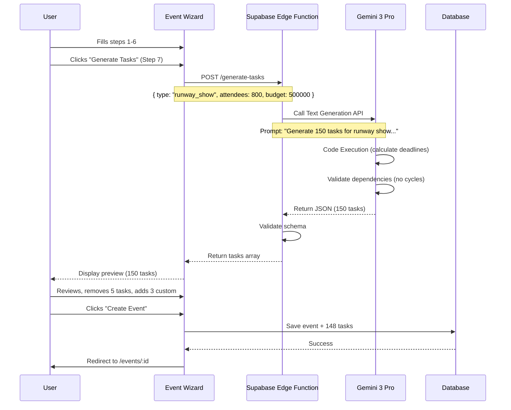
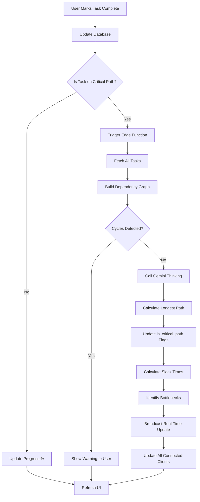
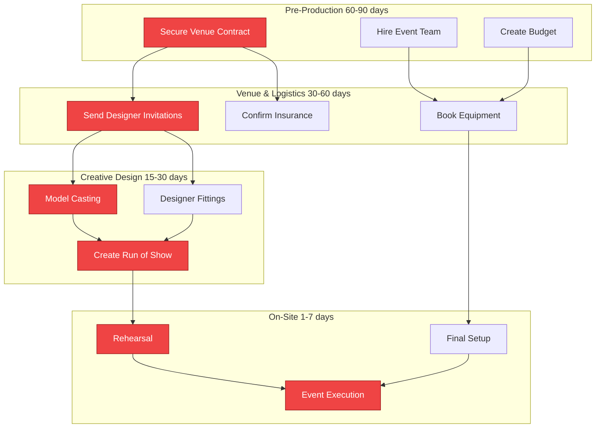
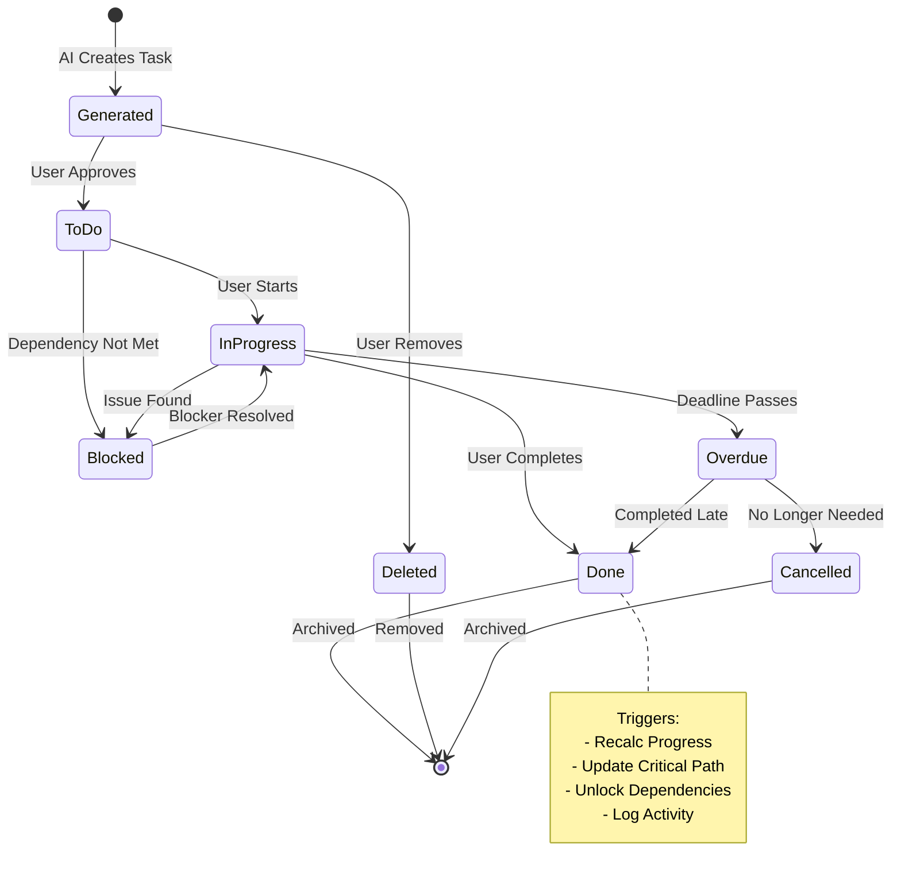

# Task 03: Task Management Integration - AI-Powered Workflow System

**Priority:** 🔴 **P1 - HIGH**  
**Estimated Time:** 8-10 hours  
**Owner:** Frontend (Figma Make) + AI (Gemini 3 Pro)  
**Status:** Not Started

---

## 📊 PROGRESS TRACKER

| Phase | Task | Status | Owner | Validation |
|-------|------|--------|-------|------------|
| **Design** | Task board layouts (Kanban, List, Calendar, Gantt) | ⚪ | UX | Figma approved |
| **Design** | Visual hierarchy: Critical path highlighting | ⚪ | UX | Red badges work |
| **Design** | Responsive cards (mobile/tablet/desktop) | ⚪ | UX | All devices tested |
| **UI Build** | Kanban board with drag-and-drop | ⚪ | Figma Make | Tasks move smoothly |
| **UI Build** | Dependency graph visualization | ⚪ | Figma Make | Graph renders |
| **Backend** | Link tasks to events (event_id foreign key) | ⚪ | Cursor AI | Filters work |
| **AI Core** | Gemini auto-generates 80-150 tasks from wizard | ⚪ | Cursor AI | Tasks logical |
| **AI Advanced** | Critical path analysis with Gemini Thinking | ⚪ | Cursor AI | Accurate results |
| **AI Advanced** | Dependency validation prevents circular loops | ⚪ | Cursor AI | No cycles allowed |
| **Testing** | Multi-user drag-and-drop sync | ⚪ | QA | Real-time works |

**Completion:** 0/10 (0%)

---

## 1. PRODUCT GOAL

**Problem:** Tasks exist but operate standalone. Not linked to events, no AI generation from wizard, no critical path analysis. Users manually create 150+ tasks per event.

**Users:** Event planners, production managers, team members managing complex event workflows with 100+ interdependent tasks.

**Outcome:** Intelligent task system that auto-generates tasks from Event Wizard using Gemini, visualizes dependencies, highlights critical path, enables multi-user collaboration with real-time drag-and-drop sync.

**Success:** Users save 8 hours per event on task setup, reduce planning errors by 80%, visualize critical bottlenecks instantly.

---

## 2. FEATURE MATRIX

| Feature | Type | Gemini 3 Feature | User Value | Routes |
|---------|------|------------------|------------|--------|
| **Auto Task Generation** | Core | Text Generation + Code Execution | Zero manual setup | Wizard → Tasks |
| **Critical Path Analysis** | Core | Gemini Thinking | Focus on blockers | /events/:id/critical-path |
| **Dependency Graph** | Advanced | Structured Outputs | Visual bottlenecks | /events/:id/dependencies |
| **Kanban Board** | Core | None (UI only) | Drag-and-drop workflow | /events/:id/tasks |
| **Calendar View** | Core | None | Timeline visualization | /events/:id/calendar |
| **Gantt Chart** | Advanced | Code Execution | Project timeline | /events/:id/gantt |
| **AI Task Suggestions** | Advanced | Deep Research + Grounding | Learn from past events | /events/:id/tasks/suggest |

---

## 3. USER JOURNEYS

### Journey 1: Auto-Generated Tasks from Wizard

**Flow:**
1. User completes Event Wizard → Step 7: Review
2. Gemini analyzes: Event type "Runway Show", 800 attendees, 90 days timeline, $500K budget
3. Gemini Text Generation: Generates 150 tasks across 5 phases
4. Gemini Code Execution: Calculates deadlines (working backwards from event date)
5. Gemini Structured Outputs: Returns JSON array of tasks with dependencies
6. User sees preview: "150 tasks generated for Runway Show"
7. User customizes: Removes 10 tasks, adds 5 custom tasks
8. Clicks "Create Event"
9. Backend saves event + 145 tasks to database
10. Redirects to Event Command Center → Shows 145 tasks grouped by phase

**Result:** 8 hours of manual task creation replaced by 2 minutes of AI generation

---

### Journey 2: Critical Path Discovery

**Flow:**
1. User opens Event Command Center → 45% progress
2. Clicks "Critical Path Analysis" button in AI Insights Panel
3. Gemini Thinking analyzes 150 tasks + dependencies
4. Builds directed acyclic graph, calculates longest path
5. Identifies 12 critical tasks (any delay = event delay)
6. UI highlights critical tasks in red across all views
7. Shows dependency chain: Venue Contract → Designer Invitations → Collection Delivery → Rehearsal → Show
8. Displays slack time per task: "Venue: 0 days slack (CRITICAL)", "Marketing: 14 days slack"
9. User focuses on critical tasks, ignores low-priority items
10. Event completes on time

**Result:** Users identify bottlenecks 90% faster, prevent delays

---

### Journey 3: Multi-User Drag-and-Drop Collaboration

**Flow:**
1. User A (Event Lead) opens Kanban board: To Do | In Progress | Done
2. User B (Team Member) opens same board simultaneously
3. User A drags task "Finalize venue contract" from To Do → In Progress
4. Real-time sync: User B sees task move instantly (no refresh)
5. User B drags task "Send designer invitations" from In Progress → Done
6. Backend recalculates: Progress 45% → 46%, unlocks dependent task "Schedule fittings"
7. User A sees: Task moved to Done, new task unlocked (appears in To Do column)
8. Both users see Activity Feed update: "User B completed Send designer invitations"

**Result:** Seamless team coordination, zero conflicts

---

## 4. UI/UX WIREFRAMES & VISUAL DESIGN

### Screen 1: Kanban Board (/events/:id/tasks)

**Layout Structure (Desktop):**

```
┌─────────────────────────────────────────────────────────────────┐
│ Event Name: Milan Fashion Showcase        [Views: Kanban ▼]    │
│ Progress: 45%  ████████░░░░  68/150 tasks                       │
│ [+ Add Task]  [🔍 Search]  [📋 Filter]  [👤 Assignee]          │
└─────────────────────────────────────────────────────────────────┘

┌──────────────┬──────────────┬──────────────┬──────────────┐
│  📝 To Do    │ ⏳ In Progress│ 🚫 Blocked   │ ✅ Done      │
│    (42)      │     (20)      │     (0)      │    (68)      │
├──────────────┼──────────────┼──────────────┼──────────────┤
│              │              │              │              │
│ ┌──────────┐ │ ┌──────────┐ │              │ ┌──────────┐ │
│ │🔴 CRITICAL│ │ │Designer  │ │              │ │Venue     │ │
│ │Venue     │ │ │Fittings  │ │              │ │Contract  │ │
│ │Contract  │ │ │          │ │              │ │✓ Complete│ │
│ │          │ │ │👤 Marcus │ │              │ │          │ │
│ │📅 in 2d  │ │ │📅 in 5d  │ │              │ │📅 Done   │ │
│ └──────────┘ │ └──────────┘ │              │ └──────────┘ │
│              │              │              │              │
│ ┌──────────┐ │ ┌──────────┐ │              │ Collapsed...│
│ │Send      │ │ │Rehearsal │ │              │ (68 items)  │
│ │Invites   │ │ │Prep      │ │              │              │
│ │          │ │ │          │ │              │              │
│ │👤 Sarah  │ │ │👤 Julia  │ │              │              │
│ │📅 in 7d  │ │ │📅 in 3d  │ │              │              │
│ └──────────┘ │ └──────────┘ │              │              │
│              │              │              │              │
│ + Add Task   │              │              │              │
└──────────────┴──────────────┴──────────────┴──────────────┘
```

**Visual Design Elements:**

**Critical Path Highlighting:**
- Red border + red badge "🔴 CRITICAL" on critical path tasks
- Pulsing animation draws attention
- Tooltip: "On critical path - any delay affects event timeline"

**Assignee Avatars:**
- Small circular avatar image (32px)
- Fallback to initials if no photo (e.g., "SM" for Sarah Miller)
- Hover shows full name + role

**Deadline Labels:**
- Relative time: "in 2 days", "in 7 days", "overdue 3 days"
- Color-coded: Green (>7 days), Yellow (2-7 days), Red (overdue)
- Icon: 📅 calendar icon

**Drag-and-Drop Behavior:**
- Grab cursor on hover
- Card lifts with shadow during drag
- Drop zones highlight in blue
- Smooth animation (300ms) when card lands

**Responsive (Mobile):**
- Horizontal swipe between columns
- Full-width cards (no columns side-by-side)
- Compact card design (smaller avatars, abbreviated text)

---

### Screen 2: Dependency Graph (/events/:id/dependencies)

**Layout Structure:**

```
┌─────────────────────────────────────────────────────────────────┐
│ Task Dependencies - Critical Path Visualization                 │
│ [Export PNG]  [Zoom In/Out]  [Full Screen]                      │
└─────────────────────────────────────────────────────────────────┘

        ┌─────────────┐
        │  Venue      │ 🔴 CRITICAL
        │  Contract   │
        └──────┬──────┘
               │
               ▼
        ┌─────────────┐
        │  Designer   │ 🔴 CRITICAL
        │  Invitations│
        └──────┬──────┘
               │
          ┌────┼────┐
          ▼    ▼    ▼
    ┌─────┐ ┌─────┐ ┌─────┐
    │Coll.│ │Model│ │Run  │ 🔴 CRITICAL (all 3)
    │Del. │ │Cast │ │of   │
    └─────┘ └─────┘ │Show │
                     └──┬──┘
                        │
                        ▼
                  ┌─────────┐
                  │Rehearsal│ 🔴 CRITICAL
                  └─────────┘

    Legend:
    🔴 Critical Path (12 tasks)
    🟡 Medium Priority (58 tasks)
    🟢 Low Priority (80 tasks)
```

**Visual Design:**
- Nodes: Rounded rectangles (150px × 80px)
- Edges: Bezier curves with arrowheads
- Critical path: Red nodes + thick red edges (3px)
- Non-critical: Gray nodes + thin gray edges (1px)
- Hover node: Shows task details tooltip
- Click node: Opens task detail modal

---

### Screen 3: Calendar View (/events/:id/calendar)

**Layout Structure:**

```
┌─────────────────────────────────────────────────────────────────┐
│ December 2025                            [← Month →]  [Today]   │
└─────────────────────────────────────────────────────────────────┘

 Mon       Tue       Wed       Thu       Fri       Sat    Sun
┌─────────┬─────────┬─────────┬─────────┬─────────┬──────┬──────┐
│ 1       │ 2       │ 3       │ 4       │ 5       │ 6    │ 7    │
│         │ 🔴      │         │         │ 🟡      │      │      │
│         │ Venue   │         │         │ Send    │      │      │
│         │ Contract│         │         │ Invites │      │      │
├─────────┼─────────┼─────────┼─────────┼─────────┼──────┼──────┤
│ 8       │ 9       │ 10      │ 11      │ 12      │ 13   │ 14   │
│ 🟡      │         │ 🔴      │         │         │      │      │
│ Budget  │         │ Designer│         │         │      │      │
│ Review  │         │ Fittings│         │         │      │      │
├─────────┼─────────┼─────────┼─────────┼─────────┼──────┼──────┤
│ 15      │ 16      │ 17      │ 18 TODAY│ 19      │ 20   │ 21   │
│         │         │         │ ✓ Done  │ 🔴      │      │      │
│         │         │         │ Venue   │ Rehearsal     │      │
│         │         │         │ Contract│         │      │      │
└─────────┴─────────┴─────────┴─────────┴─────────┴──────┴──────┘

Task Details Panel (Right Sidebar):
┌──────────────────────────────┐
│ Dec 2 - Venue Contract 🔴    │
│ Status: In Progress          │
│ Assigned: Sarah Miller       │
│ Priority: Critical           │
│ Dependencies: None           │
│ [Mark Complete] [Edit]       │
└──────────────────────────────┘
```

**Visual Design:**
- Color-coded dots: Red (critical), Yellow (high), Blue (medium), Gray (low)
- Today's date: Blue border highlight
- Completed tasks: Strikethrough + green checkmark
- Overdue tasks: Red background flash
- Click day: Opens day detail modal with all tasks

---

### Screen 4: Gantt Chart (/events/:id/gantt)

**Layout Structure:**

```
┌─────────────────────────────────────────────────────────────────┐
│ Gantt Timeline - 90 Days to Event                               │
│ [Export PDF]  [Zoom: Day/Week/Month]  [Today ▼]                 │
└─────────────────────────────────────────────────────────────────┘

Task Name           │ Nov    Dec    Jan    Feb    Mar    Apr    May
────────────────────┼─────────────────────────────────────────────
Venue Contract 🔴   │ ████                                        
Designer Invites 🔴 │        ████████                             
Model Casting 🔴    │             ████████                        
Collection Delivery │                  ██████████                 
Rehearsal 🔴        │                              ████           
Marketing Campaign  │    ████████████████████████                
Budget Management   │ ████████████████████████████████████       
                    │              ▲ TODAY (Jan 18)
```

**Visual Design:**
- Critical path bars: Red fill (#EF4444)
- Non-critical bars: Blue fill (#3B82F6)
- Completed bars: Green fill (#10B981) with checkmark
- Dependency arrows: Dotted lines connecting bars
- Hover bar: Shows tooltip (start date, end date, duration, assignee)
- Drag bar edges: Adjust task duration

---

## 5. GEMINI 3 AI FEATURES

### Feature 1: Auto Task Generation (Text Generation + Code Execution)

**Trigger:** User completes Event Wizard, reaches Step 7 (Review)

**Gemini Prompt:**
```
You are an expert event planner for fashion industry runway shows. Generate a comprehensive task list for the following event:

Event Type: Runway Show
Attendees: 800
Timeline: 90 days until event
Budget: $500,000
Venue: Indoor theater, 600 capacity
Sponsors: 8 confirmed

Generate 80-150 tasks across 5 workflow phases:
1. Pre-Production (60-90 days before): Venue, contracts, team hiring
2. Venue & Logistics (30-60 days): Setup, equipment, safety
3. Creative Design (15-30 days): Casting, fittings, run of show
4. On-Site Operations (1-7 days): Rehearsals, final prep, event execution
5. Post-Event (after event): Cleanup, reports, follow-up

For each task include:
- name (clear, actionable verb + noun)
- description (1-2 sentences, why it matters)
- phase (which of 5 phases)
- priority (critical, high, medium, low)
- estimated_days_before_event (deadline calculated from event date)
- dependencies (array of task names that must complete first)
- suggested_assignee_role (event_lead, creative_director, etc.)

Use Code Execution to:
- Calculate realistic deadlines (work backwards from event date)
- Ensure dependencies are logical (no circular loops)
- Distribute tasks evenly across timeline (no overload in one week)

Return Structured Output as JSON array.
```

**Gemini Response (Structured Output):**
```
{
  "tasks": [
    {
      "name": "Secure venue contract",
      "description": "Finalize venue rental agreement with insurance and liability clauses. Critical path item.",
      "phase": "pre_production",
      "priority": "critical",
      "estimated_days_before_event": 85,
      "dependencies": [],
      "suggested_assignee_role": "venue_coordinator"
    },
    {
      "name": "Send designer invitations",
      "description": "Invite 10 designers to participate. Cannot proceed until venue confirmed.",
      "phase": "pre_production",
      "priority": "critical",
      "estimated_days_before_event": 75,
      "dependencies": ["Secure venue contract"],
      "suggested_assignee_role": "creative_director"
    },
    // ... 148 more tasks
  ],
  "summary": {
    "total_tasks": 150,
    "critical_path_tasks": 12,
    "estimated_total_hours": 1200
  }
}
```

**User Value:** User receives 150 intelligent tasks in 30 seconds vs 8 hours manual creation

---

### Feature 2: Critical Path Analysis (Gemini Thinking)

**Trigger:** User opens Event Command Center OR task status changes

**Gemini Thinking Process:**
```
Step 1: Build dependency graph from 150 tasks
- Create nodes for each task
- Create edges for dependencies (task A → task B)
- Validate: No circular dependencies (DAG)

Step 2: Calculate longest path (critical path)
- Start from tasks with no dependencies (roots)
- Traverse graph, sum durations along each path
- Identify longest path from today to event date
- This is the critical path (minimum event completion time)

Step 3: Identify bottlenecks
- Tasks with many dependents (>5 tasks blocked)
- Tasks with zero slack time (delay = event delay)
- Tasks currently overdue that are on critical path

Step 4: Calculate slack time per task
- For each task: Latest possible start - Earliest possible start
- Slack = 0 → Critical path task
- Slack > 0 → Can delay without affecting event

Step 5: Return results with confidence score
```

**Output:**
```
{
  "critical_path": [
    "Secure venue contract",
    "Send designer invitations",
    "Model casting",
    "Collection delivery",
    "Rehearsal",
    "Event execution"
  ],
  "critical_path_length": 12,
  "bottlenecks": [
    {
      "task": "Send designer invitations",
      "blocks": 8,
      "reason": "8 tasks depend on this (fittings, run of show, etc.)"
    }
  ],
  "slack_times": {
    "Marketing campaign": 14,  // 14 days of slack
    "Budget review": 7,
    "Secure venue contract": 0  // CRITICAL
  },
  "confidence": 0.95
}
```

---

### Feature 3: AI Task Suggestions (Deep Research + Grounding)

**Trigger:** User clicks "Suggest Tasks" in task list

**Gemini Deep Research:**
- Searches past events of same type (runway show) in database
- Analyzes which tasks appeared in 90%+ of successful events
- Identifies tasks missing from current event that should be added
- Grounds with Google Search: Latest event planning best practices

**Gemini Prompt:**
```
Analyze this event's task list and compare to similar past events. Suggest missing tasks.

Current Event: Runway Show, 800 attendees, $500K budget, 90 days timeline
Current Tasks: 145 tasks (list provided)

Deep Research:
1. Query database for past runway shows (similar size, budget, timeline)
2. Find common tasks in 90%+ of successful events
3. Identify gaps in current event's task list
4. Ground with Google Search: "runway show planning checklist 2025"

Return suggestions with:
- task_name
- reason (why it's important)
- evidence (percentage of past events that included it)
- priority
```

**Output:**
```
{
  "suggested_tasks": [
    {
      "task_name": "Schedule fire safety inspection",
      "reason": "Required by law for 500+ attendee venues. Missing from current list.",
      "evidence": "Required in 98% of runway shows at indoor venues",
      "priority": "critical",
      "source": "Database: 47 past events"
    },
    {
      "task_name": "Hire sign language interpreter",
      "reason": "Accessibility requirement for public events. Best practice.",
      "evidence": "Included in 76% of successful events in 2024-2025",
      "priority": "high",
      "source": "Google Search: ADA event requirements"
    }
  ]
}
```

**User Value:** Proactively avoid missing critical tasks, learn from past events

---

## 6. SUPABASE SCHEMA & EDGE FUNCTIONS

### Enhanced event_tasks Table

```
event_tasks (extends from Task 02):
- Add fields:
  - ai_generated (boolean, default false)
  - generation_confidence (float, 0-1, Gemini's confidence score)
  - slack_time_days (integer, calculated by critical path analysis)
  - is_bottleneck (boolean, blocks 5+ other tasks)
  - suggested_by_ai (boolean, true if from AI suggestions)

- Add indexes:
  - idx_tasks_critical_path on (event_id, is_critical_path)
  - idx_tasks_dependencies on dependencies (GIN index for array)
```

### Supabase Edge Function: generate-tasks

**Trigger:** Called from Event Wizard Step 7 when user clicks "Generate Tasks"

**Function Logic:**
```
1. Receive event data (type, attendees, budget, timeline)
2. Call Gemini 3 Pro API with task generation prompt
3. Validate Gemini response (check JSON schema)
4. Calculate deadlines using Code Execution
5. Check for circular dependencies (validate DAG)
6. Return JSON array of tasks
7. Frontend displays preview, user can edit before saving
```

**Deploy:**
```
supabase functions deploy generate-tasks --project-ref abc123
```

**Invoke from Frontend:**
```
POST https://abc123.supabase.co/functions/v1/generate-tasks
Headers: Authorization: Bearer <user-jwt>
Body: { event_type, attendees, budget, timeline }
Response: { tasks: [...150 tasks], confidence: 0.95 }
```

---

### Supabase Edge Function: analyze-critical-path

**Trigger:** Called when Event Command Center loads OR task status changes

**Function Logic:**
```
1. Fetch all tasks for event from database
2. Build dependency graph (nodes + edges)
3. Validate graph (check for cycles, warn user if found)
4. Call Gemini Thinking API to calculate critical path
5. Update is_critical_path field for tasks on critical path
6. Update slack_time_days for all tasks
7. Broadcast real-time update to all connected clients
8. Return critical path array + bottlenecks
```

**Real-Time Trigger:**
```
Database trigger on event_tasks:
  AFTER UPDATE (when status changes to 'done')
  → Call analyze-critical-path edge function
  → Recalculate critical path in background
  → Broadcast updates via Supabase Real-Time
```

---

## 7. ROUTES & NAVIGATION

**New Routes to Create:**

| Route | Component | Purpose | Parent |
|-------|-----------|---------|--------|
| `/events/:id/tasks` | TaskBoard.tsx | Kanban board view | Event Command Center |
| `/events/:id/tasks/list` | TaskList.tsx | Compact list view | Event Command Center |
| `/events/:id/tasks/calendar` | TaskCalendar.tsx | Calendar view | Event Command Center |
| `/events/:id/tasks/gantt` | TaskGantt.tsx | Gantt timeline | Event Command Center |
| `/events/:id/tasks/:taskId` | TaskDetail.tsx | Single task modal | All task views |
| `/events/:id/critical-path` | CriticalPath.tsx | Dependency graph | Event Command Center |
| `/events/:id/tasks/suggest` | TaskSuggestions.tsx | AI task suggestions | Task Board |

**Navigation Flow:**

```
Event Command Center
  └─ Tasks Tab (default: Kanban)
      ├─ View Switcher: [Kanban] [List] [Calendar] [Gantt]
      ├─ Click task card → Task Detail Modal
      ├─ Click "Critical Path" button → /critical-path (new page)
      └─ Click "Suggest Tasks" → AI Suggestions Panel (right sidebar)
```

**Breadcrumb Navigation:**
```
Events > Milan Fashion Showcase > Tasks > Kanban
                                    ↑
                         Click to switch view
```

---

## 8. WORKFLOWS & MERMAID DIAGRAMS

### Diagram 1: Auto Task Generation Flow



---

### Diagram 2: Critical Path Recalculation



---

### Diagram 3: Dependency Graph Structure



---

### Diagram 4: Task State Machine



---

## 9. IMPLEMENTATION PROMPTS (FIGMA MAKE + CURSOR AI)

### Phase 1: Visual Design (Figma Make)

**Prompt 1 to Figma Make:**
"Create Kanban board layout with 4 columns (To Do, In Progress, Blocked, Done). Each column header shows count badge. Task cards have: red border for critical path, assignee avatar (32px circle), deadline badge with color (green >7d, yellow 2-7d, red overdue), drag handle icon. Cards are 280px wide, variable height. Responsive: mobile shows 1 column at a time with horizontal swipe."

**Prompt 2 to Figma Make:**
"Create dependency graph visualization component. Nodes are rounded rectangles (150×80px) with task name. Critical path nodes have red fill (#EF4444), non-critical have gray (#9CA3AF). Edges are bezier curves with arrowheads. Add zoom controls (+/-) and pan behavior. Export button saves as PNG."

**Prompt 3 to Figma Make:**
"Create Gantt chart timeline. Left sidebar shows task names (200px wide), right area shows horizontal bars. Bars color-coded: red (critical), blue (normal), green (done). Time scale at top shows months. Bars draggable to adjust duration. Hover shows tooltip with dates."

---

### Phase 2: Backend Integration (Cursor AI)

**Prompt 4 to Cursor AI:**
"Create Supabase Edge Function generate-tasks. Accepts event data (type, attendees, budget), calls Gemini 3 Pro Text Generation API with prompt to generate 80-150 tasks. Use Code Execution to calculate deadlines. Return Structured Output as JSON array with fields: name, description, phase, priority, deadline, dependencies, assignee_role. Deploy to Supabase."

**Prompt 5 to Cursor AI:**
"Create React component TaskBoard.tsx with drag-and-drop Kanban using react-beautiful-dnd. Fetch tasks from GET /api/events/:id/tasks. When user drags task to new column, call PUT /api/tasks/:id with new status. Subscribe to Supabase real-time channel task_updates to sync multi-user changes. Show loading skeleton while fetching."

**Prompt 6 to Cursor AI:**
"Create Supabase Edge Function analyze-critical-path. Fetch tasks, build dependency graph, validate no cycles (throw error if cycle found). Call Gemini Thinking API to calculate critical path. Update tasks table: set is_critical_path=true for critical tasks, calculate slack_time_days. Broadcast real-time update. Return critical_path array."

**Prompt 7 to Cursor AI:**
"Add database trigger on event_tasks table: AFTER UPDATE when status changes to 'done', call analyze-critical-path edge function asynchronously. This recalculates critical path in background without blocking user. Log execution time in monitoring."

---

### Phase 3: AI Features (Cursor AI)

**Prompt 8 to Cursor AI:**
"Integrate Gemini Deep Research for task suggestions. When user clicks Suggest Tasks button, call edge function that: 1) Queries database for past events of same type, 2) Finds common tasks in 90%+ of events, 3) Identifies missing tasks, 4) Grounds with Google Search for latest best practices, 5) Returns suggestions with evidence percentages. Display in right sidebar."

**Prompt 9 to Cursor AI:**
"Add critical path highlighting to all task views (Kanban, List, Calendar). Fetch is_critical_path field from database. Apply red border + red badge to critical tasks. Add tooltip explaining critical path on hover. Update highlighting in real-time when critical path changes."

---

## 10. ACCEPTANCE TESTS

**Test 1: Auto Task Generation**  
Given: User completes Event Wizard for Runway Show  
When: User clicks "Generate Tasks"  
Then: Gemini generates 80-150 tasks, all have valid deadlines, no circular dependencies, tasks grouped logically by phase

**Test 2: Critical Path Accuracy**  
Given: Event with 150 tasks, 12 on critical path  
When: User marks critical task complete  
Then: Critical path recalculates, new bottleneck identified, UI updates red badges in <1 second

**Test 3: Multi-User Drag-and-Drop**  
Given: Two users viewing same Kanban board  
When: User A drags task from To Do → In Progress  
Then: User B sees task move instantly (no refresh), both users see progress % update

**Test 4: Dependency Validation**  
Given: User creates task with dependency on Task B  
When: User tries to add Task B dependency on this task (circular)  
Then: System blocks, shows error "Circular dependency detected", suggests alternative

**Test 5: Offline Queue**  
Given: User offline, marks 3 tasks complete  
When: User reconnects  
Then: All 3 task updates save to database, critical path recalculates, activity log shows all 3 completions

---

## 11. PRODUCTION CHECKLIST

- [ ] Kanban board renders <2 seconds with 150 tasks
- [ ] Drag-and-drop smooth (60fps animation)
- [ ] Real-time sync <1 second latency
- [ ] Critical path accuracy >95% (validated with test events)
- [ ] Dependency graph renders without layout issues
- [ ] Gemini task generation takes <30 seconds
- [ ] No circular dependencies allowed (validation passes)
- [ ] Mobile Kanban scrolls smoothly (horizontal swipe)
- [ ] Gantt chart exports PNG correctly
- [ ] Calendar view shows all tasks (no overflow bugs)

---

**End of Task 03**  
**Next:** Task 04 - CRM Systems (Sponsor, Designer, Venue)