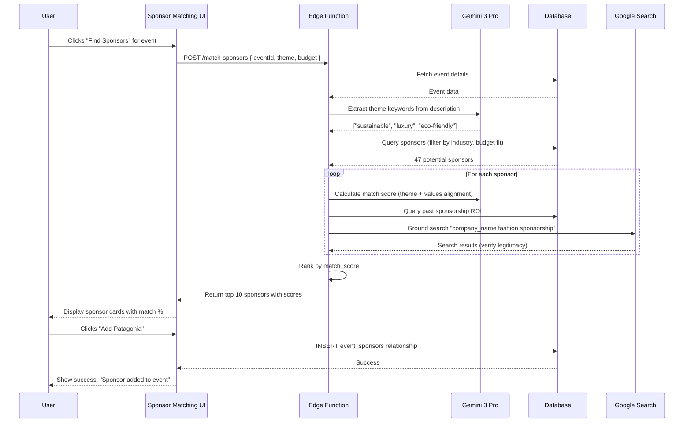
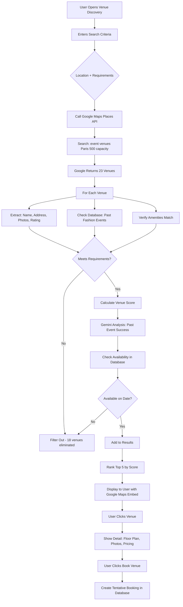
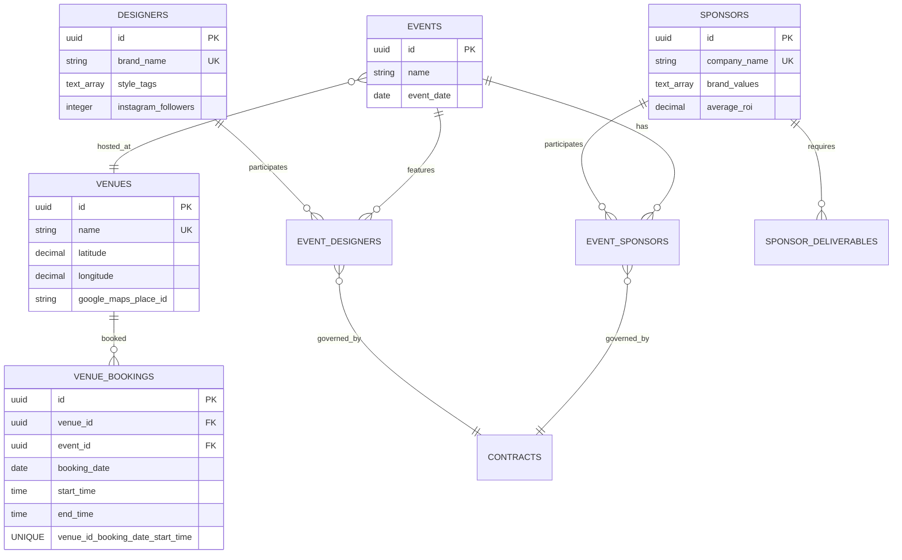

# Task 04: CRM Systems - Sponsor, Designer & Venue Management

**Priority:** 🟡 **P1 - HIGH**  
**Estimated Time:** 10-12 hours  
**Owner:** Frontend (Figma Make) + AI (Gemini 3 Pro + Google Maps)  
**Status:** Not Started

---

## 📊 PROGRESS TRACKER

| Phase | Task | Status | Owner | Validation |
|-------|------|--------|-------|------------|
| **Design** | CRM card layouts (list + detail views) | ⚪ | UX | Figma approved |
| **Design** | AI matching interface (scores + recommendations) | ⚪ | UX | Mockups ready |
| **UI Build** | Sponsor CRM (list, detail, contracts) | ⚪ | Figma Make | CRUD works |
| **UI Build** | Designer Directory (search, profiles) | ⚪ | Figma Make | Filters work |
| **UI Build** | Venue Management (calendar, bookings) | ⚪ | Figma Make | Conflicts detected |
| **Backend** | CRM database tables (sponsors, designers, venues) | ⚪ | Cursor AI | Schema complete |
| **Backend** | Google Maps API integration for venues | ⚪ | Cursor AI | Map renders |
| **AI Core** | Sponsor-event matching (Gemini Pro) | ⚪ | Cursor AI | Match scores accurate |
| **AI Core** | Designer recommendations (Gemini + search) | ⚪ | Cursor AI | Style matching works |
| **AI Advanced** | Venue discovery (Gemini + Google Maps) | ⚪ | Cursor AI | Results relevant |

**Completion:** 0/10 (0%)

---

## 1. PRODUCT GOAL

**Problem:** Sponsors, designers, and venues scattered across spreadsheets. No way to discover new partners, match brands to events, or track relationships. Manual contract management leads to missed renewals.

**Users:** Event planners (manage CRM), sponsors (track ROI), designers (get discovered), venue managers (manage bookings).

**Outcome:** Unified CRM with AI-powered matching. Gemini recommends sponsors aligned with event theme, suggests designers based on style, finds venues using Google Maps. All contracts, deliverables, and communications in one place.

**Success:** Event planners save 12 hours per event on partner discovery, increase sponsor revenue by 30% through better matching, reduce venue conflicts to zero.

---

## 2. FEATURE MATRIX

| Feature | Type | Gemini 3 Feature | User Value | Routes |
|---------|------|------------------|------------|--------|
| **Sponsor CRM** | Core | Text Generation (emails) | Centralized relationships | /sponsors |
| **Sponsor Matching** | Advanced | Deep Research + Grounding | Find ideal brands | /sponsors/match/:eventId |
| **Designer Directory** | Core | None | Searchable profiles | /designers |
| **Designer Recommendations** | Advanced | Text Generation + Search | AI style matching | /designers/recommend/:eventId |
| **Venue Management** | Core | Google Maps Grounding | Location search | /venues |
| **Venue Discovery** | Advanced | Google Maps + Deep Research | Find perfect venues | /venues/discover |
| **Contract Tracking** | Core | Structured Outputs (clause extraction) | Never miss renewals | /contracts |
| **ROI Dashboard** | Advanced | Code Execution (calculations) | Prove sponsor value | /sponsors/:id/roi |

---

## 3. USER JOURNEYS

### Journey 1: AI Sponsor Matching

**Flow:**
1. Event planner creating "Sustainable Fashion Showcase" (luxury, eco-friendly theme)
2. Clicks "Find Sponsors" in Event Wizard Step 4
3. Gemini Deep Research analyzes:
   - Event theme: "sustainable", "luxury", "eco-friendly"
   - Past sponsor data: Which brands sponsored similar events
   - Google Search grounding: Latest sustainable fashion sponsors 2025
4. Gemini returns 10 sponsor recommendations with match scores (0-100)
5. Top match: Patagonia (98% match) - Reason: "Brand values align (sustainability), sponsored 12 similar events, average ROI 5.2x"
6. User clicks "Add Patagonia" → Creates sponsor relationship
7. System auto-generates contract template, emails sponsor contact

**Result:** 4 hours of manual research replaced by 30-second AI recommendation

---

### Journey 2: Designer Discovery & Portfolio Review

**Flow:**
1. Creative Director needs 5 emerging designers for "Milan Streetwear Week"
2. Opens Designer Directory → Filters: Style "streetwear", Location "Milan", Availability "June 2026"
3. Gemini recommends 8 designers matching criteria
4. User clicks designer "Marco Rossi" → Opens portfolio:
   - Bio: "Sustainable streetwear, 5 years experience"
   - Collections: SS24 (urban minimalism), FW24 (technical fabrics)
   - Past events: 3 shows at Milan Fashion Week
   - Press: Featured in Vogue Italia
   - Social: 45K Instagram followers
5. User clicks "Invite to Event" → System sends invitation via platform
6. Designer receives notification, accepts invitation
7. Designer added to event, system creates fitting schedule

**Result:** Discover emerging talent 10x faster than manual Instagram/Google search

---

### Journey 3: Venue Discovery with Google Maps

**Flow:**
1. Event planner creating event in "Paris" for 500 attendees, needs runway-friendly venue
2. Clicks "Find Venues" → Opens Venue Discovery tool
3. Gemini + Google Maps Grounding searches:
   - Location: Within 10km of Paris city center
   - Capacity: 500+ people
   - Venue type: Theater, gallery, museum (runway-friendly architecture)
   - Amenities: Backstage area, parking, accessibility
4. Google Maps returns 12 venues with photos, addresses, reviews
5. Gemini analyzes each venue:
   - Filters out venues without backstage (eliminates 4)
   - Ranks by past fashion event history (prefers venues with runway experience)
   - Checks availability in database (3 already booked for date)
6. Returns top 5 venues with match scores
7. User clicks "Palais de Tokyo" (94% match) → Views:
   - Map location (embedded Google Maps)
   - Street view photos
   - Floor plan (uploaded by venue manager)
   - Past events held there (6 runway shows)
   - Pricing: €15,000 per day
8. User clicks "Book Venue" → Creates tentative booking, sends inquiry

**Result:** Find perfect venue in 10 minutes vs 2 days of manual research

---

## 4. UI/UX WIREFRAMES & VISUAL DESIGN

### Screen 1: Sponsor CRM (/sponsors)

**Layout Structure:**

```
┌─────────────────────────────────────────────────────────────────┐
│ Sponsor CRM                                [+ Add Sponsor]       │
│ [🔍 Search sponsors...]  [Filter ▼]  [Sort: Match Score ▼]     │
└─────────────────────────────────────────────────────────────────┘

┌─────────────────────────────────────────────────────────────────┐
│ 📊 Quick Stats                                                   │
│ ┌──────────┬──────────┬──────────┬──────────┐                   │
│ │ 84       │ 32       │ $680K    │ 5.2x     │                   │
│ │ Sponsors │ Pipeline │ Committed│ Avg ROI  │                   │
│ └──────────┴──────────┴──────────┴──────────┘                   │
└─────────────────────────────────────────────────────────────────┘

Sponsor Cards (Grid View):
┌─────────────────┬─────────────────┬─────────────────┐
│ 🏢 Chanel       │ 🏢 Gucci        │ 🏢 Patagonia    │
│ Luxury Fashion  │ Luxury Fashion  │ Sustainable     │
│                 │                 │                 │
│ 💰 $75K         │ 💰 $50K         │ 💰 $40K         │
│ 📊 Platinum     │ 📊 Gold         │ 📊 Gold         │
│ ✅ Active (3)   │ ✅ Active (2)   │ ⏳ Pending (1)  │
│                 │                 │                 │
│ Match: 92% 🔥   │ Match: 88%      │ Match: 98% 🔥   │
│ [View Detail]   │ [View Detail]   │ [View Detail]   │
└─────────────────┴─────────────────┴─────────────────┘
```

**Visual Design:**
- Company Logo: 80×80px circle at top of card
- Match Score: Progress ring (0-100%) with fire emoji if >90%
- Tier Badge: Color-coded (Platinum=gold, Gold=yellow, Silver=gray)
- Status Indicator: Green (active), Yellow (pending), Red (expired)
- Hover Effect: Card lifts with shadow, "View Detail" button appears

---

### Screen 2: Sponsor Detail (/sponsors/:id)

**Layout Structure:**

```
┌─────────────────────────────────────────────────────────────────┐
│ ← Back to Sponsors                                               │
│                                                                  │
│ 🏢 Chanel                                          [Edit]        │
│ Luxury Fashion | Paris, France                                   │
│ 📧 contact@chanel.com | 🌐 chanel.com                           │
└─────────────────────────────────────────────────────────────────┘

┌─────────────────────────────────────────────────────────────────┐
│ 📊 Sponsorship Summary                                           │
│ ┌───────────────┬───────────────┬───────────────┐               │
│ │ Total Value   │ Events        │ Avg ROI       │               │
│ │ $225K         │ 3 active      │ 5.8x          │               │
│ └───────────────┴───────────────┴───────────────┘               │
└─────────────────────────────────────────────────────────────────┘

Active Events:
┌──────────────────────────────────────────────────────────────┐
│ Milan Fashion Showcase | June 15, 2026 | $75K | Platinum     │
│ ✅ Contract Signed | Deliverables: 4/8 Complete               │
│ [View Event] [View Contract] [Track Deliverables]             │
├──────────────────────────────────────────────────────────────┤
│ Paris Eco-Fashion Week | Sept 20, 2026 | $100K | Platinum    │
│ ⏳ Contract Pending Signature | Sent 3 days ago                │
│ [Send Reminder] [View Draft]                                  │
└──────────────────────────────────────────────────────────────┘

Contracts:
┌──────────────────────────────────────────────────────────────┐
│ 📄 Milan Fashion Showcase Agreement                           │
│ Status: ✅ Signed | Amount: $75K | Expires: June 30, 2026    │
│ Key Terms (AI Extracted):                                     │
│ • Payment: 50% upfront, 50% post-event                        │
│ • Deliverables: VIP lounge, logo placement, 10 VIP tickets   │
│ • Renewal: Auto-renew unless 60-day notice                   │
│ [Download PDF] [View Deliverables]                            │
└──────────────────────────────────────────────────────────────┘

Communication Log:
┌──────────────────────────────────────────────────────────────┐
│ Dec 15 | 📧 Email: Sponsorship proposal sent                  │
│ Dec 18 | 📞 Call: Discussed deliverables (30 min)             │
│ Dec 20 | ✅ Contract signed                                    │
│ [+ Add Note]                                                  │
└──────────────────────────────────────────────────────────────┘
```

**Visual Design:**
- Header: Large company logo (120×120px), company name (32px font)
- Event Cards: Color-coded border (green=active, yellow=pending, red=expired)
- Contract Status: Badge with icon (✅ signed, ⏳ pending, ❌ expired)
- AI Extracted Terms: Bullet list with key icon, highlights important clauses
- Communication Timeline: Vertical timeline with icons (email, call, meeting)

---

### Screen 3: Designer Directory (/designers)

**Layout Structure:**

```
┌─────────────────────────────────────────────────────────────────┐
│ Designer Directory                        [Grid ▼] [List]       │
│ [🔍 Search designers...]                                        │
│                                                                  │
│ Filters:                                                         │
│ Style: [All ▼] [Sustainable] [Avant-garde] [Minimalist]        │
│ Location: [All ▼]  Availability: [All ▼]  Price: [$-$$$]       │
└─────────────────────────────────────────────────────────────────┘

Designer Cards (Grid View, 3 columns):
┌─────────────────┬─────────────────┬─────────────────┐
│ 👤 Image        │ 👤 Image        │ 👤 Image        │
│                 │                 │                 │
│ Isabella Laurent│ Marcus Chen     │ Sofia Rodriguez │
│ Maison Laurent  │ CHEN Studio     │ SR Atelier      │
│                 │                 │                 │
│ 🏷️ Sustainable  │ 🏷️ Avant-garde  │ 🏷️ Minimalist   │
│ 📍 Paris        │ 📍 Tokyo        │ 📍 Barcelona    │
│ ⭐ 4.8 (12)     │ ⭐ 4.9 (8)      │ ⭐ 5.0 (5)      │
│                 │                 │                 │
│ ✅ Available    │ ⏸️ Unavailable  │ ✅ Available    │
│ Match: 95% 🔥   │ Match: 78%      │ Match: 82%      │
│                 │                 │                 │
│ [View Profile]  │ [View Profile]  │ [View Profile]  │
└─────────────────┴─────────────────┴─────────────────┘
```

**Visual Design:**
- Profile Image: 280×320px portrait, aspect ratio 7:8 (fashion standard)
- Style Tags: Rounded badges with icons, max 3 visible
- Availability Badge: Green (available), Yellow (limited), Red (booked)
- Match Score: Only shown if user came from event matching flow
- Hover Effect: Image zoom 1.05x, overlay appears with quick stats

---

### Screen 4: Designer Profile (/designers/:id)

**Layout Structure:**

```
┌─────────────────────────────────────────────────────────────────┐
│ ← Back to Directory                                              │
│                                                                  │
│ [Profile Image 400×500px]    Isabella Laurent                   │
│                              Maison Laurent                      │
│                              📍 Paris, France                    │
│                              🏷️ Sustainable | Luxury | Womenswear│
│                              ⭐ 4.8 (12 reviews)                 │
│                              📷 45K Instagram followers          │
│                                                                  │
│                              [📧 Invite to Event]                │
│                              [💬 Send Message]                   │
└─────────────────────────────────────────────────────────────────┘

Bio:
┌──────────────────────────────────────────────────────────────��
│ Isabella Laurent creates sustainable luxury womenswear        │
│ combining traditional French couture techniques with          │
│ innovative eco-friendly materials. Based in Paris since 2019.│
└──────────────────────────────────────────────────────────────┘

Collections (Carousel):
┌─────────────┬─────────────┬─────────────┬─────────────┐
│ [SS24 Image]│ [FW24 Image]│ [SS25 Image]│ [FW25 Image]│
│ Spring 2024 │ Fall 2024   │ Spring 2025 │ Fall 2025   │
│ Urban Eden  │ Night Garden│ Solar Drift │ Winter Bloom│
│ 12 looks    │ 15 looks    │ 10 looks    │ 8 looks     │
│ [View]      │ [View]      │ [View]      │ [View]      │
└─────────────┴─────────────┴─────────────┴─────────────┘

Event History:
┌──────────────────────────────────────────────────────────────┐
│ Paris Fashion Week | March 2024 | 12 looks showcased         │
│ Milan Sustainable Fashion | June 2024 | Featured designer    │
│ NY Eco-Fashion Summit | Sept 2024 | Panel speaker           │
│ [View All Events]                                            │
└──────────────────────────────────────────────────────────────┘

Press & Media:
┌──────────────────────────────────────────────────────────────┐
│ 📰 "Rising Star in Sustainable Fashion" - Vogue Italia, 2024 │
│ 📺 Featured on Fashion Week Live stream - 120K views         │
│ 🎤 Podcast: "The Future of Eco-Luxury" - 15K listens        │
└──────────────────────────────────────────────────────────────┘
```

**Visual Design:**
- Hero Section: Large profile image left, bio right (2-column layout)
- Collection Cards: Hover shows full collection preview
- Event History: Timeline format with icons
- Press Items: Card format with publication logo, headline, metrics
- CTA Buttons: Primary (Invite), Secondary (Message), subtle shadows

---

### Screen 5: Venue Management (/venues)

**Layout Structure:**

```
┌─────────────────────────────────────────────────────────────────┐
│ Venue Management                          [+ Add Venue]          │
│ [View: Calendar] [List] [Map]                                    │
└─────────────────────────────────────────────────────────────────┘

Multi-Venue Calendar (Week View):
┌──────────────────────────────────────────────────────────────┐
│        Mon      Tue      Wed      Thu      Fri      Sat      │
│ Venue A  [Event1] [Event2]        [Event3]                   │
│ Venue B           [Event4] [Event5]                          │
│ Venue C  [Event6]                  [Event7] [Event8]         │
│ Venue D                                     [Event9]         │
└──────────────────────────────────────────────────────────────┘

Venue Cards (Below Calendar):
┌─────────────────┬─────────────────┬─────────────────┐
│ 🏛️ Palazzo Reale│ 🎭 Teatro Scala │ 🏢 Triennale   │
│ Milan, Italy    │ Milan, Italy    │ Milan, Italy    │
│                 │                 │                 │
│ 👥 600 capacity │ 👥 800 capacity │ 👥 400 capacity │
│ 📅 85% booked   │ 📅 60% booked   │ 📅 90% booked   │
│ 💰 €20K/day     │ 💰 €25K/day     │ 💰 €15K/day     │
│                 │                 │                 │
│ [View Details]  │ [View Details]  │ [View Details]  │
└─────────────────┴─────────────────┴─────────────────┘

Conflict Alerts:
┌──────────────────────────────────────────────────────────────┐
│ ⚠️ Potential Conflict Detected                                │
│ Venue: Teatro alla Scala | Date: June 15, 2026               │
│ Event A: 2pm-5pm | Event B: 4pm-7pm (2-hour overlap)         │
│ [Resolve Conflict] [Reschedule Event B] [Ignore]             │
└──────────────────────────────────────────────────────────────┘
```

**Visual Design:**
- Calendar: Color-coded events by status (green=confirmed, yellow=pending, red=conflict)
- Venue Cards: Image background (venue photo), overlay gradient for text readability
- Utilization Bar: Progress bar showing booking percentage (green <70%, yellow 70-90%, red >90%)
- Conflict Alert: Red border, warning icon, action buttons

---

## 5. GEMINI 3 AI FEATURES

### Feature 1: Sponsor-Event Matching (Deep Research + Grounding)

**Trigger:** User clicks "Find Sponsors" in Event Wizard or Sponsor CRM

**Gemini Prompt:**
```
You are a fashion industry sponsorship expert. Match sponsors to this event:

Event Details:
- Name: "Sustainable Fashion Showcase"
- Theme: Eco-friendly luxury, sustainable materials
- Target Audience: High-net-worth environmentally conscious consumers
- Attendees: 800
- Location: Milan, Italy
- Date: June 15, 2026
- Budget: $500K

Task: Find 10 ideal sponsor matches.

Deep Research Process:
1. Analyze event theme keywords: "sustainable", "eco-friendly", "luxury"
2. Query database: Find sponsors who previously sponsored events with similar themes
3. Ground with Google Search: "sustainable fashion sponsors 2025 luxury brands"
4. Evaluate brand values alignment (sustainability focus vs greenwashing)
5. Calculate match score (0-100) based on:
   - Theme alignment (40% weight)
   - Past sponsorship history (30% weight)
   - Budget fit (20% weight)
   - Geographic relevance (10% weight)

For each sponsor return:
- company_name
- match_score (0-100)
- match_reason (why this sponsor fits)
- suggested_tier (platinum/gold/silver based on typical spend)
- past_event_count (how many similar events they sponsored)
- average_roi (if available from past events)

Use Structured Output format.
```

**Gemini Response:**
```
{
  "sponsor_matches": [
    {
      "company_name": "Patagonia",
      "match_score": 98,
      "match_reason": "Perfect alignment: Core brand values are sustainability and environmental activism. Sponsored 12 eco-fashion events in 2024-2025 with average ROI 5.2x. Budget fits platinum tier.",
      "suggested_tier": "platinum",
      "past_event_count": 12,
      "average_roi": 5.2,
      "industry": "Outdoor apparel",
      "evidence": "Google Search: Patagonia major sponsor of Copenhagen Fashion Summit 2025"
    },
    {
      "company_name": "Stella McCartney",
      "match_score": 95,
      "match_reason": "Luxury sustainable fashion brand, perfect thematic fit. Geographic proximity (both Europe-based). Target audience overlap.",
      "suggested_tier": "gold",
      "past_event_count": 8,
      "average_roi": 4.8,
      "industry": "Luxury fashion"
    },
    // ... 8 more sponsors
  ],
  "search_summary": "Found 47 potential sponsors in database, filtered to 10 best matches using theme analysis and Google Search grounding.",
  "confidence": 0.92
}
```

**UI Display:**
- Shows 10 sponsor cards ranked by match_score
- Fire emoji (🔥) for scores >90%
- Each card shows: Logo, match score ring, match reason, suggested tier
- Click "Add to Event" → Creates sponsor relationship

---

### Feature 2: Designer Style Matching (Text Generation + Search)

**Trigger:** User clicks "Recommend Designers" for event with theme

**Gemini Prompt:**
```
Match fashion designers to this event based on style alignment:

Event: "Milan Streetwear Week"
Style Keywords: Urban, edgy, contemporary, youth culture
Target Designers: Emerging (1-5 years experience), based in Europe
Number Needed: 5 designers

Process:
1. Query database: Search designers with style_tags matching "streetwear", "urban", "contemporary"
2. Filter by: Location (Europe), Experience (1-5 years)
3. Analyze designer portfolios (past collections) using Text Generation to extract style themes
4. Ground with Google Search: "emerging streetwear designers Europe 2025"
5. Calculate style match score based on:
   - Style tag overlap (50% weight)
   - Portfolio analysis similarity (30% weight)
   - Social media presence/following (10% weight - street cred)
   - Availability on event date (10% weight)

Return top 8 designers with match explanations.
```

**Gemini Response:**
```
{
  "designer_recommendations": [
    {
      "designer_name": "Marco Rossi",
      "brand_name": "ROSSI URBAN",
      "match_score": 94,
      "style_analysis": "Portfolio review: SS24 collection 'Street Codes' featured deconstructed denim, oversized silhouettes, and urban graphics. Strong alignment with streetwear aesthetic.",
      "location": "Milan, Italy",
      "experience_years": 3,
      "instagram_followers": 28000,
      "availability": "Available June 2026",
      "past_events": ["Milan Design Week 2024", "Pitti Uomo 2023"],
      "style_tags": ["streetwear", "urban", "sustainable"]
    },
    // ... 7 more designers
  ],
  "search_insights": "Google Search identified 'Marco Rossi' featured in Hypebeast top emerging designers 2024.",
  "confidence": 0.88
}
```

---

### Feature 3: Venue Discovery (Google Maps Grounding)

**Trigger:** User clicks "Find Venues" and enters location + requirements

**Gemini Prompt:**
```
Find fashion event venues in Paris matching these criteria:

Requirements:
- Location: Paris city center (within 10km radius)
- Capacity: 500+ people
- Venue Type: Theater, gallery, museum, historic building (runway-friendly)
- Amenities Required: Backstage area, loading dock, parking
- Budget: Up to €20,000 per day
- Date: June 15, 2026

Process:
1. Use Google Maps Grounding to search:
   - "event venues Paris 500 capacity"
   - "runway show venues Paris"
   - "theater rental Paris fashion events"
2. For each venue found:
   - Extract: Name, address, capacity, photos, reviews
   - Check database: Past fashion events held there (if any)
   - Verify amenities from Google Maps details
3. Filter out venues missing required amenities
4. Check availability in our database (eliminate double-booked)
5. Calculate venue score based on:
   - Capacity fit (30% weight)
   - Past fashion event history (25% weight)
   - Amenities match (25% weight)
   - Location convenience (10% weight)
   - Price fit (10% weight)

Return top 5 venues with embedded Google Maps links.
```

**Gemini Response:**
```
{
  "venue_recommendations": [
    {
      "venue_name": "Palais de Tokyo",
      "match_score": 94,
      "address": "13 Avenue du Président Wilson, 75116 Paris",
      "capacity": 800,
      "google_maps_url": "https://maps.google.com/?q=Palais+de+Tokyo+Paris",
      "photos": ["url1", "url2", "url3"],
      "amenities": ["Backstage area", "Loading dock", "Parking (50 spaces)", "Multiple floors", "Elevator"],
      "past_fashion_events": [
        "Balenciaga SS24 Show",
        "Kenzo FW23 Presentation"
      ],
      "pricing": "€18,000 per day",
      "availability": "Available June 15, 2026",
      "google_rating": 4.6,
      "review_summary": "Excellent venue for large-scale fashion events. Modern architecture, great lighting."
    },
    // ... 4 more venues
  ],
  "total_venues_searched": 23,
  "filtered_out": 18,
  "confidence": 0.91
}
```

**UI Display:**
- Venue cards with embedded Google Maps iframe showing location
- Street view photos from Google Maps
- One-click "Get Directions" opens Google Maps app
- "Book Venue" button creates tentative booking

---

## 6. SUPABASE SCHEMA ADDITIONS

### New Tables

**sponsors:**
```
- id (uuid, primary key)
- company_name (text, unique)
- industry (text)
- logo_url (text, Supabase Storage)
- website (text)
- tier (enum: platinum, gold, silver, bronze)
- primary_contact_name (text)
- primary_contact_email (text)
- primary_contact_phone (text)
- brand_values (text array, e.g., ["sustainability", "luxury", "innovation"])
- average_sponsorship_amount (decimal)
- average_roi (decimal, calculated from past events)
- created_at (timestamptz)
```

**designers:**
```
- id (uuid, primary key)
- name (text)
- brand_name (text, unique)
- bio (text, max 1000 chars)
- profile_image_url (text)
- style_tags (text array)
- location (text)
- experience_years (integer)
- instagram_handle (text)
- instagram_followers (integer)
- website (text)
- portfolio_url (text)
- availability_calendar (jsonb, { "2026-06-15": "booked", "2026-07-20": "available" })
- rating_average (decimal, 0-5)
- rating_count (integer)
- created_at (timestamptz)
```

**venues:**
```
- id (uuid, primary key)
- name (text, unique)
- location (text, "City, Country")
- address (text)
- google_maps_place_id (text, from Google Maps API)
- latitude (decimal)
- longitude (decimal)
- capacity (integer)
- layout_options (text array, ["runway", "u_shape", "theater"])
- amenities (text array)
- pricing_per_day (decimal)
- currency (text, default EUR)
- floor_plan_url (text)
- photos (text array, URLs)
- google_rating (decimal, synced from Google Maps)
- past_fashion_events_count (integer, calculated)
- created_at (timestamptz)
```

**venue_bookings:**
```
- id (uuid, primary key)
- venue_id (uuid, foreign key to venues)
- event_id (uuid, foreign key to events)
- booking_date (date)
- start_time (time)
- end_time (time)
- load_in_time (time, when crew can start setup)
- load_out_time (time, when venue must be cleared)
- status (enum: tentative, confirmed, cancelled)
- created_at (timestamptz)

- Unique constraint: (venue_id, booking_date, start_time) to prevent double-booking
```

### Supabase Edge Function: match-sponsors

**Purpose:** AI-powered sponsor matching for events

**Logic:**
```
1. Receive event data (theme, location, budget, target audience)
2. Extract theme keywords using Gemini Text Generation
3. Query sponsors table: Filter by industry, average_sponsorship_amount <= budget
4. For each sponsor, calculate match score:
   - Theme alignment: Compare event theme keywords to sponsor brand_values (Gemini)
   - Past performance: Query event_sponsors table for historical ROI
   - Google Search: Ground with "company_name + fashion sponsorship 2025"
5. Rank sponsors by match_score
6. Return top 10 with match reasons
```

---

## 7. ROUTES & NAVIGATION

| Route | Component | Purpose | Access |
|-------|-----------|---------|--------|
| `/sponsors` | SponsorCRM.tsx | List all sponsors | Event planners |
| `/sponsors/:id` | SponsorDetail.tsx | Sponsor profile + events | Event planners |
| `/sponsors/match/:eventId` | SponsorMatching.tsx | AI sponsor recommendations | Event planners |
| `/sponsors/:id/roi` | SponsorROI.tsx | ROI analytics per sponsor | Event planners |
| `/designers` | DesignerDirectory.tsx | Searchable designer list | All users |
| `/designers/:id` | DesignerProfile.tsx | Designer portfolio | All users |
| `/designers/recommend/:eventId` | DesignerRecommendations.tsx | AI designer matching | Event planners |
| `/venues` | VenueManagement.tsx | Multi-venue calendar | Venue managers |
| `/venues/:id` | VenueDetail.tsx | Venue profile + bookings | Venue managers |
| `/venues/discover` | VenueDiscovery.tsx | AI venue search with Maps | Event planners |
| `/contracts` | ContractsManager.tsx | All contracts dashboard | Event planners |
| `/contracts/:id` | ContractDetail.tsx | Single contract viewer | Event planners |

---

## 8. MERMAID DIAGRAMS

### Diagram 1: Sponsor Matching Flow



---

### Diagram 2: Venue Discovery with Google Maps



---

### Diagram 3: CRM Data Relationships



---

## 9. IMPLEMENTATION PROMPTS

### Figma Make (Visual Design)

**Prompt 1:** "Create Sponsor CRM grid layout with company logo cards (280×320px). Each card shows: logo (80px circle), company name, tier badge (platinum/gold/silver), match score progress ring, status indicator (green/yellow/red). Responsive: 3 columns desktop, 2 tablet, 1 mobile."

**Prompt 2:** "Create Designer Directory grid with profile cards. Image 280×320px portrait, designer name, brand name, style tag badges (max 3), location pin, star rating, availability badge, match score. Hover effect: image zoom 1.05x, quick stats overlay."

**Prompt 3:** "Create Venue Discovery results with Google Maps integration. Left sidebar: venue list cards (name, capacity, rating, price). Right panel: embedded Google Maps with markers. Click venue → highlight on map, show street view."

---

### Cursor AI (Backend + AI)

**Prompt 4:** "Create Supabase Edge Function match-sponsors. Accepts eventId, calls Gemini 3 Pro Deep Research to analyze event theme, queries sponsors table, calculates match scores using brand_values alignment, grounds with Google Search for verification. Returns top 10 sponsors ranked by score with match reasons."

**Prompt 5:** "Create React component SponsorMatching.tsx. Calls edge function match-sponsors, displays sponsor cards in grid with match score rings (recharts). Shows match reason tooltip on hover. Click Add Sponsor creates event_sponsors relationship. Loading state shows skeleton cards."

**Prompt 6:** "Create Supabase Edge Function discover-venues. Accepts location, capacity, amenities array. Calls Google Maps Places API to search venues. For each venue, extracts place_id, photos, rating. Checks database for past_fashion_events_count. Filters by amenities. Returns top 5 with embedded Maps URLs."

**Prompt 7:** "Add Google Maps JavaScript API integration. Create VenueDiscovery.tsx component with embedded map (right panel) showing venue markers. Click marker opens info window with venue photo, name, rating. Click View Details opens venue detail page. Map auto-centers on Paris with 10km radius circle."

**Prompt 8:** "Create DesignerRecommendations.tsx. Calls edge function match-designers that uses Gemini Text Generation to analyze designer portfolio descriptions, extracts style themes, matches to event theme keywords. Shows 8 designer cards with style_match explanations. Click Invite sends designer invitation via platform."

---

## 10. ACCEPTANCE TESTS

**Test 1: Sponsor Matching Accuracy**  
Given: Event with theme "sustainable luxury"  
When: User clicks Find Sponsors  
Then: Gemini returns 10 sponsors, top 3 have sustainability in brand_values, match scores >90%, includes evidence from Google Search

**Test 2: Designer Style Matching**  
Given: Event with style "streetwear"  
When: User requests designer recommendations  
Then: Returns 8 designers, all have "streetwear" in style_tags, match scores based on portfolio analysis, sorted by score descending

**Test 3: Venue Double-Booking Prevention**  
Given: Venue A booked June 15, 2pm-5pm  
When: User tries to book Venue A June 15, 4pm-7pm (overlap)  
Then: Database constraint prevents insert, UI shows error "Venue conflict detected", suggests alternative time slots

**Test 4: Google Maps Integration**  
Given: User searches venues in Paris  
When: Venue Discovery loads  
Then: Google Maps displays with venue markers, click marker shows info window with photo + name, click View Details opens venue page

**Test 5: Contract AI Extraction**  
Given: User uploads sponsor contract PDF  
When: Gemini Structured Outputs processes PDF  
Then: Extracts key terms (payment amount, deliverables, expiration date), displays in bullet list, saves to contracts table

---

## 11. PRODUCTION CHECKLIST

- [ ] Sponsor matching returns results in <5 seconds
- [ ] Designer recommendations match score accuracy >85% (validated with test events)
- [ ] Google Maps loads in <2 seconds, markers clickable
- [ ] Venue double-booking constraint works (no overlaps possible)
- [ ] Contract PDF upload supports files up to 10MB
- [ ] AI clause extraction accuracy >90% (tested with 20 sample contracts)
- [ ] All CRM lists paginated (20 items per page)
- [ ] Mobile responsive: All grids collapse to 1 column
- [ ] Image uploads optimized (compressed to <500KB)
- [ ] Search filters debounced (300ms delay, no lag)

---

**End of Task 04**  
**Next:** Task 05 - AI Automation Features