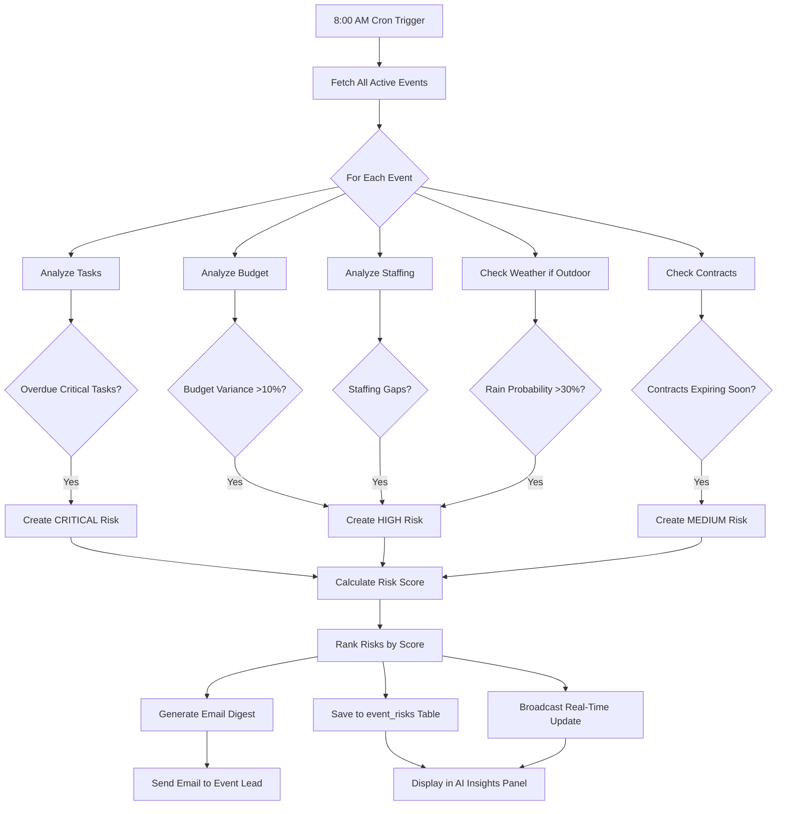
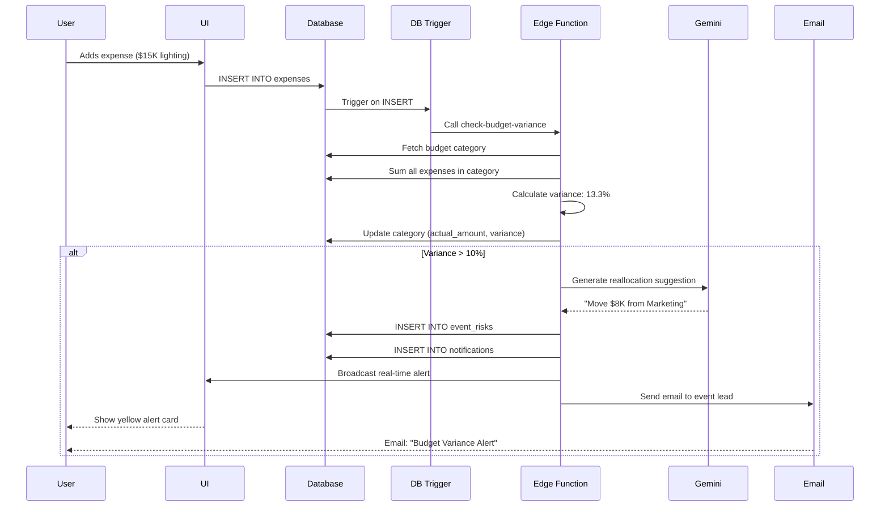

# Task 05: AI Automation & Proactive Intelligence System

**Priority:** 🟡 **P2 - MEDIUM**  
**Estimated Time:** 6-8 hours  
**Owner:** AI Team (Gemini 3 Pro + Edge Functions)  
**Status:** Not Started

---

## 📊 PROGRESS TRACKER

| Phase | Task | Status | Owner | Validation |
|-------|------|--------|-------|------------|
| **AI Core** | Daily risk scanner (Gemini Thinking) | ⚪ | Cursor AI | Runs at 8am daily |
| **AI Core** | Email digest generation | ⚪ | Cursor AI | Emails send correctly |
| **AI Advanced** | Predictive timeline forecasting | ⚪ | Cursor AI | Predictions accurate |
| **AI Advanced** | Weather contingency alerts (Google grounding) | ⚪ | Cursor AI | Weather API works |
| **Automation** | Auto task unlocking on completion | ⚪ | Cursor AI | Dependencies resolve |
| **Automation** | Contract renewal reminders (90-day window) | ⚪ | Cursor AI | Alerts trigger |
| **Automation** | Budget variance real-time alerts | ⚪ | Cursor AI | Triggers at 10% threshold |
| **UI Build** | AI Insights Panel (Command Center) | ⚪ | Figma Make | Cards render |
| **Testing** | Risk scanner accuracy (false positives <10%) | ⚪ | QA | Validated |

**Completion:** 0/9 (0%)

---

## 1. PRODUCT GOAL

**Problem:** Event planners reactive, not proactive. Problems discovered too late (overdue tasks, budget overruns, weather issues). No intelligent system monitoring events 24/7.

**Users:** Event planners who manage multiple events, need AI guardian to catch issues before they escalate.

**Outcome:** Autonomous AI system that scans all active events daily, detects risks (task delays, budget variance, staffing gaps, weather threats), sends prioritized alerts, suggests corrective actions automatically.

**Success:** 80% of risks caught 7+ days before crisis, event planners save 10 hours per week on manual monitoring, budget overruns reduced by 60%.

---

## 2. FEATURE MATRIX

| Feature | Type | Gemini 3 Feature | Trigger | User Value |
|---------|------|------------------|---------|------------|
| **Proactive Risk Scanner** | Core | Gemini Thinking | Daily 8am cron | Early problem detection |
| **Timeline Forecasting** | Advanced | Code Execution + Thinking | Task completion | Predict delays |
| **Budget Variance Alerts** | Core | Code Execution | Expense added | Prevent overruns |
| **Weather Contingency** | Advanced | Google Grounding (weather API) | 7 days before event | Outdoor event backup |
| **Auto Task Unlocking** | Core | None (DB trigger) | Task marked done | Workflow automation |
| **Contract Renewals** | Core | None (scheduled check) | 90 days before expiry | Never miss renewals |
| **Staffing Gap Alerts** | Core | Structured Outputs | Team assignment change | Ensure adequate resources |
| **Smart Notifications** | Advanced | Text Generation | Any risk detected | Actionable alerts |

---

## 3. USER JOURNEYS

### Journey 1: Daily Risk Scan Prevents Crisis

**Flow:**
1. **8:00 AM:** Scheduled Supabase cron triggers `proactive-risk-scanner` edge function
2. **8:01 AM:** Gemini Thinking analyzes all 12 active events:
   - Event A "Milan Fashion Week": 12 tasks overdue, 3 on critical path (CRITICAL severity)
   - Event B "Paris Pop-Up": Budget 15% over in Production category (HIGH severity)
   - Event C "NYC Showcase": Venue contract expires in 25 days (MEDIUM severity)
3. **8:05 AM:** Gemini generates risk digest email for each event lead
4. **8:06 AM:** Sarah (Event A lead) receives email: "🚨 CRITICAL: 3 Critical Path Tasks Overdue - Event at Risk"
5. **9:00 AM:** Sarah opens email, clicks "View Event Dashboard"
6. **9:01 AM:** Lands on Event Command Center, AI Insights Panel shows 3 red alert cards
7. **9:05 AM:** Sarah addresses critical risks:
   - Reassigns overdue "Designer contracts" to assistant (urgent flag)
   - Marks "Venue floor plan" complete (uploads approved PDF)
   - Extends "Lighting design" deadline by 2 days (negotiated with vendor)
8. **9:20 AM:** All 3 critical risks resolved
9. **9:21 AM:** Gemini recalculates event health: 68% → 85% (green status)
10. **9:22 AM:** Sarah receives confirmation email: "All Critical Risks Resolved ✅"

**Result:** Crisis prevented 45 days before event, Sarah saved 2 hours of manual monitoring

---

### Journey 2: Weather Contingency Auto-Alert

**Flow:**
1. **7 Days Before Event:** Outdoor runway show scheduled (venue: rooftop garden, no indoor backup)
2. **Daily Weather Check:** Gemini grounds with Google Weather API
3. **Day 1-5:** Forecast shows 10% rain probability (acceptable, no alert)
4. **Day 6 (4 days before event):** Forecast updated to 40% rain probability
5. **Trigger:** Gemini detects rain probability >30% threshold for outdoor event
6. **Alert Generation:** Creates high-severity risk:
   - Title: "Weather Risk: 40% Rain Forecast"
   - Description: "Outdoor event at risk. Recommend activating indoor backup plan."
   - Recommended Actions: "Contact backup venue, notify attendees of potential location change"
7. **Notification:** Pushes real-time alert to Event Command Center AI Insights Panel (red card)
8. **Email:** Sends email to event lead: "Weather Alert: Activate Contingency Plan"
9. **User Action:** Event lead clicks alert, views contingency options:
   - Option 1: Move to backup venue (indoor theater, 10-minute walk)
   - Option 2: Rent event tent ($5K cost)
   - Option 3: Postpone event by 1 day
10. **User Decision:** Selects Option 1 (backup venue)
11. **System Action:** 
    - Updates event venue in database
    - Sends automated email to all attendees: "Location Change Due to Weather"
    - Creates new tasks: "Update signage", "Coordinate venue move"
12. **Event Day:** Rain occurs (60% by event day), event executes smoothly indoors

**Result:** Disaster avoided, 654 attendees notified seamlessly, zero last-minute chaos

---

### Journey 3: Auto Budget Variance Detection

**Flow:**
1. **Normal State:** Event budget $500K, Production category budgeted $75K
2. **User Action:** Production manager adds expense: "Additional Lighting: $15K"
3. **Database Update:** Production category actual spending: $70K → $85K
4. **Trigger:** Expense update triggers edge function `check-budget-variance`
5. **Calculation:** Variance = ($85K - $75K) / $75K = +13.3%
6. **Threshold Check:** 13.3% > 10% threshold (HIGH severity)
7. **Gemini Analysis:** 
   - Identifies over-budget category: Production
   - Searches for under-budget categories: Marketing 20% under ($40K budgeted, $32K spent)
   - Suggests reallocation: "Move $8K from Marketing to Production"
8. **Alert Delivery:**
   - Real-time push to Command Center AI Insights Panel (yellow warning card)
   - Email to event lead: "Budget Variance Alert: Production 13% Over"
9. **User Action:** Event lead clicks alert, sees:
   - Current variance breakdown
   - Gemini's reallocation suggestion (visualized with before/after charts)
   - One-click "Approve Reallocation" button
10. **User Clicks:** Approve Reallocation
11. **System Action:**
    - Updates budget: Production $83K (+8K), Marketing $32K (no change, saves $8K for later)
    - Recalculates variance: Production now 11% over (acceptable with reallocation approval)
    - Logs audit trail: "Reallocation approved by Sarah on Dec 18"
12. **Alert Resolution:** Yellow card changes to green "Budget Balanced ✅"

**Result:** Budget overrun caught within minutes, resolved before stakeholder panic

---

## 4. AI INSIGHTS PANEL UI DESIGN

### Layout (Bottom of Event Command Center)

```
┌─────────────────────────────────────────────────────────────────┐
│ 🤖 AI Insights & Recommendations (Powered by Gemini)            │
│ Last Updated: 5 minutes ago | [Refresh] [Dismiss All]           │
└─────────────────────────────────────────────────────────────────┘

┌──────────────────┬──────────────────┬──────────────────┐
│ 🔴 CRITICAL      │ 🟡 WARNING       │ 🔵 SUGGESTION    │
├──────────────────┼──────────────────┼──────────────────┤
│ Critical Path    │ Budget Variance  │ Optimize Timeline│
│ Risk Detected    │ Detected         │                  │
│                  │                  │                  │
│ 3 tasks overdue  │ Production 13%   │ Marketing budget │
│ on critical path │ over budget      │ 20% under. Con-  │
│ May delay event  │ ($85K / $75K)    │ sider reallocate │
│ by 5 days        │                  │ to production    │
│                  │                  │                  │
│ Impact: HIGH     │ Impact: MEDIUM   │ Impact: LOW      │
│ Urgency: NOW     │ Urgency: 3 days  │ Urgency: 7 days  │
│                  │                  │                  │
│ ▸ View 3 Tasks   │ ▸ Reallocate $8K │ ▸ See Breakdown  │
│ ▸ Reassign       │ ▸ Review Budget  │ ▸ Ignore         │
└──────────────────┴──────────────────┴──────────────────┘

Insight Card Details (Click to Expand):
┌──────────────────────────────────────────────────────────────┐
│ 🔴 Critical Path Risk Detected                                │
│                                                               │
│ Analysis:                                                     │
│ • Task "Designer contract signatures" overdue 3 days         │
│ • Task "Venue floor plan approval" overdue 1 day             │
│ • Task "Lighting design finalized" overdue 2 days            │
│                                                               │
│ These 3 tasks are on the critical path, meaning any further  │
│ delay will push the entire event timeline back.              │
│                                                               │
│ Recommended Actions:                                          │
│ 1. [Reassign] "Designer contracts" to assistant (urgent)     │
│ 2. [Upload] Venue floor plan (mark complete)                 │
│ 3. [Extend] Lighting design deadline +2 days                 │
│                                                               │
│ If resolved today, event stays on track. If not, risk 5-day  │
│ delay which affects rehearsals and final prep.               │
│                                                               │
│ [Take Action] [View Full Task List] [Dismiss]                │
└──────────────────────────────────────────────────────────────┘
```

**Visual Design:**
- Severity Colors: Red (critical), Yellow (warning), Blue (suggestion)
- Impact Badge: HIGH/MEDIUM/LOW with icon (⚠️ / ⚡ / 💡)
- Urgency Label: "NOW" (red), "3 days" (yellow), "7 days" (blue)
- Action Buttons: Primary CTA large, secondary smaller
- Expand Animation: Smooth accordion (300ms ease-out)
- Dismiss Behavior: Fade out, save to "dismissed_alerts" table

---

## 5. GEMINI 3 AI AUTOMATIONS

### Automation 1: Proactive Risk Scanner (Gemini Thinking)

**Schedule:** Daily at 8:00 AM (Supabase cron)

**Gemini Thinking Process:**
```
For each active event, analyze:

STEP 1: Task Risk Analysis
- Query: SELECT * FROM event_tasks WHERE event_id = X AND status != 'done'
- For each task:
  - Check if deadline < today (overdue)
  - Check if task.is_critical_path = true (critical)
  - Calculate days overdue: today - deadline
- Identify: Overdue critical path tasks (CRITICAL severity)

STEP 2: Budget Risk Analysis
- Query: SELECT * FROM event_budget_categories WHERE event_id = X
- For each category:
  - Calculate variance: (actual - budgeted) / budgeted × 100
  - If variance > 10%: HIGH severity
  - If variance > 20%: CRITICAL severity
- Identify: Over-budget categories with severity

STEP 3: Staffing Risk Analysis
- Query: SELECT * FROM event_team WHERE event_id = X
- Compare: required_roles (from event type template) vs assigned_roles
- Calculate gaps: required_count - assigned_count per role
- If gap > 0: HIGH severity (understaffed)

STEP 4: Contract Risk Analysis
- Query: SELECT * FROM contracts WHERE event_id = X AND status = 'active'
- For each contract:
  - Calculate days_until_expiry: expiration_date - today
  - If days_until_expiry <= 30: MEDIUM severity
  - If days_until_expiry <= 7: HIGH severity

STEP 5: Venue Conflict Analysis
- Query: SELECT * FROM venue_bookings WHERE venue_id = X
- Check for overlapping time slots:
  - If booking A end_time > booking B start_time AND same date: CRITICAL

STEP 6: Weather Risk (for outdoor events)
- If event.venue_type = 'outdoor' AND days_until_event <= 7:
  - Ground with Google Weather API for event location + date
  - If rain_probability > 30%: HIGH severity
  - If rain_probability > 60%: CRITICAL severity

STEP 7: Aggregate and Prioritize
- Combine all risks for event
- Calculate risk_score: Σ(severity × urgency)
- Rank risks by score
- Generate recommended actions per risk

STEP 8: Generate Digest
- Create email body with top 3 risks
- Include risk descriptions, severity badges, CTAs
- Send via email API to event lead
```

**Output (Structured):**
```
{
  "event_id": "abc-123",
  "event_name": "Milan Fashion Showcase",
  "total_risks": 5,
  "critical_risks": 1,
  "high_risks": 2,
  "medium_risks": 2,
  "risks": [
    {
      "category": "tasks",
      "severity": "critical",
      "title": "3 Critical Path Tasks Overdue",
      "description": "Tasks 'Designer contracts', 'Venue floor plan', 'Lighting design' overdue. May delay event 5 days.",
      "impact": "Event timeline at risk",
      "urgency": "Resolve today",
      "recommended_actions": [
        "Reassign 'Designer contracts' to assistant",
        "Upload venue floor plan to mark complete",
        "Extend 'Lighting design' deadline +2 days"
      ],
      "risk_score": 95
    },
    // ... 4 more risks
  ],
  "event_health_score": 68,  // 0-100, lower = more risk
  "confidence": 0.93
}
```

---

### Automation 2: Timeline Forecasting (Code Execution)

**Trigger:** Task status changed to 'done' OR user opens Command Center

**Gemini Code Execution:**
```
Calculate event completion forecast:

Input:
- Total tasks: 150
- Done tasks: 68
- Days since event created: 45
- Days until event: 45

Step 1: Calculate velocity
velocity = done_tasks / days_elapsed
velocity = 68 / 45 = 1.51 tasks per day

Step 2: Project remaining time
remaining_tasks = total_tasks - done_tasks = 82
days_needed = remaining_tasks / velocity = 82 / 1.51 = 54.3 days

Step 3: Compare to deadline
days_until_event = 45
buffer = days_until_event - days_needed = 45 - 54.3 = -9.3 days

Step 4: Determine forecast
if buffer < 0:
  verdict = "LIKELY DELAY"
  delay_days = abs(buffer) = 9.3 days
  confidence = 0.85 (based on velocity consistency)
else:
  verdict = "ON TRACK"
  buffer_days = buffer
  confidence = 0.90

Step 5: Suggest acceleration
if buffer < 0:
  suggest = "Increase velocity to 1.82 tasks/day to meet deadline"
  suggest = "Or reduce scope by 14 tasks (remove low-priority items)"

Return forecast with confidence interval.
```

**Output:**
```
{
  "forecast": "LIKELY DELAY",
  "delay_days": 9.3,
  "confidence": 0.85,
  "current_velocity": 1.51,
  "required_velocity": 1.82,
  "suggestions": [
    "Increase task completion rate by 20% (1.51 → 1.82 tasks/day)",
    "Consider removing 14 low-priority tasks to reduce scope",
    "Assign 2 more team members to accelerate progress"
  ],
  "confidence_interval": "Delay between 7-11 days (80% confidence)"
}
```

**UI Display:**
- Progress bar in Command Center shows forecast: "On Track ✅" (green) or "Delay Risk ⚠️" (red)
- Tooltip explains: "Based on current velocity (1.51 tasks/day), event likely to finish 9 days late"
- Suggestions displayed in AI Insights Panel

---

### Automation 3: Smart Notification Generation (Text Generation)

**Trigger:** Any risk detected (task overdue, budget variance, etc.)

**Gemini Prompt:**
```
Generate user-friendly notification for this event risk:

Risk Type: Budget Variance
Severity: High
Details: Production category 13% over budget ($85K / $75K budgeted)
Event: Milan Fashion Showcase
User Role: Event Lead

Requirements:
- Tone: Professional but calm (avoid panic)
- Length: 2-3 sentences max
- Include: What happened, why it matters, next step
- CTA: Clear action button text

Return Structured Output with:
- notification_title (max 60 chars)
- notification_body (max 200 chars)
- cta_button_text (max 20 chars)
- urgency (low/medium/high)
```

**Gemini Output:**
```
{
  "notification_title": "Budget Alert: Production 13% Over",
  "notification_body": "Production costs exceeded budget by $10K due to additional lighting. Marketing budget has $8K available for reallocation. Review and approve adjustment to stay on track.",
  "cta_button_text": "Review Budget",
  "urgency": "medium",
  "dismiss_allowed": true,
  "expires_in_hours": 72
}
```

**UI Display:**
- Toast notification (bottom-right corner) when risk first detected
- Push to AI Insights Panel as persistent card
- Email notification if urgency = high
- In-app notification badge (red dot on Command Center icon in nav)

---

## 6. SUPABASE EDGE FUNCTIONS

### Edge Function: proactive-risk-scanner

**Cron Schedule:**
```
supabase functions deploy proactive-risk-scanner
supabase secrets set CRON_SCHEDULE="0 8 * * *"  # Daily at 8am UTC
```

**Function Logic:**
```
export const handler = async (req) => {
  // 1. Fetch all active events
  const { data: events } = await supabase
    .from('events')
    .select('*')
    .in('status', ['planning', 'confirmed', 'in_progress']);

  const allRisks = [];

  // 2. For each event, run risk analysis
  for (const event of events) {
    const risks = await analyzeEventRisks(event.id);
    
    if (risks.critical_risks > 0 || risks.high_risks > 0) {
      allRisks.push({
        event,
        risks,
        digest: await generateRiskDigest(event, risks)
      });
    }
  }

  // 3. Send email digests
  for (const item of allRisks) {
    await sendEmailDigest(item.event.created_by, item.digest);
  }

  // 4. Save risks to database (for UI display)
  await saveRisksToDatabase(allRisks);

  // 5. Broadcast real-time updates to connected clients
  await broadcastRiskAlerts(allRisks);

  return { success: true, events_scanned: events.length, risks_found: allRisks.length };
};

async function analyzeEventRisks(eventId) {
  // Call Gemini Thinking API with event data
  const response = await gemini.thinking({
    model: 'gemini-2.0-flash-thinking-exp',
    prompt: buildRiskAnalysisPrompt(eventId),
    max_thinking_time: 30
  });
  
  return response.risks;
}
```

---

### Edge Function: check-budget-variance

**Trigger:** Database trigger on `expenses` table INSERT

**Function Logic:**
```
export const handler = async (req) => {
  const { expense } = req.body;  // New expense added
  
  // 1. Fetch event budget category
  const { data: category } = await supabase
    .from('event_budget_categories')
    .select('*')
    .eq('id', expense.budget_category_id)
    .single();
  
  // 2. Recalculate total actual spending
  const { data: allExpenses } = await supabase
    .from('expenses')
    .select('amount')
    .eq('budget_category_id', category.id);
  
  const totalActual = allExpenses.reduce((sum, e) => sum + e.amount, 0);
  
  // 3. Calculate variance
  const variance = ((totalActual - category.budgeted_amount) / category.budgeted_amount) * 100;
  
  // 4. Update category
  await supabase
    .from('event_budget_categories')
    .update({ 
      actual_amount: totalActual,
      variance_percentage: variance
    })
    .eq('id', category.id);
  
  // 5. If variance > 10%, create alert
  if (variance > 10) {
    await createBudgetAlert({
      event_id: category.event_id,
      category: category.category,
      variance,
      severity: variance > 20 ? 'critical' : 'high'
    });
  }
  
  return { success: true, variance };
};
```

---

### Edge Function: weather-contingency-check

**Schedule:** Daily at 6:00 PM (1 week before events)

**Function Logic:**
```
export const handler = async (req) => {
  // 1. Fetch events in next 7 days with outdoor venues
  const sevenDaysFromNow = new Date();
  sevenDaysFromNow.setDate(sevenDaysFromNow.getDate() + 7);
  
  const { data: events } = await supabase
    .from('events')
    .select('*, venues(*)')
    .eq('venues.type', 'outdoor')
    .lte('start_date', sevenDaysFromNow.toISOString());
  
  // 2. For each event, check weather
  for (const event of events) {
    const weather = await fetchWeatherForecast(
      event.venues.latitude,
      event.venues.longitude,
      event.start_date
    );
    
    // 3. If rain probability > 30%, create alert
    if (weather.rain_probability > 30) {
      await createWeatherAlert({
        event_id: event.id,
        rain_probability: weather.rain_probability,
        severity: weather.rain_probability > 60 ? 'critical' : 'high',
        recommended_action: 'Activate indoor backup plan'
      });
    }
  }
  
  return { success: true };
};

async function fetchWeatherForecast(lat, lon, date) {
  // Ground with Google Weather API (or OpenWeather API)
  const response = await fetch(
    `https://api.openweathermap.org/data/2.5/forecast?lat=${lat}&lon=${lon}&appid=${process.env.WEATHER_API_KEY}`
  );
  
  const data = await response.json();
  
  // Find forecast for event date
  const forecast = data.list.find(f => f.dt_txt.includes(date));
  
  return {
    rain_probability: forecast.pop * 100,  // Probability of precipitation
    temperature: forecast.main.temp,
    conditions: forecast.weather[0].description
  };
}
```

---

## 7. DATABASE SCHEMA ADDITIONS

```
event_risks (new table):
- id (uuid, primary key)
- event_id (uuid, foreign key to events)
- risk_category (enum: tasks, budget, staffing, contracts, venue, weather)
- severity (enum: low, medium, high, critical)
- title (text, e.g., "3 Critical Path Tasks Overdue")
- description (text)
- recommended_actions (jsonb array)
- risk_score (integer, 0-100)
- detected_at (timestamptz)
- resolved_at (timestamptz, nullable)
- dismissed (boolean, default false)

dismissed_alerts (new table):
- id (uuid, primary key)
- user_id (uuid, foreign key to auth.users)
- event_risk_id (uuid, foreign key to event_risks)
- dismissed_at (timestamptz)
- reason (text, optional user note)

notifications (new table):
- id (uuid, primary key)
- user_id (uuid, foreign key)
- event_id (uuid, foreign key, nullable)
- type (enum: risk_alert, task_reminder, contract_renewal, etc.)
- title (text)
- body (text)
- read (boolean, default false)
- created_at (timestamptz)
- expires_at (timestamptz, nullable)
```

---

## 8. MERMAID DIAGRAMS

### Diagram 1: Daily Risk Scan Flow



---

### Diagram 2: Budget Variance Alert System



---

## 9. IMPLEMENTATION PROMPTS

**Prompt 1 (Cursor AI):** "Create Supabase Edge Function proactive-risk-scanner that runs daily at 8am. Fetch all active events, for each event call Gemini Thinking API to analyze tasks (overdue critical path), budget (variance >10%), staffing (gaps), contracts (expiring <30 days), weather (rain >30% for outdoor events). Generate risk digest, save to event_risks table, send email, broadcast real-time."

**Prompt 2 (Cursor AI):** "Create React component AIInsightsPanel.tsx. Fetches event_risks from database, displays 3 cards (red critical, yellow warning, blue suggestion). Each card shows title, description, impact, urgency, recommended actions. Click card expands with full details and action buttons. Subscribes to real-time updates via Supabase."

**Prompt 3 (Cursor AI):** "Add database trigger on expenses table. AFTER INSERT, call check-budget-variance edge function. Function calculates variance (actual - budgeted) / budgeted × 100. If >10%, create event_risk with severity HIGH, call Gemini to suggest reallocation from under-budget categories, send notification."

**Prompt 4 (Figma Make):** "Create AI Insights Panel layout with 3-column grid for risk cards. Red card (critical), yellow (warning), blue (suggestion). Cards have title, description, impact badge (HIGH/MED/LOW), urgency label, action buttons. Expandable accordion for full details. Responsive: stack vertically on mobile."

**Prompt 5 (Cursor AI):** "Create weather-contingency-check edge function. Runs daily at 6pm. Fetches outdoor events in next 7 days, calls OpenWeather API for each event location. If rain_probability >30%, creates event_risk with title 'Weather Risk: X% Rain Forecast', severity HIGH, recommended action 'Activate indoor backup'. Sends email + real-time alert."

---

## 10. ACCEPTANCE TESTS

**Test 1: Risk Scanner Accuracy**  
Given: Event with 3 overdue critical tasks  
When: Daily scan runs at 8am  
Then: Creates CRITICAL risk, sends email, displays red card in AI Insights Panel, includes 3 task names in description

**Test 2: Budget Alert Triggers**  
Given: Budget category at $70K, budgeted $75K  
When: User adds $15K expense (total $85K, 13% over)  
Then: Alert created within 1 second, variance shown as 13.3%, Gemini suggests reallocation, yellow card appears

**Test 3: Weather Contingency**  
Given: Outdoor event in 5 days, rain forecast 45%  
When: Weather check runs at 6pm  
Then: Creates HIGH risk, email sent with subject "Weather Alert", recommended action includes "Activate backup plan"

**Test 4: False Positive Rate**  
Given: 100 test events with known risks  
When: Scanner analyzes all events  
Then: False positive rate <10% (alerts for non-issues), true positive rate >90% (catches real risks)

**Test 5: Real-Time Broadcast**  
Given: Two users viewing same event Command Center  
When: Risk detected, alert created  
Then: Both users see red card appear in AI Insights Panel <1 second, no refresh needed

---

## 11. PRODUCTION CHECKLIST

- [ ] Cron jobs run reliably (verified logs for 7 days)
- [ ] Email delivery >99% (use SendGrid or similar)
- [ ] Risk detection accuracy >90% (validated with test events)
- [ ] False positive rate <10% (no alert fatigue)
- [ ] Real-time alerts arrive <1 second
- [ ] Weather API quota sufficient (500 calls/day)
- [ ] Gemini API rate limits not exceeded (<100 calls/day)
- [ ] Database triggers fire correctly (tested with 100+ expense inserts)
- [ ] Notification expiry works (old alerts auto-dismiss after 7 days)
- [ ] User can dismiss alerts (saves to dismissed_alerts table)

---

**End of Task 05**  
**Next:** Task 06 - Analytics & Reporting