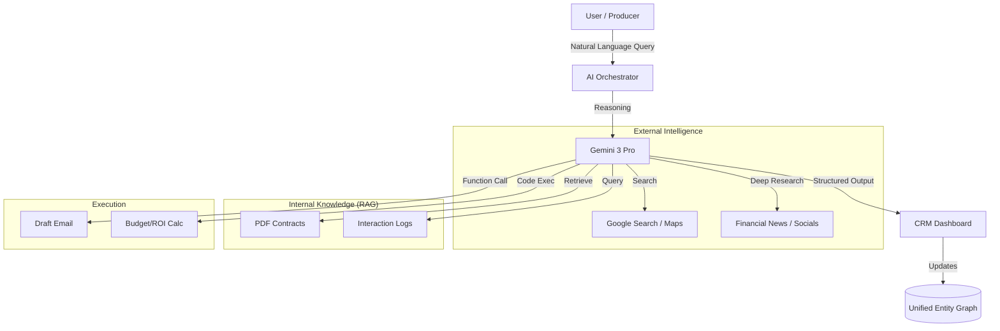

# FashionOS CRM & Stakeholder Intelligence
## Organization Plan & AI Strategy

**Version:** 1.0  
**Context:** Unified Stakeholder Management (Sponsors, Venues, Vendors, Talent, PR)  
**Tech Stack:** Gemini 3 Pro/Flash, Vertex AI, RAG  

---

## 1. CRM Architecture: "The Unified Intelligence Network"

Instead of siloed databases (e.g., a separate list for venues vs. sponsors), FashionOS uses a **Unified Graph Architecture**. Every entity is a node in the network, allowing AI to find hidden connections (e.g., "This photographer has worked with this sponsor before").

### Organization Options

| Option | Approach | Pros | Cons | Recommendation |
| :--- | :--- | :--- | :--- | :--- |
| **Option A: The Rolodex (Traditional)** | Separate tabs for "Sponsors", "Venues", etc. | Familiar to legacy users. | Data silos; hard to see connections. | ❌ No |
| **Option B: The Intelligence Graph (FashionOS)** | One central "Entities" database with dynamic "Lenses" (Views). | AI detects conflicts & opportunities across categories. | Requires smarter UI filtering. | ✅ **YES** |

---

## 2. Stakeholder "Lenses" & Specific AI Features

Each stakeholder type gets a specialized "Lens" that leverages specific Gemini capabilities.

### 🏢 A. Sponsors (The Revenue Engine)
*Focus: Pipeline, ROI, Brand Fit*

| Feature | Gemini Capability | Agent / Automation | Real-World Benefit |
| :--- | :--- | :--- | :--- |
| **Brand Fit Scoring** | **Gemini 3 Pro + Thinking** | *The Strategist* analyzes brand values vs. event theme to score alignment (0-100). | "Gucci is a 94% fit for this eco-gala; Nike is 60%." |
| **Financial Health Check** | **Deep Research** | Scrapes news/reports for recent fiscal performance. | Avoids pitching to brands currently cutting budgets. |
| **Pitch Deck Personalizer** | **Multimodal RAG** | Ingests sponsor's visual style; auto-customizes pitch deck assets. | Sends a deck that looks like *their* brand. |
| **Pipeline Velocity** | **Structured Outputs** | Predicts deal close probability based on email interaction frequency. | Forecasts revenue accurately. |

### 📍 B. Venues (The Canvas)
*Focus: Logistics, Capacity, Location*

| Feature | Gemini Capability | Agent / Automation | Real-World Benefit |
| :--- | :--- | :--- | :--- |
| **Spatial Suitability** | **Grounding w/ Google Maps** | Analyzes loading zones, traffic patterns, and nearby amenities. | "Warning: Loading dock is too small for 30ft truck." |
| **Contract Clause Extraction** | **File Search (RAG)** | Extracts hidden fees, noise restrictions, and overtime rates from PDFs. | Prevents surprise costs. |
| **Virtual Scout** | **Gemini 3 Flash** | Compares 50 venues by capacity & vibe instantly. | "Find me an industrial loft for 200 pax in Brooklyn." |

### 🛠️ C. Vendors (The Crew)
*Focus: Reliability, Cost, Compliance*

| Feature | Gemini Capability | Agent / Automation | Real-World Benefit |
| :--- | :--- | :--- | :--- |
| **Quote Normalizer** | **Code Execution** | Parses diverse quote formats (PDF, Excel, Email) into a standardized comparison table. | "Vendor A is cheaper, but Vendor B includes labor." |
| **Insurance Validator** | **Document Intelligence** | Verifies COI dates and coverage limits automatically. | Zero liability risk on show day. |

### 📢 D. PR & Media (The Amplifier)
*Focus: Reach, Sentiment, Attendance*

| Feature | Gemini Capability | Agent / Automation | Real-World Benefit |
| :--- | :--- | :--- | :--- |
| **Tiered Seating Logic** | **Gemini Thinking** | Ranks editors/influencers by current relevance & competitor conflicts. | "Don't seat Vogue next to a tabloid editor." |
| **Pitch Drafter** | **Text Generation** | Generates 5 unique angle variations for different media verticals. | Higher open rates. |

---

## 3. UI Screens & Intelligence Features

### Screen 1: The "Command Hub" (Dashboard)
*   **Visual:** Kanban board for Sponsors, Map for Venues, List for Talent.
*   **AI Feature:** "Morning Briefing" sidebar—Gemini summarizes all critical stakeholder updates.
    *   *Example:* "Glossier replied to your proposal. Venue contract expires in 2 days."

### Screen 2: The "Entity Detail" (Deep View)
*   **Visual:** Split screen. Left = Profile data. Right = AI Intelligence Panel.
*   **Content:**
    *   **Interaction History:** Emails, calls, meetings (via Interactions API).
    *   **Relationship Web:** "Connected to [Designer X] and [Vendor Y]."
    *   **Smart Actions:** "Draft Follow-up", "Schedule Demo", "Generate Contract".

### Screen 3: "Smart Discovery" (Search)
*   **Visual:** Natural language search bar.
*   **Input:** "Find sustainable caterers in Milan under €50/head."
*   **Backend:** **URL Context Tool** searches live web + internal database.

---

## 4. Sample Data & AI Output

**Input:** User uploads a PDF sponsorship contract from "LuxeBrands Inc."

**AI Agent (Gemini 3 Pro + RAG) Output:**
```json
{
  "entity": "LuxeBrands Inc.",
  "type": "Sponsor",
  "status": "Contract Received",
  "analysis": {
    "risk_score": "High",
    "flags": [
      "Exclusivity clause conflicts with existing 'EcoWater' partnership.",
      "Payment terms are Net-60 (Standard is Net-30)."
    ],
    "recommendation": "Request amendment to Clause 4.2 regarding beverage exclusivity."
  },
  "next_action": {
    "type": "Draft Email",
    "context": "Negotiate payment terms"
  }
}
```

---

## 5. Benefits of AI in CRM

1.  **Zero Data Entry:** Interactions API auto-logs emails and calls.
2.  **Conflict Prevention:** Graph reasoning spots competitor conflicts (Sponsors) or schedule conflicts (Talent).
3.  **Leverage Negotiation:** "Vendor X charges 15% less for this service"—AI empowers the producer.
4.  **Institutional Memory:** Even if a staff member leaves, the relationship history stays perfect.

---

## 6. Technical Workflow (Mermaid)



---

## 7. Next Steps for Implementation

1.  **Database Schema:** Create the `Entity` table with `type` (Sponsor, Venue, etc.) and `metadata` (JSONB) columns.
2.  **RAG Setup:** Configure Vertex AI Search for contract PDF indexing.
3.  **UI Build:** Implement the "Sponsor CRM" dashboard using the provided visual reference.
