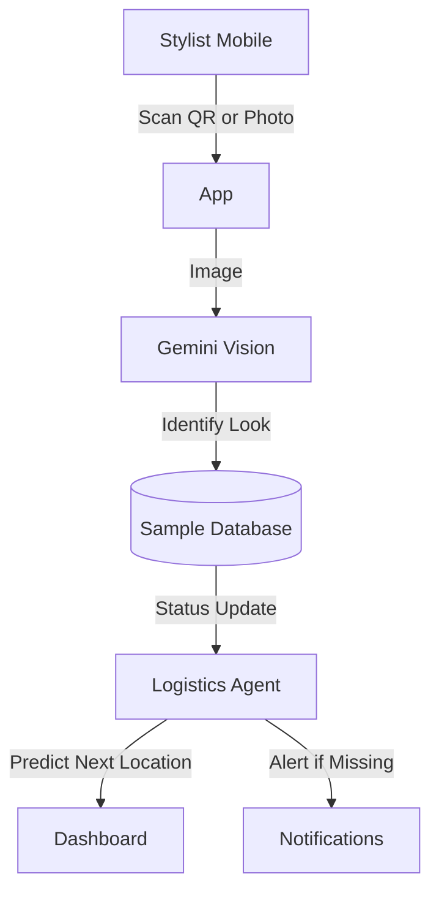
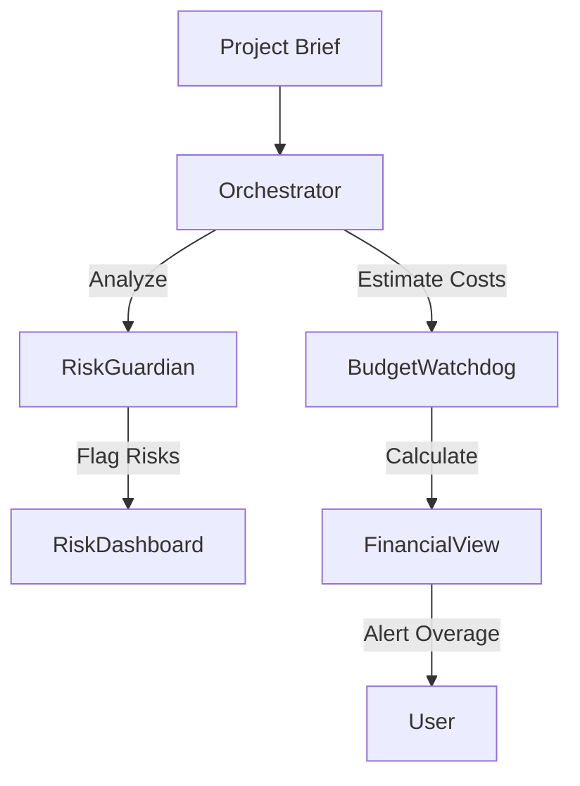
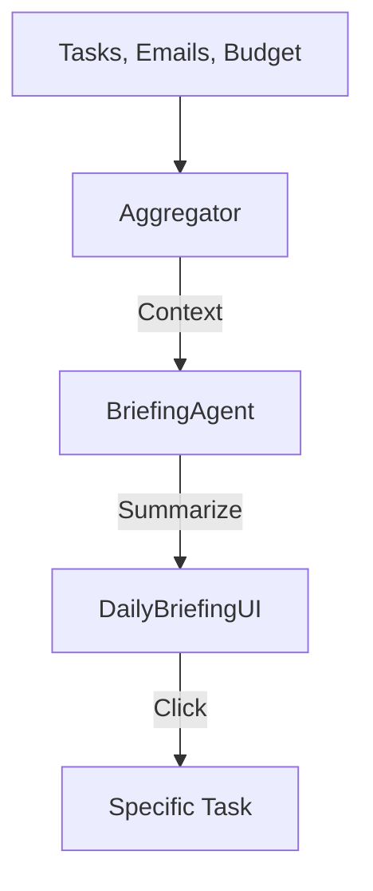
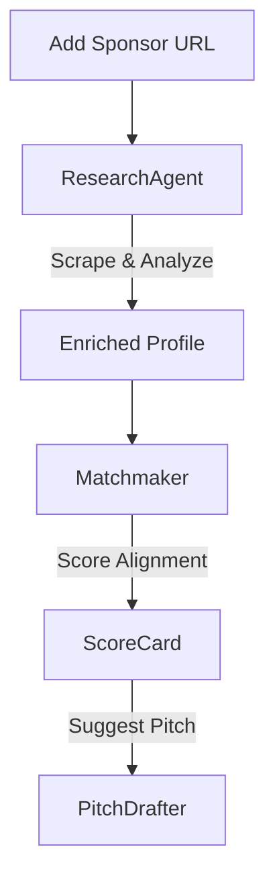

# FashionOS AI Feature Implementation Guide
## Multistep Design Prompts & Architecture

**Version:** 1.0  
**Focus:** Implementing High-Value AI Features (Gemini 3 Powered)  
**Target:** production-ready UI/UX, responsive layouts, and agentic workflows.

This document contains **ready-to-use multistep prompts** for engineers and designers to build the core AI modules of FashionOS. Each section includes the architecture, user journey, and specific prompts to generate the code.

---

## 1. Feature: The "Digital Trunk" (Sample Tracking)
**Value:** Prevents loss of one-of-a-kind couture samples. Mobile-first focus.

### 🧠 AI Architecture
*   **Vision Agent (Gemini 3 Pro Vision):** Identifies garments from photos if tags are missing.
*   **Logistics Agent (Gemini 3 Flash):** Fast status updates and "Last Seen" prediction.

### 🧜‍♂️ Workflow (Mermaid)

### 🤖 Multistep Implementation Prompts

#### Step 1: UI/UX & Responsive Layout
> **Prompt:** "Create a mobile-first 'Digital Trunk' interface in `src/components/production/SmartSampleTracker.tsx`.
>
> **Requirements:**
> *   **Layout:** A sleek, scanner-focused view. Top 50% is a camera viewfinder placeholder. Bottom 50% is a swipeable drawer of 'Recent Scans'.
> *   **Components:** Use `lucide-react` for icons (Scan, History, Alert). Use ShadCN `Drawer` and `Card`.
> *   **Visuals:** 'Calm Luxury' aesthetic—minimalist, dark mode friendly. High-contrast scanning frame.
> *   **Responsive:** On desktop, this transforms into a grid view of all samples with status badges (In Transit, On Rack, Missing).
> *   **Data:** Mock a list of 5 samples (Dress, Shoes, Bag) with images and current status."

#### Step 2: Logic & State
> **Prompt:** "Implement the state machine for the Digital Trunk.
>
> **Requirements:**
> *   Create a Zustand store `useSampleStore` with actions: `scanItem`, `updateStatus`, `flagMissing`.
> *   Define Types: `Sample` (id, image, current_location, last_scanned_by, rfid_tag).
> *   Add a 'Check-In/Check-Out' logic toggle.
> *   Mock the scanning process: Clicking 'Scan' waits 1s then randomly returns a successful match or a 'Unknown Item' error."

#### Step 3: AI Vision Integration
> **Prompt:** "Connect the Digital Trunk to Gemini 3 Pro Vision for item identification.
>
> **Requirements:**
> *   Create a server action `identifyGarment(imageBase64)`.
> *   **System Instruction:** 'You are a fashion archivist. Analyze this image and match it to the collection. Return the Look ID and condition (e.g., stained, wrinkled).'
> *   **UI:** When a photo is taken, show a 'Analyzing Fabric...' skeleton state.
> *   **Fallback:** If recognition fails, offer manual search by Look #."

---

## 2. Feature: AI Budget & Risk Orchestrator
**Value:** Predicts financial leaks before they happen.

### 🧠 AI Architecture
*   **Risk Guardian (Gemini 3 Pro + Thinking):** Deep reasoning on contract clauses and logistical dependencies.
*   **Budget Watchdog (Code Execution):** Calculates real-time variances.

### 🧜‍♂️ Workflow (Mermaid)

### 🤖 Multistep Implementation Prompts

#### Step 1: The "Orchestrator" Dashboard UI
> **Prompt:** "Create the 'Budget & Risk Orchestrator' view in `src/components/commerce/BudgetWatchdog.tsx`.
>
> **Requirements:**
> *   **Hero Section:** A 'Financial Health' HUD showing Total Budget, Spent, and *Projected Variance* (in red if over).
> *   **Main Content:** Two columns. Left: 'Line Items' (collapsible tables). Right: 'AI Risk Insights' (Card stack).
> *   **Visuals:** Use progress bars for category caps (Venue, Talent, Catering). Use color-coding (Green/Amber/Red) for risk levels.
> *   **Interactivity:** Hovering over a risk (e.g., 'Overtime Risk') highlights the affected budget lines."

#### Step 2: AI Reasoning Agents
> **Prompt:** "Implement the `analyzeBudgetRisk` function using Gemini 3 Pro Thinking.
>
> **Requirements:**
> *   **Input:** Current budget JSON + Project Timeline.
> *   **Logic:** AI must reason: 'If load-in is tight (2 hours), overtime labor is highly likely.'
> *   **Output:** Return a JSON array of risks: `{ severity: 'High', message: '...', cost_impact: 5000 }`.
> *   **UI Integration:** Display these structured alerts in the 'Risk Insights' panel created in Step 1."

---

## 3. Feature: Event Command Center (Home)
**Value:** The "Morning Coffee" dashboard for the Event Director.

### 🧠 AI Architecture
*   **Briefing Agent (Text Generation):** Synthesizes updates into a natural language summary.
*   **Interactions API:** Pulls latest emails/messages to inform the summary.

### 🧜‍♂️ Workflow (Mermaid)

### 🤖 Multistep Implementation Prompts

#### Step 1: Visual Layout & Hierarchy
> **Prompt:** "Design the `EventCommandCenter` in `src/components/events/EventCommandCenter.tsx`.
>
> **Requirements:**
> *   **Header:** 'Good Morning, [Name]. Here is your show status.'
> *   **Section 1: The AI Briefing.** A paper-styled card with typewriter text effect for the daily summary.
> *   **Section 2: Critical Metrics.** 4 Cards: Days to Go, RSVPs, Budget, Blockers.
> *   **Section 3: The 'War Room' Map.** A visual map of the venue showing active zones (Setup, Backstage, FOH).
> *   **Responsiveness:** On mobile, the Map hides, and the Briefing takes full focus."

#### Step 2: The "Daily Briefing" Generation
> **Prompt:** "Implement the `generateDailyBriefing` server action.
>
> **Requirements:**
> *   **Context Retrieval:** Fetch the top 5 overdue tasks, recent budget changes, and unread VIP messages.
> *   **Gemini Prompt:** 'Synthesize these data points into a succinct, executive-style paragraph. Tone: Calm, professional, urgent only if necessary.'
> *   **Streaming:** Stream the text response to the UI for a premium feel."

---

## 4. Feature: Sponsor CRM "Lens"
**Value:** Intelligent relationship management.

### 🧠 AI Architecture
*   **Research Agent (Deep Research):** Background checks on brands.
*   **Matchmaker (Gemini 3 Pro):** Scores brand alignment.

### 🧜‍♂️ Workflow (Mermaid)

### 🤖 Multistep Implementation Prompts

#### Step 1: CRM Interface & "Smart Add"
> **Prompt:** "Build the 'Sponsor Intelligence Hub' in `src/components/sponsors/SponsorDetail.tsx`.
>
> **Requirements:**
> *   **Input:** A simple URL input field 'Add Sponsor Website'.
> *   **Layout:** When added, render a 'Brand Profile Card' with auto-fetched Logo, Description, and recent News.
> *   **Tabs:** Overview, Contacts, Contract (PDF viewer), AI Insights.
> *   **Best Practices:** Use `react-hook-form` for the data, but pre-fill it via AI."

#### Step 2: The Alignment Score
> **Prompt:** "Create the 'Brand Alignment Visualizer'.
>
> **Requirements:**
> *   **Visual:** A radar chart (Recharts) comparing Event Values vs. Sponsor Values (e.g., Sustainability, Luxury, Gen-Z).
> *   **AI:** Gemini extracts values from the sponsor's URL and compares them to our Event Brief.
> *   **Output:** A 0-100 'Match Score' with a text explanation: 'High match due to shared focus on upcycling.'
> *   **Action:** Add a 'Generate Pitch' button that uses this alignment data."

---

## Routes & Navigation Structure

Ensure these new pages are accessible:

*   `/events/[id]/dashboard` (Command Center)
*   `/events/[id]/trunk` (Digital Trunk)
*   `/events/[id]/budget` (Risk Orchestrator)
*   `/events/[id]/sponsors` (CRM)

**Navigation:** Add these to the `Sidebar.tsx` under the "Event Management" group.
