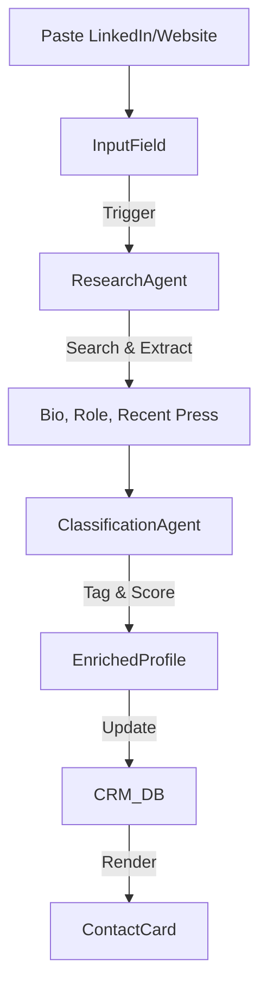
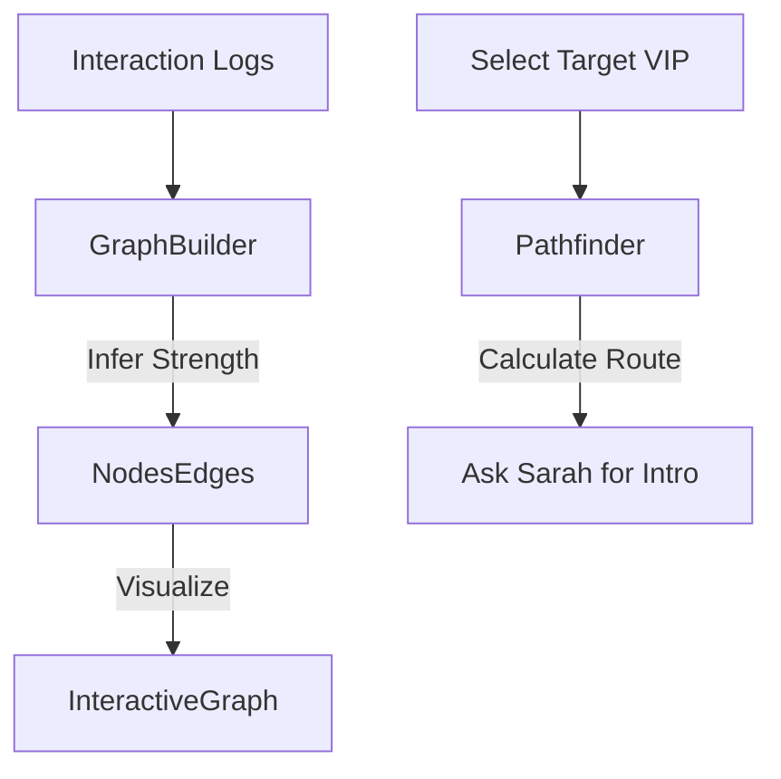
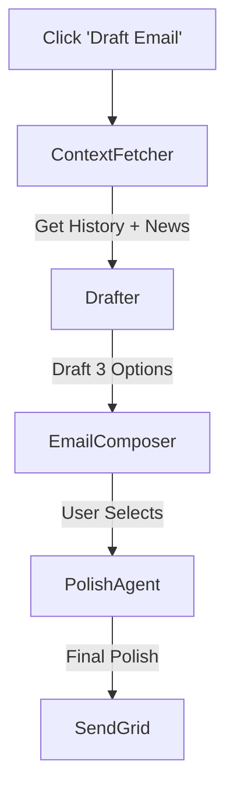
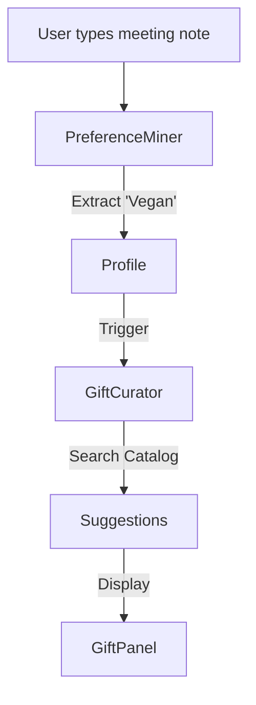

# FashionOS CRM Intelligence & Enrichment Guide
## Multistep Prompts for Contact Enrichment & Advanced Relationships

**Version:** 1.0  
**Focus:** Transforming a static database into a "Living Relationship Engine."  
**Target:** High-touch, luxury relationship management powered by Gemini 3.

This document details the prompts required to build the specific "Enrichment" and "Intelligence" layers of the CRM.

---

## 1. Feature: "Deep Profile" Enrichment
**Value:** Eliminates manual data entry. Turns a simple email or LinkedIn URL into a full dossier.

### 🧠 AI Architecture
*   **Research Agent (Gemini Deep Research):** Scrapes public bio data, recent news, and brand affiliations.
*   **Classification Agent (Gemini 3 Flash):** Tags contacts (e.g., "Buyer", "Press", "VIP Talent") and assigns a "Priority Tier."

### 🧜‍♂️ Workflow

### 🤖 Multistep Implementation Prompts

#### Step 1: The "Smart Entry" UI
> **Prompt:** "Create the `SmartContactInput` component in `src/components/crm/SmartContactInput.tsx`.
>
> **Requirements:**
> *   **Visual:** A single, elegant input field centered on a 'glass' card. Placeholder: 'Paste LinkedIn URL, Website, or Email...'.
> *   **Feedback:** When scraping, show a 'Researching...' animation (subtle pulsing glow).
> *   **Result Preview:** Display a 'Ghost Card' that fills in data (Avatar, Name, Title, Company) as it arrives.
> *   **Actions:** 'Confirm & Save' or 'Edit Manually' buttons.
> *   **Style:** Calm Luxury—lots of whitespace, serif fonts for names, sans-serif for metadata."

#### Step 2: Enrichment Logic
> **Prompt:** "Implement the `enrichContactProfile` server action using Gemini Deep Research.
>
> **Requirements:**
> *   **Input:** A URL string.
> *   **System Instruction:** 'You are a luxury PR assistant. Given this URL, extract: Full Name, Current Title, Company, Bio Summary (2 sentences), and Social Handles. Also, identify their likely industry role (Buyer, Editor, Influencer).'
> *   **Output:** Return a JSON object matching the `Contact` schema.
> *   **Mocking:** Since we can't scrape live LinkedIn, mock the response for specific test URLs."

---

## 2. Feature: The Intelligence Graph (Who Knows Who)
**Value:** Visualizes hidden connections to leverage warm introductions.

### 🧠 AI Architecture
*   **Graph Builder (Gemini 3 Pro Thinking):** Analyzes interaction history and shared events to infer connection strength.
*   **Pathfinder (Code Execution):** Calculates the shortest path between the User and a Target VIP.

### 🧜‍♂️ Workflow

### 🤖 Multistep Implementation Prompts

#### Step 1: The Network Visualization UI
> **Prompt:** "Build the `NetworkGraph` view in `src/components/crm/NetworkGraph.tsx`.
>
> **Requirements:**
> *   **Library:** Use `react-force-graph` or a customized `recharts` scatter plot.
> *   **Visuals:** Nodes are user avatars. Edges are lines with varying thickness (thick = strong relationship).
> *   **Interactivity:** Clicking a node opens a sidebar 'Relationship Summary'. Hovering highlights direct connections.
> *   **Design:** Dark mode optimized. Nodes should glow slightly.
> *   **Responsiveness:** On mobile, switch to a list view: 'Strongest Connections to [Target]'."

#### Step 2: Connection Strength Logic
> **Prompt:** "Create the logic to calculate 'Connection Strength' scores.
>
> **Requirements:**
> *   **Algorithm:** 
>     *   Meeting = 10 pts
>     *   Email = 2 pts
>     *   Event Attendance = 5 pts
> *   **Decay:** Scores decay by 10% every month without contact.
> *   **AI Overlay:** Use Gemini to parse email tone. If tone is 'Warm', apply a 1.5x multiplier. If 'Tense', apply 0.5x."

---

## 3. Feature: "Calm" Outreach Assistant
**Value:** Writes hyper-personalized emails that don't sound like AI.

### 🧠 AI Architecture
*   **Tone Guardian (Gemini 3 Pro):** Enforces the "Calm Luxury" voice (concise, polite, exclusive).
*   **Context Retrieval (RAG):** Pulls up past conversations and the recipient's recent news.

### 🧜‍♂️ Workflow

### 🤖 Multistep Implementation Prompts

#### Step 1: The Composer UI
> **Prompt:** "Design the `SmartComposer` drawer in `src/components/crm/SmartComposer.tsx`.
>
> **Requirements:**
> *   **Layout:** Split screen. Left: Context (Last meeting notes, their recent tweets). Right: Editor.
> *   **Quick Actions:** Chips for 'Invite to Show', 'Thank You', 'Catch Up'.
> *   **Visuals:** Minimalist text area. No toolbar clutter. 'Magic Wand' icon for AI rewrite.
> *   **Tone Slider:** A slider component to adjust tone: 'Formal' <-> 'Casual'."

#### Step 2: AI Drafting Logic
> **Prompt:** "Implement the `generateDraft` function.
>
> **Requirements:**
> *   **Inputs:** Recipient Name, Goal (e.g., 'Invite'), Key Details (e.g., 'Paris Fashion Week').
> *   **Prompt Engineering:** 'Draft a short, elegant email. Avoid buzzwords. Use a warm, professional tone suitable for the fashion industry. Reference [Recent News] if available.'
> *   **Output:** Stream the text into the editor."

---

## 4. Feature: Gifting & Preferences Engine
**Value:** Tracks sizes, allergies, and style preferences for perfect gifting.

### 🧠 AI Architecture
*   **Preference Miner (Gemini 3 Flash):** Extracts preferences from unstructured notes (e.g., "She mentioned she hates velvet").
*   **Gift Curator (Gemini 3 Pro Vision):** Suggests items from the catalog based on personal style.

### 🧜‍♂️ Workflow

### 🤖 Multistep Implementation Prompts

#### Step 1: Preferences UI
> **Prompt:** "Create the `PreferencesProfile` section in the Contact Detail view.
>
> **Requirements:**
> *   **Categories:** Clothing Sizes (Grid), Dietary (Tags), Aesthetics (Image Moodboard).
> *   **Visuals:** Elegant tag designs. For sizes, show a standard size chart with their specific size highlighted.
> *   **AI Insight:** A 'Detected Preferences' alert: 'Based on last lunch, added *Gluten-Free* to tags.'"

#### Step 2: The Gift Curator
> **Prompt:** "Implement the `suggestGifts` component.
>
> **Requirements:**
> *   **Logic:** Match Contact Tags (e.g., 'Loves Minimalist') with Product Tags in the Inventory DB.
> *   **UI:** A horizontal scroll of 3 curated product cards.
> *   **Why:** Each card must explain *why* it was chosen: 'Matches her preference for silver hardware.'"

---

## Routes & Navigation

*   `/crm/contacts` (List)
*   `/crm/contacts/[id]` (Enriched Profile)
*   `/crm/graph` (Intelligence Graph)
*   `/crm/outreach` (Campaign Manager)

**Add to Sidebar:** "Relationships" section.
