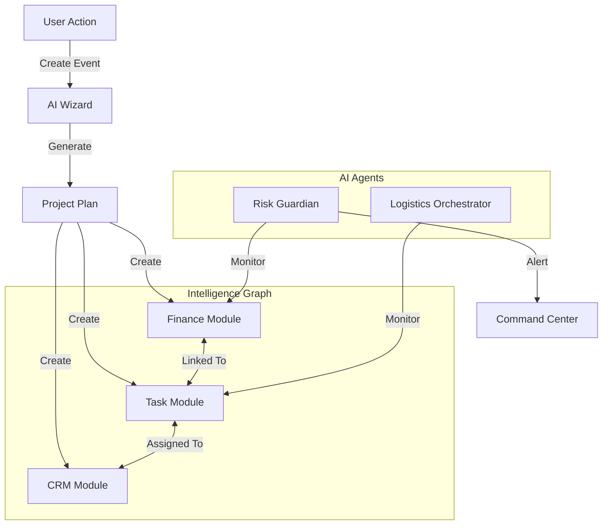

# FashionOS Strategic Architecture & AI Orchestration
## The "Calm Luxury" Operating System

**Version:** 1.0
**Focus:** Holistic System Architecture, UI Strategy, and AI Integration
**Philosophy:** "Complexity is for the machine. Calm is for the user."

This document outlines the high-level strategy for organizing the massive functionality of FashionOS (CRM, Events, Finance, Media, etc.) into a cohesive, intelligent experience using Gemini 3.

---

## 1. The Interface Strategy: "Contextual Depth"

To manage the complexity without overwhelming the user, we employ a **"Contextual Sidebar"** and **"Work Drawer"** architecture.

### 📐 Navigation Layout
| Component | Position | Behavior | Content |
| :--- | :--- | :--- | :--- |
| **Global Rail** | Far Left (Slim) | Always visible. Icons only. | **App Switcher:** Events, CRM, Finance, Media, Admin. |
| **Context Rail** | Left (Expandable) | Changes based on App. | **Module Nav:** e.g., Inside 'Event A': Overview, Run of Show, Guests, Budget. |
| **The Stage** | Center (Fluid) | Main workspace. | Dashboard, Kanban, Document Editor, Grid. |
| **The "Assistant Drawer"** | Right (Collapsible) | Slide-over. AI-driven. | **Gemini Copilot:** "Draft Contract," "Find Conflict," "Summary." Context-aware actions. |

### 🧙‍♂️ The "Wizard" Pattern
Never present a blank screen. Use **AI Wizards** to bootstrap complex objects.
*   **Event Wizard:** "I'm planning a Gala in Paris for 200 people." -> *Generates full Budget, Gantt Chart, and Venue Shortlist.*
*   **Shoot Wizard:** Upload a Moodboard -> *Generates Shot List, Equipment Needs, and Call Sheet.*

---

## 2. The Intelligence Graph (Data Backbone)

FashionOS does not use siloed lists. It uses an **Intelligence Graph**.
*   **Standard App:** A Vendor is just a name in a list.
*   **FashionOS:** A **Vendor** is a node connected to:
    *   **Contracts** (Legal Module)
    *   **Invoices** (Finance Module)
    *   **Tasks** (Project Module)
    *   **Events** (The "Venue" they are managing)

### 🧜‍♂️ Data Flow Diagram


---

## 3. Core Modules & AI Agent Integration

How the modules work together, powered by specific Gemini capabilities.

### A. CRM & Relationships (The "Rolodex")
*   **Purpose:** Manage Sponsors, VIPs, Talent, and Vendors.
*   **AI Agent:** **Enrichment Bot (Deep Research)**.
*   **Workflow:**
    1.  User inputs "Chanel" as a sponsor.
    2.  **Enrichment Bot** scrapes recent press, decision-maker names, and brand values.
    3.  **Matchmaker Agent** suggests: "Pitch the 'Sustainability' package based on their recent press release."

### B. Events & Production (The "Stage")
*   **Purpose:** Timeline, Run of Show, Venue, Logistics.
*   **AI Agent:** **Logistics Orchestrator (Gemini 3 Pro)**.
*   **Workflow:**
    1.  User drags "Sound Check" to 14:00.
    2.  **Logistics Agent** checks constraints: "Alert: Talent flight lands at 13:50. Too tight."
    3.  **Auto-Fix:** Suggests moving Sound Check to 15:30.

### C. Finance & Legal (The "Vault")
*   **Purpose:** Budgets, Invoices, Contracts.
*   **AI Agent:** **Risk Guardian (Thinking Mode)**.
*   **Workflow:**
    1.  Contract uploaded (PDF).
    2.  **Guardian** extracts payment terms ("Net 30") and adds them to the **Finance Calendar**.
    3.  If budget line > 80% utilized, **Guardian** alerts the Event Director.

### D. Media & Assets (The "Look")
*   **Purpose:** Photo shoots, Asset approval, Digital Trunk.
*   **AI Agent:** **Visual Curator (Gemini 3 Vision)**.
*   **Workflow:**
    1.  Photographer uploads 500 raw images.
    2.  **Visual Curator** tags them (e.g., "Backstage," "Runway," "Shoes").
    3.  **Quality Check:** Flags blurry images or low-res files.

---

## 4. User Journeys (The "Golden Threads")

These journeys traverse multiple modules.

### Journey 1: The "Sponsor Activation" Thread
1.  **CRM:** User identifies "Tech Giant X". AI enriches profile.
2.  **Docs:** User clicks "Draft Proposal". AI generates a deck based on Event Theme + Sponsor Values.
3.  **Finance:** Contract signed. AI auto-creates "Income" entry in Budget.
4.  **Tasks:** AI auto-generates tasks: "Collect Logos," "Approve Booth Design."
5.  **Events:** Logistics Agent blocks floor space for the booth on the Venue Map.

### Journey 2: The "Emergency Change" Thread
1.  **Events:** Venue reports a power outage in Zone B.
2.  **Command Center:** User logs "Issue: Power Outage."
3.  **AI Orchestrator:**
    *   Finds affected Tasks (Lighting Setup).
    *   Finds affected Vendors (AV Company).
    *   **Action:** Drafts SMS alerts to key stakeholders.
    *   **Action:** Recalculates Timeline delay.

---

## 5. Technical Implementation Strategy

### 🧱 State Management
*   Use a **Unified Store** (Zustand) for UI state (Sidebar open/close, Wizard step).
*   Use **Supabase Realtime** for Data state (Syncing edits across users).

### 🤖 The AI Dispatcher
Do not hardcode AI calls. Create a central `useAI` hook.
```typescript
// Example: The central brain
const response = await aiDispatcher.execute({
  intent: "analyze_risk",
  context: { budget, timeline },
  model: "gemini-3-pro-thinking" // Route to the best model for the job
});
```

---

## 6. Next Steps for Implementation

1.  **Scaffold the Layout:** Build the `AppShell` with the Global Rail, Context Rail, and AI Drawer.
2.  **Build the "Brain":** Set up the `aiDispatcher` service to handle different Gemini models.
3.  **Create the "Event Wizard":** The first "Wow" moment for the user.
4.  **Connect CRM to Finance:** Implement the "Contract -> Budget" automated flow.
