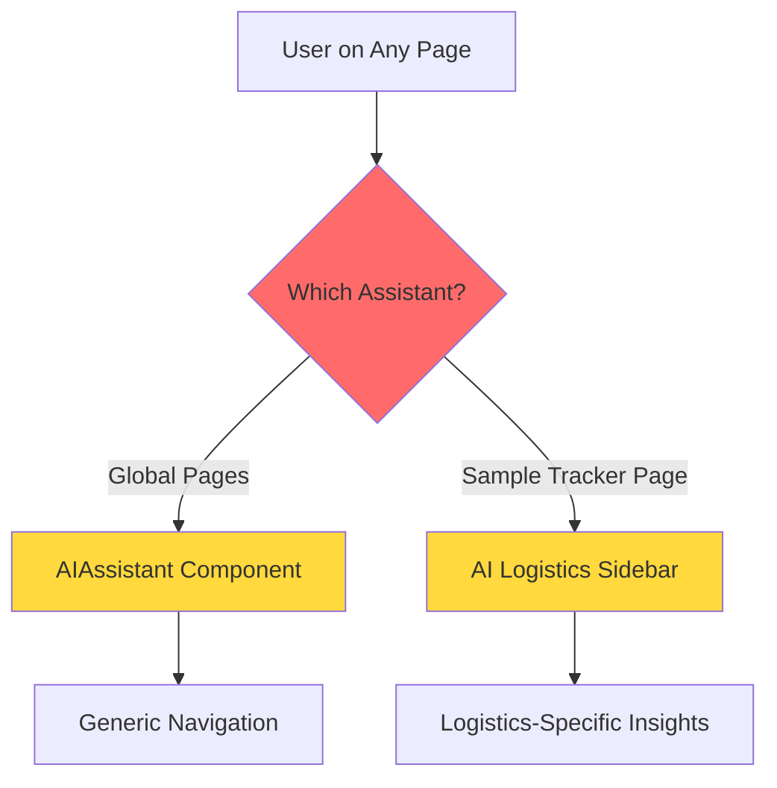
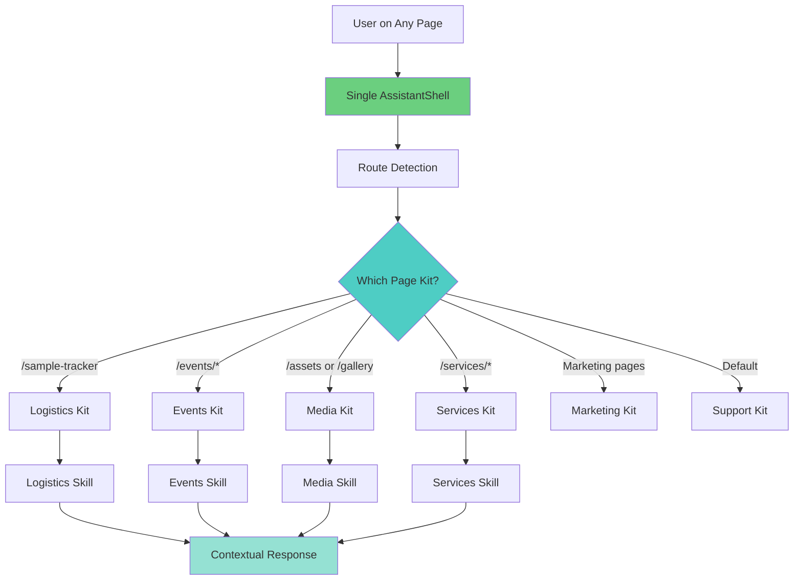
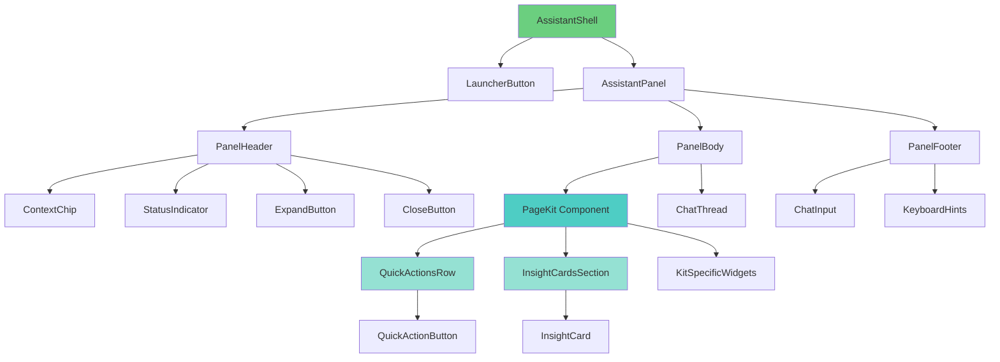
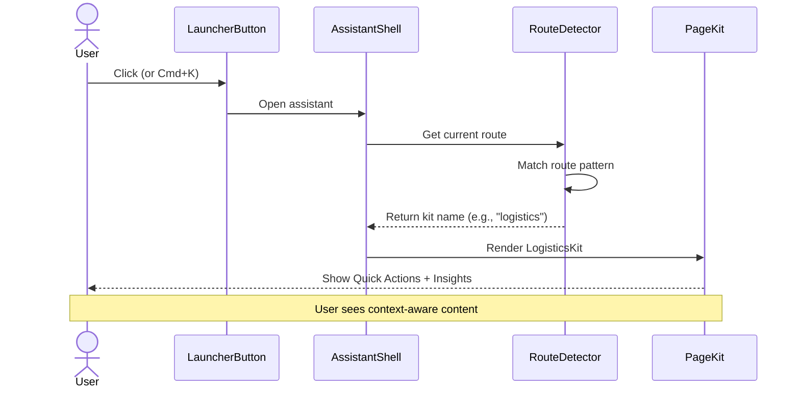
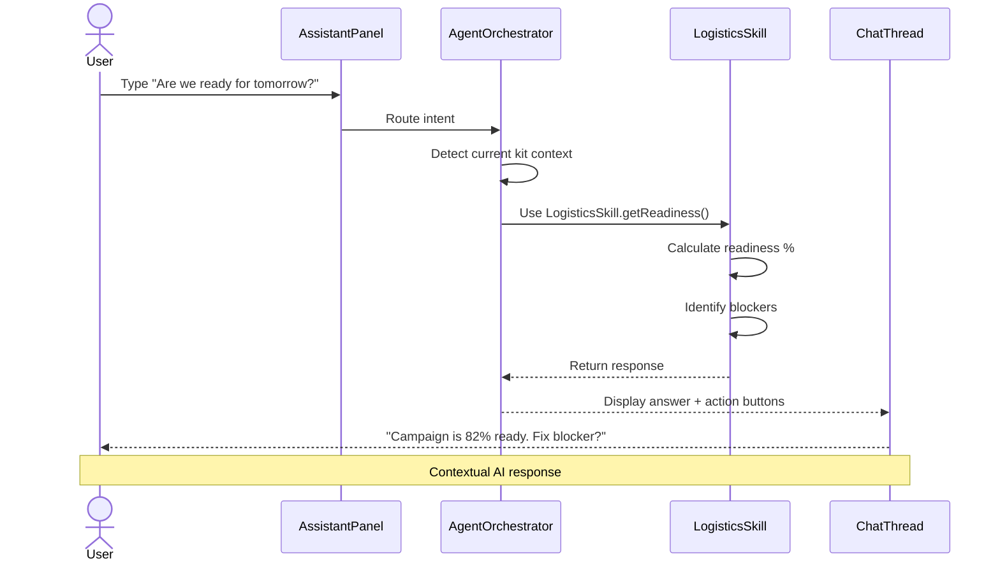
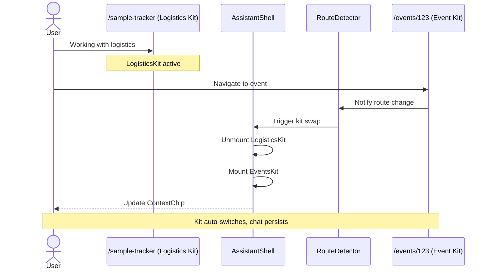
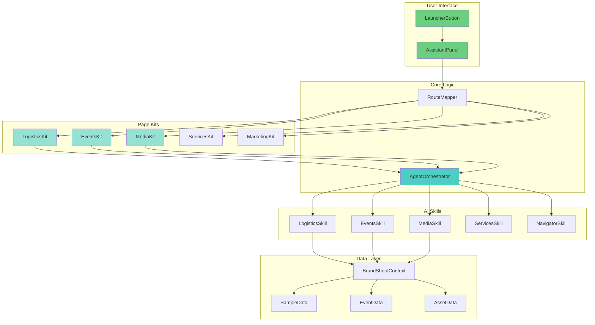
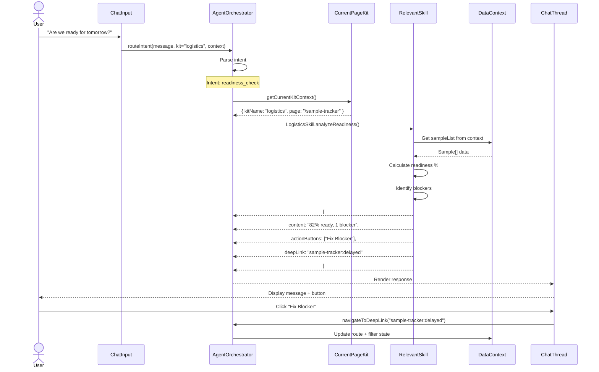
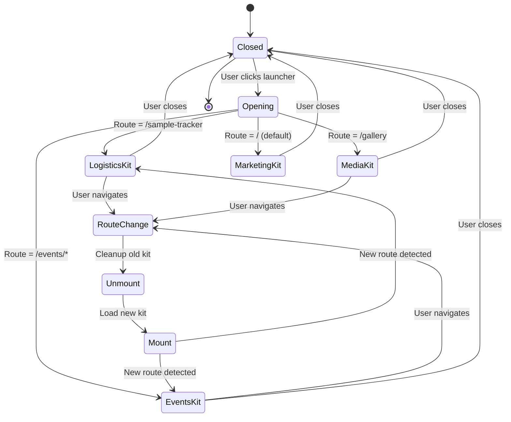

# 🤖 FashionOS Single-Chatbot Architecture Plan

**Feature:** Context-Aware Unified AI Assistant  
**Status:** 🔴 Planning Phase  
**Priority:** P0 (Critical UX Consolidation)  
**Estimated Effort:** 3 sprints (6 weeks)

---

## 📊 PROGRESS TRACKER

### **Sprint 1: Foundation (Weeks 1-2)**
- [ ] **Task 1.1:** Create AssistantShell base component
- [ ] **Task 1.2:** Implement Page Kit architecture
- [ ] **Task 1.3:** Build route → kit mapping system
- [ ] **Task 1.4:** Design & implement Kit switcher logic
- [ ] **Task 1.5:** Create LauncherButton component
- [ ] **Task 1.6:** Test basic navigation flow

**Acceptance Criteria:** ✅ Single assistant opens on all pages, shows correct context chip

---

### **Sprint 2: Page Kits (Weeks 3-4)**
- [ ] **Task 2.1:** Build Logistics Kit (replace AI Logistics sidebar)
- [ ] **Task 2.2:** Build Events Kit
- [ ] **Task 2.3:** Build Media/Assets Kit
- [ ] **Task 2.4:** Build Services Kit
- [ ] **Task 2.5:** Build Marketing Kit (default)
- [ ] **Task 2.6:** Build Support Kit
- [ ] **Task 2.7:** Implement Quick Actions system
- [ ] **Task 2.8:** Implement Insight Cards system
- [ ] **Task 2.9:** Test all kits on respective pages

**Acceptance Criteria:** ✅ All 6 primary kits functional, showing contextual content

---

### **Sprint 3: AI Skills & Polish (Weeks 5-6)**
- [ ] **Task 3.1:** Refactor AI agent routing (Orchestrator pattern)
- [ ] **Task 3.2:** Create Logistics Skill module
- [ ] **Task 3.3:** Create Events Skill module
- [ ] **Task 3.4:** Create Media Skill module
- [ ] **Task 3.5:** Create Services Skill module
- [ ] **Task 3.6:** Implement deep-linking system
- [ ] **Task 3.7:** Mobile responsive optimization
- [ ] **Task 3.8:** Keyboard shortcuts (Cmd+K, etc.)
- [ ] **Task 3.9:** Remove old AIAssistant & AI Logistics sidebar
- [ ] **Task 3.10:** Production testing & bug fixes

**Acceptance Criteria:** ✅ AI responds contextually, deep links work, old code removed

---

## 🎯 PRODUCTION READY CHECKLIST

### **Code Quality**
- [ ] All TypeScript types defined
- [ ] No ESLint warnings
- [ ] Components follow FashionOS design system
- [ ] Proper error handling
- [ ] Loading states implemented
- [ ] Accessibility (WCAG 2.1 AA)

### **Functionality**
- [ ] Single launcher button on all pages
- [ ] Correct Kit loads per route
- [ ] Quick Actions trigger correct behaviors
- [ ] Insight Cards show live data
- [ ] Deep links navigate correctly
- [ ] AI responses are contextual
- [ ] Cmd+K shortcut works globally

### **Performance**
- [ ] Kit switching <50ms
- [ ] No memory leaks (component unmount cleanup)
- [ ] Lazy load AI skills
- [ ] Chat history persists per session
- [ ] Mobile performance 60fps

### **Design**
- [ ] Matches Figma spec 100%
- [ ] Calm luxury aesthetic
- [ ] Smooth animations (Motion/Framer)
- [ ] Responsive (mobile + desktop)
- [ ] Dark mode support (future)

### **Testing**
- [ ] Manual testing on all routes
- [ ] Cross-browser (Chrome, Safari, Firefox)
- [ ] Mobile (iOS Safari, Android Chrome)
- [ ] Edge cases (no data, errors, slow network)

### **Documentation**
- [ ] Component API documented
- [ ] Kit creation guide for new pages
- [ ] AI Skill development guide
- [ ] Migration notes for removing old assistants

### **Deployment**
- [ ] Staging deployment successful
- [ ] User acceptance testing complete
- [ ] Production deployment plan approved
- [ ] Rollback plan documented

---

## 🏗️ ARCHITECTURE OVERVIEW

### **Current State (Problem)**



**Problems:**
1. ❌ Two separate assistant implementations
2. ❌ AI Logistics sidebar only available on one page
3. ❌ User confusion: "Why are there two chatbots?"
4. ❌ Duplicated code and maintenance burden
5. ❌ Context doesn't follow user across pages

---

### **Target State (Solution)**



**Benefits:**
1. ✅ One consistent assistant UX
2. ✅ Context follows user everywhere
3. ✅ Logistics insights available globally
4. ✅ Reduced code duplication
5. ✅ Scalable for new page types

---

## 🗺️ COMPLETE ROUTE → KIT MAPPING

Based on actual application routes from `/App.tsx`:

| Route Pattern | Page Name | Assistant Kit | Primary AI Skill | Quick Actions | Default Insight Cards |
|--------------|-----------|---------------|------------------|---------------|---------------------|
| **MARKETING PAGES** |
| `/` | Home v3 | Marketing Kit | Navigator | "Explore FashionOS", "View Services", "Create Event" | "Platform Overview", "Popular Features" |
| `/home-v2` | Home v2 | Marketing Kit | Navigator | Same as above | Same as above |
| `/home-v3` | Home v3 | Marketing Kit | Navigator | Same as above | Same as above |
| `/services` | Services | Services Kit | Services Skill | "Compare Packages", "Get Quote", "Book Consultation" | "Popular Services", "Best Fit" |
| `/clothing` | Clothing | Services Kit | Services Skill | "View Packages", "Request Quote" | "Clothing Photography Info" |
| `/product` | Product | Services Kit | Services Skill | "View Packages", "Request Quote" | "Product Photography Info" |
| `/ecommerce-photography` | E-commerce | Services Kit | Services Skill | "View Packages", "Get Started" | "E-commerce Solutions" |
| `/video` | Video Services | Services Kit | Services Skill | "Video Packages", "Request Demo" | "Video Production Info" |
| `/amazon` | Amazon Services | Services Kit | Services Skill | "Amazon Packages", "A+ Content" | "Amazon Optimization" |
| `/instagram` | Instagram Services | Services Kit | Services Skill | "Social Packages", "Content Ideas" | "Instagram Strategy" |
| `/web-design` | Web Design | Services Kit | Services Skill | "Web Packages", "Portfolio Review" | "Web Design Info" |
| `/studio` `/studios` | Studios | Directory Kit | Navigator | "Find Studios", "Compare Locations" | "Studio Availability" |
| `/directory` | Directory | Directory Kit | Navigator + Directory Skill | "Browse All", "Filter by Type", "Add to Favorites" | "Featured Profiles" |
| `/directorydetail` | Directory Detail | Profile Kit | Directory Skill | "Contact", "Book Service", "Save Profile" | "Profile Summary", "Availability" |
| `/events` | Events List | Events Kit | Events Skill | "Create Event", "View Calendar", "Filter" | "Upcoming Events", "Recent Activity" |
| `/eventdetail` | Event Detail | Event Command Kit | Events Skill | "Critical Path", "Run of Show", "Send Update" | "Event Status", "Blockers", "Next Tasks" |
| **WIZARDS & FLOWS** |
| `/wizard` `/shoot` | Shoot Wizard | Booking Wizard Kit | Services Skill + Navigator | "Save Progress", "Get Recommendations", "Preview Proposal" | "Wizard Progress", "Missing Fields" |
| `/website-wizard` | Website Wizard | Booking Wizard Kit | Services Skill | "Design Tips", "Preview Site", "Complete Setup" | "Progress %", "Next Steps" |
| `/designer-wizard` | Designer Wizard | Booking Wizard Kit | Navigator | "Save Profile", "Preview", "Publish" | "Completion Status" |
| `/event-wizard` `/events/create` | Event Wizard | Event Wizard Kit | Events Skill | "Generate Checklist", "Suggest Timeline", "Add Stakeholders" | "Wizard Progress", "Required Fields" |
| `/proposal` | Proposal Preview | Proposal Kit | Services Skill | "Edit Scope", "Accept Proposal", "Request Changes" | "Proposal Summary", "Pricing" |
| `/booking` | Booking Flow | Booking Kit | Services Skill | "Confirm Details", "Payment Options", "Contact Support" | "Booking Summary", "Next Steps" |
| **DASHBOARD PAGES** |
| `/overview` `/dashboard` | Project Overview (Executive HQ) | Executive HQ Kit | Executive Skill | "Ask AI", "Fix Blocker", "Approve Change", "View Timeline" | "Campaign Status", "Critical Path", "Today's Decisions" |
| `/shotlist` | Shot List Builder | Production Kit | Production Skill | "Generate Shots", "Optimize Sequence", "Export List" | "Shot Progress", "Coverage Analysis" |
| `/products` | Products Dashboard | Production Kit | Production Skill | "Tag Products", "Link to Shots", "Export Catalog" | "Product Status", "Missing Info" |
| `/gallery` | Gallery Dashboard | Media Kit | Media Skill | "Upload Assets", "Tag Shots", "Prep Delivery" | "Assets Delivered", "Quality Score", "Missing Shots" |
| `/clients` | Client Dashboard | Client Kit | CRM Skill | "Send Update", "Schedule Meeting", "View History" | "Client Status", "Active Projects" |
| `/billing` | Billing Dashboard | Finance Kit | Finance Skill | "Generate Invoice", "Payment Status", "Budget Review" | "Revenue Summary", "Outstanding Payments" |
| `/tasks` `/deliverables` | Tasks & Deliverables | Tasks Kit | Events Skill | "Create Task", "Auto-group", "Identify Overdue", "Daily Plan" | "Overdue Tasks", "Next 48h", "Owners Missing" |
| `/contracts` | Contracts Manager | Contracts Kit | Legal Skill | "Draft Contract", "Send for Signature", "Track Status" | "Pending Signatures", "Expiring Soon" |
| `/analytics` `/roi` | ROI Analytics | Analytics Kit | Analyst Skill | "Generate Report", "Compare Periods", "Export Data" | "Key Metrics", "Trends", "Insights" |
| `/sponsors` | Sponsor CRM | Sponsorship Kit | Sponsorship Skill | "Build List", "Draft Pitch", "Track Follow-ups" | "Pipeline Summary", "Hot Leads", "Next Actions" |
| `/sponsor-profile` | Sponsor Profile | Sponsorship Kit | Sponsorship Skill | "Draft Email", "Schedule Call", "Log Activity" | "Sponsor Status", "Deal Stage", "Next Steps" |
| `/designers` | Designer Directory | Directory Kit | Directory Skill | "Filter", "Recommend", "Invite", "Save List" | "Top Matches", "New Arrivals" |
| `/designer-profile` | Designer Profile | Profile Kit | Directory Skill | "Contact", "Add to Event", "Request Lookbook" | "Fit Summary", "Availability" |
| `/activations` | Activations Manager | Events Kit | Events Skill | "Create Activation", "Track Performance", "Generate Report" | "Active Campaigns", "ROI Preview" |
| `/command-center` | Command Center | Executive HQ Kit | Executive Skill | "Today's Brief", "Critical Alerts", "Team Status" | "System Health", "Priority Actions" |
| `/runway` | Runway Stage | Events Kit | Events Skill | "Manage Lineup", "Timing Control", "Cues" | "Show Status", "Next Model", "Timing" |
| `/casting` | Cura Casting | Casting Kit | Casting Skill | "Find Talent", "Check Availability", "Send Offers" | "Confirmed Talent", "Pending Offers" |
| `/designer` | Designer Collection | Events Kit | Events Skill | "Manage Looks", "Track Samples", "Lineup Order" | "Collection Status", "Look Count" |
| `/venues` | Venue Management | Events Kit | Events Skill | "Find Venues", "Compare Options", "Book Site Visit" | "Venue Matches", "Availability" |
| **BRAND SHOOT AI FLOW** |
| `/start` | Brand Shoot Start | Onboarding Kit | Navigator | "Start Wizard", "Learn More", "View Examples" | "Quick Start Guide" |
| `/brand-signal-capture` | Signal Capture | Wizard Kit | Brand Skill | "Save Progress", "AI Suggestions", "Preview" | "Signals Captured", "Confidence" |
| `/ai-thinking` | AI Thinking | Loading Kit | Brand Skill | "View Progress", "Adjust Inputs" | "Processing Status" |
| `/campaign-summary` | Campaign Summary | Proposal Kit | Brand Skill | "Edit Campaign", "Approve", "Request Changes" | "Campaign Overview", "Deliverables" |
| `/proposal-confirmation` | Proposal Confirmation | Proposal Kit | Brand Skill | "Sign Contract", "Download Proposal", "Edit" | "Proposal Status", "Next Steps" |
| `/ai-optimization` | AI Optimization Center | Production Kit | Production Skill | "Optimize Schedule", "Resource Planning", "Risk Scan" | "Optimization Suggestions", "Savings" |
| `/sample-tracker` | Smart Sample Tracker | **Logistics Kit** ⭐ | **Logistics Skill** ⭐ | "Show Missing", "Batch Shots", "Message Studio", "Prep Checklist" | "Total SKUs", "Readiness %", "Risk Status", "Optimizations" |
| `/call-sheet` | Dynamic Call Sheet | Production Kit | Production Skill | "Send Updates", "Track Check-ins", "Adjust Schedule" | "Team Status", "Timeline", "Next Scene" |
| `/cura-casting` | Cura Casting | Casting Kit | Casting Skill | "Find Models", "Availability Check", "Send Contracts" | "Casting Progress", "Confirmations" |
| `/casting-availability` | Casting Availability | Casting Kit | Casting Skill | "Check Dates", "Send Holds", "Confirm Bookings" | "Availability Summary" |
| `/casting-matchmaker` | Casting Matchmaker | Casting Kit | Casting Skill | "AI Match", "Compare Talent", "Create Lineup" | "Match Score", "Recommendations" |
| `/scout/setup` | Scout Setup | Casting Kit | Casting Skill | "Define Criteria", "Set Budget", "Start Search" | "Search Parameters" |
| `/scout-finder` | Scout Finder | Casting Kit | Casting Skill | "Browse Talent", "Filter", "Shortlist" | "Search Results", "Filters Active" |
| `/scout-shortlist` | Scout Shortlist | Casting Kit | Casting Skill | "Compare", "Send Offers", "Finalize" | "Shortlist Count", "Budget Status" |
| `/proposal-ready` | Proposal Ready | Proposal Kit | Services Skill | "Review", "Accept", "Request Edit" | "Proposal Summary", "Pricing" |
| `/production-timeline` | Production Timeline | Production Kit | Production Skill | "View Milestones", "Adjust Dates", "Export Schedule" | "Timeline Status", "Next Milestone" |
| **ADMIN & SYSTEM** |
| `/architecture` | Site Architecture | Developer Kit | Navigator | "Explore Routes", "View Components", "API Docs" | "System Map", "Tech Stack" |
| `/style-guide` | Style Guide | Developer Kit | Navigator | "View Tokens", "Component Library", "Guidelines" | "Design System Info" |
| `/brand-profile-dashboard` | Brand Profile | Profile Kit | Navigator | "Edit Profile", "Publish", "Share" | "Profile Completeness" |

---

## 🎨 UI COMPONENT ARCHITECTURE

### **Component Hierarchy**



### **Component Files to Create**

```
/components/assistant/
├── AssistantShell.tsx              [Main container]
├── LauncherButton.tsx              [Floating trigger button]
├── AssistantPanel.tsx              [Drawer/modal UI]
│
├── core/
│   ├── PanelHeader.tsx             [Title + context + controls]
│   ├── PanelBody.tsx               [Scrollable content area]
│   ├── PanelFooter.tsx             [Chat input]
│   ├── ContextChip.tsx             [Shows current page]
│   ├── StatusIndicator.tsx         [Active/idle dot]
│   └── ChatThread.tsx              [Message history]
│
├── kits/
│   ├── LogisticsKit.tsx            [For /sample-tracker] ⭐
│   ├── EventsKit.tsx               [For /events/*]
│   ├── MediaKit.tsx                [For /gallery, /assets]
│   ├── ServicesKit.tsx             [For service pages]
│   ├── MarketingKit.tsx            [For home pages]
│   ├── SupportKit.tsx              [Fallback]
│   ├── ExecutiveHQKit.tsx          [For /overview]
│   ├── ProductionKit.tsx           [For production pages]
│   ├── CastingKit.tsx              [For casting pages]
│   └── ...                         [More kits as needed]
│
├── ui/
│   ├── QuickActionButton.tsx      [Pill-style action button]
│   ├── InsightCard.tsx             [Metric/status card]
│   ├── RecommendationCard.tsx     [AI suggestion card]
│   └── DeepLinkButton.tsx         [Navigation action]
│
└── skills/
    ├── AgentOrchestrator.ts        [Routes to correct skill]
    ├── NavigatorSkill.ts           [General navigation]
    ├── LogisticsSkill.ts           [Inventory + optimization] ⭐
    ├── EventsSkill.ts              [Event planning]
    ├── MediaSkill.ts               [Asset management]
    ├── ServicesSkill.ts            [Service booking]
    └── ...                         [More skills as needed]
```

---

## 🔄 CORE WORKFLOWS

### **Workflow 1: User Opens Assistant**



---

### **Workflow 2: User Asks AI Question**



---

### **Workflow 3: User Navigates to Different Page**



---

## 🎯 MULTI-STEP IMPLEMENTATION PROMPTS

Use these prompts sequentially to implement the feature. Each is designed for a single focused session.

---

### **PROMPT 1: Create AssistantShell Foundation**

```
You are implementing a unified AI assistant for FashionOS.

CONTEXT:
- We currently have TWO assistants: global AIAssistant + AI Logistics sidebar
- We need ONE assistant that adapts based on current page

TASK 1.1: Create the AssistantShell base component

FILE: /components/assistant/AssistantShell.tsx

REQUIREMENTS:
1. Accept props:
   - currentRoute: string (from App.tsx activeScreen)
   - onNavigate: (screen: string) => void

2. Render:
   - LauncherButton (floating bottom-right)
   - AssistantPanel (conditional on isOpen)

3. State management:
   - isOpen (boolean)
   - isExpanded (boolean)
   - currentKit (string, determined by route)

4. Logic:
   - Map currentRoute to kitName using EXACT route mapping table from this doc
   - Pass kitName to AssistantPanel

5. Design:
   - Match FashionOS calm luxury aesthetic
   - Use Motion (Framer) for animations
   - Mobile: full-screen bottom sheet
   - Desktop: 480px right drawer

6. Keyboard:
   - Cmd+K / Ctrl+K to toggle

DO NOT implement page kits yet (next prompt).
Focus ONLY on the shell, launcher, and basic panel structure.

ACCEPTANCE:
✅ Launcher button visible on all pages
✅ Panel opens/closes smoothly
✅ Keyboard shortcut works
✅ currentKit calculated correctly from route
```

---

### **PROMPT 2: Create PanelHeader with Context Display**

```
You are continuing the FashionOS unified assistant.

CONTEXT:
- AssistantShell exists and opens
- Now we need a header showing context

TASK 1.2: Create PanelHeader component

FILE: /components/assistant/core/PanelHeader.tsx

REQUIREMENTS:
1. Accept props:
   - currentKit: string
   - pageName: string (human-readable, from route mapping)
   - onClose: () => void
   - onExpand: () => void
   - isExpanded: boolean

2. Render:
   - Left section:
     - FashionOS Intelligence icon + title
     - Status indicator (green dot + "Active")
     - ContextChip showing: "You're on: {pageName}"
   
   - Right section:
     - Expand/minimize button
     - Close button

3. Design:
   - Height: 64px
   - Background: #FAFAFA with subtle border
   - Title: Serif font
   - Context chip: Rounded pill, gray background
   - Buttons: Ghost style, hover states

4. Animation:
   - Smooth transitions on expand/collapse

INTEGRATION:
- Use in AssistantPanel component
- Pass down currentKit from AssistantShell

ACCEPTANCE:
✅ Header displays current page name
✅ Context chip updates when route changes
✅ Expand/close buttons functional
```

---

### **PROMPT 3: Create Route Mapping System**

```
You are building the route detection logic for FashionOS assistant.

CONTEXT:
- App.tsx uses activeScreen state (string values like "sample-tracker", "events", etc.)
- We need to map these to kit names

TASK 1.3: Create route mapper utility

FILE: /utils/assistantRouteMapper.ts

REQUIREMENTS:
1. Export function: getKitForRoute(activeScreen: string): AssistantKitConfig

2. Return type:
   interface AssistantKitConfig {
     kitName: string;           // e.g., "logistics"
     pageName: string;          // e.g., "Smart Sample Tracker"
     primarySkill: string;      // e.g., "LogisticsSkill"
     quickActions: string[];    // Button labels
     defaultInsights: string[]; // Card types to show
   }

3. Mapping logic:
   - Use EXACT table from this planning doc
   - Pattern matching for wildcards (e.g., /events/* → EventsKit)
   - Fallback to MarketingKit for unknown routes

4. Examples:
   - "sample-tracker" → { kitName: "logistics", pageName: "Smart Sample Tracker", ... }
   - "events" → { kitName: "events", pageName: "Events List", ... }
   - "gallery" → { kitName: "media", pageName: "Gallery Dashboard", ... }

5. Export constants:
   - KIT_NAMES (enum or const)
   - SKILL_NAMES (enum or const)

TESTING:
- Add console.log for each route change
- Verify correct kit selected for each page

ACCEPTANCE:
✅ Every route maps to correct kit
✅ Fallback works for unknown routes
✅ Type-safe return values
```

---

### **PROMPT 4: Create Logistics Kit (Replace AI Logistics Sidebar)**

```
You are replacing the AI Logistics sidebar with a unified assistant kit.

CONTEXT:
- Current: SmartSampleTracker has a sidebar with logistics insights
- Target: Move this content into LogisticsKit within the unified assistant

TASK 2.1: Create LogisticsKit component

FILE: /components/assistant/kits/LogisticsKit.tsx

REQUIREMENTS:
1. Props:
   - sampleData: Sample[] (from context or props)
   - onActionClick: (actionId: string) => void

2. Layout (3 sections):

   A) Quick Actions Row
   - "Show Missing Samples"
   - "Generate Batching Plan"
   - "Create Prep Checklist"
   - "Message Studio"
   
   B) Insight Cards (2x2 grid)
   - Total SKUs (count)
   - Readiness % (calculated from on_set + shot status)
   - Risk Status (amber card if any delayed)
   - Optimization (e.g., "Batch accessories shots saves 45min")
   
   C) Live Status Feed
   - "All samples on track" (green) OR
   - "X samples at risk" (amber) with "View Details" button

3. Data Integration:
   - Read from BrandShootContext.sampleList
   - Calculate readiness: (received + on_set + shot) / total * 100
   - Detect high-risk: priority=high && status=delayed

4. Design:
   - Match current AI Logistics sidebar aesthetic
   - Use same icons (Package, Truck, CheckCircle)
   - Soft shadows, rounded cards
   - Calm color palette

5. Actions:
   - "Show Missing" → filter samples where status != on_set
   - "Batching Plan" → open shot list builder with grouped view
   - "Prep Checklist" → generate PDF/modal with checklist
   - "Message Studio" → open messaging (future feature)

MIGRATION:
- Remove right sidebar section from SmartSampleTracker.tsx
- Keep only the main sample grid/table
- Assistant now provides the insights

ACCEPTANCE:
✅ LogisticsKit shows all current AI Logistics content
✅ Data updates in real-time
✅ Actions trigger correct behaviors
✅ SmartSampleTracker simplified (no sidebar)
```

---

### **PROMPT 5: Create Events Kit**

```
You are creating the Events Kit for the unified assistant.

TASK 2.2: Create EventsKit component

FILE: /components/assistant/kits/EventsKit.tsx

REQUIREMENTS:
1. Props:
   - eventId?: string (if on event detail page)
   - events: Event[] (list of all events)
   - onNavigate: (screen: string) => void

2. Layout:

   A) Quick Actions
   - "Create Event"
   - "View Calendar"
   - "Draft Run of Show"
   - "Risk Scan"
   
   B) Insight Cards (if on event detail):
   - Critical Path blocker (red card if exists)
   - Completion % (tasks done / total)
   - Staffing Gaps (missing roles)
   - Next Deadline (countdown timer)
   
   B) Insight Cards (if on events list):
   - Upcoming Events (next 7 days count)
   - At-Risk Events (any with blockers)
   - Suggested Next Steps

3. Conditional Content:
   - If on /events (list) → show overview insights
   - If on /eventdetail → show specific event insights

4. Deep Links:
   - "Create Event" → event-wizard
   - "Draft Run of Show" → opens modal with AI-generated schedule
   - "Risk Scan" → analyzes event and shows threats

ACCEPTANCE:
✅ Shows different content for list vs. detail page
✅ Critical path card appears if blocker exists
✅ Actions navigate correctly
```

---

### **PROMPT 6: Create Media/Assets Kit**

```
You are creating the Media Kit for gallery and asset pages.

TASK 2.3: Create MediaKit component

FILE: /components/assistant/kits/MediaKit.tsx

REQUIREMENTS:
1. Props:
   - assets: Asset[] (from context or API)
   - deliverables: Deliverable[]
   - onNavigate: (screen: string) => void

2. Layout:

   A) Quick Actions
   - "Upload Assets"
   - "Tag by SKU"
   - "Prep Social Pack"
   - "Generate Selects List"
   
   B) Insight Cards
   - Assets Delivered vs Pending (progress bar)
   - Quality Score (AI analysis, e.g., 87/100)
   - Missing Shots (list of required but not captured)
   - Delivery Timeline (next milestone)

3. Calculations:
   - Delivered = assets where status === 'delivered'
   - Quality = average of asset.quality_score
   - Missing = deliverables without matching assets

4. AI Features:
   - "Generate Selects" → AI picks top 20 assets by quality
   - "Prep Social Pack" → auto-crops for Instagram, TikTok
   - "Tag by SKU" → uses computer vision to match products

ACCEPTANCE:
✅ Shows asset metrics accurately
✅ Missing shots list correct
✅ Actions trigger correct flows
```

---

### **PROMPT 7: Create Services Kit**

```
You are creating the Services Kit for service/booking pages.

TASK 2.4: Create ServicesKit component

FILE: /components/assistant/kits/ServicesKit.tsx

REQUIREMENTS:
1. Props:
   - currentService?: string (e.g., "photography", "video")
   - onNavigate: (screen: string) => void

2. Layout:

   A) Quick Actions
   - "Compare Packages"
   - "Get Custom Quote"
   - "Book Consultation"
   - "View Portfolio"
   
   B) Insight Cards
   - "Popular for [Service Type]" (show best-selling package)
   - "Estimated Timeline" (typical project duration)
   - "Best Fit Recommendation" (AI suggests package based on user history)

3. Conditional Logic:
   - If on /services → general overview
   - If on /clothing → highlight clothing-specific packages
   - If on /video → highlight video packages

ACCEPTANCE:
✅ Recommendations contextual to service type
✅ Packages link correctly
✅ Quote flow initiates
```

---

### **PROMPT 8: Create Marketing Kit (Default/Fallback)**

```
You are creating the default kit for home/marketing pages.

TASK 2.5: Create MarketingKit component

FILE: /components/assistant/kits/MarketingKit.tsx

REQUIREMENTS:
1. Props:
   - onNavigate: (screen: string) => void

2. Layout:

   A) Quick Actions
   - "Explore FashionOS"
   - "View All Services"
   - "Create Event"
   - "Get Started"
   
   B) Insight Cards
   - "What's New" (recent features/announcements)
   - "Popular Features" (most used modules)
   - "Suggested Next Step" (onboarding guidance)

3. Use Cases:
   - New users: "Welcome! Start with..."
   - Returning users: "Continue where you left off..."

ACCEPTANCE:
✅ Shows helpful onboarding content
✅ Links to key features
✅ Friendly, approachable tone
```

---

### **PROMPT 9: Create Support Kit**

```
You are creating the Support Kit for help/contact pages.

TASK 2.6: Create SupportKit component

FILE: /components/assistant/kits/SupportKit.tsx

REQUIREMENTS:
1. Quick Actions:
   - "Create Support Ticket"
   - "Report Bug"
   - "Request Feature"
   - "View Documentation"

2. Insight Cards:
   - "Support Status" (any open tickets)
   - "Helpful Links" (FAQ, guides)

ACCEPTANCE:
✅ Support actions functional
✅ Shows ticket status if applicable
```

---

### **PROMPT 10: Implement AgentOrchestrator**

```
You are implementing the AI brain that routes questions to the right skill.

TASK 3.1: Create AgentOrchestrator

FILE: /components/assistant/skills/AgentOrchestrator.ts

REQUIREMENTS:
1. Function signature:
   async routeIntent(
     userMessage: string,
     currentKit: string,
     context: any
   ): Promise<AIResponse>

2. Logic:
   - Detect intent (navigation, question, generation)
   - Load appropriate skill based on currentKit
   - If currentKit = "logistics" → use LogisticsSkill
   - If currentKit = "events" → use EventsSkill
   - Etc.

3. Skill delegation:
   - Each skill has methods like:
     - analyzeReadiness()
     - generatePlan()
     - answerQuestion(query: string)

4. Return format:
   interface AIResponse {
     content: string;
     type: 'text' | 'action' | 'navigation';
     actionButtons?: { label: string; target: string }[];
     deepLink?: string;
   }

EXAMPLE:
User on /sample-tracker asks: "Are we ready?"
→ Orchestrator calls LogisticsSkill.analyzeReadiness()
→ Returns: "Campaign is 82% ready. 3 samples delayed."
→ Action button: "Fix Blockers" → deep link to delayed samples

ACCEPTANCE:
✅ Routes to correct skill per kit
✅ Generates contextual responses
✅ Includes action buttons where relevant
```

---

### **PROMPT 11: Implement LogisticsSkill**

```
You are implementing the AI skill for logistics/sample tracking.

TASK 3.2: Create LogisticsSkill

FILE: /components/assistant/skills/LogisticsSkill.ts

REQUIREMENTS:
1. Methods:
   - analyzeReadiness(samples: Sample[]): ReadinessReport
   - identifyBlockers(samples: Sample[]): Blocker[]
   - generateBatchingPlan(samples: Sample[]): BatchingPlan
   - answerQuestion(query: string, context: any): string

2. analyzeReadiness:
   - Calculate: (received + on_set + shot) / total
   - Identify high-risk items (priority=high && delayed)
   - Return percentage + risk factors

3. identifyBlockers:
   - Filter samples where:
     - status = 'delayed' || status = 'in_transit'
     - scheduled_shoot_time < 24 hours from now
   - Return list with impact assessment

4. generateBatchingPlan:
   - Group samples by category (accessories, tops, etc.)
   - Sort by shot priority
   - Estimate time savings

5. answerQuestion:
   - Simple NLP: detect keywords
   - "ready" → call analyzeReadiness
   - "missing" → list delayed samples
   - "optimize" → call generateBatchingPlan

EXAMPLE RESPONSES:
Q: "Are we ready for tomorrow?"
A: "Campaign is 82% ready. Sample SKU-402 (Silk Scarf) is delayed. If it arrives by 10am, you're on track. [Fix Blocker] button"

Q: "What's missing?"
A: "3 samples delayed: SKU-402 (Silk Scarf), SKU-501 (Leather Jacket), SKU-305 (Gold Necklace). All required for Shot #4. [View Details] button"

ACCEPTANCE:
✅ Accurate readiness calculation
✅ Correct blocker identification
✅ Helpful, actionable responses
```

---

### **PROMPT 12: Implement EventsSkill**

```
You are implementing the AI skill for event planning.

TASK 3.3: Create EventsSkill

FILE: /components/assistant/skills/EventsSkill.ts

REQUIREMENTS:
1. Methods:
   - analyzeCriticalPath(event: Event): CriticalPathReport
   - generateRunOfShow(event: Event): RunOfShowDraft
   - identifyStaffingGaps(event: Event): StaffingGap[]
   - suggestNextActions(event: Event): Action[]

2. analyzeCriticalPath:
   - Check dependencies (e.g., venue booking before permits)
   - Identify bottlenecks
   - Return blocker + impact

3. generateRunOfShow:
   - Create hour-by-hour schedule
   - Include setup, show, teardown
   - Account for event type

4. identifyStaffingGaps:
   - Compare required roles vs assigned
   - Flag missing critical roles

EXAMPLE:
Q: "What's blocking the show?"
A: "Critical blocker: Venue contract unsigned. Without this, permits can't be filed. Impact: 2-week delay. [Sign Contract] button"

ACCEPTANCE:
✅ Critical path accurate
✅ Run of show realistic
✅ Staffing gaps identified
```

---

### **PROMPT 13: Implement Deep Linking System**

```
You are implementing deep links that navigate users to exact UI sections.

TASK 3.6: Create deep linking utility

FILE: /utils/deepLinking.ts

REQUIREMENTS:
1. Function:
   navigateToSection(target: DeepLinkTarget, params?: any): void

2. Targets:
   - "sample-tracker:delayed" → open sample tracker, filter to delayed
   - "shotlist:batch-accessories" → open shot list, group by accessories
   - "events:create" → open event wizard
   - "gallery:missing-shots" → open gallery, show missing filter

3. Implementation:
   - Use onNavigate to change page
   - Pass query params or state to target page
   - Target page reads params and adjusts UI

4. Examples:
   DeepLink("sample-tracker:delayed")
   → setActiveScreen("sample-tracker")
   → Pass state: { filterStatus: "delayed" }
   → SmartSampleTracker reads state and applies filter

ACCEPTANCE:
✅ Links navigate correctly
✅ Target pages respond to params
✅ Smooth UX (no page refresh)
```

---

### **PROMPT 14: Mobile Responsive Optimization**

```
You are making the assistant mobile-friendly.

TASK 3.7: Mobile responsive design

FILES:
- /components/assistant/AssistantPanel.tsx
- /components/assistant/kits/*.tsx

REQUIREMENTS:
1. Desktop (>1024px):
   - Right drawer, 480px width
   - Absolute positioning
   - Does not cover main content

2. Mobile (<1024px):
   - Full-screen bottom sheet
   - Swipe-down to close gesture
   - 85vh height
   - Sticky input at bottom
   - Quick actions scroll horizontally

3. Breakpoints:
   - Use Tailwind: lg:hidden, lg:flex, etc.

4. Touch-friendly:
   - Larger tap targets (min 44px)
   - Swipe gestures
   - Prevent body scroll when open

ACCEPTANCE:
✅ Works on iPhone (Safari)
✅ Works on Android (Chrome)
✅ Swipe gestures smooth
✅ No horizontal scroll
```

---

### **PROMPT 15: Remove Old Assistants & Final Polish**

```
You are completing the migration by removing old code.

TASK 3.9: Clean up old implementations

ACTIONS:
1. DELETE or ARCHIVE:
   - /components/shared/AIAssistant.tsx (old global assistant)
   - AI Logistics sidebar section in SmartSampleTracker.tsx (lines 205-368)

2. UPDATE App.tsx:
   - Replace AIAssistant component with new AssistantShell
   - Pass currentScreen={activeScreen}

3. VERIFY:
   - No duplicate launchers
   - No console errors
   - All routes show correct kit

4. POLISH:
   - Smooth animations (60fps)
   - Loading states
   - Error handling
   - Empty states

ACCEPTANCE:
✅ Only ONE assistant visible
✅ All pages work correctly
✅ No old code remaining
✅ Production-ready polish
```

---

## 📐 MERMAID DIAGRAMS

### **System Architecture**



---

### **Data Flow: User Question → AI Response**



---

### **Kit Switching Flow**



---

## 🧪 TESTING STRATEGY

### **Unit Tests**

| Component | Test Cases | Priority |
|-----------|-----------|----------|
| RouteMapper | ✅ Maps all routes correctly<br>✅ Fallback works<br>✅ Pattern matching accurate | P0 |
| AgentOrchestrator | ✅ Routes to correct skill<br>✅ Handles unknown intents<br>✅ Error handling | P0 |
| LogisticsSkill | ✅ Readiness calculation correct<br>✅ Blocker identification<br>✅ Batching algorithm | P0 |
| EventsSkill | ✅ Critical path logic<br>✅ Run of show generation<br>✅ Staffing gaps | P1 |
| MediaSkill | ✅ Asset counting<br>✅ Missing shots detection<br>✅ Quality scoring | P1 |

### **Integration Tests**

| Flow | Test Scenario | Expected Result |
|------|---------------|----------------|
| Open Assistant | User clicks launcher on /sample-tracker | LogisticsKit renders with correct data |
| Ask Question | User types "Are we ready?" | AI responds with readiness % + blockers |
| Deep Link | User clicks "Fix Blocker" button | Navigates to sample tracker with filter applied |
| Kit Switch | User navigates from /sample-tracker to /events | Kit switches from Logistics → Events smoothly |
| Mobile Responsive | Open on mobile device | Bottom sheet appears, swipe gestures work |

### **Manual Testing Checklist**

**Desktop:**
- [ ] Open assistant on 10+ different pages, verify correct kit
- [ ] Ask questions relevant to each page context
- [ ] Test all Quick Action buttons
- [ ] Verify Insight Cards show accurate data
- [ ] Test deep links navigate correctly
- [ ] Cmd+K shortcut works globally
- [ ] Expand/minimize transitions smooth
- [ ] Close button works

**Mobile:**
- [ ] Bottom sheet slides up smoothly
- [ ] Swipe down to close
- [ ] Quick actions scroll horizontally
- [ ] Chat input stays at bottom (no keyboard overlap)
- [ ] Touch targets large enough
- [ ] No horizontal scroll
- [ ] All kits render correctly

**Edge Cases:**
- [ ] No data (empty states)
- [ ] Slow network (loading states)
- [ ] API errors (error handling)
- [ ] Very long chat history (scroll performance)
- [ ] Multiple rapid kit switches (memory leaks?)

---

## 🚀 DEPLOYMENT PLAN

### **Phase 1: Soft Launch (Week 7)**
- Deploy to staging environment
- Internal team testing (5-10 users)
- Gather feedback on kit relevance
- Fix critical bugs

### **Phase 2: Beta (Week 8)**
- Deploy to production with feature flag
- Enable for 20% of users
- Monitor analytics:
  - Assistant open rate
  - Kit usage distribution
  - Action button clicks
  - Deep link conversions
- A/B test against old assistant

### **Phase 3: Full Rollout (Week 9)**
- Enable for 100% of users
- Remove old AIAssistant component
- Monitor for 1 week
- Hot-fix any issues

### **Phase 4: Optimization (Week 10+)**
- Analyze usage patterns
- Add more Quick Actions based on data
- Improve AI responses
- Add new kits for new pages

---

## 📊 SUCCESS METRICS

### **Adoption Metrics**
- Assistant open rate: Target >40% daily active users
- Average sessions per user: Target >3/day
- Kit coverage: 100% of pages have a kit

### **Engagement Metrics**
- Quick Action click rate: Target >60%
- Deep link conversion: Target >70%
- Chat interactions: Target >5 messages/session

### **Quality Metrics**
- AI response accuracy: Target >90% helpful
- Response time: <500ms average
- Error rate: <1%

### **Business Impact**
- Reduced support tickets (users self-serve via assistant)
- Faster task completion (deep links streamline workflows)
- Increased feature discovery (Quick Actions surface capabilities)

---

## 📝 DOCUMENTATION REQUIREMENTS

### **Developer Documentation**
- [ ] Component API reference (all props, methods)
- [ ] How to create a new Page Kit (step-by-step guide)
- [ ] How to create a new AI Skill (code examples)
- [ ] Route mapping guide (how to add new routes)
- [ ] Deep linking specification

### **User Documentation**
- [ ] Assistant user guide (how to use, what it can do)
- [ ] FAQ (common questions)
- [ ] Keyboard shortcuts reference
- [ ] Video tutorial (2-3 minutes)

### **Migration Documentation**
- [ ] Removal of old assistants (changelog)
- [ ] What changed for users (announcement)
- [ ] Troubleshooting guide

---

## 🎯 SUMMARY

### **What We're Building**
ONE unified AI assistant that:
- ✅ Appears on every page (single launcher button)
- ✅ Adapts its content based on current page (Page Kits)
- ✅ Provides contextual AI responses (Skills system)
- ✅ Replaces both current assistants (AIAssistant + AI Logistics sidebar)

### **Why It Matters**
- **Better UX:** One consistent assistant, not multiple competing ones
- **More Powerful:** Context-aware insights available everywhere
- **Maintainable:** Single codebase, easier to extend
- **Scalable:** Easy to add new kits for new pages

### **How to Implement**
Follow the 15 multi-step prompts sequentially:
1. Foundation (Prompts 1-3)
2. Page Kits (Prompts 4-9)
3. AI Skills (Prompts 10-13)
4. Polish (Prompts 14-15)

### **Timeline**
- Sprint 1: Foundation (2 weeks)
- Sprint 2: Kits (2 weeks)
- Sprint 3: Skills & Launch (2 weeks)
- **Total: 6 weeks to production**

---

**NEXT STEPS:**
1. Review this plan with team
2. Approve design direction
3. Start with Prompt 1 (AssistantShell)
4. Iterate through prompts 2-15

---

*Last Updated: December 18, 2025*  
*Document Version: 1.0*  
*Status: Ready for Implementation*
