# 02 - AI ASSISTANT MEGA PROMPTS & IMPLEMENTATION CHAINS

**Document Type:** Implementation Prompts (Natural Language)  
**Last Updated:** December 18, 2025  
**Status:** Production Ready Guidance  
**For:** Human developers + AI assistants

---

## 🎯 **DOCUMENT PURPOSE**

This document provides **natural language mega prompts** for implementing the remaining AI Assistant features. Use these prompts sequentially with your AI coding assistant (Claude, ChatGPT, etc.) or follow manually.

**NO CODE IN THIS DOC** - Code implementation happens in Cursor using separate handoff doc (see `06-cursor-handoff.md`)

---

## 📊 **IMPLEMENTATION FLOW DIAGRAM**

```mermaid
graph TB
    subgraph "PHASE 1: Completed ✅"
        A1[AssistantShell Foundation]
        A2[PanelHeader Component]
        A3[Route Mapper 50+ routes]
        A4[Deep Linking System]
        A5[LogisticsKit + Skill]
        A6[EventsKit + Skill]
    end
    
    subgraph "PHASE 2: Next Sprint 🔄"
        B1[MediaKit + Skill]
        B2[ServicesKit + Skill]
        B3[MarketingKit]
    end
    
    subgraph "PHASE 3: Chat Intelligence 🤖"
        C1[AgentOrchestrator]
        C2[Intent Detection]
        C3[Multi-Skill Routing]
        C4[Chat History]
    end
    
    subgraph "PHASE 4: Backend Integration 🔌"
        D1[Supabase Setup]
        D2[Edge Functions]
        D3[Real-time Sync]
        D4[Persistence Layer]
    end
    
    subgraph "PHASE 5: Production Polish ✨"
        E1[Mobile Optimization]
        E2[Performance Tuning]
        E3[Analytics Integration]
        E4[Remove Old Code]
    end
    
    A1 --> A2 --> A3 --> A4 --> A5 --> A6
    A6 --> B1 --> B2 --> B3
    B3 --> C1 --> C2 --> C3 --> C4
    C4 --> D1 --> D2 --> D3 --> D4
    D4 --> E1 --> E2 --> E3 --> E4
    
    style A1 fill:#90EE90
    style A2 fill:#90EE90
    style A3 fill:#90EE90
    style A4 fill:#90EE90
    style A5 fill:#90EE90
    style A6 fill:#90EE90
    style B1 fill:#FFD700
    style C1 fill:#87CEEB
    style D1 fill:#FFA07A
    style E1 fill:#DDA0DD
```



---

## 🔗 **MULTI-CHAIN MEGA PROMPT 1: MediaKit Implementation**

### **Context Chain:**

You are building the MediaKit for FashionOS AI Assistant. This kit provides intelligence for the gallery and asset management pages. Users need to know asset quality scores, missing shots, delivery timelines, and get AI-generated selects.

### **Prerequisites:**

Before starting, verify these exist:
- AssistantShell component at `/components/assistant/AssistantShell.tsx`
- Route mapper at `/utils/assistantRouteMapper.ts` 
- Deep linking utility at `/utils/deepLinking.ts`
- BrandShootContext with `galleryAssets` array
- Example kits to reference: LogisticsKit and EventsKit

### **Task Chain:**

**STEP 1: Design the AI Algorithms**

Think through what intelligence the MediaKit needs to provide:

1. **Asset Quality Scoring**: Calculate a 0-100 score based on:
   - Technical quality (resolution, focus, exposure)
   - Composition (rule of thirds, framing)
   - Brand consistency (matches style guide)
   - Deliverable requirements (meets shot list specs)

2. **Missing Shots Detection**: Identify what's missing by:
   - Comparing shot list vs captured assets
   - Checking coverage per product/scene
   - Flagging gaps in deliverables

3. **Delivery Timeline Tracking**: Calculate progress by:
   - Assets captured vs total required
   - Editing/retouching status
   - Client review stage
   - Final delivery countdown

4. **AI Selects Generation**: Auto-pick best assets by:
   - Highest quality scores
   - Best variety (diverse angles/compositions)
   - Hero shot prioritization

**STEP 2: Create the Skill File**

Create a new file called `MediaSkill.ts` in `/components/assistant/skills/`. 

This file should export these functions:
- `calculateQualityScore(asset: GalleryAsset): QualityReport`
- `identifyMissingShots(shotList: ShotItem[], assets: GalleryAsset[]): MissingShot[]`
- `analyzeDeliveryTimeline(assets: GalleryAsset[], deliverables: Deliverable[]): TimelineReport`
- `generateSelects(assets: GalleryAsset[], count: number): GalleryAsset[]`
- `generateMediaInsights(assets: GalleryAsset[]): MediaInsight[]`

Each function should:
- Accept typed inputs from BrandShootContext
- Perform real calculations (not mock data)
- Return structured results with severity levels
- Include recommendations and actions

**STEP 3: Create the Kit Component**

Create a new file called `MediaKit.tsx` in `/components/assistant/kits/`.

The kit should render:

**Top Section - Quick Actions (2x2 grid)**
- "Upload Assets" button
- "Tag by Shot" button
- "Generate Selects" button
- "Prep Delivery Pack" button

**Middle Section - Insight Cards (2x2 grid)**
- Card 1: "Assets Delivered" (count/total with progress bar)
- Card 2: "Quality Score" (0-100 with color coding)
- Card 3: "Missing Shots" (count with warning if >0)
- Card 4: "Next Deadline" (days until with countdown)

**Bottom Section - Status Feed**
- If quality score < 70: Show amber alert with improvement suggestions
- If missing shots > 0: Show red alert with list of missing items
- If all complete: Show green success message

**STEP 4: Wire Up the Integration**

Update these files:
- `AssistantShell.tsx`: Import MediaKit and add to render logic
- `deepLinking.ts`: Add media-specific deep link targets
- Update action handler in AssistantShell to recognize media actions

**STEP 5: Test the Flow**

Manually test:
1. Navigate to `/gallery` page
2. Open assistant (Cmd+K)
3. Verify MediaKit loads (not fallback)
4. Check insight cards show real data from context
5. Click each quick action and verify navigation
6. Check status feed shows appropriate message
7. Navigate to another page and verify kit switches

### **Success Criteria:**

- [ ] MediaKit renders on /gallery page
- [ ] Quality score calculation accurate
- [ ] Missing shots correctly identified
- [ ] All 4 quick actions functional
- [ ] Insight cards show live data
- [ ] Status feed conditional rendering works
- [ ] Deep links navigate correctly
- [ ] No console errors

### **Estimated Time:** 5-6 hours

---

## 🔗 **MULTI-CHAIN MEGA PROMPT 2: ServicesKit Implementation**

### **Context Chain:**

You are building the ServicesKit for FashionOS AI Assistant. This kit helps users discover and select the right photography/video packages. It should recommend packages based on user needs, estimate pricing, and forecast timelines.

### **Prerequisites:**

- Completed MediaKit (or at least familiar with kit structure)
- Access to service pricing data
- Understanding of FashionOS service types (photography, video, ecommerce, etc.)

### **Task Chain:**

**STEP 1: Design the Recommendation Engine**

Think through the package recommendation logic:

1. **Need Detection**: Understand what user wants by:
   - Current page context (clothing, product, video page)
   - Historical purchases (if available)
   - Budget signals
   - Timeline requirements

2. **Package Matching**: Score packages by:
   - Fit to need (clothing photo package for clothing page)
   - Budget match (within 20% of stated budget)
   - Timeline feasibility (can deliver by deadline)
   - Popular choice (social proof)

3. **Pricing Estimation**: Calculate costs by:
   - Base package price
   - Add-ons selected
   - Volume discounts
   - Seasonal pricing

4. **Timeline Forecasting**: Estimate delivery by:
   - Service type complexity
   - Current workload
   - Post-production time
   - Client review cycles

**STEP 2: Create the Skill File**

Create `ServicesSkill.ts` with these functions:
- `recommendPackages(userContext: UserContext): PackageRecommendation[]`
- `estimatePricing(package: ServicePackage, addOns: string[]): PricingEstimate`
- `forecastTimeline(service: string, scope: string): TimelineEstimate`
- `comparePackages(packages: ServicePackage[]): ComparisonMatrix`
- `generateServicesInsights(currentPage: string): ServicesInsight[]`

**STEP 3: Create the Kit Component**

Create `ServicesKit.tsx` with:

**Quick Actions**
- "Compare Packages"
- "Get Custom Quote"
- "Book Consultation"
- "View Portfolio"

**Insight Cards**
- "Recommended Package" (AI pick with rationale)
- "Estimated Cost" (price range)
- "Timeline" (typical delivery time)
- "Popular Choice" (what others book)

**Status Feed**
- If user viewing specific service: "Based on your needs, we recommend [Package]"
- If user has budget/timeline: "Within your budget, we suggest [Package]"
- Otherwise: "Explore our packages to get personalized recommendations"

**STEP 4: Add Contextual Intelligence**

Make recommendations adapt based on:
- URL path (e.g., `/clothing` → recommend Clothing Photography)
- Query params (e.g., `?budget=3000` → filter by price)
- User history from context (if repeat client)
- Time of year (e.g., holiday season → faster turnaround packages)

**STEP 5: Test Scenarios**

Test these user journeys:
1. New user on `/services` page → should see general overview
2. User on `/clothing` page → should recommend clothing packages
3. User with `?budget=2500` param → should filter appropriately
4. User clicking "Compare Packages" → should navigate to comparison view

### **Success Criteria:**

- [ ] ServicesKit renders on all service pages
- [ ] Recommendations contextual to page
- [ ] Pricing estimates accurate
- [ ] Timeline forecasts realistic
- [ ] Actions navigate correctly
- [ ] Insights adapt to user context
- [ ] No hardcoded values (use config/context)

### **Estimated Time:** 4-5 hours

---

## 🔗 **MULTI-CHAIN MEGA PROMPT 3: MarketingKit Implementation**

### **Context Chain:**

You are building the MarketingKit for FashionOS AI Assistant. This is the default/fallback kit for home pages and marketing content. It should help new users discover features, guide them through onboarding, and suggest next steps.

### **Task Chain:**

**STEP 1: Design the Discovery Experience**

Think about what new users need:

1. **Feature Discovery**: Help users find:
   - Most popular features
   - Features relevant to their role
   - Recently added capabilities
   - Hidden gems they might miss

2. **Onboarding Guidance**: Provide:
   - Quick start checklist
   - Suggested first actions
   - Tutorial links
   - Example use cases

3. **Personalization**: Adapt based on:
   - User type (brand, agency, freelancer)
   - Completion status (new, returning, power user)
   - Previous interactions
   - Page history

**STEP 2: Create the Skill File**

Create `NavigatorSkill.ts` (general navigation helper) with:
- `suggestFeatures(userRole: string): FeatureSuggestion[]`
- `generateOnboarding(completionStatus: any): OnboardingStep[]`
- `identifyNextSteps(userContext: any): NextAction[]`
- `detectUserIntent(page: string, history: string[]): Intent`

This skill is simpler than others - it's more about navigation than complex algorithms.

**STEP 3: Create the Kit Component**

Create `MarketingKit.tsx` with:

**Quick Actions**
- "Explore FashionOS"
- "View All Services"
- "Create First Event"
- "Get Started Guide"

**Insight Cards**
- "What's New" (recent features/announcements)
- "Popular Features" (most used modules)
- "Your Next Step" (personalized suggestion)
- "Quick Win" (easy action with high value)

**Status Feed**
- For new users: "Welcome! Start by [action]"
- For returning users: "Continue where you left off: [last page]"
- For power users: "Explore advanced features: [suggestions]"

**STEP 4: Add Smart Routing**

The MarketingKit should intelligently route users:
- "Create Event" → event-wizard
- "Book Service" → services page with wizard
- "View Portfolio" → gallery/work page
- "Get Help" → support or docs

**STEP 5: Make it Friendly**

Use warm, approachable language:
- "Let's get you started!" not "Initialize system"
- "Here's what's possible" not "Feature list"
- "Try this next" not "Execute task"

### **Success Criteria:**

- [ ] MarketingKit renders on home pages
- [ ] Suggestions relevant to user type
- [ ] Next steps actually helpful (not generic)
- [ ] Language friendly and clear
- [ ] Quick actions route correctly
- [ ] Adapts to new vs returning users
- [ ] No technical jargon

### **Estimated Time:** 3-4 hours

---

## 🔗 **MULTI-CHAIN MEGA PROMPT 4: AgentOrchestrator (Chat Intelligence)**

### **Context Chain:**

You are building the brain of the AI Assistant - the AgentOrchestrator. This component routes user messages to the appropriate skill, maintains conversation context, and formats responses. This is the most complex component as it needs to understand intent and coordinate multiple skills.

### **Prerequisites:**

- All Page Kits completed (Logistics, Events, Media, Services, Marketing)
- All Skills implemented (5 skill files)
- Understanding of current kit context
- Familiarity with natural language processing basics

### **Task Chain:**

**STEP 1: Design the Intent Detection System**

Think about how to understand what users want:

1. **Intent Categories**:
   - **Navigation**: "Show me events" → navigate to /events
   - **Question**: "Are we ready?" → call appropriate skill's analysis function
   - **Action Request**: "Generate shot list" → trigger specific action
   - **Information**: "What's the status?" → summarize current state
   - **Help**: "How do I...?" → provide guidance

2. **Keyword Mapping**:
   - Readiness keywords: "ready", "prepared", "status", "completion"
   - Problem keywords: "missing", "blocked", "delayed", "issue", "problem"
   - Optimization keywords: "faster", "optimize", "improve", "better", "efficient"
   - Navigation keywords: "show", "go to", "open", "view", "see"

3. **Context Awareness**:
   - Current page determines which skill to prefer
   - On /sample-tracker → default to LogisticsSkill
   - On /eventdetail → default to EventsSkill
   - On /gallery → default to MediaSkill

**STEP 2: Design the Routing Logic**

Create a decision tree:

```
User Message
    ↓
Is this a navigation request?
    Yes → Parse target page → Navigate → Done
    No → Continue
    ↓
Which kit context are we in?
    Logistics → Try LogisticsSkill first
    Events → Try EventsSkill first
    Media → Try MediaSkill first
    ↓
Can this skill answer the question?
    Yes → Get response → Format → Return
    No → Try next relevant skill
    ↓
If no skill can answer:
    → Use NavigatorSkill (general help)
```

**STEP 3: Create the Orchestrator File**

Create `AgentOrchestrator.ts` with these functions:

```typescript
// Core routing function
async function routeIntent(
  userMessage: string,
  currentKit: string,
  context: any
): Promise<AIResponse>

// Helper functions
function detectIntent(message: string): Intent
function parseKeywords(message: string): string[]
function selectSkill(intent: Intent, currentKit: string): Skill
function formatResponse(rawResponse: any): AIResponse
function generateFollowUp(response: any): string[]
```

**STEP 4: Implement Response Formatting**

Responses should be structured:

```typescript
interface AIResponse {
  content: string;              // Main answer text
  type: 'text' | 'action' | 'navigation';
  severity?: 'info' | 'warning' | 'critical' | 'success';
  actions?: {                   // Optional action buttons
    label: string;
    target: string;             // Deep link target
    primary?: boolean;
  }[];
  followUp?: string[];          // Suggested next questions
  data?: any;                   // Structured data for rendering
}
```

**STEP 5: Add Conversation Memory**

Maintain basic context:
- Last 10 messages
- Current topic (logistics, events, media, etc.)
- Mentioned entities (sample SKUs, event names, etc.)
- User preferences

Store in component state or localStorage for session persistence.

**STEP 6: Handle Edge Cases**

Plan for:
- Unclear messages: "I don't understand. Try asking 'Are we ready?' or 'What's missing?'"
- Off-topic: "I can help with [list capabilities]. What would you like to know?"
- Errors: "Something went wrong. Let me try that again."
- Empty context: "No data available yet. [Action to populate data]"

**STEP 7: Enable Chat Input**

In AssistantShell:
- Enable the chat input field (remove disabled state)
- Wire up to AgentOrchestrator.routeIntent()
- Display response in chat thread
- Add loading state during processing
- Handle errors gracefully

### **Success Criteria:**

- [ ] Can route to correct skill based on message
- [ ] Handles all intent types (nav, question, action, help)
- [ ] Responses formatted consistently
- [ ] Action buttons work (deep links)
- [ ] Conversation context maintained
- [ ] Edge cases handled gracefully
- [ ] Chat input functional in UI
- [ ] Response time < 500ms for most queries
- [ ] Can handle follow-up questions

### **Estimated Time:** 8-10 hours

---

## 🔗 **MULTI-CHAIN MEGA PROMPT 5: Mobile Optimization**

### **Context Chain:**

You are optimizing the AI Assistant for mobile devices. Currently it works but needs polish for touch interactions, screen sizes, and mobile UX patterns.

### **Task Chain:**

**STEP 1: Analyze Mobile Issues**

Test on actual mobile devices (iPhone, Android) and identify:
- Touch target sizes (need 44x44px minimum)
- Scroll behavior (is it smooth?)
- Swipe gestures (do they work?)
- Keyboard overlay (does it cover input?)
- Portrait vs landscape (does it adapt?)
- Performance (is it 60fps?)

**STEP 2: Implement Bottom Sheet Pattern**

On mobile, the assistant should be a bottom sheet:
- Slides up from bottom (not right side drawer)
- Covers 85% of viewport height
- Has drag handle at top
- Swipe down to dismiss
- Tap outside to close

**STEP 3: Optimize Touch Interactions**

Make everything touch-friendly:
- Increase button sizes to 44x44px minimum
- Add larger tap areas with invisible padding
- Implement swipe gestures for navigation
- Add haptic feedback (if browser supports)
- Prevent accidental double-taps

**STEP 4: Handle Keyboard**

When chat input focused:
- Assistant should resize to accommodate keyboard
- Input should stay visible above keyboard
- Send button should be easily reachable
- Scrolling should work within visible area

**STEP 5: Optimize Performance**

Improve mobile performance:
- Lazy load kits (only load active kit)
- Reduce animation complexity on lower-end devices
- Optimize images (use appropriate sizes)
- Minimize re-renders
- Use React.memo for heavy components

**STEP 6: Test on Real Devices**

Test these scenarios:
1. iPhone 13 Pro (iOS 16+)
2. iPhone SE (smaller screen)
3. Samsung Galaxy S21 (Android)
4. Pixel 6 (Android)
5. iPad (tablet size)

Verify:
- Smooth animations
- Responsive touch
- No layout shifts
- Readable text sizes
- Accessible buttons

### **Success Criteria:**

- [ ] Bottom sheet works on mobile
- [ ] Swipe gestures functional
- [ ] 60fps animations on mobile
- [ ] Keyboard doesn't cover input
- [ ] Touch targets all >44px
- [ ] Works on iOS and Android
- [ ] No horizontal scroll
- [ ] Adapts to different screen sizes
- [ ] Performance acceptable on older devices

### **Estimated Time:** 6-8 hours

---

## 📊 **DEPENDENCY DIAGRAM**


---

## 🎯 **OVERALL SUCCESS CRITERIA**

### **Functional Requirements**
- [ ] All 5 Page Kits implemented and working
- [ ] All 5 AI Skills calculating correctly
- [ ] AgentOrchestrator routing properly
- [ ] Chat input accepting and responding to messages
- [ ] Deep linking navigating to correct filtered views
- [ ] Mobile experience smooth and touch-friendly
- [ ] Keyboard shortcuts working (Cmd+K, Escape)
- [ ] No console errors or warnings

### **Quality Requirements**
- [ ] TypeScript: 100% coverage, no `any` types
- [ ] Performance: <500ms AI response time
- [ ] Animation: 60fps on desktop, 30fps+ on mobile
- [ ] Accessibility: WCAG 2.1 AA compliant
- [ ] Documentation: All functions have JSDoc comments
- [ ] Testing: Manual testing covers all user journeys

### **Business Requirements**
- [ ] Measurable time savings (30+ min per workflow)
- [ ] Cost avoidance (prevent $15K+ losses)
- [ ] User adoption (>40% DAU open assistant)
- [ ] Engagement (>3 interactions per session)
- [ ] Satisfaction (>90% find it helpful)

---

## 📋 **HANDOFF TO BACKEND (See Doc 03)**

Once frontend complete, you'll need:
- Supabase project setup
- Edge functions for AI processing
- Real-time subscriptions for live data
- Database tables for persistence
- Authentication integration

See `/docs/features/03-backend-requirements.md` for backend specifications.

---

## 📋 **HANDOFF TO CURSOR (See Doc 06)**

For code implementation, see `/docs/features/06-cursor-handoff.md` for specific tasks to complete in Cursor AI editor.

---

*End of Mega Prompts Document*  
*Next: 03-backend-requirements.md*
