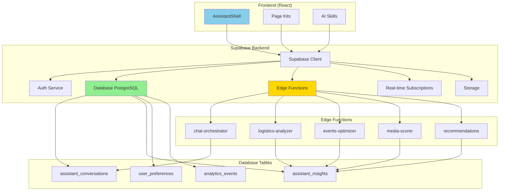

# 03 - BACKEND REQUIREMENTS: SUPABASE ARCHITECTURE

**Document Type:** Backend Specifications  
**Last Updated:** December 18, 2025  
**Status:** Ready for Implementation  
**For:** Backend developers + Cursor AI

---

## 🎯 **PURPOSE**

Define the complete backend architecture for FashionOS AI Assistant, including Supabase setup, Edge Functions, database schema, real-time sync, and API contracts.

**NO CODE IN THIS DOC** - Just requirements. Implementation happens in Cursor (see `06-cursor-handoff.md`).

---

## 🏗️ **ARCHITECTURE OVERVIEW**



---

## 📊 **DATABASE SCHEMA**

### **Table 1: assistant_conversations**

**Purpose:** Store chat history for conversation context and analytics

**Columns:**
- `id` (uuid, primary key)
- `user_id` (uuid, foreign key → auth.users)
- `session_id` (uuid) - Groups messages from same session
- `message` (text) - User's message
- `response` (jsonb) - AI's response with metadata
- `kit_context` (text) - Which kit was active (logistics, events, etc.)
- `page_route` (text) - What page user was on
- `intent_detected` (text) - Classified intent (question, navigation, action)
- `skill_used` (text) - Which skill processed the message
- `response_time_ms` (integer) - Time to generate response
- `helpful` (boolean, nullable) - User feedback thumbs up/down
- `created_at` (timestamp with timezone)

**Indexes:**
- `user_id` + `created_at` (for fetching user history)
- `session_id` (for loading conversation context)
- `kit_context` (for analytics by kit)

**Row Level Security (RLS):**
- Users can only read their own conversations
- Users can only insert their own conversations
- No updates or deletes allowed (immutable audit log)

---

### **Table 2: assistant_insights**

**Purpose:** Cache AI-generated insights to avoid recalculation

**Columns:**
- `id` (uuid, primary key)
- `user_id` (uuid, foreign key → auth.users)
- `insight_type` (text) - logistics_readiness, event_critical_path, etc.
- `context_id` (text) - ID of entity (sample_tracker_id, event_id, etc.)
- `data` (jsonb) - The actual insight data
- `calculated_at` (timestamp with timezone)
- `expires_at` (timestamp with timezone) - When to recalculate
- `cache_hit_count` (integer) - How many times served from cache

**Indexes:**
- `user_id` + `insight_type` + `context_id` (for fast lookup)
- `expires_at` (for cleaning expired cache)

**RLS:**
- Users can only read their own insights
- System can insert/update insights

---

### **Table 3: user_preferences**

**Purpose:** Store user preferences for assistant behavior

**Columns:**
- `user_id` (uuid, primary key, foreign key → auth.users)
- `default_kit` (text, nullable) - Preferred kit to open
- `auto_suggestions_enabled` (boolean, default true)
- `notification_preferences` (jsonb) - Which alerts to show
- `kit_order` (text[]) - Custom ordering of kits
- `favorite_actions` (text[]) - Most used quick actions
- `conversation_history_retention_days` (integer, default 90)
- `updated_at` (timestamp with timezone)

**RLS:**
- Users can read/update only their own preferences

---

### **Table 4: analytics_events**

**Purpose:** Track assistant usage for product analytics

**Columns:**
- `id` (uuid, primary key)
- `user_id` (uuid, foreign key → auth.users)
- `event_type` (text) - assistant_opened, kit_switched, action_clicked, etc.
- `event_data` (jsonb) - Additional context
- `page_route` (text)
- `kit_context` (text)
- `session_id` (uuid)
- `created_at` (timestamp with timezone)

**Indexes:**
- `event_type` + `created_at` (for aggregation queries)
- `user_id` + `created_at` (for user analytics)

**RLS:**
- Users can only insert their own events
- Admins can read all events

---

## ⚡ **EDGE FUNCTIONS SPECIFICATIONS**

### **Function 1: chat-orchestrator**

**Endpoint:** `/functions/v1/chat-orchestrator`

**Purpose:** Route user messages to appropriate AI skill and return formatted response

**Input:**
```typescript
{
  message: string;
  currentKit: string;
  currentRoute: string;
  sessionId: string;
  conversationHistory: Message[]; // last 10 messages
  userContext: {
    sampleList?: Sample[];
    eventTasks?: Task[];
    galleryAssets?: GalleryAsset[];
    // ... other context
  };
}
```

**Process:**
1. Detect intent from message (navigation, question, action, help)
2. Based on currentKit and intent, select appropriate skill
3. Call skill function with context
4. Format response with action buttons and deep links
5. Log to assistant_conversations table
6. Cache insight if applicable
7. Return formatted response

**Output:**
```typescript
{
  content: string;
  type: 'text' | 'action' | 'navigation';
  severity?: 'info' | 'warning' | 'critical' | 'success';
  actions?: {
    label: string;
    target: string;
    primary?: boolean;
  }[];
  followUp?: string[];
  responseTime: number;
}
```

**Error Handling:**
- Invalid message: Return friendly error with suggestions
- Timeout (>5s): Return "Taking longer than expected, please try again"
- Skill error: Log error, return fallback response

---

### **Function 2: logistics-analyzer**

**Endpoint:** `/functions/v1/logistics-analyzer`

**Purpose:** Calculate logistics intelligence (readiness, blockers, batching)

**Input:**
```typescript
{
  sampleList: Sample[];
  analysisType: 'readiness' | 'blockers' | 'batching' | 'all';
}
```

**Process:**
1. Check cache in assistant_insights table (if <1 hour old, return cached)
2. If cache miss, run analysis algorithms:
   - Readiness: (onSet + shot) / total * 100
   - Blockers: Identify delayed hero items with severity scoring
   - Batching: Group by category, prioritize heroes, calculate time savings
3. Store result in assistant_insights table with 1 hour expiry
4. Return analysis

**Output:**
```typescript
{
  readiness?: ReadinessReport;
  blockers?: Blocker[];
  batching?: BatchingPlan;
  cached: boolean;
  calculatedAt: string;
}
```

---

### **Function 3: events-optimizer**

**Endpoint:** `/functions/v1/events-optimizer`

**Purpose:** Calculate event intelligence (critical path, staffing, run of show)

**Input:**
```typescript
{
  event: Event;
  analysisType: 'critical_path' | 'staffing' | 'run_of_show' | 'all';
}
```

**Process:**
1. Check cache (if <30 min old, return cached)
2. If cache miss:
   - Critical path: Analyze task dependencies, identify blockers
   - Staffing: Compare required vs assigned, flag gaps
   - Run of show: Generate timeline with setup/show/teardown blocks
3. Cache result
4. Return analysis

**Output:**
```typescript
{
  criticalPath?: CriticalPathReport;
  staffing?: StaffingGap[];
  runOfShow?: RunOfShowDraft;
  cached: boolean;
}
```

---

### **Function 4: media-scorer**

**Endpoint:** `/functions/v1/media-scorer`

**Purpose:** Calculate asset quality scores and identify missing shots

**Input:**
```typescript
{
  assets: GalleryAsset[];
  shotList: ShotItem[];
  analysisType: 'quality' | 'missing' | 'selects' | 'all';
}
```

**Process:**
1. Check cache (if <10 min old, return cached)
2. If cache miss:
   - Quality: Score each asset on technical + composition + brand factors
   - Missing: Compare shot list to captured assets, identify gaps
   - Selects: Pick top N assets by quality + variety
3. Cache result
4. Return analysis

**Output:**
```typescript
{
  qualityScores?: { assetId: string; score: number; factors: any }[];
  missingShots?: MissingShot[];
  selects?: GalleryAsset[];
  cached: boolean;
}
```

---

### **Function 5: recommendations**

**Endpoint:** `/functions/v1/recommendations`

**Purpose:** Generate personalized recommendations (packages, actions, content)

**Input:**
```typescript
{
  userId: string;
  recommendationType: 'packages' | 'next_actions' | 'features';
  context: {
    currentPage?: string;
    userRole?: string;
    budget?: number;
    timeline?: string;
    // ... other signals
  };
}
```

**Process:**
1. Load user preferences and history
2. Run recommendation algorithm:
   - Packages: Score by fit, budget, timeline, popularity
   - Next actions: Based on completion status and critical path
   - Features: Based on role and usage patterns
3. Return top 3-5 recommendations with rationale

**Output:**
```typescript
{
  recommendations: {
    item: any;
    score: number;
    rationale: string;
    action?: string;
  }[];
}
```

---

## 🔄 **REAL-TIME SUBSCRIPTIONS**

### **Subscription 1: Sample Updates**

**Purpose:** Live-update logistics insights when sample status changes

**Channel:** `samples:${userId}`

**Events:**
- `sample_status_changed`: When sample moves from awaiting → on_set, etc.
- `sample_added`: When new sample added to tracker
- `sample_removed`: When sample removed

**Frontend Action:**
- Invalidate logistics insights cache
- Re-render LogisticsKit with updated data
- Show toast notification if critical change (e.g., blocker resolved)

---

### **Subscription 2: Event Task Updates**

**Purpose:** Live-update event insights when tasks change

**Channel:** `events:${eventId}`

**Events:**
- `task_status_changed`: When task completed or blocked
- `task_assigned`: When owner assigned to task
- `deadline_approaching`: 24h before deadline alert

**Frontend Action:**
- Invalidate event insights cache
- Re-render EventsKit
- Show notification if critical path affected

---

### **Subscription 3: Asset Uploads**

**Purpose:** Live-update media insights when new assets uploaded

**Channel:** `assets:${userId}`

**Events:**
- `asset_uploaded`: New asset added
- `asset_approved`: Asset marked approved
- `asset_rejected`: Asset marked rejected

**Frontend Action:**
- Invalidate media insights cache
- Re-render MediaKit
- Update progress indicators

---

## 🔐 **AUTHENTICATION & AUTHORIZATION**

### **Requirements:**

1. **User Authentication:**
   - Use Supabase Auth (email/password or OAuth)
   - JWT tokens for API requests
   - Refresh tokens for long sessions

2. **Row Level Security:**
   - All tables have RLS enabled
   - Users can only access their own data
   - Admin role can access all data for support

3. **API Security:**
   - All Edge Functions require authentication
   - Rate limiting: 60 requests/minute per user
   - Input validation on all endpoints
   - SQL injection protection

4. **Data Privacy:**
   - Conversation history encrypted at rest
   - PII (if any) redacted in analytics
   - Users can request data deletion (GDPR)

---

## 📊 **PERFORMANCE REQUIREMENTS**

### **Response Time Targets:**

- **Chat messages:** <500ms for 90th percentile
- **Insights calculation:** <1000ms for complex analysis
- **Cache hit:** <50ms
- **Real-time event propagation:** <100ms

### **Caching Strategy:**

1. **Insights Cache:**
   - Logistics: 1 hour expiry
   - Events: 30 min expiry
   - Media: 10 min expiry
   - Invalidate on relevant data change

2. **Database Query Cache:**
   - Use Supabase prepared statements
   - Index all foreign keys
   - Optimize JOIN queries

3. **Edge Function Cache:**
   - Cache static responses (recommendations) for 5 min
   - Use Supabase cache headers
   - CDN caching for public endpoints

---

## 🔍 **ANALYTICS & MONITORING**

### **Metrics to Track:**

1. **Usage Metrics:**
   - Assistant opens per user per day
   - Kit switch rate
   - Action click rate
   - Deep link conversion rate
   - Average session duration

2. **Performance Metrics:**
   - Response time (p50, p90, p99)
   - Cache hit rate
   - Error rate
   - Edge Function invocations
   - Database query duration

3. **Business Metrics:**
   - Time savings per workflow (estimated)
   - Feature adoption rate
   - User satisfaction (thumbs up/down)
   - Power user identification (>10 opens/day)

### **Monitoring Tools:**

- Supabase Dashboard for database metrics
- Edge Function logs for errors
- Custom analytics dashboard for business metrics
- Alerts for:
  - Error rate >1%
  - Response time >1s
  - Cache hit rate <80%

---

## 🚀 **DEPLOYMENT PLAN**

### **Phase 1: Infrastructure Setup (Week 1)**

1. Create Supabase project
2. Set up database tables with RLS
3. Configure authentication
4. Deploy initial Edge Functions
5. Set up monitoring

### **Phase 2: Backend Implementation (Week 2)**

1. Implement all 5 Edge Functions
2. Test with Postman/curl
3. Validate response formats
4. Optimize query performance
5. Set up caching

### **Phase 3: Frontend Integration (Week 3)**

1. Wire up Supabase client
2. Connect AssistantShell to Edge Functions
3. Implement real-time subscriptions
4. Test end-to-end flows
5. Performance testing

### **Phase 4: Production Deploy (Week 4)**

1. Deploy to production Supabase
2. Gradual rollout (10% → 50% → 100%)
3. Monitor metrics closely
4. Fix bugs as discovered
5. Optimize based on real usage

---

## 📋 **IMPLEMENTATION CHECKLIST**

### **Database:**
- [ ] Create Supabase project
- [ ] Set up all 4 tables with correct schema
- [ ] Enable Row Level Security on all tables
- [ ] Create indexes for performance
- [ ] Test RLS policies
- [ ] Set up database backups

### **Edge Functions:**
- [ ] Implement chat-orchestrator
- [ ] Implement logistics-analyzer
- [ ] Implement events-optimizer
- [ ] Implement media-scorer
- [ ] Implement recommendations
- [ ] Test all functions with Postman
- [ ] Set up error handling
- [ ] Add logging

### **Real-time:**
- [ ] Set up real-time channels
- [ ] Implement sample updates subscription
- [ ] Implement event updates subscription
- [ ] Implement asset updates subscription
- [ ] Test live updates in UI

### **Security:**
- [ ] Configure auth providers
- [ ] Test RLS policies
- [ ] Set up rate limiting
- [ ] Validate all inputs
- [ ] Test with security scan tool

### **Monitoring:**
- [ ] Set up error alerts
- [ ] Create analytics dashboard
- [ ] Configure performance monitoring
- [ ] Test alert triggers

---

## 🔗 **API CONTRACTS**

See `/docs/features/04-frontend-backend-wiring.md` for detailed API contracts and integration guide.

---

*End of Backend Requirements*  
*Next: 04-frontend-backend-wiring.md*
