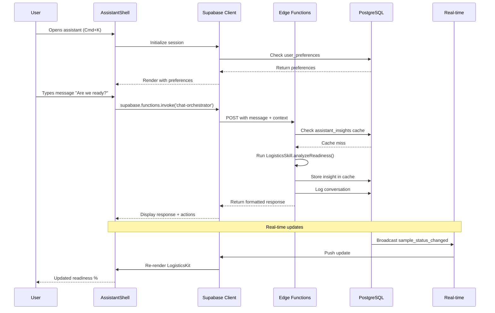

# 04 - FRONTEND ↔ BACKEND WIRING GUIDE

**Document Type:** Integration Specifications  
**Last Updated:** December 18, 2025  
**Status:** Implementation Ready  
**For:** Frontend + Backend developers

---

## 🎯 **PURPOSE**

Define exactly how the React frontend connects to Supabase backend, including API contracts, data flow, error handling, and real-time sync patterns.

---

## 🏗️ **DATA FLOW ARCHITECTURE**



---

## 🔌 **SUPABASE CLIENT SETUP**

### **Step 1: Install Supabase**

```bash
npm install @supabase/supabase-js
```

### **Step 2: Create Supabase Context**

Create `/context/SupabaseContext.tsx`:

**Purpose:** Provide Supabase client to all components

**What it should do:**
- Initialize Supabase client with project URL and anon key
- Manage authentication state
- Provide client instance to children via context
- Handle token refresh automatically

**What components need it:**
- AssistantShell (for calling Edge Functions)
- All Page Kits (for fetching insights)
- BrandShootContext (for syncing data)

---

## 📡 **API INTEGRATION PATTERNS**

### **Pattern 1: Chat Message Flow**

**When:** User sends a message in chat input

**Frontend code location:** `AssistantShell.tsx` in `handleSendMessage()`

**Steps:**

1. **Prepare payload:**
   - Get message text from input
   - Get currentKit from state
   - Get currentRoute from props
   - Get last 10 messages from state
   - Get relevant context from BrandShootContext

2. **Call Edge Function:**
   ```typescript
   const { data, error } = await supabase.functions.invoke('chat-orchestrator', {
     body: {
       message: userMessage,
       currentKit: kitConfig.kitName,
       currentRoute: currentRoute,
       sessionId: sessionId,
       conversationHistory: messages.slice(-10),
       userContext: {
         sampleList: sampleList,
         eventTasks: mockEvent?.tasks,
         galleryAssets: galleryAssets
       }
     }
   })
   ```

3. **Handle response:**
   - If error: Show error message, don't crash
   - If success: Display response in chat thread
   - If actions: Render action buttons
   - Update conversation history state
   - Scroll to bottom

4. **Error handling:**
   - Network error: "Connection lost. Check internet."
   - Timeout: "Taking longer than expected. Try again."
   - Invalid response: "Something went wrong. Please refresh."

---

### **Pattern 2: Insight Fetching Flow**

**When:** Kit needs to show AI insights (readiness, critical path, etc.)

**Frontend code location:** Each Kit component in `useMemo()` or `useEffect()`

**Steps:**

1. **Check if calculation should be client-side or server-side:**
   - Simple calculations (readiness %): Client-side is fine
   - Complex calculations (ML models): Use Edge Function
   - Decide based on performance and complexity

2. **For server-side insights:**
   ```typescript
   const { data, error } = await supabase.functions.invoke('logistics-analyzer', {
     body: {
       sampleList: sampleList,
       analysisType: 'all'
     }
   })
   ```

3. **Cache on frontend:**
   - Use React Query or SWR for automatic caching
   - Or implement manual cache with timestamp check
   - Invalidate cache on relevant data changes

4. **Fallback to client calculation:**
   - If Edge Function fails, use local LogisticsSkill
   - Show warning: "Using offline mode"
   - Log error for debugging

---

### **Pattern 3: Real-time Subscription Flow**

**When:** Data changes that affect insights (sample status, task completion, etc.)

**Frontend code location:** Each Kit component in `useEffect()`

**Steps:**

1. **Subscribe to channel:**
   ```typescript
   const channel = supabase
     .channel(`samples:${userId}`)
     .on('postgres_changes', {
       event: 'UPDATE',
       schema: 'public',
       table: 'samples',
       filter: `user_id=eq.${userId}`
     }, (payload) => {
       // Handle update
       invalidateCache();
       refetchInsights();
     })
     .subscribe()
   ```

2. **Handle incoming events:**
   - Identify what changed
   - Invalidate relevant caches
   - Trigger re-fetch of insights
   - Show toast notification if critical
   - Update UI optimistically if possible

3. **Cleanup on unmount:**
   ```typescript
   return () => {
     supabase.removeChannel(channel)
   }
   ```

---

## 🎨 **SPECIFIC KIT INTEGRATIONS**

### **LogisticsKit ↔ Backend**

**Data needed:**
- Sample list from `BrandShootContext.sampleList`
- Shot list from `BrandShootContext.shotList`

**Edge Function calls:**
- `logistics-analyzer` for complex calculations (if needed)
- Otherwise use client-side LogisticsSkill (current approach is fine)

**Real-time subscriptions:**
- Subscribe to sample status changes
- Invalidate readiness cache on update
- Show notification if critical blocker resolved

**Persistence:**
- Log "View Logistics" action to analytics_events
- Cache insights in assistant_insights (optional, for multi-device sync)

---

### **EventsKit ↔ Backend**

**Data needed:**
- Event details from `BrandShootContext.activeProjects`
- Tasks from mock data (in production, from events table)

**Edge Function calls:**
- `events-optimizer` for critical path analysis
- Run of show generation (potentially compute-heavy)

**Real-time subscriptions:**
- Subscribe to task status changes
- Update critical path on task completion
- Alert if new blocker detected

**Persistence:**
- Save generated run of show to database
- Log critical path changes for audit
- Store staffing gap analysis

---

### **MediaKit ↔ Backend**

**Data needed:**
- Gallery assets from `BrandShootContext.galleryAssets`
- Shot list from `BrandShootContext.shotList`

**Edge Function calls:**
- `media-scorer` for quality analysis (if using ML models)
- Otherwise client-side MediaSkill for basic scoring

**Real-time subscriptions:**
- Subscribe to asset uploads
- Trigger quality score on new asset
- Update missing shots list

**Persistence:**
- Cache quality scores (expensive to recalculate)
- Log asset approvals/rejections
- Store selects lists

---

### **ServicesKit ↔ Backend**

**Data needed:**
- User context (current page, history)
- Service packages from config
- Pricing data

**Edge Function calls:**
- `recommendations` for personalized package suggestions

**Real-time subscriptions:**
- Not needed (static data)

**Persistence:**
- Log package views for analytics
- Store user preferences (favorite packages)

---

### **MarketingKit ↔ Backend**

**Data needed:**
- User profile (role, completion status)
- Feature usage history
- Onboarding progress

**Edge Function calls:**
- `recommendations` for next steps

**Real-time subscriptions:**
- Not needed

**Persistence:**
- Log feature discovery events
- Track onboarding completion

---

## 📝 **API CONTRACT DETAILS**

### **POST /functions/v1/chat-orchestrator**

**Request:**
```json
{
  "message": "Are we ready for tomorrow?",
  "currentKit": "logistics",
  "currentRoute": "sample-tracker",
  "sessionId": "uuid-v4-here",
  "conversationHistory": [
    {
      "role": "user",
      "content": "What's the status?",
      "timestamp": "2025-12-18T10:30:00Z"
    },
    {
      "role": "assistant",
      "content": "Campaign is 82% ready...",
      "timestamp": "2025-12-18T10:30:01Z"
    }
  ],
  "userContext": {
    "sampleList": [ /* Sample[] */ ],
    "eventTasks": [ /* Task[] */ ],
    "galleryAssets": [ /* GalleryAsset[] */ ]
  }
}
```

**Response (Success):**
```json
{
  "content": "Campaign is 82% ready. 2 samples delayed (SKU-402, SKU-501). If they arrive by 10am, you're on track.",
  "type": "text",
  "severity": "warning",
  "actions": [
    {
      "label": "View Delayed Samples",
      "target": "sample-tracker:delayed",
      "primary": true
    },
    {
      "label": "View Batching Plan",
      "target": "sample-tracker:batching",
      "primary": false
    }
  ],
  "followUp": [
    "What's missing?",
    "How can we optimize?",
    "Show me the batching plan"
  ],
  "responseTime": 245
}
```

**Response (Error):**
```json
{
  "error": {
    "code": "TIMEOUT",
    "message": "Analysis taking longer than expected. Please try again.",
    "recoverable": true
  }
}
```

**Error Codes:**
- `INVALID_INPUT`: Missing required fields
- `TIMEOUT`: Processing took >5 seconds
- `SKILL_ERROR`: Internal error in skill logic
- `AUTH_ERROR`: Invalid or expired token
- `RATE_LIMIT`: Too many requests

---

### **POST /functions/v1/logistics-analyzer**

**Request:**
```json
{
  "sampleList": [
    {
      "id": "sku-001",
      "name": "Silk Scarf",
      "status": "awaiting",
      "isHero": true,
      "priority": 1
    }
  ],
  "analysisType": "all"
}
```

**Response:**
```json
{
  "readiness": {
    "overallPercentage": 82,
    "status": "good",
    "message": "Campaign is 82% ready. On track for shoot day.",
    "recommendations": [
      "Track 2 samples still in transit",
      "Prepare backup options"
    ]
  },
  "blockers": [
    {
      "sampleId": "sku-402",
      "severity": "critical",
      "impact": "HERO ITEM missing",
      "estimatedDelay": "4-8 hours"
    }
  ],
  "batching": {
    "totalBatches": 3,
    "estimatedTimeSavings": "30min",
    "batches": [ /* ... */ ]
  },
  "cached": false,
  "calculatedAt": "2025-12-18T10:30:00Z"
}
```

---

### **POST /functions/v1/events-optimizer**

**Request:**
```json
{
  "event": {
    "id": "evt-123",
    "name": "Spring/Summer 2025 Show",
    "date": "2025-03-15",
    "tasks": [ /* Task[] */ ]
  },
  "analysisType": "critical_path"
}
```

**Response:**
```json
{
  "criticalPath": {
    "completionPercentage": 65,
    "status": "at_risk",
    "blockers": [
      {
        "taskId": "task-5",
        "title": "Send Invitations",
        "impact": "Cannot proceed without this",
        "estimatedDelay": "2 days"
      }
    ],
    "nextMilestones": [ /* ... */ ]
  },
  "cached": false
}
```

---

## 🔄 **STATE MANAGEMENT STRATEGY**

### **Current State (Frontend Only):**

```
BrandShootContext
  ├── sampleList (local state)
  ├── eventTasks (local state)
  ├── galleryAssets (local state)
  └── No persistence
```

### **Future State (With Backend):**

```
BrandShootContext + Supabase
  ├── sampleList (synced to database)
  ├── eventTasks (synced to database)
  ├── galleryAssets (synced to database)
  └── Real-time updates via subscriptions
```

### **Migration Strategy:**

**Phase 1:** Keep current approach (client-side state)
- No breaking changes
- Fast to implement
- Works offline

**Phase 2:** Add backend persistence (optional)
- Save to database on changes
- Load from database on mount
- Still works if backend down

**Phase 3:** Full sync (future)
- Multi-device sync
- Collaborative editing
- Real-time team updates

---

## ⚠️ **ERROR HANDLING PATTERNS**

### **Pattern 1: Graceful Degradation**

```typescript
try {
  // Try to use backend
  const { data } = await supabase.functions.invoke('logistics-analyzer', {
    body: { sampleList, analysisType: 'all' }
  });
  return data.readiness;
} catch (error) {
  // Fall back to client-side calculation
  console.warn('Backend unavailable, using local calculation:', error);
  return analyzeReadiness(sampleList); // Client-side function
}
```

**When to use:** Critical features that must always work

---

### **Pattern 2: User-Friendly Errors**

```typescript
catch (error) {
  if (error.message.includes('timeout')) {
    toast.error('Analysis taking longer than expected. Try again in a moment.');
  } else if (error.message.includes('network')) {
    toast.error('Connection lost. Check your internet and try again.');
  } else {
    toast.error('Something went wrong. Please refresh the page.');
  }
  logErrorToMonitoring(error);
}
```

**When to use:** Any user-facing error

---

### **Pattern 3: Retry with Backoff**

```typescript
async function callWithRetry(fn, maxRetries = 3) {
  for (let i = 0; i < maxRetries; i++) {
    try {
      return await fn();
    } catch (error) {
      if (i === maxRetries - 1) throw error;
      await delay(2 ** i * 1000); // Exponential backoff
    }
  }
}
```

**When to use:** Non-critical operations that can retry

---

## 🚀 **PERFORMANCE OPTIMIZATION**

### **1. Request Batching**

Instead of calling Edge Functions for each insight:

**Bad:**
```typescript
const readiness = await fetchReadiness();
const blockers = await fetchBlockers();
const batching = await fetchBatching();
```

**Good:**
```typescript
const { readiness, blockers, batching } = await fetchAll();
```

Use `analysisType: 'all'` parameter to get everything in one request.

---

### **2. Parallel Requests**

When insights are independent:

```typescript
const [readiness, events, media] = await Promise.all([
  fetchLogistics(),
  fetchEvents(),
  fetchMedia()
]);
```

---

### **3. Cache Indicators**

Show users when data is cached vs fresh:

```typescript
{data.cached && (
  <span className="text-xs text-gray-500">
    Cached {formatDistanceToNow(data.calculatedAt)} ago
  </span>
)}
```

---

### **4. Optimistic Updates**

Update UI immediately, sync in background:

```typescript
// Update UI instantly
setSampleList(prev => prev.map(s => 
  s.id === sampleId ? { ...s, status: 'on_set' } : s
));

// Sync to backend
await supabase.from('samples').update({ status: 'on_set' }).eq('id', sampleId);
```

---

## 📊 **TESTING STRATEGY**

### **Frontend Tests:**

1. **Unit Tests:**
   - Test each Kit component renders
   - Test Skill functions with mock data
   - Test deep linking logic

2. **Integration Tests:**
   - Mock Supabase client
   - Test API call flows
   - Test error handling

3. **E2E Tests:**
   - Test full user journeys
   - Test with real backend (staging)

### **Backend Tests:**

1. **Edge Function Tests:**
   - Test each function with sample inputs
   - Test error cases
   - Test caching logic

2. **Database Tests:**
   - Test RLS policies
   - Test query performance
   - Test real-time triggers

### **Integration Tests:**

1. **Frontend + Backend:**
   - Deploy to staging
   - Run smoke tests
   - Monitor performance

---

## 📋 **INTEGRATION CHECKLIST**

### **Supabase Setup:**
- [ ] Create Supabase project
- [ ] Add project URL and anon key to `.env`
- [ ] Install @supabase/supabase-js
- [ ] Create SupabaseContext
- [ ] Wrap App with SupabaseProvider

### **Frontend Wiring:**
- [ ] Update AssistantShell to use Supabase client
- [ ] Add chat message handler with Edge Function call
- [ ] Update LogisticsKit with real-time subscription
- [ ] Update EventsKit with real-time subscription
- [ ] Update MediaKit with real-time subscription
- [ ] Add error handling to all API calls
- [ ] Add loading states
- [ ] Add offline fallbacks

### **Backend Implementation:**
- [ ] Deploy all Edge Functions
- [ ] Test with Postman
- [ ] Verify caching works
- [ ] Set up monitoring
- [ ] Test real-time subscriptions

### **End-to-End Testing:**
- [ ] Test chat flow
- [ ] Test insight fetching
- [ ] Test real-time updates
- [ ] Test error scenarios
- [ ] Performance test

---

## 🔗 **NEXT STEPS**

See `/docs/features/05-production-checklist.md` for deployment readiness criteria.

See `/docs/features/06-cursor-handoff.md` for specific implementation tasks.

---

*End of Frontend-Backend Wiring Guide*  
*Next: 05-production-checklist.md*
