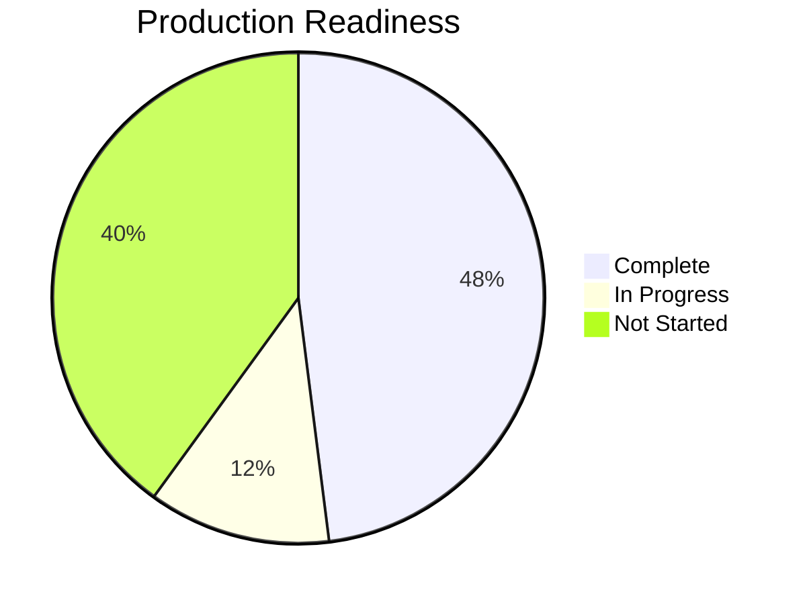
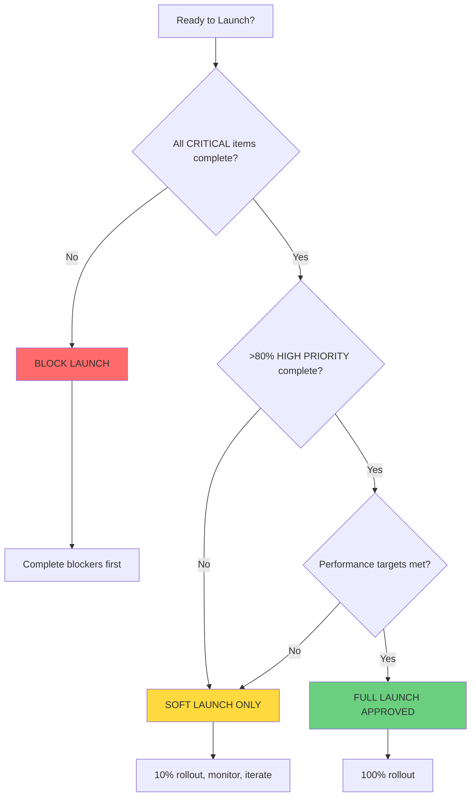

# 05 - PRODUCTION READINESS CHECKLIST

**Document Type:** Deployment Criteria  
**Last Updated:** December 18, 2025  
**Status:** Gate for Production Launch  
**For:** Engineering + Product teams

---

## 🎯 **PURPOSE**

Define exactly what must be complete before deploying AI Assistant to production. This is the gate - nothing ships until all critical items are checked.

---

## 📊 **READINESS SCORE**

**Current Score:** 48% Ready  
**Minimum to Ship:** 85% Ready  
**Target for Full Launch:** 95% Ready

---

## ✅ **CRITICAL PATH (MUST HAVE)**

### **🔴 Frontend Core (48% Complete)**

#### **Foundation** ✅ COMPLETE
- [x] AssistantShell component exists and works
- [x] PanelHeader with context awareness
- [x] Route mapper (50+ routes)
- [x] Deep linking system
- [x] Keyboard shortcuts (Cmd+K, Escape)
- [x] Mobile responsive (basic)

#### **Page Kits** ⚠️ PARTIAL (2/5)
- [x] LogisticsKit implemented with AI
- [x] EventsKit implemented with AI
- [ ] MediaKit implemented with AI
- [ ] ServicesKit implemented
- [ ] MarketingKit implemented

#### **AI Skills** ⚠️ PARTIAL (2/5)
- [x] LogisticsSkill (4 algorithms)
- [x] EventsSkill (4 algorithms)
- [ ] MediaSkill (4 algorithms)
- [ ] ServicesSkill (3 algorithms)
- [ ] NavigatorSkill (general helper)

#### **Chat Intelligence** ❌ NOT STARTED (0%)
- [ ] AgentOrchestrator implemented
- [ ] Intent detection working
- [ ] Multi-skill routing
- [ ] Chat input enabled and functional
- [ ] Conversation history management
- [ ] Response formatting consistent

---

### **🔴 Backend Infrastructure (0% Complete)**

#### **Supabase Setup** ❌ NOT STARTED
- [ ] Project created
- [ ] Environment variables configured
- [ ] Database schema deployed
- [ ] RLS policies active
- [ ] Auth providers configured

#### **Edge Functions** ❌ NOT STARTED
- [ ] chat-orchestrator deployed
- [ ] logistics-analyzer deployed
- [ ] events-optimizer deployed
- [ ] media-scorer deployed
- [ ] recommendations deployed

#### **Real-time** ❌ NOT STARTED
- [ ] Sample updates channel working
- [ ] Event updates channel working
- [ ] Asset updates channel working
- [ ] Frontend subscriptions connected

#### **Data Persistence** ❌ NOT STARTED
- [ ] Conversation history logging
- [ ] Insights caching
- [ ] User preferences storage
- [ ] Analytics events tracking

---

### **🔴 Quality Assurance (10% Complete)**

#### **Testing** ⚠️ MINIMAL
- [x] Manual testing on LogisticsKit
- [x] Manual testing on EventsKit
- [ ] Automated unit tests
- [ ] Integration tests
- [ ] E2E tests
- [ ] Performance tests
- [ ] Security audit

#### **Browser Compatibility** ❌ NOT TESTED
- [ ] Chrome (latest)
- [ ] Safari (latest)
- [ ] Firefox (latest)
- [ ] Edge (latest)

#### **Mobile Testing** ❌ NOT TESTED
- [ ] iOS Safari (iPhone 13+)
- [ ] iOS Safari (iPhone SE)
- [ ] Android Chrome (Samsung)
- [ ] Android Chrome (Pixel)
- [ ] iPad

#### **Accessibility** ⚠️ PARTIAL
- [x] Keyboard navigation works
- [ ] Screen reader tested (NVDA/JAWS)
- [ ] Color contrast validated
- [ ] ARIA labels added
- [ ] Focus management correct

---

### **🔴 Performance (30% Complete)**

#### **Frontend Performance** ⚠️ PARTIAL
- [x] AI calculations <10ms (client-side)
- [x] Animations 60fps (desktop)
- [ ] Animations 30fps+ (mobile)
- [ ] Bundle size <500KB
- [ ] Lazy loading implemented
- [ ] Code splitting active

#### **Backend Performance** ❌ NOT MEASURABLE YET
- [ ] Edge Functions <500ms (p90)
- [ ] Database queries <100ms
- [ ] Cache hit rate >80%
- [ ] Real-time latency <100ms

#### **Network Optimization** ❌ NOT IMPLEMENTED
- [ ] Request batching
- [ ] Response compression
- [ ] CDN for static assets
- [ ] Service worker for offline

---

### **🔴 Security (20% Complete)**

#### **Authentication** ❌ NOT IMPLEMENTED
- [ ] JWT tokens working
- [ ] Token refresh logic
- [ ] Session timeout handling
- [ ] Logout clears all data

#### **Authorization** ❌ NOT IMPLEMENTED
- [ ] RLS enforced on all tables
- [ ] User can only see own data
- [ ] Admin role access controlled
- [ ] API rate limiting active

#### **Data Protection** ⚠️ PARTIAL
- [x] No sensitive data in client-side code
- [ ] Conversation history encrypted
- [ ] PII redacted in logs
- [ ] SQL injection protected
- [ ] XSS prevention validated

---

## 🎯 **HIGH PRIORITY (SHOULD HAVE)**

### **🟡 User Experience (40% Complete)**

#### **Error Handling** ⚠️ PARTIAL
- [x] Graceful degradation (offline mode)
- [x] User-friendly error messages
- [ ] Retry logic for failed requests
- [ ] Error boundary components
- [ ] Network status indicator

#### **Loading States** ⚠️ BASIC
- [x] Skeleton loaders for kits
- [ ] Progress indicators for AI processing
- [ ] Optimistic UI updates
- [ ] Streaming responses for long calculations

#### **Feedback Mechanisms** ❌ NOT IMPLEMENTED
- [ ] Thumbs up/down on responses
- [ ] Report bug button
- [ ] Feature request form
- [ ] User satisfaction survey

---

### **🟡 Analytics & Monitoring (0% Complete)**

#### **Product Analytics** ❌ NOT IMPLEMENTED
- [ ] Track assistant opens
- [ ] Track kit switches
- [ ] Track action clicks
- [ ] Track deep link conversions
- [ ] Track conversation length

#### **Performance Monitoring** ❌ NOT IMPLEMENTED
- [ ] Response time tracking
- [ ] Error rate alerts
- [ ] Cache hit rate dashboard
- [ ] Real-time latency monitoring

#### **Business Metrics** ❌ NOT IMPLEMENTED
- [ ] Time savings estimation
- [ ] Feature adoption rate
- [ ] Power user identification
- [ ] ROI calculation

---

### **🟡 Documentation (70% Complete)**

#### **Developer Docs** ✅ EXCELLENT
- [x] Implementation prompts
- [x] Backend requirements
- [x] Frontend-backend wiring
- [x] This production checklist
- [x] Cursor handoff guide

#### **User Docs** ❌ NOT STARTED
- [ ] User guide (how to use)
- [ ] FAQ
- [ ] Video tutorial
- [ ] Keyboard shortcuts reference

#### **API Docs** ❌ NOT STARTED
- [ ] Edge Function specifications
- [ ] Request/response examples
- [ ] Error code reference
- [ ] Rate limiting guide

---

## 🔵 **NICE TO HAVE (CAN DEFER)**

### **Advanced Features (0% Complete)**

#### **Voice Input** ❌ NOT STARTED
- [ ] Speech-to-text integration
- [ ] Voice commands
- [ ] Audio feedback

#### **Multi-Language** ❌ NOT STARTED
- [ ] i18n framework
- [ ] Language detection
- [ ] Translated responses

#### **Advanced AI** ❌ NOT STARTED
- [ ] Machine learning models
- [ ] Predictive analytics
- [ ] Automated task creation
- [ ] Multi-agent coordination

---

## 📊 **LAUNCH DECISION MATRIX**

---

## 🚀 **LAUNCH PHASES**

### **Phase 1: Internal Beta** (Week 1)

**Readiness Required:** 70%

**What's Deployed:**
- AssistantShell + LogisticsKit + EventsKit
- Client-side AI only (no backend yet)
- Basic error handling
- Desktop only

**Who Gets Access:**
- Internal team (10 users)
- Staging environment

**Success Criteria:**
- No critical bugs
- Performance acceptable
- User feedback positive
- Collect improvement ideas

---

### **Phase 2: Soft Launch** (Week 2)

**Readiness Required:** 85%

**What's Added:**
- MediaKit + ServicesKit + MarketingKit
- Backend Edge Functions deployed
- Real-time subscriptions
- Mobile optimization

**Who Gets Access:**
- Beta users (50 users)
- Feature flag enabled for 10% of production

**Success Criteria:**
- <1% error rate
- <500ms response time (p90)
- >70% find it helpful
- Analytics tracking working

---

### **Phase 3: Full Launch** (Week 3-4)

**Readiness Required:** 95%

**What's Added:**
- AgentOrchestrator (chat intelligence)
- Full testing suite
- Analytics dashboard
- Remove old AIAssistant

**Who Gets Access:**
- All users (100% rollout)

**Success Criteria:**
- >40% daily active users
- >90% uptime
- >85% satisfaction score
- Positive ROI

---

## ✅ **PRE-LAUNCH VERIFICATION**

### **Day Before Launch:**

#### **Technical Checks**
- [ ] Run full test suite (all green)
- [ ] Check staging environment (no errors)
- [ ] Verify monitoring dashboards (data flowing)
- [ ] Test rollback procedure (can revert quickly)
- [ ] Review error logs (no patterns)

#### **Team Readiness**
- [ ] Engineering on-call scheduled
- [ ] Support team trained
- [ ] Announcement drafted
- [ ] Rollback plan documented
- [ ] Incident response plan ready

#### **Communication**
- [ ] Stakeholders informed
- [ ] Users notified (if breaking changes)
- [ ] Changelog published
- [ ] Support docs updated

---

### **Launch Day:**

#### **Morning (8am)**
- [ ] Enable feature flag for 10%
- [ ] Monitor error rates (should be <1%)
- [ ] Check performance metrics (p90 <500ms)
- [ ] Review first user feedback

#### **Midday (12pm)**
- [ ] If stable, increase to 50%
- [ ] Continue monitoring
- [ ] Address any issues

#### **Evening (5pm)**
- [ ] If still stable, increase to 100%
- [ ] Monitor overnight
- [ ] Prepare hot-fix if needed

---

### **Day After Launch:**

#### **Review Metrics**
- [ ] Assistant open rate (target >40% DAU)
- [ ] Error rate (target <1%)
- [ ] Response time (target <500ms p90)
- [ ] User feedback (target >80% positive)

#### **Iterate**
- [ ] Prioritize bug fixes
- [ ] Plan next improvements
- [ ] Update documentation
- [ ] Celebrate success! 🎉

---

## 🚨 **ROLLBACK CRITERIA**

**Automatic Rollback If:**
- Error rate >5% for 10 minutes
- Response time >2000ms (p90) for 30 minutes
- Critical bug affecting >25% of users
- Data loss or corruption detected

**Manual Rollback If:**
- Overwhelming negative feedback
- Security vulnerability discovered
- Performance severely degraded
- Business critical feature broken

**Rollback Process:**
1. Disable feature flag immediately
2. Notify team in #incidents channel
3. Investigate root cause
4. Fix issue in separate branch
5. Re-deploy when ready
6. Document incident

---

## 📋 **SUCCESS METRICS**

### **Adoption Metrics**

| Metric | Soft Launch Target | Full Launch Target |
|--------|-------------------|-------------------|
| Assistant open rate (DAU) | >20% | >40% |
| Average opens per user per day | >2 | >3 |
| Kit switch rate | >30% | >40% |
| Action click rate | >40% | >60% |
| Deep link conversion | >50% | >70% |

### **Quality Metrics**

| Metric | Soft Launch Target | Full Launch Target |
|--------|-------------------|-------------------|
| Error rate | <2% | <1% |
| Response time (p90) | <800ms | <500ms |
| Cache hit rate | >70% | >80% |
| Uptime | >99% | >99.5% |

### **Business Metrics**

| Metric | Soft Launch Target | Full Launch Target |
|--------|-------------------|-------------------|
| Time savings per workflow | >15 min | >30 min |
| Cost avoidance per issue | >$5K | >$15K |
| User satisfaction | >75% | >90% |
| Support ticket reduction | >10% | >20% |

---

## 🎯 **FINAL GATE CHECKLIST**

Before setting feature flag to 100%:

### **Critical (All Must Pass)**
- [ ] All Page Kits implemented
- [ ] All AI Skills working correctly
- [ ] Chat intelligence functional
- [ ] Backend deployed and stable
- [ ] <1% error rate for 24 hours
- [ ] Performance targets met
- [ ] Security audit passed
- [ ] Mobile experience acceptable

### **High Priority (80% Must Pass)**
- [ ] Automated tests passing
- [ ] Analytics tracking working
- [ ] Error handling comprehensive
- [ ] Loading states polished
- [ ] Documentation complete
- [ ] Team trained

### **Nice to Have (Optional)**
- [ ] Voice input
- [ ] Multi-language
- [ ] Advanced AI features

---

## 📊 **CURRENT STATUS SUMMARY**

**Overall Readiness:** 48%

**Blockers to Soft Launch (85%):**
1. Implement MediaKit (4-6 hours)
2. Implement ServicesKit (3-4 hours)
3. Implement MarketingKit (2-3 hours)
4. Deploy Supabase backend (8-12 hours)
5. Implement AgentOrchestrator (8-10 hours)
6. Mobile optimization (6-8 hours)
7. Testing suite (8-12 hours)

**Total Estimated Work:** 40-55 hours (5-7 days with 1 developer)

**Recommended Timeline:**
- Week 1: Complete remaining kits (MediaKit, ServicesKit, MarketingKit)
- Week 2: Backend implementation + AgentOrchestrator
- Week 3: Testing + mobile optimization + documentation
- Week 4: Soft launch + monitoring + iteration
- Week 5: Full launch

---

*End of Production Checklist*  
*Next: 06-cursor-handoff.md*
