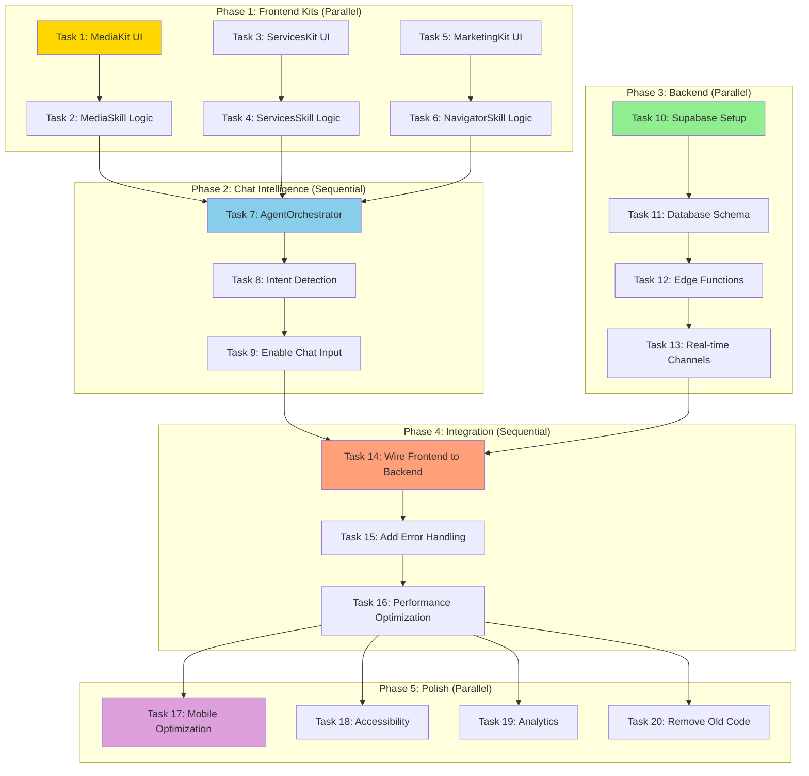

# 06 - CURSOR AI HANDOFF: IMPLEMENTATION TASKS

**Document Type:** Code Implementation Tasks  
**Last Updated:** December 18, 2025  
**Status:** Ready for Cursor AI  
**For:** Cursor AI editor + developers

---

## 🎯 **PURPOSE**

This document provides **specific, actionable tasks** for implementing code in Cursor AI. Each task is self-contained and can be completed independently.

**Use these tasks in Cursor's Composer or Chat:**
- Copy task description
- Paste into Cursor
- Let Cursor implement the code
- Review and test
- Move to next task

---

## 📊 **TASK DEPENDENCY GRAPH**



---

## 🔨 **FRONTEND TASKS**

### **TASK 1: Implement MediaKit Component**

**Priority:** P0 (Critical)  
**Estimated Time:** 2 hours  
**Dependencies:** None  
**File to Create:** `/components/assistant/kits/MediaKit.tsx`

**Task Description for Cursor:**

```
Create a new React component called MediaKit in /components/assistant/kits/MediaKit.tsx.

REQUIREMENTS:

1. Import statements needed:
   - React hooks (useMemo)
   - Icons from lucide-react: Image, Upload, CheckCircle, AlertTriangle, TrendingUp, Sparkles, ArrowRight, Tag
   - motion from 'motion/react'
   - useBrandShoot from context
   - MediaSkill functions (will be created in Task 2)

2. Props interface:
   - onActionClick: (actionId: string, params?: any) => void

3. Component structure:
   - Top: Quick Actions (2x2 grid)
     - "Upload Assets" button
     - "Tag by Shot" button
     - "Generate Selects" button
     - "Prep Delivery Pack" button
   
   - Middle: Insight Cards (2x2 grid)
     - "Assets Delivered" (count/total with progress)
     - "Quality Score" (0-100 with color)
     - "Missing Shots" (count with warning)
     - "Next Deadline" (days until)
   
   - Bottom: Status Feed (conditional)
     - If quality score < 70: Amber alert
     - If missing shots > 0: Red alert
     - Otherwise: Green success

4. Use the same QuickActionButton and InsightCard components from LogisticsKit (copy pattern).

5. Get data from BrandShootContext:
   - galleryAssets
   - shotList

6. Calculate insights using MediaSkill (placeholder for now, will add in Task 2).

7. Style to match LogisticsKit and EventsKit (same design system).

ACCEPTANCE CRITERIA:
- Component renders without errors
- All 4 quick actions visible
- All 4 insight cards visible
- Status feed shows based on data
- Matches design of other kits
```

---

### **TASK 2: Implement MediaSkill Functions**

**Priority:** P0 (Critical)  
**Estimated Time:** 3 hours  
**Dependencies:** None  
**File to Create:** `/components/assistant/skills/MediaSkill.ts`

**Task Description for Cursor:**

```
Create MediaSkill.ts in /components/assistant/skills/.

REQUIREMENTS:

1. Export these TypeScript interfaces:
   - QualityReport
   - MissingShot
   - TimelineReport
   - MediaInsight

2. Implement these functions:

   a) calculateQualityScore(asset: GalleryAsset): QualityReport
      - Score based on:
        * Technical quality (if metadata available): 40%
        * Composition (placeholder scoring): 30%
        * Brand consistency: 30%
      - Return score 0-100 with breakdown

   b) identifyMissingShots(shotList: ShotItem[], assets: GalleryAsset[]): MissingShot[]
      - Compare shot list vs assets
      - Find shots with no matching assets
      - Return list with severity

   c) analyzeDeliveryTimeline(assets: GalleryAsset[], deliverables: Deliverable[]): TimelineReport
      - Calculate: captured / total required
      - Estimate time to completion
      - Flag overdue items

   d) generateSelects(assets: GalleryAsset[], count: number): GalleryAsset[]
      - Pick top N assets by quality score
      - Ensure variety (different angles)
      - Prioritize hero shots

   e) generateMediaInsights(assets: GalleryAsset[]): MediaInsight[]
      - Generate 4 insight cards
      - Include severity levels
      - Add action targets

3. All functions should:
   - Accept typed inputs
   - Return structured outputs
   - Include error handling
   - Have JSDoc comments

REFERENCE:
Look at /components/assistant/skills/LogisticsSkill.ts for the pattern to follow.

ACCEPTANCE CRITERIA:
- All 5 functions implemented
- TypeScript types correct
- Logic produces sensible results
- No runtime errors
```

---

### **TASK 3: Implement ServicesKit Component**

**Priority:** P1 (High)  
**Estimated Time:** 1.5 hours  
**Dependencies:** None  
**File to Create:** `/components/assistant/kits/ServicesKit.tsx`

**Task Description for Cursor:**

```
Create ServicesKit.tsx in /components/assistant/kits/.

REQUIREMENTS:

1. Props:
   - onActionClick: (actionId: string, params?: any) => void
   - currentService?: string (optional, e.g., "photography")

2. Quick Actions (2x2):
   - "Compare Packages"
   - "Get Custom Quote"
   - "Book Consultation"
   - "View Portfolio"

3. Insight Cards (2x2):
   - "Recommended Package" (AI pick)
   - "Estimated Cost" (price range)
   - "Timeline" (typical delivery)
   - "Popular Choice" (social proof)

4. Status Feed:
   - Contextual message based on currentService
   - Example: "For clothing photography, we recommend the Premium package"

5. Make recommendations adapt to currentService prop.

6. Use ServicesSkill for calculations (will create in Task 4).

ACCEPTANCE CRITERIA:
- Renders on service pages
- Recommendations adapt to page
- Actions navigate correctly
- Matches other kits visually
```

---

### **TASK 4: Implement ServicesSkill Functions**

**Priority:** P1 (High)  
**Estimated Time:** 2 hours  
**Dependencies:** None  
**File to Create:** `/components/assistant/skills/ServicesSkill.ts`

**Task Description for Cursor:**

```
Create ServicesSkill.ts in /components/assistant/skills/.

REQUIREMENTS:

1. Implement these functions:

   a) recommendPackages(userContext: UserContext): PackageRecommendation[]
      - Score packages by:
        * Page match (clothing page → clothing package): 40%
        * Budget match: 30%
        * Timeline feasibility: 20%
        * Popularity: 10%
      - Return top 3 with rationale

   b) estimatePricing(packageId: string, addOns: string[]): PricingEstimate
      - Base package price
      - Add-on costs
      - Volume discounts
      - Return range (min-max)

   c) forecastTimeline(service: string, scope: string): TimelineEstimate
      - Estimate based on service type
      - Consider typical durations
      - Return in business days

   d) generateServicesInsights(currentPage: string): ServicesInsight[]
      - Generate 4 insights
      - Adapt to current page
      - Include action targets

2. Use mock package data (hardcoded for now).

3. All functions typed and documented.

ACCEPTANCE CRITERIA:
- Recommendations make sense
- Pricing calculations correct
- Timeline estimates realistic
- Insights contextual to page
```

---

### **TASK 5: Implement MarketingKit Component**

**Priority:** P1 (High)  
**Estimated Time:** 1 hour  
**Dependencies:** None  
**File to Create:** `/components/assistant/kits/MarketingKit.tsx`

**Task Description for Cursor:**

```
Create MarketingKit.tsx in /components/assistant/kits/.

REQUIREMENTS:

1. Simple kit for home/marketing pages.

2. Quick Actions (2x2):
   - "Explore FashionOS"
   - "View All Services"
   - "Create First Event"
   - "Get Started Guide"

3. Insight Cards (2x2):
   - "What's New" (recent features)
   - "Popular Features" (most used)
   - "Your Next Step" (suggestion)
   - "Quick Win" (easy high-value action)

4. Status Feed:
   - For new users: "Welcome! Let's get started..."
   - For returning: "Continue where you left off..."
   - Use friendly, warm language

5. Use NavigatorSkill for suggestions (will create in Task 6).

ACCEPTANCE CRITERIA:
- Renders on home pages
- Language friendly (not technical)
- Actions route correctly
- Adapts to user type
```

---

### **TASK 6: Implement NavigatorSkill Functions**

**Priority:** P1 (High)  
**Estimated Time:** 1.5 hours  
**Dependencies:** None  
**File to Create:** `/components/assistant/skills/NavigatorSkill.ts`

**Task Description for Cursor:**

```
Create NavigatorSkill.ts in /components/assistant/skills/.

REQUIREMENTS:

1. This is a general helper skill (not complex algorithms).

2. Implement:

   a) suggestFeatures(userRole: string): FeatureSuggestion[]
      - Based on role, suggest relevant features
      - Return list with descriptions and links

   b) generateOnboarding(completionStatus: any): OnboardingStep[]
      - Create checklist of next steps
      - Based on what's already done
      - Return ordered list

   c) identifyNextSteps(userContext: any): NextAction[]
      - Analyze context
      - Suggest immediate actions
      - Return top 3 recommendations

3. Use simple heuristics (no complex logic needed).

4. Focus on navigation and discovery.

ACCEPTANCE CRITERIA:
- Suggestions relevant
- Onboarding steps logical
- Next steps actionable
```

---

### **TASK 7: Implement AgentOrchestrator**

**Priority:** P0 (Critical)  
**Estimated Time:** 4 hours  
**Dependencies:** Tasks 2, 4, 6 complete  
**File to Create:** `/components/assistant/skills/AgentOrchestrator.ts`

**Task Description for Cursor:**

```
Create AgentOrchestrator.ts in /components/assistant/skills/.

This is the BRAIN of the assistant - routes messages to correct skill.

REQUIREMENTS:

1. Main function:
   async function routeIntent(
     userMessage: string,
     currentKit: string,
     context: any
   ): Promise<AIResponse>

2. Process:
   a) Detect intent from message
      - Keywords: "ready", "missing", "optimize", "show", "status"
      - Classify as: navigation, question, action, help
   
   b) Based on currentKit, select skill:
      - logistics → LogisticsSkill
      - events → EventsSkill
      - media → MediaSkill
      - services → ServicesSkill
      - default → NavigatorSkill
   
   c) Call appropriate skill function
   
   d) Format response with:
      - Content (answer text)
      - Type (text, action, navigation)
      - Severity (info, warning, critical, success)
      - Actions (button array with targets)
      - FollowUp (suggested questions)

3. Helper functions:
   - detectIntent(message: string): Intent
   - parseKeywords(message: string): string[]
   - selectSkill(intent: Intent, kit: string): Skill
   - formatResponse(rawResponse: any): AIResponse

4. Handle edge cases:
   - Unclear message: "Try asking..."
   - Off-topic: "I can help with..."
   - Errors: "Something went wrong..."

5. Maintain simple conversation memory (last 10 messages).

REFERENCE:
This is complex. Review LogisticsSkill.ts answerQuestion() function for pattern.

ACCEPTANCE CRITERIA:
- Routes to correct skill
- Formats responses consistently
- Handles all intent types
- Error handling robust
```

---

### **TASK 8: Implement Intent Detection**

**Priority:** P0 (Critical)  
**Estimated Time:** 2 hours  
**Dependencies:** Task 7  
**File to Update:** `/components/assistant/skills/AgentOrchestrator.ts`

**Task Description for Cursor:**

```
Enhance AgentOrchestrator with better intent detection.

REQUIREMENTS:

1. Create keyword maps:
   - Readiness: ["ready", "prepared", "status", "complete"]
   - Problems: ["missing", "blocked", "delayed", "issue", "problem"]
   - Optimization: ["faster", "optimize", "improve", "better", "efficient"]
   - Navigation: ["show", "go to", "open", "view", "see"]
   - Help: ["how", "what is", "explain", "help"]

2. detectIntent() should:
   - Convert message to lowercase
   - Check for keyword matches
   - Score each intent type
   - Return highest scoring intent

3. Add fuzzy matching:
   - Handle typos (Levenshtein distance)
   - Handle synonyms
   - Handle multi-word phrases

4. Add context awareness:
   - If on logistics page, bias toward logistics intent
   - If previous message about events, continue that context

ACCEPTANCE CRITERIA:
- Correctly classifies 90%+ of test messages
- Handles typos reasonably
- Uses context to disambiguate
```

---

### **TASK 9: Enable Chat Input in AssistantShell**

**Priority:** P0 (Critical)  
**Estimated Time:** 2 hours  
**Dependencies:** Tasks 7, 8  
**File to Update:** `/components/assistant/AssistantShell.tsx`

**Task Description for Cursor:**

```
Enable the chat input and wire it to AgentOrchestrator.

REQUIREMENTS:

1. In AssistantShell component:
   - Remove "disabled" from chat input
   - Add state: messages (array of Message objects)
   - Add state: isProcessing (boolean for loading)

2. Implement handleSendMessage():
   - Get message from input
   - Add user message to messages array
   - Clear input
   - Set isProcessing = true
   - Call AgentOrchestrator.routeIntent()
   - Add AI response to messages array
   - Set isProcessing = false
   - Scroll to bottom

3. Add ChatThread component (create if needed):
   - Render all messages
   - User messages on right (blue)
   - AI messages on left (gray)
   - Show action buttons if present
   - Show loading indicator while processing

4. Handle keyboard:
   - Enter to send
   - Shift+Enter for new line

5. Handle errors:
   - Network error: Show error message
   - Timeout: Show "Taking longer..." message

ACCEPTANCE CRITERIA:
- Can type and send messages
- AI responds appropriately
- Actions buttons work
- Loading state shows
- Errors handled gracefully
```

---

## 🔧 **BACKEND TASKS**

### **TASK 10: Set Up Supabase Project**

**Priority:** P0 (Critical)  
**Estimated Time:** 1 hour  
**Dependencies:** None  
**Location:** Supabase Dashboard + Local env

**Task Description for Cursor:**

```
Set up Supabase project for FashionOS Assistant.

MANUAL STEPS (Do in Supabase Dashboard):
1. Go to supabase.com/dashboard
2. Create new project: "fashionos-assistant"
3. Copy Project URL and anon key
4. Set password for database

IN CURSOR:
1. Create .env.local file with:
   NEXT_PUBLIC_SUPABASE_URL=your-url
   NEXT_PUBLIC_SUPABASE_ANON_KEY=your-key

2. Install Supabase:
   npm install @supabase/supabase-js

3. Create /lib/supabase.ts:
   - Initialize Supabase client
   - Export client instance
   - Add TypeScript types

4. Create /context/SupabaseContext.tsx:
   - Provide Supabase client to app
   - Handle auth state
   - Manage session

5. Wrap App with SupabaseProvider in _app.tsx or layout.

ACCEPTANCE CRITERIA:
- Supabase client initializes without errors
- Can connect to database (test with simple query)
- Environment variables loaded
- TypeScript types working
```

---

### **TASK 11: Create Database Schema**

**Priority:** P0 (Critical)  
**Estimated Time:** 2 hours  
**Dependencies:** Task 10  
**Location:** Supabase SQL Editor

**Task Description for Cursor:**

```
Create database tables for assistant.

IN SUPABASE SQL EDITOR, run these CREATE TABLE statements:

1. assistant_conversations table:
   - id (uuid, primary key, gen_random_uuid())
   - user_id (uuid, references auth.users)
   - session_id (uuid)
   - message (text)
   - response (jsonb)
   - kit_context (text)
   - page_route (text)
   - intent_detected (text)
   - skill_used (text)
   - response_time_ms (integer)
   - helpful (boolean, nullable)
   - created_at (timestamptz, default now())

2. assistant_insights table:
   - id (uuid, primary key)
   - user_id (uuid, references auth.users)
   - insight_type (text)
   - context_id (text)
   - data (jsonb)
   - calculated_at (timestamptz)
   - expires_at (timestamptz)
   - cache_hit_count (integer, default 0)

3. user_preferences table:
   - user_id (uuid, primary key, references auth.users)
   - default_kit (text, nullable)
   - auto_suggestions_enabled (boolean, default true)
   - notification_preferences (jsonb)
   - kit_order (text[])
   - favorite_actions (text[])
   - conversation_history_retention_days (integer, default 90)
   - updated_at (timestamptz, default now())

4. analytics_events table:
   - id (uuid, primary key)
   - user_id (uuid, references auth.users)
   - event_type (text)
   - event_data (jsonb)
   - page_route (text)
   - kit_context (text)
   - session_id (uuid)
   - created_at (timestamptz, default now())

5. Add indexes:
   - conversations: user_id + created_at
   - insights: user_id + insight_type + context_id
   - analytics: event_type + created_at

6. Enable Row Level Security on all tables:
   - Users can only see their own data
   - Example policy for conversations:
     CREATE POLICY "Users can read own conversations"
     ON assistant_conversations FOR SELECT
     USING (auth.uid() = user_id);

ACCEPTANCE CRITERIA:
- All 4 tables created
- Indexes added
- RLS policies active
- Test insert/select works
```

---

### **TASK 12: Create Edge Functions**

**Priority:** P0 (Critical)  
**Estimated Time:** 6 hours  
**Dependencies:** Task 11  
**Location:** Supabase Functions

**Task Description for Cursor:**

```
Create 5 Edge Functions for AI processing.

SETUP:
1. Install Supabase CLI: npm install -g supabase
2. Init: supabase init
3. Create functions: supabase functions new [name]

FOR EACH FUNCTION:

1. chat-orchestrator:
   - Location: supabase/functions/chat-orchestrator/index.ts
   - Purpose: Route user messages to correct skill
   - Input: message, currentKit, context
   - Process: Call appropriate skill, format response
   - Output: Formatted AI response
   - Log to assistant_conversations table

2. logistics-analyzer:
   - Location: supabase/functions/logistics-analyzer/index.ts
   - Purpose: Calculate logistics insights
   - Input: sampleList, analysisType
   - Process: Run readiness/blockers/batching algorithms
   - Cache in assistant_insights table (1hr expiry)
   - Output: Analysis results

3. events-optimizer:
   - Location: supabase/functions/events-optimizer/index.ts
   - Purpose: Calculate event insights
   - Input: event, analysisType
   - Process: Critical path/staffing/run of show
   - Cache in assistant_insights (30min expiry)
   - Output: Analysis results

4. media-scorer:
   - Location: supabase/functions/media-scorer/index.ts
   - Purpose: Score asset quality, find missing shots
   - Input: assets, shotList, analysisType
   - Process: Quality scoring, missing detection
   - Cache in assistant_insights (10min expiry)
   - Output: Scores and missing list

5. recommendations:
   - Location: supabase/functions/recommendations/index.ts
   - Purpose: Generate personalized recommendations
   - Input: userId, recommendationType, context
   - Process: Score options, return top 3
   - Output: Recommendations with rationale

STRUCTURE for each:
```typescript
import { serve } from 'https://deno.land/std@0.168.0/http/server.ts'
import { createClient } from 'https://esm.sh/@supabase/supabase-js@2'

serve(async (req) => {
  try {
    const { [params] } = await req.json()
    
    // Process logic here
    
    // Cache if applicable
    
    // Return result
    return new Response(JSON.stringify(result), {
      headers: { 'Content-Type': 'application/json' },
    })
  } catch (error) {
    return new Response(JSON.stringify({ error: error.message }), {
      status: 400,
    })
  }
})
```

DEPLOY:
supabase functions deploy [function-name]

ACCEPTANCE CRITERIA:
- All 5 functions deployed
- Can invoke via supabase.functions.invoke()
- Caching works
- Errors handled
- Returns correct format
```

---

### **TASK 13: Set Up Real-time Channels**

**Priority:** P1 (High)  
**Estimated Time:** 2 hours  
**Dependencies:** Task 11  
**Location:** Frontend + Supabase

**Task Description for Cursor:**

```
Set up real-time subscriptions for live updates.

IN EACH KIT COMPONENT:

1. LogisticsKit - Subscribe to sample updates:
   ```typescript
   useEffect(() => {
     const channel = supabase
       .channel('samples')
       .on('postgres_changes', {
         event: 'UPDATE',
         schema: 'public',
         table: 'samples'
       }, (payload) => {
         // Invalidate cache
         // Refetch insights
         // Show toast if critical
       })
       .subscribe()
     
     return () => supabase.removeChannel(channel)
   }, [])
   ```

2. EventsKit - Subscribe to task updates:
   - Channel: 'tasks'
   - Event: UPDATE
   - Action: Invalidate critical path cache

3. MediaKit - Subscribe to asset uploads:
   - Channel: 'assets'
   - Event: INSERT
   - Action: Recalculate quality scores

ACCEPTANCE CRITERIA:
- Subscriptions connect successfully
- Updates trigger re-renders
- No memory leaks (cleanup on unmount)
- Toast notifications show for critical changes
```

---

## 🔗 **INTEGRATION TASKS**

### **TASK 14: Wire Frontend to Backend**

**Priority:** P0 (Critical)  
**Estimated Time:** 3 hours  
**Dependencies:** Tasks 9, 12, 13  
**Files to Update:** Multiple

**Task Description for Cursor:**

```
Connect React frontend to Supabase backend.

CHANGES NEEDED:

1. In AssistantShell.tsx handleSendMessage():
   - Instead of calling client-side OrchestStatus directly
   - Call Edge Function:
     const { data } = await supabase.functions.invoke('chat-orchestrator', {
       body: { message, currentKit, context }
     })

2. In each Kit component:
   - Option A: Keep client-side calculations (current approach)
   - Option B: Call Edge Function for heavy calculations
   - Decide based on complexity

3. Add SupabaseProvider at app root:
   - Wrap entire app
   - Provide client to all components

4. Add error handling:
   - Network errors: Fall back to client-side
   - Timeouts: Show user-friendly message
   - Auth errors: Redirect to login

5. Add loading states:
   - Show spinner while Edge Function processing
   - Disable input while loading
   - Show progress for long operations

ACCEPTANCE CRITERIA:
- Chat messages go through backend
- Insights fetched from Edge Functions
- Real-time updates working
- Errors handled gracefully
- Loading states smooth
```

---

### **TASK 15: Add Comprehensive Error Handling**

**Priority:** P1 (High)  
**Estimated Time:** 2 hours  
**Dependencies:** Task 14  
**Files to Update:** All components

**Task Description for Cursor:**

```
Add robust error handling throughout app.

PATTERNS TO IMPLEMENT:

1. Graceful Degradation:
   ```typescript
   try {
     const { data } = await supabase.functions.invoke(...)
     return data
   } catch (error) {
     console.warn('Backend unavailable, using local calculation')
     return calculateLocally()
   }
   ```

2. User-Friendly Messages:
   - Network error: "Connection lost. Check internet."
   - Timeout: "Taking longer than expected. Try again."
   - Server error: "Something went wrong. Please refresh."

3. Error Boundaries:
   - Wrap AssistantShell in ErrorBoundary
   - Show fallback UI on crash
   - Log errors to monitoring

4. Retry Logic:
   - Auto-retry on network errors (3 attempts)
   - Exponential backoff
   - Show retry button to user

5. Validation:
   - Validate user input before sending
   - Validate API responses
   - Handle malformed data gracefully

ADD TO ALL:
- AssistantShell
- All Kit components
- All Edge Functions
- Database queries

ACCEPTANCE CRITERIA:
- No unhandled errors crash app
- All errors show user-friendly messages
- Retry logic works
- Falls back to client-side when possible
```

---

### **TASK 16: Optimize Performance**

**Priority:** P1 (High)  
**Estimated Time:** 3 hours  
**Dependencies:** Tasks 14, 15  
**Files to Update:** Multiple

**Task Description for Cursor:**

```
Optimize app performance for production.

FRONTEND OPTIMIZATIONS:

1. Add React.memo to heavy components:
   - QuickActionButton
   - InsightCard
   - ChatMessage

2. Use useMemo for expensive calculations:
   - insights = useMemo(() => calculateInsights(), [deps])

3. Debounce chat input:
   - Wait 300ms after typing stops before sending

4. Lazy load kits:
   - const MediaKit = lazy(() => import('./kits/MediaKit'))
   - Show skeleton while loading

5. Optimize bundle size:
   - Code splitting by route
   - Tree-shake unused code
   - Compress images

BACKEND OPTIMIZATIONS:

1. Add caching to Edge Functions:
   - Check cache before calculation
   - Set appropriate expiry times
   - Use cache headers

2. Batch requests:
   - analysisType: 'all' to get everything in one call

3. Optimize database queries:
   - Use indexes
   - Limit result sets
   - Use pagination for large data

4. Add CDN for static assets:
   - Images
   - Icons
   - Fonts

MONITOR:
- Response times (target <500ms p90)
- Bundle size (target <500KB)
- Cache hit rate (target >80%)
- FPS (target 60fps)

ACCEPTANCE CRITERIA:
- p90 response time <500ms
- Bundle size <500KB
- No layout shifts
- 60fps animations
- Cache hit rate >80%
```

---

## ✨ **POLISH TASKS**

### **TASK 17: Mobile Optimization**

**Priority:** P1 (High)  
**Estimated Time:** 4 hours  
**Dependencies:** Task 16  
**Files to Update:** AssistantShell, all Kits

**Task Description for Cursor:**

```
Optimize for mobile devices.

CHANGES NEEDED:

1. Bottom Sheet on Mobile:
   - On mobile (<1024px), render as bottom sheet
   - Slides up from bottom (not right drawer)
   - Covers 85% of viewport height
   - Add drag handle at top
   - Swipe down to dismiss

2. Touch Interactions:
   - Increase all tap targets to 44x44px minimum
   - Add larger invisible padding for easier tapping
   - Implement swipe gestures (up/down)
   - Add haptic feedback (if supported)

3. Keyboard Handling:
   - When chat input focused, resize sheet to accommodate keyboard
   - Keep input visible above keyboard
   - Scroll to bottom when keyboard opens

4. Performance:
   - Reduce animation complexity on low-end devices
   - Use will-change for GPU acceleration
   - Optimize re-renders

5. Testing:
   - Test on iOS Safari (iPhone 13, iPhone SE)
   - Test on Android Chrome (Samsung, Pixel)
   - Test on iPad

USE:
- Tailwind breakpoints: lg:hidden, lg:flex, etc.
- touch-action CSS for gestures
- Mobile-first approach

ACCEPTANCE CRITERIA:
- Bottom sheet works smoothly
- Touch targets all >44px
- Swipe gestures intuitive
- Keyboard doesn't cover input
- Performance 30fps+ on mobile
- Works on iOS and Android
```

---

### **TASK 18: Accessibility Improvements**

**Priority:** P1 (High)  
**Estimated Time:** 2 hours  
**Dependencies:** None (parallel)  
**Files to Update:** All components

**Task Description for Cursor:**

```
Make assistant fully accessible (WCAG 2.1 AA).

REQUIREMENTS:

1. Keyboard Navigation:
   - All interactive elements keyboard accessible
   - Tab order logical
   - Focus visible (outline)
   - Escape closes assistant
   - Arrow keys navigate options

2. Screen Reader Support:
   - Add aria-labels to all buttons
   - Add aria-live regions for dynamic content
   - Add role attributes (dialog, status, etc.)
   - Announce AI responses
   - Announce errors

3. Color Contrast:
   - All text meets 4.5:1 contrast ratio
   - Interactive elements meet 3:1 ratio
   - Don't rely on color alone for meaning

4. Focus Management:
   - When assistant opens, focus chat input
   - When closes, return focus to launcher
   - Trap focus inside modal

5. Alternative Text:
   - Add alt text to all images
   - Add aria-labels to icon buttons
   - Add titles to interactive elements

TEST WITH:
- VoiceOver (Mac)
- NVDA (Windows)
- Keyboard only (no mouse)
- Color blindness simulator

ACCEPTANCE CRITERIA:
- Can use entirely with keyboard
- Screen reader announces all changes
- Color contrast validated
- Focus management correct
- Passes WAVE accessibility checker
```

---

### **TASK 19: Add Analytics Tracking**

**Priority:** P2 (Medium)  
**Estimated Time:** 2 hours  
**Dependencies:** Task 14  
**Files to Update:** AssistantShell, all Kits

**Task Description for Cursor:**

```
Add analytics to track usage.

EVENTS TO TRACK:

1. Assistant Interactions:
   - assistant_opened: When user opens (Cmd+K or click)
   - assistant_closed: When user closes
   - kit_switched: When kit changes (auto or manual)
   - message_sent: When user sends chat message
   - response_received: When AI responds
   - response_helpful: When user thumbs up/down
   - action_clicked: When user clicks action button
   - deep_link_clicked: When navigates via deep link

2. For each event, include:
   - event_type: string
   - event_data: { details }
   - kit_context: string
   - page_route: string
   - session_id: string
   - timestamp: ISO string

3. Send to:
   - Supabase (analytics_events table)
   - Optional: Google Analytics, Mixpanel, etc.

4. Add helper function:
   ```typescript
   function trackEvent(type: string, data: any) {
     supabase.from('analytics_events').insert({
       user_id: userId,
       event_type: type,
       event_data: data,
       kit_context: currentKit,
       page_route: currentRoute,
       session_id: sessionId
     })
   }
   ```

5. Call trackEvent() at key moments:
   - On assistant open
   - On kit switch
   - On message send
   - On action click

ACCEPTANCE CRITERIA:
- All events tracked
- Data visible in Supabase
- No PII in logs
- Doesn't slow down UI
```

---

### **TASK 20: Remove Old Assistant Code**

**Priority:** P2 (Medium)  
**Estimated Time:** 1 hour  
**Dependencies:** All previous tasks complete  
**Files to Update/Delete:** Multiple

**Task Description for Cursor:**

```
Clean up old assistant code after new one is stable.

WHAT TO REMOVE:

1. Old AIAssistant component:
   - Delete: /components/shared/AIAssistant.tsx
   - Remove imports from pages
   - Remove from layouts

2. AI Logistics sidebar:
   - In SmartSampleTracker.tsx
   - Remove sidebar section (lines 205-368)
   - Keep main sample grid
   - Insights now come from LogisticsKit

3. Old imports:
   - Search codebase for old AIAssistant imports
   - Replace with new AssistantShell
   - Update all references

4. Unused dependencies:
   - Check package.json
   - Remove any packages only used by old assistant

BEFORE REMOVING:
- Verify new assistant works on all pages
- Test all features
- Get approval from team
- Create backup branch

AFTER REMOVING:
- Test app thoroughly
- Check for broken imports
- Verify no console errors
- Confirm bundle size reduced

ACCEPTANCE CRITERIA:
- Old code deleted
- No broken imports
- App works without errors
- Bundle size reduced
- Code cleaner
```

---

## 📊 **TASK STATUS TRACKING**

Use this table to track progress:

| Task # | Name | Priority | Status | Assignee | Completed |
|--------|------|----------|--------|----------|-----------|
| 1 | MediaKit UI | P0 | ⬜ Not Started | | |
| 2 | MediaSkill Logic | P0 | ⬜ Not Started | | |
| 3 | ServicesKit UI | P1 | ⬜ Not Started | | |
| 4 | ServicesSkill Logic | P1 | ⬜ Not Started | | |
| 5 | MarketingKit UI | P1 | ⬜ Not Started | | |
| 6 | NavigatorSkill Logic | P1 | ⬜ Not Started | | |
| 7 | AgentOrchestrator | P0 | ⬜ Not Started | | |
| 8 | Intent Detection | P0 | ⬜ Not Started | | |
| 9 | Enable Chat Input | P0 | ⬜ Not Started | | |
| 10 | Supabase Setup | P0 | ⬜ Not Started | | |
| 11 | Database Schema | P0 | ⬜ Not Started | | |
| 12 | Edge Functions | P0 | ⬜ Not Started | | |
| 13 | Real-time Channels | P1 | ⬜ Not Started | | |
| 14 | Wire Frontend/Backend | P0 | ⬜ Not Started | | |
| 15 | Error Handling | P1 | ⬜ Not Started | | |
| 16 | Performance Optimization | P1 | ⬜ Not Started | | |
| 17 | Mobile Optimization | P1 | ⬜ Not Started | | |
| 18 | Accessibility | P1 | ⬜ Not Started | | |
| 19 | Analytics | P2 | ⬜ Not Started | | |
| 20 | Remove Old Code | P2 | ⬜ Not Started | | |

**Status Legend:**
- ⬜ Not Started
- 🟡 In Progress
- ✅ Complete
- ⚠️ Blocked
- ❌ Failed

---

## 🎯 **RECOMMENDED EXECUTION ORDER**

### **Week 1: Frontend Kits**
Day 1-2: Tasks 1-2 (MediaKit)  
Day 3: Tasks 3-4 (ServicesKit)  
Day 4-5: Tasks 5-6 (MarketingKit)

### **Week 2: Chat Intelligence + Backend**
Day 1-2: Tasks 7-8 (AgentOrchestrator)  
Day 3: Task 9 (Enable Chat)  
Day 4-5: Tasks 10-12 (Supabase + Edge Functions)

### **Week 3: Integration + Polish**
Day 1: Task 13 (Real-time)  
Day 2: Task 14 (Integration)  
Day 3: Tasks 15-16 (Error Handling + Performance)  
Day 4-5: Tasks 17-18 (Mobile + Accessibility)

### **Week 4: Final Polish + Launch**
Day 1: Task 19 (Analytics)  
Day 2: Task 20 (Remove Old Code)  
Day 3-4: Testing + Bug Fixes  
Day 5: Launch! 🚀

---

*End of Cursor Handoff Document*  
*Ready for implementation in Cursor AI*
