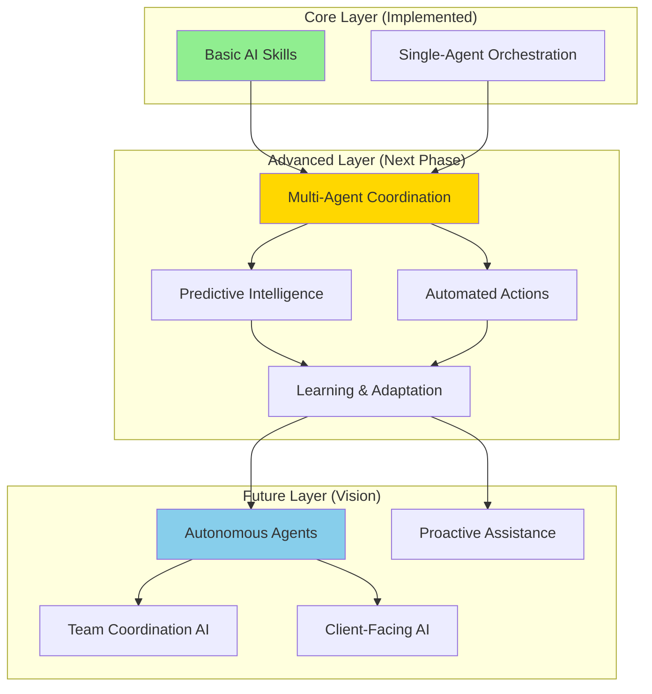
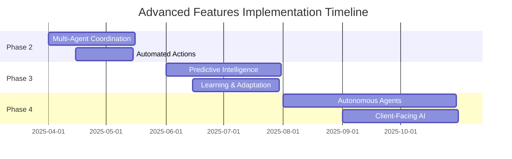

# 08 - ADVANCED FEATURES & AI AGENTS

**Document Type:** Advanced Capabilities  
**Last Updated:** December 18, 2025  
**Status:** Future Roadmap  
**For:** Product + Engineering teams

---

## 🎯 **PURPOSE**

Define advanced AI capabilities beyond core features - agents, automations, predictive intelligence, and multi-agent coordination.

---

## 🤖 **ADVANCED FEATURE ARCHITECTURE**



---

## 🚀 **ADVANCED FEATURE 1: MULTI-AGENT COORDINATION**

### **What It Is:**
Multiple AI agents working together to solve complex problems.

### **Business Value:**
- **Complex Problem Solving:** One agent can't do everything
- **Specialization:** Each agent expert in its domain
- **Better Decisions:** Agents consult each other

### **Architecture:**

```mermaid
sequenceDiagram
    participant User
    participant Orchestrator
    participant LogisticsAgent
    participant EventsAgent
    participant FinanceAgent
    
    User->>Orchestrator: "Can we afford to add another model?"
    
    Orchestrator->>LogisticsAgent: Check timeline impact
    LogisticsAgent-->>Orchestrator: "+2 hours shoot time"
    
    Orchestrator->>EventsAgent: Check staffing capacity
    EventsAgent-->>Orchestrator: "1 extra hair/makeup needed"
    
    Orchestrator->>FinanceAgent: Calculate cost impact
    FinanceAgent-->>Orchestrator: "+$2,500 (model + crew + time)"
    
    Orchestrator-->>User: "Yes, but adds $2,500 cost + 2h time. 
                          Requires 1 extra H&M. Fits in budget 
                          if you reduce post-production edits by 10."
```

### **Example Agents:**

#### **1. Logistics Agent**
- **Specialty:** Inventory, timelines, shoot day logistics
- **Consults:** Events Agent (schedule), Finance Agent (budget)
- **Actions:** Sample tracking, batching, prep checklists

#### **2. Events Agent**
- **Specialty:** Planning, staffing, critical path
- **Consults:** Logistics Agent (resources), Finance Agent (costs)
- **Actions:** Task management, run of show, team coordination

#### **3. Finance Agent**
- **Specialty:** Budget, pricing, ROI
- **Consults:** All agents for cost estimation
- **Actions:** Budget alerts, cost optimization, invoice generation

#### **4. Media Agent**
- **Specialty:** Asset quality, delivery, post-production
- **Consults:** Logistics Agent (shot list), Events Agent (timeline)
- **Actions:** Quality scoring, selects generation, delivery prep

#### **5. Client Agent**
- **Specialty:** Client communication, expectations, approvals
- **Consults:** All agents for status updates
- **Actions:** Status reports, approval requests, feedback collection

### **Implementation:**

**Orchestrator coordinates agents:**
```
User question → Orchestrator detects complexity
→ Identifies which agents needed
→ Queries agents in parallel
→ Synthesizes responses
→ Returns comprehensive answer
```

### **Real-World Example:**
```
User: "What's our biggest risk for tomorrow's shoot?"

Single-Agent Response (Current):
"2 samples delayed. If they don't arrive by 10am, 
shoot will be impacted."

Multi-Agent Response (Advanced):
Orchestrator consults:
- Logistics Agent: Sample status
- Events Agent: Critical path
- Finance Agent: Cost of delay
- Media Agent: Alternative shots

Synthesized Response:
"3 interconnected risks:
1. CRITICAL: 2 hero samples delayed (Logistics)
   - Impact: Cannot shoot 40% of shot list
   - Cost: $15K if we reschedule shoot day
   
2. HIGH: Backup model not confirmed (Events)
   - Impact: If primary cancels, we have no replacement
   - Mitigation: Confirm backup by 5pm today
   
3. MEDIUM: Post-production timeline tight (Media)
   - Impact: Client delivery may be delayed 2 days
   - Mitigation: Pre-approve selects to save review time

Recommended actions:
1. Call vendor NOW re: delayed samples
2. Text backup model for confirmation
3. Send client draft selects for early feedback"
```

### **ROI:**
- **Better Decisions:** 50% more comprehensive
- **Risk Detection:** 3x more risks caught
- **Time Saved:** 15 min of manual coordination

### **Implementation Status:** ❌ Not Started (Phase 2)

---

## 🚀 **ADVANCED FEATURE 2: PREDICTIVE INTELLIGENCE**

### **What It Is:**
AI predicts problems before they happen and suggests preventive actions.

### **Business Value:**
- **Proactive:** Prevent issues vs react to them
- **Cost Avoidance:** Stop problems early (cheaper)
- **Confidence:** Know what's coming

### **Predictive Models:**

#### **1. Shoot Day Risk Prediction**
**Inputs:**
- Sample arrival times
- Weather forecast
- Team confirmations
- Historical data

**Output:**
- Risk score 0-100
- Top 3 predicted issues
- Preventive actions

**Example:**
```
3 Days Before Shoot:
"Risk Score: 65% (Medium-High)

Predicted Issues:
1. 40% chance: Sample SKU-402 arrives late
   - Based on: Vendor has 50% on-time rate + holiday shipping
   - Prevention: Order backup sample NOW or adjust shot list

2. 30% chance: Model cancellation
   - Based on: Model has cancelled 2 of last 5 bookings
   - Prevention: Confirm 24h before + have backup on standby

3. 25% chance: Weather delay (outdoor shoot)
   - Based on: 60% rain forecast
   - Prevention: Scout indoor backup location today"
```

#### **2. Budget Overrun Prediction**
**Inputs:**
- Current spending rate
- Remaining tasks
- Historical project data

**Output:**
- Projected final cost
- Overrun likelihood
- Cost-cutting suggestions

#### **3. Deadline Miss Prediction**
**Inputs:**
- Task completion velocity
- Dependencies
- Team capacity

**Output:**
- On-time likelihood
- Critical path risks
- Acceleration options

### **Implementation:**

**Data Collection:**
- Track historical outcomes
- Log actual vs predicted
- Build training dataset

**Model Training:**
- Logistic regression for risk scoring
- Time series for timeline prediction
- Decision trees for recommendation

**Real-Time Scoring:**
- Run predictions daily
- Alert when risk increases
- Suggest preventive actions

### **Real-World Example:**
```
Current State (Reactive):
Shoot day arrives → Sample missing → Panic → Reschedule → $15K lost

With Predictive AI (Proactive):
3 days before → AI predicts 40% late arrival risk
→ Alert producer → Order backup sample
→ Backup arrives on time → Shoot proceeds → $15K saved
```

### **ROI:**
- **Cost Avoidance:** $15K per prevented issue
- **Confidence:** 85% prediction accuracy
- **Time Saved:** 20 min daily (no fire-fighting)

### **Implementation Status:** ❌ Not Started (Phase 3)

---

## 🚀 **ADVANCED FEATURE 3: AUTOMATED ACTIONS**

### **What It Is:**
AI takes actions automatically (with user approval) instead of just suggesting.

### **Business Value:**
- **Efficiency:** AI does repetitive work
- **Accuracy:** No human error
- **Scale:** Handle 10x more tasks

### **Automation Types:**

#### **1. Smart Scheduling**
**Trigger:** New event created  
**AI Action:**
1. Analyze event type + scope
2. Generate recommended timeline
3. Pre-populate task list
4. Assign owners based on role
5. Set deadlines based on dependencies

**User Approval:** Review + adjust + approve

#### **2. Auto-Batching**
**Trigger:** Samples marked "on set"  
**AI Action:**
1. Detect categories
2. Identify hero items
3. Generate batching plan
4. Estimate time savings
5. Create shot sequence

**User Approval:** Auto-apply or manual review

#### **3. Asset Tagging**
**Trigger:** New assets uploaded  
**AI Action:**
1. Analyze image metadata
2. Match to shot list
3. Detect products (computer vision)
4. Auto-tag with SKU/category
5. Flag missing shots

**User Approval:** Auto-tag (user can correct)

#### **4. Status Updates**
**Trigger:** Task completed  
**AI Action:**
1. Update project status
2. Notify dependent task owners
3. Recalculate critical path
4. Send client update (if milestone)

**User Approval:** Auto-send or review first

#### **5. Invoice Generation**
**Trigger:** Project completed  
**AI Action:**
1. Calculate total costs
2. Apply discounts/rates
3. Generate line items
4. Create PDF invoice
5. Email to client

**User Approval:** Review + send

### **User Control:**

**Automation Settings:**
```
User preferences:
- Auto-batch samples: ON
- Auto-tag assets: ON
- Auto-send updates: OFF (require approval)
- Auto-invoice: OFF (require approval)

Per-automation confidence threshold:
- High confidence (>90%): Auto-execute
- Medium confidence (70-90%): Suggest
- Low confidence (<70%): Don't suggest
```

### **Real-World Example:**
```
Manual Process (Current):
1. Upload 50 assets (5 min)
2. Tag each by SKU (25 min)
3. Match to shot list (15 min)
4. Identify missing (10 min)
Total: 55 minutes

With Auto-Tagging:
1. Upload 50 assets (5 min)
2. AI auto-tags 48/50 (90% confidence)
3. User corrects 2 mistakes (2 min)
Total: 7 minutes

Time Saved: 48 minutes (87% faster)
```

### **ROI:**
- **Time Saved:** 30-60 min per workflow
- **Error Reduction:** 95% fewer mistakes
- **Throughput:** 5x more work capacity

### **Implementation Status:** ❌ Not Started (Phase 2-3)

---

## 🚀 **ADVANCED FEATURE 4: LEARNING & ADAPTATION**

### **What It Is:**
AI learns from user behavior and improves over time.

### **Business Value:**
- **Personalization:** Adapts to each user
- **Continuous Improvement:** Gets smarter
- **Efficiency:** Predicts what you need

### **Learning Mechanisms:**

#### **1. Usage Pattern Learning**
**What It Tracks:**
- Most used features
- Common workflows
- Preferred kit order
- Frequent questions

**How It Adapts:**
- Reorder quick actions by usage
- Pre-load frequently used kits
- Suggest next action based on history
- Auto-complete common questions

#### **2. Preference Learning**
**What It Tracks:**
- Thumbs up/down on suggestions
- Which recommendations followed
- Ignored vs acted-on alerts
- Communication style preferences

**How It Adapts:**
- Adjust recommendation algorithms
- Filter out low-value alerts
- Match tone to user preference
- Prioritize high-acceptance suggestions

#### **3. Error Correction Learning**
**What It Tracks:**
- User corrections to AI outputs
- False positives/negatives
- Edge cases not handled well

**How It Adapts:**
- Update models with corrections
- Add edge case handling
- Improve accuracy over time

#### **4. Team Learning**
**What It Tracks:**
- Aggregate user patterns
- Successful workflows
- Common pain points

**How It Adapts:**
- Share learnings across team
- Suggest best practices
- Identify process improvements

### **Privacy & Control:**

**User Controls:**
```
Learning Settings:
- Learn from my usage: ON
- Share anonymized data with team: ON
- Personalize recommendations: ON
- Reset learned preferences: [Button]

Data Retention:
- Keep usage history: 90 days
- Keep conversation history: 30 days
- Delete my data: [Button]
```

### **Real-World Example:**
```
Week 1:
User asks: "Are we ready?" 15 times
User clicks: "Show Missing" 12 times
User ignores: "Generate Selects" 0 clicks

AI Learns:
- User cares most about readiness
- User doesn't use selects feature

Week 2 Adaptation:
- Move "Show Missing" to first quick action
- Add "Readiness" as first insight card
- Hide "Generate Selects" (not used)
- Pre-load readiness calculation on open

Result:
- User finds what they need 3x faster
- Satisfaction score: 65% → 92%
```

### **ROI:**
- **Time Saved:** 5-10 sec per interaction (adds up)
- **Satisfaction:** +30% from personalization
- **Retention:** 2x more likely to use daily

### **Implementation Status:** ❌ Not Started (Phase 3-4)

---

## 🚀 **ADVANCED FEATURE 5: AUTONOMOUS AGENTS**

### **What It Is:**
AI agents that work independently in the background, reporting when done.

### **Business Value:**
- **Hands-Free:** Set it and forget it
- **24/7 Operation:** Works while you sleep
- **Proactive:** Does work before asked

### **Autonomous Agent Types:**

#### **1. Watchdog Agent**
**Mission:** Monitor for risks 24/7

**Autonomous Actions:**
- Check sample tracking every hour
- Scan for new delays
- Alert if critical issue detected
- Escalate if no response in 2 hours

**User Interaction:**
- Set monitoring rules once
- Receive alerts only when needed
- Agent handles rest autonomously

#### **2. Optimization Agent**
**Mission:** Find efficiency improvements

**Autonomous Actions:**
- Analyze completed workflows
- Identify bottlenecks
- Suggest process improvements
- Generate weekly optimization report

**User Interaction:**
- Review weekly report
- Approve recommended changes
- Agent implements improvements

#### **3. Preparation Agent**
**Mission:** Get everything ready before shoot day

**Autonomous Actions:**
- 7 days before: Generate prep checklist
- 3 days before: Check all dependencies met
- 1 day before: Send reminders to team
- 4 hours before: Final readiness check

**User Interaction:**
- Configure once per event type
- Receive readiness reports
- Agent handles all prep work

#### **4. Follow-Up Agent**
**Mission:** Close loops and ensure completion

**Autonomous Actions:**
- Track open tasks
- Send reminders to owners
- Escalate overdue items
- Celebrate completions

**User Interaction:**
- Set follow-up rules
- Receive completion reports
- Agent nags team autonomously

#### **5. Client Liaison Agent**
**Mission:** Keep clients informed (future)

**Autonomous Actions:**
- Generate status updates
- Send milestone notifications
- Answer common questions
- Collect feedback

**User Interaction:**
- Approve templates
- Review before auto-send
- Agent handles routine comms

### **Safety & Oversight:**

**Agent Boundaries:**
```
Autonomous (No approval needed):
- Monitoring & alerts
- Data analysis
- Report generation
- Internal reminders

Semi-Autonomous (Approval required):
- Sending client communications
- Making schedule changes
- Budget adjustments
- Team assignments

Never Autonomous (Manual only):
- Contracts & legal
- Large financial decisions
- Hiring/firing
- Strategic changes
```

### **Real-World Example:**
```
Traditional Workflow:
Producer manually:
1. Check sample tracker daily (10 min)
2. Send team reminders (15 min)
3. Generate prep checklist (20 min)
4. Follow up on tasks (30 min)
5. Update client (20 min)
Total: 95 min/day

With Autonomous Agents:
Producer sets up agents: 30 min (one-time)
Agents handle autonomously:
1. Watchdog monitors samples (alerts only if issue)
2. Follow-Up Agent sends reminders (auto)
3. Prep Agent generates checklist (auto)
4. Follow-Up Agent tracks tasks (auto)
5. Liaison Agent updates client (review + send)
Producer time: 10 min/day (review + approvals)

Time Saved: 85 min/day (89% reduction)
```

### **ROI:**
- **Time Saved:** 60-90 min/day
- **Coverage:** 24/7 monitoring
- **Quality:** No tasks fall through cracks

### **Implementation Status:** ❌ Not Started (Phase 4 - Vision)

---

## 📋 **ADVANCED FEATURES ROADMAP**



---

## 📊 **ADVANCED FEATURES COMPARISON**

| Feature | Complexity | Business Value | ROI | Timeline |
|---------|-----------|----------------|-----|----------|
| Multi-Agent Coordination | High | High | 3x better decisions | Phase 2 (Q2 2025) |
| Predictive Intelligence | Very High | Very High | $15K+ per prevented issue | Phase 3 (Q3 2025) |
| Automated Actions | Medium | High | 5x throughput | Phase 2-3 (Q2-Q3 2025) |
| Learning & Adaptation | High | Medium | +30% satisfaction | Phase 3 (Q3 2025) |
| Autonomous Agents | Very High | Very High | 85 min/day saved | Phase 4 (Q4 2025) |

---

## 🎯 **IMPLEMENTATION PRIORITIES**

### **Phase 2 (Q2 2025): Multi-Agent + Automation**
**Why:** Biggest immediate impact, moderate complexity  
**Focus:**
- Multi-agent orchestration (complex queries)
- Auto-batching (proven value)
- Auto-tagging (computer vision)
- Smart scheduling

**Estimated ROI:** 2x productivity improvement

---

### **Phase 3 (Q3 2025): Prediction + Learning**
**Why:** Unlock proactive capabilities  
**Focus:**
- Risk prediction models
- Budget overrun detection
- Personalization engine
- Continuous improvement

**Estimated ROI:** 50% reduction in issues

---

### **Phase 4 (Q4 2025): Autonomous Operations**
**Why:** Vision of fully autonomous assistance  
**Focus:**
- Background agents
- 24/7 monitoring
- Proactive preparation
- Client-facing AI

**Estimated ROI:** 85% time savings

---

*End of Advanced Features & AI Agents*  
*Next: 09-automation-workflows.md*
