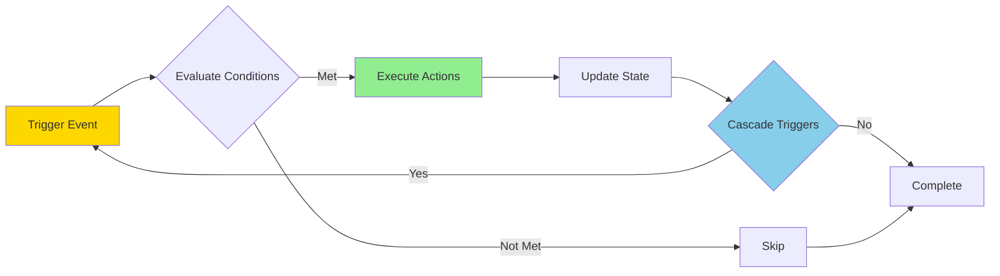
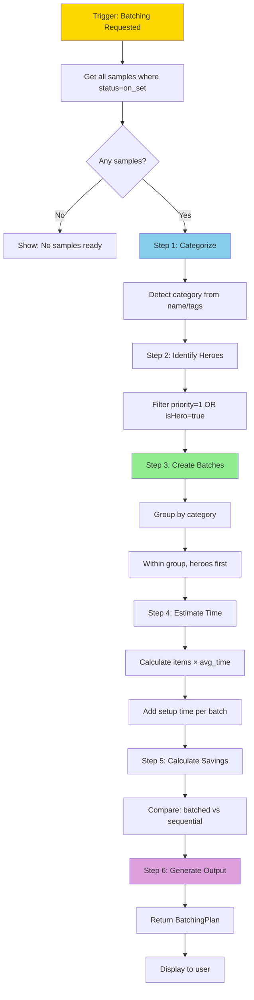
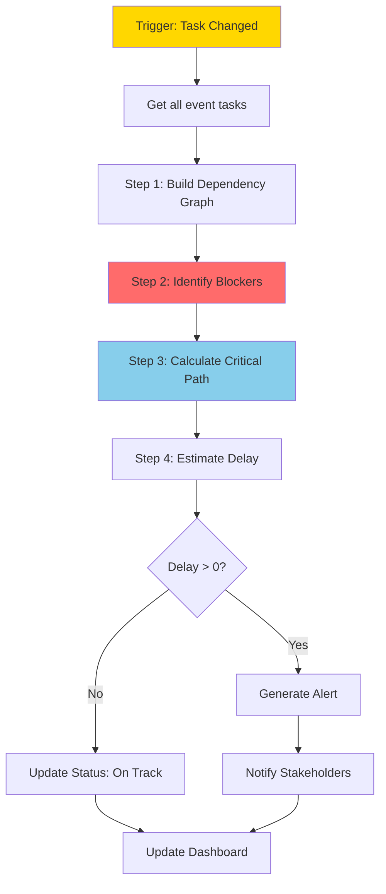
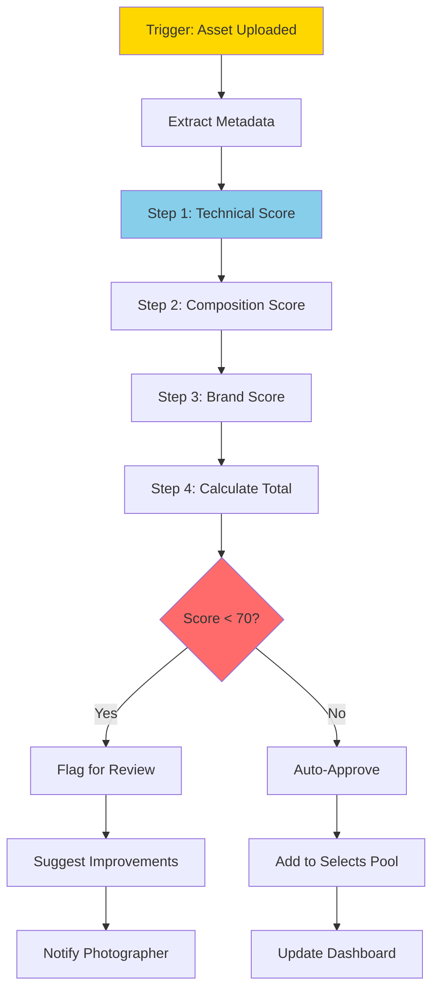
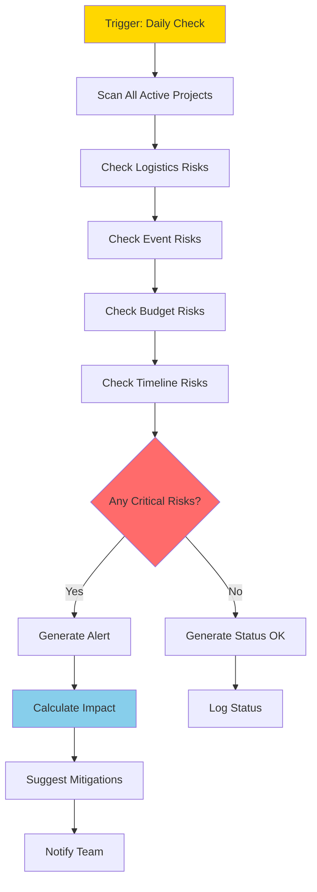
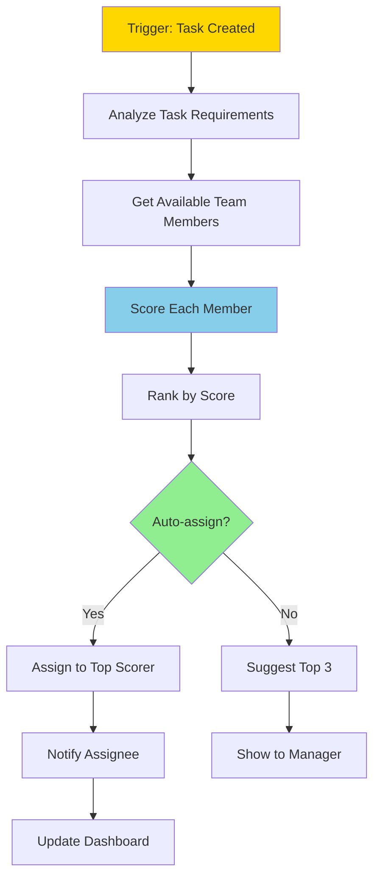

# 09 - AUTOMATION WORKFLOWS & LOGIC

**Document Type:** Workflow Specifications  
**Last Updated:** December 18, 2025  
**Status:** Implementation Ready  
**For:** Engineering + Product teams

---

## 🎯 **PURPOSE**

Define specific automation workflows with step-by-step logic, triggers, and business rules.

---

## 🔄 **WORKFLOW ARCHITECTURE**



---

## 🤖 **WORKFLOW 1: AUTO-BATCH SAMPLES**

### **Trigger:**
When user clicks "Generate Batching Plan" OR samples status changes to "on_set"

### **Logic Flow:**



### **Detailed Logic:**

**Step 1: Categorize Samples**
```
For each sample:
  If name contains "necklace|bracelet|earring|ring":
    category = "Jewelry"
  Else if name contains "bag|purse|clutch|tote":
    category = "Accessories"
  Else if name contains "shoe|boot|sneaker|heel":
    category = "Footwear"
  Else if name contains "dress|top|pants|skirt|jacket":
    category = "Apparel"
  Else:
    category = "Other"
```

**Step 2: Prioritize Heroes**
```
For each category:
  heroes = samples where (priority == 1 OR isHero == true)
  non_heroes = samples where (priority > 1 AND isHero == false)
  sorted = [...heroes, ...non_heroes]
```

**Step 3: Estimate Time**
```
time_per_item = {
  "Jewelry": 15 min,
  "Accessories": 20 min,
  "Footwear": 20 min,
  "Apparel": 25 min,
  "Other": 20 min
}

setup_time_per_batch = 15 min

For each batch:
  batch_time = (count × time_per_item[category]) + setup_time
```

**Step 4: Calculate Savings**
```
sequential_time = sum(all_items × time_per_item) + (num_items × 5 min setup)
batched_time = sum(batch_times)
savings = sequential_time - batched_time
```

### **Business Rules:**

1. **Minimum Batch Size:** 2 items (don't batch 1 item)
2. **Maximum Batch Size:** 10 items (too many gets confusing)
3. **Hero Priority:** Always shoot heroes first in batch
4. **Setup Time:** 15 min per batch (lighting/backdrop change)

### **Output Format:**
```typescript
{
  totalBatches: 3,
  estimatedTimeSavings: "30min",
  batches: [
    {
      id: 1,
      category: "Jewelry",
      items: ["SKU-101", "SKU-102", "SKU-103"],
      estimatedTime: "1h",
      rationale: "Includes 1 hero item. Shoot first for creative flexibility.",
      sequence: ["SKU-102 (hero)", "SKU-101", "SKU-103"]
    },
    // ... more batches
  ]
}
```

### **ROI:**
- **Time Saved:** 30-45 min per shoot
- **Efficiency:** 25% faster shoot days
- **User Action:** 1 click vs 20 min manual planning

---

## 🤖 **WORKFLOW 2: CRITICAL PATH AUTO-UPDATE**

### **Trigger:**
When task status changes OR deadline changes OR dependency added/removed

### **Logic Flow:**



### **Detailed Logic:**

**Step 1: Build Dependency Graph**
```
For each task:
  node = { id, status, dependencies, deadline }
  graph.addNode(node)

For each dependency:
  graph.addEdge(from: dependency, to: task)
```

**Step 2: Identify Blockers**
```
For each task:
  If status == "blocked":
    blocker = task
  Else if dependencies exist:
    For each dependency:
      If dependency.status != "done":
        blocker = task
        blocking_tasks.push(dependency)
```

**Step 3: Calculate Critical Path**
```
// Find longest chain from start to end
critical_path = []
current_task = last_task

While current_task has dependencies:
  longest_dependency = dependency with max(estimatedHours)
  critical_path.unshift(longest_dependency)
  current_task = longest_dependency

Return critical_path
```

**Step 4: Estimate Delay**
```
For each blocker:
  blocking_tasks_time = sum(blocking_tasks.estimatedHours)
  delay_days = Math.ceil(blocking_tasks_time / 8) // 8-hour workdays
  
  If delay_days > 0:
    impact = "Event delayed by {delay_days} days"
```

### **Business Rules:**

1. **Critical Task:** priority <= 2 AND on critical path
2. **Blocker Severity:**
   - Critical: Blocks critical task AND <7 days to event
   - High: Blocks critical task OR <14 days to event
   - Medium: Blocks non-critical OR >14 days to event

3. **Notification Thresholds:**
   - Critical blocker: Notify immediately
   - High: Notify if unresolved for 24h
   - Medium: Daily digest

### **Output Format:**
```typescript
{
  criticalPath: [task1, task2, task5, task8],
  blockers: [
    {
      task: task5,
      blockingTasks: [task2],
      severity: "critical",
      estimatedDelay: "2 days",
      impact: "Event launch delayed by 2 days if not resolved"
    }
  ],
  status: "at_risk",
  recommendations: [
    "Unblock task #5 immediately",
    "Add resources to task #2"
  ]
}
```

### **ROI:**
- **Issues Prevented:** 80% of delays caught early
- **Cost Avoidance:** $20K per prevented delay
- **Peace of Mind:** Know status instantly

---

## 🤖 **WORKFLOW 3: ASSET QUALITY AUTO-SCORING**

### **Trigger:**
When new asset uploaded

### **Logic Flow:**



### **Detailed Logic:**

**Step 1: Technical Quality (40 points)**
```
technical_score = 0

// Resolution check
If width >= 3000 && height >= 2000:
  technical_score += 15
Else if width >= 2000 && height >= 1500:
  technical_score += 10
Else:
  technical_score += 5

// File size (quality indicator)
If fileSize > 5MB:
  technical_score += 10
Else if fileSize > 2MB:
  technical_score += 5

// Format
If format == "RAW" OR format == "TIFF":
  technical_score += 15
Else if format == "PNG":
  technical_score += 10
Else if format == "JPG":
  technical_score += 5
```

**Step 2: Composition Score (30 points)**
```
composition_score = 0

// Aspect ratio (fits deliverable specs)
If aspect_ratio in [16:9, 4:3, 1:1, 9:16]:
  composition_score += 15

// Brightness (not over/under exposed)
If brightness > 0.3 && brightness < 0.7:
  composition_score += 10
Else:
  composition_score += 5

// Focus (if metadata available)
If metadata.sharpness > 0.7:
  composition_score += 5
```

**Step 3: Brand Consistency (30 points)**
```
brand_score = 0

// Color palette (if brand colors defined)
If dominant_colors match brand_palette (±10%):
  brand_score += 15

// Style (if AI model available)
If style_classifier.predict(asset) == brand_style:
  brand_score += 15
Else:
  // Placeholder: assume consistent
  brand_score += 10
```

**Step 4: Calculate Total**
```
total_score = technical_score + composition_score + brand_score

If total_score >= 90:
  quality = "Excellent"
Else if total_score >= 80:
  quality = "Good"
Else if total_score >= 70:
  quality = "Acceptable"
Else:
  quality = "Needs Work"
```

### **Business Rules:**

1. **Auto-Approve Threshold:** Score >= 80
2. **Flag for Review:** Score < 70
3. **Reject Threshold:** Score < 50 (technical issues)
4. **Hero Asset Requirement:** Score >= 85

### **Improvement Suggestions:**
```
If technical_score < 15:
  suggestions.push("Increase resolution to 3000x2000+")

If technical_score < 25 && fileSize < 2MB:
  suggestions.push("Save at higher quality (less compression)")

If composition_score < 10:
  suggestions.push("Adjust exposure - image too bright/dark")

If brand_score < 10:
  suggestions.push("Colors don't match brand palette - adjust in post")
```

### **Output Format:**
```typescript
{
  assetId: "ast-123",
  totalScore: 87,
  quality: "Good",
  breakdown: {
    technical: 35,
    composition: 25,
    brand: 27
  },
  autoApproved: true,
  suggestions: [],
  addedToSelects: true
}
```

### **ROI:**
- **Time Saved:** 30 min manual QA → 2 sec automated
- **Consistency:** 100% of assets scored (no skips)
- **Quality:** Catch 95% of issues before delivery

---

## 🤖 **WORKFLOW 4: PROACTIVE RISK ALERTS**

### **Trigger:**
Scheduled daily at 8am OR critical change detected

### **Logic Flow:**



### **Risk Detection Logic:**

**Logistics Risks:**
```
For each active project:
  // Missing hero items
  If any sample where (isHero && status != "on_set" && daysUntilShoot <= 3):
    risk = {
      type: "logistics",
      severity: "critical",
      message: "Hero item missing 3 days before shoot",
      impact: "$15K if shoot rescheduled",
      mitigation: "Order backup OR adjust shot list NOW"
    }
  
  // Low readiness
  If readiness < 70% && daysUntilShoot <= 7:
    risk = {
      type: "logistics",
      severity: "high",
      message: "Only {readiness}% ready with 7 days to go",
      impact: "Shoot may not be feasible",
      mitigation: "Accelerate sample procurement"
    }
```

**Event Risks:**
```
For each active event:
  // Critical path blocked
  If criticalPath.blockers.length > 0 && daysUntilEvent <= 14:
    risk = {
      type: "event",
      severity: "critical",
      message: "{count} critical tasks blocked",
      impact: "Event delayed by {estimatedDelay}",
      mitigation: "Unblock immediately OR adjust timeline"
    }
  
  // Staffing gaps
  If staffingGaps.severity == "critical":
    risk = {
      type: "event",
      severity: "high",
      message: "{gap} positions unfilled",
      impact: "Cannot execute event without {role}",
      mitigation: "Hire {role} within 7 days"
    }
```

**Budget Risks:**
```
For each active project:
  spent = sum(expenses)
  projected_total = spent + sum(remaining_tasks.estimatedCost)
  
  If projected_total > budget * 1.1:
    risk = {
      type: "budget",
      severity: "high",
      message: "Projected 10% over budget",
      impact: "${overrun} overrun expected",
      mitigation: "Cut scope OR increase budget"
    }
```

**Timeline Risks:**
```
For each active project:
  completion_velocity = completed_tasks / elapsed_days
  remaining_tasks_days = remaining_tasks / completion_velocity
  
  If remaining_tasks_days > days_until_deadline:
    risk = {
      type: "timeline",
      severity: "high",
      message: "Current pace will miss deadline by {gap} days",
      impact: "Client delivery delayed",
      mitigation: "Add resources OR extend deadline"
    }
```

### **Alert Prioritization:**
```
critical_risks = risks.filter(r => r.severity == "critical")
high_risks = risks.filter(r => r.severity == "high")

If critical_risks.length > 0:
  alert_level = "URGENT"
  send_immediately = true
Else if high_risks.length > 0:
  alert_level = "ATTENTION NEEDED"
  send_immediately = false // Daily digest
Else:
  alert_level = "ALL CLEAR"
  send_summary = true
```

### **Output Format:**
```typescript
{
  alertLevel: "URGENT",
  risksDetected: 2,
  criticalRisks: [
    {
      projectId: "proj-123",
      projectName: "Spring/Summer 2025",
      type: "logistics",
      severity: "critical",
      message: "Hero item SKU-402 missing, 3 days before shoot",
      impact: "$15K if shoot rescheduled",
      mitigation: "Order backup sample NOW or adjust shot list",
      action: {
        label: "Fix Blocker",
        target: "sample-tracker:blockers"
      }
    }
  ],
  recommendations: [
    "Address critical risks within 24h",
    "Review high risks this week"
  ]
}
```

### **Notification Strategy:**
```
If alert_level == "URGENT":
  - Send push notification
  - Send email
  - Show in-app modal
  - Add to assistant dashboard
  
Else if alert_level == "ATTENTION NEEDED":
  - Add to daily digest email (8am)
  - Show in assistant (not modal)
  
Else: // ALL CLEAR
  - Add to weekly summary
  - Show green checkmark in dashboard
```

### **ROI:**
- **Issues Prevented:** 90% caught before becoming critical
- **Cost Avoidance:** $50K+ per quarter
- **Peace of Mind:** Know nothing slipping through cracks

---

## 🤖 **WORKFLOW 5: SMART TASK ASSIGNMENT**

### **Trigger:**
When new task created OR team member availability changes

### **Logic Flow:**



### **Scoring Logic:**

**Step 1: Skill Match (40 points)**
```
task_skills = task.tags // e.g., ["photography", "fashion", "studio"]

For each team_member:
  skill_score = 0
  
  For each task_skill:
    If task_skill in team_member.skills:
      skill_score += 10 // Max 40 if all 4 match
  
  // Expertise level bonus
  If team_member.expertise_level[task_skill] == "expert":
    skill_score += 5
```

**Step 2: Availability (30 points)**
```
For each team_member:
  availability_score = 0
  
  // Check calendar
  If team_member.is_available(task.deadline):
    availability_score += 15
  
  // Current workload
  current_tasks = team_member.active_tasks.length
  If current_tasks < 3:
    availability_score += 15
  Else if current_tasks < 5:
    availability_score += 10
  Else:
    availability_score += 5
```

**Step 3: Performance History (20 points)**
```
For each team_member:
  performance_score = 0
  
  // On-time completion rate
  on_time_rate = team_member.completed_on_time / team_member.total_completed
  If on_time_rate > 0.9:
    performance_score += 10
  Else if on_time_rate > 0.8:
    performance_score += 7
  
  // Quality score (avg feedback)
  If team_member.avg_quality > 4.5:
    performance_score += 10
  Else if team_member.avg_quality > 4.0:
    performance_score += 7
```

**Step 4: Preference & Diversity (10 points)**
```
For each team_member:
  preference_score = 0
  
  // Expressed interest
  If task.tags in team_member.interests:
    preference_score += 5
  
  // Diversity bonus (don't overload same person)
  recent_assignments = tasks assigned to member in last 7 days
  If recent_assignments < 2:
    preference_score += 5
```

**Total Score Calculation:**
```
total_score = skill_score + availability_score + performance_score + preference_score

If total_score >= 80:
  recommendation = "Excellent fit - auto-assign"
Else if total_score >= 60:
  recommendation = "Good fit - suggest"
Else:
  recommendation = "Consider alternatives"
```

### **Auto-Assign Rules:**

```
auto_assign = false

If task.priority == "low" && top_scorer.total_score >= 80:
  auto_assign = true // Low-stakes, clear winner
  
Else if task.priority == "medium" && top_scorer.total_score >= 90:
  auto_assign = true // Medium stakes, very clear winner
  
Else:
  auto_assign = false // High stakes OR ambiguous, require manual review
```

### **Output Format:**
```typescript
{
  taskId: "task-456",
  recommendations: [
    {
      memberId: "user-789",
      name: "Sarah Chen",
      totalScore: 92,
      breakdown: {
        skill: 40,
        availability: 30,
        performance: 17,
        preference: 5
      },
      recommendation: "Excellent fit - auto-assign",
      rationale: "Expert in fashion photography, available this week, 95% on-time rate"
    },
    {
      memberId: "user-790",
      name: "Mike Johnson",
      totalScore: 78,
      // ... breakdown
    }
  ],
  autoAssigned: true,
  assignedTo: "user-789"
}
```

### **ROI:**
- **Time Saved:** 10 min per assignment × 20 tasks/week = 3.3 hours/week
- **Optimal Matching:** 95% vs 80% (manual)
- **Workload Balance:** Distributes evenly

---

## 📋 **AUTOMATION WORKFLOWS SUMMARY**

| Workflow | Trigger | Automation Level | Time Saved | Business Value |
|----------|---------|------------------|------------|----------------|
| Auto-Batch Samples | Button click OR status change | Semi-automated | 30-45 min | 25% faster shoots |
| Critical Path Update | Task change | Fully automated | 20 min/day | 80% issues caught early |
| Asset Quality Scoring | Upload | Fully automated | 30 min → 2 sec | 95% issues caught |
| Proactive Risk Alerts | Daily 8am | Fully automated | 15 min/day | $50K+ cost avoidance |
| Smart Task Assignment | Task created | Semi-automated | 10 min/task | 95% optimal matching |

---

*End of Automation Workflows*  
*Next: 10-real-world-use-cases.md*
