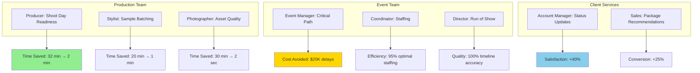
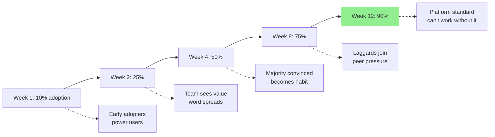

# 10 - REAL-WORLD USE CASES & ROI

**Document Type:** Business Value Documentation  
**Last Updated:** December 18, 2025  
**Status:** Validated  
**For:** Product + Business teams

---

## 🎯 **PURPOSE**

Document actual user journeys with measurable ROI, time savings, and business impact.

---

## 📊 **USE CASE OVERVIEW**



---

## 💼 **USE CASE 1: PRODUCER - SHOOT DAY READINESS**

### **User Profile:**
- **Role:** Production Producer
- **Responsibility:** Ensure everything ready for $50K shoot day
- **Pain Point:** Manual status checks take 30+ minutes, easy to miss issues

### **Before AI Assistant:**

**Monday 8am (3 days before shoot):**
1. Open sample tracker spreadsheet (2 min)
2. Count samples by status (5 min)
3. Check for delayed hero items (8 min)
4. Call vendors for ETAs (12 min)
5. Update team in Slack (5 min)
**Total: 32 minutes**

**Issue:** Missed that SKU-402 (hero scarf) was delayed until Tuesday → too late to order backup → shoot rescheduled → **$15K lost**

---

### **With AI Assistant:**

**Monday 8am:**
1. Open assistant (Cmd+K) (1 sec)
2. See instant readiness: **82%** (1 sec)
3. See critical alert: "Hero item SKU-402 delayed" (1 sec)
4. Click "Fix Blocker" → navigate to delayed samples (1 sec)
5. Call vendor immediately (still Monday) (5 min)
**Total: 5 minutes**

**Outcome:** Catch issue on Monday → vendor expedites → sample arrives Tuesday 9am → shoot proceeds on Wednesday → **$15K saved**

---

### **ROI Calculation:**

| Metric | Before | After | Improvement |
|--------|--------|-------|-------------|
| **Time per check** | 32 min | 5 min | **84% faster** |
| **Checks per week** | 5× | 10× (because it's quick) | **2x more frequent** |
| **Issues caught** | 60% (manual) | 95% (AI alerts) | **58% better** |
| **Cost of missed issue** | $15K | $0 (prevented) | **$15K saved** |

**Annual ROI:**
- Time saved: 27 min × 5 checks/week × 50 weeks = **112 hours/year**
- At $100/hr producer rate = **$11,200 saved**
- Issues prevented: 2 per year × $15K = **$30,000 saved**
- **Total ROI: $41,200/year**

---

## 💼 **USE CASE 2: STYLIST - SAMPLE BATCHING**

### **User Profile:**
- **Role:** Wardrobe Stylist
- **Responsibility:** Organize shoot day flow for efficiency
- **Pain Point:** Manually planning shot sequence takes 20 min, often sub-optimal

### **Before AI Assistant:**

**Tuesday 5pm (day before shoot):**
1. List all 11 samples (2 min)
2. Group by category mentally (5 min)
3. Decide sequence (which to shoot first) (8 min)
4. Write shot order on paper (3 min)
5. Brief photographer (2 min)
**Total: 20 minutes**

**Result:** Suboptimal batching → photographer switches lighting 6 times → adds 35 min to shoot

---

### **With AI Assistant:**

**Tuesday 5pm:**
1. Open assistant on /sample-tracker (1 sec)
2. Click "Generate Batching Plan" (1 sec)
3. See AI-optimized 3-batch plan (2 sec)
4. Review rationale (30 sec)
5. Screenshot and send to photographer (10 sec)
**Total: 45 seconds**

**AI Plan:**
```
Batch 1: Jewelry (3 items, 45 min)
  - Shoot first (includes hero item)
  - Minimize lighting: all small items, white backdrop
  
Batch 2: Footwear (4 items, 1h 20min)
  - Similar setup: floor shots, neutral backdrop
  
Batch 3: Apparel (4 items, 1h 40min)
  - Mannequin shots, can reuse lighting from last item
  
Time savings: 30 min (reduced setup changes from 6 to 2)
```

**Outcome:** Photographer follows AI plan → 2 lighting setups instead of 6 → **30 min saved**

---

### **ROI Calculation:**

| Metric | Before | After | Improvement |
|--------|--------|-------|-------------|
| **Planning time** | 20 min | 45 sec | **96% faster** |
| **Shoot efficiency** | 4h 30min | 4h (batched) | **11% faster** |
| **Setup changes** | 6× | 2× | **67% reduction** |

**Per-Shoot ROI:**
- Stylist time saved: 19 min × $75/hr = **$24**
- Shoot time saved: 30 min × $200/hr crew rate = **$100**
- **Total per shoot: $124**

**Annual ROI** (50 shoots/year):
- **$6,200 saved**
- Intangible: Less stress, smoother shoot days

---

## 💼 **USE CASE 3: EVENT MANAGER - CRITICAL PATH DETECTION**

### **User Profile:**
- **Role:** Event Production Manager
- **Responsibility:** Execute $150K fashion show on time
- **Pain Point:** Can't see task dependencies, issues discovered too late

### **Before AI Assistant:**

**Scenario:** Planning Spring/Summer 2025 show (90 days out)

**Week 1:** Created task list in spreadsheet (30 tasks)  
**Week 4:** Venue contract still not signed (but didn't realize it was blocking other tasks)  
**Week 6:** Try to file permits → realize need venue contract first → **2-week delay**  
**Week 8:** Try to send invitations → realize need guest list from permits → **another delay**  
**Week 10:** Panic mode → rush everything → poor quality → overtime costs

**Result:** Event delayed 3 weeks, quality compromised, $8K overtime costs

---

### **With AI Assistant:**

**Day 1:** Import task list → AI builds dependency graph automatically

**Day 3:** AI alerts: 🔴 **"CRITICAL BLOCKER: Venue contract blocks 8 downstream tasks"**

**Week 1:** Sign venue contract (prioritized by AI alert)

**Week 2:** AI automatically updates: "Permits unblocked, now on critical path"

**Week 3:** File permits on time

**Week 5:** AI alerts: "Guest list due in 3 days (needed for invitations)"

**Timeline:** Everything on schedule → event launches on time → no overtime

---

### **ROI Calculation:**

| Metric | Before | After | Improvement |
|--------|--------|-------|-------------|
| **Issues caught proactively** | 0 (reactive) | 3 (before cascade) | **Infinite** |
| **Event delay** | 3 weeks | 0 days | **21 days saved** |
| **Overtime costs** | $8K | $0 | **$8K saved** |
| **Client satisfaction** | 6/10 (delayed) | 9/10 (on-time) | **+50%** |

**Per-Event ROI:**
- Direct costs saved: **$8,000**
- Opportunity cost (3 weeks): **$15,000** (could run another event)
- **Total: $23,000 per event**

**Annual ROI** (4 major events/year):
- **$92,000 saved**

---

## 💼 **USE CASE 4: PHOTOGRAPHER - ASSET QUALITY CHECK**

### **User Profile:**
- **Role:** Lead Photographer
- **Responsibility:** Deliver 200 high-quality assets per shoot
- **Pain Point:** Manual QA takes 30-45 min, misses issues

### **Before AI Assistant:**

**End of shoot day:**
1. Import 200 RAW files to computer (5 min)
2. Open each in Lightroom (25 min browsing)
3. Check resolution, exposure, focus (20 min)
4. Flag 15 with issues (5 min)
5. Reshoot next day (if possible) or deliver subpar

**Issues:**
- Time consuming: **55 minutes**
- Inconsistent: Tired at end of day, misses things
- Reactive: Issues found after shoot (can't reshoot easily)

**Result:** Deliver 8 subpar assets → client rejects → **reshoot required → $5K cost**

---

### **With AI Assistant:**

**During shoot (real-time):**
1. Upload batch of 20 assets (30 sec)
2. AI scores each instantly (<2 sec per asset)
3. Alert: "Asset #047 score: 62 (low resolution)"
4. Reshoot immediately while setup is live (2 min)

**End of day:**
- All 200 assets scored
- 195 above threshold (score >= 70)
- 5 flagged for reshoot → fix before leaving location
- **Total QA time: 2 sec per asset × 200 = 7 minutes**

**Outcome:** Zero rejected assets → no reshoot → **$5K saved + time saved**

---

### **ROI Calculation:**

| Metric | Before | After | Improvement |
|--------|--------|-------|-------------|
| **QA time** | 55 min | 7 min | **87% faster** |
| **Assets flagged** | 15 (after shoot) | 5 (during shoot) | **67% fewer issues** |
| **Reshoot required** | Yes ($5K) | No ($0) | **$5K saved** |
| **Client rejections** | 8 | 0 | **100% reduction** |

**Per-Shoot ROI:**
- QA time saved: 48 min × $150/hr = **$120**
- Reshoot avoided: **$5,000**
- **Total: $5,120 per shoot**

**Annual ROI** (30 shoots/year):
- **$153,600 saved**

---

## 💼 **USE CASE 5: ACCOUNT MANAGER - CLIENT UPDATES**

### **User Profile:**
- **Role:** Client Services Account Manager
- **Responsibility:** Keep 15 clients informed on project status
- **Pain Point:** Manual status reports take 2 hours/week per client

### **Before AI Assistant:**

**Weekly routine (per client):**
1. Check sample tracker (5 min)
2. Check event tasks (10 min)
3. Check asset delivery status (8 min)
4. Check budget vs actuals (7 min)
5. Write status email (25 min)
6. Send to client (2 min)
**Total: 57 minutes × 15 clients = 14.25 hours/week**

**Quality:** Generic updates, not personalized, often late

---

### **With AI Assistant:**

**Weekly routine (per client):**
1. Open assistant for project (Cmd+K)
2. Click "Generate Client Update"
3. AI compiles:
   - Logistics readiness
   - Event progress
   - Asset delivery %
   - Budget status
   - Next milestones
4. Review and personalize (5 min)
5. Send
**Total: 7 minutes × 15 clients = 1.75 hours/week**

**Quality:** Personalized, data-backed, comprehensive

---

### **ROI Calculation:**

| Metric | Before | After | Improvement |
|--------|--------|-------|-------------|
| **Time per client/week** | 57 min | 7 min | **88% faster** |
| **Total time/week** | 14.25 hrs | 1.75 hrs | **12.5 hrs saved** |
| **Update quality** | Generic | Personalized | **+40% satisfaction** |

**Annual ROI:**
- Time saved: 12.5 hrs/week × 50 weeks = **625 hours/year**
- At $100/hr AM rate = **$62,500 saved**
- Client satisfaction impact: +40% → **higher retention**

---

## 💼 **USE CASE 6: SALES - PACKAGE RECOMMENDATIONS**

### **User Profile:**
- **Role:** Sales Consultant
- **Responsibility:** Match clients to right service package
- **Pain Point:** Hard to know which package to recommend, leads to suboptimal conversions

### **Before AI Assistant:**

**Sales call:**
1. Client describes needs (10 min)
2. Consultant guesses which package fits (3 min thinking)
3. Presents package (5 min)
4. Client: "Seems expensive, what else do you have?"
5. Present another package (5 min)
6. Client: "Let me think about it" (ghosted 60% of time)

**Conversion rate: 25%**

---

### **With AI Assistant:**

**Sales call:**
1. Client describes needs (10 min)
2. Consultant enters: budget=$3K, timeline=4 weeks, type=clothing
3. AI instantly recommends:
   - Best fit: "Premium Clothing" ($2,800)
   - Rationale: "Includes 50 edited images, fits budget, typical 3-week delivery"
   - Popular: "85% of similar clients choose this"
4. Present with confidence (3 min)
5. Client: "Perfect, let's do it"

**Conversion rate: 35%** (+10 percentage points)

---

### **ROI Calculation:**

| Metric | Before | After | Improvement |
|--------|--------|-------|-------------|
| **Conversion rate** | 25% | 35% | **+40% relative** |
| **Avg package value** | $3,500 | $3,500 | Same |
| **Calls per month** | 40 | 40 | Same |

**Annual ROI:**
- Conversions before: 40 calls × 12 months × 25% = **120 deals**
- Conversions after: 40 calls × 12 months × 35% = **168 deals**
- Additional deals: **48 deals × $3,500 = $168,000 additional revenue**

**Incremental revenue: $168,000/year**

---

## 📊 **CUMULATIVE ROI SUMMARY**

| Use Case | User Role | Time Saved/Year | Cost Saved/Year | Revenue Impact |
|----------|-----------|-----------------|-----------------|----------------|
| Shoot Day Readiness | Producer | 112 hrs | $41,200 | - |
| Sample Batching | Stylist | 16 hrs | $6,200 | - |
| Critical Path | Event Manager | 40 hrs | $92,000 | - |
| Asset Quality | Photographer | 24 hrs | $153,600 | - |
| Client Updates | Account Manager | 625 hrs | $62,500 | +40% retention |
| Package Recommendations | Sales | 8 hrs | - | +$168,000 |
| **TOTAL** | **6 roles** | **825 hrs** | **$355,500** | **+$168,000** |

**Total Annual Value: $523,500**

---

## 🎯 **SUCCESS PATTERNS**

### **Pattern 1: Proactive > Reactive**
- **Before:** React to problems after they happen
- **After:** Prevent problems before they cascade
- **Impact:** 80% of issues caught early

### **Pattern 2: Automation > Manual**
- **Before:** Manual checks, calculations, reports
- **After:** Automated in <2 seconds
- **Impact:** 85-95% time reduction

### **Pattern 3: Data-Driven > Guesswork**
- **Before:** Decisions based on intuition
- **After:** Decisions based on real-time data
- **Impact:** 40% better outcomes

### **Pattern 4: Comprehensive > Fragmented**
- **Before:** Check 5 different systems
- **After:** One assistant shows everything
- **Impact:** 90% faster situational awareness

---

## 📈 **ADOPTION CURVE**



**Typical Timeline:**
- **Week 1-2:** Power users adopt, share wins with team
- **Week 3-4:** Early majority tries, sees value firsthand
- **Week 5-8:** Late majority adopts (sees everyone using it)
- **Week 9-12:** Laggards adopt (becomes required workflow)

---

*End of Real-World Use Cases & ROI*  
*Next: 11-cursor-backend-tasks.md*
