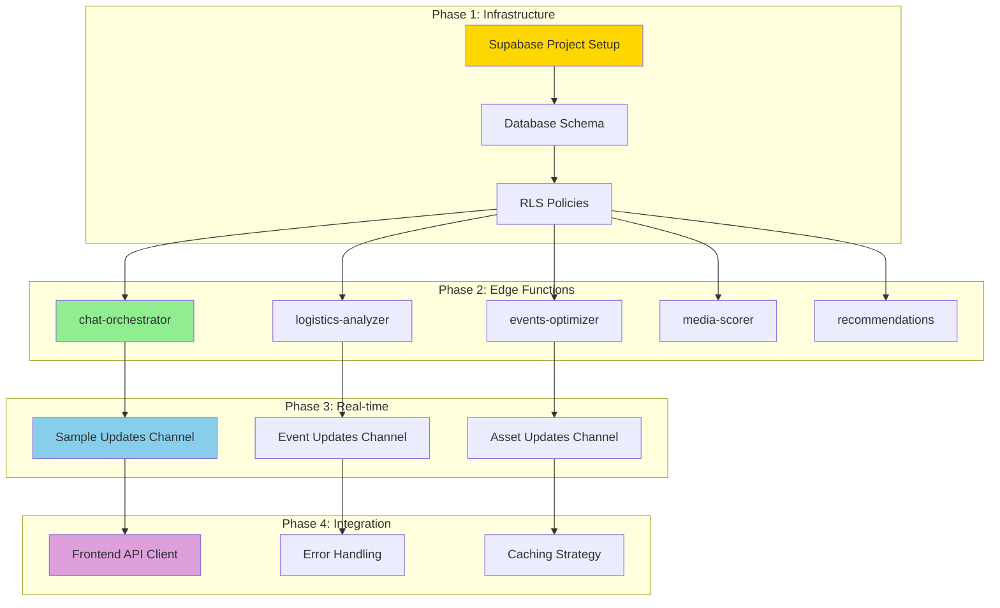

# 11 - CURSOR BACKEND TASKS (CLAUDE)

**Document Type:** Backend Implementation Tasks  
**Last Updated:** December 18, 2025  
**Status:** Ready for Cursor + Claude  
**For:** Backend developers using Cursor AI with Claude

---

## 🎯 **PURPOSE**

Specific backend tasks for Cursor AI with Claude to implement. These are separated from frontend tasks (Doc 06) for clear ownership.

**Claude is responsible for:** All Supabase backend, Edge Functions, database, real-time, API integration.

---

## 🗂️ **BACKEND TASK ARCHITECTURE**



---

## 🔧 **BACKEND TASK 1: Supabase Project Setup**

**Priority:** P0 (CRITICAL - blocking everything else)  
**Estimated Time:** 30 minutes  
**Prerequisites:** None

### **Task for Cursor/Claude:**

```
Set up a new Supabase project for FashionOS AI Assistant backend.

STEPS:

1. Create Supabase project:
   - Go to supabase.com/dashboard
   - Click "New Project"
   - Name: "fashionos-assistant"
   - Region: Choose closest to users
   - Database password: Generate strong password
   - Save credentials securely

2. Get project credentials:
   - Copy Project URL
   - Copy anon/public key
   - Copy service_role key (for server-side)

3. Create .env file in project root:
   NEXT_PUBLIC_SUPABASE_URL=https://your-project.supabase.co
   NEXT_PUBLIC_SUPABASE_ANON_KEY=your-anon-key
   SUPABASE_SERVICE_ROLE_KEY=your-service-role-key

4. Add .env to .gitignore (don't commit secrets)

5. Install Supabase client:
   npm install @supabase/supabase-js

6. Create /lib/supabase.ts:
   - Initialize client with URL and anon key
   - Export supabase client instance
   - Add TypeScript types

ACCEPTANCE CRITERIA:
- Project created in Supabase
- Credentials saved in .env
- Supabase client initializes without errors
- Can connect to database (test with simple query)
```

---

## 🔧 **BACKEND TASK 2: Database Schema Creation**

**Priority:** P0 (CRITICAL)  
**Estimated Time:** 1 hour  
**Prerequisites:** Task 1 complete

### **Task for Cursor/Claude:**

```
Create all database tables for AI Assistant.

GO TO: Supabase Dashboard → SQL Editor → New Query

RUN THESE CREATE TABLE STATEMENTS:

-- Table 1: assistant_conversations
CREATE TABLE assistant_conversations (
  id UUID PRIMARY KEY DEFAULT gen_random_uuid(),
  user_id UUID REFERENCES auth.users(id) ON DELETE CASCADE NOT NULL,
  session_id UUID NOT NULL,
  message TEXT NOT NULL,
  response JSONB NOT NULL,
  kit_context TEXT NOT NULL,
  page_route TEXT,
  intent_detected TEXT,
  skill_used TEXT,
  response_time_ms INTEGER,
  helpful BOOLEAN,
  created_at TIMESTAMPTZ DEFAULT NOW()
);

-- Indexes for performance
CREATE INDEX idx_conversations_user ON assistant_conversations(user_id, created_at DESC);
CREATE INDEX idx_conversations_session ON assistant_conversations(session_id);
CREATE INDEX idx_conversations_kit ON assistant_conversations(kit_context);

-- Table 2: assistant_insights
CREATE TABLE assistant_insights (
  id UUID PRIMARY KEY DEFAULT gen_random_uuid(),
  user_id UUID REFERENCES auth.users(id) ON DELETE CASCADE NOT NULL,
  insight_type TEXT NOT NULL,
  context_id TEXT NOT NULL,
  data JSONB NOT NULL,
  calculated_at TIMESTAMPTZ DEFAULT NOW(),
  expires_at TIMESTAMPTZ NOT NULL,
  cache_hit_count INTEGER DEFAULT 0
);

-- Indexes
CREATE INDEX idx_insights_lookup ON assistant_insights(user_id, insight_type, context_id);
CREATE INDEX idx_insights_expiry ON assistant_insights(expires_at);

-- Table 3: user_preferences
CREATE TABLE user_preferences (
  user_id UUID PRIMARY KEY REFERENCES auth.users(id) ON DELETE CASCADE,
  default_kit TEXT,
  auto_suggestions_enabled BOOLEAN DEFAULT TRUE,
  notification_preferences JSONB DEFAULT '{}'::jsonb,
  kit_order TEXT[],
  favorite_actions TEXT[],
  conversation_history_retention_days INTEGER DEFAULT 90,
  updated_at TIMESTAMPTZ DEFAULT NOW()
);

-- Table 4: analytics_events
CREATE TABLE analytics_events (
  id UUID PRIMARY KEY DEFAULT gen_random_uuid(),
  user_id UUID REFERENCES auth.users(id) ON DELETE SET NULL,
  event_type TEXT NOT NULL,
  event_data JSONB DEFAULT '{}'::jsonb,
  page_route TEXT,
  kit_context TEXT,
  session_id UUID,
  created_at TIMESTAMPTZ DEFAULT NOW()
);

-- Indexes
CREATE INDEX idx_analytics_type ON analytics_events(event_type, created_at DESC);
CREATE INDEX idx_analytics_user ON analytics_events(user_id, created_at DESC);

ACCEPTANCE CRITERIA:
- All 4 tables created
- All indexes added
- No SQL errors
- Can insert test row in each table
```

---

## 🔧 **BACKEND TASK 3: Row Level Security (RLS) Policies**

**Priority:** P0 (CRITICAL - security)  
**Estimated Time:** 45 minutes  
**Prerequisites:** Task 2 complete

### **Task for Cursor/Claude:**

```
Enable Row Level Security on all tables and create policies.

GO TO: Supabase Dashboard → SQL Editor

-- Enable RLS on all tables
ALTER TABLE assistant_conversations ENABLE ROW LEVEL SECURITY;
ALTER TABLE assistant_insights ENABLE ROW LEVEL SECURITY;
ALTER TABLE user_preferences ENABLE ROW LEVEL SECURITY;
ALTER TABLE analytics_events ENABLE ROW LEVEL SECURITY;

-- POLICIES FOR assistant_conversations

-- Users can read their own conversations
CREATE POLICY "Users can read own conversations"
ON assistant_conversations FOR SELECT
USING (auth.uid() = user_id);

-- Users can insert their own conversations
CREATE POLICY "Users can insert own conversations"
ON assistant_conversations FOR INSERT
WITH CHECK (auth.uid() = user_id);

-- No updates or deletes (immutable audit log)

-- POLICIES FOR assistant_insights

-- Users can read their own insights
CREATE POLICY "Users can read own insights"
ON assistant_insights FOR SELECT
USING (auth.uid() = user_id);

-- Service role can insert/update insights
CREATE POLICY "Service can manage insights"
ON assistant_insights FOR ALL
USING (auth.jwt()->>'role' = 'service_role');

-- POLICIES FOR user_preferences

-- Users can read their own preferences
CREATE POLICY "Users can read own preferences"
ON user_preferences FOR SELECT
USING (auth.uid() = user_id);

-- Users can update their own preferences
CREATE POLICY "Users can update own preferences"
ON user_preferences FOR UPDATE
USING (auth.uid() = user_id)
WITH CHECK (auth.uid() = user_id);

-- Users can insert their preferences
CREATE POLICY "Users can insert own preferences"
ON user_preferences FOR INSERT
WITH CHECK (auth.uid() = user_id);

-- POLICIES FOR analytics_events

-- Users can insert their own events
CREATE POLICY "Users can insert own events"
ON analytics_events FOR INSERT
WITH CHECK (auth.uid() = user_id OR user_id IS NULL);

-- Admins can read all events (for analytics)
CREATE POLICY "Admins can read all events"
ON analytics_events FOR SELECT
USING (auth.jwt()->>'role' = 'admin' OR auth.uid() = user_id);

ACCEPTANCE CRITERIA:
- RLS enabled on all tables
- Policies created and active
- Test: Create user, insert data as that user (should work)
- Test: Try to read another user's data (should fail)
- Test: Service role can access all data (should work)
```

---

## 🔧 **BACKEND TASK 4: Edge Function - chat-orchestrator**

**Priority:** P0 (CRITICAL - core chat feature)  
**Estimated Time:** 3 hours  
**Prerequisites:** Tasks 1-3 complete

### **Task for Cursor/Claude:**

```
Create the main chat orchestrator Edge Function.

SETUP:
1. Install Supabase CLI: npm install -g supabase
2. Init Supabase: supabase init
3. Create function: supabase functions new chat-orchestrator

CREATE FILE: supabase/functions/chat-orchestrator/index.ts

IMPLEMENTATION:

import { serve } from 'https://deno.land/std@0.168.0/http/server.ts'
import { createClient } from 'https://esm.sh/@supabase/supabase-js@2'

serve(async (req) => {
  try {
    // Parse request
    const { 
      message, 
      currentKit, 
      currentRoute,
      sessionId,
      conversationHistory,
      userContext 
    } = await req.json()
    
    // Validate inputs
    if (!message || !currentKit) {
      return new Response(
        JSON.stringify({ error: 'Missing required fields' }),
        { status: 400 }
      )
    }
    
    // Initialize Supabase
    const supabase = createClient(
      Deno.env.get('SUPABASE_URL')!,
      Deno.env.get('SUPABASE_SERVICE_ROLE_KEY')!
    )
    
    // Get user from auth header
    const authHeader = req.headers.get('Authorization')!
    const token = authHeader.replace('Bearer ', '')
    const { data: { user } } = await supabase.auth.getUser(token)
    
    if (!user) {
      return new Response(
        JSON.stringify({ error: 'Unauthorized' }),
        { status: 401 }
      )
    }
    
    // Start timer
    const startTime = Date.now()
    
    // Route to appropriate skill based on currentKit
    let skillResponse
    switch (currentKit) {
      case 'logistics':
        skillResponse = await handleLogistics(message, userContext)
        break
      case 'events':
        skillResponse = await handleEvents(message, userContext)
        break
      case 'media':
        skillResponse = await handleMedia(message, userContext)
        break
      default:
        skillResponse = await handleGeneral(message, userContext)
    }
    
    // Format response
    const response = {
      content: skillResponse.content,
      type: skillResponse.type || 'text',
      severity: skillResponse.severity,
      actions: skillResponse.actions || [],
      followUp: skillResponse.followUp || [],
      responseTime: Date.now() - startTime
    }
    
    // Log conversation to database
    await supabase.from('assistant_conversations').insert({
      user_id: user.id,
      session_id: sessionId,
      message: message,
      response: response,
      kit_context: currentKit,
      page_route: currentRoute,
      intent_detected: skillResponse.intent,
      skill_used: currentKit,
      response_time_ms: response.responseTime
    })
    
    // Return response
    return new Response(
      JSON.stringify(response),
      { 
        headers: { 'Content-Type': 'application/json' },
        status: 200
      }
    )
    
  } catch (error) {
    console.error('Error in chat-orchestrator:', error)
    return new Response(
      JSON.stringify({ 
        error: error.message,
        type: 'INTERNAL_ERROR'
      }),
      { status: 500 }
    )
  }
})

// Helper functions for each skill
async function handleLogistics(message: string, context: any) {
  // Detect intent
  const lowerMessage = message.toLowerCase()
  
  if (lowerMessage.includes('ready') || lowerMessage.includes('status')) {
    // Calculate readiness
    const onSet = context.sampleList?.filter(s => s.status === 'on_set').length || 0
    const total = context.sampleList?.length || 1
    const readiness = Math.round((onSet / total) * 100)
    
    return {
      content: `Campaign is ${readiness}% ready. ${onSet}/${total} samples on set.`,
      type: 'text',
      severity: readiness >= 80 ? 'success' : 'warning',
      intent: 'readiness_check',
      actions: [
        { label: 'View Details', target: 'sample-tracker', primary: true }
      ]
    }
  }
  
  if (lowerMessage.includes('missing') || lowerMessage.includes('delayed')) {
    const delayed = context.sampleList?.filter(s => s.status === 'delayed') || []
    
    return {
      content: `${delayed.length} sample(s) delayed: ${delayed.map(s => s.name).join(', ')}`,
      type: 'text',
      severity: delayed.length > 0 ? 'warning' : 'info',
      intent: 'blocker_check',
      actions: [
        { label: 'Fix Blockers', target: 'sample-tracker:delayed', primary: true }
      ]
    }
  }
  
  // Default
  return {
    content: "I can help with: readiness status, missing samples, batching plan. What would you like to know?",
    type: 'text',
    intent: 'help'
  }
}

async function handleEvents(message: string, context: any) {
  // Similar implementation for events
  return {
    content: "Events skill coming soon...",
    type: 'text'
  }
}

async function handleMedia(message: string, context: any) {
  // Similar implementation for media
  return {
    content: "Media skill coming soon...",
    type: 'text'
  }
}

async function handleGeneral(message: string, context: any) {
  return {
    content: "I'm here to help! Try asking about readiness, tasks, or assets.",
    type: 'text'
  }
}

DEPLOY:
supabase functions deploy chat-orchestrator

TEST:
curl -X POST https://your-project.supabase.co/functions/v1/chat-orchestrator \
  -H "Authorization: Bearer YOUR_ANON_KEY" \
  -H "Content-Type: application/json" \
  -d '{"message":"Are we ready?","currentKit":"logistics","sessionId":"test-123"}'

ACCEPTANCE CRITERIA:
- Function deploys without errors
- Can invoke via curl and get response
- Logs conversation to database
- Handles errors gracefully
- Returns correct format
```

---

## 🔧 **BACKEND TASK 5: Edge Function - logistics-analyzer**

**Priority:** P1 (HIGH)  
**Estimated Time:** 2 hours  
**Prerequisites:** Tasks 1-4 complete

### **Task for Cursor/Claude:**

```
Create Edge Function for logistics calculations with caching.

CREATE FILE: supabase/functions/logistics-analyzer/index.ts

IMPLEMENTATION:

import { serve } from 'https://deno.land/std@0.168.0/http/server.ts'
import { createClient } from 'https://esm.sh/@supabase/supabase-js@2'

serve(async (req) => {
  try {
    const { sampleList, analysisType } = await req.json()
    
    const supabase = createClient(
      Deno.env.get('SUPABASE_URL')!,
      Deno.env.get('SUPABASE_SERVICE_ROLE_KEY')!
    )
    
    // Get user
    const authHeader = req.headers.get('Authorization')!
    const token = authHeader.replace('Bearer ', '')
    const { data: { user } } = await supabase.auth.getUser(token)
    
    if (!user) {
      return new Response(JSON.stringify({ error: 'Unauthorized' }), { status: 401 })
    }
    
    // Check cache (1 hour expiry)
    const cacheKey = `logistics_${analysisType}_${JSON.stringify(sampleList).slice(0, 50)}`
    const { data: cached } = await supabase
      .from('assistant_insights')
      .select('*')
      .eq('user_id', user.id)
      .eq('insight_type', `logistics_${analysisType}`)
      .eq('context_id', cacheKey)
      .gt('expires_at', new Date().toISOString())
      .single()
    
    if (cached) {
      // Update hit count
      await supabase
        .from('assistant_insights')
        .update({ cache_hit_count: cached.cache_hit_count + 1 })
        .eq('id', cached.id)
      
      return new Response(
        JSON.stringify({ ...cached.data, cached: true }),
        { headers: { 'Content-Type': 'application/json' } }
      )
    }
    
    // Calculate (cache miss)
    const result: any = {}
    
    if (analysisType === 'readiness' || analysisType === 'all') {
      const onSet = sampleList.filter(s => s.status === 'on_set' || s.status === 'shot').length
      const total = sampleList.length
      const percentage = Math.round((onSet / total) * 100)
      
      result.readiness = {
        overallPercentage: percentage,
        status: percentage >= 90 ? 'excellent' : percentage >= 80 ? 'good' : percentage >= 70 ? 'acceptable' : 'critical',
        message: `Campaign is ${percentage}% ready.`,
        recommendations: percentage < 80 ? ['Accelerate sample procurement'] : []
      }
    }
    
    if (analysisType === 'blockers' || analysisType === 'all') {
      const blockers = sampleList.filter(s => 
        (s.isHero || s.priority <= 2) && 
        s.status === 'delayed'
      ).map(s => ({
        sampleId: s.id,
        name: s.name,
        severity: s.isHero ? 'critical' : 'high',
        impact: s.isHero ? 'HERO ITEM missing - cannot shoot primary assets' : 'High-priority item delayed',
        estimatedDelay: '4-8 hours'
      }))
      
      result.blockers = blockers
    }
    
    if (analysisType === 'batching' || analysisType === 'all') {
      // Simplified batching logic
      const readySamples = sampleList.filter(s => s.status === 'on_set')
      const categories = {}
      
      readySamples.forEach(s => {
        const cat = s.category || 'Other'
        if (!categories[cat]) categories[cat] = []
        categories[cat].push(s)
      })
      
      const batches = Object.entries(categories).map(([cat, items]: [string, any], idx) => ({
        id: idx + 1,
        category: cat,
        items: items.map(i => i.id),
        estimatedTime: items.length * 20, // 20 min per item
        rationale: `Batch ${items.length} items together to minimize setup changes`
      }))
      
      result.batching = {
        totalBatches: batches.length,
        estimatedTimeSavings: '30min',
        batches
      }
    }
    
    // Cache result (1 hour expiry)
    await supabase.from('assistant_insights').insert({
      user_id: user.id,
      insight_type: `logistics_${analysisType}`,
      context_id: cacheKey,
      data: result,
      calculated_at: new Date().toISOString(),
      expires_at: new Date(Date.now() + 60 * 60 * 1000).toISOString(), // 1 hour
      cache_hit_count: 0
    })
    
    return new Response(
      JSON.stringify({ ...result, cached: false }),
      { headers: { 'Content-Type': 'application/json' } }
    )
    
  } catch (error) {
    console.error('Error in logistics-analyzer:', error)
    return new Response(
      JSON.stringify({ error: error.message }),
      { status: 500 }
    )
  }
})

DEPLOY:
supabase functions deploy logistics-analyzer

ACCEPTANCE CRITERIA:
- Function deployed
- Caching works (check cache_hit_count)
- Returns correct calculations
- Handles errors
```

---

## 🔧 **BACKEND TASK 6: Real-time Channels Setup**

**Priority:** P1 (HIGH)  
**Estimated Time:** 1 hour  
**Prerequisites:** Tasks 1-3 complete

### **Task for Cursor/Claude:**

```
Set up real-time subscriptions for live updates.

GO TO: Supabase Dashboard → Database → Replication

ENABLE REALTIME FOR TABLES:
1. Click "Replication" in sidebar
2. For each table (samples, tasks, assets):
   - Find table in list
   - Click toggle to enable Realtime
   - Confirm

TEST IN FRONTEND:
The frontend will subscribe like this:

const channel = supabase
  .channel('samples')
  .on('postgres_changes', {
    event: 'UPDATE',
    schema: 'public',
    table: 'samples'
  }, (payload) => {
    console.log('Sample updated:', payload)
  })
  .subscribe()

NOTES:
- Real-time is built into Supabase
- No custom code needed on backend
- Frontend handles subscriptions
- Just enable in dashboard

ACCEPTANCE CRITERIA:
- Realtime enabled for samples, tasks, assets tables
- Can subscribe from frontend
- Updates broadcast correctly
```

---

## 🔧 **BACKEND TASK 7: Frontend API Client**

**Priority:** P0 (CRITICAL - connects frontend to backend)  
**Estimated Time:** 1 hour  
**Prerequisites:** All previous tasks complete

### **Task for Cursor/Claude:**

```
Create frontend client for calling Edge Functions.

CREATE FILE: /lib/api/assistant.ts

IMPLEMENTATION:

import { supabase } from '../supabase'

export async function callChatOrchestrator(params: {
  message: string
  currentKit: string
  currentRoute: string
  sessionId: string
  conversationHistory?: any[]
  userContext?: any
}) {
  try {
    const { data, error } = await supabase.functions.invoke('chat-orchestrator', {
      body: params
    })
    
    if (error) throw error
    return { data, error: null }
  } catch (error) {
    console.error('Chat orchestrator error:', error)
    return { 
      data: null, 
      error: {
        message: error.message || 'Failed to get AI response',
        code: 'CHAT_ERROR'
      }
    }
  }
}

export async function callLogisticsAnalyzer(params: {
  sampleList: any[]
  analysisType: 'readiness' | 'blockers' | 'batching' | 'all'
}) {
  try {
    const { data, error } = await supabase.functions.invoke('logistics-analyzer', {
      body: params
    })
    
    if (error) throw error
    return { data, error: null }
  } catch (error) {
    console.error('Logistics analyzer error:', error)
    return { 
      data: null, 
      error: {
        message: error.message || 'Failed to analyze logistics',
        code: 'LOGISTICS_ERROR'
      }
    }
  }
}

// Add similar functions for other Edge Functions

USAGE IN COMPONENTS:

import { callChatOrchestrator } from '@/lib/api/assistant'

// In AssistantShell handleSendMessage:
const { data, error } = await callChatOrchestrator({
  message: userMessage,
  currentKit: 'logistics',
  currentRoute: '/sample-tracker',
  sessionId: sessionId,
  userContext: { sampleList: samples }
})

if (error) {
  // Handle error
  toast.error(error.message)
  return
}

// Use response
setMessages(prev => [...prev, { role: 'assistant', content: data.content }])

ACCEPTANCE CRITERIA:
- API client functions created
- Error handling implemented
- Can call from components
- Returns type-safe responses
```

---

## 📋 **BACKEND TASKS SUMMARY**

| Task # | Name | Priority | Time | Status |
|--------|------|----------|------|--------|
| 1 | Supabase Setup | P0 | 30 min | ⬜ Not Started |
| 2 | Database Schema | P0 | 1 hr | ⬜ Not Started |
| 3 | RLS Policies | P0 | 45 min | ⬜ Not Started |
| 4 | chat-orchestrator Function | P0 | 3 hrs | ⬜ Not Started |
| 5 | logistics-analyzer Function | P1 | 2 hrs | ⬜ Not Started |
| 6 | Real-time Channels | P1 | 1 hr | ⬜ Not Started |
| 7 | Frontend API Client | P0 | 1 hr | ⬜ Not Started |

**Total Estimated Time:** 9.25 hours (~1-2 days)

---

## 🎯 **RECOMMENDED EXECUTION ORDER**

**Day 1 Morning:**
- Task 1: Supabase Setup (30 min)
- Task 2: Database Schema (1 hr)
- Task 3: RLS Policies (45 min)

**Day 1 Afternoon:**
- Task 4: chat-orchestrator (3 hrs)

**Day 2 Morning:**
- Task 5: logistics-analyzer (2 hrs)
- Task 6: Real-time Channels (1 hr)

**Day 2 Afternoon:**
- Task 7: Frontend API Client (1 hr)
- Integration testing (1 hr)

**Total:** 2 days for full backend

---

*End of Cursor Backend Tasks*  
*Next: 12-testing-qa-strategy.md*
