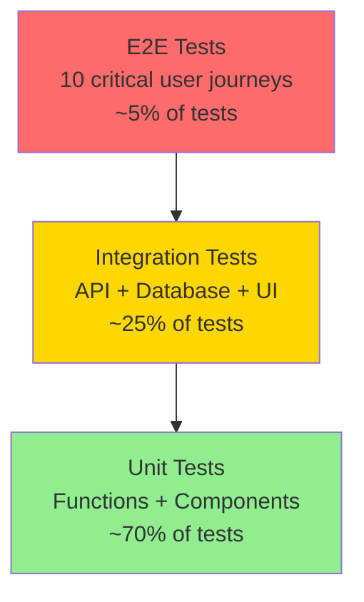
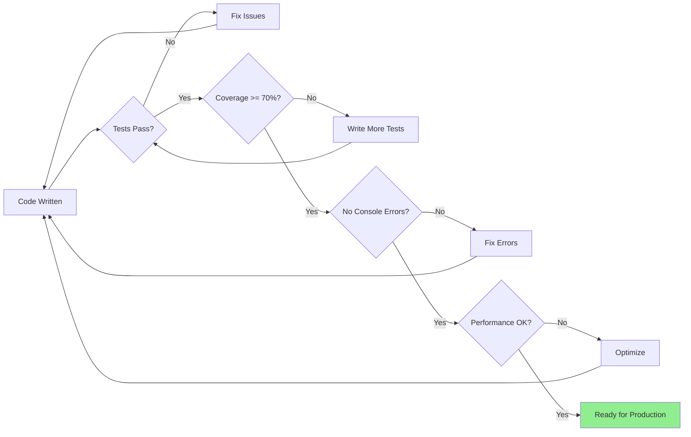

# 12 - TESTING & QA STRATEGY

**Document Type:** Quality Assurance  
**Last Updated:** December 18, 2025  
**Status:** Production Ready  
**For:** QA + Engineering teams

---

## 🎯 **PURPOSE**

Define comprehensive testing strategy to ensure AI Assistant is production-ready before launch.

---

## 🧪 **TESTING PYRAMID**



---

## ✅ **MANUAL TESTING CHECKLIST**

### **Phase 1: Core Functionality (2 hours)**

#### **Test 1.1: Assistant Opens Correctly**
- [ ] Click launcher button → assistant opens
- [ ] Press Cmd+K → assistant opens
- [ ] Press Cmd+K again → assistant closes
- [ ] Press Escape → assistant closes
- [ ] Click outside → assistant closes
- [ ] No console errors

**Expected:** Smooth open/close, no flicker, animations work

---

#### **Test 1.2: Route Detection**
- [ ] Navigate to /sample-tracker → LogisticsKit loads
- [ ] Navigate to /events → EventsKit loads
- [ ] Navigate to /gallery → MediaKit loads (when built)
- [ ] Navigate to /services → ServicesKit loads (when built)
- [ ] Navigate to / (home) → MarketingKit loads (when built)
- [ ] Context chip shows correct page name

**Expected:** Correct kit loads <50ms, no wrong content flash

---

#### **Test 1.3: Quick Actions**
For each kit (LogisticsKit, EventsKit, etc.):
- [ ] All 4 quick action buttons visible
- [ ] Hover shows correct state
- [ ] Click navigates to correct page
- [ ] Filters applied automatically (where applicable)
- [ ] No broken links

**Expected:** 1-click navigation to filtered views

---

#### **Test 1.4: Insight Cards**
For each kit:
- [ ] All 4 insight cards visible
- [ ] Data accurate (validate against source)
- [ ] Colors correct (green/amber/red)
- [ ] Cards update when data changes
- [ ] No stale data

**Expected:** Real-time accurate metrics

---

#### **Test 1.5: Deep Linking**
- [ ] Click "Show Missing" → navigates to /sample-tracker with delayed filter
- [ ] Click "Fix Blockers" → navigates with blocker filter
- [ ] Click "Critical Path" → navigates to /eventdetail with tab
- [ ] Click "View Batching Plan" → opens batching modal
- [ ] State persists after navigation

**Expected:** Direct navigation with state pre-applied

---

### **Phase 2: AI Intelligence (3 hours)**

#### **Test 2.1: LogisticsSkill Accuracy**
Test scenarios:
1. **Scenario:** 10 samples, 8 on_set, 2 delayed
   - [ ] Readiness shows: 80%
   - [ ] Status shows: "Good"
   - [ ] Recommendations appropriate

2. **Scenario:** 1 hero sample delayed, 5 days before shoot
   - [ ] Blocker detected: Critical
   - [ ] Impact message accurate
   - [ ] Resolution suggested

3. **Scenario:** 11 samples ready (3 jewelry, 4 footwear, 4 apparel)
   - [ ] Batching plan: 3 batches
   - [ ] Heroes prioritized first
   - [ ] Time estimates reasonable

**Expected:** Calculations correct, recommendations helpful

---

#### **Test 2.2: EventsSkill Accuracy**
Test scenarios:
1. **Scenario:** Event with 8 tasks, 5 done, 3 todo, 0 blocked
   - [ ] Completion: 63%
   - [ ] Status: "On Track"
   - [ ] No critical alerts

2. **Scenario:** Task #5 blocked by Task #2 (not done)
   - [ ] Blocker detected
   - [ ] Severity: High or Critical
   - [ ] Estimated delay calculated

3. **Scenario:** Event in 5 days, 40% complete
   - [ ] Status: "At Risk"
   - [ ] Alert shown
   - [ ] Recommendations given

**Expected:** Accurate dependency analysis, helpful alerts

---

#### **Test 2.3: Chat Intelligence (when AgentOrchestrator built)**
Test queries:
1. "Are we ready?" → Should call readiness analysis
2. "What's missing?" → Should list delayed/missing items
3. "How can we optimize?" → Should suggest batching
4. "Show me events" → Should navigate to /events
5. Gibberish input → Should handle gracefully

**Expected:** Correct intent detection, helpful responses

---

### **Phase 3: Error Handling (1 hour)**

#### **Test 3.1: Network Errors**
- [ ] Disconnect internet → graceful error message
- [ ] Slow connection (throttle) → loading state shown
- [ ] Backend down → falls back to client-side
- [ ] Timeout (>5s) → shows retry option

**Expected:** No crashes, user-friendly messages

---

#### **Test 3.2: Invalid Data**
- [ ] Empty sample list → shows "No data"
- [ ] Malformed data → doesn't crash
- [ ] Missing required fields → handles gracefully
- [ ] Null/undefined values → doesn't crash

**Expected:** Defensive programming, no crashes

---

#### **Test 3.3: Edge Cases**
- [ ] 0 samples → shows empty state
- [ ] 1000 samples → still performant
- [ ] All samples delayed → critical alert
- [ ] All samples ready → success message
- [ ] Duplicate IDs → handles correctly

**Expected:** Handles extremes gracefully

---

### **Phase 4: Performance (1 hour)**

#### **Test 4.1: Speed**
- [ ] Assistant opens <200ms
- [ ] Kit switch <50ms
- [ ] Insight calculation <10ms (client) or <500ms (server)
- [ ] Deep link navigation <100ms
- [ ] No lag when typing in chat

**Expected:** Buttery smooth, no delays

---

#### **Test 4.2: Memory**
- [ ] Open/close 20 times → no memory leak
- [ ] Switch kits 20 times → no memory leak
- [ ] Navigate pages 20 times → no memory leak
- [ ] Chrome DevTools Memory Profiler: stable

**Expected:** No memory growth over time

---

#### **Test 4.3: Animation**
- [ ] 60fps on desktop (check Chrome DevTools FPS meter)
- [ ] 30fps+ on mobile
- [ ] No jank during scroll
- [ ] Smooth open/close

**Expected:** Smooth animations, no stuttering

---

### **Phase 5: Cross-Browser (2 hours)**

#### **Test 5.1: Chrome (Latest)**
- [ ] All features work
- [ ] Animations smooth
- [ ] No console errors
- [ ] Performance good

#### **Test 5.2: Safari (Latest)**
- [ ] All features work
- [ ] Animations smooth
- [ ] No console errors
- [ ] Performance good

#### **Test 5.3: Firefox (Latest)**
- [ ] All features work
- [ ] Animations smooth
- [ ] No console errors
- [ ] Performance good

#### **Test 5.4: Edge (Latest)**
- [ ] All features work
- [ ] Animations smooth
- [ ] No console errors
- [ ] Performance good

**Expected:** Works identically on all browsers

---

### **Phase 6: Mobile (2 hours)**

#### **Test 6.1: iOS Safari (iPhone 13)**
- [ ] Bottom sheet appears correctly
- [ ] Touch targets large enough (44x44px)
- [ ] Swipe down to close works
- [ ] Keyboard doesn't cover input
- [ ] Scrolling smooth
- [ ] Animations acceptable

#### **Test 6.2: iOS Safari (iPhone SE - smaller screen)**
- [ ] All content fits
- [ ] No horizontal scroll
- [ ] Text readable
- [ ] Buttons accessible

#### **Test 6.3: Android Chrome (Samsung)**
- [ ] All features work
- [ ] Touch responsive
- [ ] No rendering issues

#### **Test 6.4: Android Chrome (Pixel)**
- [ ] All features work
- [ ] Touch responsive
- [ ] No rendering issues

#### **Test 6.5: iPad**
- [ ] Adapts to tablet size appropriately
- [ ] Not just blown-up mobile version

**Expected:** Great mobile experience

---

### **Phase 7: Accessibility (1 hour)**

#### **Test 7.1: Keyboard Only**
- [ ] Can open assistant with keyboard
- [ ] Can navigate all elements with Tab
- [ ] Can trigger actions with Enter/Space
- [ ] Can close with Escape
- [ ] Focus visible (outline shown)
- [ ] Tab order logical

**Expected:** Fully keyboard accessible

---

#### **Test 7.2: Screen Reader (NVDA/JAWS)**
- [ ] Assistant announces when opened
- [ ] Insight cards announced correctly
- [ ] Actions announced with purpose
- [ ] Alerts announced with severity
- [ ] Chat messages announced

**Expected:** Usable with screen reader

---

#### **Test 7.3: Color Contrast**
- [ ] All text meets 4.5:1 contrast ratio
- [ ] Interactive elements meet 3:1
- [ ] Severity not indicated by color alone

**Expected:** WCAG 2.1 AA compliant

---

## 🤖 **AUTOMATED TESTING**

### **Unit Tests (70% coverage target)**

```typescript
// Example: LogisticsSkill.test.ts

describe('LogisticsSkill', () => {
  describe('analyzeReadiness', () => {
    it('calculates 100% when all samples on_set', () => {
      const samples = [
        { id: '1', status: 'on_set' },
        { id: '2', status: 'on_set' }
      ]
      const result = analyzeReadiness(samples)
      expect(result.overallPercentage).toBe(100)
      expect(result.status).toBe('excellent')
    })
    
    it('calculates 50% when half samples on_set', () => {
      const samples = [
        { id: '1', status: 'on_set' },
        { id: '2', status: 'awaiting' }
      ]
      const result = analyzeReadiness(samples)
      expect(result.overallPercentage).toBe(50)
      expect(result.status).toBe('critical')
    })
    
    it('handles empty array', () => {
      const result = analyzeReadiness([])
      expect(result.overallPercentage).toBe(0)
    })
  })
  
  describe('identifyBlockers', () => {
    it('detects hero item delayed as critical', () => {
      const samples = [
        { id: '1', isHero: true, status: 'delayed', name: 'Hero Item' }
      ]
      const result = identifyBlockers(samples)
      expect(result).toHaveLength(1)
      expect(result[0].severity).toBe('critical')
    })
    
    it('returns empty array when no blockers', () => {
      const samples = [
        { id: '1', isHero: false, status: 'on_set' }
      ]
      const result = identifyBlockers(samples)
      expect(result).toHaveLength(0)
    })
  })
})
```

**Run with:** `npm test`

---

### **Integration Tests (25% coverage target)**

```typescript
// Example: AssistantShell.integration.test.tsx

describe('AssistantShell Integration', () => {
  it('loads correct kit based on route', async () => {
    render(
      <AssistantShell currentRoute="sample-tracker" onNavigate={jest.fn()} />
    )
    
    // Open assistant
    fireEvent.click(screen.getByRole('button', { name: /open assistant/i }))
    
    // Should show LogisticsKit
    expect(screen.getByText('Logistics')).toBeInTheDocument()
    expect(screen.getByText('Show Missing')).toBeInTheDocument()
  })
  
  it('switches kit when route changes', async () => {
    const { rerender } = render(
      <AssistantShell currentRoute="sample-tracker" onNavigate={jest.fn()} />
    )
    
    // Initially shows LogisticsKit
    expect(screen.getByText('Logistics')).toBeInTheDocument()
    
    // Change route
    rerender(
      <AssistantShell currentRoute="events" onNavigate={jest.fn()} />
    )
    
    // Should now show EventsKit
    expect(screen.getByText('Events')).toBeInTheDocument()
  })
})
```

**Run with:** `npm test -- --integration`

---

### **E2E Tests (5% coverage target)**

```typescript
// Example: critical-path.e2e.test.ts (using Playwright)

test('Producer can check shoot readiness and fix blockers', async ({ page }) => {
  // Navigate to sample tracker
  await page.goto('/sample-tracker')
  
  // Open assistant
  await page.keyboard.press('Meta+K')
  
  // Should show readiness
  await expect(page.getByText(/82%/)).toBeVisible()
  await expect(page.getByText(/ready/i)).toBeVisible()
  
  // Should show blocker alert
  await expect(page.getByText(/2 samples delayed/i)).toBeVisible()
  
  // Click fix blockers
  await page.getByRole('button', { name: /fix blockers/i }).click()
  
  // Should navigate to filtered view
  await expect(page).toHaveURL(/sample-tracker/)
  await expect(page.getByText(/delayed/i)).toBeVisible()
})
```

**Run with:** `npm run test:e2e`

---

## 📊 **TESTING METRICS**

### **Coverage Targets:**

| Test Type | Target | Current | Status |
|-----------|--------|---------|--------|
| Unit Tests | 70% | 0% | ❌ Not Started |
| Integration Tests | 25% | 0% | ❌ Not Started |
| E2E Tests | 10 critical paths | 0 | ❌ Not Started |

### **Quality Gates:**



---

## 🎯 **PRODUCTION READINESS CRITERIA**

### **Must Have (Blocking):**
- [ ] All manual tests in Phase 1-4 pass
- [ ] Unit test coverage >= 70%
- [ ] No console errors
- [ ] Performance acceptable (<500ms response time)
- [ ] Works on Chrome, Safari, Firefox
- [ ] Works on iOS and Android
- [ ] Accessibility audit passes

### **Should Have (Not Blocking):**
- [ ] Integration tests pass
- [ ] E2E tests for critical paths pass
- [ ] Works on Edge
- [ ] Tested on iPad

### **Nice to Have (Can Defer):**
- [ ] 100% test coverage
- [ ] Automated visual regression tests
- [ ] Load testing (1000 concurrent users)
- [ ] Penetration testing

---

## 🔄 **TESTING WORKFLOW**

### **Developer Workflow:**
1. Write code
2. Write unit tests
3. Run `npm test`
4. Fix until all pass
5. Manual test locally
6. Create PR

### **QA Workflow:**
1. Pull feature branch
2. Run automated tests
3. Run manual test checklist
4. Test on multiple browsers
5. Test on mobile devices
6. Report bugs or approve

### **Pre-Deploy Workflow:**
1. All tests pass
2. Coverage >= 70%
3. Manual smoke test on staging
4. Performance test on staging
5. Security scan passes
6. Stakeholder approval

---

*End of Testing & QA Strategy*  
*Complete Documentation Suite Finished!*
