# FashionOS Dashboard System Map

**Complete Intelligence Layer Documentation**

## Executive Overview

FashionOS consists of **20 interconnected dashboards** that form a comprehensive event orchestration system. Each dashboard is powered by specialized AI agents that provide proactive intelligence, automation, and decision support. The system operates as a unified intelligence layer where data flows seamlessly between modules, enabling real-time collaboration and predictive insights.

---

## System Architecture

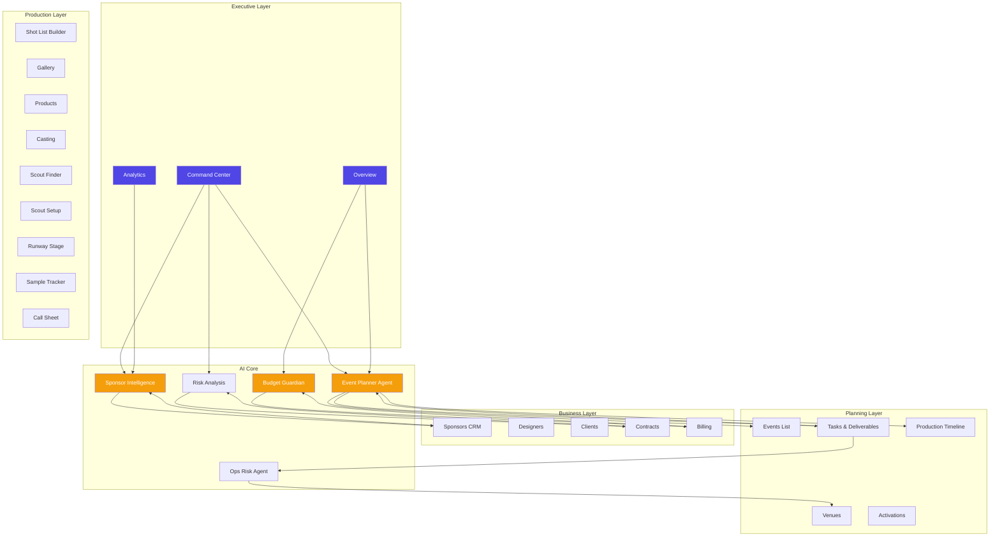

---

## Dashboard Inventory

### **1. Command Center** `/command-center`

**Purpose:** Executive mission control for real-time event health monitoring

**Features:**
- **Health Score**: Real-time event health pulse (0-100 scale)
- **Phase Timeline**: Visual workflow progress tracker
- **Critical Blockers**: AI-detected issues requiring immediate attention
- **Deep Work Links**: Quick navigation to specialized dashboards

**AI Features:**
- Executive Insight Analysis (runs on data load)
- Proactive blocker detection
- Automated health score calculation
- Risk pattern recognition

**Agents:**
- Event Planner Agent
- Ops Risk Agent
- Risk Analysis Agent

**Data Sources:**
- Event metadata (name, dates, status)
- Tasks and phases
- Sponsor relationships
- Budget data

**Workflows:**
1. User lands on Command Center
2. System analyzes current event state
3. AI agents generate executive insights
4. Critical blockers surface automatically
5. User navigates to specialized tools via Deep Work Links

**User Journey:**
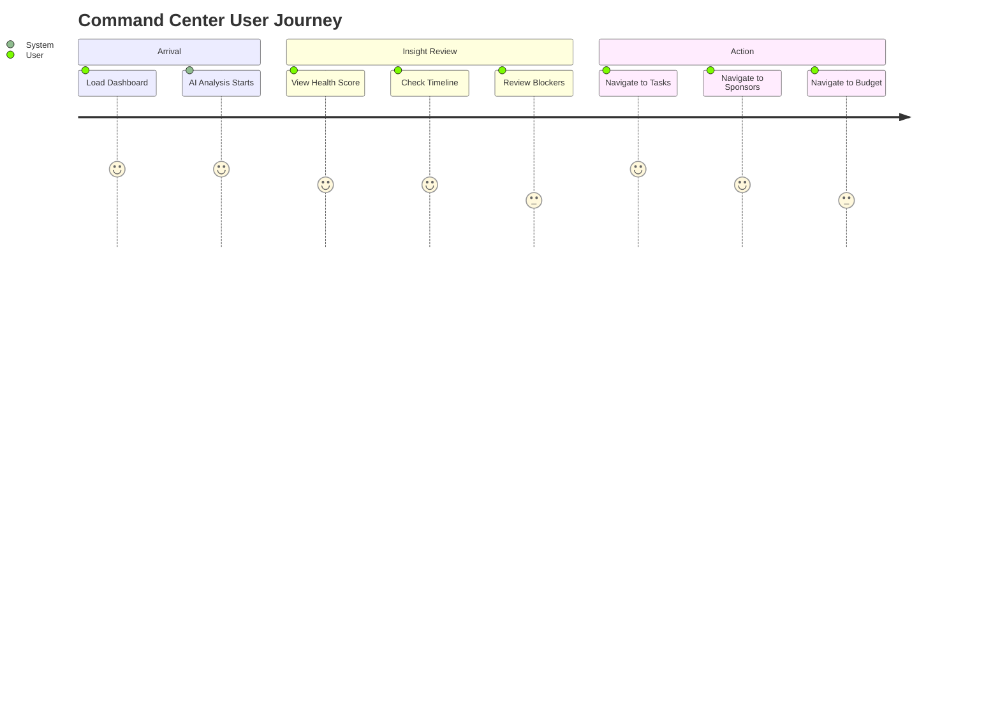

---

### **2. Project Overview** `/overview`

**Purpose:** Comprehensive project status dashboard with AI producer assistance

**Features:**
- **Project Header**: Current project name, status, date
- **Pulse Feed**: Real-time signals from all subsystems
- **Immediate Actions**: AI-recommended decisions
- **Production Progress**: Stage-by-stage workflow tracker
- **AI Producer Drawer**: Interactive AI assistant

**AI Features:**
- Proactive recommendation engine
- Timeline optimization suggestions
- Sample tracking alerts
- Weather-based contingency planning

**Agents:**
- Brand Shoot Agent
- Budget Guardian
- Ops Risk Agent

**Data Sources:**
- Active projects from BrandShootContext
- Campaign plans
- Sample logistics
- Casting confirmations
- Contract status

**Workflows:**
1. View project health at a glance
2. Review pulse feed for latest updates
3. Respond to AI-generated immediate actions
4. Open AI Producer for deeper analysis
5. Navigate to specialized production tools

**User Journey:**
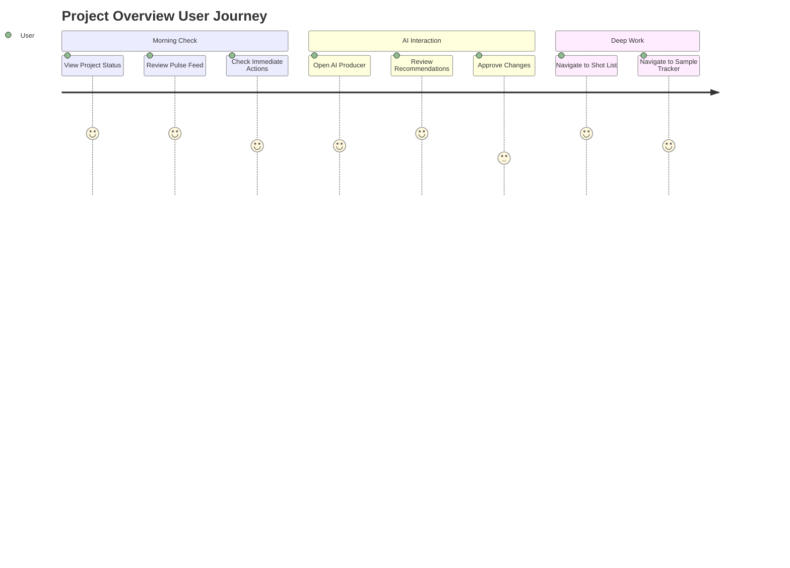

---

### **3. Tasks & Deliverables** `/tasks`

**Purpose:** Gemini-inspired task management with intelligent workflow automation

**Features:**
- **Workflow Categories**: Event Planning, Sponsorship, Marketing, Operations, Media
- **Workflow Steps**: Phase-based progress tracking
- **View Modes**: List view and Kanban board
- **Work Drawer**: Detailed task management and AI summary

**AI Features:**
- Smart task generation from event data
- Priority scoring algorithm
- Dependency detection
- Automated task assignment
- Proactive risk alerts

**Agents:**
- Event Planner Agent
- Smart Task Assignment automation
- Proactive Risk Alert automation

**Data Sources:**
- EventContext (tasks, phases, event data)
- Task status and priority
- Assignee information
- Dependencies

**Workflows:**
1. Select workflow category (e.g., Event Planning)
2. View tasks in list or kanban view
3. Click task to open detail drawer
4. AI analyzes dependencies and suggests priorities
5. Update task status
6. System auto-assigns follow-up tasks

**User Journey:**
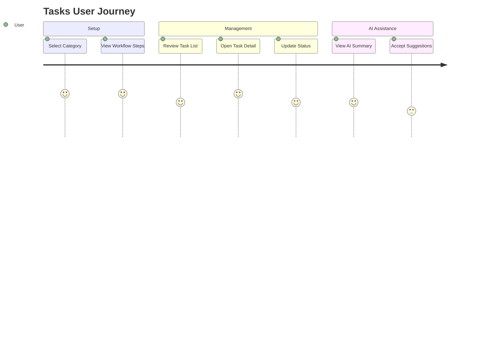

---

### **4. Shot List Builder** `/shotlist`

**Purpose:** AI-powered shot planning and creative direction

**Features:**
- **Shot Cards**: Visual shot planning cards with product selection
- **AI Shot Generator**: Auto-generate shots from product catalog
- **Product Picker**: Link products to specific shots
- **Shot Templates**: Pre-built shot types (hero, lifestyle, detail, etc.)

**AI Features:**
- Shot recommendations based on brand DNA
- Optimal shot sequence planning
- Location matching
- Lighting setup suggestions

**Agents:**
- Brand Shoot Agent
- Shot List AI

**Data Sources:**
- Products from inventory
- Campaign plans
- Brand aesthetic preferences
- Shot history and performance

**Workflows:**
1. AI analyzes products and generates shot suggestions
2. User reviews and customizes shots
3. Select products for each shot
4. Define shot requirements (lighting, location, styling)
5. Export to Call Sheet

**Key Integration:**
- Links to Products Dashboard
- Feeds into Production Timeline
- Connects to Call Sheet generation

---

### **5. Gallery Dashboard** `/gallery`

**Purpose:** AI-powered digital asset management (DAM)

**Features:**
- **Asset Tabs**: Raw, Selects, Final
- **AI Tagging**: Automatic metadata generation
- **Quality Scoring**: AI-based asset quality assessment
- **Batch Operations**: Multi-select and bulk actions
- **Lightbox View**: Full-screen review mode

**AI Features:**
- Auto-categorization by campaign, model, season
- Quality scoring (composition, lighting, focus)
- Duplicate detection
- Usage rights tracking
- Smart search with natural language

**Agents:**
- Asset Quality Scorer automation

**Data Sources:**
- Uploaded media files
- Shot list metadata
- Campaign associations
- Quality scores

**Workflows:**
1. Upload raw assets after shoot
2. AI automatically tags and scores
3. Review and promote to "Selects"
4. Final edit and approval
5. Export for distribution

---

### **6. Products Dashboard** `/products`

**Purpose:** Inventory management for shoot products and samples

**Features:**
- **Grid/Table Views**: Toggle display modes
- **Product Cards**: Visual inventory with metadata
- **Sample Tracking**: Track sample status and location
- **SKU Management**: Product codes and variants

**AI Features:**
- Product categorization
- Sample arrival predictions
- Inventory health monitoring

**Data Sources:**
- Product catalog
- Sample logistics data
- Shoot requirements from shot list

**Workflows:**
1. Add products to catalog
2. Assign products to shots
3. Track sample delivery
4. Monitor product availability
5. Link to e-commerce platforms

**Key Integration:**
- Links to Shot List Builder
- Connects to Sample Tracker
- Feeds Analytics Dashboard

---

### **7. Casting Dashboard** `/casting`

**Purpose:** Cura AI-powered talent management and matchmaking

**Features:**
- **Casting Grid**: Visual talent directory
- **Matchmaker**: AI talent recommendations
- **Availability Calendar**: Real-time booking status
- **Contract Management**: Digital agreements

**AI Features:**
- Brand-talent aesthetic matching
- Availability prediction
- Rate optimization
- Portfolio analysis

**Agents:**
- Designer Matching Agent
- Casting Matchmaker

**Data Sources:**
- Talent profiles and portfolios
- Brand aesthetic data
- Booking calendars
- Historical performance

**Workflows:**
1. Define casting requirements
2. AI suggests matched talent
3. Review portfolios and rates
4. Check availability
5. Send booking requests
6. Generate contracts

---

### **8. Scout Finder** `/scout-finder`

**Purpose:** AI location scouting and venue discovery

**Features:**
- **Location Cards**: Visual location database
- **Map View**: Geographic location browser
- **Filter System**: Location type, capacity, amenities
- **Shortlist**: Save favorite locations

**AI Features:**
- Location recommendations based on creative brief
- Weather pattern analysis
- Permit requirement detection
- Budget-location matching

**Agents:**
- Ops Risk Agent (for permits and logistics)

**Data Sources:**
- Location database
- Weather APIs
- Permit requirements
- Budget constraints

**Workflows:**
1. Enter shoot requirements
2. AI suggests matched locations
3. Review location details
4. Add to shortlist
5. Book venue

**Key Integration:**
- Links to Scout Setup
- Connects to Venues Dashboard
- Feeds Production Timeline

---

### **9. Scout Setup** `/scout-setup`

**Purpose:** Location logistics and production setup planning

**Features:**
- **Setup Checklist**: Pre-production requirements
- **Equipment Planning**: Gear and crew requirements
- **Permit Tracking**: License and permit management
- **Site Surveys**: Location notes and photos

**Workflows:**
1. Select scouted location
2. Define production requirements
3. Generate equipment list
4. Identify permit needs
5. Create site survey report

---

### **10. Production Timeline** `/production-timeline`

**Purpose:** Master production scheduler and workflow orchestrator

**Features:**
- **Timeline View**: Gantt-style schedule
- **Phase Management**: Pre-production, shoot, post-production
- **Milestone Tracking**: Key deadline monitoring
- **Dependency Mapping**: Task relationship visualization

**AI Features:**
- Automatic schedule optimization
- Conflict detection
- Buffer time recommendations
- Critical path analysis

**Agents:**
- Event Planner Agent
- Ops Risk Agent

**Data Sources:**
- Tasks from all phases
- Resource availability
- Vendor schedules
- Delivery deadlines

**Workflows:**
1. AI generates initial timeline
2. User adjusts phases and milestones
3. System detects conflicts
4. AI suggests optimizations
5. Lock timeline and distribute

**Key Integration:**
- Central hub linking all production dashboards
- Links to: Tasks, Shot List, Sample Tracker, Call Sheet
- Feeds Command Center health score

---

### **11. Sponsors CRM** `/sponsors`

**Purpose:** AI-powered sponsor relationship management and pipeline tracking

**Features:**
- **CRM Pipeline**: Visual deal stage tracker (Lead → Negotiation → Signed → Delivered)
- **Sponsor Cards**: Contact info, deal size, deliverables
- **Smart Filters**: Status, category, value
- **Inspector Panel**: Detailed sponsor profile view
- **Global Insights Drawer**: AI market intelligence

**AI Features:**
- Deal health scoring
- Churn risk prediction
- Optimal engagement timing
- ROI projection
- Market trend analysis

**Agents:**
- Sponsor Intelligence Agent

**Data Sources:**
- SponsorContext (sponsors, deals, communications)
- Contract data
- Deliverables tracking
- Performance metrics

**Workflows:**
1. Add new sponsor leads
2. AI scores deal potential
3. Move through pipeline stages
4. Track deliverable completion
5. Measure ROI and satisfaction

**User Journey:**
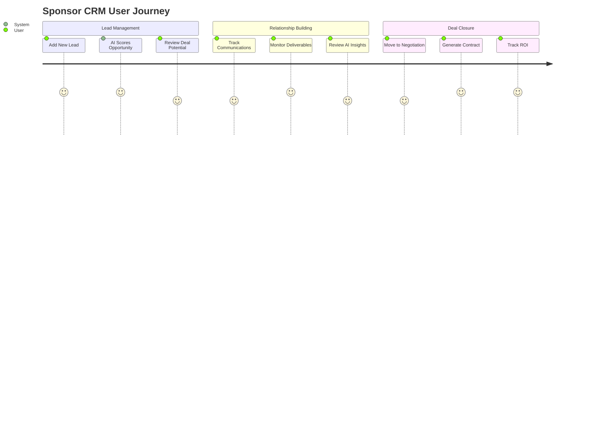

---

### **12. Designers Directory** `/designers`

**Purpose:** Designer and brand profile management

**Features:**
- **Designer Cards**: Portfolio showcase
- **Profile Management**: Brand information and collections
- **Collaboration Tracking**: Project history
- **Matching System**: Brand-event fit scoring

**AI Features:**
- Designer-event matching
- Portfolio analysis
- Aesthetic compatibility scoring

**Agents:**
- Designer Matching Agent

**Workflows:**
1. Designer creates profile
2. AI analyzes brand DNA
3. System suggests event opportunities
4. Track collaboration history

---

### **13. Clients Dashboard** `/clients`

**Purpose:** Client relationship and project management

**Features:**
- **Client Cards**: Contact and project info
- **Project History**: Past collaborations
- **Satisfaction Tracking**: NPS and feedback
- **Billing Overview**: Invoice and payment status

**AI Features:**
- Client satisfaction prediction
- Upsell opportunity detection
- Churn risk alerts

**Data Sources:**
- Client profiles
- Project history
- Billing data
- Feedback surveys

---

### **14. Billing Dashboard** `/billing`

**Purpose:** Budget management and financial oversight (Budget Guardian powered)

**Features:**
- **Budget Metrics**: Spent, allocated, remaining
- **Transaction Feed**: Real-time expense tracking
- **Invoice Management**: Send and track invoices
- **Budget Guardian Alerts**: AI spend monitoring

**AI Features:**
- Overspend prediction
- Budget reallocation suggestions
- Anomaly detection
- Cost optimization recommendations

**Agents:**
- Budget Guardian Agent

**Data Sources:**
- Budget allocations
- Transaction history
- Invoice data
- Contract commitments

**Workflows:**
1. Set event budget
2. Track real-time expenses
3. AI alerts on potential overruns
4. Review and approve invoices
5. Generate financial reports

---

### **15. Contracts Dashboard** `/contracts`

**Purpose:** AI contract analysis and deliverables tracking

**Features:**
- **Contract Cards**: Agreement overview
- **AI Analysis Panel**: Risk and obligation detection
- **Deliverables Table**: Deadline tracking
- **Status Indicators**: Signed, pending, at-risk

**AI Features:**
- Contract clause risk analysis
- Obligation extraction
- Deadline monitoring
- Compliance checking

**Agents:**
- Risk Analysis Agent
- Contract Analyzer service

**Data Sources:**
- Contract documents
- Deliverable requirements
- Performance tracking
- Legal templates

**Workflows:**
1. Upload contract document
2. AI analyzes terms and obligations
3. Extract deliverables automatically
4. Track deliverable completion
5. Alert on approaching deadlines

---

### **16. Analytics Dashboard** `/analytics`

**Purpose:** Performance intelligence and ROI measurement

**Features:**
- **Brand Health Signals**: Awareness, engagement, conversion metrics
- **Impact Gauges**: High/Medium/Low impact visualization
- **AI Insights**: Pattern detection and recommendations
- **Performance Trends**: Historical comparison

**AI Features:**
- Predictive performance modeling
- Attribution analysis
- Trend forecasting
- Insight generation

**Agents:**
- Sponsor Intelligence Agent (for sponsor ROI)
- Brand Shoot Agent (for creative performance)

**Data Sources:**
- Campaign performance data
- Sponsor metrics
- Social media analytics
- Sales attribution

**Workflows:**
1. AI aggregates multi-source data
2. Calculate impact scores
3. Generate insights
4. Visualize trends
5. Export reports

---

### **17. Venues Management** `/venues`

**Purpose:** Multi-venue coordination and logistics

**Features:**
- **Venue Cards**: Location details and capacity
- **Floor Plans**: Interactive venue mapping
- **Booking Calendar**: Availability management
- **Production Requirements**: Technical specs per venue

**AI Features:**
- Venue-event matching
- Capacity optimization
- Logistics planning

**Agents:**
- Ops Risk Agent

**Workflows:**
1. Search available venues
2. Review technical specifications
3. Book venue and reserve dates
4. Plan production logistics
5. Coordinate multi-venue events

---

### **18. Activations Manager** `/activations`

**Purpose:** Brand activation and experiential marketing coordination

**Features:**
- **Activation Grid**: Visual activation tracker
- **Engagement Metrics**: Real-time performance
- **Photo Grid**: Activation documentation
- **Status Tracking**: Setup, live, completed

**AI Features:**
- Engagement prediction
- Optimal activation timing
- Resource allocation

**Workflows:**
1. Plan brand activations
2. Assign resources
3. Track setup progress
4. Monitor live engagement
5. Measure results

---

### **19. Events List** `/events-list`

**Purpose:** Event portfolio and calendar management

**Features:**
- **Event Calendar**: Visual timeline
- **Event Cards**: Quick status overview
- **Filter System**: By status, date, type
- **Quick Actions**: Create, edit, archive

**Workflows:**
1. View all events in calendar
2. Create new event (links to Event Wizard)
3. Monitor event statuses
4. Archive completed events

---

### **20. Runway Stage** `/runway`

**Purpose:** Real-time runway show coordination (future feature)

**Features:**
- **Live Timeline**: Show running order
- **Backstage Coordination**: Dresser and stylist comms
- **Model Queue**: Next up and backstage status
- **Music and Lighting Cues**: Show automation

---

## Data Flow Architecture

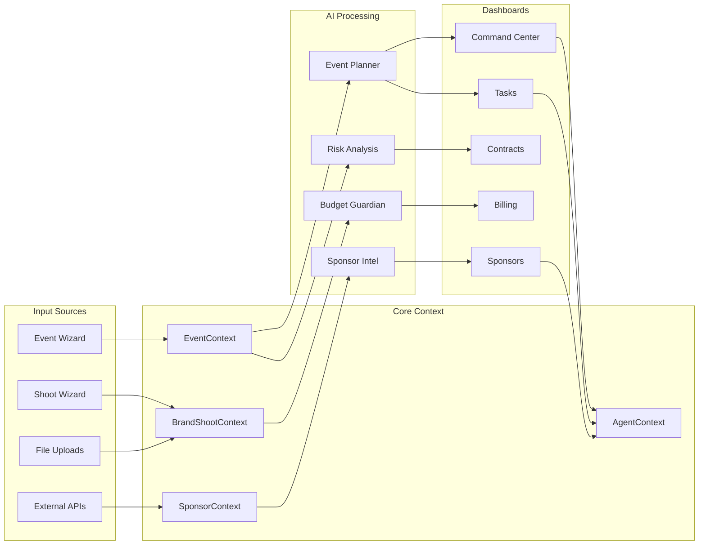

---

## AI Agent Ecosystem

### **Event Planner Agent**
- **Purpose**: End-to-end event orchestration
- **Capabilities**: Task generation, timeline optimization, risk detection
- **Dashboards**: Command Center, Overview, Tasks, Production Timeline
- **Data**: Event metadata, tasks, phases, dependencies

### **Sponsor Intelligence Agent**
- **Purpose**: Sponsor relationship optimization and market intelligence
- **Capabilities**: Deal scoring, churn prediction, ROI projection, market trends
- **Dashboards**: Sponsors CRM, Analytics
- **Data**: Sponsor profiles, deals, communications, performance

### **Budget Guardian Agent**
- **Purpose**: Financial oversight and cost optimization
- **Capabilities**: Overspend prediction, budget reallocation, anomaly detection
- **Dashboards**: Billing, Overview
- **Data**: Budget allocations, transactions, invoices

### **Risk Analysis Agent**
- **Purpose**: Contract risk and compliance monitoring
- **Capabilities**: Clause analysis, obligation extraction, risk scoring
- **Dashboards**: Contracts
- **Data**: Contract documents, deliverables, legal requirements

### **Ops Risk Agent**
- **Purpose**: Operational logistics and contingency planning
- **Capabilities**: Permit requirements, weather monitoring, logistics planning
- **Dashboards**: Command Center, Tasks, Venues, Scout Finder
- **Data**: Location data, weather APIs, permit databases

### **Brand Shoot Agent**
- **Purpose**: Creative production intelligence
- **Capabilities**: Shot recommendations, brand DNA analysis, creative optimization
- **Dashboards**: Overview, Shot List, Gallery
- **Data**: Products, brand aesthetics, shot history, performance

### **Designer Matching Agent**
- **Purpose**: Brand-talent compatibility matching
- **Capabilities**: Aesthetic scoring, portfolio analysis, collaboration prediction
- **Dashboards**: Casting, Designers
- **Data**: Designer profiles, portfolios, event requirements

---

## Automation Workflows

### **1. Smart Task Assignment**
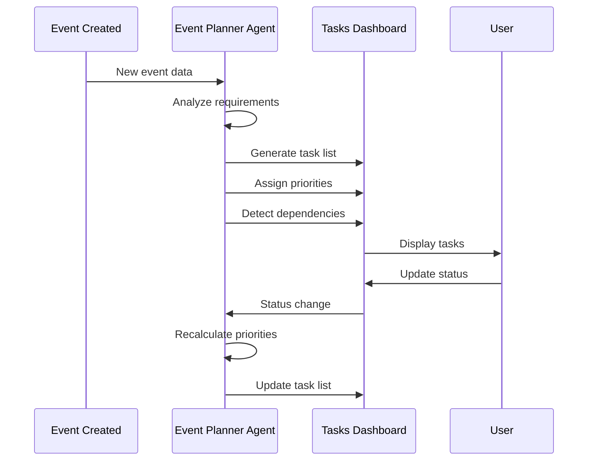

### **2. Proactive Risk Alerts**
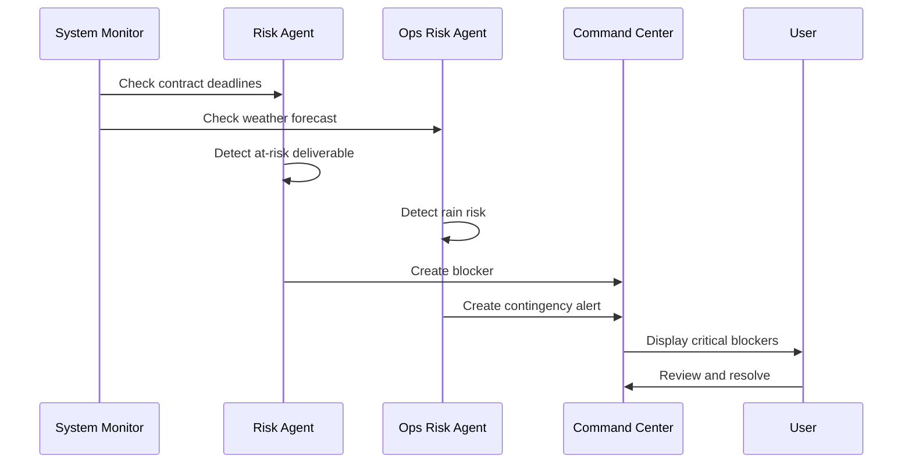

### **3. Budget Guardian Workflow**
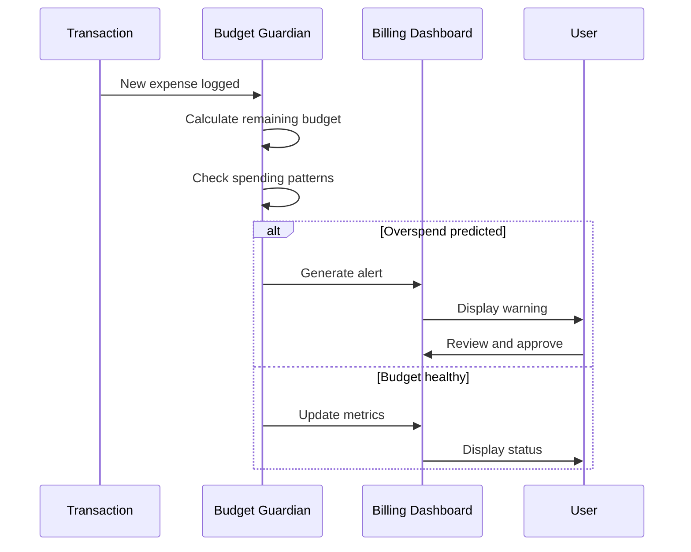

---

## User Journey: Event Planning Flow

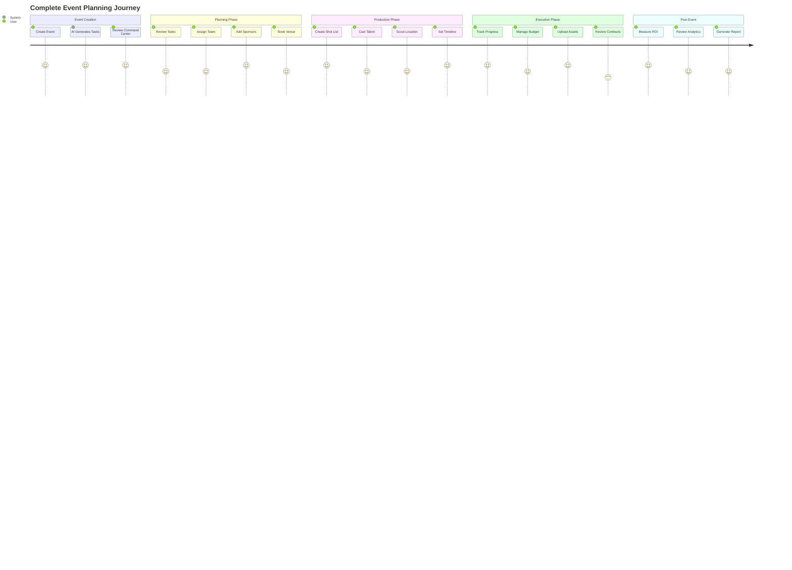

---

## Dashboard Navigation Map

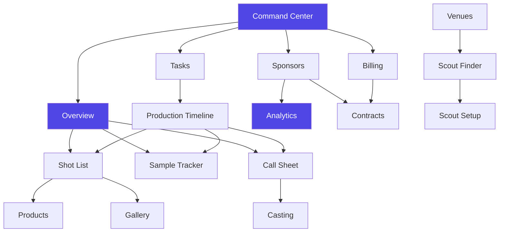

---

## Key Integration Points

### **Command Center ↔ All Dashboards**
- Command Center serves as the executive hub
- Deep Work Links provide direct navigation
- AI insights aggregate from all specialized agents
- Health score calculated from all subsystem statuses

### **Tasks ↔ Production Timeline ↔ Overview**
- Tasks feed into timeline visualization
- Timeline updates flow to Overview pulse feed
- Overview immediate actions link to specific tasks

### **Sponsors ↔ Contracts ↔ Billing ↔ Analytics**
- Sponsor deals generate contracts
- Contracts define deliverables and budgets
- Billing tracks sponsor payments
- Analytics measures sponsor ROI

### **Shot List ↔ Products ↔ Sample Tracker ↔ Gallery**
- Shot List references products
- Products tracked via Sample Tracker
- Shot execution results in Gallery assets
- Gallery metadata links back to Shot List

### **Casting ↔ Call Sheet ↔ Production Timeline**
- Casting selections populate Call Sheet
- Call Sheet timing syncs with Production Timeline
- Timeline changes update Call Sheet automatically

---

## Missing Dashboards (Future Roadmap)

### **1. Media Library Dashboard**
**Purpose:** Centralized DAM beyond gallery (video, documents, presentations)
**Priority:** High
**Dependencies:** Gallery Dashboard foundation

### **2. Social Media Dashboard**
**Purpose:** Content calendar, scheduling, and performance tracking
**Priority:** Medium
**Dependencies:** Gallery for asset sourcing

### **3. Email Campaign Dashboard**
**Purpose:** Guest communications, sponsor outreach, post-event follow-up
**Priority:** Medium
**Dependencies:** Sponsors CRM, Designers Directory

### **4. Website Builder Dashboard**
**Purpose:** Event landing pages, ticketing, RSVP management
**Priority:** High
**Dependencies:** Website Wizard integration

### **5. Reporting Dashboard**
**Purpose:** Custom report builder, data exports, executive summaries
**Priority:** Medium
**Dependencies:** Analytics Dashboard foundation

### **6. Team Dashboard**
**Purpose:** Crew management, availability, credentials, payroll
**Priority:** Low
**Dependencies:** Casting system extension

---

## Technical Implementation Notes

### **Context Architecture**
- **EventContext**: Events, tasks, phases, attendees
- **BrandShootContext**: Projects, campaigns, shot lists, gallery
- **SponsorContext**: Sponsors, deals, contracts, communications
- **AgentContext**: AI agents, insights, automations

### **Real-Time Features**
- Supabase Realtime for collaborative editing
- WebSocket connections for live updates
- Optimistic UI updates for instant feedback

### **AI Integration Pattern**
```typescript
// Standard AI agent invocation pattern
const { executiveInsight, runAnalysis } = useAgentContext();

useEffect(() => {
  if (eventData && !isAnalyzing) {
    runAnalysis({
      event: eventData,
      tasks: tasks,
      phases: phases,
      sponsors: sponsors
    });
  }
}, [eventData, runAnalysis]);
```

### **Navigation Pattern**
```typescript
// Consistent navigation across dashboards
const handleNavigate = (page: string) => {
  window.history.pushState({}, "", `/${page}`);
  window.dispatchEvent(new PopStateEvent("popstate"));
};
```

---

## Conclusion

FashionOS operates as an **intelligent event orchestration platform** where 20 specialized dashboards work in concert, powered by 7 AI agents that provide proactive intelligence, automation, and decision support. The system is designed for:

- **Executive users** who need high-level visibility (Command Center, Analytics)
- **Planners** who coordinate logistics (Tasks, Timeline, Venues)
- **Creative teams** who execute production (Shot List, Gallery, Casting)
- **Business managers** who handle relationships and finances (Sponsors, Billing, Contracts)

Every dashboard is interconnected through shared context, AI agents, and intelligent workflows, creating a seamless experience where data flows automatically and insights surface proactively.

**The system knows what you need before you ask for it.**
