# FashionOS Wizards System Map

**Complete Wizard Orchestration Documentation**

## Executive Overview

FashionOS features **5 intelligent wizards** that guide users through complex workflows with AI assistance. Each wizard collects data, validates input, generates intelligent recommendations, and seamlessly connects to the dashboard ecosystem. These wizards transform complex professional processes into guided, accessible experiences.

---

## Wizard Inventory

### **1. Shoot Wizard** `/wizard`
Classic shoot planning wizard

### **2. Event Creation Wizard** `/event-wizard`
Multi-step event orchestration wizard

### **3. Website Builder Wizard** `/website-wizard`
E-commerce and portfolio website creator

### **4. Designer Profile Wizard** `/directory-wizard`
AI-powered brand audit and profile creation

### **5. Brand Shoot Wizard** `/brand-shoot-wizard`
AI-native brand campaign planner

---

## 1. Shoot Wizard (`/wizard`)

### **Overview**
Classic multi-step wizard for booking photography, video, web design, and social media services. Manual selection flow with human-friendly options.

### **Steps & Screens**

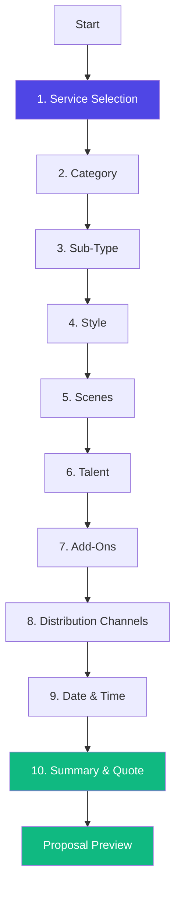

#### **Screen 1: Service Selection**
**What it does:** Choose primary service type  
**Options:** Photography, Video Production, Website Design, Social Media Marketing  
**Logic:** Determines subsequent category options  
**Data collected:** `service: string`

#### **Screen 2: Category**
**What it does:** Select product/content category  
**Options (dynamic):** Fashion Apparel, Beauty, Jewelry, Footwear, Eyewear, Food & Beverage  
**Logic:** Filters sub-type options  
**Data collected:** `category: string`

#### **Screen 3: Sub-Type**
**What it does:** Narrow down specific category  
**Options (dynamic based on category):**
- Fashion: Womenswear, Swimwear, Athleisure, Jackets, Formalwear, Lingerie
- Beauty: Cosmetics, Skincare, Fragrances, Haircare, Lipstick
- Jewelry: Rings, Earrings, Necklaces, Watches
- Video: Product Overview, Unboxing, How-To, Lifestyle

**Logic:** Customizes shot recommendations  
**Data collected:** `subType: string`

#### **Screen 4: Style**
**What it does:** Choose aesthetic direction  
**Options:** Editorial Fashion, Street Style, Minimal Clean, Catalog/E-comm  
**Logic:** Influences pricing and crew recommendations  
**Data collected:** `style: string`

#### **Screen 5: Scenes**
**What it does:** Select shooting environments  
**Options:**
- **Backdrops:** White Seamless, Colored, Textured
- **Lifestyle:** Living Room, Kitchen, Bedroom, Bathroom

**Logic:** Determines studio vs location pricing  
**Data collected:** `scenes: string[]`

#### **Screen 6: Talent**
**What it does:** Specify model requirements  
**Options:** Full Body Model, Hand Model, Foot Model, No Talent Needed  
**Logic:** Adds talent fees to quote  
**Data collected:** `talent: string[]`

#### **Screen 7: Add-Ons**
**What it does:** Select additional services  
**Options:** Retouching, Color Grading, Rush Delivery, Video Editing, Social Media Sizing  
**Logic:** Adds line items to quote  
**Data collected:** `addOns: string[]`

#### **Screen 8: Distribution Channels**
**What it does:** Select where content will be used  
**Options:** Instagram, TikTok, YouTube, Amazon, Shopify  
**Logic:** Determines usage rights and licensing fees  
**Data collected:** `channels: string[]`

#### **Screen 9: Date & Time**
**What it does:** Schedule shoot date  
**Logic:** Checks availability, validates timeline  
**Data collected:** `date: Date, time: string`

#### **Screen 10: Summary**
**What it does:** Review all selections and pricing  
**Features:**
- Itemized pricing breakdown
- Total cost calculation
- Edit capability for any step
- Submit button

**Logic:** Validates complete form, generates proposal  
**Data collected:** Complete wizard state

### **AI Features**
- **Smart Pricing:** Dynamic quote calculation based on selections
- **Recommendations:** Suggests add-ons based on service type
- **Availability Intelligence:** Real-time calendar checking

### **Agents**
None (Manual wizard, AI minimal)

### **User Journey**

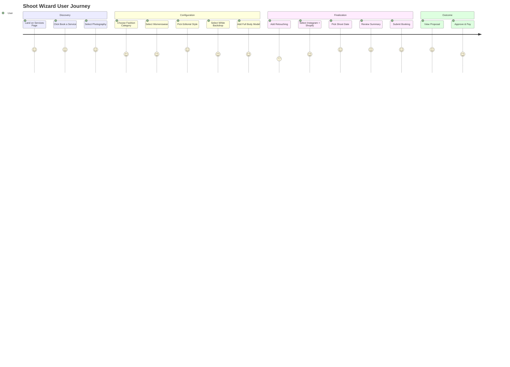

### **Dashboard Connections**
- **Completes to:** `/proposal` (Proposal Preview Dashboard)
- **Creates:** Project in BrandShootContext
- **Triggers:** Add to Production Timeline
- **Generates:** Shot List Builder data
- **Updates:** Client Dashboard with new booking

### **Data Flow**

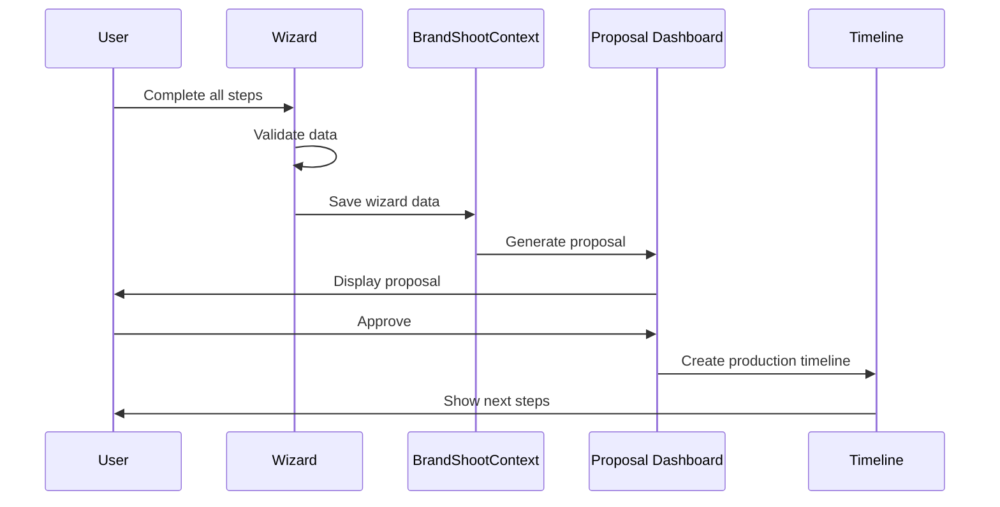

---

## 2. Event Creation Wizard (`/event-wizard`)

### **Overview**
Production-ready 6-step wizard for creating fashion events with AI task generation. Comprehensive data collection with validation, auto-save drafts, and intelligent defaults.

### **Steps & Screens**

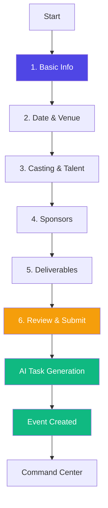

#### **Screen 1: Basic Info**
**What it does:** Collect fundamental event details  
**Fields:**
- Event Name (required, min 3 chars)
- Event Type (Fashion Show, Pop-Up, Presentation, Editorial Shoot)
- Description (textarea, optional)
- Expected Attendees (number)
- Is Public Event? (checkbox)

**Validation:** Zod schema `BasicInfoSchema`  
**Data collected:**
```typescript
{
  name: string,
  type: string,
  description?: string,
  expected_attendees: number,
  is_public: boolean
}
```

#### **Screen 2: Date & Venue**
**What it does:** Schedule and locate event  
**Fields:**
- Event Date (date picker, must be future)
- Start Time (time picker)
- End Time (time picker, must be after start)
- Venue Name (text or autocomplete from Venues DB)
- Venue Address (text)
- Venue Capacity (number)
- Virtual Event Option (checkbox)

**Validation:** `DateVenueSchema`, validates date logic  
**Data collected:**
```typescript
{
  event_date: Date,
  start_time: string,
  end_time: string,
  venue_name: string,
  venue_address: string,
  venue_capacity: number,
  is_virtual: boolean
}
```

#### **Screen 3: Casting & Talent**
**What it does:** Define talent requirements  
**Fields:**
- Number of Models (number, 0-100)
- Model Types (checkboxes: Runway, Editorial, Commercial, Fit)
- Celebrity/Influencer Bookings (textarea)
- Stylist Required? (checkbox)
- Hair & Makeup Team? (checkbox)
- Photography Team? (checkbox)
- Videography Team? (checkbox)

**Validation:** `CastingSchema`  
**Data collected:**
```typescript
{
  num_models: number,
  model_types: string[],
  celebrity_bookings?: string,
  needs_stylist: boolean,
  needs_hair_makeup: boolean,
  needs_photography: boolean,
  needs_videography: boolean
}
```

#### **Screen 4: Sponsors**
**What it does:** Capture sponsor relationships  
**Fields:**
- Sponsor Cards (repeatable component)
  - Company Name
  - Sponsor Tier (Title, Presenting, Supporting, In-Kind)
  - Deal Amount
  - Deliverables (checkboxes: Logo Placement, Social Posts, Speaking Slot, Booth Space)
  - Contact Name
  - Contact Email

**Features:**
- Add/Remove sponsors dynamically
- Pre-fill from Sponsors CRM
- Smart Contact Input component

**Validation:** `SponsorsSchema`  
**Data collected:**
```typescript
{
  sponsors: [
    {
      company_name: string,
      tier: string,
      deal_amount: number,
      deliverables: string[],
      contact_name: string,
      contact_email: string
    }
  ]
}
```

#### **Screen 5: Deliverables**
**What it does:** Define event outputs and goals  
**Fields:**
- Deliverables (checkboxes):
  - Runway Lookbook
  - Event Photography
  - Event Video
  - Social Media Content
  - Press Release
  - Guest List Management
  - Seating Chart
  - Post-Event Report
- Success Metrics (textarea)
- Budget (number)
- Special Requirements (textarea)

**Validation:** `DeliverablesSchema`  
**Data collected:**
```typescript
{
  deliverables: string[],
  success_metrics?: string,
  budget: number,
  special_requirements?: string
}
```

#### **Screen 6: Review & Submit**
**What it does:** Final review before creation  
**Features:**
- Accordion sections showing all collected data
- Edit links to jump back to specific steps
- AI Task Preview (shows AI will generate tasks)
- Terms & Conditions checkbox
- Submit button with loading state

**Validation:** `ReviewOptionsSchema`  
**Logic:**
1. Display all form data
2. User can edit any section
3. On submit:
   - Generate idempotency key
   - Call `createEvent()` API
   - AI generates tasks via Event Planner Agent
   - Show success state
   - Redirect to Command Center

### **AI Features**

#### **Auto-Save Drafts**
- Saves to localStorage on every step change
- Restores draft if < 24 hours old
- Prevents data loss

#### **Smart Defaults**
- Pre-fills venue if recently used
- Suggests sponsors from CRM
- Recommends team sizes based on event type

#### **AI Task Generation**
After event creation, Event Planner Agent:
1. Analyzes event requirements
2. Generates task list (50-100 tasks)
3. Assigns to phases (Pre-production, Event Day, Post-Event)
4. Sets priorities and dependencies
5. Populates Tasks Dashboard

### **Agents**
- **Event Planner Agent:** Generates comprehensive task list
- **Ops Risk Agent:** Identifies potential blockers (permits, insurance, weather)
- **Budget Guardian:** Validates budget against requirements

### **User Journey**

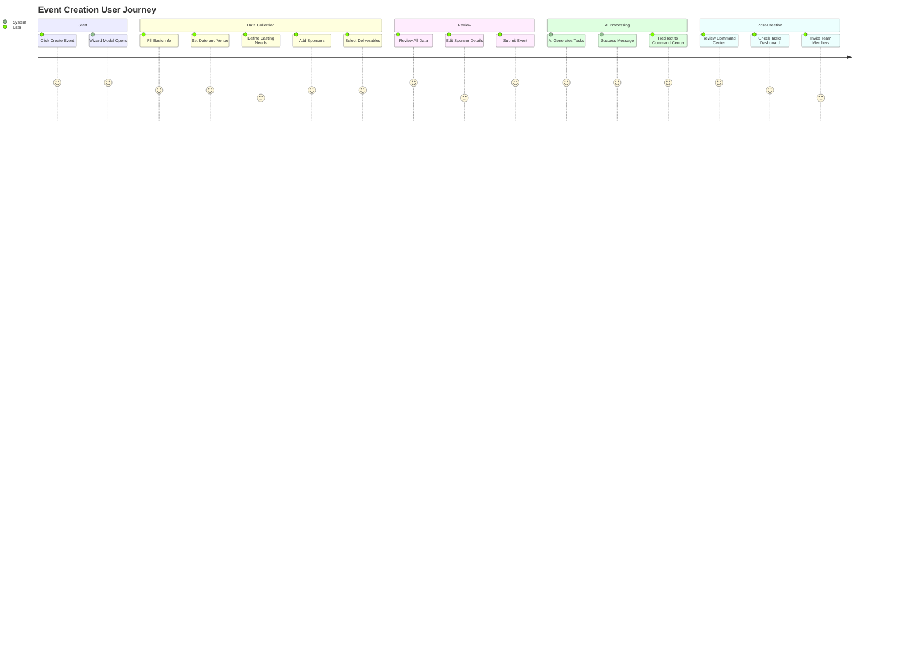

### **Dashboard Connections**

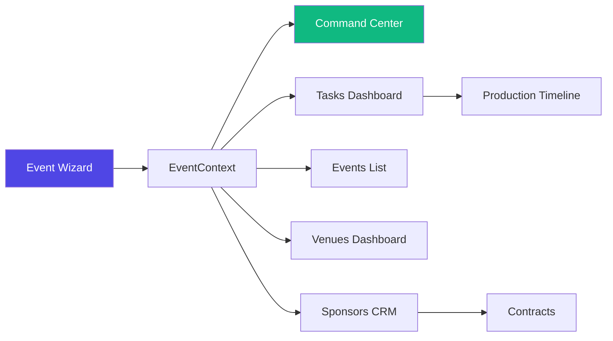

**Connections:**
- **Creates Event in:** EventContext (global state)
- **Triggers:** AI task generation → Tasks Dashboard
- **Updates:** Events List with new event card
- **Links Sponsors:** Populates Sponsors CRM relationships
- **Initializes:** Command Center health monitoring
- **Generates:** Production Timeline phases

### **Validation Architecture**

**File:** `/lib/validation/event-schemas.ts`

**Schemas:**
- `BasicInfoSchema` - Step 1 validation
- `DateVenueSchema` - Step 2 validation
- `CastingSchema` - Step 3 validation
- `SponsorsSchema` - Step 4 validation
- `DeliverablesSchema` - Step 5 validation
- `ReviewOptionsSchema` - Final validation
- `CreateEventRequest` - Complete event object

**Features:**
- Zod validation with custom error messages
- Cross-field validation (end time > start time)
- Optional field handling
- Type-safe from form to API

### **API Integration**

**File:** `/lib/api/events.ts`

**Function:** `createEvent(data: CreateEventRequest)`

**Flow:**
1. Validates request with schema
2. Sends to Supabase `events` table
3. Triggers Event Planner Agent
4. Generates tasks in `tasks` table
5. Creates phases in `event_phases` table
6. Returns event ID

**Error Handling:**
- Retry logic with exponential backoff
- Idempotency key prevents duplicates
- User-friendly error messages
- Auto-save draft on failure

---

## 3. Website Builder Wizard (`/website-wizard`)

### **Overview**
Comprehensive 9-step wizard for creating e-commerce stores, portfolios, landing pages, and creator sites. Includes AI copywriting, visual design tools, and dashboard handoff.

### **Steps & Screens**

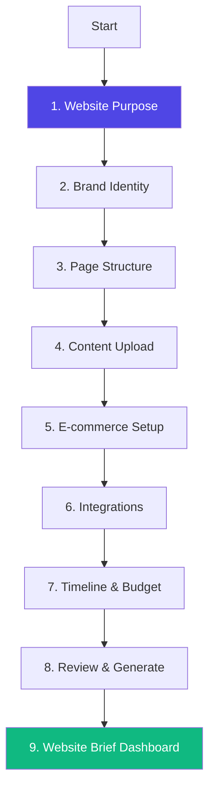

#### **Screen 1: Website Purpose**
**What it does:** Define website type and goals  
**Fields:**
- Website Type (Portfolio, E-commerce, Landing Page, Creator Hub)
- Primary Goals (multi-select: Sell Products, Showcase Work, Build Email List, Drive Traffic, etc.)
- Target Audience (textarea)
- Desired Results (textarea)

**Data collected:**
```typescript
{
  websiteType: 'portfolio' | 'ecommerce' | 'landing' | 'creator',
  goals: string[],
  audience: string,
  results: string
}
```

#### **Screen 2: Brand Identity**
**What it does:** Upload brand assets and define visual style  
**Fields:**
- Logo Upload (drag-drop)
- Brand Guidelines PDF (optional upload)
- Color Palette (color picker, 3-5 colors)
- Visual Style (Minimalist, Luxury, Bold, Dark)
- Inspiration Images (multi-upload)
- Brand Words (3-5 adjectives)
- Emotions to Evoke (textarea)

**Features:**
- File upload with preview
- Color extractor from logo
- Inspiration board builder

**Data collected:**
```typescript
{
  logo: File,
  brandGuidelines?: File,
  colorPalette: string[],
  visualStyle: 'minimalist' | 'luxury' | 'bold' | 'dark',
  inspirationImages: File[],
  brandWords: string,
  emotions: string
}
```

#### **Screen 3: Page Structure**
**What it does:** Select and configure pages  
**Features:**
- Pre-configured page templates
- Each page card shows:
  - Icon and description
  - Content requirements
  - "Needs AI Copywriting" toggle

**Common Pages:**
- Home (required)
- About
- Shop/Products
- Services
- Portfolio/Gallery
- Blog
- Contact
- FAQ
- Testimonials
- Press
- Careers

**Logic:** E-commerce type auto-selects Shop, Cart, Checkout  
**Data collected:**
```typescript
{
  pages: [
    {
      id: string,
      name: string,
      selected: boolean,
      hasContent: boolean,
      needsAI: boolean,
      contentNeeded: string[]
    }
  ]
}
```

#### **Screen 4: Content Upload**
**What it does:** Collect copy and media assets  
**Fields:**
- Text Content (rich text editor or paste)
- Content Files (PDF, DOCX upload)
- Product Images (multi-upload with categorization)
- Moodboard Images (multi-upload)
- AI Copywriting Toggle (checkbox)

**Features:**
- Smart file categorization
- Image compression
- AI copywriting preview

**Data collected:**
```typescript
{
  textContent: string,
  contentFiles: File[],
  productImages: File[],
  moodboardImages: File[],
  aiCopywriting: boolean
}
```

#### **Screen 5: E-commerce Setup** (conditional)
**What it does:** Configure shop functionality  
**Shown if:** `websiteType === 'ecommerce'`

**Fields:**
- Number of Products (slider 1-1000+)
- Product Categories (tags input)
- Need Product Photography? (checkbox)
- Features:
  - Variants (size, color)
  - Inventory Tracking
  - Discount Codes
  - Customer Login
  - Wishlist
  - Subscriptions
  - Digital Products
  - Abandoned Cart Recovery
- Payment Gateways (Stripe, PayPal, Square)
- Currencies (multi-select)
- Shipping Rules:
  - Free Shipping Threshold
  - Flat Rate Shipping
  - Real-Time Rates

**Data collected:**
```typescript
{
  numProducts: number,
  productCategories: string[],
  needPhotography: boolean,
  variants: boolean,
  inventoryTracking: boolean,
  // ... 10+ e-commerce flags
  paymentGateways: string[],
  currencies: string[],
  shippingRules: object
}
```

#### **Screen 6: Integrations**
**What it does:** Connect third-party services  
**Integrations:**
- Email Marketing (Mailchimp, Klaviyo, ConvertKit)
- Analytics (Google Analytics, Plausible)
- Social Media (Instagram Feed, TikTok Embed)
- CRM (HubSpot, Salesforce)
- Chat (Intercom, Drift)
- Booking (Calendly)

**Features:**
- Toggle each integration on/off
- Enter API keys or auth tokens
- Test connection

**Data collected:**
```typescript
{
  integrations: {
    email: { provider: string, apiKey: string },
    analytics: { provider: string, trackingId: string },
    social: { platforms: string[] },
    // ...
  }
}
```

#### **Screen 7: Timeline & Budget**
**What it does:** Define project constraints  
**Fields:**
- Launch Date (date picker)
- Budget Tier (Starter $2k, Growth $5k, Pro $10k, Enterprise Custom)
- Priority Features (ranked list)
- Rush Delivery? (checkbox, +30% fee)

**Logic:** Budget tier affects feature availability  
**Data collected:**
```typescript
{
  launchDate: Date,
  budgetTier: 'starter' | 'growth' | 'pro' | 'enterprise',
  priorityFeatures: string[],
  rushDelivery: boolean
}
```

#### **Screen 8: Review & Generate**
**What it does:** Final review and AI proposal generation  
**Features:**
- Accordion sections for all data
- Edit links to each step
- AI generates:
  - Sitemap
  - Wireframes
  - Content outline
  - Project timeline
  - Detailed quote

**AI Processing:**
1. Analyzes all inputs
2. Generates sitemap structure
3. Creates content templates
4. Estimates timeline
5. Calculates pricing

**Data collected:**
```typescript
{
  reviewedAt: Date,
  aiGenerated: {
    sitemap: object,
    wireframes: string[],
    contentOutline: object,
    timeline: object,
    quote: number
  }
}
```

#### **Screen 9: Website Brief Dashboard**
**What it does:** Project management dashboard  
**Features:**
- Brief Overview (all requirements)
- Content Checklist (track uploaded assets)
- Sitemap Visualizer (interactive diagram)
- Media Library (organized uploads)
- Page Editor (edit each page requirements)
- Deliverables Hub (track progress)

**This is a persistent dashboard, not a wizard screen**

### **AI Features**

#### **AI Copywriting**
- Generates page copy based on brand analysis
- Adapts tone to visual style
- SEO-optimized headlines
- CTA optimization

#### **Smart Sitemap Generation**
- Analyzes goals and content
- Recommends page hierarchy
- Suggests navigation structure
- Identifies orphan pages

#### **Budget Optimization**
- Recommends feature prioritization
- Suggests phased rollout
- Identifies cost-saving alternatives

### **Agents**
None (Future: Website Builder Agent)

### **User Journey**

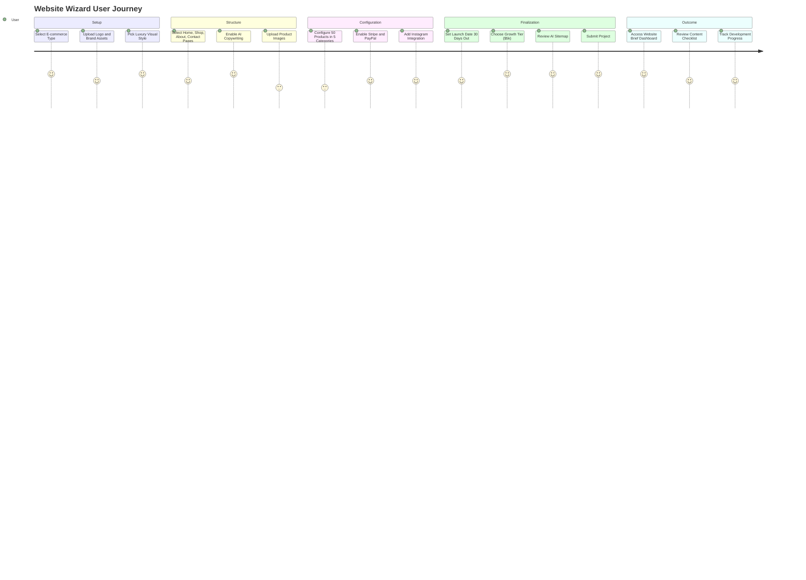

### **Dashboard Connections**

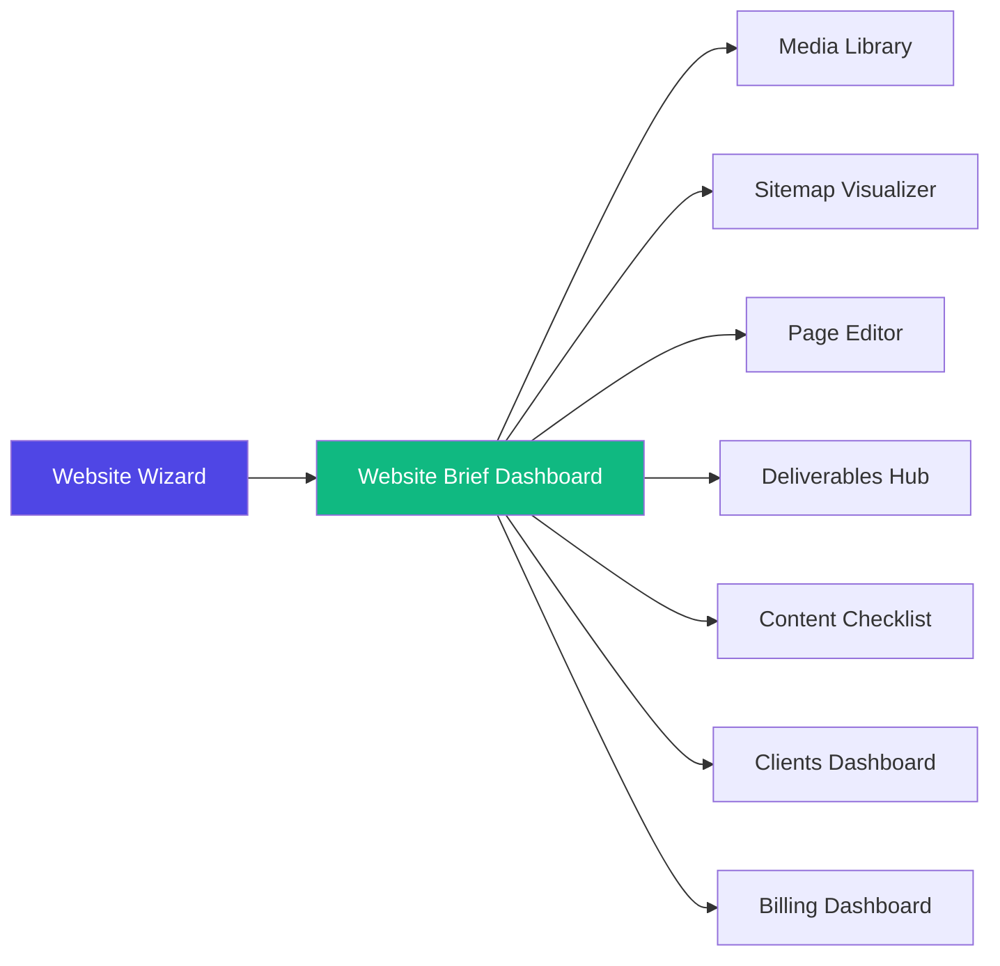

**Connections:**
- **Creates:** Website Brief Dashboard (unique to each project)
- **Populates:** Media Library with uploads
- **Generates:** Sitemap Visualizer data
- **Initializes:** Content Checklist tasks
- **Links to:** Clients Dashboard (client relationship)
- **Creates Invoice in:** Billing Dashboard

---

## 4. Designer Profile Wizard (`/directory-wizard`)

### **Overview**
AI-powered brand audit wizard that analyzes designer websites, Instagram, and portfolios to generate comprehensive brand profiles with actionable insights.

### **Steps & Screens**

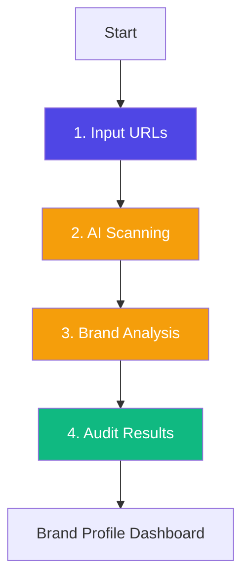

#### **Screen 1: Input**
**What it does:** Collect brand data sources  
**Fields:**
- Brand Name (text, required)
- Website URL (URL validation)
- Instagram Handle (@username)
- Portfolio Upload (drag-drop images)

**Validation:**
- Website must be valid URL
- Instagram must be valid handle
- At least 1 data source required

**Data collected:**
```typescript
{
  name: string,
  website: string,
  instagram: string,
  portfolioFiles?: LightboxImage[]
}
```

**UI Features:**
- URL auto-formatting
- Instagram handle auto-completes with @
- Portfolio lightbox preview
- Continue button enabled when valid

#### **Screen 2: Scanning** (AI Processing)
**What it does:** AI scrapes and analyzes brand signals  
**Process:**
1. Fetch website (OpenGraph metadata, color palette, typography)
2. Scrape Instagram (recent posts, engagement, aesthetic)
3. Analyze uploaded portfolio images (color analysis, composition, themes)
4. Extract brand signals

**Animation:**
- Animated scanning indicator
- Progress messages:
  - "Analyzing website..."
  - "Scanning Instagram feed..."
  - "Extracting color palette..."
  - "Identifying aesthetic themes..."

**Duration:** 10-15 seconds

**AI Analysis:**
- Website scraper extracts colors, fonts, imagery style
- Instagram API pulls last 12 posts
- Computer vision analyzes visual patterns
- NLP extracts brand voice from bio and captions

#### **Screen 3: Analysis**
**What it does:** Display AI brand insights  
**Sections:**

**Visual DNA:**
- Primary Colors (color swatches)
- Secondary Palette
- Typography Style (serif, sans, modern, classic)
- Photography Style (editorial, minimalist, bold, vintage)

**Brand Positioning:**
- Aesthetic Category (Luxury, Streetwear, Minimalist, Maximalist, etc.)
- Target Market (demographics inferred)
- Price Point (estimated from imagery quality)
- Competitive Set (similar brands)

**Content Strategy:**
- Post Frequency (Instagram)
- Engagement Rate
- Content Themes (product shots, lifestyle, BTS, etc.)
- Hashtag Strategy

**Strengths & Opportunities:**
- What's working well
- Areas for improvement
- Missing elements (e.g., "No video content")
- Recommendations

**Interactive Features:**
- Expand/collapse sections
- Thumbs up/down on insights
- "Disagree" button to refine

**Data collected:**
```typescript
{
  visualDNA: {
    primaryColors: string[],
    secondaryColors: string[],
    typography: string,
    photographyStyle: string
  },
  positioning: object,
  contentStrategy: object,
  insights: string[]
}
```

#### **Screen 4: Audit Results**
**What it does:** Comprehensive brand scorecard  
**Features:**

**Overall Score:** 0-100 scale with gauge visualization

**Category Scores:**
- Brand Consistency (75/100)
- Visual Identity (88/100)
- Content Quality (92/100)
- Social Presence (65/100)
- Market Positioning (80/100)

**Detailed Feedback:**
- ✅ Strengths (green cards)
- ⚠️ Opportunities (yellow cards)
- ❌ Critical Gaps (red cards)

**Action Items:**
- Prioritized recommendations
- Links to relevant services (e.g., "Book Photography" → /ecommerce-photography)
- Template resources

**Data collected:**
```typescript
{
  overallScore: number,
  categoryScores: {
    consistency: number,
    identity: number,
    quality: number,
    social: number,
    positioning: number
  },
  strengths: string[],
  opportunities: string[],
  gaps: string[]
}
```

**Complete Button:** Takes user to Brand Profile Dashboard

### **AI Features**

#### **Computer Vision Analysis**
- Color extraction from images
- Composition analysis (rule of thirds, symmetry)
- Object detection (products, models, settings)
- Style classification (editorial, catalog, lifestyle)

#### **Brand DNA Extraction**
- Analyzes 50+ data points
- Identifies visual patterns
- Maps to brand archetypes
- Generates personality profile

#### **Competitive Intelligence**
- Identifies similar brands
- Benchmarks against category leaders
- Suggests positioning opportunities

### **Agents**
- **Designer Matching Agent:** Analyzes brand aesthetic
- **Brand Audit AI:** (Future) Comprehensive brand health analysis

### **User Journey**

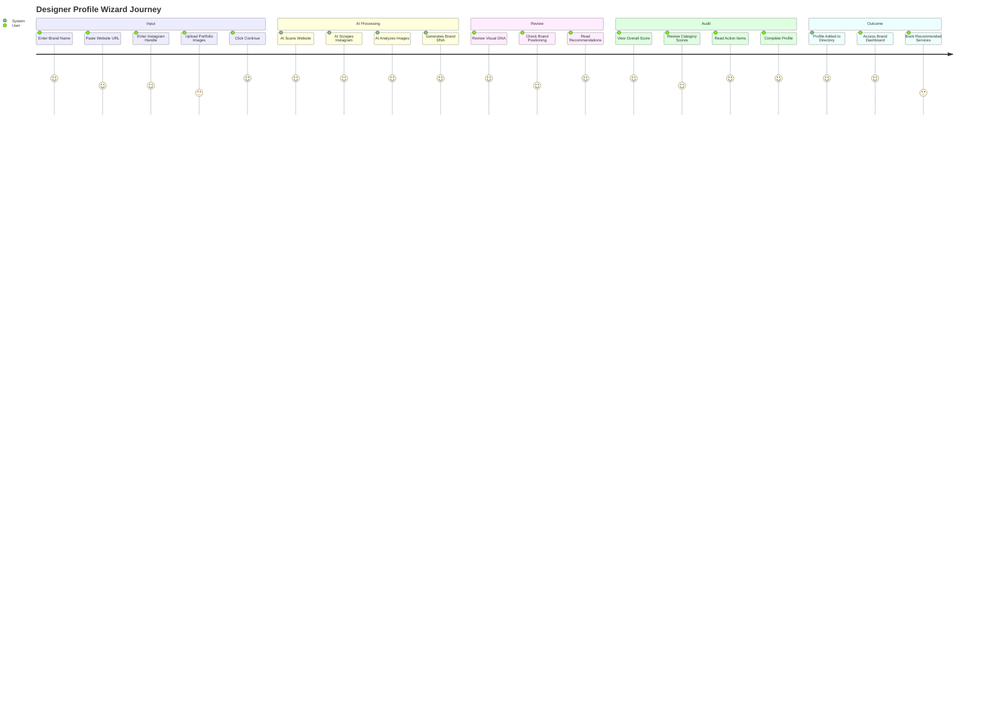

### **Dashboard Connections**

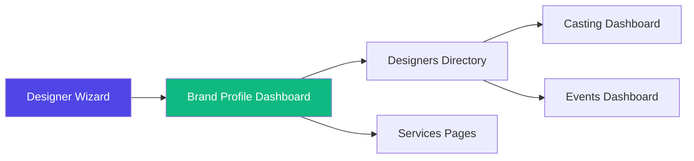

**Connections:**
- **Creates:** Brand Profile in Designers Directory
- **Populates:** Brand Profile Dashboard
- **Recommends:** Services based on gaps
- **Enables:** Matchmaking for events (Casting Dashboard)
- **Feeds:** Designer Directory search/filter

---

## 5. Brand Shoot Wizard (`/brand-shoot-wizard`)

### **Overview**
AI-native campaign planning wizard for brand photoshoots. Analyzes brand signals, recommends assets, generates shot lists, and provides intelligent pricing.

### **Steps & Screens**

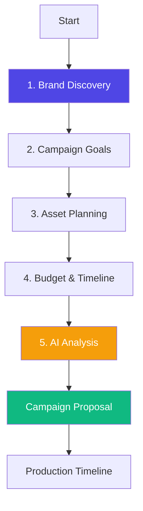

#### **Screen 1: Brand Discovery**
**What it does:** Collect brand context  
**Fields:**
- Brand Name
- Website URL
- Instagram Handle
- E-commerce Platform (Shopify, WooCommerce, etc.)
- Product Category
- Upload Existing Brand Assets (optional)

**AI Processing:**
- Scrapes website for visual DNA
- Analyzes Instagram aesthetic
- Identifies product types
- Extracts brand values

**Data collected:**
```typescript
{
  brandName: string,
  websiteUrl: string,
  instagramHandle: string,
  ecommercePlatform?: string,
  productCategory: string,
  existingAssets: File[]
}
```

#### **Screen 2: Campaign Goals**
**What it does:** Define campaign objectives  
**Options (multi-select):**
- 🚀 Product Launch
- 📢 Brand Awareness
- 📱 Social Content
- 🛍️ E-commerce Assets
- ✨ Rebrand/Refresh
- 🗓️ Seasonal Campaign

**Additional Fields:**
- Target Channels (Instagram, TikTok, Website, Amazon, Pinterest)
- Target Audience (demographics)
- Success Metrics (engagement, sales, awareness)
- Campaign Timeline (date range)

**AI Suggestions:**
- Recommends goals based on brand analysis
- Suggests channels based on audience
- Proposes timeline based on complexity

**Data collected:**
```typescript
{
  goals: string[],
  targetChannels: string[],
  targetAudience: string,
  successMetrics: string,
  campaignTimeline: { start: Date, end: Date }
}
```

#### **Screen 3: Asset Planning**
**What it does:** Select required asset types  
**Asset Types (checkboxes):**
- Hero Shots (main product/brand imagery)
- Lifestyle Photos (products in use)
- Detail Shots (close-up features)
- Flat Lays (styled arrangements)
- Model Shots (on-person imagery)
- Video Content (short-form videos)
- Behind the Scenes (process content)
- UGC Style (user-generated style)

**For Each Selected Asset:**
- Quantity Needed (slider)
- Priority (High, Medium, Low)

**AI Recommendations:**
- Suggests asset mix based on goals
- Recommends quantities
- Prioritizes based on ROI

**Data collected:**
```typescript
{
  assets: [
    {
      type: string,
      quantity: number,
      priority: 'high' | 'medium' | 'low'
    }
  ]
}
```

#### **Screen 4: Budget & Timeline**
**What it does:** Define financial and time constraints  
**Fields:**
- Total Budget (currency input)
- Preferred Shoot Date (date picker)
- Turnaround Time (1 week, 2 weeks, 1 month, custom)
- Location Preference (Studio, On-location, Both)
- Talent Needed? (Yes/No, if yes: models, hand models, etc.)

**Budget Calculator:**
- Shows estimated cost breakdown
- Compares to budget
- Suggests adjustments if over budget

**Timeline Validator:**
- Checks availability
- Warns if timeline too tight
- Suggests optimal dates

**Data collected:**
```typescript
{
  totalBudget: number,
  shootDate: Date,
  turnaroundTime: string,
  location: 'studio' | 'location' | 'both',
  talentNeeded: boolean,
  talentTypes?: string[]
}
```

#### **Screen 5: AI Analysis & Proposal**
**What it does:** AI generates comprehensive campaign plan  
**AI Processing:**
1. Analyzes all inputs
2. Generates shot list
3. Recommends crew and equipment
4. Creates production timeline
5. Calculates pricing
6. Identifies risks

**AI Results Panel Shows:**

**Shot List (Auto-generated):**
- Shot description
- Asset type
- Location/setup
- Lighting requirements
- Props needed
- Estimated time

**Crew Recommendations:**
- Photographer (+ portfolio link)
- Stylist
- Hair & Makeup Artist
- Assistant
- Videographer (if applicable)

**Equipment List:**
- Camera gear
- Lighting setup
- Backdrops/props
- Specialty equipment

**Production Schedule:**
- Pre-production tasks
- Shoot day timeline
- Post-production timeline
- Delivery date

**Pricing Breakdown:**
- Photography/Videography fees
- Talent fees
- Location/studio rental
- Equipment rental
- Post-production (retouching, editing)
- Rush fees (if applicable)
- **Total Investment**

**Risk Assessment:**
- Weather (if outdoor)
- Sample delivery delays
- Talent availability
- Timeline feasibility

**Interactive Features:**
- Accept/Reject AI recommendations
- Adjust quantities
- Swap crew members
- Modify timeline

**Data collected:**
```typescript
{
  aiGeneratedPlan: {
    shotList: Shot[],
    crew: CrewMember[],
    equipment: EquipmentItem[],
    schedule: ScheduleItem[],
    pricing: PricingBreakdown,
    risks: Risk[]
  },
  userAdjustments: object
}
```

**Approve Button:** Creates campaign and advances to Production Timeline

### **AI Features**

#### **Brand Signal Analysis**
- Scrapes website for visual patterns
- Analyzes Instagram for aesthetic consistency
- Identifies successful content types
- Maps brand to visual archetypes

#### **Shot List Generator**
- Uses GPT-4 to create detailed shot descriptions
- Optimizes for brand consistency
- Ensures variety and coverage
- Adapts to campaign goals

#### **Crew Matching**
- Matches photographer style to brand aesthetic
- Checks availability
- Considers portfolio quality
- Suggests backup options

#### **Dynamic Pricing**
- Calculates based on complexity
- Adjusts for rush timeline
- Considers location costs
- Compares to market rates

### **Agents**
- **Brand Shoot Agent:** Orchestrates entire workflow
- **Asset Quality Scorer:** Predicts asset performance
- **Budget Guardian:** Validates budget feasibility

### **User Journey**

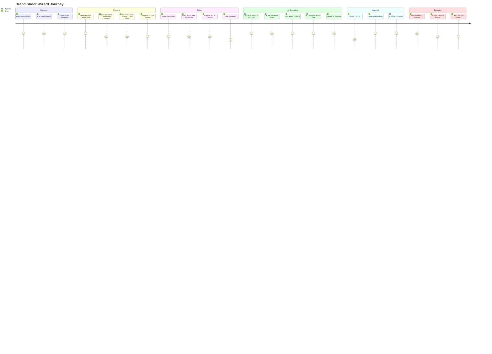

### **Dashboard Connections**

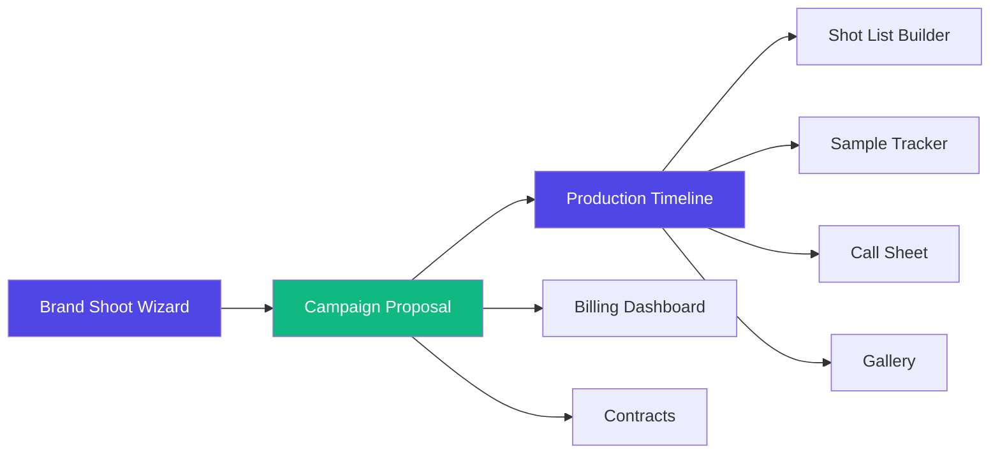

**Connections:**
- **Creates:** Campaign in BrandShootContext
- **Generates:** Proposal Preview
- **Initializes:** Production Timeline with phases
- **Populates:** Shot List Builder with AI shots
- **Creates:** Invoice in Billing Dashboard
- **Generates:** Contract in Contracts Dashboard
- **Links to:** Sample Tracker for logistics
- **Sets up:** Call Sheet template
- **Prepares:** Gallery for asset uploads

---

## Wizard Comparison Matrix

| Wizard | Steps | AI Level | Avg Time | Creates | Primary Agent |
|--------|-------|----------|----------|---------|---------------|
| **Shoot Wizard** | 10 | Low | 10 min | Project + Proposal | None |
| **Event Wizard** | 6 | High | 15 min | Event + Tasks | Event Planner |
| **Website Wizard** | 9 | Medium | 20 min | Website Brief | None (Future) |
| **Designer Wizard** | 4 | Very High | 5 min | Brand Profile | Designer Matching |
| **Brand Shoot Wizard** | 5 | Very High | 8 min | Campaign + Timeline | Brand Shoot Agent |

---

## Wizard Orchestration Flow

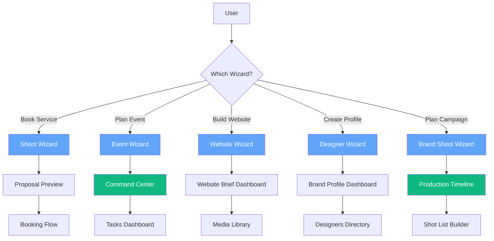

---

## Technical Implementation

### **Shared Components**

All wizards use common UI components:

```typescript
// From /components/wizards/shared/WizardComponents.tsx
- WizardContainer
- WizardHeader
- WizardProgress
- WizardStep
- WizardNavigation
- WizardSummary
```

### **State Management Patterns**

**Local State (within wizard):**
```typescript
const [currentStep, setCurrentStep] = useState(1);
const [formData, setFormData] = useState<WizardState>({});
const [isSubmitting, setIsSubmitting] = useState(false);
```

**Global State (on completion):**
```typescript
// Event Wizard → EventContext
const { createEvent } = useEvent();

// Brand Shoot → BrandShootContext
const { createCampaign } = useBrandShoot();
```

### **Validation Pattern**

**Progressive Validation:**
```typescript
// Validate current step before advancing
const handleNext = async () => {
  const stepSchema = getSchemaForStep(currentStep);
  const isValid = await stepSchema.validate(formData);
  
  if (isValid) {
    setCurrentStep(currentStep + 1);
  } else {
    showErrors();
  }
};
```

### **Auto-Save Pattern**

**Implemented in Event Wizard:**
```typescript
useEffect(() => {
  if (currentStep > 1) {
    saveDraft(formData, currentStep);
  }
}, [currentStep, formData]);
```

### **AI Integration Pattern**

**Standard AI Orchestration:**
```typescript
const handleAIAnalysis = async () => {
  setIsAnalyzing(true);
  
  try {
    const result = await aiOrchestrator.runWorkflow({
      type: 'brand_shoot',
      data: formData
    });
    
    setAiResults(result);
  } catch (error) {
    handleError(error);
  } finally {
    setIsAnalyzing(false);
  }
};
```

---

## Conclusion

FashionOS wizards transform complex professional workflows into **guided, intelligent experiences**. Each wizard:

- **Collects comprehensive data** through progressive disclosure
- **Validates inputs** at each step with clear error messages
- **Leverages AI** to generate intelligent recommendations
- **Auto-saves progress** to prevent data loss
- **Connects seamlessly** to relevant dashboards
- **Triggers workflows** that span multiple systems

**Wizards are entry points** to the broader FashionOS ecosystem, initializing projects, events, campaigns, and profiles that flow through dashboards, AI agents, and automation systems.

**The result:** Professional-grade outputs from simple, guided inputs.
