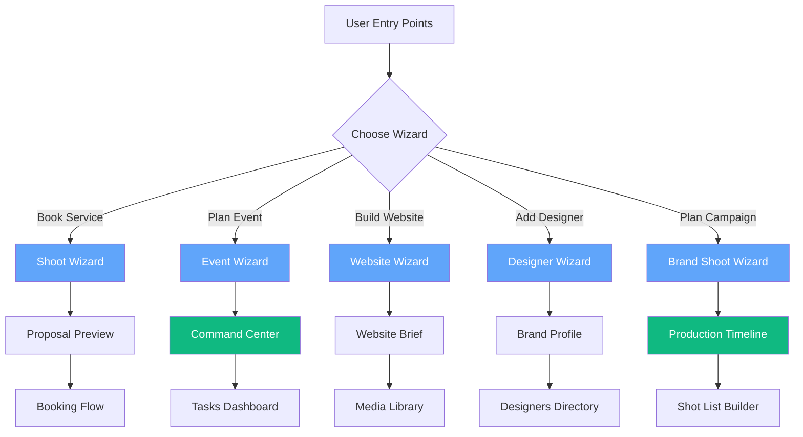
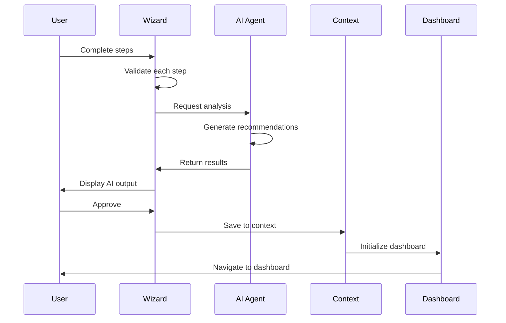

# FashionOS Wizards — Quick Reference

**5 intelligent wizards that transform complex workflows into guided experiences**

---

## Overview

| Wizard | Route | Steps | Time | AI Level | Output |
|--------|-------|-------|------|----------|--------|
| **Shoot Wizard** | `/wizard` | 10 | 10min | Low | Proposal + Project |
| **Event Wizard** | `/event-wizard` | 6 | 15min | High | Event + Tasks |
| **Website Wizard** | `/website-wizard` | 9 | 20min | Medium | Website Brief |
| **Designer Wizard** | `/directory-wizard` | 4 | 5min | Very High | Brand Profile |
| **Brand Shoot Wizard** | `/brand-shoot-wizard` | 5 | 8min | Very High | Campaign + Timeline |

---

## 1. Shoot Wizard

**Purpose:** Book photography, video, web design, or social media services

**Flow:**
```
Service → Category → Sub-Type → Style → Scenes → Talent → 
Add-Ons → Channels → Date/Time → Summary → Proposal
```

**Key Screens:**
1. **Service Selection** - Photography, Video, Web Design, Social Media
2. **Category** - Fashion, Beauty, Jewelry, Footwear, Eyewear, Food
3. **Sub-Type** - Womenswear, Swimwear, Cosmetics, etc. (category-specific)
4. **Style** - Editorial, Street, Minimal, Catalog
5. **Scenes** - Studio backdrops or lifestyle locations
6. **Talent** - Full body model, hand model, foot model, or none
7. **Add-Ons** - Retouching, color grading, rush delivery, social sizing
8. **Channels** - Instagram, TikTok, YouTube, Amazon, Shopify
9. **Date/Time** - Schedule shoot
10. **Summary** - Review and submit

**AI Features:**
- Dynamic pricing based on selections
- Add-on recommendations
- Availability checking

**Connects To:**
- → Proposal Preview Dashboard
- → BrandShootContext
- → Production Timeline
- → Client Dashboard

---

## 2. Event Creation Wizard

**Purpose:** Create fashion events with AI task generation

**Flow:**
```
Basic Info → Date/Venue → Casting → Sponsors → Deliverables → Review → 
AI Generates Tasks → Command Center
```

**Key Screens:**
1. **Basic Info** - Name, type, description, attendees, public/private
2. **Date & Venue** - Event date, times, venue details, capacity, virtual option
3. **Casting & Talent** - Models needed, types, celebrity bookings, crew requirements
4. **Sponsors** - Sponsor cards (company, tier, deal amount, deliverables, contacts)
5. **Deliverables** - Lookbook, photography, video, social content, success metrics, budget
6. **Review & Submit** - Final review with edit links, AI task preview

**AI Features:**
- **Auto-save drafts** (restores if < 24hrs old)
- **Smart defaults** (pre-fills recently used venues)
- **AI task generation** - Event Planner Agent generates 50-100 tasks
- **Validation** - Cross-field validation (end time > start time)
- **Idempotency** - Safe retries, won't duplicate events

**Data Structure:**
```typescript
{
  basic_info: { name, type, description, attendees, is_public },
  date_venue: { date, start_time, end_time, venue, address, capacity },
  casting: { num_models, types, celebrity_bookings, crew_needs },
  sponsors: [{ company, tier, amount, deliverables, contacts }],
  deliverables: { items[], success_metrics, budget, requirements }
}
```

**Agents:**
- Event Planner Agent (generates tasks)
- Ops Risk Agent (identifies blockers)
- Budget Guardian (validates budget)

**Connects To:**
- → Command Center (health monitoring starts)
- → Tasks Dashboard (AI-generated task list)
- → Events List (new event card)
- → Sponsors CRM (relationship links)
- → Production Timeline (phases initialized)
- → Venues Dashboard (venue booking)

**Validation Files:**
- `/lib/validation/event-schemas.ts` - Zod schemas for each step
- `/lib/api/events.ts` - API calls with retry logic

---

## 3. Website Builder Wizard

**Purpose:** Create e-commerce stores, portfolios, landing pages, creator sites

**Flow:**
```
Purpose → Brand Identity → Page Structure → Content Upload → 
E-commerce Setup → Integrations → Timeline/Budget → Review → 
Website Brief Dashboard
```

**Key Screens:**
1. **Purpose** - Website type (portfolio/ecommerce/landing/creator), goals, audience
2. **Brand Identity** - Logo upload, color palette, visual style, brand words
3. **Page Structure** - Select pages (Home, Shop, About, etc.), AI copywriting toggle
4. **Content Upload** - Text, images, product photos, moodboards, AI copywriting
5. **E-commerce** (conditional) - Products, categories, variants, payment, shipping
6. **Integrations** - Email, analytics, social, CRM, chat, booking
7. **Timeline & Budget** - Launch date, budget tier (Starter/Growth/Pro/Enterprise)
8. **Review** - AI generates sitemap, wireframes, timeline, quote
9. **Brief Dashboard** - Persistent project management dashboard

**AI Features:**
- AI copywriting for all pages
- Smart sitemap generation
- Budget optimization recommendations
- Content gap analysis

**Connects To:**
- → Website Brief Dashboard (unique per project)
- → Media Library (organized uploads)
- → Sitemap Visualizer (interactive diagram)
- → Content Checklist (track assets)
- → Clients Dashboard (client relationship)
- → Billing Dashboard (invoice creation)

---

## 4. Designer Profile Wizard

**Purpose:** AI-powered brand audit and profile creation

**Flow:**
```
Input URLs → AI Scanning → Brand Analysis → Audit Results → 
Brand Profile Dashboard
```

**Key Screens:**
1. **Input** - Brand name, website URL, Instagram handle, portfolio upload
2. **Scanning** (AI) - Scrapes website, Instagram, analyzes images (10-15 sec)
3. **Analysis** - Visual DNA, brand positioning, content strategy, insights
4. **Audit** - Overall score (0-100), category scores, strengths/opportunities/gaps

**AI Analysis:**
- **Visual DNA** - Primary colors, typography, photography style
- **Brand Positioning** - Aesthetic category, target market, price point
- **Content Strategy** - Post frequency, engagement, themes, hashtags
- **Scorecard** - Brand consistency, visual identity, content quality, social presence

**AI Tech:**
- Computer vision (color extraction, composition analysis)
- Instagram API (recent 12 posts)
- Web scraping (OpenGraph, colors, fonts)
- NLP (brand voice from bio/captions)

**Agents:**
- Designer Matching Agent (aesthetic analysis)
- Brand Audit AI (future)

**Connects To:**
- → Brand Profile Dashboard
- → Designers Directory (searchable profile)
- → Casting Dashboard (event matchmaking)
- → Services Pages (recommendations based on gaps)

---

## 5. Brand Shoot Wizard

**Purpose:** AI-native campaign planning for brand photoshoots

**Flow:**
```
Brand Discovery → Campaign Goals → Asset Planning → Budget/Timeline → 
AI Analysis → Campaign Proposal → Production Timeline
```

**Key Screens:**
1. **Brand Discovery** - Brand name, website, Instagram, e-commerce platform, category
2. **Campaign Goals** - Objectives (launch, awareness, social, ecommerce, rebrand), channels
3. **Asset Planning** - Select types (hero, lifestyle, detail, flat lay, model, video, BTS, UGC)
4. **Budget & Timeline** - Total budget, shoot date, turnaround, location, talent
5. **AI Analysis** - Generates shot list, crew, equipment, schedule, pricing, risks

**AI Generates:**
- **Shot List** - 30+ detailed shots with descriptions, setups, lighting, props
- **Crew Recommendations** - Photographer, stylist, HMUA, assistant (with portfolios)
- **Equipment List** - Camera gear, lighting, backdrops, specialty equipment
- **Production Schedule** - Pre-production, shoot day timeline, post-production
- **Pricing Breakdown** - Photography fees, talent, location, equipment, post, rush fees
- **Risk Assessment** - Weather, sample delays, talent availability, timeline feasibility

**AI Features:**
- Brand signal analysis (website + Instagram scraping)
- Shot list generation (GPT-4 detailed descriptions)
- Crew matching (photographer style → brand aesthetic)
- Dynamic pricing (complexity + timeline + location)

**Agents:**
- Brand Shoot Agent (orchestrates workflow)
- Asset Quality Scorer (predicts performance)
- Budget Guardian (validates feasibility)

**Connects To:**
- → Campaign Proposal (review screen)
- → Production Timeline (phases initialized)
- → Shot List Builder (AI shots pre-loaded)
- → Sample Tracker (logistics tracking)
- → Call Sheet (template created)
- → Gallery (prepared for uploads)
- → Billing Dashboard (invoice)
- → Contracts (digital agreement)

---

## Wizard Orchestration



---

## Technical Patterns

### **Shared Components**
```typescript
// /components/wizards/shared/WizardComponents.tsx
- WizardContainer
- WizardHeader
- WizardProgress
- WizardStep
- WizardNavigation
- WizardSummary
```

### **Validation Pattern**
```typescript
const handleNext = async () => {
  const schema = getSchemaForStep(currentStep);
  const isValid = await schema.validate(formData);
  if (isValid) setCurrentStep(currentStep + 1);
};
```

### **Auto-Save Pattern** (Event Wizard)
```typescript
useEffect(() => {
  if (currentStep > 1) saveDraft(formData, currentStep);
}, [currentStep, formData]);
```

### **AI Integration Pattern**
```typescript
const result = await aiOrchestrator.runWorkflow({
  type: 'brand_shoot',
  data: formData
});
```

---

## Wizard Data Flow



---

## Key Differentiators

### **Event Wizard**
- Production-ready with comprehensive testing
- Auto-save drafts with restoration
- Idempotent API calls (safe retries)
- Full Zod validation schemas
- AI task generation (50-100 tasks)

### **Brand Shoot Wizard**
- AI-first design
- Web scraping + Instagram analysis
- GPT-4 shot list generation
- Dynamic crew matching
- Real-time pricing calculator

### **Designer Wizard**
- Fastest wizard (5 min)
- Computer vision analysis
- Brand scorecard (0-100)
- Actionable recommendations
- No manual data entry

### **Website Wizard**
- Most comprehensive (9 steps)
- E-commerce specialization
- AI copywriting for all pages
- Integration marketplace
- Persistent project dashboard

### **Shoot Wizard**
- Classic manual flow
- Widest service coverage
- Channel-based licensing
- Simple pricing model
- Human-friendly options

---

## Conclusion

FashionOS wizards are **intelligent entry points** that:
- Collect comprehensive data through progressive disclosure
- Leverage AI for recommendations and automation
- Validate inputs at each step
- Auto-save progress
- Connect seamlessly to dashboards
- Initialize multi-system workflows

**Result:** Professional-grade outputs from simple, guided inputs.
