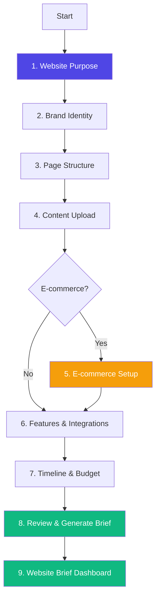
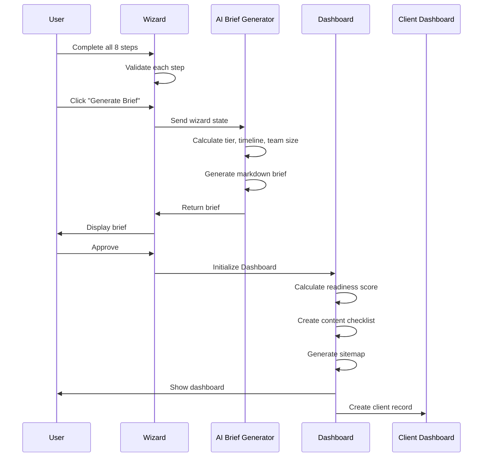
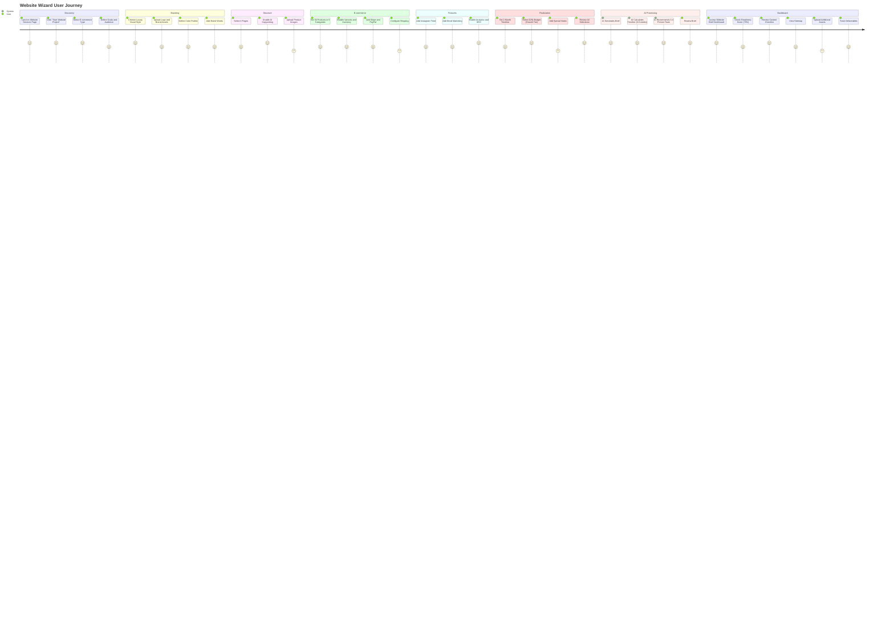
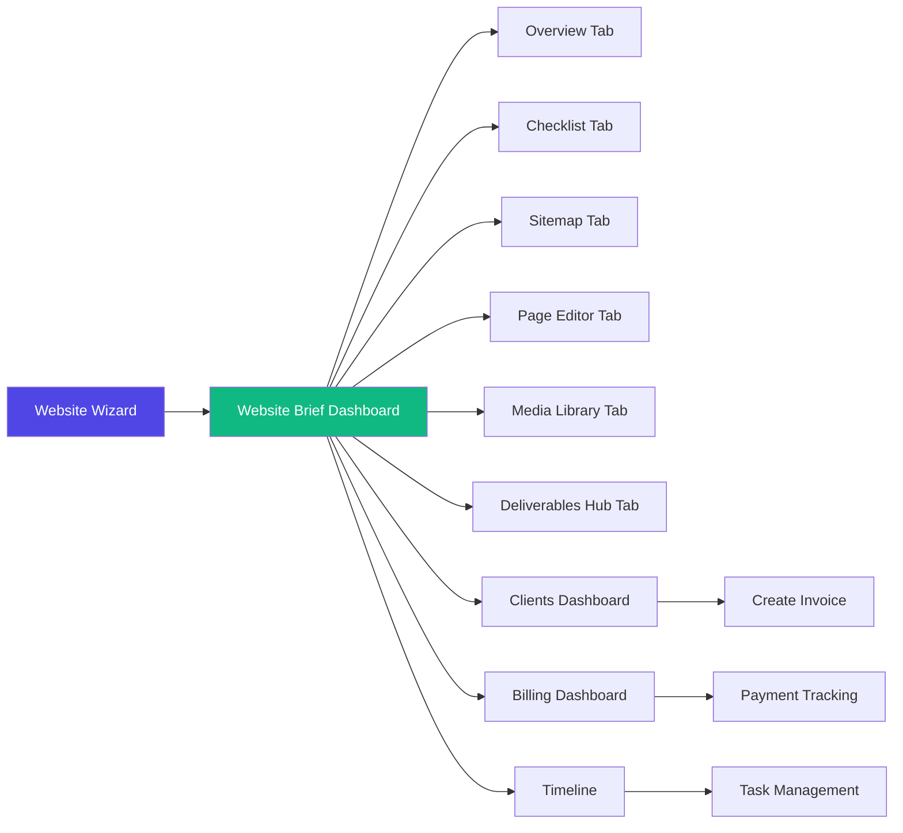

# Website Wizard — Complete Guide

**9-step intelligent website builder for e-commerce, portfolios, landing pages, and creator sites**

---

## Overview

The Website Wizard is FashionOS's most comprehensive wizard, guiding users through website creation from initial concept to production-ready brief. It features AI-powered brief generation, dynamic e-commerce configuration, and a persistent project management dashboard.

**Route:** `/website-wizard`  
**Steps:** 9 (7 if non-e-commerce)  
**Avg Time:** 15-20 minutes  
**AI Level:** Medium (AI brief generation, recommendations)  
**Output:** Website Brief Dashboard with project management tools

---

## Wizard Flow



---

## Screen-by-Screen Breakdown

### **Step 1: Website Purpose**

**Question:** What type of website are you building?

**Options:**
- **Business / Portfolio** - Showcase work and build professional presence
- **E-Commerce Store** - Sell products online with shopping experience
- **Landing Page** - Convert visitors with focused single-page
- **Personal Brand / Creator** - Build personal brand and connect with audience

**Additional Questions:**
- **Primary Goals** (multi-select):
  - Increase Sales
  - Build Brand Awareness
  - Generate Leads
  - Showcase Portfolio
  - Educate Audience
  - Launch Product
  - Build Community
  - Sell Services

- **Target Audience** (textarea) - "Who are your ideal customers or visitors?"
- **Desired Results** (textarea) - "What does success look like?"

**Validation:**
- Website type must be selected

**Data Collected:**
```typescript
{
  websiteType: 'portfolio' | 'ecommerce' | 'landing' | 'creator',
  goals: string[],
  audience: string,
  results: string
}
```

**Logic:**
- If `websiteType === 'ecommerce'`, Step 5 (E-commerce Setup) is shown
- Otherwise, wizard jumps from Step 4 → Step 6

---

### **Step 2: Brand Identity**

**Question:** How should your website look and feel?

**Visual Style Selection:**
- **Minimalist** - Clean, spacious, neutral colors
- **Luxury Editorial** - Dark backgrounds, gold accents, serif fonts
- **Bold & Colorful** - Bright colors, large type, energetic
- **Dark / High Contrast** - Dark mode, high contrast, modern

**Brand Assets Upload:**
- **Logo Upload** - Drag & drop logo file
- **Brand Guidelines PDF** (optional) - Upload existing brand guide
- **Inspiration Images** (multi-upload) - 3-5 reference images
- **Color Palette** (color picker) - Add 3-5 brand colors with hex codes

**Brand Voice:**
- **Brand Descriptors** (text) - "3-5 words that describe your brand"
  - Examples: Modern, Elegant, Bold, Playful, Professional
- **Emotional Vibe** (textarea) - "What emotions should visitors feel?"
  - Examples: Inspired, Confident, Excited, Calm, Empowered

**Features:**
- Drag-drop file upload with preview
- Color picker with hex input
- Add/remove colors dynamically
- Image lightbox for inspiration references

**Validation:**
- Visual style must be selected
- At least 1 color in palette recommended (not required)

**Data Collected:**
```typescript
{
  visualStyle: 'minimalist' | 'luxury' | 'bold' | 'dark',
  logo: File | null,
  brandGuidelines: File | null,
  inspirationImages: File[],
  colorPalette: string[], // hex codes
  brandWords: string,
  emotions: string
}
```

---

### **Step 3: Page Structure**

**Question:** Which pages do you need?

**Available Pages:**

| Page | Icon | Content Needed | Auto-selected for |
|------|------|----------------|-------------------|
| **Home** | 🏠 | Hero headline, featured images, CTAs | All |
| **About** | 👤 | Brand story, team photos, values | - |
| **Services** | 💼 | Service descriptions, pricing, process | - |
| **Portfolio** | 📊 | Project images, case studies, testimonials | Portfolio |
| **Shop** | 🛍️ | Product images, descriptions, categories | E-commerce |
| **Product Page** | 📦 | Product photos, specs, pricing | E-commerce |
| **Testimonials** | ⭐ | Customer quotes, photos, company names | - |
| **Contact** | ✉️ | Contact details, address, business hours | - |
| **Blog** | 📄 | Blog posts, author bios, featured images | - |
| **Lookbook** | 🖼️ | Collection photos, season theme, product names | - |
| **Campaign** | 📢 | Campaign visuals, event details, CTAs | - |
| **Press** | 📰 | Press releases, media kit, logos | - |
| **FAQ** | ❓ | Common questions, troubleshooting | - |
| **Events** | 🎫 | Event calendar, tickets, registration | - |
| **Careers** | 💼 | Job listings, culture, benefits | - |

**Interactive Features:**
- Click to select/deselect pages
- Visual page cards with preview images
- Each page shows content requirements
- "Needs AI Copywriting" toggle per page
- Selected pages highlighted

**Validation:**
- At least 1 page must be selected (Home auto-selected)

**Data Collected:**
```typescript
{
  pages: [
    {
      id: string,
      name: string,
      selected: boolean,
      hasContent: boolean,
      needsAI: boolean,
      description: string,
      contentNeeded: string[]
    }
  ]
}
```

**Smart Defaults:**
- E-commerce sites auto-select: Home, Shop, Product Page, Contact
- Portfolio sites auto-select: Home, About, Portfolio, Contact
- Landing pages auto-select: Home only

---

### **Step 4: Content Upload**

**Question:** What content assets do you have?

**Text Content:**
- **Paste or Type Content** (rich text editor)
  - "Paste existing copy for your pages"
- **Upload Content Files** (multi-upload)
  - Accepts: PDF, DOCX, TXT
  - "Upload existing marketing materials, brochures, or copy docs"

**Visual Assets:**
- **Product Images** (multi-upload)
  - "Upload product photos if you have them"
  - Image preview grid
- **Moodboard Images** (multi-upload)
  - "Additional visual inspiration or stock photos"

**AI Copywriting:**
- **Enable AI Copywriting** (checkbox)
  - "Let AI generate professional copy for pages without content"
  - Shows which pages need copy based on selections

**Features:**
- Drag-drop file upload
- Image compression on upload
- File size limits displayed
- Progress bars for uploads
- Lightbox preview for images

**Validation:**
- None required (can proceed with empty content)
- AI copywriting toggle available if content missing

**Data Collected:**
```typescript
{
  textContent: string,
  contentFiles: File[],
  productImages: File[],
  moodboardImages: File[],
  aiCopywriting: boolean
}
```

---

### **Step 5: E-commerce Setup** (Conditional)

**Shown Only If:** `websiteType === 'ecommerce'`

**Question:** Configure your online store

#### **Product Catalog**
- **Number of Products** (slider: 1-1000+)
- **Product Categories** (tag input)
  - Examples: Apparel, Accessories, Home, Beauty
  - Add/remove categories dynamically
- **Need Product Photography?** (checkbox)
  - Links to photography services

#### **Store Features** (checkboxes)
- **Product Variants** - Size, color, material options
- **Inventory Tracking** - Stock levels and low-stock alerts
- **Discount Codes** - Promotional codes and sales
- **Customer Login** - Account creation and order history
- **Wishlist** - Save items for later
- **Subscriptions** - Recurring product deliveries
- **Digital Products** - Downloads, licenses, courses
- **Abandoned Cart Recovery** - Email reminders for incomplete checkouts

#### **Payment & Checkout**
- **Payment Gateways** (multi-select):
  - Stripe (recommended)
  - PayPal
  - Square
  - Apple Pay
  - Google Pay
  - Afterpay / Klarna (BNPL)

- **Currencies** (multi-select):
  - USD (default)
  - EUR, GBP, CAD, AUD, etc.

#### **Shipping Configuration**
- **Shipping Rules** (textarea)
  - "Describe your shipping setup"
- **Free Shipping Threshold** (currency input)
  - "Offer free shipping over $X"
- **Flat Rate Shipping** (currency input)
  - "Standard flat rate amount"
- **Real-Time Rates** (checkbox)
  - "Integrate with USPS, FedEx, UPS for live rates"

**Validation:**
- Number of products > 0
- At least 1 payment gateway selected

**Data Collected:**
```typescript
{
  numProducts: number,
  productCategories: string[],
  needPhotography: boolean,
  variants: boolean,
  inventoryTracking: boolean,
  discountCodes: boolean,
  customerLogin: boolean,
  wishlist: boolean,
  subscriptions: boolean,
  digitalProducts: boolean,
  abandonedCart: boolean,
  paymentGateways: string[],
  currencies: string[],
  shippingRules: string,
  freeShippingThreshold: string,
  flatRateShipping: string,
  realTimeRates: boolean
}
```

**Pricing Impact:**
- Each feature adds to complexity score
- Subscriptions and digital products increase tier
- Multiple payment gateways add integration time

---

### **Step 6: Features & Integrations**

**Question:** What additional features do you need?

**Available Features:**

| Feature | Description | Configuration |
|---------|-------------|---------------|
| **Email Marketing** | Newsletter signup, campaigns | Mailchimp, Klaviyo, ConvertKit |
| **Live Chat** | Customer support chat widget | Intercom, Drift, Tawk.to |
| **Booking Calendar** | Appointment scheduling | Service types, availability, payment |
| **CRM Integration** | Customer relationship management | HubSpot, Salesforce, Zoho |
| **Instagram Feed** | Live Instagram posts on site | Account connection, layout style |
| **TikTok Feed** | Embed TikTok videos | Account, video selection, autoplay |
| **Blog CMS** | Content management system | Categories, tags, author management |
| **Chatbot** | AI-powered support | Platform, auto-responses, handoff |
| **Analytics** | Google Analytics 4, Meta Pixel | GA4, Facebook Pixel, custom events |
| **SEO Tools** | Search engine optimization | Meta titles, schema, XML sitemap |

**Interactive Features:**
- Click to expand feature cards
- View detailed configuration requirements
- Drawer panel shows integration details
- Toggle features on/off
- See pricing impact in real-time

**Data Collected:**
```typescript
{
  features: string[] // feature IDs
}
```

**Logic:**
- Each feature adds to complexity and budget
- Some features have dependencies (e.g., booking requires payment)

---

### **Step 7: Timeline & Budget**

**Question:** When do you need this and what's your investment?

#### **Timeline**
- **Launch Timeline** (select):
  - ASAP (2-4 weeks)
  - 1-2 months
  - 2-3 months
  - 3-6 months
  - Custom Date (date picker)

**Budget Selection:**

| Tier | Range | Best For | Timeline |
|------|-------|----------|----------|
| **Starter** | $5k - $15k | Simple sites, landing pages | 2-4 weeks |
| **Growth** | $15k - $35k | Growing businesses, basic e-commerce | 4-8 weeks |
| **Pro** | $35k - $75k | Complex sites, advanced e-commerce | 8-12 weeks |
| **Enterprise** | $75k+ | Full-scale platforms | 12-16 weeks |

**Each Tier Includes:**
- **Starter:** Up to 5 pages, basic features, mobile responsive
- **Growth:** Up to 15 pages, advanced features, CMS integration
- **Pro:** Unlimited pages, custom features, API integrations
- **Enterprise:** Enterprise features, dedicated team, ongoing support

**Budget Input:**
- Slider to adjust exact budget within tier
- Real-time tier recommendation based on selections

**Additional Notes:**
- **Final Notes** (textarea) - "Any special requirements or questions?"

**Validation:**
- Timeline must be selected
- Budget > $0

**Data Collected:**
```typescript
{
  timeline: string,
  customDate: Date | null,
  budget: number,
  budgetTier: 'starter' | 'growth' | 'pro' | 'enterprise' | null,
  finalNotes: string
}
```

**Logic - AI Tier Recommendation:**
```typescript
calculateTier() {
  let score = 0;
  if (ecommerce) score += 2;
  score += selectedPages.length * 0.5;
  score += features.length * 0.5;
  if (variants) score += 1;
  if (subscriptions) score += 2;
  
  if (score <= 5) return 'Starter';
  if (score <= 10) return 'Growth';
  if (score <= 15) return 'Pro';
  return 'Enterprise';
}
```

---

### **Step 8: Review & Generate Brief**

**Question:** Review your requirements

**Display:**
- Accordion sections showing all collected data:
  - Website Purpose & Goals
  - Brand Identity
  - Page Structure
  - Content Assets
  - E-commerce Configuration (if applicable)
  - Features & Integrations
  - Timeline & Budget

**Edit Capability:**
- Each section has "Edit" link
- Jumps back to specific step
- Returns to review after edit

**AI Brief Generation:**
- **Generate Brief Button**
- Shows loading state (2 sec animation)
- AI processes all inputs
- Generates comprehensive markdown brief

**Generated Brief Includes:**
1. **Project Overview**
   - Website type, goals, audience, desired results
2. **Brand Direction**
   - Visual style, colors, brand words, emotions
   - Assets provided checklist
3. **Pages & Structure**
   - Complete page list
   - Content status (provided/needed)
   - AI copywriting requests
4. **E-commerce Configuration** (if applicable)
   - Product count, categories, photography needs
   - Store features enabled
   - Payment gateways, currencies, shipping
5. **Features & Integrations**
   - Complete feature list with configurations
6. **Project Timeline & Budget**
   - Timeline estimate
   - Budget and recommended tier
   - Additional notes
7. **Estimated Scope**
   - Timeline estimate (calculated)
   - Team size (2-8 people depending on tier)
   - Complexity level (Low to High)
8. **Next Steps**
   - Review/approve, sign contract, kick-off call, design phase

**AI Calculations:**
```typescript
getTimelineEstimate(state) {
  if (tier === 'Starter') return '2-4 weeks';
  if (tier === 'Growth') return '4-8 weeks';
  if (tier === 'Pro') return '8-12 weeks';
  if (tier === 'Enterprise') return '12-16 weeks';
}

getTeamSize(state) {
  if (tier === 'Starter') return '2-3 people';
  if (tier === 'Growth') return '3-4 people';
  if (tier === 'Pro') return '4-6 people';
  if (tier === 'Enterprise') return '6-8 people';
}

getComplexityLevel(state) {
  if (tier === 'Starter') return 'Low to Medium';
  if (tier === 'Growth') return 'Medium';
  if (tier === 'Pro') return 'Medium to High';
  if (tier === 'Enterprise') return 'High';
}
```

**Actions:**
- Download Brief (PDF)
- Share Brief (email link)
- Regenerate Brief (re-run AI)
- Proceed to Dashboard

**Data Collected:**
```typescript
{
  generatedBrief: string, // markdown
  briefGeneratedAt: Date
}
```

---

### **Step 9: Website Brief Dashboard**

**Persistent Project Management Dashboard**

**Tabs:**

#### **1. Overview**
- **Design Readiness Score** (0-100%)
  - Calculated based on completed items
  - Visual progress bar
- **Project Summary**
  - Website type, tier, budget, timeline
- **Missing Items Alert**
  - Red badge showing incomplete items
- **Quick Actions**
  - Download brief, share, regenerate

#### **2. Content Checklist**
- Checklist of all required content per page
- Status indicators: ✅ Provided | ⚠️ Needs AI | ❌ Missing
- Click to edit page content
- Upload additional assets
- Track completion percentage

#### **3. Sitemap Visualizer**
- Interactive visual sitemap
- Hierarchical page structure
- Click nodes to edit pages
- Show/hide pages
- Export sitemap diagram

#### **4. Page Editor**
- Edit requirements for each page
- Add/update content
- Toggle AI copywriting per page
- Mark content as complete
- Add notes for designer

#### **5. Media Library**
- Organized view of all uploaded assets
- Categories: Logo, Brand Assets, Product Photos, Moodboard
- Image grid with lightbox
- Upload additional files
- Tag and categorize images
- Download all assets

#### **6. Deliverables Hub**
- Track project milestones
- Deliverable checklist (wireframes, mockups, content, dev, launch)
- Timeline view
- Status updates
- Client approval workflow

**Dashboard Features:**
- Persistent across sessions (saved to state/database)
- Real-time collaboration (future)
- Export to PDF
- Share with team
- Link to billing dashboard
- Connect to client dashboard

**Data Flow:**


---

## AI Features

### **1. Auto-Save Drafts**
```typescript
useEffect(() => {
  const draft = {
    state,
    currentStep,
    timestamp: new Date().toISOString()
  };
  localStorage.setItem('website-wizard-draft', JSON.stringify(draft));
}, [state, currentStep]);
```

### **2. Intelligent Tier Recommendation**
- Analyzes complexity based on:
  - Website type (e-commerce adds +2)
  - Number of pages (0.5 per page)
  - Number of features (0.5 per feature)
  - Advanced features (variants +1, subscriptions +2)
- Recommends tier before user selects budget

### **3. Brief Generation**
- Parses all wizard inputs
- Generates professional markdown brief
- Calculates timeline estimates
- Determines team size
- Assesses complexity level
- Creates next steps action plan

### **4. Content Gap Analysis**
- Identifies missing content per page
- Flags pages needing AI copywriting
- Calculates design readiness score
- Prioritizes content needs

### **5. Smart Defaults**
- Pre-selects pages based on website type
- Auto-enables required features for e-commerce
- Suggests payment gateways based on location
- Recommends shipping options

---

## User Journey



---

## Dashboard Connections



**Connections:**
- **Creates:** Website Brief Dashboard (unique per project)
- **Links to:** Clients Dashboard (client relationship created)
- **Generates:** Invoice in Billing Dashboard
- **Populates:** Media Library with all uploads
- **Creates:** Content Checklist tasks
- **Builds:** Sitemap Visualizer
- **Initializes:** Deliverables tracking
- **Can link to:** Photography services (if needPhotography = true)

---

## Technical Implementation

### **State Management**
```typescript
const [state, setState] = useState<WebsiteWizardState>({
  // Step 1
  websiteType: null,
  goals: [],
  audience: "",
  results: "",
  // Step 2
  logo: null,
  brandGuidelines: null,
  colorPalette: [],
  visualStyle: null,
  inspirationImages: [],
  brandWords: "",
  emotions: "",
  // Step 3
  pages: PAGE_TYPES, // pre-defined array
  // Step 4
  textContent: "",
  contentFiles: [],
  productImages: [],
  moodboardImages: [],
  aiCopywriting: false,
  // Step 5 (E-commerce)
  numProducts: 0,
  productCategories: [],
  needPhotography: false,
  variants: false,
  // ... all e-commerce flags
  // Step 6
  features: [],
  // Step 7
  timeline: "",
  customDate: null,
  budget: 0,
  budgetTier: null,
  finalNotes: ""
});
```

### **Step Navigation Logic**
```typescript
const getNextStep = (current: WizardStep): WizardStep => {
  // Skip Step 5 if not e-commerce
  if (current === 4 && !shouldShowEcommerce) return 6;
  if (current < 9) return current + 1;
  return current;
};

const getPrevStep = (current: WizardStep): WizardStep => {
  // Skip Step 5 if not e-commerce
  if (current === 6 && !shouldShowEcommerce) return 4;
  if (current > 1) return current - 1;
  return current;
};
```

### **Validation Logic**
```typescript
const canProceed = (step: WizardStep): boolean => {
  switch (step) {
    case 1: return state.websiteType !== null;
    case 2: return state.visualStyle !== null;
    case 3: return state.pages.some(p => p.selected);
    case 4: return true; // No validation
    case 5: return !shouldShowEcommerce || state.numProducts > 0;
    case 6: return true;
    case 7: return state.timeline !== "" && state.budget > 0;
    default: return true;
  }
};
```

### **File Upload Pattern**
```typescript
const handleFileUpload = async (files: FileList, type: string) => {
  const uploadedFiles = Array.from(files);
  
  // Store in state
  setState(prev => ({
    ...prev,
    [type]: [...prev[type], ...uploadedFiles]
  }));
  
  // Optional: Upload to storage
  // await uploadToSupabase(uploadedFiles);
};
```

---

## Key Differentiators

### **Why This Wizard is Unique:**

1. **Most Comprehensive**
   - 9 steps cover every aspect of website planning
   - Conditional e-commerce step
   - 15+ page types available
   - 10+ integrations

2. **E-commerce Specialization**
   - Dedicated e-commerce configuration step
   - Product catalog planning
   - Payment gateway selection
   - Shipping rule builder
   - Variant and inventory management

3. **AI Brief Generation**
   - Professional markdown brief
   - Automatic calculations (timeline, team size, complexity)
   - Scope estimation
   - Next steps recommendation

4. **Persistent Dashboard**
   - Unlike other wizards, Step 9 is a full dashboard
   - Persistent across sessions
   - Project management tools
   - Content tracking
   - Media library
   - Deliverables hub

5. **Design Readiness Scoring**
   - Real-time calculation of project completeness
   - Visual progress indicators
   - Missing items alerts
   - Actionable recommendations

6. **File Management**
   - Multi-file upload
   - Image preview and lightbox
   - Categorized media library
   - Download all assets

---

## Budget Tier Details

| Tier | Price Range | Pages | Features | Timeline | Team | Use Case |
|------|-------------|-------|----------|----------|------|----------|
| **Starter** | $5k - $15k | Up to 5 | Basic | 2-4 weeks | 2-3 | Simple sites, landing pages, basic portfolios |
| **Growth** | $15k - $35k | Up to 15 | Advanced | 4-8 weeks | 3-4 | Growing businesses, basic e-commerce, multi-page sites |
| **Pro** | $35k - $75k | Unlimited | Custom | 8-12 weeks | 4-6 | Complex sites, advanced e-commerce, custom features |
| **Enterprise** | $75k+ | Unlimited | Enterprise | 12-16 weeks | 6-8 | Full platforms, multi-site, dedicated support |

---

## Conclusion

The Website Wizard is FashionOS's most sophisticated wizard, combining:
- **Comprehensive data collection** across 9 steps
- **Conditional logic** that adapts to website type
- **AI-powered brief generation** with professional output
- **E-commerce specialization** with detailed configuration
- **Persistent dashboard** for ongoing project management
- **Design readiness tracking** with actionable insights

**Result:** A complete website planning system that takes users from concept to production-ready brief with a persistent dashboard for execution.

**Perfect for:**
- Agencies collecting client requirements
- Designers planning website projects
- E-commerce businesses launching stores
- Creators building personal brands
- Businesses establishing web presence
