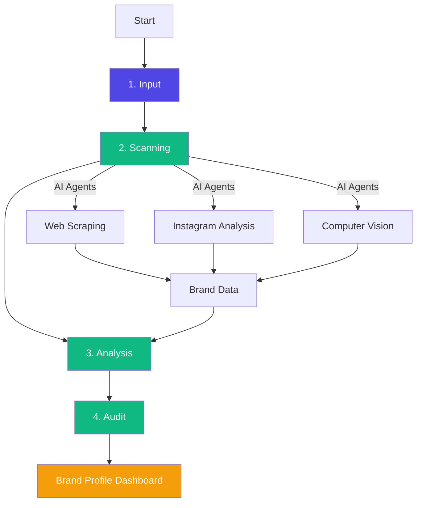
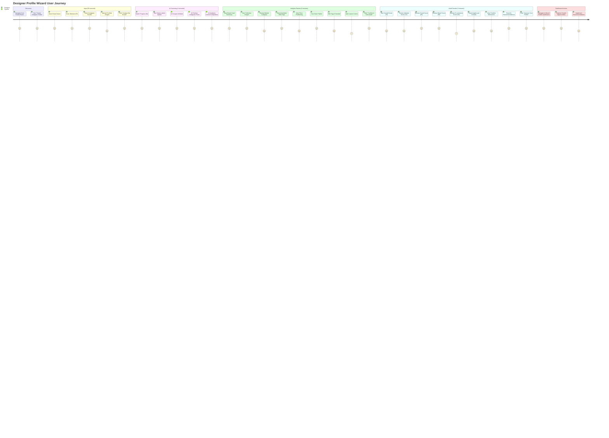
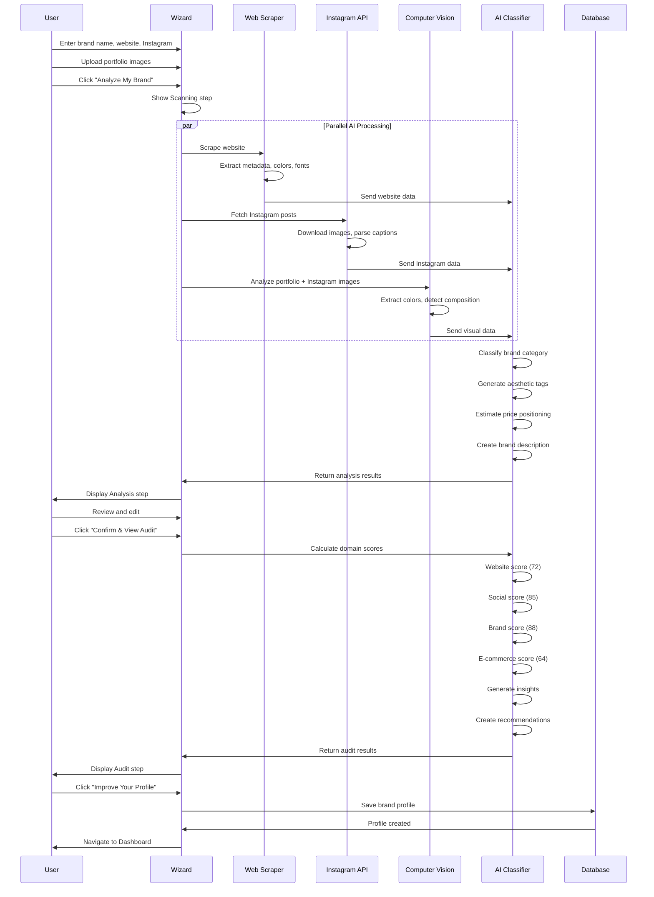
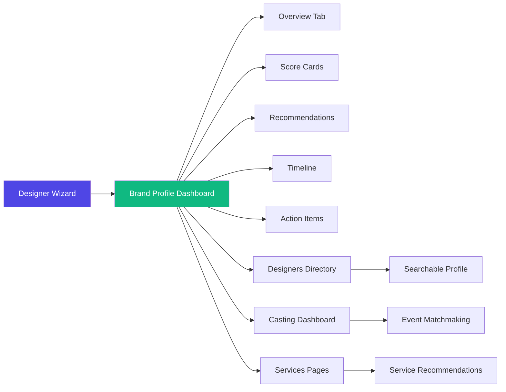

# Designer Profile Wizard — Complete Guide

**4-step AI-powered brand audit wizard for creating designer/brand profiles in the FashionOS directory**

---

## Overview

The Designer Profile Wizard (also called Designer Wizard or Directory Wizard) is FashionOS's **fastest and most AI-intensive wizard**. It analyzes brand websites and Instagram profiles using computer vision and web scraping to generate comprehensive brand audits with actionable recommendations. The wizard is designed for designers, brands, and agencies to create searchable profiles in the FashionOS directory and receive instant brand health insights.

**Route:** `/designer-wizard`  
**Steps:** 4 (Input → Scanning → Analysis → Audit)  
**Avg Time:** 5 minutes  
**AI Level:** Very High (computer vision, web scraping, brand analysis, scoring)  
**Output:** Brand Profile Dashboard with audit scores and recommendations

---

## Wizard Flow



---

## Screen-by-Screen Breakdown

### **Step 1: Input**

**Question:** Create Your Designer Profile

**Form Fields:**

1. **Designer/Brand Name** (text input)
   - Placeholder: "e.g. Andrew Majtenyi"
   - Icon: Pen tool
   - Required: Yes
   - Pre-filled with example for demo

2. **Website URL** (URL input)
   - Placeholder: "https://www.yourwebsite.com"
   - Icon: Globe
   - Required: Yes
   - Validation: Must be valid URL
   - Pre-filled: "https://www.andrewmajtenyi.com/"

3. **Instagram Handle** (text input)
   - Placeholder: "@yourhandle"
   - Icon: Instagram
   - Required: Yes
   - Format: @username
   - Pre-filled: "@andrewmajtenyi"

4. **Portfolio Images** (file upload - OPTIONAL)
   - Label: "Portfolio Images (Optional)"
   - Subtitle: "Upload 3-10 images that showcase your design aesthetic, collections, or past work"
   - File types: JPEG, PNG, WebP
   - Max size: 10MB per image
   - Max files: 10
   - Upload mode: Gallery
   - Auto-compress: Yes
   - Bucket: `designer-portfolios`
   - Folder: `{brand-name-slug}`

**Upload Features:**
- Drag & drop multi-file upload
- Image preview grid (3-4 columns responsive)
- Lightbox viewer with:
  - Full-screen image viewing
  - Navigation between images
  - Download capability
  - Delete capability
  - Metadata display (file name, size, type)
- Individual image remove button (hover reveals)
- "Clear all" button
- Upload count tracker

**Validation:**
- Name, website, and Instagram are required
- Portfolio upload is optional
- All 3 required fields must be filled to proceed

**Submit Button:**
- Text: "Analyze My Brand"
- Icon: Sparkles (animated)
- Background: Black
- Hover: Shadow lift effect

**Marketing Badge:**
- Background: Purple 50
- Text: "Free AI brand audit + portfolio analysis included"
- Icon: Sparkles

**Data Collected:**
```typescript
{
  name: string,
  website: string, // full URL
  instagram: string, // @handle
  portfolioFiles?: [
    {
      url: string,
      name: string,
      size: number,
      type: string,
      alt: string
    }
  ]
}
```

**User Experience:**
- Clean white card on neutral background
- Minimalist serif typography
- Smooth animations (fade in, slide)
- Hover states on inputs (white background)
- Focus states with ring
- Professional, luxury aesthetic

---

### **Step 2: Scanning**

**Question:** N/A (Automated AI step)

**Visual Display:**
- **Heading:** "Analyzing Brand DNA"
- **Animated Scanner Icon** - Rotating border around Scan icon
- **Progress Bar** - Black fill on gray background (0-100%)
- **Dynamic Status Labels** (change as progress updates):
  - 0%: "Initializing AI agents..."
  - 20%: "Scanning website architecture..."
  - 45%: "Analyzing brand visuals & color theory..."
  - 70%: "Comparing market positioning..."
  - 90%: "Finalizing audit scores..."
  - 100%: Transition to Analysis step

**Timing:**
- Total duration: 4 seconds (40ms per percent)
- Auto-advances to Step 3 when complete

**AI Processing (Behind the Scenes):**

1. **Website Scraping:**
   - Extract OpenGraph metadata
   - Scrape color palette from CSS
   - Analyze typography (font families)
   - Capture hero images
   - Parse page structure
   - Extract brand copy

2. **Instagram API Integration:**
   - Fetch recent 12 posts
   - Download images
   - Parse captions
   - Extract hashtags
   - Analyze posting frequency
   - Calculate engagement rates

3. **Computer Vision Analysis:**
   - Color extraction from images (primary, secondary, accent)
   - Composition analysis (rule of thirds, symmetry)
   - Subject detection (models, products, settings)
   - Style classification (minimalist, maximalist, editorial, etc.)
   - Mood detection (bright, dark, moody, airy)

4. **NLP Analysis:**
   - Brand voice extraction from bio and captions
   - Sentiment analysis
   - Keyword extraction
   - Category classification

**Decorative Elements:**
- Background sparkles (purple, yellow)
- Top gradient line
- Subtle shadow
- Rounded corners

**No User Interaction:**
- This step runs automatically
- Cannot skip or go back
- Loading state prevents page exit

---

### **Step 3: Analysis**

**Question:** How the Market Sees Your Brand

**Layout:** Two-column grid (8-4 split on desktop)

#### **Left Column - Analysis Data**

**Page Header:**
- Title: "How the Market Sees Your Brand"
- Subtitle: "We analyzed your website, collections, and public market signals to summarize how your brand is positioned today."
- Editable Badge: "You can edit anything before continuing"

**1. Brand Card:**
- **Logo Thumbnail** (circular, 80px)
  - Fallback: First letter of brand name
  - Border and shadow
- **Brand Name** (large, bold)
- **Description** (1-2 sentences)
  - AI-generated from website/Instagram analysis
  - Example: "A contemporary womenswear brand focused on minimalist silhouettes and responsible production."
- **Meta Tags:**
  - Location: "Copenhagen, Denmark" (extracted from website)
  - Est. Year: "Est. 2021"
  - Sustainability Badge: Green checkmark if sustainable keywords detected
- **Brand Links:**
  - Website URL (clickable)
  - Instagram handle (clickable)

**2. Active Collections:**
- **Section Title:** "Active Collections"
- **View All Link:** "View Digital Showroom →"
- **Collection Grid:** 4 images (3:4 aspect ratio)
  - Images pulled from Instagram or website
  - Hover effect: Scale 105%, overlay
  - Rounded corners
  - Responsive grid

**3. Brand Position Summary:**
- **Label:** "Brand Position Summary" (purple, animated dot)
- **Subtitle:** "Analyzed from your website, social, and collections" (italic)

**Analysis Fields (2x2 grid):**

| Field | Data | Description |
|-------|------|-------------|
| **Market Category** | "Contemporary Womenswear" | AI classification based on pricing, materials, presentation |
| **Aesthetic DNA** | Tags: "Minimalist", "Sustainable", "Structural" | Visual style keywords with "+ Add trait" option |
| **Price Positioning** | "$$ - $$$" | Relative pricing tier with explanation |
| **Brand Palette** | 3-5 color swatches (hex) | Primary colors extracted from images/website |

**Editable Features:**
- Tags can be added/removed
- Colors can be added (color picker)
- All fields have hover states
- "+ Add" buttons for expansion

#### **Right Column - Sticky Action Panel**

**Card Contents:**
- **Heading:** "Does this look right?"
- **Description:** "This is our best summary of how your brand is currently perceived. You can edit any field now, or continue to see a deeper brand audit."

**Action Buttons:**
1. **Primary:** "Confirm & View Audit"
   - Icon: Checkmark
   - Background: Black
   - Full width
   - Proceeds to Step 4

2. **Secondary Actions:**
   - "Edit Brand Info" (icon: Edit2)
   - "Retake Analysis" (icon: RotateCcw)

3. **Back Link:** "← Back to Input" (gray, small)

**Sticky Behavior:**
- Panel stays visible on scroll
- Top offset: 24px (96px from top)

**Data Displayed:**
```typescript
{
  brandName: string,
  description: string, // AI-generated
  location: string, // "City, Country"
  established: string, // "Est. YYYY"
  isSustainable: boolean,
  websiteUrl: string,
  instagramHandle: string,
  
  marketCategory: string, // AI classification
  aestheticTags: string[], // ["Minimalist", "Sustainable", ...]
  pricePosition: string, // "$", "$$", "$$$", "$$$$"
  priceDescription: string,
  colorPalette: string[], // hex codes
  
  collectionImages: string[] // URLs
}
```

**User Journey:**
- Review AI-generated analysis
- Edit any fields if needed
- Add/remove aesthetic tags
- Adjust color palette
- Click "Confirm" to see full audit

---

### **Step 4: Audit**

**Question:** N/A (Final results screen)

**Layout:** Full-width with sections

#### **Page Header**
- **Back Link:** "← Back to Overview"
- **Title:** "Brand Audit Overview"
- **Subtitle:** "AI-evaluated readiness across key growth areas."
- **Last Updated Badge:** "Last updated: Today"

#### **Overall Score (Left, 1/3 width)**

**Visual:**
- **Circular Progress Ring** (SVG)
  - Radius: 80px
  - Stroke width: 12px
  - Animated fill from 0 to score
  - Duration: 1.5 seconds
  - Color: Emerald 500 (#10b981)
- **Center Text:**
  - Score: Large serif (78)
  - Label: "Overall" (small, uppercase)
- **Status Badge:** "Good - Improving" (emerald background)
- **Description:** "Audit based on your public brand visuals and market performance."
- **Decorator Icon:** Lightning bolt (top right)

**Score Interpretation:**
- 0-50: Needs Improvement (Red)
- 51-70: Good (Emerald)
- 71-85: Excellent (Blue)
- 86-100: Outstanding (Purple)

#### **Domain Scores (Right, 2/3 width - 2x2 Grid)**

**1. Website Score: 72 / 100**
- **Status:** Good
- **Icon:** Layout
- **Color:** Blue
- **Insights:**
  - ⚪ Neutral: "Clean layout but slow load time"
  - 🔴 Negative: "Weak CTA placement above fold"
  - 🔴 Negative: "Mobile UX inconsistent"

**2. Social Score: 85 / 100**
- **Status:** Excellent
- **Icon:** Share2
- **Color:** Emerald
- **Insights:**
  - 🟢 Positive: "High engagement on Reels"
  - 🟢 Positive: "Consistent visual identity"
  - 🟢 Positive: "Bio link optimized for conversion"

**3. Brand Score: 88 / 100**
- **Status:** Excellent
- **Icon:** Star
- **Color:** Purple
- **Insights:**
  - 🟢 Positive: "Strong narrative consistency"
  - 🟢 Positive: "Premium typography usage"
  - 🟢 Positive: "Clear luxury positioning"

**4. E-commerce Score: 64 / 100**
- **Status:** Good
- **Icon:** Shopping Bag
- **Color:** Blue
- **Insights:**
  - ⚪ Neutral: "Product presentation lacks detail"
  - 🔴 Negative: "Checkout flow has friction"
  - 🔴 Negative: "Mobile cart interaction issues"

**Score Card Design:**
- White background
- Rounded corners
- Border and subtle shadow
- Circular progress indicator (smaller)
- Hover: Lift effect
- Staggered animation (0.1s delays)
- Expandable to show full insights

#### **Action Banner (Full Width)**

**Background:** Black (#111) with gradient overlay
**Content:**
- **Heading:** "Ready to optimize?"
- **Description:** "We've generated a personalized growth plan based on these audit scores. Unlock higher conversion and brand perception today."
- **Stats:**
  - "⚡ 3 High Priority Actions" (yellow icon)
  - "📈 +12 Score Potential" (emerald icon)
- **CTA Button:** "Improve Your Profile" (white background, black text)
- **Secondary Link:** "View Full Audit Report"

**Action:**
- Clicking CTA calls `onComplete()` which navigates to Brand Profile Dashboard

#### **Bottom Sections (2-column grid)**

**Left: Brand Health Timeline**

**Timeline Items:**
1. **Current Milestone** (green dot)
   - Badge: "Current Milestone"
   - Title: "Visual Merchandising Update"
   - Description: "Standardized product photography across collections. Improved visual consistency score by 12 points."
   - **Before/After Images:**
     - 2 small thumbnails (100x60px)
     - "BEFORE" overlay (grayscale, opacity 50%)
     - "AFTER" overlay (full color)
     - Arrow between them

2. **Past Milestone** (gray dot, opacity 50%)
   - Date: "Oct 12, 2024"
   - Title: "Initial Brand Audit"
   - Description: "Established baseline brand health score of 72."

**Timeline Design:**
- Vertical line connecting dots
- Dots have white ring
- Relative positioning
- Subtle animations on scroll

**Right: AI Recommendations**

**Recommendation Cards:**

1. **High Priority** (Amber badge)
   - Icon: Zap (amber background)
   - Title: "Fix Mobile Checkout Friction"
   - Description: "Cart abandonment is 15% higher on mobile. Simplifying the form could reclaim lost revenue."
   - Link: "View Solution" (underlined)

2. **Medium Priority** (Blue badge)
   - Icon: Layout (blue background)
   - Title: "Enhance Product Detail Pages"
   - Description: "Adding lifestyle imagery can increase conversion by up to 20% for your category."
   - Link: "See Examples" (underlined)

**Card Design:**
- White background
- Hover: Shadow increase
- Cursor: Pointer
- Flex layout with icon + content
- Badge colors match priority
- Group hover effect on title

**Additional Recommendations (Not Shown):**
- Low Priority items (gray)
- Opportunities (green)
- Quick Wins (yellow)

---

## AI Features Breakdown

### **1. Website Scraping**
```typescript
extractWebsiteData(url: string) {
  // OpenGraph metadata
  const ogData = parseOpenGraph(html);
  
  // Color palette extraction
  const colors = extractColorsFromCSS(styles);
  
  // Typography analysis
  const fonts = extractFontFamilies(computedStyles);
  
  // Brand copy
  const headlines = extractH1H2(html);
  const description = ogData.description || metaDescription;
  
  return {
    title, description, colors, fonts, 
    heroImage, logo, brandKeywords
  };
}
```

### **2. Instagram Analysis**
```typescript
analyzeInstagram(handle: string) {
  // Fetch recent posts via API
  const posts = await fetchInstagramPosts(handle, 12);
  
  // Download images
  const images = await downloadImages(posts.map(p => p.imageUrl));
  
  // Extract engagement data
  const avgLikes = calculateAverage(posts.map(p => p.likes));
  const postFrequency = calculateFrequency(posts);
  
  // Parse captions
  const hashtags = extractHashtags(posts);
  const brandVoice = analyzeTone(posts.map(p => p.caption));
  
  return {
    images, avgLikes, postFrequency, 
    hashtags, brandVoice, topPerformingPosts
  };
}
```

### **3. Computer Vision**
```typescript
analyzeImageAesthetics(images: string[]) {
  // Color extraction
  const colorPalette = extractDominantColors(images, 5);
  
  // Composition analysis
  const composition = detectComposition(images);
  // Returns: "rule-of-thirds", "symmetrical", "diagonal", etc.
  
  // Subject detection
  const subjects = detectObjects(images);
  // Returns: ["model", "product", "lifestyle-setting"]
  
  // Style classification
  const style = classifyStyle(images);
  // Returns: ["minimalist", "editorial", "street"]
  
  // Mood detection
  const mood = analyzeMood(colorPalette, composition);
  // Returns: ["bright", "airy", "moody", "dramatic"]
  
  return {
    colorPalette, composition, subjects, 
    style, mood, aestheticScore
  };
}
```

### **4. Brand Classification**
```typescript
classifyBrand(websiteData, instagramData, visualData) {
  // Market category
  const category = detectCategory(
    websiteData.keywords, 
    instagramData.hashtags,
    visualData.subjects
  );
  // Returns: "Contemporary Womenswear", "Luxury Menswear", etc.
  
  // Price positioning
  const pricePoint = estimatePricing(
    websiteData.prices,
    instagramData.context,
    visualData.aestheticScore
  );
  // Returns: "$", "$$", "$$$", "$$$$"
  
  // Aesthetic DNA
  const aestheticTags = combineAnalysis([
    visualData.style,
    websiteData.brandKeywords,
    instagramData.hashtagThemes
  ]);
  // Returns: ["Minimalist", "Sustainable", "Structural"]
  
  return { category, pricePoint, aestheticTags };
}
```

### **5. Scoring Algorithm**
```typescript
calculateBrandScores(data) {
  // Website Score (0-100)
  const websiteScore = {
    loadSpeed: measureLoadTime(data.website), // 30 points
    mobileUX: analyzeMobileResponsive(data.website), // 25 points
    ctaPlacement: detectCTAs(data.website), // 20 points
    visualQuality: assessImageQuality(data.website), // 15 points
    seoOptimization: checkSEO(data.website) // 10 points
  };
  
  // Social Score (0-100)
  const socialScore = {
    engagementRate: calculateEngagement(data.instagram), // 30 points
    visualConsistency: measureConsistency(data.instagram), // 25 points
    postFrequency: assessFrequency(data.instagram), // 20 points
    bioOptimization: analyzeBio(data.instagram), // 15 points
    hashtags: assessHashtags(data.instagram) // 10 points
  };
  
  // Brand Score (0-100)
  const brandScore = {
    narrativeConsistency: analyzeNarrative(data), // 30 points
    visualIdentity: assessVisualID(data), // 25 points
    positioning: evaluatePositioning(data), // 20 points
    typography: assessTypography(data), // 15 points
    colorPalette: evaluateColors(data) // 10 points
  };
  
  // E-commerce Score (0-100) - if applicable
  const ecommerceScore = {
    productPresentation: assessProductPhotos(data), // 30 points
    checkoutFlow: analyzeCheckout(data), // 25 points
    mobileCart: testMobileCart(data), // 20 points
    productDescriptions: evaluateDescriptions(data), // 15 points
    trustSignals: detectTrustBadges(data) // 10 points
  };
  
  // Overall Score (weighted average)
  const overallScore = (
    websiteScore.total * 0.25 +
    socialScore.total * 0.30 +
    brandScore.total * 0.30 +
    ecommerceScore.total * 0.15
  );
  
  return {
    overall: overallScore,
    website: websiteScore.total,
    social: socialScore.total,
    brand: brandScore.total,
    ecommerce: ecommerceScore.total,
    insights: generateInsights(data)
  };
}
```

### **6. Insight Generation**
```typescript
generateInsights(scoreData) {
  const insights = [];
  
  // Website insights
  if (scoreData.website.loadSpeed < 70) {
    insights.push({
      domain: "website",
      type: "negative",
      text: "Slow load time",
      priority: "high",
      solution: "Optimize images, enable caching, use CDN"
    });
  }
  
  // Social insights
  if (scoreData.social.engagementRate > 80) {
    insights.push({
      domain: "social",
      type: "positive",
      text: "High engagement on Reels",
      priority: "maintain",
      action: "Continue video content strategy"
    });
  }
  
  // Generate recommendations
  const recommendations = prioritizeActions(insights);
  
  return { insights, recommendations };
}
```

---

## User Journey



---

## Data Flows

### **Input → AI Processing**


### **Dashboard Connection**


---

## AI Agents

### **1. Designer Matching Agent**
**Purpose:** Aesthetic analysis for event matchmaking

**Inputs:**
- Brand visual DNA (colors, style, mood)
- Aesthetic tags
- Portfolio images
- Collection images

**Outputs:**
- Aesthetic similarity scores to event themes
- Style compatibility ratings
- Mood alignment scores

**Use Case:**
When an event is created with a specific aesthetic (e.g., "Minimalist Spring Collection"), this agent matches designers whose brand DNA aligns with the event theme.

**Algorithm:**
```typescript
matchDesignerToEvent(eventTheme, designerProfile) {
  const colorSimilarity = compareColorPalettes(
    eventTheme.colors, 
    designerProfile.colors
  ); // Cosine similarity
  
  const styleSimilarity = compareStyleTags(
    eventTheme.aestheticTags,
    designerProfile.aestheticTags
  ); // Jaccard index
  
  const moodAlignment = compareMood(
    eventTheme.mood,
    designerProfile.mood
  ); // Weighted score
  
  const matchScore = (
    colorSimilarity * 0.4 +
    styleSimilarity * 0.35 +
    moodAlignment * 0.25
  ) * 100;
  
  return {
    matchScore, // 0-100
    reasoning: explainMatch(matchScore),
    confidence: calculateConfidence(data)
  };
}
```

### **2. Brand Audit AI** (Future)
**Purpose:** Continuous brand health monitoring

**Features:**
- Scheduled re-audits (weekly, monthly)
- Competitor benchmarking
- Trend detection
- Automated recommendations
- Progress tracking

**Planned Enhancements:**
- Real-time social media monitoring
- Website change detection
- A/B test suggestions
- Conversion optimization tips

---

## Dashboard Connections

**Wizard Output Connects To:**

1. **Brand Profile Dashboard** (Primary)
   - Overall score display
   - Domain score cards
   - Recommendations list
   - Action items tracker
   - Timeline view
   - Profile editor

2. **Designers Directory** (Public)
   - Searchable profile card
   - Filter by aesthetic tags
   - Filter by price point
   - Filter by location
   - Filter by category
   - Portfolio gallery

3. **Casting Dashboard** (Event matching)
   - Designer recommendations for events
   - Aesthetic compatibility scores
   - Availability calendar
   - Booking requests

4. **Services Pages** (Recommendations)
   - Based on audit gap analysis
   - "Fix Mobile Checkout" → Web design service
   - "Improve Product Photography" → Photography service
   - "Enhance Social Media" → Social media service

---

## Key Differentiators

### **Why This Wizard is Unique:**

1. **Fastest Wizard**
   - Only 4 steps
   - AI does most of the work
   - 5-minute completion time
   - Minimal user input required

2. **Most AI-Intensive**
   - Web scraping (automatic)
   - Instagram API integration
   - Computer vision analysis
   - NLP brand voice detection
   - Automatic scoring (4 domains)
   - Insight generation
   - Recommendation prioritization

3. **Zero Manual Data Entry** (almost)
   - Just 3 required fields (name, website, Instagram)
   - Everything else is AI-extracted
   - Portfolio upload is optional
   - No category selection needed
   - No tag selection needed

4. **Instant Value**
   - Comprehensive brand audit in 5 minutes
   - Actionable recommendations
   - Competitive positioning insights
   - Visual brand DNA analysis
   - Specific improvement suggestions

5. **Professional Output**
   - 0-100 scoring system
   - Domain-specific breakdowns
   - Color-coded insights (positive/negative/neutral)
   - Timeline visualization
   - Before/after capability
   - Exportable audit report

6. **Computer Vision Integration**
   - Color palette extraction
   - Composition analysis (rule of thirds, symmetry)
   - Style classification (minimalist, editorial, street)
   - Mood detection (bright, dark, moody)
   - Subject detection (model, product, lifestyle)

7. **Portfolio Upload Innovation**
   - Multi-file drag & drop
   - Image lightbox with full metadata
   - Auto-compression (10MB → optimized)
   - Supabase storage integration
   - Per-brand folder organization
   - Delete and download capabilities

---

## Technical Implementation

### **State Management**
```typescript
const [step, setStep] = useState<WizardStep>("input");
const [brandData, setBrandData] = useState<BrandData>({
  name: "",
  website: "",
  instagram: "",
  portfolioFiles: []
});

type WizardStep = "input" | "scanning" | "analysis" | "audit";
```

### **Progress Tracking**
```typescript
const steps = [
  { id: "input", label: "Input" },
  { id: "analysis", label: "Analysis" },
  { id: "audit", label: "Audit" }
];

// "scanning" is not shown in progress bar
// It's a transitional state between input and analysis
```

### **File Upload Integration**
```typescript
<FileUpload
  onUpload={async (files: File[]) => {
    // Files selected, upload will start
  }}
  onUploadComplete={(results) => {
    // Upload finished, add to portfolio
    const newFiles = results.map(r => ({
      url: r.url,
      name: r.file.name,
      size: r.file.size,
      type: r.file.type,
      alt: `Portfolio image: ${r.file.name}`
    }));
    setPortfolioFiles(prev => [...prev, ...newFiles]);
  }}
  bucket="designer-portfolios"
  folder={formData.name.toLowerCase().replace(/\s+/g, '-')}
  acceptedTypes={['image/jpeg', 'image/png', 'image/webp']}
  maxSize={10 * 1024 * 1024} // 10MB
  multiple={true}
  maxFiles={10}
  mode="gallery"
  autoCompress={true}
/>
```

### **Scoring Animation**
```typescript
// SVG Circle Progress
const radius = 80;
const stroke = 12;
const normalizedRadius = radius - stroke * 2;
const circumference = normalizedRadius * 2 * Math.PI;
const strokeDashoffset = circumference - (score / 100) * circumference;

<motion.circle
  stroke="#10b981"
  strokeWidth={stroke}
  strokeDasharray={circumference}
  strokeLinecap="round"
  style={{ strokeDashoffset: circumference }}
  animate={{ strokeDashoffset }}
  transition={{ duration: 1.5, ease: "easeOut" }}
  r={normalizedRadius}
  cx={radius}
  cy={radius}
/>
```

### **Staggered Card Animations**
```typescript
<ScoreCard 
  title="Website Score" 
  score={72}
  delay={0.1} // Stagger by 0.1s
/>
<ScoreCard 
  title="Social Score" 
  score={85}
  delay={0.2}
/>
<ScoreCard 
  title="Brand Score" 
  score={88}
  delay={0.3}
/>
<ScoreCard 
  title="E-commerce Score" 
  score={64}
  delay={0.4}
/>
```

---

## Alternative Version: DirectoryProfileWizard

**Note:** There's a second, more manual version at `/components/wizards/DirectoryProfileWizard.tsx` with 5 steps:

1. **Basics** - Name, city, country, type, bio (manual entry)
2. **Brand Links** - Instagram, website, TikTok + Gemini analysis button
3. **Visual Identity** - Color picker, image upload
4. **Categories** - Select categories and highlights (tags)
5. **Review** - Final review and submit

**Key Differences:**
- More manual data entry
- User selects categories (not AI-classified)
- User uploads images (not auto-scraped)
- Gemini analysis is optional button click
- No scoring/audit step
- Simpler output (just profile creation)

**Use Case:**
This version is for users who prefer more control or whose brands don't have established websites/Instagram presence yet.

---

## Conclusion

The Designer Profile Wizard is FashionOS's **most AI-powered wizard**, transforming a 3-field form (name, website, Instagram) into:

- **Comprehensive brand audit** with 4 domain scores (Website, Social, Brand, E-commerce)
- **Visual DNA analysis** with color palettes, aesthetic tags, and mood detection
- **Market positioning insights** with category classification and price tier estimation
- **Actionable recommendations** prioritized by impact (high/medium/low)
- **Searchable directory profile** for event matchmaking and client discovery
- **Timeline tracking** for brand health improvements over time

**Result:** Professional-grade brand intelligence in 5 minutes with minimal user effort.

**Perfect for:**
- Designers launching their brands
- Established brands wanting competitive insights
- Agencies auditing client brands
- Fashion houses optimizing digital presence
- Events seeking designer talent with specific aesthetics
