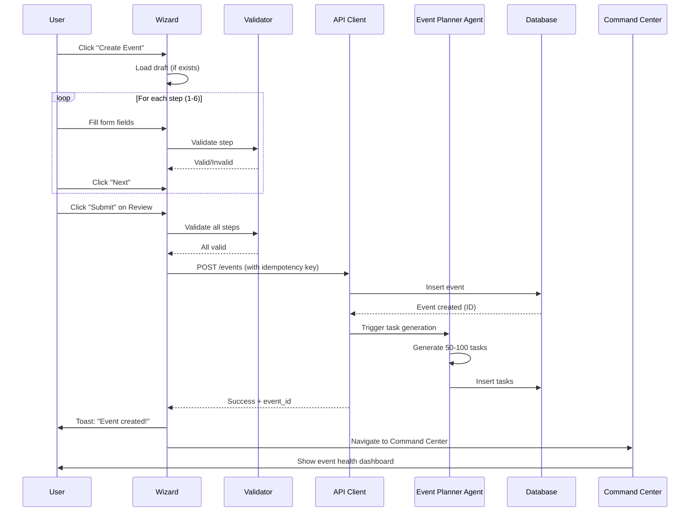

# Event Creation Wizard — Concise Guide

**6-step wizard for creating fashion events with AI task generation**

---

## Quick Overview

| Attribute | Value |
|-----------|-------|
| **Route** | `/event-wizard` |
| **Steps** | 6 |
| **Time** | 10-15 min |
| **AI Level** | High (auto task generation) |
| **Output** | Event + 50-100 AI-generated tasks |
| **Status** | Production-ready with full testing |

---

## 6 Steps

### **1. Basic Info**
- Event name (3-200 chars)
- Event type (runway show, gallery, popup, activation, trunk show, press preview)
- Description (10-2000 chars)
- Expected attendance (1-100k)
- Public/Private toggle

### **2. Date & Venue**
- Event date (future only)
- Start/end time
- Venue name (optional)
- Venue address
- Capacity
- Virtual event toggle

### **3. Casting & Talent**
- Number of models needed
- Model types (runway, fit, hand, promotional)
- Celebrity bookings (name, role, fee)
- Crew requirements (stylist, HMUA, photographer, videographer)

### **4. Sponsors**
- Sponsor cards (company, tier, deal amount, deliverables, contacts)
- Add multiple sponsors
- Tier: Title, Presenting, Supporting, In-Kind
- Optional step

### **5. Deliverables**
- Deliverable items (lookbook, photography, video, social content, press kit)
- Success metrics
- Budget allocation
- Special requirements

### **6. Review & Submit**
- Review all sections
- Edit any step (jump back)
- AI task preview
- Submit button
- Idempotency protection (safe retries)

---

## Data Structure

```typescript
{
  // Step 1
  basic_info: {
    name: string,
    event_type: EventType,
    description: string,
    expected_attendance: number,
    is_public: boolean
  },
  
  // Step 2
  date_venue: {
    event_date: string,
    start_time: string,
    end_time: string,
    venue: string,
    venue_address: string,
    capacity: number,
    is_virtual: boolean
  },
  
  // Step 3
  casting: {
    num_models: number,
    model_types: string[],
    celebrity_bookings: Array<{
      name: string,
      role: string,
      fee: number
    }>,
    crew_needs: {
      stylist: boolean,
      hmua: boolean,
      photographer: boolean,
      videographer: boolean
    }
  },
  
  // Step 4
  sponsors: Array<{
    company: string,
    tier: 'title' | 'presenting' | 'supporting' | 'in-kind',
    deal_amount: number,
    deliverables: string[],
    contacts: Array<{name: string, email: string, phone: string}>
  }>,
  
  // Step 5
  deliverables: {
    items: string[],
    success_metrics: string[],
    budget: number,
    requirements: string
  }
}
```

---

## Key Features

### **1. Auto-Save Drafts**
- Saves to localStorage on step change
- Restores if < 24 hours old
- Clears expired drafts

### **2. Full Validation**
- Zod schemas per step
- Client-side validation before submit
- Cross-field validation (end_time > start_time)
- Future date enforcement
- Realistic number ranges

### **3. Idempotent Submit**
- Generates idempotency key
- Safe retries (won't duplicate events)
- Server-side deduplication

### **4. AI Task Generation**
After submit:
- Event Planner Agent generates 50-100 tasks
- Tasks grouped by phase (pre-production, production, post-production)
- Assigned to relevant roles
- Due dates calculated backward from event date
- Checklists auto-created

### **5. Progress Tracking**
- Step indicator (1/6, 2/6, etc.)
- Validation per step
- Disabled "Next" until step valid
- Can go back to edit
- Review step shows all data

### **6. Error Handling**
- Toast notifications for errors
- Retry button on failure
- Error messages displayed
- Draft preserved on error

---

## AI Agents

### **Event Planner Agent**
**Triggers:** On event submit  
**Input:** Event data (all 5 steps)  
**Output:** 50-100 tasks  

**Task Generation Logic:**
```typescript
generateEventTasks(eventData) {
  const tasks = [];
  
  // Pre-production (60-30 days before)
  if (eventData.casting.num_models > 0) {
    tasks.push({
      title: "Cast models",
      phase: "pre-production",
      assignee: "casting_director",
      due_date: eventDate - 45 days
    });
  }
  
  if (eventData.sponsors.length > 0) {
    tasks.push({
      title: "Finalize sponsor contracts",
      phase: "pre-production",
      assignee: "partnerships",
      due_date: eventDate - 30 days
    });
  }
  
  // Production (30-0 days before)
  tasks.push({
    title: "Confirm venue setup",
    phase: "production",
    assignee: "production_manager",
    due_date: eventDate - 7 days
  });
  
  // Post-production (0-30 days after)
  if (eventData.deliverables.items.includes("lookbook")) {
    tasks.push({
      title: "Design lookbook",
      phase: "post-production",
      assignee: "designer",
      due_date: eventDate + 14 days
    });
  }
  
  return tasks;
}
```

### **Ops Risk Agent**
**Triggers:** On review step  
**Input:** Event data  
**Output:** Risk flags  

**Risk Detection:**
- Budget too low for scope
- Venue capacity < expected attendance
- < 30 days to event (tight timeline)
- Missing critical crew roles
- No sponsors but high budget

### **Budget Guardian**
**Triggers:** On deliverables step  
**Input:** Budget + deliverables  
**Output:** Budget warnings  

**Validations:**
- Budget covers all deliverables
- Runway show minimum: $50k
- Celebrity bookings within budget
- Sponsor revenue > 0 if budget < deliverables cost

---

## Workflow



---

## User Journey

1. **Entry:** Click "Create Event" from Events dashboard
2. **Step 1:** Name event, select type, write description → Next
3. **Step 2:** Pick date, venue, attendance → Next
4. **Step 3:** Set casting needs, crew requirements → Next
5. **Step 4:** Add sponsors (optional) → Next
6. **Step 5:** Choose deliverables, set budget → Next
7. **Step 6:** Review all, edit if needed → Submit
8. **Processing:** AI generates tasks (3-5 sec)
9. **Success:** Toast notification, redirect to Command Center
10. **Dashboard:** Event appears with health score, tasks list initialized

---

## Dashboard Connections

**Creates/Updates:**
- Events list (new card)
- Command Center (health monitoring starts)
- Tasks Dashboard (50-100 new tasks)
- Sponsors CRM (sponsor relationships linked)
- Production Timeline (phases initialized)
- Venues Dashboard (venue booking created)
- Budget Manager (budget allocation set)

**Links To:**
- Casting Dashboard (model bookings)
- Contracts Manager (sponsor contracts)
- Deliverables Hub (deliverable tracking)

---

## Validation Examples

```typescript
// Basic Info
name: "Paris Fashion Week Afterparty" ✓
name: "PF" ✗ (too short)

event_type: "runway_show" ✓
event_type: "fashion_show" ✗ (invalid enum)

// Date & Venue
event_date: "2024-06-15" ✓
event_date: "2023-01-01" ✗ (past date)

end_time: "22:00" ✓ (when start_time: "19:00")
end_time: "18:00" ✗ (before start_time)

// Casting
num_models: 12 ✓
num_models: -5 ✗ (negative)

// Budget
budget: 75000 ✓
budget: -1000 ✗ (negative)
```

---

## Files

- **UI:** `/components/wizards/EventCreationWizard.tsx`
- **Steps:** `/components/wizards/steps/*.tsx` (6 files)
- **Validation:** `/lib/validation/event-schemas.ts`
- **API:** `/lib/api/events.ts`
- **Tests:** `/tests/event-wizard.test.tsx` (22 tests)

---

## Testing Coverage

✅ **22 passing tests**
- Step 1 validation (name, type, description)
- Step 2 validation (date, venue, times)
- Step 3 validation (models, crew)
- Step 4 validation (sponsors)
- Step 5 validation (deliverables, budget)
- Cross-field validation (end > start)
- Draft save/restore
- Idempotency key generation
- API retry logic
- Error handling

---

## Unique Features

1. **Production-Ready:** Full validation, tests, error handling
2. **Idempotent:** Safe retries, no duplicate events
3. **Auto-Save:** Draft restoration on crash/refresh
4. **AI-Powered:** 50-100 tasks auto-generated
5. **Risk Detection:** Ops Risk Agent flags issues
6. **Budget Validation:** Budget Guardian prevents overspend
7. **Comprehensive:** 6 steps cover every event detail
8. **Fast:** 10-15 min to complete vs. manual 2+ hours

---

## Result

**Input:** 6-step form (10-15 min)  
**Output:** Complete event with 50-100 tasks, health monitoring, timeline phases, sponsor links, venue booking, budget allocation  
**Time Saved:** 2+ hours of manual task creation
