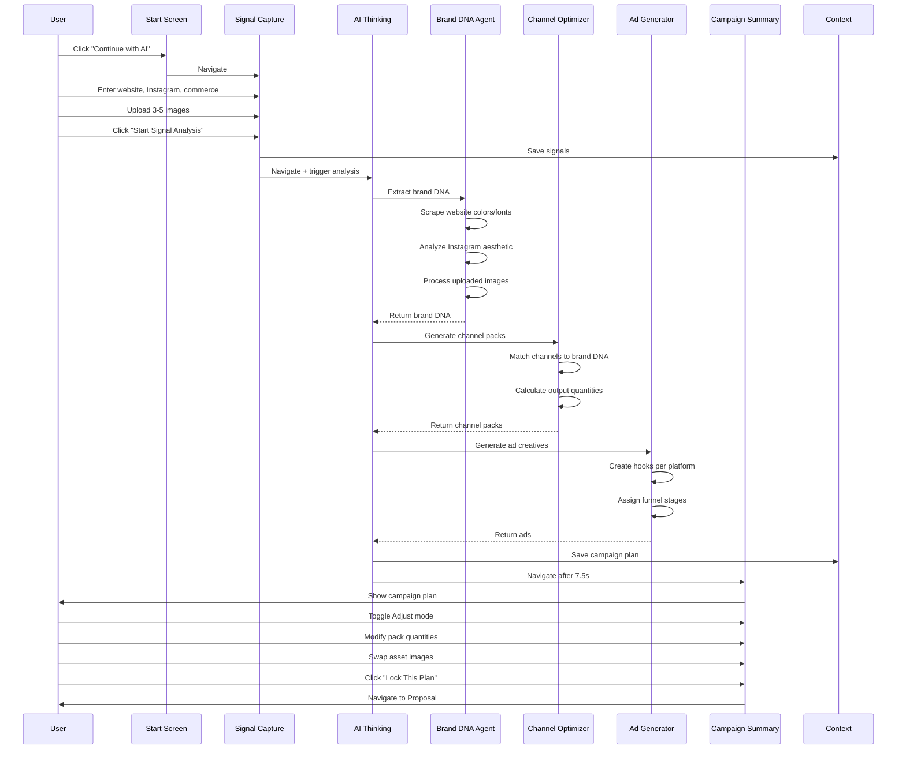

# Brand Shoot Wizard — Concise Guide

**AI-powered campaign planning wizard that generates multi-channel content strategies**

---

## Quick Overview

| Attribute | Value |
|-----------|-------|
| **Route** | `/start` (AI flow) or `/brand-shoot-wizard` (manual) |
| **AI Flow Steps** | 5 screens |
| **Manual Steps** | 5 steps |
| **Time** | AI: 3 min / Manual: 15 min |
| **AI Level** | Very High (brand analysis, asset planning, ad generation) |
| **Output** | Multi-channel campaign plan with 20-50 assets |

---

## AI Flow (Recommended)

### **Screen 1: Start**
- **Question:** Plan Your Campaign
- **Options:**
  - Primary: "AI Creative Partner" (recommended badge)
  - Secondary: "Use manual setup" (link)
- **Action:** Continue with AI → BrandSignalCapture

### **Screen 2: Signal Capture**
- **Question:** Connect Brand Signals
- **Inputs:**
  - Website URL (Globe icon)
  - Instagram handle (Instagram icon)
  - Commerce URL (ShoppingBag icon)
  - Visual assets upload (drag/drop, paste, browse)
- **Features:**
  - Image compression (max 800px, JPEG 0.7)
  - Base64 storage (localStorage)
  - Preview thumbnails with remove
  - Drag & drop zone
  - Paste support
- **Action:** "Start Signal Analysis" → AIThinking

### **Screen 3: AI Thinking**
- **Duration:** 7.5 seconds
- **Steps (1.5s each):**
  1. "Extracting brand DNA..."
  2. "Analyzing channel performance..."
  3. "Generating multi-channel output packs..."
  4. "Drafting ad hooks & creatives..."
  5. "Optimizing for conversion..."
- **Visual:**
  - Rotating orbital loader
  - Pulsing core
  - Abstract background orbs
  - Step-by-step text rotation
- **Action:** Auto-navigate → CampaignSummary

### **Screen 4: Campaign Summary**
- **Layout:** Full dashboard view
- **Modes:** Overview / Adjust (toggle)
- **Sections:**

**Hero Section:**
- Strategy title (e.g., "Product Sales Campaign")
- Goal headline
- Tone description
- Channel badges
- Hero image (swappable)

**Channel Packs Grid:**
- Instagram (Feed 4:5, Reels 9:16)
- TikTok (9:16 organic)
- Facebook (Feed, Stories)
- YouTube (Shorts, Thumbnails)
- Pinterest (Pins 2:3)
- Shopify (PDP 1:1)
- Amazon (Listing images)
- Website (Hero, Gallery)
- Each shows: output count, formats, usage (Organic/Paid/PDP)
- Adjust mode: +/- buttons to change quantity

**Ad Creatives:**
- Platform-specific ad designs
- Hook copy
- CTA
- Funnel stage (Awareness/Consideration/Conversion)
- Format (Feed, Story, Reel, etc.)

**Assets Gallery:**
- Hero shots
- Lifestyle photos
- Detail shots
- Product visuals
- Swappable (click to swap from alternative assets)

**Pricing:**
- Total campaign cost
- Deposit amount
- Payment breakdown

**Action:** "Lock This Plan" → ProposalConfirmation

### **Screen 5: Proposal Confirmation**
- Review final proposal
- Sign/approve
- Payment options
- Navigate to Proposal Dashboard

---

## Manual Wizard (5 Steps)

### **Step 1: Brand Discovery**
- Brand name
- Website URL
- Instagram handle
- Commerce platform
- File uploads (moodboard, references)

### **Step 2: Campaign Goals**
- Select goals:
  - Product Launch 🚀
  - Brand Awareness 📢
  - Social Content 📱
  - E-commerce Assets 🛍️
  - Rebrand/Refresh ✨
  - Seasonal Campaign 🗓️
- Target audience description
- Success metrics

### **Step 3: Asset Planning**
- Select asset types:
  - Hero Shots
  - Lifestyle Photos
  - Detail Shots
  - Flat Lays
  - Model Shots
  - Video Content
  - Behind the Scenes
  - UGC Style
- Quantity per type
- Channel distribution

### **Step 4: Budget & Timeline**
- Budget range
- Shoot date
- Deadline
- Turnaround expectations

### **Step 5: AI Analysis**
- AI generates plan based on inputs
- Review asset recommendations
- Adjust quantities
- Approve proposal

---

## Data Structure

```typescript
// Signals (Input)
{
  website: string,
  instagram: string,
  commerce: string,
  files: Array<{
    name: string,
    type: string,
    url: string // base64
  }>
}

// Campaign Plan (Output)
{
  strategy: {
    title: string,
    goal: string,
    tone: string,
    channels: Channel[]
  },
  
  channelPacks: Array<{
    channel: 'Instagram' | 'TikTok' | 'YouTube' | ...,
    outputCount: number,
    formats: string[], // ["Feed 4:5", "Reels 9:16"]
    usage: ('Organic' | 'Paid' | 'PDP')[],
    rationale: string
  }>,
  
  assets: Array<{
    source: string,
    url: string,
    usage?: string
  }>,
  
  ads: Array<{
    id: string,
    platform: Channel,
    format: string,
    hook: string, // ad copy
    cta: string,
    funnelStage: 'Awareness' | 'Consideration' | 'Conversion'
  }>,
  
  pricing: {
    total: number,
    deposit: number
  },
  
  customizations: Array<{
    id: string,
    label: string,
    price: number,
    selected: boolean
  }>
}
```

---

## AI Agents

### **1. Brand DNA Extractor**
**Input:** Website URL, Instagram, uploaded images  
**Output:** Brand colors, fonts, aesthetic, tone  
**Process:**
- Scrape website for color palette
- Extract logo and typography
- Analyze Instagram grid for visual consistency
- Classify aesthetic (minimalist, editorial, luxury, etc.)

### **2. Channel Optimizer**
**Input:** Brand DNA, commerce platform, target audience  
**Output:** Channel packs with recommended outputs  
**Logic:**
```typescript
analyzeChannels(brandDNA) {
  if (brandDNA.commerce === 'shopify') {
    channelPacks.push({
      channel: 'Shopify',
      outputCount: 8, // 6 PDP + 2 lifestyle
      formats: ['1:1 square', '4:5 portrait'],
      usage: ['PDP'],
      rationale: 'E-commerce requires white bg + lifestyle context'
    });
  }
  
  if (brandDNA.aestheticScore > 85) {
    channelPacks.push({
      channel: 'Instagram',
      outputCount: 12,
      formats: ['Feed 4:5', 'Reels 9:16'],
      usage: ['Organic', 'Paid'],
      rationale: 'High visual appeal suits feed + Reels'
    });
  }
  
  if (brandDNA.hasVideoContent) {
    channelPacks.push({
      channel: 'TikTok',
      outputCount: 6,
      formats: ['9:16 vertical'],
      usage: ['Organic'],
      rationale: 'Short-form video opportunity'
    });
  }
}
```

### **3. Ad Hook Generator**
**Input:** Brand DNA, channel, funnel stage  
**Output:** Ad creative with hook + CTA  
**Examples:**
```typescript
generateAd(platform: 'Instagram', stage: 'Awareness') {
  return {
    hook: "Stop scrolling. This changes everything.",
    cta: "Discover the collection",
    format: "Reel 9:16",
    visualStyle: "Fast cuts, trending audio"
  };
}

generateAd(platform: 'Facebook', stage: 'Conversion') {
  return {
    hook: "Still thinking about it? Here's 20% off.",
    cta: "Shop now before it's gone",
    format: "Carousel",
    visualStyle: "Product closeups + urgency"
  };
}
```

### **4. Asset Recipe Generator**
**Input:** Channel packs, brand goals  
**Output:** Specific shot requirements  
**Example:**
```typescript
{
  id: "pdp_conversion_set",
  title: "PDP Conversion Set",
  outputs: {
    Shopify: 8,
    Amazon: 4
  },
  requirements: [
    "White background",
    "Macro texture shots",
    "45° angle product",
    "Lifestyle context (1-2 shots)"
  ],
  rationale: "E-commerce conversion requires trust signals",
  confidence: 0.92
}
```

### **5. ROI Predictor**
**Input:** Campaign plan, historical data  
**Output:** Predicted conversion/awareness scores  
**Metrics:**
- Conversion potential (high/medium/low)
- Awareness lift (high/medium/low)
- Engagement rate estimate
- Cost per acquisition estimate

---

## Workflow



---

## User Journey

**AI Flow:**
1. Start → Click "AI Creative Partner"
2. Signal Capture → Enter website + Instagram + upload 3 images (2 min)
3. AI Thinking → Watch 5-step progress (7.5 sec)
4. Campaign Summary → Review plan, adjust quantities (30 sec)
5. Lock Plan → Navigate to proposal (done)

**Manual Flow:**
1. Start → Click "Use manual setup"
2. Step 1: Brand Discovery (2 min)
3. Step 2: Campaign Goals (2 min)
4. Step 3: Asset Planning (3 min)
5. Step 4: Budget & Timeline (2 min)
6. Step 5: AI Analysis → Review (2 min)
7. Submit (done)

---

## Dashboard Connections

**Output Goes To:**
- Proposal Dashboard (primary)
- Contracts Manager (pricing/contracts)
- Production Timeline (shoot scheduling)
- Asset Library (deliverables tracking)
- ROI Analytics (performance monitoring)

**Links From:**
- Client Dashboard (start new campaign)
- Services pages (book campaign)
- Home CTA (entry point)

---

## Key Features

### **1. Adjust Mode**
- Toggle between Overview/Adjust
- +/- buttons on channel packs
- Recalculates pricing in real-time
- Persists changes to context

### **2. Asset Swapping**
- Click any asset image
- Shows alternative options
- Swap with one click
- Updates campaign plan

### **3. Image Compression**
- Max 800px dimension
- JPEG quality 0.7
- Stores in localStorage as base64
- Prevents storage bloat

### **4. Multi-Channel Planning**
- 8 channels supported
- Platform-specific formats
- Usage categorization (Organic/Paid/PDP)
- Rationale per channel

### **5. Ad Creatives**
- Platform-specific hooks
- Funnel stage mapping
- Format recommendations
- CTA optimization

---

## Unique Differentiators

1. **AI-First Design:** AI flow is primary, manual is fallback
2. **Multi-Channel Native:** Plans for 8 platforms simultaneously
3. **Ad Generation:** Creates ad hooks + CTAs automatically
4. **Real-Time Adjustment:** Modify quantities, see price update instantly
5. **Asset Swapping:** Change visuals without re-running AI
6. **Signal-Based:** Uses existing brand presence vs. questionnaires
7. **ROI Predictions:** Shows conversion/awareness potential
8. **Fast:** 3 min total (vs. 15 min manual)

---

## Result

**Input:** 3 fields + 3-5 images  
**Output:** Complete multi-channel campaign with 20-50 assets, ad creatives, pricing, ROI predictions  
**Time:** 3 minutes (AI) vs. 15 minutes (manual)  
**Channels:** 8 platforms planned simultaneously  
**Ads:** 5-10 platform-specific ad creatives generated
