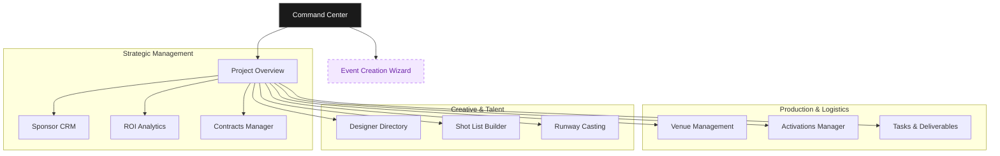
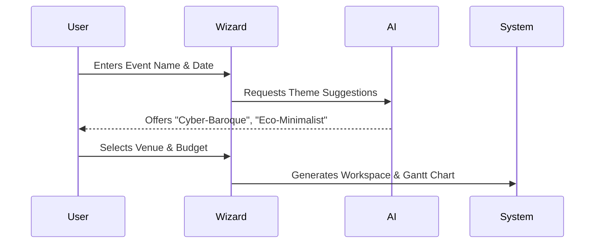

# FashionOS Dashboard Ecosystem
**Design System:** Luxury Utility  
**Version:** 2.0  
**Status:** Architecture & UI Definition

---

## 1. Ecosystem Overview

The FashionOS Dashboard Suite is a interconnected system of "Luxury Utility" tools designed to manage high-stakes fashion events. Unlike traditional admin panels, these interfaces blend the visual fidelity of a fashion editorial with the data density of a Bloomberg terminal.

### System Architecture
The user journey flows from high-level command (Multi-Event) to granular execution (Specific Tasks).



---

## 2. Dashboard Modules

### A. Command Center (The HQ)
*The central nervous system for the event director.*

**Tagline:** "Total control. Zero noise."  
**Visual Strategy:**
*   **Hero KPI Strip:** Top-level metrics (Revenue, Attendees, Critical Alerts) floating on a glass-morphism layer.
*   **Live Feed:** A "Bloomberg-style" ticker or vertical feed of real-time updates (Ticket sales, VIP arrivals).
*   **Global Map:** Interactive WebGL globe or map identifying event locations.

**User Journey:**
1.  **Login:** Director sees high-level health of all active events.
2.  **Triage:** "Critical Alerts" widget highlights immediate blockers (e.g., "Venue Permit Expiring").
3.  **Action:** One-click navigation to specific problem areas.

**Data Sample:**
```json
{
  "globalHealth": 94,
  "activeEvents": 3,
  "totalRevenue": 2450000,
  "criticalAlerts": [
    { "id": 101, "level": "High", "msg": "Dior Contract Pending Signature", "module": "Contracts" }
  ]
}
```

### B. Event Creation Wizard
*A guided, intelligent flow to instantiate a new event workspace.*

**Tagline:** "From vision to workspace in minutes."  
**Visual Strategy:**
*   **Split Layout:** Left 50% for inputs (White), Right 50% for live preview (Stone/Gray).
*   **Progress:** Elegant serif numbering (I, II, III).
*   **AI Assistant:** "Gemini" sidebar offering theme suggestions and venue recommendations.

**Workflow Diagram:**


### C. Project Overview
*The specific homepage for a single event (e.g., "NYFW SS25").*

**Tagline:** "Your event, decoded."  
**Visual Strategy:**
*   **"Next Best Action" Bar:** A prominent black bar across the top telling the user exactly what to do next.
*   **Timeline Visualization:** A horizontal Gantt summary showing current phase (e.g., "Pre-Production").
*   **Team Status:** Avatar pile showing who is online/active.

### D. Sponsor CRM
*Relationship management for high-value partners.*

**Tagline:** "Curating partnerships, closing deals."  
**Visual Strategy:**
*   **Kanban Board:** "Prospecting" → "Negotiation" → "Signed" columns.
*   **Tier Badges:** Metallic gradients (Gold, Platinum, Rose Gold) on sponsor cards.
*   **Fit Score:** An AI-generated percentage (e.g., "98% Brand Fit") displayed prominently.

**UI Layout:**
*   **Header:** Search, Filter, "Add Sponsor".
*   **Main:** Draggable Kanban cards with logo avatars.
*   **Sidebar:** Selected sponsor details + "Fit Analysis" AI card.

### E. Designer Directory
*A visual database of talent.*

**Tagline:** "The future of fashion, indexed."  
**Visual Strategy:**
*   **Grid View (Comp Cards):** Large, image-heavy cards (aspect ratio 3:4).
*   **Hover States:** Cards reveal "Category" (e.g., Couture) and "Status" (e.g., Confirmed) on hover.
*   **Quick Filters:** Pill-shaped toggles for "Emerging", "Sustainable", "Luxury".

**Data Sample:**
```json
{
  "designer": "Aurelia Noir",
  "category": "Avant-Garde",
  "looks": 12,
  "status": "Confirmed",
  "assets": ["lookbook_v1.pdf", "bio.docx"]
}
```

### F. Tasks & Deliverables
*The engine room of production.*

**Tagline:** "Every detail, accounted for."  
**Visual Strategy:**
*   **Clean List:** Minimalist rows with subtle hover states.
*   **Priority Flags:** Tiny geometric icons indicating urgency (Red triangle = Critical).
*   **Owner Avatar:** Small circle showing who is responsible.
*   **Status Pills:** Pastel utility colors (Green, Amber, Red).

### G. Activations Manager
*Managing physical and digital experiences.*

**Tagline:** "Orchestrating the moment."  
**Visual Strategy:**
*   **Visual Map:** A floor plan view showing where activations are located.
*   **Resource List:** Sidebar listing "Tech Requirements", "Staffing", "Catering" for each activation.
*   **Conflict Detection:** Visual warning overlays if two activations clash in time/space.

### H. Venue Management
*Logistics, capacity, and floor plans.*

**Tagline:** "Space, optimized."  
**Visual Strategy:**
*   **Capacity Bar:** Visual progress bar showing "RSVP vs Fire Limit".
*   **Facility Icons:** Custom set for "Backstage", "Runway", "VIP Entrance".
*   **Cost Tracker:** Real-time tally of rental + service fees.

### I. ROI Analytics
*Financial performance and impact.*

**Tagline:** "Impact measured."  
**Visual Strategy:**
*   **Dark Mode Charts:** Optional toggle for high-contrast data viewing.
*   **Trend Pills:** "↑ 15%" badges.
*   **Narrative Insights:** Text summarization below charts explaining *why* a metric moved.

### J. Contracts Manager
*Legal document tracking.*

**Tagline:** "Signed, sealed, delivered."  
**Visual Strategy:**
*   **Document Grid:** Preview thumbnails of PDFs.
*   **Signature Status:** "Waiting for Counter-sign" indicators.
*   **Version Control:** History log sidebar.

---

## 3. Style Guide Integration

All dashboards must adhere to the **Luxury Utility** aesthetic defined in `/docs/dashboard-style-guide.md`.

*   **Typography:** Playfair Display (Headers) + Inter (Data).
*   **Spacing:** Generous whitespace (`p-6`, `gap-6`) to avoid clutter.
*   **Interaction:** Smooth transitions (`duration-200`) on all hover states and mode switches.
*   **AI Integration:** All dashboards feature a "Gemini" or "Insight" panel (usually on the right) providing context-aware suggestions.

---

## 4. Development Implementation
When implementing these dashboards:

1.  **Use ShadCN Components** as the base (Cards, Tables, Badges).
2.  **Customize Styling** to remove "default" feels—add custom borders, softer shadows, and specific font weights.
3.  **Mock Data:** Always populate with realistic fashion industry data (e.g., "Dior", "Vogue", "Skylight Studios") to sell the luxury feel.
4.  **Responsive:** Ensure all grids collapse to single-column stacks on mobile, with complex tables becoming card lists.
