# FashionOS Designer Wizard (Brand Onboarding)
**Design System:** Luxury Utility  
**Focus:** Zero-entry Brand Profile & AI Audit  
**Audience:** Emerging to Luxury Designers  
**Version:** 2.0

---

## 1. System Overview

The **Designer Wizard** is the "Zero-Entry" onboarding flow for FashionOS. It removes the friction of traditional signup forms by offering immediate value: a free, AI-generated brand audit. The user pastes a URL, and the system "Reads" their brand DNA before asking for anything else.

### Architecture Workflow

```mermaid
graph LR
    A[Landing Page] -->|CTA: Analyze Brand| B[Screen 1: Input]
    B -->|Paste URL| C[Screen 2: AI Analysis]
    C -->|Scanning...| D[Screen 3: Identity Reveal]
    D -->|Confirm Identity| E[Screen 4: Strategic Audit]
    E -->|Conversion| F[Dashboard Unlocked]

    style C fill:#F3E8FF,color:#6B21A8,stroke:#A855F7,stroke-dasharray: 5 5
```

---

## 2. Design System & Aesthetics

**Tone:** Luxury SaaS, editorial, intelligent, calm confidence.

### Canvas & Layout
*   **Desktop:** Centered cards on `1440px` canvas.
*   **Mobile:** Full-width swipeable cards on `390px`.
*   **Background:** `#F7F7F5` (Warm Editorial Off-White).
*   **Progress:** Always visible but subtle (Input → Analysis → Reveal → Audit).

### Typography
*   **Headings:** `Playfair Display`. Large, confident, fashion authority.
*   **Body/UI:** `Inter`. Minimal copy, generous line height.

### Visual Style
*   **Cards:** White (`#FFFFFF`), `16-20px` radius, soft diffused shadow.
*   **Icons:** Thin, minimal (Lucide React: `Scan`, `Sparkles`, `Check`).
*   **Motion:** "Scanning" shimmer effects, subtle fade + slide transitions.

---

## 3. Screen Breakdown

### Screen 1: Brand Input
*The Hook. Low friction, high promise.*

**Title:** "Create Your Brand Profile in Minutes"  
**Subtitle:** "Paste your links. We’ll do the work."

**UI Layout:**
*   Centered card (max-width `520px`).
*   Clean vertical form fields:
    *   *Brand Name*
    *   *Website URL* (Inline validation)
    *   *Instagram Handle*
    *   *Lookbook Upload* (Optional PDF)
*   **Primary Action:** "Analyze My Brand" (Black Button).
*   **Micro-copy:** "Free AI brand audit included" (Confidence tone, no warnings).

### Screen 2: AI Scanning State
*The Magic Trick. Visualizing the intelligence.*

**Title:** "Analyzing Your Brand DNA"

**Visual Experience:**
*   **Animation:** A scanning line moving over a generic wireframe or the user's website thumbnail.
*   **Progress Labels:** Cycling text to show activity:
    1.  "Reading website..."
    2.  "Checking press & reviews..."
    3.  "Analyzing Instagram visuals..."
    4.  "Mapping market position..."
*   **Preview:** Right panel (on desktop) shows a blurry "Brand Card" being filled in real-time.

### Screen 3: AI Reveal (Identity Card)
*The Verification. Proving we understood them.*

**Title:** "Here’s How the Market Sees Your Brand"

**Layout:**
*   **Left:** The AI-Generated **Brand Identity Card**.
*   **Right:** Action area (Confirm/Edit).

**Brand Identity Card Data:**
*   **Category:** e.g., "Contemporary Womenswear"
*   **Aesthetic:** Pill tags (e.g., "Minimalist", "Sustainable", "Structural").
*   **Price Positioning:** `$ - $$$$` scale.
*   **Target Audience:** One-line summary (e.g., "Urban professionals valuing ethical production").

**UX Pattern:**
*   Editable fields appear inline (no modals).
*   "AI-generated" label highlighted in Purple/Gradient.

### Screen 4: Strategic Audit (The Value)
*The Payoff. Actionable insights before signup.*

**Title:** "Your Free Brand Audit"  
**Subtitle:** "Actionable insights based on real market data."

**Insight Cards (3-4):**
1.  **Visual Consistency:**
    *   *Icon:* `Eye`
    *   *Insight:* "Website is light & minimal. Instagram is dark & moody."
    *   *Action:* "Align visuals to strengthen brand recognition."
2.  **Market Gap:**
    *   *Icon:* `TrendingUp`
    *   *Insight:* "High demand for 'Sustainable Silk' detected."
    *   *Action:* "Strong fit with your current materials."
3.  **Content Health Score:**
    *   *Visual:* Radial chart (e.g., 62/100).

**Bottom CTA:**
*   **Primary:** "Book a Campaign"
*   **Secondary:** "Find Stylists That Match My Vibe"

---

## 4. Interaction Guidelines

### Empty & Error States
*   **Scenario:** Site fails to load.
*   **Copy:** "We couldn’t read your site — add a short description and continue."
*   **Tone:** Calm, helpful, never technical. No red error boxes; use soft Amber or Gray.

### Responsive Behavior
*   **Desktop:** Split screen or centered card with generous whitespace.
*   **Mobile:** Stacked layout. "Scanning" animation fills the top third. Sticky CTA button at bottom.

---

## 5. Development Specs

*   **Framework:** React + Tailwind CSS + Framer Motion.
*   **Components:**
    *   `WizardShell` (Progress + Layout)
    *   `InputCard` (Form)
    *   `ScanningOverlay` (Animation)
    *   `IdentityCard` (Data Display)
    *   `InsightCard` (Value)
*   **State Management:**
    *   `step` (number)
    *   `brandData` (object)
    *   `isScanning` (boolean)
