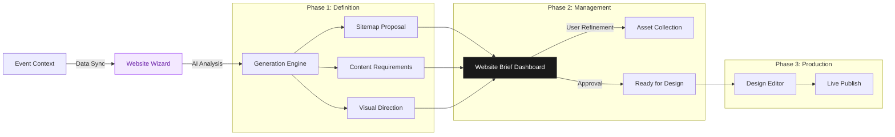

# FashionOS Website Wizard System
**Design System:** Luxury Utility  
**Focus:** AI-Powered Digital Experience Generation  
**Version:** 2.0

---

## 1. System Overview

The **Website Wizard System** is a dedicated sub-module of FashionOS designed to automate the creation of high-end event websites. It bridges the gap between a simple "Brief" and a fully functional "Digital Experience," using AI to generate sitemaps, copy, and layout recommendations based on the Event's core identity.

### Architecture Workflow

The system moves linear from **Intake** (Wizard) to **Management** (Brief Dashboard) to **Execution** (Design Editor).



---

## 2. Module A: The Brief Creation Wizard
*The intelligent intake form that translates human intent into technical requirements.*

**Tagline:** "Your vision, digitized."

### Visual Layout & Experience
*   **Layout:** Split-screen responsive.
    *   *Left (40%):* Minimalist form questions, focused and conversational.
    *   *Right (60%):* "Live Pulse" preview—a abstract visualization of the site growing as data is entered (e.g., nodes connecting as sitemap pages are added).
*   **Typography:** Large `Playfair Display` questions. `Inter` input fields.

### Key Screens

#### 1. Aesthetic Calibration
*   **Action:** User selects 3 keywords (e.g., "Minimalist", "Brutalist", "Ethereal").
*   **Visual:** Large, selectable high-fashion photography cards representing styles.
*   **AI Interaction:** "Based on 'Brutalist', we recommend high-contrast typography and raw grid layouts."

#### 2. Feature Selection
*   **Action:** Toggling functionality.
*   **UI Component:** "Luxury Toggle Cards" — large rectangular cards with an icon, title, and description.
*   **Options:**
    *   [ ] RSVP / Ticketing
    *   [ ] Livestream Player
    *   [ ] Virtual Showroom
    *   [ ] Press Kit Download

#### 3. Sitemap Generator
*   **Action:** AI proposes a page structure.
*   **Visual:** A tree graph visualization using Framer Motion.
*   **User Journey:** User can drag-and-drop to reorder or click "X" to remove a proposed page.

---

## 3. Module B: Website Brief Dashboard
*The project management suite for the generated plan. This is where the user spends the most time before design.*

**Tagline:** "The blueprint for perfection."

### UI/UX Design Strategy
*   **Background:** `#F7F7F5` (Stone) for reduced eye strain.
*   **Structure:** Tabbed Interface (Overview | Content | Sitemap | Assets).
*   **Header:** "Design Readiness Score" — a circular progress indicator (0-100%) showing how close the project is to handover.

### Screen Breakdown

#### 1. Brief Overview (Command Center)
*   **Hero Card:** "Next Best Action" bar (e.g., "Upload Hero Image for Homepage").
*   **Stats Grid:**
    *   *Pages:* 5
    *   *Assets Missing:* 12
    *   *Copy Status:* 60% Drafted
*   **Team:** Assign specific roles (Copywriter, Art Director) to the brief.

#### 2. Content Checklist
*   **Visual:** A dense, organized task list grouped by Page (Home, About, Runway).
*   **Interaction:**
    *   Clicking a task opens a "Drawer" from the right.
    *   **AI Copilot:** Inside the drawer, AI offers to "Draft Copy" based on the event theme.
*   **Status Indicators:**
    *   *Empty:* Gray circle
    *   *Drafted:* Amber dot
    *   *Approved:* Green check

#### 3. Sitemap Visualizer
*   **Visual:** Interactive flow chart showing user paths.
*   **Function:** Click a node to see "Page Goals" and "Key Modules".
*   **Data Sample:**
    ```json
    {
      "page": "Runway",
      "goal": "Livestream conversion",
      "modules": ["Video Player", "Look Carousel", "Shop the Look"]
    }
    ```

#### 4. Media Library (Smart Assets)
*   **Layout:** Masonry grid of uploaded images.
*   **AI Feature:** Auto-tagging (e.g., "Model", "Backstage", "Product").
*   **Quality Check:** System flags low-res images with a red warning badge ("Too small for Hero").

---

## 4. Module C: Design Editor (Preview)
*The final stage where the brief becomes code.*

**Tagline:** "Pixel perfect execution."

### Visual Layout
*   **Canvas:** Center stage, showing the rendered React components.
*   **Sidebar:** "The Inspector" — controls for adjusting padding, typography tokens, and colors.
*   **Toolbar:** "Device Toggles" (Mobile, Tablet, Desktop) to ensure responsiveness.

---

## 5. Style Guide Application

### Typography
*   **Headings:** `Playfair Display`, Weight 600. Used for Wizard questions and Dashboard Page Titles.
*   **UI Elements:** `Inter`, Weight 400/500. Used for form labels, buttons, and data tables.
*   **Monospace:** `JetBrains Mono`. Used for Asset IDs or technical specs.

### Color Palette (Digital Specific)
*   **Primary:** `#1A1A1A` (Charcoal) - Buttons, Active States.
*   **Secondary:** `#E5E5E5` (Light Gray) - Borders, Dividers.
*   **Accents:**
    *   *AI Magic:* Gradient text `from-indigo-500 to-purple-500`.
    *   *Error/Missing:* `#FEE2E2` (Soft Red).
    *   *Ready:* `#DCFCE7` (Soft Green).

### Component Specifications

**The "Smart Card" Pattern:**
Used in the Wizard for selection.
```tsx
<div className="border border-gray-200 p-6 rounded-xl hover:border-black transition-all cursor-pointer">
  <Icon className="w-6 h-6 mb-4 text-gray-900" />
  <h3 className="font-serif text-lg">Livestream</h3>
  <p className="text-sm text-gray-500">Enable real-time broadcasting.</p>
</div>
```

**The "AI Insight" Badge:**
Used in the Dashboard.
```tsx
<div className="bg-purple-50 border border-purple-100 text-purple-700 px-3 py-1 rounded-full text-xs font-medium flex gap-2">
  <Sparkles className="w-3 h-3" />
  <span>Recommended: Add a countdown timer</span>
</div>
```

---

## 6. User User Journey (The "Happy Path")

1.  **Start:** User clicks "New Website Project" in Event Command Center.
2.  **Wizard:** User spends 2 minutes selecting "Minimalist" vibe and "RSVP" features.
3.  **Generation:** Loading screen ("Gemini is drafting your sitemap...").
4.  **Dashboard:** User lands on Brief Dashboard. Readiness Score is 40%.
5.  **Action:** User uploads venue photos to Media Library. Readiness Score -> 55%.
6.  **Action:** User approves AI-drafted copy for "About" page. Readiness Score -> 70%.
7.  **Handoff:** User clicks "Generate Design". System builds the React site.
