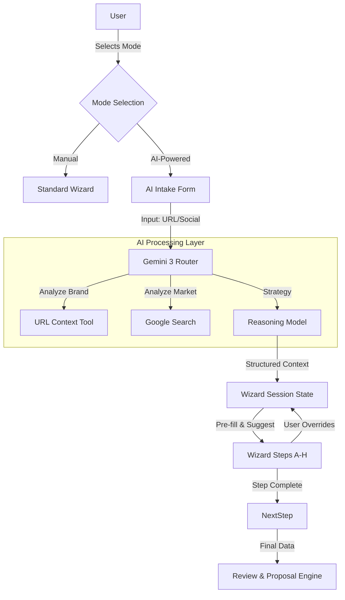
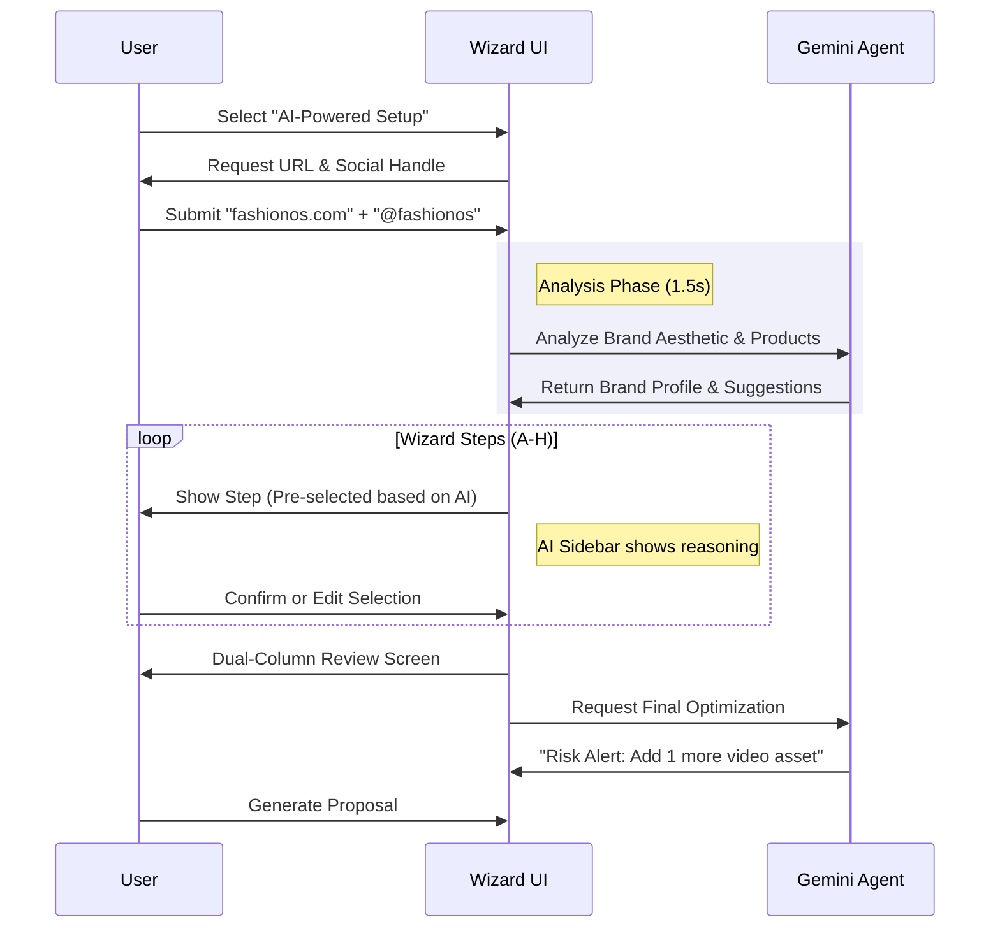

# Product Design: AI Shoot Wizard (v2.0)

**Status:** Draft  
**Role:** Senior UX Architect  
**Engine:** Gemini 3 Pro (Multimodal)  
**Design System:** Luxury Utility (FashionOS)

---

## 1. Executive Summary
The **FashionOS Shoot Wizard** is the core intake mechanism for commercial clients. This redesign introduces a "Co-pilot" architecture where AI acts as a strategic creative director, analyzing brand signals (URL, Instagram) to suggest high-conversion production plans.

**Core Philosophy:** "AI Assists. User Approves."
We never auto-commit critical business decisions. We pre-fill, suggest, and reason, but the user retains final creative control.

---

## 2. System Architecture & Flow

### High-Level Data Flow


### User Journeys


---

## 3. UI Specifications & Wireframes

### Global Layout Elements
*   **Progress Tracker:** Top-aligned, thin minimalist line.
    *   *Visual:* Gray-200 line with Black active segment.
    *   *Steps:* Numbered dots (1-8). Hover shows step name.
*   **AI Co-pilot Panel:** Sticky right sidebar (on Desktop), collapsible drawer (on Mobile).
    *   *State:* Shows contextual insights relevant to the *current* step only.

---

### Step 0: Mode Selection
**Layout:** Split Screen (50/50 Cards)

| Left Card (Manual) | Right Card (AI-Powered) |
| :--- | :--- |
| **Icon:** `Edit3` (Line art) | **Icon:** `Sparkles` (Gradient Fill) |
| **Title:** Manual Setup | **Title:** AI Creative Partner |
| **Desc:** Configure every detail of your shoot from scratch. | **Desc:** We analyze your brand to suggest optimal talent, scenes, and styles. |
| **Badge:** Standard | **Badge:** Recommended |
| **CTA:** "Start Manually" (Outline) | **CTA:** "Continue with AI" (Solid Black) |

---

### Step 1: Intelligence Intake
**Title:** "Tell us about your brand"  
**Subtitle:** "We use public data to tailor your production plan."

**Form Fields:**
1.  **Website URL** (Input with `Globe` icon)
2.  **Instagram Handle** (Input with `Instagram` icon)
3.  **Focus Keywords** (Tags input, e.g., "Luxury," "Streetwear")

**AI Trust Signal:**
*   *Microcopy:* "Powered by Gemini 3. We only analyze public facing data to establish aesthetic baselines."

**Action:**
*   **Primary:** "Analyze Brand" (Triggers 1.5s animation of scanning)
*   **Secondary:** "Skip to Manual"

---

### Steps 2-8: The Core Wizard (Enhanced)

**Layout Structure:**
*   **Main Content (Left 70%):** Grid of selection cards (Standard UI).
*   **AI Sidebar (Right 30%):** Contextual reasoning.

#### Step A: Shoot Type
*   **Options:** Photography, Video, Website, Social
*   **AI Behavior:**
    *   IF brand has Shopify store -> Auto-select **Photography**.
    *   **Sidebar Message:** "Based on your Shopify presence, we recommend starting with **Photography** to build your core catalog."

#### Step B: Category
*   **Options:** Fashion, Beauty, Jewelry, Product
*   **AI Behavior:**
    *   Visual Analysis of URL determines category.
    *   **UI:** Display "Confidence Meter" (e.g., "98% Match") next to the selected category.

#### Step C: Photography Types
*   **Options:** Packshot, On-Model, Flat Lay, Creative
*   **AI Behavior:**
    *   **Search Grounding:** "Competitors like [Brand A] and [Brand B] are heavily utilizing **On-Model** imagery this season."
    *   **Action:** Highlights "On-Model" card with a "Competitor Trend" badge.

#### Step D: Visual Style
*   **Options:** Editorial, Street, Minimal, Catalog
*   **AI Behavior:**
    *   **URL Context:** Analyzes brand fonts and whitespace.
    *   **Visual Tags:** Adds small tags below options:
        *   Minimal: "Matches your Website"
        *   Street: "High conversion for Instagram"

#### Step E: Scenes (The Budget Optimizer)
*   **AI Logic:** Code execution calculates scene cost vs. asset output.
*   **Sidebar Message:** "To maximize your budget, we suggest limiting to **2 Scenes**. This allows for 40% more shot volume."

#### Step F: Talent
*   **Options:** Product Only vs. Models
*   **AI Insight:** "Brands in your category see +22% CTR on ads featuring human models." (Source: Industry Benchmark).

#### Step G: Upgrades
*   **Options:** Styling, Makeup, Retouching
*   **AI ROI Labels:**
    *   Styling: [High ROI] (Green badge)
    *   Retouching: [Essential] (Black badge)

#### Step H: Channels
*   **Options:** Instagram, TikTok, Website, Amazon
*   **AI Behavior:** Content reuse engine.
    *   *Sidebar:* "Selecting **Instagram** will automatically request 4:5 and 9:16 crop variations."

---

## 4. The Enhanced Review Screen

**Layout:** Asymmetric Split (60/40)

### Left Column: The User Plan (Static Data)
A clean, receipt-style summary of choices.
*   *Header:* "Your Configuration"
*   *List:* Service, Category, Style, Scenes, Talent, Date.
*   *Edit Action:* Pencil icon next to each line.

### Right Column: AI Insights Panel (Dynamic Intelligence)
**Title:** "FashionOS Optimization"

**Cards Stack:**
1.  **Shot Mix Strategy:**
    *   *Insight:* "We've balanced 70% e-commerce with 30% editorial to feed your funnel."
    *   *Action:* [Adjust Ratio]
2.  **Risk Alert:**
    *   *Warning:* "You selected 'Video' but no 'Sound Design'. This may impact engagement."
    *   *Action:* [Add Sound Package (+$500)]
3.  **Channel Check:**
    *   *Insight:* "Your Amazon listing requires white background compliance."
    *   *Action:* [Add Compliance Check]

**Bottom Bar (Sticky):**
*   **Total Estimate:** $8,450
*   **Primary CTA:** "Generate Proposal" (Black Button)
*   **Secondary CTA:** "Save Draft" (Outline Button)

---

## 5. AI Prompt Strategy

### System Prompt Architecture
When initializing the Wizard Agent, we use the following structure:

```text
ROLE: Expert Fashion Producer & Creative Director.
CONTEXT: User is planning a commercial shoot. You have access to their URL and Social.
TASK: Guide the user step-by-step. At each step, analyze the input and provide 1 specific, data-backed recommendation.
TONE: Professional, succinct, luxury, authoritative but helpful.

TOOLS:
1. URL_Analyzer(url): Returns dominant colors, font style, product category.
2. Market_Scanner(keywords): Returns competitor trends.
3. ROI_Calculator(assets, budget): Returns efficiency score.

OUTPUT FORMAT:
Return JSON object for UI rendering:
{
  "recommended_option_id": "on_model",
  "confidence_score": 0.9,
  "sidebar_title": "Why On-Model?",
  "sidebar_body": "Your competitors [A, B] use models. This correlates with higher CTR.",
  "badges": [
    {"target_id": "minimal", "label": "Brand Match", "type": "success"}
  ]
}
```

---

## 6. Interaction & Motion Guidelines

**"Slow, Calm, Premium"**

1.  **Entrance:** AI suggestions do not "pop" up. They fade in and slide up (20px) over 0.6s (`easeOutQuart`).
2.  **Selection:** When AI selects a card, the border draws itself (SVG path animation) rather than just appearing.
3.  **Thinking:** When scanning a URL, use a subtle "breathing" opacity animation on the input field border. No spinning loaders unless absolutely necessary.
4.  **Confidence:** The "Confidence Meter" fills like a progress bar, easing gently to the final number.

---

## 7. Next Steps for Implementation

1.  **Frontend:** Update `ShootWizard.tsx` to accept a `mode` prop (Manual | AI).
2.  **State Management:** Create `WizardContext` to store both User Selections and AI Metadata.
3.  **UI Components:** Build the `AISidebar` and `ReviewInsightCard` components.
4.  **Mocking:** Since we don't have the live Gemini API connected yet, we will mock the AI responses with realistic latency (1.5s) to test the UX flow.
