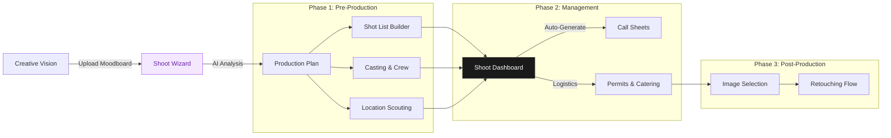

# FashionOS Shoot Builder System
**Design System:** Luxury Utility  
**Focus:** Photography & Video Production Management  
**Version:** 2.0

---

## 1. System Overview

The **Shoot Builder System** is a specialized module within FashionOS designed to streamline the chaotic process of fashion photography production. It transforms abstract creative concepts into concrete logistical plans (Call Sheets, Shot Lists, and Asset Deliverables) using AI to bridge the gap between "Mood" and "Execution."

### Architecture Workflow

The flow moves from **Creative Conception** to **Logistical Planning** to **On-Set Execution**.



---

## 2. Module A: The Concept Wizard
*The intake flow that structures creative chaos.*

**Tagline:** "From moodboard to movement."

### Visual Layout & Experience
*   **Layout:** Immersive, image-first.
    *   *Background:* Minimalist white/stone to let images pop.
    *   *Interaction:* Drag-and-drop moodboard construction.
*   **Typography:** Editorial style. Large `Playfair Display` headers.

### Key Screens

#### 1. Aesthetic Definition
*   **Action:** User uploads reference images or selects from FashionOS archives.
*   **Visual Component:** **"The Lightbox"** — A masonry grid where users can pin images.
*   **AI Feature:** "Style Extraction". The AI analyzes uploaded images and tags them (e.g., "High Contrast", "Golden Hour", "Urban Decay").

#### 2. Scope & Logistics
*   **Action:** Defining the constraints.
*   **UI Component:** **"Logistics Cards"**.
    *   *Type:* Editorial / E-commerce / Campaign / Social.
    *   *Scale:* Studio (Indoor) vs. Location (Outdoor).
    *   *Deliverables:* Number of final retouched images needed.

#### 3. Talent Casting (Mini-Directory)
*   **Action:** Selecting models, photographers, and stylists.
*   **Visual:** Horizontal scrolling "Comp Cards" (Headshot + Stats).
*   **Connection:** Pulls directly from the **Designer/Talent Directory**.

---

## 3. Module B: Shoot Production Dashboard
*The command center for the producer and art director.*

**Tagline:** "Orchestrating the perfect shot."

### UI/UX Design Strategy
*   **Aesthetic:** Reminiscent of a physical **Contact Sheet** or a **Production Binder**.
*   **Structure:** Tabbed (Overview | Shot List | Call Sheet | Team).
*   **Key Metaphor:** " The Clip" — organizing items into distinct "Looks" or "Sets".

### Screen Breakdown

#### 1. Production Overview
*   **Hero Section:** Shoot details (Date, Weather Forecast, Location Map).
*   **Critical Alerts:** "Rain Risk: 40% - View Indoor Backups".
*   **Budget Tracker:** Real-time spend vs. budget visualization.

#### 2. The Shot List Builder
*   **Visual:** A Kanban-style board, but rows represent "Looks" (Outfit changes).
*   **Card Design:**
    *   *Thumbnail:* Sketch or Reference image.
    *   *Inputs:* "Angle" (Wide, Macro), "Lighting" (Soft, Hard), "Product" (SKU #123).
*   **Interaction:** Drag-and-drop to reorder shot sequence based on lighting/logistics.

#### 3. Intelligent Call Sheet
*   **Function:** Automatically generated schedule based on the Shot List.
*   **Visual:** Clean, tabular timeline.
*   **AI Feature:** "Smart Scheduling". (e.g., "AI suggests moving Outdoor shots to 4 PM for Golden Hour").
*   **Export:** One-click PDF generation with a premium, branded layout.

#### 4. Wardrobe Rail (Digital Styling)
*   **Visual:** A virtual clothing rail.
*   **Action:** Assigning specific products to specific models/shots.
*   **Status:** Tracking "Shipped", "On Set", "Steamed", "Returned".

---

## 4. Module C: Post-Production Hub
*Managing the assets after the shoot.*

**Tagline:** "Select, Polish, Publish."

### Visual Layout
*   **The Contact Sheet:** Grid of raw images.
*   **Rating System:** Star ratings or "Traffic Light" system (Green = Select, Red = Reject).
*   **Version Control:** Slider comparing "Raw" vs "Retouched".

---

## 5. Style Guide Application

### Typography
*   **Headings:** `Playfair Display`, Weight 700. Used for "Shoot Name" and "Look Numbers".
*   **Data/Specs:** `JetBrains Mono`. Used for Timecodes, SKU numbers, and Camera Settings (ISO/Aperture).
*   **UI Elements:** `Inter`.

### Color Palette (Production Specific)
*   **Primary:** `#1A1A1A` (Charcoal).
*   **Canvas:** `#FFFFFF` (White) to ensure color accuracy of photos.
*   **Accents:**
    *   *Golden Hour:* `#F59E0B` (Warm Amber) for lighting notes.
    *   *Outdoor/Location:* `#10B981` (Emerald) for exterior tags.
    *   *Alert:* `#EF4444` (Red) for schedule delays.

### Component Specifications

**The "Shot Card" Pattern:**
Used in the Shot List Builder.
```tsx
<div className="bg-white border border-gray-200 p-4 rounded-lg shadow-sm flex gap-4">
  <div className="w-16 h-16 bg-gray-100 rounded-md overflow-hidden">
    
  </div>
  <div className="flex-1">
    <div className="flex justify-between">
        <h4 className="font-serif font-bold">Shot 04: The Hero</h4>
        <span className="text-xs font-mono text-gray-500">14:00 - 14:30</span>
    </div>
    <div className="flex gap-2 mt-2">
        <Badge variant="outline">Wide Angle</Badge>
        <Badge variant="outline">Video</Badge>
    </div>
  </div>
</div>
```

---

## 6. User Journey (The "Producer's Path")

1.  **Start:** Producer initiates "New Campaign Shoot".
2.  **Wizard:** Uploads moodboard. AI suggests "Urban Minimalist" theme.
3.  **Planning:** Producer drags "Look 1" and "Look 2" cards into the Shot List.
4.  **Scheduling:** AI warns that "Look 2" (Outdoor) conflicts with predicted rain.
5.  **Adjustment:** Producer drags "Look 2" to an indoor time slot.
6.  **Distribution:** Producer clicks "Publish Call Sheet". Team receives mobile-optimized links.
7.  **On-Set:** Photographer checks off shots on an iPad as they happen.
