# FashionOS - Complete Sitemap & Information Architecture

**Document Version:** 1.0  
**Last Updated:** December 9, 2025  
**Purpose:** Complete sitemap showing all pages, user flows, and navigation hierarchy

---

## Table of Contents

1. [Site Overview](#site-overview)
2. [Marketing Site Structure](#marketing-site-structure)
3. [Application Dashboard Structure](#application-dashboard-structure)
4. [User Journey Maps](#user-journey-maps)
5. [URL Structure](#url-structure)
6. [Navigation Hierarchy](#navigation-hierarchy)

---

## 1. Site Overview

FashionOS consists of three main areas:
- **Marketing Site** - Public-facing pages for lead generation
- **Application Dashboard** - Authenticated user workspace
- **Wizards & Tools** - Specialized workflows and creation tools

### High-Level Architecture

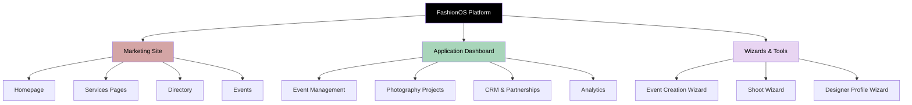

---

## 2. Marketing Site Structure

### Marketing Site Map

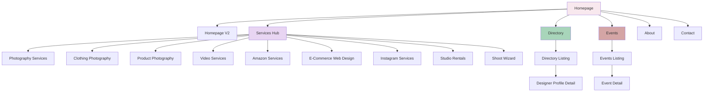

### Marketing Pages Inventory

| Page Name | URL | Purpose | CTA |
|-----------|-----|---------|-----|
| **Homepage** | `/` or `/home` | Primary landing, brand intro | Explore Services, Browse Directory |
| **Homepage V2** | `/home-v2` or `/v2` | Alternative premium homepage | Explore Services, Browse Directory |
| **Photography Services** | `/services` or `/photography` | General fashion photography | Book a Shoot |
| **Clothing Photography** | `/clothing` | Apparel/ghost mannequin | Get a Quote |
| **Product Photography** | `/product` | Product shots for e-commerce | Get a Quote |
| **Video Services** | `/video` | Campaign videos, Reels | Let's Create Your Video |
| **Amazon Services** | `/amazon` | Amazon-compliant photography | Get Amazon-Ready Images |
| **E-Commerce Web Design** | `/web-design` | Shopify/WooCommerce sites | Start Your Website Project |
| **Instagram Services** | `/instagram` | Instagram content creation | Grow Your Instagram |
| **Studio Rentals** | `/studios` or `/studio` | Studio hire information | Book a Studio |
| **Shoot Wizard** | `/wizard` or `/shoot` | Book photography shoot | Complete Booking |
| **Directory Listing** | `/directory` | Browse all designers | View Profile |
| **Designer Profile** | `/directory/detail` | Individual designer page | Contact Designer |
| **Events Listing** | `/events` | Browse fashion events | View Event Details |
| **Event Detail** | `/events/detail` | Individual event page | Register Interest |

---

## 3. Application Dashboard Structure

### Dashboard Navigation Map

```mermaid
graph TB
    DASH[Dashboard Home] --> EVENTMGMT[Event Management]
    DASH --> PHOTOMGMT[Photography Management]
    DASH --> CRM[CRM & Partnerships]
    DASH --> ANALYTICS[Analytics & Reports]
    
    EVENTMGMT --> COMMAND[Event Command Center]
    EVENTMGMT --> RUNWAY[Runway Stage]
    EVENTMGMT --> CASTING[Casting Models]
    EVENTMGMT --> VENUES[Venue Management]
    EVENTMGMT --> TASKS[Tasks & Deliverables]
    EVENTMGMT --> ACTIVATIONS[Brand Activations]
    
    PHOTOMGMT --> OVERVIEW[Project Overview]
    PHOTOMGMT --> SHOTLIST[Shot List Builder]
    PHOTOMGMT --> PRODUCTS[Products Dashboard]
    PHOTOMGMT --> GALLERY[Gallery Dashboard]
    
    CRM --> SPONSORS[Sponsor CRM]
    CRM --> DESIGNERS[Designer Directory]
    CRM --> CLIENTS[Client Dashboard]
    CRM --> CONTRACTS[Contracts Manager]
    
    ANALYTICS --> ROI[ROI Analytics]
    ANALYTICS --> BILLING[Billing Dashboard]
    
    COMMAND --> SPONSORDETAIL[Sponsor Detail]
    COMMAND --> DESIGNERPROFILE[Designer Profile]
    
    SPONSORS --> SPONSORPROFILE[Sponsor Profile]
    DESIGNERS --> DESIGNERDETAIL[Designer Detail]
    
    style DASH fill:#1A1A1A,color:#fff
    style EVENTMGMT fill:#D4A5A5
    style PHOTOMGMT fill:#A8D5BA
    style CRM fill:#E8D5F2
    style ANALYTICS fill:#F8E8EE
```

### Dashboard Pages Inventory

#### Event Management

| Page Name | URL/Route | Purpose | Key Features |
|-----------|-----------|---------|--------------|
| **Event Command Center** | `/command-center` | Central event dashboard | KPIs, AI insights, workflow tracking |
| **Runway Stage** | `/runway` | Runway show management | Show order, timing, model assignments |
| **Casting Models** | `/casting` | Model selection & management | Model cards, assignments, availability |
| **Venue Management** | `/venues` | Venue coordination | Venue profiles, capacity, bookings |
| **Tasks & Deliverables** | `/tasks` | Task management | 5-phase task lists, dependencies, deadlines |
| **Brand Activations** | `/activations` | Activation tracking | Activation cards, status, metrics |
| **Contracts Manager** | `/contracts` | Contract tracking | Contract status, e-signatures, deadlines |

#### Photography Management

| Page Name | URL/Route | Purpose | Key Features |
|-----------|-----------|---------|--------------|
| **Project Overview** | `/overview` or `/dashboard` | Photography project dashboard | Project cards, timeline, status |
| **Shot List Builder** | `/shotlist` | Build detailed shot lists | Shot templates, notes, assignments |
| **Products Dashboard** | `/products` | Product inventory | Product grid, metadata, categories |
| **Gallery Dashboard** | `/gallery` | Review & select images | Image gallery, favorites, delivery |

#### CRM & Partnerships

| Page Name | URL/Route | Purpose | Key Features |
|-----------|-----------|---------|--------------|
| **Sponsor CRM** | `/sponsors` | Sponsor pipeline management | Kanban board, deals, ROI tracking |
| **Sponsor Profile** | `/sponsors/profile` | Individual sponsor detail | Deal history, ROI data, contacts |
| **Sponsor Detail** | `/sponsor-detail` | Detailed sponsor view | Full sponsor information, analytics |
| **Designer Directory** | `/designers` | Designer database | Search, filter, AI matching |
| **Designer Profile** | `/designer-profile` | Individual designer detail | Collections, events, ratings |
| **Client Dashboard** | `/clients` | Client relationship management | Client list, projects, invoices |

#### Analytics & Reports

| Page Name | URL/Route | Purpose | Key Features |
|-----------|-----------|---------|--------------|
| **ROI Analytics** | `/analytics` or `/roi` | Event ROI tracking | Metrics, media value, sponsor ROI |
| **Billing Dashboard** | `/billing` | Financial management | Invoices, payments, revenue tracking |

---

## 4. User Journey Maps

### Journey 1: Event Planner Creating an Event

```mermaid
flowchart LR
    A[Landing Page] --> B[Browse Events Page]
    B --> C[Click 'Create Event']
    C --> D[Event Creation Wizard]
    D --> E[Step 1: Basic Info]
    E --> F[Step 2: Date & Location]
    F --> G[Step 3: Team]
    G --> H[Step 4: Budget]
    H --> I[Step 5: Designers]
    I --> J[Step 6: Sponsors]
    J --> K[Step 7: Review]
    K --> L[Event Command Center]
    L --> M[Manage Event]
    
    style A fill:#F8E8EE
    style D fill:#E8D5F2
    style L fill:#D4A5A5
    style M fill:#A8D5BA
```

### Journey 2: Designer Creating Profile

```mermaid
flowchart LR
    A[Homepage] --> B[Browse Directory]
    B --> C[Click 'Join as Designer']
    C --> D[Designer Profile Wizard]
    D --> E[Step 1: Basic Info]
    E --> F[Step 2: Categories]
    F --> G[Step 3: Collections]
    G --> H[Step 4: Brand Story]
    H --> I[Step 5: Sustainability]
    I --> J[Step 6: Media]
    J --> K[Step 7: Preview]
    K --> L[Designer Profile Live]
    L --> M[Receive Event Invites]
    
    style A fill:#F8E8EE
    style D fill:#E8D5F2
    style L fill:#A8D5BA
    style M fill:#D4A5A5
```

### Journey 3: Client Booking Photography Shoot

```mermaid
flowchart LR
    A[Homepage] --> B[Photography Services Page]
    B --> C[Select Service Type]
    C --> D[Click 'Book a Shoot']
    D --> E[Shoot Wizard]
    E --> F[Step 1: Service Selection]
    F --> G[Step 2: Project Details]
    G --> H[Step 3: Date & Location]
    H --> I[Step 4: Requirements]
    I --> J[Step 5: Contact Info]
    J --> K[Step 6: Confirmation]
    K --> L[Project Overview Dashboard]
    L --> M[Track Project]
    
    style A fill:#F8E8EE
    style E fill:#E8D5F2
    style L fill:#A8D5BA
```

### Journey 4: Sponsor Finding Events

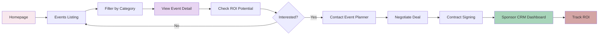

---

## 5. URL Structure

### URL Patterns & Conventions

#### Marketing Site URLs

```
/                           → Homepage (default)
/home                       → Homepage (explicit)
/home-v2                    → Homepage V2 (alternative)
/v2                         → Homepage V2 (short)

/services                   → Photography Services hub
/photography                → Photography Services (alias)
/clothing                   → Clothing Photography
/product                    → Product Photography
/video                      → Video Services
/amazon                     → Amazon Services
/web-design                 → E-Commerce Web Design
/instagram                  → Instagram Services
/studios                    → Studio Rentals
/studio                     → Studio Rentals (alias)

/wizard                     → Shoot Wizard
/shoot                      → Shoot Wizard (alias)

/directory                  → Directory Listing
/directory/detail           → Designer Profile Detail

/events                     → Events Listing
/events/detail              → Event Detail
/events/create              → Event Creation Wizard
/event-wizard               → Event Creation Wizard (alias)
```

#### Dashboard URLs

```
/dashboard                  → Dashboard Home (Project Overview)
/overview                   → Project Overview (alias)

# Event Management
/command-center             → Event Command Center
/runway                     → Runway Stage
/casting                    → Casting Models
/venues                     → Venue Management
/tasks                      → Tasks & Deliverables
/tasks/event-planning       → Event Planning Tasks
/tasks/sponsorship          → Sponsorship Tasks
/tasks/marketing            → Marketing Tasks
/tasks/operations           → Operations Tasks
/tasks/media                → Media Tasks
/activations                → Brand Activations
/contracts                  → Contracts Manager

# Photography Management
/shotlist                   → Shot List Builder
/products                   → Products Dashboard
/gallery                    → Gallery Dashboard

# CRM
/sponsors                   → Sponsor CRM
/sponsors/profile           → Sponsor Profile
/sponsor-detail             → Sponsor Detail (alternative)
/designers                  → Designer Directory
/designer-profile           → Designer Profile
/clients                    → Client Dashboard

# Analytics
/analytics                  → ROI Analytics
/roi                        → ROI Analytics (alias)
/billing                    → Billing Dashboard
```

---

## 6. Navigation Hierarchy

### Primary Navigation (Marketing Site)

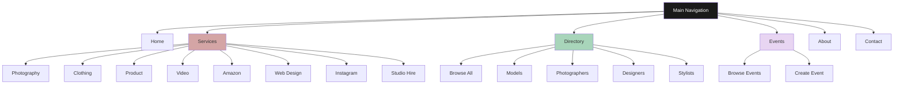

### Sidebar Navigation (Dashboard)

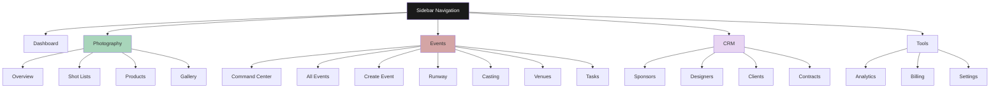

---

## 7. Page Relationship Matrix

### Cross-Page Navigation Flows

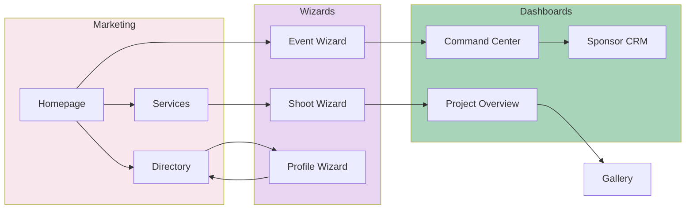

---

## 8. Content Hierarchy

### Information Architecture

```
FashionOS
│
├── Marketing Site (Public)
│   ├── Homepage
│   │   ├── Hero
│   │   ├── Latest Campaigns
│   │   ├── About
│   │   ├── Photography Highlight
│   │   ├── Testimonial
│   │   ├── Services Overview
│   │   ├── Directory Preview
│   │   ├── Marketplace
│   │   ├── Behind the Scenes
│   │   └── CTA
│   │
│   ├── Services
│   │   ├── Photography Services
│   │   ├── Clothing Photography
│   │   ├── Product Photography
│   │   ├── Video Services
│   │   ├── Amazon Services
│   │   ├── E-Commerce Web Design
│   │   ├── Instagram Services
│   │   └── Studio Rentals
│   │
│   ├── Directory
│   │   ├── Browse Designers
│   │   ├── Filter & Search
│   │   ├── Designer Profiles
│   │   └── Join as Designer
│   │
│   └── Events
│       ├── Events Listing
│       ├── Event Details
│       └── Create Event
│
├── Application (Authenticated)
│   ├── Event Management
│   │   ├── Event Command Center
│   │   ├── Runway Stage
│   │   ├── Casting Models
│   │   ├── Venue Management
│   │   ├── Tasks & Deliverables
│   │   ├── Brand Activations
│   │   └── Contracts Manager
│   │
│   ├── Photography Management
│   │   ├── Project Overview
│   │   ├── Shot List Builder
│   │   ├── Products Dashboard
│   │   └── Gallery Dashboard
│   │
│   ├── CRM & Partnerships
│   │   ├── Sponsor CRM
│   │   ├── Sponsor Profile
│   │   ├── Designer Directory
│   │   ├── Designer Profile
│   │   └── Client Dashboard
│   │
│   └── Analytics & Reports
│       ├── ROI Analytics
│       └── Billing Dashboard
│
└── Wizards & Tools
    ├── Event Creation Wizard (7 steps)
    ├── Shoot Wizard (6 steps)
    └── Designer Profile Wizard (7 steps)
```

---

## 9. SEO & URL Best Practices

### URL Naming Conventions

✅ **Do:**
- Use lowercase letters
- Use hyphens for multi-word URLs (`/web-design`)
- Keep URLs short and descriptive
- Use semantic naming (`/events/detail` not `/events/page2`)
- Maintain consistency (`/services` not `/service`)

❌ **Don't:**
- Use underscores (`/web_design`)
- Use uppercase letters
- Include file extensions (`.html`, `.php`)
- Use query parameters for primary navigation
- Create deep nesting (max 3 levels)

### Canonical URL Structure

```
https://fashionos.com/                    → Homepage
https://fashionos.com/services            → Services Hub
https://fashionos.com/clothing            → Clothing Photography
https://fashionos.com/directory           → Directory Listing
https://fashionos.com/directory/detail    → Designer Profile
https://fashionos.com/events              → Events Listing
https://fashionos.com/events/detail       → Event Detail
```

---

## 10. Breadcrumb Patterns

### Example Breadcrumbs

**Marketing Pages:**
```
Home > Services > Clothing Photography
Home > Directory > Designer Profile (Elena Rousseau)
Home > Events > Event Detail (Paris Fashion Week)
```

**Dashboard Pages:**
```
Dashboard > Event Management > Event Command Center
Dashboard > Photography > Shot List Builder
Dashboard > CRM > Sponsor Profile (Luxury Watch Brand)
```

---

## 11. Sitemap Statistics

### Page Count Summary

| Category | Page Count | Notes |
|----------|------------|-------|
| **Marketing Pages** | 15 | Public-facing lead generation |
| **Dashboard Pages** | 19 | Authenticated user workspace |
| **Wizards** | 3 | Multi-step creation flows |
| **Total Pages** | 37 | Complete application |

### URL Summary

| URL Type | Count | Example |
|----------|-------|---------|
| Marketing URLs | 15 | `/services`, `/directory` |
| Dashboard URLs | 19 | `/command-center`, `/sponsors` |
| Wizard URLs | 3 | `/wizard`, `/event-wizard` |
| Alias URLs | 8 | `/photography` → `/services` |
| **Total** | **45** | Including aliases |

---

## 12. Future Expansion

### Planned Pages (Roadmap)

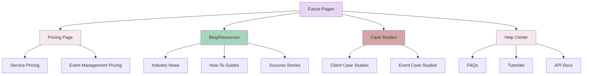

---

## 13. Mobile Navigation

### Mobile Menu Structure

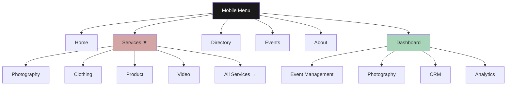

---

## 14. Footer Navigation

### Footer Link Structure

```
Column 1: About
- Our Story
- Team
- Careers
- Press
- Home V2 (New)

Column 2: Services
- Photography Services
- Clothing Photography
- Product Photography
- Video Services
- Amazon Services
- E-Commerce Web Design
- Instagram Services
- Start New Shoot
- Studio Hire
- Campaigns
- Runway
- Video & Social

Column 3: Directory
- Models
- Photographers
- Designers
- Stylists

Column 4: Contact
- hello@fashionos.com
- +1 (555) 123-4567
- New York, NY
- Book a Call
```

---

## 15. Search & Discovery

### Search Scope by Section

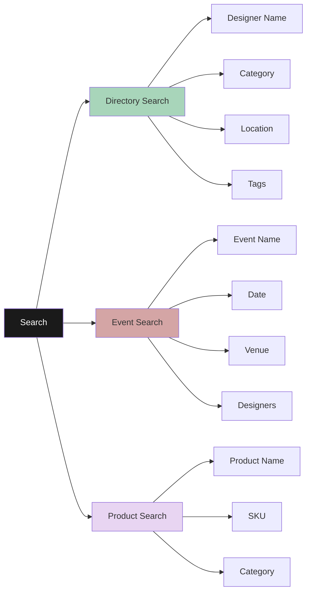

---

## 16. Access Control Matrix

### Page Access by User Role

| Page | Public | Client | Designer | Event Planner | Admin |
|------|--------|--------|----------|---------------|-------|
| **Homepage** | ✅ | ✅ | ✅ | ✅ | ✅ |
| **Services Pages** | ✅ | ✅ | ✅ | ✅ | ✅ |
| **Directory Listing** | ✅ | ✅ | ✅ | ✅ | ✅ |
| **Designer Profile (Public)** | ✅ | ✅ | ✅ | ✅ | ✅ |
| **Events Listing** | ✅ | ✅ | ✅ | ✅ | ✅ |
| **Shoot Wizard** | ✅ | ✅ | ❌ | ❌ | ✅ |
| **Project Overview** | ❌ | ✅ | ❌ | ❌ | ✅ |
| **Shot List Builder** | ❌ | ✅ | ❌ | ❌ | ✅ |
| **Gallery Dashboard** | ❌ | ✅ | ❌ | ❌ | ✅ |
| **Event Command Center** | ❌ | ❌ | ❌ | ✅ | ✅ |
| **Sponsor CRM** | ❌ | ❌ | ❌ | ✅ | ✅ |
| **Designer Directory (Dashboard)** | ❌ | ❌ | ✅ | ✅ | ✅ |
| **ROI Analytics** | ❌ | ❌ | ❌ | ✅ | ✅ |
| **Billing Dashboard** | ❌ | ✅ | ✅ | ✅ | ✅ |

---

## 17. Complete Page Index

### Alphabetical Page List

```
├── About Page (planned)
├── Amazon Services → /amazon
├── Analytics (ROI) → /analytics or /roi
├── Billing Dashboard → /billing
├── Brand Activations → /activations
├── Casting Models → /casting
├── Client Dashboard → /clients
├── Clothing Photography → /clothing
├── Command Center → /command-center
├── Contact Page (planned)
├── Contracts Manager → /contracts
├── Designer Collection (dashboard) → /designer
├── Designer Directory (marketing) → /directory
├── Designer Directory (dashboard) → /designers
├── Designer Profile (marketing) → /directory/detail
├── Designer Profile (dashboard) → /designer-profile
├── Designer Profile Wizard → /directory-wizard
├── E-Commerce Web Design → /web-design
├── Event Command Center → /command-center
├── Event Creation Wizard → /event-wizard or /events/create
├── Event Detail → /events/detail
├── Events Listing → /events
├── Gallery Dashboard → /gallery
├── Homepage → / or /home
├── Homepage V2 → /home-v2 or /v2
├── Instagram Services → /instagram
├── Photography Services → /services or /photography
├── Product Photography → /product
├── Products Dashboard → /products
├── Project Overview → /overview or /dashboard
├── Runway Stage → /runway
├── Shoot Wizard → /wizard or /shoot
├── Shot List Builder → /shotlist
├── Sponsor CRM → /sponsors
├── Sponsor Detail → /sponsor-detail
├── Sponsor Profile → /sponsors/profile
├── Studio Rentals → /studios or /studio
├── Tasks & Deliverables → /tasks
├── Venue Management → /venues
└── Video Services → /video
```

---

## 18. XML Sitemap Structure

### Sample XML Sitemap (for SEO)

```xml
<?xml version="1.0" encoding="UTF-8"?>
<urlset xmlns="http://www.sitemaps.org/schemas/sitemap/0.9">
  
  <!-- Homepage -->
  <url>
    <loc>https://fashionos.com/</loc>
    <lastmod>2025-12-09</lastmod>
    <changefreq>weekly</changefreq>
    <priority>1.0</priority>
  </url>
  
  <!-- Services Pages -->
  <url>
    <loc>https://fashionos.com/services</loc>
    <lastmod>2025-12-09</lastmod>
    <changefreq>monthly</changefreq>
    <priority>0.9</priority>
  </url>
  
  <url>
    <loc>https://fashionos.com/clothing</loc>
    <lastmod>2025-12-09</lastmod>
    <changefreq>monthly</changefreq>
    <priority>0.8</priority>
  </url>
  
  <url>
    <loc>https://fashionos.com/product</loc>
    <lastmod>2025-12-09</lastmod>
    <changefreq>monthly</changefreq>
    <priority>0.8</priority>
  </url>
  
  <!-- Directory -->
  <url>
    <loc>https://fashionos.com/directory</loc>
    <lastmod>2025-12-09</lastmod>
    <changefreq>daily</changefreq>
    <priority>0.9</priority>
  </url>
  
  <!-- Events -->
  <url>
    <loc>https://fashionos.com/events</loc>
    <lastmod>2025-12-09</lastmod>
    <changefreq>daily</changefreq>
    <priority>0.9</priority>
  </url>
  
  <!-- Additional pages... -->
  
</urlset>
```

---

## 19. Navigation Best Practices

### UX Guidelines

**Marketing Site:**
- Sticky header with main navigation
- Hamburger menu on mobile (<768px)
- Footer with comprehensive link map
- Clear CTAs on every page
- Breadcrumbs for deep pages

**Dashboard:**
- Persistent sidebar navigation (desktop)
- Collapsible sidebar (tablet)
- Bottom tab bar (mobile)
- Active state highlighting
- Quick action buttons

---

## 20. Sitemap Maintenance

### Update Frequency

| Category | Update Frequency | Owner |
|----------|------------------|-------|
| Marketing URLs | Quarterly | Marketing Team |
| Dashboard URLs | As features ship | Product Team |
| Wizard Flows | As updated | Product Team |
| Footer Links | Quarterly | Marketing Team |
| XML Sitemap | Monthly (automated) | SEO Team |

### Version History

| Version | Date | Changes | Updated By |
|---------|------|---------|------------|
| 1.0 | 2025-12-09 | Initial complete sitemap | Documentation Team |

---

**Document Owner:** Product Team  
**Last Review:** December 9, 2025  
**Next Review:** March 2026  
**Feedback:** Contact product@fashionos.com
