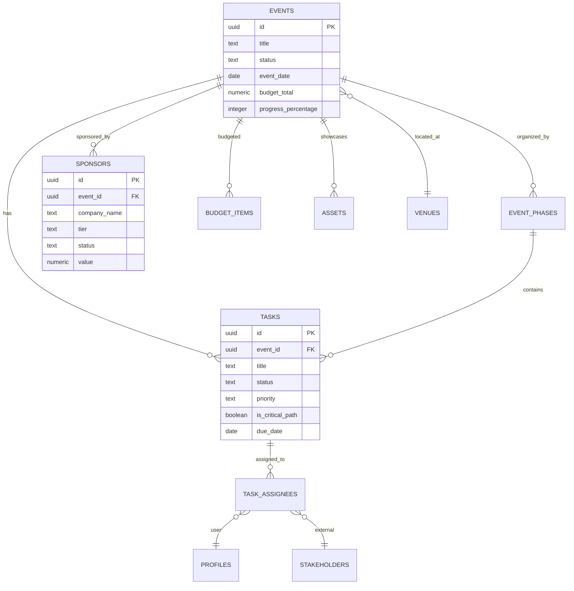
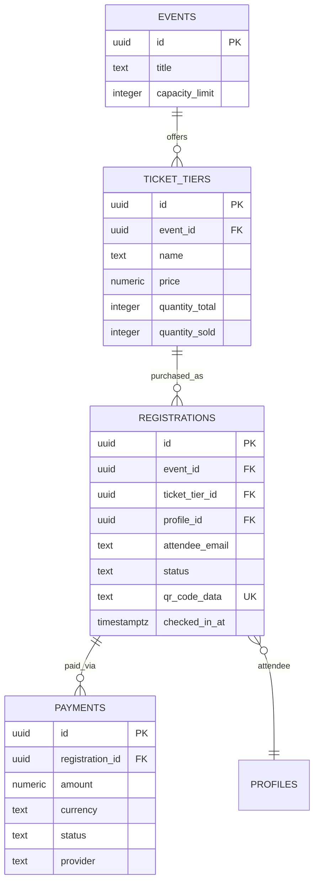
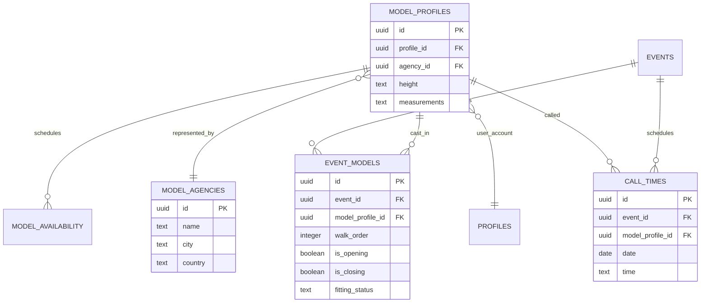
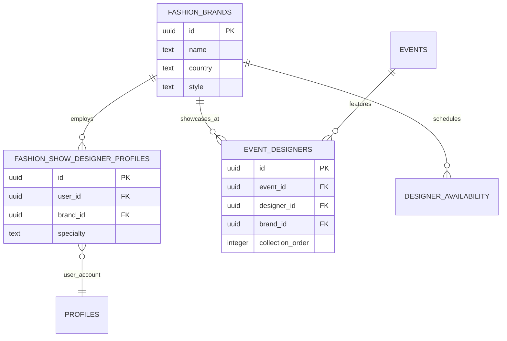
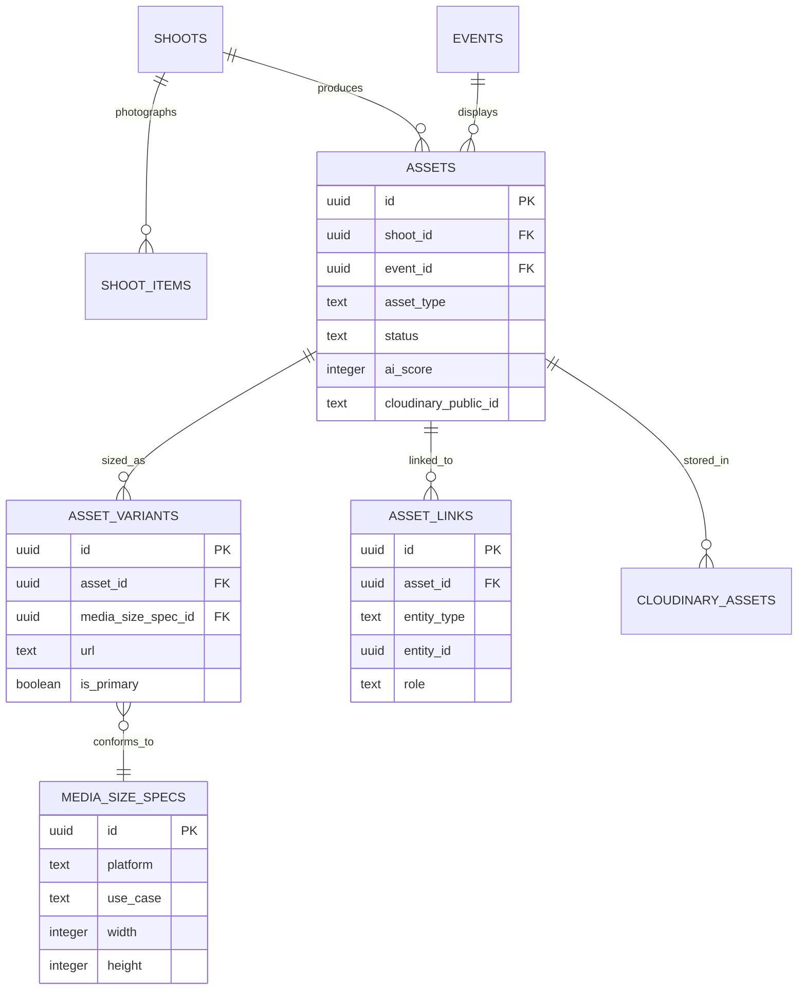
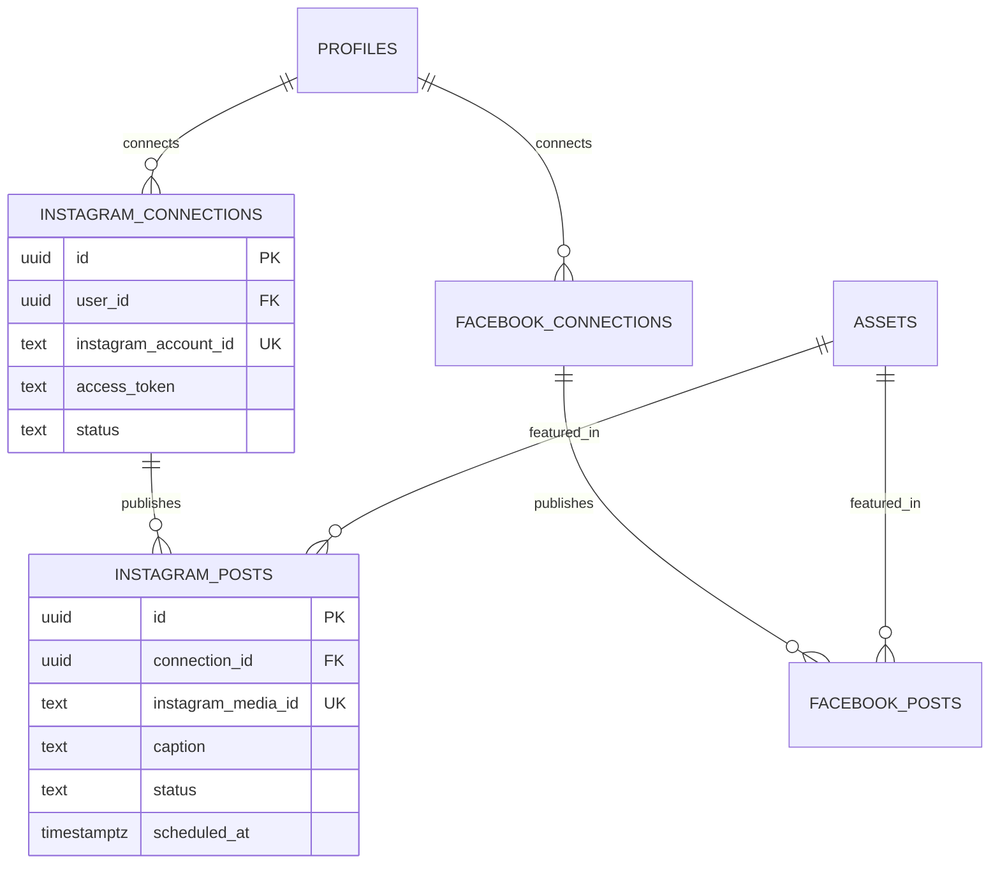
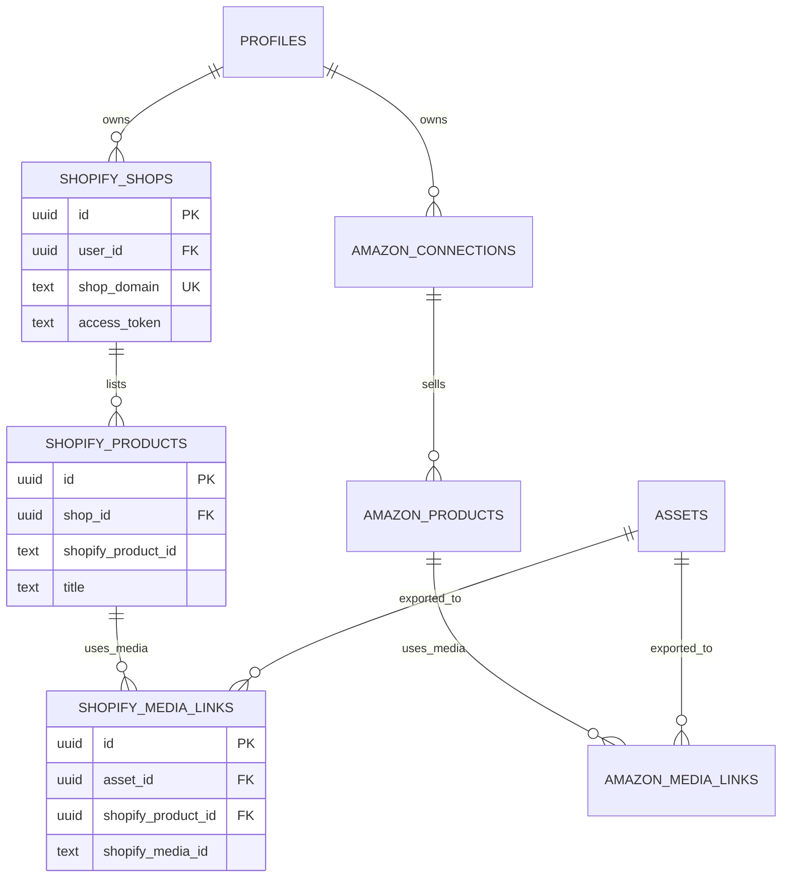

# Entity Relationship Diagrams
## FashionOS Complete Data Model

**Database:** FashionOS Production Schema  
**Created:** December 20, 2024  
**Total Tables:** 50+

---

## COMPLETE ERD — All 50+ Tables

```mermaid
erDiagram
    %% CORE IDENTITY
    PROFILES ||--o{ ORGANIZATIONS : "owns"
    PROFILES ||--o{ ORGANIZER_TEAMS : "creates"
    PROFILES ||--o{ MODEL_PROFILES : "has"
    PROFILES ||--o{ STAKEHOLDERS : "manages"
    PROFILES ||--o{ FASHION_SHOW_DESIGNER_PROFILES : "represents"
    PROFILES ||--o{ EVENTS : "organizes"
    PROFILES ||--o{ TASKS : "assigned"
    PROFILES ||--o{ CAMPAIGNS : "creates"
    
    ORGANIZATIONS ||--o{ EVENTS : "hosts"
    ORGANIZATIONS ||--o{ SHOOTS : "orders"
    ORGANIZATIONS ||--o{ CAMPAIGNS : "owns"
    
    %% EVENT MANAGEMENT
    EVENTS ||--o{ TICKET_TIERS : "offers"
    EVENTS ||--o{ REGISTRATIONS : "receives"
    EVENTS ||--o{ EVENT_PHASES : "contains"
    EVENTS ||--o{ TASKS : "tracks"
    EVENTS ||--o{ EVENT_STAKEHOLDERS : "involves"
    EVENTS ||--o{ EVENT_ASSETS : "displays"
    EVENTS ||--o{ EVENT_SCHEDULES : "schedules"
    EVENTS ||--o{ EVENT_REHEARSALS : "plans"
    EVENTS ||--o{ EVENT_MODELS : "casts"
    EVENTS ||--o{ EVENT_DESIGNERS : "features"
    EVENTS ||--o{ EVENT_SPONSORS : "sponsored_by"
    EVENTS ||--o{ SPONSORS : "pipeline"
    EVENTS ||--o{ BUDGET_ITEMS : "budgets"
    EVENTS ||--o{ ASSETS : "gallery"
    EVENTS ||--o{ CALL_TIMES : "schedules"
    EVENTS }o--|| VENUES : "held_at"
    EVENTS }o--|| ORGANIZER_TEAMS : "managed_by"
    
    TICKET_TIERS ||--o{ REGISTRATIONS : "sold_as"
    REGISTRATIONS ||--o{ PAYMENTS : "requires"
    
    EVENT_PHASES ||--o{ TASKS : "groups"
    TASKS ||--o{ TASK_ASSIGNEES : "assigned_to"
    
    %% TEAM MANAGEMENT
    STAKEHOLDERS ||--o{ TASK_ASSIGNEES : "receives"
    STAKEHOLDERS ||--o{ EVENT_STAKEHOLDERS : "participates"
    STAKEHOLDERS ||--o{ ORGANIZER_TEAM_MEMBERS : "joins"
    STAKEHOLDERS ||--o{ CALL_TIMES : "scheduled"
    
    ORGANIZER_TEAMS ||--o{ ORGANIZER_TEAM_MEMBERS : "includes"
    
    %% CASTING & MODELS
    MODEL_PROFILES ||--o{ EVENT_MODELS : "walks_in"
    MODEL_PROFILES ||--o{ MODEL_AVAILABILITY : "available"
    MODEL_PROFILES ||--o{ CALL_TIMES : "called"
    MODEL_PROFILES }o--|| MODEL_AGENCIES : "represented_by"
    
    FASHION_BRANDS ||--o{ FASHION_SHOW_DESIGNER_PROFILES : "owns"
    FASHION_BRANDS ||--o{ EVENT_DESIGNERS : "showcases"
    FASHION_BRANDS ||--o{ DESIGNER_AVAILABILITY : "available"
    
    SPONSOR_ORGANIZATIONS ||--o{ EVENT_SPONSORS : "sponsors"
    SPONSOR_ORGANIZATIONS ||--o{ SPONSORSHIP_PACKAGES : "purchases"
    
    %% VENUES
    VENUES ||--o{ EVENTS : "hosts"
    VENUES ||--o{ VENUE_AVAILABILITY : "availability"
    
    %% SHOOTS
    SHOOTS ||--o{ SHOOT_ITEMS : "contains"
    SHOOTS ||--o{ SHOOT_ASSETS : "produces"
    SHOOTS ||--o{ SHOOT_PAYMENTS : "billed"
    SHOOTS ||--o{ ASSETS : "creates"
    
    %% MEDIA & ASSETS
    ASSETS ||--o{ ASSET_VARIANTS : "has_versions"
    ASSETS ||--o{ ASSET_LINKS : "linked_to"
    ASSETS ||--o{ CLOUDINARY_ASSETS : "stored_in"
    ASSETS ||--o{ SHOPIFY_MEDIA_LINKS : "exported_to_shopify"
    ASSETS ||--o{ AMAZON_MEDIA_LINKS : "exported_to_amazon"
    ASSETS }o--|| MEDIA_SIZE_SPECS : "sized_for"
    
    %% SOCIAL MEDIA
    PROFILES ||--o{ INSTAGRAM_CONNECTIONS : "connects"
    PROFILES ||--o{ FACEBOOK_CONNECTIONS : "connects"
    PROFILES ||--o{ SHOPIFY_SHOPS : "owns"
    PROFILES ||--o{ AMAZON_CONNECTIONS : "owns"
    
    INSTAGRAM_CONNECTIONS ||--o{ INSTAGRAM_POSTS : "publishes"
    FACEBOOK_CONNECTIONS ||--o{ FACEBOOK_POSTS : "publishes"
    SHOPIFY_SHOPS ||--o{ SHOPIFY_PRODUCTS : "lists"
    AMAZON_CONNECTIONS ||--o{ AMAZON_PRODUCTS : "sells"
    
    SHOPIFY_PRODUCTS ||--o{ SHOPIFY_MEDIA_LINKS : "uses"
    AMAZON_PRODUCTS ||--o{ AMAZON_MEDIA_LINKS : "uses"
    
    %% TABLE DEFINITIONS
    PROFILES {
        uuid id PK
        text full_name
        text email UK
        text avatar_url
        text role
        timestamptz created_at
    }
    
    ORGANIZATIONS {
        uuid id PK
        uuid owner_id FK
        text name
        text slug UK
        text plan
        timestamptz created_at
        timestamptz updated_at
    }
    
    EVENTS {
        uuid id PK
        uuid organizer_id FK
        uuid venue_id FK
        uuid organizer_team_id FK
        uuid organization_id FK
        text title
        text slug UK
        text status
        text event_type
        boolean is_public
        timestamptz start_time
        timestamptz end_time
        date event_date
        integer capacity_limit
        numeric budget_total
        numeric budget_actual
        integer progress_percentage
        timestamptz created_at
        timestamptz updated_at
    }
    
    TASKS {
        uuid id PK
        uuid event_id FK
        uuid phase_id FK
        uuid assigned_to FK
        text title
        text status
        text priority
        text workflow_phase
        boolean is_critical_path
        date due_date
        uuid[] dependency_task_ids
        timestamptz created_at
        timestamptz updated_at
    }
    
    SPONSORS {
        uuid id PK
        uuid event_id FK
        text company_name
        text tier
        text status
        numeric value
        integer fit_score
        timestamptz created_at
        timestamptz updated_at
    }
    
    BUDGET_ITEMS {
        uuid id PK
        uuid event_id FK
        text category
        text item_name
        numeric budgeted_amount
        numeric actual_amount
        text status
        timestamptz created_at
        timestamptz updated_at
    }
    
    ASSETS {
        uuid id PK
        uuid event_id FK
        uuid shoot_id FK
        uuid uploaded_by FK
        text name
        text asset_type
        text status
        text file_url
        integer ai_score
        timestamptz created_at
        timestamptz updated_at
    }
    
    CAMPAIGNS {
        uuid id PK
        uuid organization_id FK
        uuid created_by FK
        text name
        jsonb brand_signals
        jsonb strategy
        jsonb assets
        jsonb channel_packs
        text status
        timestamptz created_at
        timestamptz updated_at
    }
```



---

## DOMAIN-SPECIFIC ERDS

### 1. Event Management Core



---

### 2. Ticketing & Payments



---

### 3. Casting & Model Management



---

### 4. Designer & Brand Management



---

### 5. Media & Assets Pipeline



---

### 6. Social Media Integration



---

### 7. E-Commerce Integration



---

## RELATIONSHIP STATISTICS

### Foreign Key Relationships

| From Table | To Table | Relationship Type | Cardinality |
|------------|----------|-------------------|-------------|
| events | organizations | Many-to-One | N:1 |
| events | profiles (organizer) | Many-to-One | N:1 |
| events | venues | Many-to-One | N:1 (optional) |
| tasks | events | Many-to-One | N:1 |
| tasks | profiles (assigned) | Many-to-One | N:1 (optional) |
| sponsors | events | Many-to-One | N:1 |
| budget_items | events | Many-to-One | N:1 |
| assets | events | Many-to-One | N:1 (optional) |
| assets | shoots | Many-to-One | N:1 (optional) |
| event_models | events | Many-to-One | N:1 |
| event_models | model_profiles | Many-to-One | N:1 |
| event_designers | events | Many-to-One | N:1 |
| event_designers | fashion_brands | Many-to-One | N:1 |
| registrations | ticket_tiers | Many-to-One | N:1 |
| payments | registrations | Many-to-One | N:1 |

**Total Foreign Keys:** 78+

### Join Tables (Many-to-Many)

| Join Table | Left Entity | Right Entity | Purpose |
|------------|-------------|--------------|---------|
| task_assignees | tasks | profiles/stakeholders | Multi-assign tasks |
| event_stakeholders | events | stakeholders | Event team roster |
| event_models | events | model_profiles | Model casting |
| event_designers | events | fashion_brands | Designer lineup |
| event_sponsors | events | sponsor_organizations | Sponsorship deals |
| organizer_team_members | organizer_teams | profiles/stakeholders | Team membership |
| shopify_media_links | assets | shopify_products | Asset export tracking |
| amazon_media_links | assets | amazon_products | Asset export tracking |

**Total Join Tables:** 8

### Polymorphic Relationships

| Table | Polymorphic Column | Target Entities |
|-------|-------------------|-----------------|
| asset_links | entity_type, entity_id | events, shoots, products, brands |
| call_times | model_profile_id, designer_id, stakeholder_id | models, designers, stakeholders |

---

## CARDINALITY SUMMARY

```
Organizations (1) ←→ (N) Events
Events (1) ←→ (N) Tasks
Events (1) ←→ (N) Sponsors
Events (1) ←→ (N) Budget Items
Events (1) ←→ (N) Assets
Events (1) ←→ (N) Registrations
Ticket Tiers (1) ←→ (N) Registrations
Registrations (1) ←→ (N) Payments
Events (N) ←→ (N) Models (via event_models)
Events (N) ←→ (N) Designers (via event_designers)
Events (N) ←→ (N) Stakeholders (via event_stakeholders)
Assets (1) ←→ (N) Asset Variants
Assets (N) ←→ (N) Products (via media_links)
```

---

## CASCADE BEHAVIOR

### ON DELETE CASCADE
These relationships will **automatically delete child records** when parent is deleted:

- `events` → `tasks`, `sponsors`, `budget_items`, `assets`, `ticket_tiers`, `event_models`, `event_designers`
- `tasks` → `task_assignees`
- `shoots` → `shoot_items`, `shoot_assets`
- `assets` → `asset_variants`, `asset_links`
- `organizations` → `events` (entire event tree deleted)

### ON DELETE RESTRICT
These relationships will **block deletion** if child records exist:

- `profiles` → `events` (cannot delete user who created events)
- `profiles` → `assets` (cannot delete uploader)

### ON DELETE SET NULL
These relationships will **nullify** foreign keys:

- `tasks.assigned_to` (task remains but unassigned)
- `events.venue_id` (event remains but loses venue link)

---

*Last Updated: December 20, 2024*  
*Total Relationships: 78+ foreign keys*  
*Join Tables: 8*  
*Polymorphic: 2*
